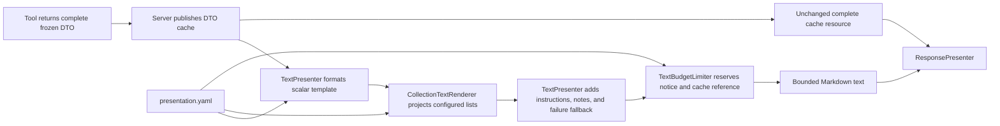

<!-- docs/development/issue456/design.md -->
<!-- template=design version=5827e841 created=2026-08-20T19:53Z updated=2026-08-20 -->
# Compact Actionable Tool Summaries — Design

**Status:** APPROVED  
**Version:** 1.2  
**Last Updated:** 2026-08-21

---

## Purpose

Define the configuration and presentation-layer contracts for bounded, actionable MCP tool text while preserving the complete resource cache.

## Scope

**In Scope:** TextPresenter orchestration, recursive collection projection, UTF-8 byte limiting, presentation configuration validation, scalar template enrichment, and durable behavioral tests.

**Out of Scope:** Tool execution semantics, DTO changes, cache payload changes, transport-wide resource limits, sorting/filtering, tool-name-specific renderer code, and unrelated documentation modernization.

## Prerequisites

1. [Approved Research](research.md)
2. [Architecture Principles](../../coding_standards/ARCHITECTURE_PRINCIPLES.md)
3. [Documentation Standard](../../coding_standards/DOCUMENTATION_STANDARD.md)

---

## 1. Context & Requirements

### 1.1. Problem Statement

Current scalar-only presentation templates make routine tool results under-informative, while inlining complete DTOs would recreate context growth. The design must add bounded declarative projections and a hard text budget without changing structured outputs or cache authority.

### 1.2. Requirements

**Functional:**

- Render configured flat and nested collections in DTO order with one per-tool item limit.
- Keep user-facing collection, omission, and truncation wording in presentation.yaml.
- Apply one configurable 8,000 UTF-8-byte ceiling to every TextPresenter result.
- Preserve a truncation notice and cache URI inside the budget whenever a cache URI exists.
- Handle cache-publication failure explicitly when no resource URI can be retained.
- Validate collection paths and placeholders against tool output models at startup.
- Enforce exact bidirectional parity between registered public tool names and `presentation.yaml` tool keys at startup.
- Implement and verify the approved field-level target for every one of the 50 registered tool templates.
- Keep deep logs, tracebacks, schemas, diffs, and full result sets in the cache.
- Enrich the approved scalar templates, correct the two contradictory outcome templates, and review every compact scalar template against the approved field audit.

**Non-Functional:**

- Introduce no tool-name branches; presentation configuration remains the content source of truth.
- Keep DTOs, tool inputs, cache URIs, and resource payloads compatible.
- Fail fast on invalid or internally inconsistent presentation configuration.
- Use cohesive, testable presentation services without speculative interfaces.
- Test durable observable behavior rather than exact prose snapshots.
- Preserve valid UTF-8 and readable Markdown after truncation.

### 1.3. Constraints

- The Approved Strategy is binding.
- PresentationConfig remains a frozen pure Pydantic value object loaded only by ConfigLoader.
- Tests use public APIs only.
- The existing ResponsePresenter and ITextPresenter external contracts remain unchanged.
- Both obsolete documentation-test modules and their 62 cases are deleted during Implementation, without replacement by textual snapshot tests.

---

## 2. Design Options

### 2.1. Option A: Extend TextPresenter only

Put recursive collection rendering, alignment, and byte limiting directly into the existing presenter.

**Pros:**

- Smallest file-count change.
- Keeps one public entry point.

**Cons:**

- Combines orchestration, recursive projection, and byte-budget policy.
- Makes focused behavioral testing and maintenance harder.
- Increases the risk of another monolithic presentation service.

### 2.2. Option B: Compose concrete presentation services

Keep TextPresenter as coordinator and delegate collection projection and final byte limiting to two concrete, pure presentation services.

**Pros:**

- Preserves single responsibility.
- Supports focused public-contract tests.
- Needs no speculative protocol or domain change.
- Leaves ResponsePresenter and the transport boundary untouched.

**Cons:**

- Adds two small production components.
- Requires explicit construction in the existing presentation composition path.

### 2.3. Option C: Tool-specific renderers

Create specialized renderer logic for each long-output tool.

**Pros:**

- Maximum per-tool flexibility.

**Cons:**

- Violates the Approved Strategy.
- Creates tool-name branching and configuration drift.
- Scales linearly with every new tool.

---

## 3. Chosen Design

**Decision:** Compose a generic CollectionTextRenderer and TextBudgetLimiter under TextPresenter, driven by a recursive collection schema and one per-tool item limit in presentation.yaml.

**Rationale:** This is the smallest design that handles both flat tool results and the nested project plan while preserving configuration ownership, DTO order, cache authority, SRP, and fail-fast validation. Concrete services avoid an unnecessary interface hierarchy.

### 3.1. Component Responsibilities

| Component | Responsibility | Explicitly does not own |
|---|---|---|
| Tool and output DTO | Produce complete structured result data. | Markdown, item limits, byte limits. |
| ConfigLoader and PresentationConfig | Parse and validate presentation policy. | Runtime rendering, tool registration ownership, or cache publication. |
| Startup presentation alignment | Compare the authoritative registered public-tool set with configured keys and validate every configured template against its output model. | Register tools or choose presentation content. |
| SafeNoneFormatter | Format scalar values and bounded flat scalar sequences consistently. | Tool identity, nested model rendering, final byte enforcement. |
| CollectionTextRenderer | Project configured list fields into bounded Markdown in DTO order. | Tool identity, sorting, filtering, final byte enforcement. |
| TextBudgetLimiter | Enforce the final UTF-8 byte ceiling and retain required tail content. | DTO traversal or tool-specific semantics. |
| TextPresenter | Coordinate scalar template, collections, instructions, notes, cache fallback, URI, and limiter. | Tool execution and resource creation. |
| ResponsePresenter | Combine text with separately embedded presentation resources. | Text budgeting for embedded resources. |
| Server/cache publisher | Publish the complete DTO before presentation. | Selecting inline content. |

No new Protocol is introduced for either helper. Each has one concrete implementation, and its narrow public method is directly testable.

### 3.2. Configuration Contracts

The existing configuration version remains 1.0.0 because schema and bundled YAML move atomically and no external migration contract exists.

The following design-level Pydantic contracts are authoritative; method bodies and patch sequencing belong to Implementation.

    class CollectionPresentationConfig(BaseModel):
        model_config = ConfigDict(frozen=True, extra="forbid")
        field: str
        heading: str | None = None
        item_template: str
        children: tuple["CollectionPresentationConfig", ...] = ()

    class FormattingConfig(BaseModel):
        model_config = ConfigDict(frozen=True, extra="forbid")
        none_value: str = "-"
        inline_sequence_separator: str = ", "
        inline_sequence_omission_template: str
        collection_omission_template: str
        truncation_notice: str
        cache_unavailable_truncation_notice: str

    class GlobalPresentationConfig(BaseModel):
        model_config = ConfigDict(frozen=True, extra="forbid")
        max_text_response_bytes: int = Field(default=8000, gt=0)
        # Existing fields remain unchanged.

    class ToolPresentationConfig(BaseModel):
        model_config = ConfigDict(frozen=True, extra="forbid")
        max_items: int | None = Field(default=None, gt=0)
        collections: tuple[CollectionPresentationConfig, ...] = ()
        # Existing fields remain unchanged.

Contract rules:

- A tool with configured collections or an inline scalar-sequence placeholder must define max_items.
- max_items applies independently to every sibling collection, recursively at every child depth, and to every inline scalar sequence rendered for that tool.
- A max_items value unused by either mechanism is rejected by startup alignment as orphaned configuration.
- field names a direct list field on the current model; dotted paths are deliberately unsupported.
- For a list of Pydantic models, item_template may reference only fields on the element model.
- For a list of scalar values, item_template may reference only item.
- children are valid only when the current list element is a Pydantic model; each child field must itself be a list.
- heading is optional literal Markdown and has no placeholders.
- Sibling field declarations must be unique.
- collection_omission_template accepts only omitted_count and field.
- inline_sequence_omission_template accepts only omitted_count.
- Inline scalar sequences preserve source order, join retained values with inline_sequence_separator, append the configured inline omission text when bounded, and render an empty sequence as none_value.
- Model-valued or nested sequences may not be interpolated as scalar placeholders; they require a collection declaration.
- truncation notices contain no dynamic payload content.
- Cross-field validation rejects a byte budget that cannot contain the configured truncation notice plus a formatted cache URI using the fixed 32-character run-id shape.

The recursive shape is intentionally minimal. It supports phases → tasks, but does not introduce selectors, sorting, filters, arbitrary JSON paths, per-depth limits, or conditional expressions.

SafeNoneFormatter remains the generic value-formatting boundary for both scalar templates and collection item templates. In addition to its existing None behavior, it formats only flat scalar sequences (for example list[str]) according to inline_sequence_separator, inline_sequence_omission_template, and the active tool's max_items. This yields labels such as bug, priority:high, … 2 more rather than Python repr output. It does not inspect field or tool names.

### 3.3. Presentation Service Contracts

    class CollectionTextRenderer:
        def render(
            self,
            data: Mapping[str, Any],
            collections: tuple[CollectionPresentationConfig, ...],
            max_items: int,
        ) -> str: ...

Observable behavior:

- Traverse configured collections depth-first and preserve DTO order.
- Render a heading only when the associated collection contains items.
- Render at most max_items items from each encountered list.
- Append the configured omission text when items remain; the presentation layer may indent it to the active nesting depth.
- Render each child collection immediately after its parent item.
- Return an empty string for configured empty collections.
- Never inspect tool_name.
- Treat already validated DTO data as authoritative; unexpected runtime shape mismatch raises ConfigError instead of silently inventing output.

    class TextBudgetLimiter:
        def limit(
            self,
            body: str,
            cache_reference: str | None,
        ) -> str: ...

Observable behavior:

- Return the assembled text unchanged when its UTF-8 encoded size is within max_text_response_bytes.
- On overflow, reserve the configured notice and complete cache reference first, then retain as much body content as fits.
- Prefer the last complete Markdown block, then the last complete line, then a UTF-8 code-point-safe boundary.
- Never return invalid UTF-8 or more than the configured byte count.
- When truncation occurs without a cache reference, use cache_unavailable_truncation_notice and retain as much sanitized fallback body as fits. It must not claim that complete details are cached.
- If truncation intersects a fenced block, close that fence before the notice.
- Never truncate the cache URI when one exists; invalid configuration that makes this impossible fails at startup.

TextPresenter retains its current public signature. Internally it produces semantic blocks in this order:

1. scalar success or failure template;
2. configured collection projection;
3. next instructions;
4. operation notes;
5. sanitized cache-publication-failure fallback, when applicable;
6. cache reference as a separately reserved tail;
7. final byte-limit application.

The emoji remains part of the scalar body. Cache publication still happens before this flow in the server, so limiting text cannot mutate or reduce the cached DTO.

### 3.4. Data and Control Flow

The embedded validation schema produced by ValidationResourcePresenter remains a separate PresentationResource and is not counted toward the TextPresenter ceiling.

### 3.5. Complete Tool Configuration Matrix

The authoritative 50-tool field matrix is [Tool Presentation Field Audit](tool-presentation-field-audit.md). Every row is an implementation and review deliverable, including templates intentionally retained after confirming their compact output is optimal. Every cache-only field must match one of the approved rationale categories in that audit.

The table below identifies tools that require the new collection or inline-sequence mechanics. Limits reflect item density: five diagnostic failures, ten normal records, and twenty short identifiers or paths. The final byte ceiling remains authoritative.

| Tool | max_items | Root collection(s) | Nested collection | Inline item contract |
|---|---:|---|---|---|
| auto_fix | 10 | gates_executed, modified_files | — | Scalar gate/file value |
| get_project_plan | 10 | phases | tasks | Phase name/status; task id/title/status |
| git_list_branches | 20 | branches | — | Name, current marker, upstream |
| git_status | 20 | modified_files, untracked_files | — | Path |
| git_stash | 10 | stashes | — | Stash description |
| list_issues | 10 | issues | — | Number, title, state, URL, and labels as an inline scalar sequence bounded to 10 per issue |
| list_prs | 10 | pull_requests | — | Number, title, state, refs, URL |
| list_labels | 20 | labels | — | Name, color, description |
| list_milestones | 10 | milestones | — | Number, title, state |
| scaffold_artifact | 20 | files_created | — | Path |
| run_quality_gates | 10 | gates | — | Name, status, passed, score; details excluded |
| run_tests | 5 | failures | — | Test id, location, short reason; traceback excluded |
| validate_template | 10 | errors | — | Severity and message |

The four scalar templates add these fields; only get_issue requires max_items because labels is an inline scalar sequence:

| Tool | max_items | Added scalar content |
|---|---:|---|
| get_work_context | — | phase_instructions and handover_template |
| get_issue | 10 | html_url, labels rendered as a bounded comma-separated sequence, and body |
| get_pr | — | state and body |
| safe_edit_file | — | issues |

The semantic templates become outcome-neutral:

- run_quality_gates states that gate execution completed and reports overall_pass as data.
- validate_template states that validation completed and reports passed and errors_count as data.

scaffold_schema remains deliberately resource-oriented.

### 3.6. Alignment and Failure Behavior

`validate_presentation_alignment` remains the startup authority. It first compares the complete authoritative registered public-tool-name set with the configured tool-key set, then recursively validates every matched template and collection against that tool's `output_model`. Registration stays owned by `ServerBootstrapper`; the validator receives the assembled tool list and does not discover or construct tools itself.

| Condition | Required behavior |
|---|---|
| Registered public tool has no presentation key | Startup ConfigError listing missing tool names in deterministic order. |
| Presentation key has no registered public tool | Startup ConfigError listing unknown/obsolete keys in deterministic order. |
| Duplicate registered public tool name | Startup ConfigError; registration ambiguity must not be hidden by set comparison. |
| Exact registration/config parity | Continue with output-model and template validation for every tool. |
| Unknown root or child field | Startup ConfigError naming tool and path. |
| Field is not a list | Startup ConfigError naming the incompatible field. |
| Invalid model-item placeholder | Startup ConfigError naming template, DTO, and placeholder. |
| Scalar-list collection item_template uses anything except item | Startup ConfigError. |
| Inline placeholder targets a model-valued or nested sequence | Startup ConfigError requiring a collection declaration. |
| Inline scalar-sequence placeholder has no max_items | Startup ConfigError naming tool and field. |
| max_items is unused by collections or inline scalar sequences | Startup ConfigError for orphaned configuration. |
| Duplicate sibling collection field | Pydantic configuration error. |
| Budget cannot preserve mandatory tail | Startup configuration error. |
| Empty collection | No heading, items, or omission line. |
| More items than max_items | Preserve first items in DTO order and add omission notice. |
| Oversized scalar or collection text | Apply final limiter; cache stays complete. |
| Cache publication fails | Preserve current sanitized inline fallback, bound it, and use the cache-unavailable notice. |
| Formatter receives None or an empty inline sequence | Render none_value. |
| Inline scalar sequence exceeds max_items | Preserve the first values in DTO order, join with the configured separator, and append the inline omission text. |

No new persisted state, metrics store, migration task, or cache format is introduced. The visible truncation and omission notices are sufficient user-facing observability; complete evidence remains at the existing resource URI.

### 3.7. Compatibility and Migration

This is an atomic configuration-and-presenter change:

- Existing DTO fields, tool inputs, output_model declarations, cache publication, cache URI shape, and PresentationResource payloads do not change.
- Tools without collection declarations retain their existing presentation behavior except for the global safety ceiling.
- Existing success/failure scalar placeholders continue to work.
- The two helper services are wired only in the presentation composition path.
- No compatibility bridge, dual schema, deprecation period, or data migration is needed.
- Existing formatted convenience fields may remain in DTOs even when a template no longer consumes them; removing them is outside this issue.

---

## 4. Test Design

Tests are organized around lasting public behavior, not around the wording of all 50 tool templates.

| Test seam | Durable behavior |
|---|---|
| PresentationConfig validation | Frozen recursive config and inline-sequence formatting settings load; invalid max_items combinations, duplicates, and insufficient budget fail. |
| SafeNoneFormatter public formatting contract | Ordered scalar-sequence joining, empty sequence, exact limit, omission count, multibyte values, and rejection through alignment for nested/model sequences. |
| CollectionTextRenderer.render | Flat model lists, scalar lists, empty lists, order, per-list limit, omission count, and nested phases/tasks. |
| TextBudgetLimiter.limit | Under-budget identity, exact boundary, multibyte safety, block/line preference, fenced-block closure, hard byte ceiling, notice, URI retention, and cache-unavailable behavior. |
| validate_presentation_alignment | Reject unknown/non-list fields, invalid root/item/nested placeholders, unbounded inline sequences, model-valued inline sequences, and orphaned max_items; accept representative flat, scalar-sequence, and nested declarations. |
| TextPresenter.present_text | Correct block order, scalar expansion, collection append, notes/instructions retention where space permits, and final budget enforcement. |
| Representative output DTOs | run_tests excludes traceback/stderr; run_quality_gates excludes details; both expose bounded actionable rows. |
| Issue label regression | get_issue and list_issues render ordered, bounded labels without Python list representation or tool-specific logic. |
| Semantic outcome regression | overall_pass=False and passed=False produce neutral, non-contradictory summaries. |
| Server/presenter integration | Cached DTO content remains complete while presented text is bounded. |

The configuration matrix is checked structurally at two levels: all 50 registered public tools have exact key parity and match the approved field-audit target, while the thirteen collection tools declare valid collection specs and limits. No Python source branches on those tool names. Evidence uses capability and field-classification matrices rather than 50 exact-wording snapshots.

Implementation deletes:

- tests/documentation/test_c4_doc_alignment.py
- tests/documentation/test_agent_instruction_search_contract.py

No replacement test asserts mutable prose across agent or documentation files. Documentation validation is a targeted link and claims review.

---

## 5. Risks and Planning Consequences

| Risk | Design control | Planning consequence |
|---|---|---|
| Recursive renderer becomes a generic query language | Direct child fields only; no paths, conditions, sorting, or filters. | Keep schema and renderer in one bounded slice. |
| TextPresenter remains too broad | Two concrete services own projection and limiting. | Integrate only after their public contracts are green. |
| UTF-8 or Markdown corruption | Block/line/code-point boundary contract and fenced-block closure. | Include multibyte and fenced-content cases before template expansion. |
| Cache URI is lost | Mandatory-tail reservation and startup budget validation. | Treat URI-retention failure as stop-go blocking. |
| Diagnostics leak verbose data | Templates can reference only selected item fields; representative DTO tests exclude verbose fields. | Include quality/test outputs in integration coverage. |
| Config drifts from DTO shapes | Recursive startup alignment. | Configuration declarations and validator evolve together. |
| Config keys drift from runtime registrations | Exact bidirectional startup parity and duplicate-name rejection. | Add parity behavior and tests to the configuration/alignment slice. |
| Partial rollout misses previously compact tools | Approved 50-tool field matrix with explicit cache-only rationales. | Plan full-matrix implementation and structural evidence, not only the thirteen collection tools. |
| Test explosion returns | Capability matrix, not per-tool prose snapshots. | Delete 62 obsolete tests and keep new coverage seam-oriented. |

Planning must keep configuration/schema, generic services, integration, tool declarations, and documentation traceable as separate concerns, but must not reinterpret the Approved Strategy.

## Open Questions

None. The design is ready for independent review and Planning after approval.

## Related Documentation

- [Research](research.md)
- [Presentation Architecture](../../reference/presentation_architecture.md)
- [Tools Overview](../../reference/tools/README.md)
- [Architecture Principles](../../coding_standards/ARCHITECTURE_PRINCIPLES.md)
- [Documentation Standard](../../coding_standards/DOCUMENTATION_STANDARD.md)

---

## Version History

| Version | Date | Author | Changes |
|---|---|---|---|
| 1.0 | 2026-08-20 | Agent | Approved configuration, presentation-service, failure, compatibility, and test design |
| 1.1 | 2026-08-20 | Agent | Define generic bounded inline scalar-sequence formatting for issue labels |
| 1.2 | 2026-08-21 | Agent | Add exact registration/config parity and make the approved 50-tool field audit the complete rollout contract |
