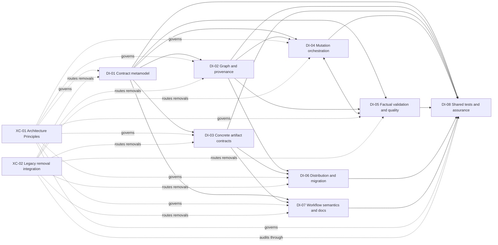

<!-- docs/development/issue460/design-intake-map.md -->
<!-- template=generic_doc version=43c84181 created=2026-08-26 updated=2026-08-29 -->
# Issue #460 Research-to-Design Intake Map

**Status:** DEFINITIVE — AMENDED RESEARCH DESIGN-READY  
**Version:** 1.9  
**Last Updated:** 2026-08-29  
**Issue:** #460  
**Workflow Boundary:** Refactor / Research → Design

## Purpose and Authority

This document is the authoritative Research-to-Design scope index for issue 460. It proves that every Research obligation has one primary Design destination without selecting target mechanisms, method bodies, patch sequences, or implementation cycles. Research was explicitly reopened on 2026-08-29 for the human-approved F-10/F-11 identity amendment. The previous unconditional QA GO remains historical evidence for the superseded suite-scoped provenance wording; fresh independent review found no Research blocker and granted an unconditional GO to resume Design on the amended boundary.

[Research](research.md) remains the sole authority for approved strategy, invariants, expected results, and the Research gate. [Research Findings](research-findings.md) owns evidence and rationale. The [Template Suite Work Catalog](template-suite-catalog.md) owns per-component dispositions. The [Pre-Implementation Documentation Contract](README.md) governs the form and navigation of the full set. This map owns only Design coverage and primary responsibility.

A Design package is a cohesive grouping tool, not a mandatory wrapper around every obligation. Complete coverage is mandatory. A standalone or already-resolved obligation is not forced into an artificial package.

## Coverage Contract

| Destination kind | Meaning |
|---|---|
| `DI-01`–`DI-08` | A cohesive Design package owns a group of related decisions and proof obligations |
| `XC-01`–`XC-02` | A direct cross-cutting Design obligation applies across affected packages; no separate subsystem or implementation cycle is implied |
| `RC-01` | Research already resolved the decision; Design must preserve it as a binding constraint but owns no new decision |
| `Deferred` | Explicitly outside issue 460; Design must not introduce the capability indirectly |

Coverage rules:

1. Every finding, Approved Strategy row, core invariant, expected result, consumer family, and still-conditional catalog disposition has exactly one primary destination.
2. Dependencies identify required inputs or affected consumers; they do not create duplicate primary ownership. File impact is not decision ownership: a package may supply requirements, consume another package's result, or verify alignment without owning that result.
3. A package may be subdivided inside Design only if every obligation remains traceable to one primary Design section.
4. Package dependencies are coverage dependencies, not implementation order or cycle sequencing. A Design package does not imply a matching implementation cycle.
5. DI-01–DI-07 each own the behavioral evidence, migration tests, and concrete removals for the boundary they design. DI-08 owns shared test architecture and cross-package assurance, not those package-local decisions.
6. Design may compare mechanisms and define interfaces, configuration schemas, and result contracts, but this map does not preselect those mechanisms.
7. Deferred work and Research-resolved constraints remain visible so Design cannot absorb them by omission or convenience.

### Relationship Vocabulary

| Relationship | Meaning |
|---|---|
| Primary ownership | The package makes and documents the Design decision |
| Supplied requirement | The package states a semantic need that the owning package must support |
| Affected consumer | The package consumes or must migrate with the owned result but does not define it |
| Verification responsibility | The package checks coherence or alignment after the owner has designed the boundary |

Only primary ownership assigns the decision. The other relationships make blast radius and integration visible without creating a second authority.

## Design Package Register

| ID | Cohesive mandate | Primary findings | Coverage dependencies |
|---|---|---|---|
| DI-01 | Suite contract metamodel, shared primitives, and public schema exposure | F-02, F-06, F-12, F-17 | Feeds DI-02, DI-03, DI-04, and DI-07 |
| DI-02 | Resolved graph, runtime selection, introspection, and provenance | F-04, F-05, F-11, F-16 | Depends on DI-01; feeds DI-04 and DI-06 |
| DI-03 | Concrete artifact contracts, renderer semantics, portability, retained types, removals, and renames | F-01, F-07, F-14, F-14A, F-14B | Depends on DI-01 and DI-02; feeds DI-07 and DI-08 |
| DI-04 | Scaffold and safe-edit mutation orchestration, operation results, and persistence | F-03, F-13, F-15 | Depends on DI-01 and DI-02; consumes factual evidence from DI-05 |
| DI-05 | Output-validation capabilities, factual results, profile selection, and quality-gate orchestration | F-08, F-19 | Depends on DI-01 and DI-02; supplies factual evidence to DI-04 |
| DI-06 | Distribution, renewal, and deployment migration | F-10 | Depends on DI-02 and final DI-03 identities/removals |
| DI-07 | Workflow semantics, agent-instruction, and documentation alignment | F-09 | Supplies semantic requirements to DI-03; depends on DI-01 and DI-03 and consumes final public decisions from DI-02–DI-06 |
| DI-08 | Shared test architecture and cross-package removal assurance | None | Supplies shared test infrastructure and audits evidence/removal completeness across DI-01–DI-07 |

## Package Mandates

### DI-01 — Suite Contract Metamodel and Public Schema Exposure

| Dimension | Design intake |
|---|---|
| Primary Research inputs | F-02, F-06, F-12, F-17; strategy rows for public context ownership, client compatibility, optionality, shared link/issue/checklist representations, and qualified identity |
| Affected inputs and consumers | Generic schema/config models, shared schema primitives, config validation, artifact IDs, and caller-visible `scaffold_schema` resolution. All 22 artifact configurations form a conformance corpus; DI-01 does not own their concrete properties |
| Design-owned decisions | Standard JSON Schema draft; internal acyclic composition and resolution rules; finite reference-free public exposure; generic required/optional/null/default semantics; definitions of genuinely shared primitives; language/technology identity convention |
| Supplied requirements | DI-03 supplies the concrete nested structures, field constraints, examples, and artifact-local representations that this metamodel must be able to express; DI-02 consumes the resolved form |
| Compatibility, migration, removal | Clean breaks have no aliases or multi-shape bridges; generic schema exposure remains self-contained; coordinated identity migration must be explicit |
| Required proof | Arbitrary conforming artifact definitions can express and resolve nested objects, collections, defaults, constraints, and shared primitives without artifact-specific Python; all current configurations are structurally representable without DI-01 asserting their semantic correctness |
| Exclusions | Concrete artifact properties, per-field requiredness, artifact-specific defaults/constraints/examples, nested item instances, and renderer behavior belong exclusively to DI-03; no purpose-aware discovery tool (F-18) or target parser/class topology is selected here |

### DI-02 — Resolved Graph, Runtime Selection, Introspection, and Provenance

| Dimension | Design intake |
|---|---|
| Research inputs | F-04, F-05, F-11, F-16; strategy rows for DTO runtime selection, resolved template graph, source provenance, and artifact-purpose introspection |
| Responsibilities and consumers | Modular config loader, Jinja loader/analyzer, template engine, bootstrap composition, runtime catalog, `scaffold_schema`, selected-template-package provenance/result evidence, graph metadata, and `.pgmcp/config/artifacts.yaml` |
| Design-owned decisions | Dependency-edge model for inheritance/import/include and prohibited package edges; startup resolution and diagnostics; one declared runtime renderer; concise purpose carrier; selected-package dependency closure, resolved package fingerprint, affected-consumer/version diagnostics, and package-directed result evidence; whether the empty artifacts index retains a justified package/index responsibility |
| Compatibility, migration, removal | Remove the implicit DTO override and historical registry/hash authority without compatibility shells; public schemas remain self-contained; suite mutations become restart-stable |
| Required proof | Missing, cyclic, duplicate, unreachable, prohibited, and incoherent graph states fail actionably; schema, renderer, purpose, output profile, version, and fingerprint identify the same resolved package; a package-local change has no observable effect on any other package, and a shared change affects exactly its transitive consumers; repeated startup produces stable facts |
| Exclusions | No historical template registry, adopted-artifact update system, or runtime purpose-discovery feature |

### DI-03 — Concrete Artifact Contracts, Renderer Semantics, and Portability

| Dimension | Design intake |
|---|---|
| Primary Research inputs | F-01, F-07, F-14, F-14A, F-14B and the approved DTO, Generic, integration-test, configuration-model, TypeScript DTO, and unit-test responsibilities; clean-break removal decisions for Resource, Service, Tool, obsolete agent hints, and unreachable test-template patterns |
| Affected inputs and consumers | Every retained or removed public artifact registration, all 22 concrete config/schema instances, 57 Jinja templates, shared macros/patterns, examples, output-profile assignments, and generated package assets |
| Design-owned decisions | Concrete properties, per-field requiredness, nested item structures, artifact-specific defaults/constraints/examples, minimal validity, shared-primitive selection versus local representation, and renderer semantics for every retained type; exact renamed IDs and complete removal surface for rejected types |
| Consumed boundary | DI-03 authors every concrete contract within DI-01's metamodel and composition/optionality rules; it does not redefine the schema language or public resolution mechanism |
| Compatibility, migration, removal | Remove project-specific S1mpleTrader assumptions, seven rejected patterns, Resource, Service, and Tool without aliases; migrate only owned PGMCP consumers; preserve existing generated production files |
| Required proof | Every concrete schema describes all and only the values its renderer consumes; minimal and property-complete valid contexts render valid portable output; every removed type is absent from registry, assets, docs, and active consumers; tests prove semantics rather than prose snapshots |
| Exclusions | No metamodel, schema-draft, composition, or generic exposure ownership; no new Python/YAML artifacts, command/query service family, pgmcp/MCP tool artifact, consumer-repository implementation, or recursive/general-purpose artifact DSL |

### DI-04 — Scaffold and Safe-Edit Mutation Orchestration

| Dimension | Design intake |
|---|---|
| Primary Research inputs | F-03, F-13, F-15; strategy rows for caller/envelope ownership, input consumption, success semantics, output-path semantics, and safe-edit post-edit validation |
| Affected inputs and consumers | `scaffold_artifact`, artifact manager/orchestrator, `SafeEditTool`, caller-context validation, render-envelope metadata, complete proposed content, target resolution, staging/atomicity/rollback, filesystem persistence, mutation-operation DTOs, cached output, and `mcp_server/scaffolding/utils.py` |
| Design-owned decisions | Ordered scaffold and edit boundaries for untouched caller validation, envelope composition, in-memory proposed content, DI-05 factual-evidence consumption, strict versus interactive mutation policy, atomic persistence, and scaffold/safe-edit operation reporting; deterministic naming, target evidence, and legacy naming/persistence-helper fate |
| Consumed boundary | DI-04 consumes DI-05 factual states exactly as reported. It may decide whether a scaffold or edit persists, but may never reinterpret `failed`, `unavailable`, or `not_executed` as another factual state |
| Compatibility, migration, removal | Unknown caller fields may not be filtered silently; body content may not carry operation metadata or host paths; scaffold/safe-edit envelopes remain explicit through migration; strict failure or required unavailable evidence leaves original state unchanged |
| Required proof | A valid first call yields a truthful persistable basis; contract/render/factual-validation/persistence failures remain distinguishable; failed strict scaffold creates no artifact; failed strict edit preserves the original file; interactive persistence returns the unchanged factual findings; output path remains result evidence |
| Exclusions | DI-05 exclusively owns capability facts, selectors, factual check-result semantics, and quality-operation behavior. DI-04 owns no provider/command/parser/availability truth and no quality scope, lifecycle, diagnostics, presentation, or autofix; first-time-right does not mean final phase completeness |

### DI-05 — Factual Output Validation and Quality-Gate Execution

| Dimension | Design intake |
|---|---|
| Required Research authority | Read [F-08](research-findings.md#f-08--schema-valid-rich-contexts-can-produce-invalid-source), [F-19](research-findings.md#f-19--output-validation-and-quality-gates-duplicate-executable-authority), their exact rows in the [Approved Strategy](research.md#approved-strategy-and-decision-status), I-16, and E-13/E-20 as one binding input set before designing DI-05; this intake map does not replace their richer evidence, boundaries, or rationale |
| Affected inputs and consumers | Artifact output-profile definitions, `.pgmcp/config/quality.yaml`, quality config models, validation modules/registry/service, `QAManager`, quality tools, bootstrap injection, factual check-result DTOs, the `run_quality_gates` operation envelope, and public quality presentation consumers |
| Design-owned decisions | One loaded executable-capability authority; provider/command/availability/parser facts; side-effect-free execution; separate output-profile and quality-gate selectors; factual `passed`/`failed`/`unavailable`/`not_executed` result contract; startup reference validation versus on-use availability; quality-scope/lifecycle/diagnostics/presentation/autofix adapter; public factual and quality-operation result migration |
| Supplied requirements | DI-04 supplies complete proposed content and consumes applicable factual results for scaffold/edit persistence. DI-05 reports facts and applicable evidence requirements but does not own strict/interactive mutation policy, atomicity, rollback, or scaffold/safe-edit operation envelopes |
| Compatibility, migration, removal | No third provider/command/parser authority; do not silently reinterpret `skipped`, drop result fields, or alter quality failure envelopes; the factual executor remains free of persistence, quality state, diagnostics, presentation, scope lifecycle, and autofix side effects |
| Required proof | Scaffold and safe edit receive the same factual capability evidence; DI-04 cannot alter factual states; quality gates retain distinct scope/lifecycle behavior; explicit quality-autofix remains outside the side-effect-free executor; independent/self-hosting evidence prevents the migrated quality path from certifying itself exclusively |
| Exclusions | DI-05 never decides whether scaffolded or edited proposed content persists. Input schema validation, startup template-graph validation, mutation orchestration, workflow enforcement, and behavioral test execution remain distinct responsibilities |

#### DI-05 Internal Responsibility Lenses

DI-05 remains one cohesive Design package and one authority for executable-capability facts. These lenses are mandatory separations of responsibility inside that authority, not independent package authorities, preselected components, or implementation cycles. Design must preserve their distinctions while selecting the eventual interfaces and composition topology from the complete Research authority above.

| Responsibility lens | Boundary that Design must preserve |
|---|---|
| Capability configuration and availability | Own configured providers, commands, parsers, startup reference validity, and factual environment availability without selecting artifact or quality policy |
| Side-effect-free execution and factual results | Execute selected capabilities and report only structured `passed`, `failed`, `unavailable`, or `not_executed` evidence; never mutate, persist, autofix, or present |
| Output-profile selection | Select applicable capabilities and evidence requirements for an output profile without owning execution or scaffold/safe-edit persistence policy |
| Quality-gate selection and orchestration adapter | Preserve requested scope, gate lifecycle, diagnostics, presentation, and explicit autofix while consuming factual results without reinterpreting them |
| Migration and independent evidence | Govern public-result migration, removal of duplicate authorities, and independent/self-hosting proof that the migrated quality path is not its sole certifier |

### DI-06 — Distribution, Renewal, and Deployment Migration

| Dimension | Design intake |
|---|---|
| Research inputs | F-10; approved distribution/customization and deployment-compatibility strategies; the amended separation between complete-suite management identity and DI-02 selected-package provenance |
| Responsibilities and consumers | CLI/init/upgrade flows, packaged template assets, active/custom/external roots, baseline evidence, staged candidates, adoption, release procedures, and the owner's two-machine/four-workspace migration |
| Design-owned decisions | Complete-suite management identity and deterministic baseline/candidate comparison; detection of a proven unchanged official root; complete fast-forward versus preserved customized/unknown root; candidate location and inspection/adoption contract; atomic suite/config identity during renewal |
| Compatibility, migration, removal | Never overwrite unproven customization or create mixed-version config/template roots; clean-break public changes are documented and manually migrated by the current owner |
| Required proof | Fresh install, unchanged upgrade, customized upgrade, legacy-unknown root, external root, interrupted adoption, and packaged-wheel scenarios preserve the approved behavior; complete-suite identity remains available to management consumers without appearing in package-directed artifact/tool evidence |
| Exclusions | No general historical registry, automatic artifact-content upgrades, cross-repository migration, or complete YAML artifact subset |

### DI-07 — Workflow Semantics, Agent-Instruction, and Documentation Alignment

| Dimension | Design intake |
|---|---|
| Research inputs | F-09; documentation-authority and workflow/template semantic-alignment strategies |
| Responsibilities and consumers | All active Research/Design/Planning/Validation phase-instruction variants, `contracts.yaml`, authoritative agent instructions and generated variants, active scaffolding/validation/manual references, `phase-workflows.md`, and `validation_api.md`; the corresponding document contracts and renderers are affected DI-03-owned consumers |
| Design-owned decisions | Workflow-specific required outcomes and semantic requirements supplied to DI-03; substantive phase-instruction actions and completeness expectations; tool enforcement wording without embedded invocations; exact active-document authority and whether conditional references remain separate or consolidate |
| Supplied and consumed boundaries | DI-07 states what each workflow phase must be able to persist and later verifies the alignment. DI-01 owns the metamodel capability; DI-03 exclusively owns concrete phase-document properties, requiredness, nesting, defaults, constraints, examples, and renderer behavior |
| Compatibility, migration, removal | Live schema/catalog facts outrank handwritten inventories; templates do not duplicate phase authority; agent variants may differ from SSOT where intentionally generated/owned; stale universal workflow/TDD and legacy validation narratives are removed |
| Required proof | Every active phase variant has an explicit semantic requirement mapped to a suitable DI-03-owned persisted carrier; schema/template/instruction meanings align; valid initial scaffold is not described as final completion; ordinary safe-edit refinement remains clear; local links and active references resolve |
| Exclusions | No ownership of concrete document schemas or renderers, shared schema primitives, field requiredness, nested structures, defaults, constraints, or rendering rules; no new runtime discovery feature, full tool-call duplication, phase-instruction prose snapshots, or historical narrative of mechanical changes |

### Package-Owned Behavioral Evidence and Removals

The following ownership is part of each package mandate, not deferred to DI-08. Shared DI-08 infrastructure may support this proof but does not own the behavior or removal decision.

| Package | Package-owned behavioral evidence and concrete removals |
|---|---|
| DI-01 | Metamodel, composition, shared-primitive, public-exposure, identity-migration tests; superseded schema/config-model surfaces |
| DI-02 | Graph resolution, startup diagnostics, runtime selection, introspection, provenance tests; obsolete registry, graph, metadata, and lifecycle surfaces |
| DI-03 | Per-artifact schema/renderer semantics, portability, rename/removal migration tests; rejected templates, configs, patterns, examples, and imports |
| DI-04 | Scaffold/safe-edit transaction, policy, atomicity, rollback, persistence, and operation-result tests; superseded scaffold/persistence helpers |
| DI-05 | Capability availability, factual execution/results, selector, quality-orchestration, migration, and self-hosting tests; legacy validation/quality surfaces |
| DI-06 | Install, renewal, customization, candidate/adoption, package, and owner-deployment migration tests; obsolete distribution assets and procedures |
| DI-07 | Workflow-carrier, instruction, authority, documentation, and link-alignment tests; stale instruction and documentation consumers |

### DI-08 — Shared Test Architecture and Cross-Package Removal Assurance

| Dimension | Design intake |
|---|---|
| Research inputs | I-14 and E-17; approved test-suite architecture strategy; the complete 105-row affected test/helper ledger; the package-owned removal routes governed by XC-02 |
| Responsibilities and consumers | Shared fixtures and helpers, dependency-injection and test-composition patterns, reusable config-driven test support, cross-package regression/integration evidence, public test-seam rules, obsolete tests without a retained behavioral owner, and the final completeness audit across package-owned evidence and removals |
| Design-owned decisions | Shared test architecture and cross-package evidence composition; disposition of genuinely shared helpers and ownerless obsolete tests; assurance rules that route every test and removal to one behavioral package; final audit of the complete test ledger and removal graph |
| Supplied boundary | DI-01–DI-07 own their package-specific behavioral evidence, migration tests, and concrete removals. A test may use DI-08 infrastructure while its behavioral ownership remains with the package whose public boundary it proves |
| Compatibility, migration, removal | Unrelated runtime behavior and tests remain untouched; removed tests cannot leave unowned behavior gaps; shared infrastructure may not become a private-implementation coupling layer or a central owner of package behavior |
| Required proof | Every retained test protects durable public behavior or an Architecture Principle through explicit dependencies and isolated state; every package-owned removal is covered or explicitly shown to remove no retained behavior; cross-package evidence is independently composable; no source/prose snapshots substitute for public proof |
| Exclusions | No catch-all ownership of package-specific tests or production removals, mandatory implementation-cycle mapping, test explosion, implementation-shaped fixtures, fabricated example code solely for validation, or changes to unrelated test domains |

## Direct and Resolved Obligations

### XC-01 — Architecture Principles Compliance

This is a direct cross-cutting Design obligation, not a ninth subsystem package.

| Applies to | Obligation |
|---|---|
| DI-01–DI-08 | Apply the complete relevant [Architecture Principles](../../coding_standards/ARCHITECTURE_PRINCIPLES.md), especially Config-First/DRY/OCP, fail-fast startup, SRP/DIP/ISP, composition-root ownership, no import-time I/O, CQS, Law of Demeter, presentation separation, and YAGNI |
| Design evidence | Name authoritative configuration ownership, injected boundaries, read/write responsibilities, startup validation, and public result/presentation separation for each affected package |
| Test evidence | Test code follows the same boundaries and cannot justify duplicated truth, hidden construction, global mutable state, or private implementation coupling |

### XC-02 — Legacy Removal Integration

This is a cross-cutting routing and integration obligation, not a removal subsystem or mandatory implementation cycle.

| Applies to | Obligation |
|---|---|
| DI-01–DI-07 | Each package owns removal of the legacy production, configuration, export, instruction, and test surfaces superseded by the boundary it designs |
| Required routing | Registry/graph removals route to DI-02; artifact/template/pattern removals to DI-03; scaffold/persistence helpers to DI-04; validation/quality surfaces to DI-05; distribution residues to DI-06; instruction/documentation consumers to DI-07 |
| DI-08 assurance | Audit the complete removal graph, shared helper impact, cross-package regression evidence, and absence of unowned behavioral gaps without taking over the concrete removal decisions |
| Compatibility constraint | Apply the approved clean breaks without compatibility shells; retained public seams and migration evidence remain owned by their technical packages |

### RC-01 — Approved Strategy Fidelity

Research has approved compatibility and migration per boundary, including the human-approved F-10/F-11 amendment dated 2026-08-29. Fresh independent review is still required before these inputs authorize Design to resume. Design owns no new choice to preserve versus bridge versus clean break unless new evidence makes an approved strategy unsound.

| Obligation | Consequence |
|---|---|
| Preserve every Approved Strategy row | Design may select mechanisms but cannot silently switch compatibility strategy |
| Preserve original-issue coverage | The four initial PR defects remain covered through suite-wide boundaries; no PR-only patch package exists |
| Keep deferred work excluded | Deferred feature and artifact families cannot enter Design through a dependency or convenience change |
| Reopen explicitly when unsound | New contradictory evidence returns the affected boundary to human Research approval before Design continues |

## Finding Coverage Matrix

| Finding | Primary destination | Coverage note |
|---|---|---|
| F-01 | DI-03 | Every concrete nested caller structure matches its renderer |
| F-02 | DI-01 | Optionality, nullability, emptiness, and defaults |
| F-03 | DI-04 | Caller context remains unchanged before envelope composition |
| F-04 | DI-02 | One declared runtime renderer and public contract |
| F-05 | DI-02 | Complete resolved Jinja/config graph |
| F-06 | DI-01 | Canonical structured link semantics |
| F-07 | DI-03 | Every concrete exposed field has one artifact-local meaning and rendering effect |
| F-08 | DI-05 | Output-profile applicability and factual validation states; DI-04 owns the resulting mutation policy |
| F-09 | DI-07 | Active documentation authority |
| F-10 | DI-06 | Renewal and customization safety |
| F-11 | DI-02 | Isolated selected-package provenance over local semantics and transitively reachable shared contributors |
| F-12 | DI-01 | Canonical issue references and checklist items |
| F-13 | DI-04 | Objective success and failure semantics |
| F-14 | DI-03 | Portable package artifact families |
| F-14A | DI-03 | Obsolete suite-owned agent-hint pattern and dead template imports |
| F-14B | DI-03 | Unreachable test-template pattern placeholders |
| F-15 | DI-04 | Persistence target excluded from generated body |
| F-16 | DI-02 | Existing suite-owned purpose through introspection |
| F-17 | DI-01 | Language/technology-qualified public identity |
| F-18 | Deferred | Purpose-aware runtime discovery remains out of scope |
| F-19 | DI-05 | Shared capability authority and normalized factual results |

## Approved Strategy Coverage Matrix

All 43 strategy rows from [Research](research.md#approved-strategy-and-decision-status) appear exactly once below.

| Primary destination | Approved Strategy rows | Count |
|---|---|---:|
| DI-01 | F-01 / S-01 public context ownership; F-01 client compatibility; F-02 / S-03 optionality and nullability; F-06 / S-04 link semantics; F-12 / S-05 issue references; F-12 / S-06 checklist items; F-17 language/technology-qualified identity | 7 |
| DI-02 | F-04 / S-08 DTO runtime selection; F-05 / S-09 resolved template graph; F-11 / S-16 source provenance; F-16 artifact-purpose introspection | 4 |
| DI-03 | F-01 / S-02 nested collections; F-14 / S-12 package portability; DTO artifact responsibility; Generic Python class responsibility; Python/pytest integration-test responsibility; Resource artifact responsibility; Python/Pydantic configuration-model responsibility; Service artifact responsibility; Tool artifact responsibility; TypeScript DTO-class responsibility; Python/pytest unit-test responsibility; F-14A agent hints; F-14B unreachable test patterns | 13 |
| DI-04 | F-03 caller context and render-envelope ownership; F-07 / S-07 input ownership and consumption; F-13 success semantics; F-15 / S-13 output path semantics; Safe-edit post-edit validation | 5 |
| DI-05 | F-08 / S-14 output validation and strictness; F-19 shared output-validation and quality-gate authority | 2 |
| DI-06 | F-10 / S-10 distribution and customization; Deployment compatibility | 2 |
| DI-07 | F-09 / S-15 documentation authority; Workflow/template semantic alignment | 2 |
| DI-08 | Test-suite architecture compliance | 1 |
| XC-01 | Runtime architecture compliance | 1 |
| XC-02 | Legacy parallel scaffolding and validation surfaces | 1 |
| RC-01 | F-12 original-issue coverage | 1 |
| Deferred | Deferred YAML artifact subset; Portable Python artifact coverage; F-18 purpose-aware runtime artifact discovery; Command/query service artifact family | 4 |
| **Total** |  | **43** |

## Core Invariant Coverage Matrix

| Primary destination | Core invariants | Count |
|---|---|---:|
| DI-01 | I-05 finite reference-free public schemas; I-06 distinct optional/null/empty/default states; I-08 no template truth in generic server code/prose | 3 |
| DI-02 | I-03 coherent selected-package schema/renderer/graph/profile/version/provenance, lateral package isolation, transitive shared impact, and separation from the F-10 renewal identity | 1 |
| DI-03 | I-01 discoverable renderer values; I-02 one meaning/effect per field; I-07 no hidden consumer-project dependencies | 3 |
| DI-04 | I-04 validate unchanged caller context before envelope; I-09 portable body without persistence target; I-13 valid scaffold basis versus final completion | 3 |
| DI-05 | I-16 one capability/provider/command/result authority | 1 |
| DI-07 | I-12 workflow-specific semantic requirements for DI-03-owned carriers; I-15 tool enforcement without invocation duplication | 2 |
| DI-08 | I-14 durable and architecturally valid tests | 1 |
| XC-01 | I-11 no generic-code hardcoding of suite/workflow/provider/install policy | 1 |
| RC-01 | I-10 explicit compatibility and migration strategy per boundary | 1 |
| **Total** |  | **16** |

## Expected-Result Coverage Matrix

| Primary destination | Expected results | Count |
|---|---|---:|
| DI-01 | E-04 stable optionality semantics; E-05 canonical links/issues/checklists; E-08 server does not own template content truth | 3 |
| DI-02 | E-02 schema describes resolved renderer graph; E-07 separates coherent complete-suite management evidence from isolated selected-package provenance, with DI-06 as the management consumer | 2 |
| DI-03 | E-01 caller constructs every supported concrete shape; E-06 explicit role for every concrete field; E-10 generic names conceal no project assumptions | 3 |
| DI-04 | E-03 accepted context reaches valid governed persistence; E-11 portable output without host paths; E-18 complete-result safe-edit validation and mutation policy | 3 |
| DI-05 | E-13 validity/availability/strictness remain distinct factual inputs; E-20 shared capability authority with independent evidence | 2 |
| DI-07 | E-09 docs cannot contradict live schema; E-15 workflow-by-phase requirements align with DI-03-owned carriers; E-16 scaffold-versus-completion clarity; E-19 tool enforcement without invocation duplication | 4 |
| DI-08 | E-17 retained tests protect durable public behavior or architecture | 1 |
| XC-01 | E-14 runtime/setup passes complete Architecture Principles sweep | 1 |
| RC-01 | E-12 compatibility choices approved before Design | 1 |
| **Total** |  | **20** |

## Consumer-Family Coverage Matrix

The [Template Suite Work Catalog](template-suite-catalog.md) remains authoritative for all 79 suite files, 102 active consumers, and 105 test/helper dispositions. This matrix assigns those rows by consumer family without duplicating the per-file ledger.

| Consumer family | Primary destination | Material dependent packages |
|---|---|---|
| Contract metamodel, shared schema primitives, artifact IDs, public schema resolution, package-owned tests, and superseded schema surfaces | DI-01 | DI-02, DI-03, DI-04, DI-07, DI-08 |
| Jinja graph, loader, runtime catalog, selected-package metadata, purpose, resolved package provenance, package-impact diagnostics, package-owned tests, and obsolete graph/registry surfaces | DI-02 | DI-03, DI-04, DI-06, DI-08, XC-02 |
| Concrete artifact config/schema instances, retained/removed templates, macros, examples, output-profile assignments, and package-owned tests | DI-03 | DI-01, DI-02, DI-05, DI-07, DI-08, XC-02 |
| Scaffold and safe-edit tools, mutation orchestration, mutation-operation DTOs, target resolution, strict/interactive policy, atomicity, persistence, package-owned tests, and superseded helpers | DI-04 | DI-01, DI-02, DI-05, DI-08, XC-02 |
| Validation capabilities, factual check-result DTOs, output-profile/quality selectors, quality orchestration, quality-operation DTOs, quality presentation, package-owned tests, and legacy validation surfaces | DI-05 | DI-04, DI-08, XC-02 |
| CLI/init/upgrade, package assets, root resolution, complete-suite management identity, baseline/candidate comparison, release procedures, package-owned tests, and obsolete distribution residues | DI-06 | DI-02, DI-03, DI-08, XC-02 |
| Contracts, phase instructions, agent variants, manuals, active references, package-owned tests, and stale instruction/documentation consumers | DI-07 | DI-01–DI-06, DI-08, XC-02 |
| Cross-package legacy-removal routing and integration constraint | XC-02 | DI-01–DI-08 |
| Shared test architecture, fixtures/helpers, cross-package regression/integration evidence, ownerless obsolete tests, and removal-completeness audit | DI-08 | DI-01–DI-07, XC-01, XC-02 |
| Current-owner deployment and external workspace migration | DI-06 | RC-01 |

## Conditional Catalog Disposition Intake

These catalog rows remain intentionally conditional because the final retained topology belongs to Design. Pointing them to a primary package removes ambiguity without choosing the answer in Research.

| Catalog row | Primary destination | Design question and preservation constraint |
|---|---|---|
| `.pgmcp/config/artifacts.yaml` — adapt or remove redundant shell | DI-02 | Retain only if it has a distinct fail-fast package/index responsibility; never become a second artifact inventory |
| `docs/manuals/phase-workflows.md` — rewrite or reduce | DI-07 | Keep only a contracts-owned workflow overview that does not copy universal phase/TDD rules |
| `docs/reference/validation_api.md` — replace or consolidate | DI-07 | Retain a separate API reference only if DI-02/DI-05 leave a stable developer-facing boundary worth documenting |
| `mcp_server/scaffolding/utils.py` — remove or replace through owned boundaries | DI-04 | Naming must come from artifact configuration and persistence from the designed filesystem boundary; hidden PascalCase/CWD policy cannot survive |

## Package Exit Evidence

A Design package is covered only when its Design section:

1. links the relevant Research findings and exact Approved Strategy rows;
2. states the selected interfaces/configuration contracts and rejected alternatives;
3. accounts for its consumer families and conditional catalog rows;
4. preserves compatibility, migration, and removal constraints;
5. defines its package-owned production removals, behavioral evidence, and migration tests under XC-01 and XC-02;
6. identifies any shared DI-08 infrastructure or cross-package evidence without transferring behavioral ownership;
7. identifies required independent evidence and known self-hosting risk;
8. records package dependencies and exclusions without turning them into implementation sequencing.

Design cannot claim complete intake while any coverage matrix entry lacks a corresponding Design section or is owned primarily by more than one section.

## Coverage Audit

The amendment changes no counts or primary destinations: F-11 remains DI-02-owned and F-10 remains DI-06-owned. The identity separation and consumer dependency are now explicit and were accepted by fresh independent Research review.

| Research authority | Expected | Mapped | Primary-ownership result |
|---|---:|---:|---|
| Findings (including F-14A/F-14B) | 21 | 21 | Exactly one destination each |
| Approved Strategy rows | 43 | 43 | Exactly one destination each |
| Core invariants | 16 | 16 | Exactly one destination each |
| Expected results | 20 | 20 | Exactly one destination each |
| Active consumer families | 10 | 10 | Exactly one destination each; per-file authority remains in the catalog |
| Conditional catalog dispositions | 4 | 4 | Exactly one Design package each |

## Explicit Exclusions and Deferred Work

The authoritative [Deferred Work](deferred-work.md) remains the complete deferred register. In particular, Design must not introduce:

- the complete YAML artifact subset;
- additional portable Python artifact types;
- a command/query service artifact family;
- purpose-aware runtime artifact discovery;
- S1mpleTrader-local specialization or cross-repository migration;
- a generic historical template registry or automatic updates of adopted artifact content.

## Related Documentation

- [Pre-Implementation Documentation Contract](README.md)
- [Primary Research](research.md)
- [Detailed Research Findings](research-findings.md)
- [Template Suite Work Catalog](template-suite-catalog.md)
- [Probe Evidence](probe-evidence.yaml)
- [Deferred Work](deferred-work.md)
- [Independent Research-to-Design QA Audit](research-to-design-qa-audit.md)
- [Historical Validation/Quality Brainstorm](validation-quality-gates-brainstorm-handover.md)
- [Documentation Standard](../../coding_standards/DOCUMENTATION_STANDARD.md)
- [Architecture Principles](../../coding_standards/ARCHITECTURE_PRINCIPLES.md)

## Version History

| Version | Date | Author | Changes |
|---|---|---|---|
| 1.9 | 2026-08-29 | `@imp researcher` | Record the fresh independent QA GO for the amended F-10/F-11 boundary and authorize Design to reconcile its superseded global-provenance decisions first. |
| 1.8 | 2026-08-29 | `@imp researcher` | Route the human-approved F-10/F-11 identity amendment: DI-06 owns complete-suite management identity, DI-02 owns isolated selected-package provenance, and fresh independent review is required. |
| 1.7 | 2026-08-27 | `@imp designer` | Link the issue-local pre-implementation documentation contract as the form and navigation authority. |
| 1.6 | 2026-08-27 | `@imp designer` | Mark the intake map definitive after unconditional independent QA GO; no Research gate remains open. |
| 1.5 | 2026-08-26 | `@imp researcher` | Preserve DI-05 as one Design authority while making its internal responsibility lenses and mandatory Research inputs explicit. |
| 1.4 | 2026-08-26 | `@imp researcher` | Limit DI-07 to workflow semantic requirements and alignment; retain concrete phase-document schema and renderer ownership in DI-03. |
| 1.3 | 2026-08-26 | `@imp researcher` | Keep DI-08 as shared test architecture and assurance, assign package-local evidence and removals to DI-01–DI-07, and add XC-02 removal routing. |
| 1.2 | 2026-08-26 | `@imp researcher` | Separate DI-05 factual capability/check ownership from DI-04 scaffold/safe-edit mutation policy, persistence, and operation-result ownership. |
| 1.1 | 2026-08-26 | `@imp researcher` | Separate DI-01 metamodel/shared-exposure ownership from DI-03 concrete artifact-schema and renderer ownership across mandates and coverage matrices. |
| 1.0 | 2026-08-26 | `@imp researcher` | Establish complete Research-to-Design primary ownership across packages, direct obligations, resolved constraints, deferred work, consumer families, and conditional catalog dispositions. |
