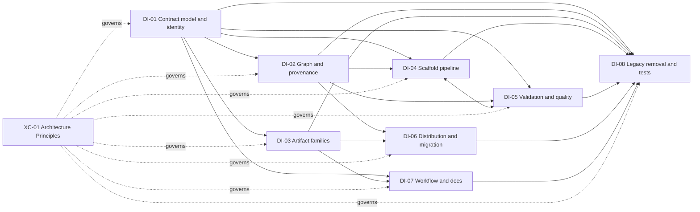

<!-- docs/development/issue460/design-intake-map.md -->
<!-- template=generic_doc version=43c84181 created=2026-08-26 updated=2026-08-26 -->
# Issue #460 Research-to-Design Intake Map

**Status:** REVIEW  
**Version:** 1.0  
**Last Updated:** 2026-08-26  
**Issue:** #460  
**Workflow Boundary:** Refactor / Research → Design

## Purpose and Authority

This document is the authoritative Research-to-Design scope index for issue 460. It proves that every Research obligation has one primary Design destination without selecting target mechanisms, method bodies, patch sequences, or implementation cycles.

[Research](research.md) remains the sole authority for approved strategy, invariants, expected results, and the Research gate. [Research Findings](research-findings.md) owns evidence and rationale. The [Template Suite Work Catalog](template-suite-catalog.md) owns per-component dispositions. This map owns only Design coverage and primary responsibility.

A Design package is a cohesive grouping tool, not a mandatory wrapper around every obligation. Complete coverage is mandatory. A standalone or already-resolved obligation is not forced into an artificial package.

## Coverage Contract

| Destination kind | Meaning |
|---|---|
| `DI-01`–`DI-08` | A cohesive Design package owns a group of related decisions and proof obligations |
| `XC-01` | A direct cross-cutting Design obligation applies to every affected package; no separate subsystem is implied |
| `RC-01` | Research already resolved the decision; Design must preserve it as a binding constraint but owns no new decision |
| `Deferred` | Explicitly outside issue 460; Design must not introduce the capability indirectly |

Coverage rules:

1. Every finding, Approved Strategy row, core invariant, expected result, consumer family, and still-conditional catalog disposition has exactly one primary destination.
2. Dependencies identify required inputs or affected consumers; they do not create duplicate primary ownership.
3. A package may be subdivided inside Design only if every obligation remains traceable to one primary Design section.
4. Package dependencies are coverage dependencies, not implementation order or cycle sequencing.
5. Design may compare mechanisms and define interfaces, configuration schemas, and result contracts, but this map does not preselect those mechanisms.
6. Deferred work and Research-resolved constraints remain visible so Design cannot absorb them by omission or convenience.

## Design Package Register

| ID | Cohesive mandate | Primary findings | Coverage dependencies |
|---|---|---|---|
| DI-01 | Suite contract model and public artifact identity | F-01, F-02, F-06, F-07, F-12, F-17 | Feeds DI-02, DI-03, DI-04, and DI-07 |
| DI-02 | Resolved graph, runtime selection, introspection, and provenance | F-04, F-05, F-11, F-16 | Depends on DI-01; feeds DI-04 and DI-06 |
| DI-03 | Artifact-family semantics, portability, retained types, removals, and renames | F-14 | Depends on DI-01 and DI-02; feeds DI-07 and DI-08 |
| DI-04 | Scaffold execution, context/envelope separation, result semantics, and persistence | F-03, F-13, F-15 | Depends on DI-01 and DI-02; integrates with DI-05 |
| DI-05 | Output-validation and quality capability reconciliation, including safe edit | F-08, F-19 | Depends on DI-01 and DI-02; supplies evidence to DI-04 |
| DI-06 | Distribution, renewal, and deployment migration | F-10 | Depends on DI-02 and final DI-03 identities/removals |
| DI-07 | Workflow, template, agent-instruction, and documentation alignment | F-09 | Depends on DI-01 and DI-03 and consumes final public decisions from DI-02–DI-06 |
| DI-08 | Legacy removal and test architecture | F-14A, F-14B | Consumes the retained boundaries and removal decisions of DI-01–DI-07 |

## Package Mandates

### DI-01 — Suite Contract Model and Public Artifact Identity

| Dimension | Design intake |
|---|---|
| Research inputs | F-01, F-02, F-06, F-07, F-12, F-17; strategy rows for public context ownership, nested collections, client compatibility, optionality, link semantics, issue references, checklist items, and qualified identity |
| Responsibilities and consumers | All 22 artifact configurations, shared schema primitives, caller-visible `scaffold_schema` responses, artifact IDs, field ownership, structured links/checklists/references, and config validation |
| Design-owned decisions | Standard JSON Schema draft and internal acyclic composition form; resolution into finite reference-free public schemas; required/optional/null/default semantics; canonical structured representations; exact language/technology-qualified IDs |
| Compatibility, migration, removal | Clean breaks have no aliases or multi-shape bridges; preserve existing artifact-purpose data; coordinated ID/context migration must be explicit |
| Required proof | Every renderer-consumed caller shape is introspectable; invalid/unknown fields fail honestly; omitted/null/empty/false/zero/defaulted values remain distinguishable; canonical values render deterministically |
| Exclusions | No purpose-aware discovery tool (F-18); no artifact-specific schema truth in generic Python; no target parser or class topology chosen here |

### DI-02 — Resolved Graph, Runtime Selection, Introspection, and Provenance

| Dimension | Design intake |
|---|---|
| Research inputs | F-04, F-05, F-11, F-16; strategy rows for DTO runtime selection, resolved template graph, source provenance, and artifact-purpose introspection |
| Responsibilities and consumers | Modular config loader, Jinja loader/analyzer, template engine, bootstrap composition, runtime catalog, `scaffold_schema`, provenance/result evidence, graph metadata, and `.pgmcp/config/artifacts.yaml` |
| Design-owned decisions | Dependency-edge model for inheritance/import/include; startup resolution and diagnostics; one declared runtime renderer; concise purpose carrier; current-graph fingerprint and result evidence; whether the empty artifacts index retains a justified package/index responsibility |
| Compatibility, migration, removal | Remove the implicit DTO override and historical registry/hash authority without compatibility shells; public schemas remain self-contained; suite mutations become restart-stable |
| Required proof | Missing, cyclic, duplicate, unreachable, and incoherent graph states fail actionably; schema, renderer, purpose, output profile, and fingerprint identify the same resolved artifact; repeated startup produces stable facts |
| Exclusions | No historical template registry, adopted-artifact update system, or runtime purpose-discovery feature |

### DI-03 — Artifact-Family Semantics and Portability

| Dimension | Design intake |
|---|---|
| Research inputs | F-14 and the approved DTO, Generic, integration-test, configuration-model, TypeScript DTO, and unit-test responsibilities; clean-break removal decisions for Resource, Service, and Tool |
| Responsibilities and consumers | All retained and removed public artifact registrations, 22 configs, 57 Jinja templates, shared macros/patterns, language/framework identities, examples, syntax/output profiles, and generated package assets |
| Design-owned decisions | Finite context contracts and render semantics for every retained type; exact renamed IDs; valid empty/incomplete behavior; shared primitives versus artifact-local fields; complete removal surface for rejected types |
| Compatibility, migration, removal | Remove project-specific S1mpleTrader assumptions, seven rejected patterns, Resource, Service, and Tool without aliases; migrate only owned PGMCP consumers; preserve existing generated production files |
| Required proof | Every retained artifact renders valid portable output from minimal and property-complete valid contexts; every removed type is absent from registry, assets, docs, and active consumers; tests prove semantics rather than prose snapshots |
| Exclusions | No new Python/YAML artifacts, command/query service family, pgmcp/MCP tool artifact, consumer-repository implementation, or recursive/general-purpose artifact DSL |

### DI-04 — Scaffold Execution and Persistence

| Dimension | Design intake |
|---|---|
| Research inputs | F-03, F-13, F-15; strategy rows for caller/envelope ownership, input consumption, success semantics, and output-path semantics |
| Responsibilities and consumers | `scaffold_artifact`, artifact manager/orchestrator, caller-context validation, render-envelope metadata, target resolution, filesystem persistence, success/failure DTOs, cached output, and `mcp_server/scaffolding/utils.py` |
| Design-owned decisions | Ordered boundaries for untouched caller validation, envelope composition, in-memory rendering, validation evidence consumption, persistence, and structured result reporting; ownership of deterministic naming and target evidence; fate of legacy naming/persistence helpers |
| Compatibility, migration, removal | Unknown caller fields may not be filtered silently; body content may not carry operation metadata or host paths; success/failure envelopes remain explicit through any DTO migration |
| Required proof | A valid first call yields a truthful persistable basis; contract/render/validation/persistence failures remain distinguishable; failed strict execution leaves no artifact; output path remains result evidence rather than generated body content |
| Exclusions | DI-05 owns executable validation facts, safe-edit transaction semantics, and quality-gate behavior; first-time-right does not mean final phase completeness |

### DI-05 — Output Validation, Quality Capabilities, and Safe Edit

| Dimension | Design intake |
|---|---|
| Research inputs | F-08, F-19, safe-edit post-edit validation, and approved output-validation/strictness strategy |
| Responsibilities and consumers | Artifact output profiles, `.pgmcp/config/quality.yaml`, quality config models, validation modules/registry/service, `QAManager`, quality tools, artifact manager, `SafeEditTool`, bootstrap injection, normalized result DTOs, and public failure/presentation consumers |
| Design-owned decisions | One loaded executable-capability authority; separate output-profile and quality-gate selectors; factual passed/failed/unavailable/not-executed result contract; dependency injection; startup reference validation versus on-use availability; strict/interactive persistence policy; complete proposed-content transaction boundary; public status/result migration |
| Compatibility, migration, removal | No third provider/command/parser authority; do not silently reinterpret `skipped`, drop result fields, or alter failure envelopes; pre-mutation consumers remain free of quality state, diagnostics, presentation, scope lifecycle, and autofix |
| Required proof | Scaffold and safe edit consume the same factual capability evidence; strict failures/unavailability preserve original state; quality gates retain their distinct scope/lifecycle behavior; independent/self-hosting evidence prevents the migrated path from certifying itself exclusively |
| Exclusions | Input schema validation, startup template-graph validation, workflow enforcement, and behavioral test execution remain distinct responsibilities |

### DI-06 — Distribution, Renewal, and Deployment Migration

| Dimension | Design intake |
|---|---|
| Research inputs | F-10; approved distribution/customization and deployment-compatibility strategies; resolved graph identity from DI-02 |
| Responsibilities and consumers | CLI/init/upgrade flows, packaged template assets, active/custom/external roots, baseline evidence, staged candidates, adoption, release procedures, and the owner's two-machine/four-workspace migration |
| Design-owned decisions | Detection of a proven unchanged official root; complete fast-forward versus preserved customized/unknown root; candidate location and inspection/adoption contract; atomic suite/config identity during renewal |
| Compatibility, migration, removal | Never overwrite unproven customization or create mixed-version config/template roots; clean-break public changes are documented and manually migrated by the current owner |
| Required proof | Fresh install, unchanged upgrade, customized upgrade, legacy-unknown root, external root, interrupted adoption, and packaged-wheel scenarios preserve the approved behavior |
| Exclusions | No general historical registry, automatic artifact-content upgrades, cross-repository migration, or complete YAML artifact subset |

### DI-07 — Workflow, Template, Agent-Instruction, and Documentation Alignment

| Dimension | Design intake |
|---|---|
| Research inputs | F-09; documentation-authority and workflow/template semantic-alignment strategies |
| Responsibilities and consumers | All active Research/Design/Planning/Validation phase-instruction variants, their document schemas/renderers, `contracts.yaml`, authoritative agent instructions and generated variants, active scaffolding/validation/manual references, `phase-workflows.md`, and `validation_api.md` |
| Design-owned decisions | Common document-schema core and optional semantic carriers; workflow-specific required outcomes; tool enforcement wording without embedded invocations; exact active-document authority and whether conditional references remain separate or consolidate |
| Compatibility, migration, removal | Live schema/catalog facts outrank handwritten inventories; templates do not duplicate phase authority; agent variants may differ from SSOT where intentionally generated/owned; stale universal workflow/TDD and legacy validation narratives are removed |
| Required proof | Every active phase variant maps to a suitable persisted carrier; schema/template/instruction meanings align; valid initial scaffold is not described as final completion; ordinary safe-edit refinement remains clear; local links and active references resolve |
| Exclusions | No new runtime discovery feature, full tool-call duplication, phase-instruction prose snapshots, or historical narrative of mechanical changes |

### DI-08 — Legacy Removal and Test Architecture

| Dimension | Design intake |
|---|---|
| Research inputs | F-14A, F-14B; approved agent-hint, unreachable-pattern, legacy parallel-surface, and test-architecture strategies |
| Responsibilities and consumers | Artifact-specific component scaffolders, duplicate renderer/result/base utilities, metadata parser/config/lifecycle exports, public always-pass validation tool, dead patterns/imports, all 105 affected test/helper candidates, shared fixtures, and obsolete documentation/instruction consumers |
| Design-owned decisions | Final removal graph and export cleanup; retained public seams after DI-01–DI-07; which conditional tests/helpers adapt, consolidate, split, replace, rename, or remove while preserving their recorded behavioral constraint |
| Compatibility, migration, removal | No compatibility shell for rejected legacy surfaces; unrelated runtime behavior and tests remain untouched; removed tests cannot leave unowned behavior gaps |
| Required proof | Every retained test protects durable public behavior or an Architecture Principle through explicit dependencies and isolated state; removals have replacement evidence where behavior remains; no source/prose snapshots or private implementation coupling substitute for public proof |
| Exclusions | No test explosion, implementation-shaped fixtures, fabricated example code solely for validation, or changes to unrelated test domains |

## Direct and Resolved Obligations

### XC-01 — Architecture Principles Compliance

This is a direct cross-cutting Design obligation, not a ninth subsystem package.

| Applies to | Obligation |
|---|---|
| DI-01–DI-08 | Apply the complete relevant [Architecture Principles](../../coding_standards/ARCHITECTURE_PRINCIPLES.md), especially Config-First/DRY/OCP, fail-fast startup, SRP/DIP/ISP, composition-root ownership, no import-time I/O, CQS, Law of Demeter, presentation separation, and YAGNI |
| Design evidence | Name authoritative configuration ownership, injected boundaries, read/write responsibilities, startup validation, and public result/presentation separation for each affected package |
| Test evidence | Test code follows the same boundaries and cannot justify duplicated truth, hidden construction, global mutable state, or private implementation coupling |

### RC-01 — Approved Strategy Fidelity

Research has already approved compatibility and migration per boundary. Design owns no new choice to preserve versus bridge versus clean break unless new evidence makes an approved strategy unsound.

| Obligation | Consequence |
|---|---|
| Preserve every Approved Strategy row | Design may select mechanisms but cannot silently switch compatibility strategy |
| Preserve original-issue coverage | The four initial PR defects remain covered through suite-wide boundaries; no PR-only patch package exists |
| Keep deferred work excluded | Deferred feature and artifact families cannot enter Design through a dependency or convenience change |
| Reopen explicitly when unsound | New contradictory evidence returns the affected boundary to human Research approval before Design continues |

## Finding Coverage Matrix

| Finding | Primary destination | Coverage note |
|---|---|---|
| F-01 | DI-01 | Complete caller-visible structured schema |
| F-02 | DI-01 | Optionality, nullability, emptiness, and defaults |
| F-03 | DI-04 | Caller context remains unchanged before envelope composition |
| F-04 | DI-02 | One declared runtime renderer and public contract |
| F-05 | DI-02 | Complete resolved Jinja/config graph |
| F-06 | DI-01 | Canonical structured link semantics |
| F-07 | DI-01 | Exposed and consumed caller-field coherence |
| F-08 | DI-05 | Output profile applicability and strictness |
| F-09 | DI-07 | Active documentation authority |
| F-10 | DI-06 | Renewal and customization safety |
| F-11 | DI-02 | Complete current-graph identity and provenance |
| F-12 | DI-01 | Canonical issue references and checklist items |
| F-13 | DI-04 | Objective success and failure semantics |
| F-14 | DI-03 | Portable package artifact families |
| F-14A | DI-08 | Obsolete agent hints and dead imports |
| F-14B | DI-08 | Unreachable test-pattern placeholders |
| F-15 | DI-04 | Persistence target excluded from generated body |
| F-16 | DI-02 | Existing suite-owned purpose through introspection |
| F-17 | DI-01 | Language/technology-qualified public identity |
| F-18 | Deferred | Purpose-aware runtime discovery remains out of scope |
| F-19 | DI-05 | Shared capability authority and normalized factual results |

## Approved Strategy Coverage Matrix

All 43 strategy rows from [Research](research.md#approved-strategy-and-decision-status) appear exactly once below.

| Primary destination | Approved Strategy rows | Count |
|---|---|---:|
| DI-01 | F-01 / S-01 public context ownership; F-01 / S-02 nested collections; F-01 client compatibility; F-02 / S-03 optionality and nullability; F-06 / S-04 link semantics; F-12 / S-05 issue references; F-12 / S-06 checklist items; F-17 language/technology-qualified identity | 8 |
| DI-02 | F-04 / S-08 DTO runtime selection; F-05 / S-09 resolved template graph; F-11 / S-16 source provenance; F-16 artifact-purpose introspection | 4 |
| DI-03 | F-14 / S-12 package portability; DTO artifact responsibility; Generic Python class responsibility; Python/pytest integration-test responsibility; Resource artifact responsibility; Python/Pydantic configuration-model responsibility; Service artifact responsibility; Tool artifact responsibility; TypeScript DTO-class responsibility; Python/pytest unit-test responsibility | 10 |
| DI-04 | F-03 caller context and render-envelope ownership; F-07 / S-07 input ownership and consumption; F-13 success semantics; F-15 / S-13 output path semantics | 4 |
| DI-05 | F-08 / S-14 output validation and strictness; F-19 shared output-validation and quality-gate authority; Safe-edit post-edit validation | 3 |
| DI-06 | F-10 / S-10 distribution and customization; Deployment compatibility | 2 |
| DI-07 | F-09 / S-15 documentation authority; Workflow/template semantic alignment | 2 |
| DI-08 | F-14A agent hints; Legacy parallel scaffolding and validation surfaces; Test-suite architecture compliance; F-14B unreachable test patterns | 4 |
| XC-01 | Runtime architecture compliance | 1 |
| RC-01 | F-12 original-issue coverage | 1 |
| Deferred | Deferred YAML artifact subset; Portable Python artifact coverage; F-18 purpose-aware runtime artifact discovery; Command/query service artifact family | 4 |
| **Total** |  | **43** |

## Core Invariant Coverage Matrix

| Primary destination | Core invariants | Count |
|---|---|---:|
| DI-01 | I-01 discoverable renderer values; I-02 one meaning/effect per field; I-05 finite reference-free public schemas; I-06 distinct optional/null/empty/default states; I-08 no template truth in generic server code/prose | 5 |
| DI-02 | I-03 coherent schema/renderer/graph/profile/package/renewal unit | 1 |
| DI-03 | I-07 no hidden consumer-project dependencies | 1 |
| DI-04 | I-04 validate unchanged caller context before envelope; I-09 portable body without persistence target; I-13 valid scaffold basis versus final completion | 3 |
| DI-05 | I-16 one capability/provider/command/result authority | 1 |
| DI-07 | I-12 workflow-specific semantic carriers; I-15 tool enforcement without invocation duplication | 2 |
| DI-08 | I-14 durable and architecturally valid tests | 1 |
| XC-01 | I-11 no generic-code hardcoding of suite/workflow/provider/install policy | 1 |
| RC-01 | I-10 explicit compatibility and migration strategy per boundary | 1 |
| **Total** |  | **16** |

## Expected-Result Coverage Matrix

| Primary destination | Expected results | Count |
|---|---|---:|
| DI-01 | E-01 caller constructs every supported shape; E-04 stable optionality semantics; E-05 canonical links/issues/checklists; E-06 explicit role for every field; E-08 server does not own template content truth | 5 |
| DI-02 | E-02 schema describes resolved renderer graph; E-07 metadata/contracts/templates/examples/identity travel coherently | 2 |
| DI-03 | E-10 generic names conceal no project assumptions | 1 |
| DI-04 | E-03 accepted context reaches valid governed persistence; E-11 portable output without host paths | 2 |
| DI-05 | E-13 validity/availability/strictness remain distinct; E-18 complete-result safe-edit validation; E-20 shared capability authority with independent evidence | 3 |
| DI-07 | E-09 docs cannot contradict live schema; E-15 workflow-by-phase carrier alignment; E-16 scaffold-versus-completion clarity; E-19 tool enforcement without invocation duplication | 4 |
| DI-08 | E-17 retained tests protect durable public behavior or architecture | 1 |
| XC-01 | E-14 runtime/setup passes complete Architecture Principles sweep | 1 |
| RC-01 | E-12 compatibility choices approved before Design | 1 |
| **Total** |  | **20** |

## Consumer-Family Coverage Matrix

The [Template Suite Work Catalog](template-suite-catalog.md) remains authoritative for all 79 suite files, 102 active consumers, and 105 test/helper dispositions. This matrix assigns those rows by consumer family without duplicating the per-file ledger.

| Consumer family | Primary destination | Material dependent packages |
|---|---|---|
| Portable JSON Schema/config contracts and artifact IDs | DI-01 | DI-02, DI-03, DI-04, DI-07 |
| Jinja graph, loader, runtime catalog, metadata, purpose, and provenance | DI-02 | DI-03, DI-04, DI-06 |
| Concrete retained/removed templates, macros, examples, and output profiles | DI-03 | DI-01, DI-02, DI-05, DI-07 |
| Scaffold tools, artifact orchestration, envelope/result DTOs, target resolution, and persistence | DI-04 | DI-01, DI-02, DI-05 |
| Validation services, quality configuration/orchestration, safe edit, and normalized findings/results | DI-05 | DI-04, DI-08 |
| CLI/init/upgrade, package assets, root resolution, and release procedures | DI-06 | DI-02, DI-03 |
| Contracts, phase instructions, agent variants, manuals, and active references | DI-07 | DI-01–DI-06 |
| Legacy scaffold/registry/metadata/validation exports and instruction consumers | DI-08 | DI-01–DI-07 |
| Behavioral tests, helpers, fixtures, and architecture checks | DI-08 | DI-01–DI-07, XC-01 |
| Current-owner deployment and external workspace migration | DI-06 | RC-01 |

## Conditional Catalog Disposition Intake

These catalog rows remain intentionally conditional because the final retained topology belongs to Design. Pointing them to a primary package removes ambiguity without choosing the answer in Research.

| Catalog row | Primary destination | Design question and preservation constraint |
|---|---|---|
| `.pgmcp/config/artifacts.yaml` — adapt or remove redundant shell | DI-02 | Retain only if it has a distinct fail-fast package/index responsibility; never become a second artifact inventory |
| `docs/manuals/phase-workflows.md` — rewrite or reduce | DI-07 | Keep only a contracts-owned workflow overview that does not copy universal phase/TDD rules |
| `docs/reference/validation_api.md` — replace or consolidate | DI-07 | Retain a separate API reference only if DI-02/DI-05 leave a stable developer-facing boundary worth documenting |
| `mcp_server/scaffolding/utils.py` — remove or replace through owned boundaries | DI-04 | Naming must come from artifact configuration and persistence from the designed filesystem boundary; hidden PascalCase/CWD policy cannot survive |

## Package Exit Evidence

A Design package is covered only when its Design section:

1. links the relevant Research findings and exact Approved Strategy rows;
2. states the selected interfaces/configuration contracts and rejected alternatives;
3. accounts for its consumer families and conditional catalog rows;
4. preserves compatibility, migration, and removal constraints;
5. defines production and test boundaries under XC-01;
6. identifies required independent evidence and known self-hosting risk;
7. records package dependencies and exclusions without turning them into implementation sequencing.

Design cannot claim complete intake while any coverage matrix entry lacks a corresponding Design section or is owned primarily by more than one section.

## Coverage Audit

| Research authority | Expected | Mapped | Primary-ownership result |
|---|---:|---:|---|
| Findings (including F-14A/F-14B) | 21 | 21 | Exactly one destination each |
| Approved Strategy rows | 43 | 43 | Exactly one destination each |
| Core invariants | 16 | 16 | Exactly one destination each |
| Expected results | 20 | 20 | Exactly one destination each |
| Active consumer families | 10 | 10 | Exactly one destination each; per-file authority remains in the catalog |
| Conditional catalog dispositions | 4 | 4 | Exactly one Design package each |

## Explicit Exclusions and Deferred Work

The authoritative [Deferred Work](deferred-work.md) remains the complete deferred register. In particular, Design must not introduce:

- the complete YAML artifact subset;
- additional portable Python artifact types;
- a command/query service artifact family;
- purpose-aware runtime artifact discovery;
- S1mpleTrader-local specialization or cross-repository migration;
- a generic historical template registry or automatic updates of adopted artifact content.

## Related Documentation

- [Primary Research](research.md)
- [Detailed Research Findings](research-findings.md)
- [Template Suite Work Catalog](template-suite-catalog.md)
- [Probe Evidence](probe-evidence.yaml)
- [Deferred Work](deferred-work.md)
- [Independent Research-to-Design QA Audit](research-to-design-qa-audit.md)
- [Historical Validation/Quality Brainstorm](validation-quality-gates-brainstorm-handover.md)
- [Documentation Standard](../../coding_standards/DOCUMENTATION_STANDARD.md)
- [Architecture Principles](../../coding_standards/ARCHITECTURE_PRINCIPLES.md)

## Version History

| Version | Date | Author | Changes |
|---|---|---|---|
| 1.0 | 2026-08-26 | `@imp researcher` | Establish complete Research-to-Design primary ownership across packages, direct obligations, resolved constraints, deferred work, consumer families, and conditional catalog dispositions. |
