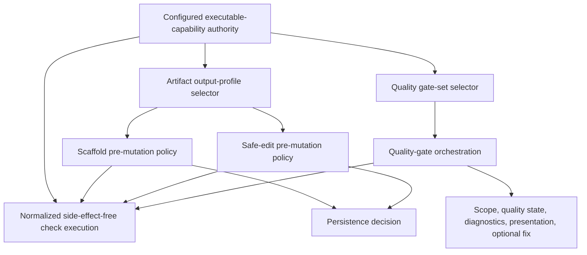

<!-- docs/development/issue460/validation-quality-gates-brainstorm-handover.md -->
<!-- template=generic_doc version=43c84181 created=2026-08-25T20:10Z updated=2026-08-25 -->
# Issue #460 Validation and Quality-Gates Brainstorm Hand-over

**Status:** HISTORICAL — RESOLVED TRANSFER RECORD  
**Version:** 1.1  
**Last Updated:** 2026-08-26  
**Retention:** Preserved as historical reasoning context; superseded for current decisions by the authoritative Research set.

---

## Purpose and Authority

This document preserves the historical reasoning context of the cross-machine issue #460 validation brainstorm. Its transfer purpose is complete, and its durable decisions have been reconciled into the authoritative Research set.

It is deliberately more expansive than the canonical Research artifact. It records observations, hypotheses, rejected readings, rationale, and questions as they existed at transfer time. It is **not** a current decision authority and does not override:

- [Research](research.md), which owns approved strategy and expected results;
- [Research Findings](research-findings.md), which owns durable evidence and rationale;
- [Template Suite Work Catalog](template-suite-catalog.md), which owns per-component dispositions;
- [Independent QA Audit](research-to-design-qa-audit.md), which owns the current NOGO and remediation findings.

Where this note and those documents differ, the authoritative document for that subject wins.

## Historical Resume Point

The dialogue has already reached agreement on the conceptual validation boundary:

> Rendered-output validation and quality gates should share one injected, config-first catalog of executable check capabilities and one normalized execution/result boundary. Output profiles and quality gate sets select from that shared authority. Pre-mutation scaffold/edit validation remains side-effect-free; `run_quality_gates` adds quality-specific scope, lifecycle state, diagnostics, presentation, and optional fixing.

One terminology correction is binding: **quality** qualifies the gates. A workspace is only a possible execution scope. Avoid treating “workspace quality gates” as a separate kind or authority.

At transfer time, QA-460-02 still required a human scope decision between retaining the consolidation and transactional safe-edit behavior inside issue #460 or deferring it to a separate governed refactor. That question is now resolved: on 2026-08-25 the human owner retained the reconciliation inside issue #460 as an explicit scope expansion. Standalone F-19 in [Research Findings](research-findings.md#f-19--output-validation-and-quality-gates-duplicate-executable-authority) and the [Research decision register](research.md#approved-strategy-and-decision-status) are the current authority.

## Why the Brainstorm Started

The starting concern was that it felt wrong to design two configurable validation or quality paths. That concern survived implementation inspection, but needed refinement.

The problem is **not** that every validation-like responsibility must be collapsed. Input JSON Schema validation, Jinja graph validation, rendered-output validation, quality gates, behavioral tests, and workflow enforcement prove different contracts. Combining all of them would create a broad validation god service.

The actual problem is narrower: rendered-output validation and quality gates can execute overlapping tools against files or proposed file content. If each path defines its own provider discovery, command, availability behavior, parsing, and result vocabulary, the same executable fact acquires two configuration authorities and two meanings.

Therefore the desired consolidation is at the reusable executable-capability and normalized-result seam, not at every policy, scope, or lifecycle concern above it.

## Observed Current Structure

The following observations are implementation evidence from the current branch, not target-design prescriptions.

| Component | Current responsibility and evidence | Why it matters |
|---|---|---|
| `.pgmcp/config/quality.yaml` | Defines active static-analysis gates, commands, file types, parsing strategies, scope filters, autofix capability, logging, and project scope. It explicitly states that tests and coverage run through `run_tests`, not `run_quality_gates`. | It is already a substantial config-first executable-check authority, but is Python/project oriented and mixes reusable command facts with quality-gate policy. |
| `mcp_server/config/schemas/quality_config.py` | Models execution, parsing, scope filtering, gate capability, and logging configuration. | A likely source of reusable facts exists, but its present model is quality-gate shaped rather than proven suitable as the shared boundary. |
| `mcp_server/validation/validation_service.py` | Constructs settings from the environment, mutates the global `ValidatorRegistry`, registers `.py` and `.md`, registers artifact-shaped filename regexes, applies Python compilation and a universal Markdown-H1 rule, and lets unknown file types pass. | It acts as a second validation authority and violates the desired injection, config-first, profile-specific, and fail-honestly boundaries. |
| `mcp_server/validation/registry.py` | Stores validator mappings through class-level mutable registration. | Process-global mutation makes startup composition and isolated tests harder, and extension dispatch can compete with declared output profiles. |
| `mcp_server/validation/python_validator.py` | Supports syntax-only mode and a full-QA mode. Full-QA writes proposed content to a temporary `.py` file, calls `QAManager.run_quality_gates`, and translates the manager dictionary back into `ValidationResult`. | This already demonstrates shared executable behavior, but through an adapter loop and result translation rather than one normalized seam. |
| `mcp_server/validation/markdown_validator.py` | Implements generic Markdown assumptions. | A Markdown document, GitHub body, commit message, and reference fragment do not necessarily share the same output rules; artifact profiles must select applicability. |
| `mcp_server/managers/qa_manager.py` | Resolves file/branch/project/auto scopes, executes configured gates, parses output, writes diagnostics, supports autofix, and mutates baseline/failed-file state for auto-scope lifecycle runs. Its public status vocabulary is passed/failed/skipped; missing executables currently become failed. | These responsibilities are useful for quality orchestration but make the manager too stateful and policy-rich to serve directly as the universal pre-mutation validator. |
| `mcp_server/tools/quality_tools.py` | Exposes `run_quality_gates` and autofix with explicit scopes and presentation DTOs. | The public quality operation should remain distinct even if its executable checks use the shared lower boundary. |
| `mcp_server/tools/safe_edit_tool.py` | Constructs `ValidationService()` when no validator is supplied. | This duplicates dependency construction and prevents the composition root from guaranteeing the same configured validation authority as scaffolding. |
| `mcp_server/managers/artifact_manager.py` | Uses `ValidationService` before writing and applies artifact `strict_validation` policy. | Scaffolding already has a pre-persistence policy boundary, but it is coupled to the current parallel validator route. |
| `mcp_server/bootstrap.py` | Constructs `QAManager` and injects it into `RunQualityGatesTool`, but registers `SafeEditTool()` without the same composed validation dependency. | The current object graph visibly separates the two paths rather than composing shared capabilities once. |
| `mcp_server/validation/base.py` | Represents a validation result primarily through `passed: bool`, score, and issues. | A boolean cannot faithfully distinguish failed, unavailable, and not executed. |

## Responsibilities That Must Remain Distinct

| Responsibility | Question it answers | Why it remains separate |
|---|---|---|
| Caller-context JSON Schema validation | Is the caller payload a valid instance of the selected artifact contract? | It validates input data before rendering, not the generated artifact. |
| Startup suite and graph validation | Is the configured schema/template/profile graph coherent and resolvable? | It is language-agnostic startup validation and must not require every dormant toolchain. |
| Rendered-output validation | Does the complete proposed content satisfy the selected artifact output profile before persistence? | It is artifact/profile-specific and participates in strict no-write behavior. |
| Quality-gate orchestration | Which configured quality checks apply to this requested scope, and what quality lifecycle/reporting behavior follows? | It owns file/branch/project/auto scope, diagnostics, state, presentation, and optional fixing. |
| Behavioral tests | Does running behavior satisfy its executable contract? | Tests are deliberately kept under `run_tests`; treating them as ordinary static gates would blur evidence types and lifecycle. |
| Workflow-gate enforcement | May the workflow transition or operation proceed given required evidence and state? | It consumes evidence but should not become the compiler, linter, schema validator, or test runner. |

## Alternatives Considered in the Dialogue

| Alternative | Attraction | Problem | Disposition |
|---|---|---|---|
| Keep `ValidationService` and quality gates fully independent | Local change appears smaller and each public path stays recognizable. | Commands, providers, parsers, availability, and outcomes can drift; both paths become configurable and neither is the single source of executable truth. | Rejected. |
| Make `ValidationService` the universal validator | It already participates in scaffolding and safe edit. | Its current responsibilities include global registration, environment construction, extension and filename dispatch, artifact assumptions, and silent pass behavior. Expanding it would preserve the wrong authority. | Rejected as a direct promotion of the current class. |
| Make `QAManager` the universal validator | It already executes configured commands and `PythonValidator` delegates to it. | It also owns scopes, Git/baseline state, failed-file accumulation, logs, summaries, presentation-oriented dictionaries, and autofix. Pre-mutation validation must not inherit those side effects. | Rejected as a direct promotion of the current class. |
| Create a third output-profile validation configuration beside both paths | It could model artifact-specific validation cleanly. | It would formalize the duplication that triggered the brainstorm and violate DRY/SSOT. | Rejected. |
| Share one executable-capability catalog and normalized executor; keep separate selectors and policies | Defines provider/command/parser/availability once while preserving different consumers and side effects. | Requires a careful Design boundary and migration of two established paths. | Agreed conceptual boundary. |
| Collapse all validation, testing, quality, startup, and workflow enforcement into one service | One apparent entry point. | Creates a low-cohesion god service, confuses evidence semantics, and couples mutation, startup, testing, and workflow state. | Rejected. |

## Agreed Conceptual Boundary

The agreed boundary has four layers of meaning. These are Research constraints, not chosen class names or YAML shapes.

### 1. Executable capability facts have one authority

A capability is the reusable fact that a check can be executed and interpreted. At minimum, the authority must be able to represent:

- a stable capability identity;
- provider or executable requirements;
- command/execution semantics where an external tool is used;
- supported input/file characteristics;
- availability detection;
- timeout and accepted exit semantics where applicable;
- output parsing into a normalized result.

These facts must not be copied separately into artifact output profiles and quality gate definitions.

### 2. Profiles and gate sets are selectors, not providers

An artifact output profile says which evidence is applicable to a rendered artifact. A quality gate set says which checks participate in a quality operation. Both select capabilities from the same authority, but can select different subsets and apply different policy.

For example, a Python scaffold may require syntax evidence before writing without automatically running every workspace lint/type gate. The syntax capability and any fuller Python checks can still live in one catalog without forcing both consumers to choose the same set.

### 3. Execution results are factual; policy is applied afterward

The shared execution boundary reports what happened. It does not decide whether a file may be persisted, whether a workflow may progress, whether an autofix should run, or how a human-facing summary is formatted.

The required factual states are:

| State | Meaning | Must not be rewritten as |
|---|---|---|
| `passed` | The applicable capability executed and its success contract was satisfied. | Merely no exception or no registered validator. |
| `failed` | The capability executed and found invalid output or returned a failing execution result. | Unavailable. |
| `unavailable` | The required provider/tool could not be resolved or executed. | Failed or passed. |
| `not_executed` | The capability was deliberately not run, for example because it was not applicable or policy did not request it. | Passed. |

The existing quality term `skipped` may eventually map to or coexist with `not_executed`, but that exact public-result migration is Design-owned.

### 4. Consumers retain their own policy and side effects

| Consumer | Shared lower behavior | Consumer-owned behavior |
|---|---|---|
| Scaffolding | Resolve selected output-profile capabilities and validate complete rendered content. | Artifact strictness and persistence decision; scaffold result context. |
| Safe edit | Validate the complete proposed post-edit content through the same output-profile boundary before mutation. | Strict versus interactive write decision, atomicity/rollback mechanics, edit-specific feedback. |
| `run_quality_gates` | Execute capabilities and consume normalized results. | Requested scope, active gate selection, quality baseline/failed-file lifecycle, diagnostics, presentation, and optional fixing. |

## Strictness Is Orthogonal to Evidence

Strictness controls persistence, not the truth value of validation evidence.

| Output-validation outcome | Strict mutation mode | Interactive mutation mode |
|---|---|---|
| Passed | Persistence may proceed. | Persistence may proceed. |
| Failed | Original artifact remains unchanged. | Persistence may proceed only with structured failed findings returned. |
| Unavailable required capability | Original artifact remains unchanged. | Persistence may proceed only with an explicit unavailable finding; it must never look passed. |
| Not executed when evidence is required | Original artifact remains unchanged because required passing evidence is absent. | Any permitted persistence must expose that required evidence was not executed. |

This table captures the approved observable policy. Exact staging, atomic-write, temporary-file, and rollback mechanics remain Design-owned.

## Logical Flow

The diagram deliberately does not choose concrete interfaces, classes, repositories, adapters, or configuration files.

## Why Workspace Is Not the Gate Qualifier

The earlier wording “workspace quality gates” was corrected to “quality gates.” This is more than editorial precision:

- quality is the semantic responsibility;
- files, branch, project, auto, or workspace-wide selection are execution scopes;
- a capability such as Python syntax or type checking should not acquire a second identity merely because it is invoked over a different scope;
- scope resolution belongs above capability execution and must not become a provider/configuration authority.

Preferred phrasing is therefore “quality gates with project scope” or “quality-gate orchestration over a workspace,” not a separate category named workspace quality gates.

## LLM and First-Time-Right Considerations

The earlier template discussion established that a first-time-right scaffold must be truthful, structurally coherent, and validatable when the declared validator is available. It does not promise a final or complete implementation. Editing after scaffolding is a normal, healthy operation.

For an LLM, the practical distinction between placing generated code in a scaffold context and applying it through safe edit can be small because the relevant syntax is often already in context. That strengthens the need for consistent post-render and post-edit validation semantics. It does **not** require both tools to expose the same high-level policy or to run all quality gates on every write.

The useful promise is:

- the complete proposed content is checked through the declared profile;
- strict mode cannot leave a known-invalid or unverifiable required result behind;
- structured evidence is returned so the agent can repair normally;
- the tool never claims that a valid scaffold is a finished artifact.

## Component Blast Radius Recorded So Far

The quality/validation reconciliation added eight direct entries to the active-consumer catalog, increasing that census from 94 to 102 while retaining two binding source rows outside the census:

1. `.pgmcp/config/quality.yaml`
2. `mcp_server/config/schemas/quality_config.py`
3. `mcp_server/managers/qa_manager.py`
4. `mcp_server/tools/quality_tools.py`
5. `mcp_server/validation/base.py`
6. `mcp_server/validation/registry.py`
7. `mcp_server/validation/python_validator.py`
8. `mcp_server/validation/markdown_validator.py`

Existing catalog entries also materially involved are `validation_service.py`, `artifact_manager.py`, `safe_edit_tool.py`, `bootstrap.py`, artifact/output-profile configuration, public result DTOs, quality/scaffolding/editing references, and their behavioral tests.

## Architecture Constraints Carried into Design

| Principle | Constraint for this boundary |
|---|---|
| DRY / SSOT | Provider, command, parser, and capability-availability facts exist once. |
| Config-First | Profiles and quality gate sets select configured capabilities; generic runtime code does not hardcode artifact IDs, extensions, or language mappings as authority. |
| DIP / composition root | Scaffolding, safe edit, and quality orchestration receive the resolved boundary through injection; tools do not construct parallel services during execution or initialization. |
| SRP | The normalized executor does not also own scope resolution, persistence, quality-state mutation, autofix, or presentation. |
| OCP | Adding a new configured capability or profile does not require artifact/language if-chains in generic consumers. |
| Fail-Fast | Invalid catalog references and impossible profile/gate combinations fail at startup; dormant provider absence does not make unrelated startup fail. |
| CQS | Factual result queries remain separate from persistence, baseline mutation, and autofix commands. |
| Presentation separation | The execution boundary returns structured results; tools or presenters create user-facing summaries. |
| YAGNI | Design should not introduce a generic plugin universe beyond the concrete output profiles and quality checks required by issue scope. |

## Self-Hosting and Independent Evidence Risk

The independent QA audit correctly identifies a self-hosting hazard: issue #460 may change validation and quality-gate infrastructure while that same infrastructure is used to certify the change.

A Design package that retains this work must state how evidence avoids circular trust. Candidate obligations to compare—not yet approved mechanics—include:

- preserve a known-good pre-change execution path long enough to compare normalized outcomes;
- run direct compiler/parser commands through independently invoked evidence where proportionate;
- exercise the new public boundaries with tests that do not merely mock the executor being certified;
- distinguish bootstrap/startup graph proof from output-check proof;
- prevent the newly changed quality path from being the sole evidence that its own migration is correct.

The exact bootstrap or dual-run strategy belongs to Design and Planning, but the need for independent evidence is now a Research/QA constraint.

## What Is Agreed

- Two separate configurable provider/command/parser authorities are undesirable.
- Rendered-output validation and quality gates share one config-first executable-capability authority and normalized execution/result seam.
- Artifact output profiles and quality gate sets are separate selectors over that authority.
- Scaffolding and safe edit validate complete proposed content before mutation.
- Pre-mutation validation does not inherit quality baseline, logging, presentation, scope lifecycle, or autofix behavior.
- `run_quality_gates` remains a distinct public operation and may add those quality-specific responsibilities.
- Passed, failed, unavailable, and not executed are distinct factual outcomes.
- Strictness changes persistence policy only.
- Input-schema, startup-graph, workflow-gate, and behavioral-test validation remain separate responsibilities.
- “Quality gates” is the correct term; workspace is only a scope.
- Concrete interfaces, config layout, adapters, staging mechanics, and call topology remain Design-owned.

## Design Questions Left Open After Scope Resolution

The scope location is no longer open. The following implementation-shaping questions remain Design-owned:

- Whether the existing `quality.yaml` is decomposed, extended, or complemented by another file while preserving one loaded authority.
- The exact Pydantic configuration models for capabilities, output profiles, and quality gate selectors.
- The exact normalized result DTO and how existing `skipped` and dictionary-shaped results migrate.
- Whether in-memory stdin execution, staged files, or capability-specific adapters are used for tools that require filesystem paths.
- The exact interfaces and class names; neither current `ValidationService` nor current `QAManager` is preselected as the shared executor.
- Startup validation rules for configured capability references versus runtime provider availability.
- The exact transaction/atomicity mechanics for safe edit and scaffolding.
- The independent/self-hosting evidence mechanism.
- Compatibility and migration details for public tool-result consumers.

## Historical Scope Options and Resolution

| Option | Benefits | Costs and risks | Required follow-through |
|---|---|---|---|
| Retain inside issue #460 as an explicit Design package | Produces one coherent scaffold/edit/quality authority in the same refactor and avoids designing issue #460 around a known duplicate seam. | Expands an already large issue, increases implementation and self-hosting risk, and requires explicit migration/result compatibility work. | Add a dedicated Design Intake package with compatibility, migration, validation, consumer, and independent-evidence obligations. |
| Defer to a separate governed refactor | Narrows issue #460 and reduces concurrent change to the certification infrastructure. | Issue #460 still needs a truthful output-validation boundary; a temporary bridge could accidentally become a third authority or leave safe edit inconsistent. | Define the minimal stable contract issue #460 may consume, record deferred ownership, and prohibit duplicated provider/command/parser configuration in the interim. |

**Resolution:** the first option was selected by the human owner on 2026-08-25. The reconciliation remains in issue 460 as standalone F-19 with explicit compatibility, migration, consumer-policy separation, and independent/self-hosting evidence obligations. This table is retained only to preserve the trade-off that informed that decision.

## Historical Questions at Transfer Time

The first two transfer questions below are resolved by retaining F-19 in issue 460. They are preserved to explain the decision path, not as current work:

1. Should the boundary remain in issue 460 or move to a separately governed issue? **Resolved: retain in issue 460.**
2. If split, what minimal contract would prevent a third authority? **Superseded by the retained-scope decision.**
3. Which facts are reusable executable-capability facts, and which belong only to output-profile selection or quality-gate policy?
4. What normalized result states and evidence fields are required by scaffold, safe edit, and `run_quality_gates` without leaking presentation concerns?
5. How do strict and interactive persistence policies consume those factual outcomes?
6. How are tools requiring real paths executed against complete proposed content without making temporary-file mechanics a public concern?
7. What startup conditions are configuration errors, and what provider absence is an on-use unavailable result?
8. What independent evidence prevents the changed quality infrastructure from certifying itself exclusively?

## Historical Continuation Prompt (Superseded)

The following prompt was valid only while the cross-machine transfer was unresolved. It must not be used as current workflow direction:

> Resume issue #460 from `validation-quality-gates-brainstorm-handover.md`. Treat `research.md` as decision authority and `research-to-design-qa-audit.md` as the current independent QA verdict. Do not repeat the bottom-up validation brainstorm. Start with the QA-460-02 human scope decision: retain the agreed shared output-validation/quality-gate capability boundary as an explicit issue-460 Design package, or defer it with a minimal non-duplicating contract. Preserve the terminology correction that quality qualifies the gates and workspace is only an execution scope.

## Related Documentation

- [Primary Research](research.md)
- [Detailed Research Findings](research-findings.md)
- [Template Suite Work Catalog](template-suite-catalog.md)
- [Independent Research-to-Design QA Audit](research-to-design-qa-audit.md)
- [Deferred Work](deferred-work.md)
- [Architecture Principles](../../coding_standards/ARCHITECTURE_PRINCIPLES.md)
- [Quality Gates](../../coding_standards/QUALITY_GATES.md)

## Retention Note

The transfer has been reconciled. The user explicitly chose to retain this file as a historical reasoning record. Its presence must not be interpreted as an additional Research authority or as evidence that resolved questions remain open.

## Version History

| Version | Date | Author | Changes |
|---|---|---|---|
| 1.1 | 2026-08-26 | `@imp researcher` | Mark the transfer as a resolved historical record and link its selected scope outcome to authoritative F-19 without rewriting the original reasoning context. |
| 1.0 | 2026-08-25 | `@imp researcher` | Capture the complete cross-machine validation and quality-gate brainstorm, agreed boundary, terminology correction, QA scope decision, and open Design questions. |
