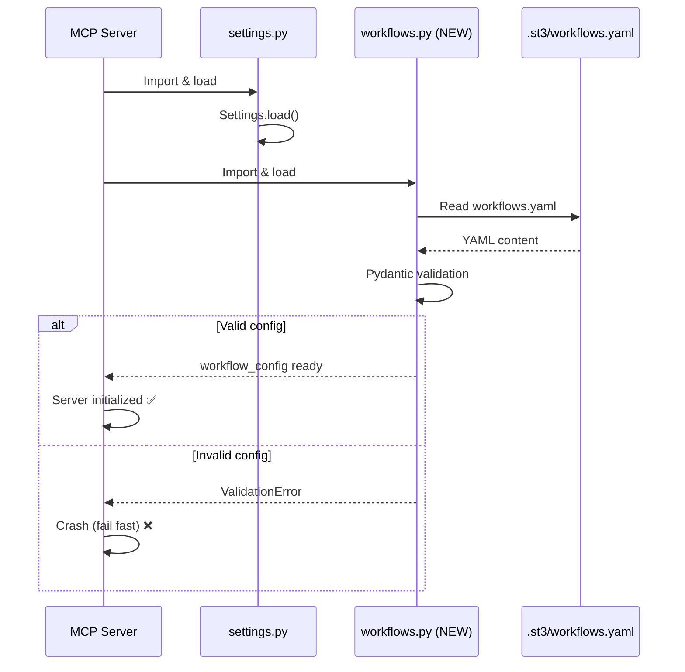
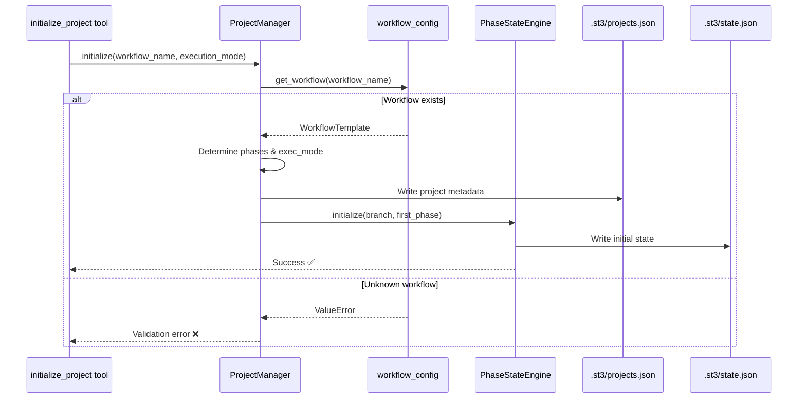
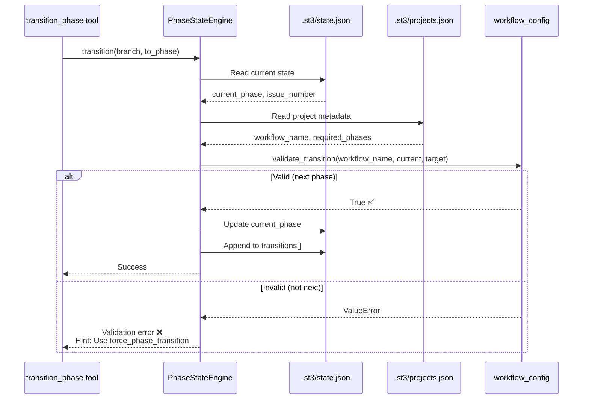
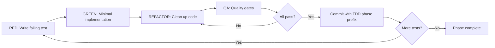

# Issue #50 Design: Workflow Configuration System

**Status:** DRAFT
**Author:** GitHub Copilot
**Created:** 2025-12-27
**Last Updated:** 2025-12-27
**Issue:** #50

---

## 1. Overview

### 1.1 Purpose

This design document defines the concrete implementation of workflows.yaml configuration system, including YAML schema structure, Pydantic models, validation rules, and migration strategy for transitioning from hardcoded PHASE_TEMPLATES to config-driven workflows.

### 1.2 Scope

**In Scope:**
- YAML schema structure for workflows.yaml
- Pydantic models (WorkflowConfig, WorkflowTemplate, ExecutionMode)
- Validation rules (phase sequences, transition graphs)
- Migration strategy (ProjectManager, PhaseStateEngine updates)
- Error handling and messages

**Out of Scope:**
- Implementation code (TDD phase)
- Tool updates (Integration phase)
- Documentation updates (Documentation phase)
- Other config files (#51-#57)

### 1.3 Related Documents

- [discovery.md](discovery.md) - Research findings
- [planning.md](planning.md) - Key decisions and work breakdown
- [Epic #49 planning.md](../issue49/planning.md) - Parent epic

---

## 2. Background

### 2.1 Current State

**Hardcoded PHASE_TEMPLATES** in [project_manager.py:78-140](../../../mcp_server/managers/project_manager.py#L78-L140):
```python
PHASE_TEMPLATES = {
    "feature": ["discovery", "planning", "design", "tdd", "integration", "documentation"],
    "bug": ["discovery", "planning", "tdd", "integration", "documentation"],
    "hotfix": ["tdd", "integration", "documentation"],
    "refactor": ["discovery", "planning", "tdd", "integration", "documentation"],
    "docs": ["planning", "documentation"]
}
```

**Issues:**
- Hardcoded dict (not configurable)
- No execution modes (autonomous vs interactive)
- No transition validation (PhaseStateEngine allows any transition)
- No workflow extensibility (adding workflow requires code change)

### 2.2 Problem Statement

Platform configurability requires migrating hardcoded workflow definitions to YAML configuration with Pydantic validation, while maintaining strict workflow discipline and enabling execution mode selection.

### 2.3 Requirements

#### Functional Requirements
- **FR1:** Load workflow definitions from workflows.yaml at startup
- **FR2:** Validate workflow names at project initialization
- **FR3:** Enforce strict sequential phase transitions (Decision 1.2)
- **FR4:** Support per-project execution mode selection (Decision 1.1)
- **FR5:** Reject unknown workflows (Decision 1.3)
- **FR6:** Provide clear error messages for validation failures

#### Non-Functional Requirements
- **NFR1:** Performance - Config loading < 100ms (startup only)
- **NFR2:** Testability - 100% coverage for config loading and validation
- **NFR3:** Maintainability - Follow existing Pydantic patterns (Settings.load())
- **NFR4:** Fail Fast - Invalid config crashes server at startup

---

## 3. Design

### 3.1 Architecture Position

#### 3.1.1 Server Startup Flow



#### 3.1.2 Project Initialization Flow



#### 3.1.3 Phase Transition Flow



### 3.2 Component Design

#### 3.2.1 WorkflowConfig (Pydantic Model)

**Purpose:** Root configuration model loaded from workflows.yaml

**Location:** `mcp_server/config/workflows.py` (NEW)

**Responsibilities:**
- Load and parse workflows.yaml
- Validate YAML structure
- Provide workflow lookup API
- Validate phase transitions

**Dependencies:**
- Pydantic (BaseModel)
- PyYAML (YAML loading)
- pathlib (file operations)

**Model Definition:**
```python
from pathlib import Path
from typing import Dict, Literal

from pydantic import BaseModel, Field, model_validator
import yaml


class WorkflowTemplate(BaseModel):
    """Single workflow definition."""
    
    name: str = Field(..., description="Workflow name (e.g., 'feature')")
    phases: list[str] = Field(
        ...,
        min_length=1,
        description="Ordered list of phases (strict sequential)"
    )
    default_execution_mode: Literal["interactive", "autonomous"] = Field(
        default="interactive",
        description="Default execution mode for this workflow"
    )
    description: str = Field(
        default="",
        description="Human-readable workflow description"
    )
    
    @model_validator(mode="after")
    def validate_phases(self) -> "WorkflowTemplate":
        """Ensure phases are unique and non-empty."""
        if len(self.phases) != len(set(self.phases)):
            raise ValueError(f"Duplicate phases in workflow '{self.name}': {self.phases}")
        if not all(phase.strip() for phase in self.phases):
            raise ValueError(f"Empty phase names in workflow '{self.name}'")
        return self


class WorkflowConfig(BaseModel):
    """Root workflow configuration."""
    
    version: str = Field(..., description="Config schema version (e.g., '1.0')")
    workflows: Dict[str, WorkflowTemplate] = Field(
        ...,
        description="Workflow definitions by name"
    )
    
    @classmethod
    def load(cls, path: Path | None = None) -> "WorkflowConfig":
        """Load configuration from YAML file.
        
        Args:
            path: Path to workflows.yaml (default: .st3/workflows.yaml)
            
        Returns:
            Validated WorkflowConfig instance
            
        Raises:
            FileNotFoundError: Config file not found
            ValidationError: Invalid YAML structure
        """
        if path is None:
            path = Path(".st3/workflows.yaml")
            
        if not path.exists():
            raise FileNotFoundError(
                f"Workflow config not found: {path}\n"
                f"Expected location: .st3/workflows.yaml\n"
                f"Hint: Initialize workflows with default config"
            )
            
        with open(path, "r", encoding="utf-8") as f:
            data = yaml.safe_load(f)
            
        return cls(**data)
    
    def get_workflow(self, name: str) -> WorkflowTemplate:
        """Get workflow by name.
        
        Args:
            name: Workflow name (e.g., "feature")
            
        Returns:
            WorkflowTemplate instance
            
        Raises:
            ValidationError: Unknown workflow name
        """
        if name not in self.workflows:
            available = ", ".join(self.workflows.keys())
            raise ValueError(
                f"Unknown workflow: '{name}'\n"
                f"Available workflows: {available}\n"
                f"Hint: Add workflow definition to .st3/workflows.yaml"
            )
        return self.workflows[name]
    
    def validate_transition(
        self,
        workflow_name: str,
        current_phase: str,
        target_phase: str
    ) -> bool:
        """Validate phase transition (strict sequential).
        
        Args:
            workflow_name: Workflow name
            current_phase: Current phase
            target_phase: Target phase
            
        Returns:
            True if transition is valid (next phase in sequence)
            
        Raises:
            ValueError: Invalid transition
        """
        workflow = self.get_workflow(workflow_name)
        
        if current_phase not in workflow.phases:
            raise ValueError(
                f"Current phase '{current_phase}' not in workflow '{workflow_name}'\n"
                f"Valid phases: {workflow.phases}"
            )
            
        if target_phase not in workflow.phases:
            raise ValueError(
                f"Target phase '{target_phase}' not in workflow '{workflow_name}'\n"
                f"Valid phases: {workflow.phases}"
            )
            
        current_idx = workflow.phases.index(current_phase)
        target_idx = workflow.phases.index(target_phase)
        
        # Strict sequential: target must be next phase
        if target_idx != current_idx + 1:
            next_phase = workflow.phases[current_idx + 1] if current_idx + 1 < len(workflow.phases) else None
            raise ValueError(
                f"Invalid transition: {current_phase} → {target_phase}\n"
                f"Expected next phase: {next_phase}\n"
                f"Workflow: {workflow.phases}\n"
                f"Hint: Use force_phase_transition tool for non-sequential transitions"
            )
            
        return True


# Module-level singleton (loaded at import time)
workflow_config = WorkflowConfig.load()
```

---

### 3.3 YAML Schema Structure

**File:** `.st3/workflows.yaml`

**Schema:**
```yaml
# Workflow Configuration
# Schema Version: 1.0
# Documentation: docs/reference/WORKFLOWS.md

version: "1.0"

workflows:
  # Feature Development (full workflow)
  feature:
    name: feature
    description: "Full development workflow with all phases (discovery → design → TDD → integration → docs)"
    default_execution_mode: interactive
    phases:
      - discovery
      - planning
      - design
      - tdd
      - integration
      - documentation

  # Bug Fix (no design phase)
  bug:
    name: bug
    description: "Bug fix workflow (discovery → planning → TDD → integration → docs)"
    default_execution_mode: interactive
    phases:
      - discovery
      - planning
      - tdd
      - integration
      - documentation

  # Hotfix (minimal workflow)
  hotfix:
    name: hotfix
    description: "Emergency fix workflow (TDD → integration → docs only)"
    default_execution_mode: autonomous  # Fast, minimal human interaction
    phases:
      - tdd
      - integration
      - documentation

  # Refactor (no design phase by default)
  refactor:
    name: refactor
    description: "Code refactoring workflow (discovery → planning → TDD → integration → docs)"
    default_execution_mode: interactive
    phases:
      - discovery
      - planning
      - tdd
      - integration
      - documentation

  # Documentation (minimal workflow)
  docs:
    name: docs
    description: "Documentation-only workflow (planning → docs)"
    default_execution_mode: interactive
    phases:
      - planning
      - documentation
```

**Validation Rules:**
1. `version` must be present (string)
2. `workflows` must be non-empty dict
3. Each workflow must have `name`, `phases`, `default_execution_mode`
4. `phases` must be non-empty list with unique values
5. `default_execution_mode` must be "interactive" or "autonomous"

---

### 3.4 Data Storage Updates

#### 3.4.1 .st3/projects.json Changes

**Current Structure:**
```json
{
  "50": {
    "issue_number": 50,
    "issue_title": "...",
    "issue_type": "refactor",
    "required_phases": ["discovery", "planning", "design", "tdd", "integration", "documentation"]
  }
}
```

**New Structure:**
```json
{
  "50": {
    "issue_number": 50,
    "issue_title": "...",
    "workflow_name": "refactor",  // NEW: replaces issue_type
    "execution_mode": "interactive",  // NEW: per-project mode
    "required_phases": ["discovery", "planning", "design", "tdd", "integration", "documentation"],  // KEPT: for custom phases
    "skip_reason": "Adding design phase for complex refactor"  // KEPT: explains deviations
  }
}
```

**Migration Strategy:**
- `issue_type` → `workflow_name` (rename key)
- Add `execution_mode` (default: workflow's default_execution_mode)
- Keep `required_phases` for custom phase lists (overrides workflow)

#### 3.4.2 .st3/state.json Changes

**Current Structure:**
```json
{
  "refactor/50-workflows-yaml": {
    "current_phase": "design",
    "issue_number": 50,
    "transitions": [
      {
        "from_phase": "discovery",
        "to_phase": "planning",
        "timestamp": "...",
        "human_approval": "..."
      }
    ]
  }
}
```

**New Structure (force transitions):**
```json
{
  "refactor/50-workflows-yaml": {
    "current_phase": "design",
    "issue_number": 50,
    "workflow_name": "refactor",  // NEW: cache workflow name
    "transitions": [
      {
        "from_phase": "discovery",
        "to_phase": "design",  // Skipped planning
        "timestamp": "...",
        "human_approval": "...",
        "forced": true,  // NEW: marks non-sequential transition
        "skip_reason": "Planning not needed for this refactor"  // NEW: explains skip
      }
    ]
  }
}
```

---

### 3.5 Migration Strategy

#### Step 1: Create workflows.yaml
```python
# mcp_server/config/workflows.py
DEFAULT_WORKFLOWS_YAML = """
version: "1.0"

workflows:
  feature:
    name: feature
    description: "Full development workflow"
    default_execution_mode: interactive
    phases: [discovery, planning, design, tdd, integration, documentation]
  # ... other workflows
"""

def initialize_default_config():
    """Create default workflows.yaml if not exists."""
    config_path = Path(".st3/workflows.yaml")
    if not config_path.exists():
        config_path.parent.mkdir(parents=True, exist_ok=True)
        config_path.write_text(DEFAULT_WORKFLOWS_YAML)
```

#### Step 2: Update ProjectManager
```python
# mcp_server/managers/project_manager.py

class ProjectManager:
    def initialize(
        self,
        issue_number: int,
        issue_title: str,
        workflow_name: str,  # NEW: was issue_type
        execution_mode: str | None = None,  # NEW: optional override
        custom_phases: list[str] | None = None,  # NEW: replaces skip_reason usage
        skip_reason: str | None = None
    ):
        # Validate workflow exists
        workflow = workflow_config.get_workflow(workflow_name)  # Raises if unknown
        
        # Determine execution mode
        exec_mode = execution_mode or workflow.default_execution_mode
        
        # Determine phases (custom overrides workflow)
        phases = custom_phases or workflow.phases
        
        # Store in projects.json
        project_data = {
            "issue_number": issue_number,
            "issue_title": issue_title,
            "workflow_name": workflow_name,
            "execution_mode": exec_mode,
            "required_phases": phases,
            "skip_reason": skip_reason  # Only if custom_phases provided
        }
        # ... save logic
```

#### Step 3: Update PhaseStateEngine
```python
# mcp_server/managers/phase_state_engine.py

class PhaseStateEngine:
    def transition(
        self,
        branch: str,
        to_phase: str,
        human_approval: str | None = None
    ):
        # Get current state
        state = self.get_state(branch)
        current_phase = state["current_phase"]
        
        # Get workflow from projects.json
        project = self.project_manager.get_project(state["issue_number"])
        workflow_name = project["workflow_name"]
        
        # Validate transition (strict sequential)
        workflow_config.validate_transition(
            workflow_name, current_phase, to_phase
        )  # Raises ValueError if invalid
        
        # Record transition
        # ... existing logic
    
    def force_transition(
        self,
        branch: str,
        to_phase: str,
        skip_reason: str,
        human_approval: str
    ):
        """Force non-sequential transition (requires explicit approval)."""
        # Get current state (no validation)
        state = self.get_state(branch)
        
        # Record forced transition with flag
        transition = {
            "from_phase": state["current_phase"],
            "to_phase": to_phase,
            "timestamp": datetime.now(UTC).isoformat(),
            "human_approval": human_approval,
            "forced": True,  # Mark as non-standard
            "skip_reason": skip_reason
        }
        # ... save logic
```

---

### 3.6 Error Messages

**Unknown Workflow:**
```
ValidationError: Unknown workflow: 'custom-flow'
Available workflows: feature, bug, hotfix, refactor, docs
Hint: Add workflow definition to .st3/workflows.yaml
```

**Invalid Transition:**
```
ValidationError: Invalid transition: planning → tdd
Expected next phase: design
Workflow: [discovery, planning, design, tdd, integration, documentation]
Hint: Use force_phase_transition tool for non-sequential transitions
```

**Missing Config File:**
```
FileNotFoundError: Workflow config not found: .st3/workflows.yaml
Expected location: .st3/workflows.yaml
Hint: Initialize workflows with default config
```

**Invalid Execution Mode:**
```
ValidationError: Invalid execution_mode: 'manual'
Valid modes: interactive, autonomous
Hint: Check workflow definition or override parameter
```

---

## 4. Implementation Plan

### 4.1 Test-Driven Development Sequence

#### Phase 1: Config Loading (RED → GREEN → REFACTOR)
**RED Tests:**
- `test_load_valid_yaml()` - Load workflows.yaml successfully
- `test_load_missing_file()` - Raise FileNotFoundError
- `test_load_invalid_yaml()` - Raise ValidationError (malformed YAML)
- `test_load_invalid_schema()` - Raise ValidationError (missing required fields)

**GREEN Implementation:**
- `WorkflowConfig.load()` classmethod
- YAML parsing with error handling
- Pydantic validation

**REFACTOR:**
- Extract error message formatting
- Add helpful hints to exceptions

#### Phase 2: Workflow Lookup (RED → GREEN → REFACTOR)
**RED Tests:**
- `test_get_workflow_exists()` - Return WorkflowTemplate
- `test_get_workflow_unknown()` - Raise ValueError with available workflows

**GREEN Implementation:**
- `WorkflowConfig.get_workflow()` method
- Error message with available workflows

**REFACTOR:**
- Cache workflow lookups (if performance needed)

#### Phase 3: Transition Validation (RED → GREEN → REFACTOR)
**RED Tests:**
- `test_validate_transition_next_phase()` - Allow next phase
- `test_validate_transition_skip_phase()` - Reject skip (not next)
- `test_validate_transition_backward()` - Reject backward transition
- `test_validate_transition_invalid_current()` - Reject unknown current phase
- `test_validate_transition_invalid_target()` - Reject unknown target phase

**GREEN Implementation:**
- `WorkflowConfig.validate_transition()` method
- Phase index lookup
- Strict sequential validation

**REFACTOR:**
- Extract phase validation logic
- Improve error messages with context

#### Phase 4: Manager Integration (RED → GREEN → REFACTOR)
**RED Tests:**
- `test_project_manager_initialize_with_workflow()` - Use workflow definition
- `test_project_manager_initialize_unknown_workflow()` - Reject unknown
- `test_project_manager_initialize_custom_phases()` - Override workflow phases
- `test_phase_state_engine_transition_valid()` - Allow next phase
- `test_phase_state_engine_transition_invalid()` - Reject skip
- `test_phase_state_engine_force_transition()` - Allow any phase with flag

**GREEN Implementation:**
- Update `ProjectManager.initialize()`
- Update `PhaseStateEngine.transition()`
- Add `PhaseStateEngine.force_transition()`

**REFACTOR:**
- Extract workflow lookup from managers
- Centralize validation logic

### 4.2 Coding Standards & Quality Enforcement

**CRITICAL**: No shortcuts, strict QA enforcement for ALL files (including tests).

#### 4.2.1 Coding Standards (from discovery.md Section 3)

**Type Hints:**
- ALL functions/methods MUST have type hints (args + return)
- Use `str` for phase names (not Literal, since config-driven)
- Use `Literal["interactive", "autonomous"]` for execution modes
- Use `Path` for file paths (not str)

**Pydantic Patterns:**
- Nested `BaseModel` for complex structures
- `@classmethod def load()` for config loading
- `@model_validator(mode="after")` for cross-field validation
- `Field(..., description="...")` for all fields
- Module-level singleton: `workflow_config = WorkflowConfig.load()`

**Error Handling:**
- Custom exceptions inherit from `MCPError`
- Provide recovery hints in error messages
- Use `raise ... from e` for error chaining

**Module Structure:**
- NEW file: `mcp_server/config/workflows.py`
- One config model per file (matches `settings.py`)
- Keep under 500 lines (single responsibility)

**Docstrings:**
- Google style docstrings for all public methods
- Include Args, Returns, Raises sections
- Document validation rules in class docstrings

#### 4.2.2 Tool Usage Requirements

**Use MCP Tools (NOT manual file edits):**
- `safe_edit_file` - All code changes (validates syntax before write)
- `scaffold_component` - Generate new config class structure
- `run_tests` - Execute pytest with proper markers
- `run_quality_gates` - Pylint/Mypy validation (10/10 required)
- `git_add_or_commit` - Version control with TDD phase prefix

**Test File Creation:**
- `scaffold_component` with `generate_test=True` (for DTOs)
- Manual test creation: Use `safe_edit_file` + pytest structure
- Test file naming: `test_<module_name>.py` (e.g., `test_workflow_config.py`)

#### 4.2.3 Quality Gates (STRICT - NO EXCEPTIONS)

**ALL files (including test files) MUST pass:**

1. **Pylint: 10/10**
   ```bash
   pylint mcp_server/config/workflows.py --score=yes
   # Score MUST be 10.00/10
   ```
   - No disabled checks without justification
   - Fix all warnings (not just errors)

2. **Mypy: 0 errors**
   ```bash
   mypy mcp_server/config/workflows.py --strict
   # MUST show: Success: no issues found
   ```
   - Strict mode enabled
   - All type hints validated

3. **Pytest: 100% coverage (config layer)**
   ```bash
   pytest tests/config/test_workflow_config.py --cov=mcp_server/config/workflows --cov-report=term-missing
   # Coverage MUST be 100% for new code
   ```
   - Every branch tested
   - Edge cases covered

4. **Test Files QA:**
   ```bash
   pylint tests/config/test_workflow_config.py --score=yes
   # Test files ALSO need 10/10
   ```
   - Test code held to same standards
   - No "test code doesn't need quality" exceptions

**Enforcement Strategy:**
- Run `run_quality_gates` after EVERY file edit
- Fix issues immediately (don't accumulate tech debt)
- RED → GREEN → REFACTOR → **QA** (add QA step to TDD cycle)

#### 4.2.4 TDD Cycle with QA

**Extended RED → GREEN → REFACTOR → QA:**



**Commit Strategy:**
- RED phase: `git_add_or_commit(phase="red", message="Add test_validate_transition_next_phase")`
- GREEN phase: `git_add_or_commit(phase="green", message="Implement WorkflowConfig.validate_transition")`
- REFACTOR phase: `git_add_or_commit(phase="refactor", message="Extract phase validation logic")`

### 4.3 Exit Criteria
- ✅ All tests passing (100% coverage for config layer)
- ✅ Pylint 10/10 for ALL files (code + tests)
- ✅ Mypy strict mode passing
- ✅ All existing projects migrated successfully
- ✅ QA gates run on every file (no exceptions)

---

## 5. Alternatives Considered

### Alternative A: Keep Enum for Phases

**Description:** Use `Phase(str, Enum)` for phase constants

**Pros:**
- IDE autocomplete
- Type safety at compile time
- Explicit phase list in code

**Cons:**
- Violates Config Over Code principle (User Decision 1.4)
- Adding phase requires code change (not configurable)
- Enum not used anywhere in codebase (inconsistent)

**Decision:** Rejected per User feedback "Laat enums maar achterwege"

### Alternative B: Fallback Workflow

**Description:** Unknown workflows use generic fallback (all phases, strict sequential)

**Pros:**
- More forgiving (doesn't crash on unknown workflow)
- Enables experimentation

**Cons:**
- Violates security model (Decision 1.3)
- Hides misconfiguration (fail slow instead of fail fast)
- Inconsistent with discipline philosophy

**Decision:** Rejected per User feedback aligning Decision 1.3 with 1.2

### Alternative C: Single Transition Tool with Skip Parameter

**Description:** `transition_phase(to_phase, skip=False)` for both standard and forced

**Pros:**
- Single tool (simpler API surface)
- Fewer tools to maintain

**Cons:**
- Violates security model (Decision 1.2)
- No per-use approval for dangerous operations
- Human can't pre-authorize standard transitions while requiring approval for forced

**Decision:** Rejected per User feedback "Aparte tool voor afwijken van standaard flow"

---

## 6. Open Questions

None - all questions resolved in planning phase.

---

## 7. Decision Log

| Date | Decision | Rationale |
|------|----------|-----------|
| 2025-12-27 | Use `WorkflowTemplate` nested model | Clean separation, supports validation |
| 2025-12-27 | Module-level singleton `workflow_config` | Matches `settings` pattern, startup loading |
| 2025-12-27 | Store `workflow_name` in both projects.json and state.json | projects.json = source of truth, state.json = cache for performance |
| 2025-12-27 | `forced` flag in transitions array | Makes non-standard transitions visible in history |
| 2025-12-27 | Strict validation (no fallback) | Fail fast, aligns with security model |
| 2025-12-27 | Use Mermaid diagrams (not ASCII) | Better readability, easier to maintain |
| 2025-12-27 | QA enforcement for test files | No quality shortcuts, all code held to 10/10 standard |
| 2025-12-27 | Extended TDD cycle with QA step | RED → GREEN → REFACTOR → QA (before commit) |

---

## Appendix A: Example Workflows

### Example 1: Standard Feature with Custom Design Phase
```yaml
# Issue #50 (this issue)
workflow_name: refactor
execution_mode: interactive
required_phases: [discovery, planning, design, tdd, integration, documentation]
skip_reason: "Adding design phase for complex refactor (not in standard refactor template)"
```

### Example 2: Hotfix (Minimal Workflow)
```yaml
workflow_name: hotfix
execution_mode: autonomous
required_phases: [tdd, integration, documentation]
# No skip_reason (using standard hotfix workflow)
```

### Example 3: Forced Transition
```json
{
  "from_phase": "discovery",
  "to_phase": "tdd",
  "timestamp": "2025-12-27T12:00:00Z",
  "human_approval": "Skipping planning/design for trivial refactor",
  "forced": true,
  "skip_reason": "Simple rename, no planning needed"
}
```

---

## Related Documentation

- [discovery.md](discovery.md) - Current state analysis and research
- [planning.md](planning.md) - Key decisions and work breakdown
- [ARCHITECTURE.md](../../ARCHITECTURE.md) - Overall platform architecture
- [WORKFLOWS.md](../../WORKFLOWS.md) - Workflow definitions reference (to be created)
