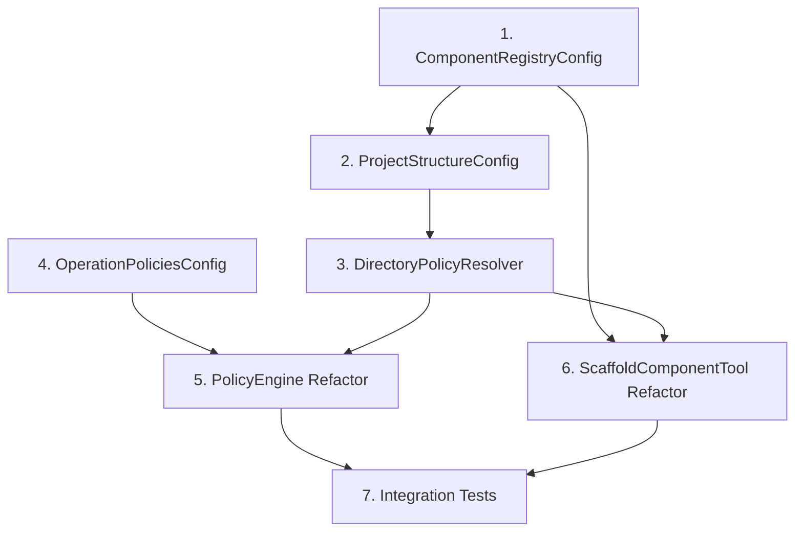

# Issue #54 Planning: Config Foundation Implementation

**Date:** 2026-01-09  
**Author:** GitHub Copilot (Claude Sonnet 4.5)  
**Status:** DRAFT  
**Phase:** Planning  
**Issue:** #54 - Config: Scaffold Rules Configuration  
**Parent:** Epic #49 - MCP Platform Configurability

---

## Executive Summary

**Goal:** Migrate hardcoded scaffold rules to declarative config files, establishing foundation for Epic #18 enforcement.

**Approach:** Create 3 config files + models + utility, refactor existing components to use configs WITHOUT changing behavior.

**Success Criteria:**
- Zero breaking changes (PolicyEngine loads but doesn't enforce)
- 100% test coverage on new components
- All hardcoded rules externalized
- Cross-config validation working (fail-fast at startup)
- Ready for Epic #18 enforcement integration

---

## 1. Implementation Components

### 1.1 Configuration Files (3 new files)

**File 1: `.st3/components.yaml`**
- Purpose: Component type registry (WAT domain)
- Replaces: Hardcoded dict in scaffold_tools.py lines 105-115
- Content: 9 component definitions (dto, worker, adapter, tool, resource, schema, interface, service, generic)
- Fields per component: type identifier, description, template path, test generation flag
- Size estimate: ~60-80 lines

**File 2: `.st3/project_structure.yaml`**
- Purpose: Directory structure and file policies (WAAR domain)
- Replaces: Hardcoded patterns in policy_engine.py lines 165-200
- Content: 7 directory definitions (backend, mcp_server, tests, docs, .st3, scripts, proof_of_concepts)
- Structure: Flat list with parent_dir field (NOT nested)
- Fields per directory: path, parent, description, allowed_component_types, allowed_extensions, require_scaffold_for patterns
- Size estimate: ~120-150 lines

**File 3: `.st3/policies.yaml`**
- Purpose: Operation phase policies (WANNEER domain)
- Replaces: Hardcoded allowed_phases in policy_engine.py lines 142-157
- Content: 3 operation definitions (scaffold, create_file, commit)
- Scope: Operation-level ONLY (NO directory-specific phase policies)
- Fields per operation: operation identifier, description, allowed_phases, operation-specific settings
- Size estimate: ~40-50 lines

### 1.2 Pydantic Configuration Models (3 new models)

**Model 1: ComponentRegistryConfig**
- Location: `mcp_server/config/component_registry.py` (NEW file)
- Pattern: Singleton with classmethod load()
- Validates: components.yaml structure
- Cross-validation: None (leaf config)
- Dependencies: None
- Estimated complexity: Medium (~80-100 lines with nested ComponentDef model)

**Model 2: ProjectStructureConfig**
- Location: `mcp_server/config/project_structure.py` (NEW file)
- Pattern: Singleton with classmethod load()
- Validates: project_structure.yaml structure + component type references
- Cross-validation: Validates allowed_component_types against ComponentRegistryConfig
- Dependencies: ComponentRegistryConfig
- Estimated complexity: High (~120-150 lines with nested DirectoryPolicy model)

**Model 3: OperationPoliciesConfig**
- Location: `mcp_server/config/operation_policies.py` (NEW file)
- Pattern: Singleton with classmethod load()
- Validates: policies.yaml structure + phase references
- Cross-validation: Validates allowed_phases against WorkflowConfig (Issue #50)
- Dependencies: WorkflowConfig
- Estimated complexity: Medium (~100-120 lines with nested OperationPolicy model)

### 1.3 Utility Component

**DirectoryPolicyResolver**
- Location: `mcp_server/core/directory_policy_resolver.py` (NEW file)
- Purpose: WAAR knowledge - directory policy lookup by path
- Responsibility: Single Responsibility Principle - PolicyEngine delegates directory lookups to this utility
- Key capabilities: Exact path match, parent directory match (walk tree), inheritance resolution
- Dependencies: ProjectStructureConfig
- Caching strategy: TBD (decision in Q3 below)
- Estimated complexity: Medium (~150-180 lines with tests)

### 1.4 Refactoring Targets (2 existing components)

**Target 1: PolicyEngine**
- Location: `mcp_server/core/policy_engine.py`
- Name: **PolicyEngine** (remains unchanged - "Policy Decision Service" is its role, not a rename)
- Current Status: **UNUSED** (zero integration points found via grep)
- Risk: **NONE** - No backward compatibility needed, full refactor allowed
- SRP Role: Answers "is operation X allowed?" based on policies.yaml + context
- Responsibilities:
  - Load OperationPoliciesConfig (policies.yaml) at startup
  - Provide `decide(operation, context)` method returning PolicyDecision(allowed: bool, reason: str)
  - Delegate directory lookups to DirectoryPolicyResolver (WAAR knowledge)
  - Maintain audit trail (all decisions logged with reason)
- NOT Responsible For:
  - Enforcement (blocking operations) - Epic #18 adds tool integration
  - Directory structure knowledge - DirectoryPolicyResolver owns this
  - Config validation - Pydantic models do this at load time
- Changes: Complete refactor (no compatibility constraints)
  - New interface: `decide(operation: str, path: str, phase: str) -> PolicyDecision`
  - Load policies.yaml via OperationPoliciesConfig.load()
  - Delegate to DirectoryPolicyResolver for WAAR queries
  - Simplified decision methods (config-driven, no hardcoded rules)
- Test strategy: New test suite focusing on config-driven decisions

**Target 2: ScaffoldComponentTool**
- Location: `mcp_server/tools/scaffold_tools.py`
- Changes: Load ComponentRegistryConfig, validate component_type against config, use DirectoryPolicyResolver for path validation
- Methods affected: `__init__` (add config loading), `_execute` (validate component_type), path validation (new)
- Preserve: Hardcoded scaffolder dict (NO dynamic loading in Issue #54)
- Risk: Low (tool doesn't change behavior, just validates differently)
- Test strategy: Integration tests (scaffold operations still work)

---

## 2. Implementation Strategy

### 2.1 Build Order (Dependencies First)



**Phase 1: Foundation (no dependencies)**
- Create ComponentRegistryConfig (leaf, no cross-validation)
- Create OperationPoliciesConfig (depends only on existing WorkflowConfig)

**Phase 2: Structure Layer (depends on Phase 1)**
- Create ProjectStructureConfig (validates against ComponentRegistryConfig)
- Create DirectoryPolicyResolver (uses ProjectStructureConfig)

**Phase 3: Integration (depends on Phase 2)**
- Refactor PolicyEngine (uses OperationPoliciesConfig + DirectoryPolicyResolver)
- Refactor ScaffoldComponentTool (uses ComponentRegistryConfig + DirectoryPolicyResolver)

**Phase 4: Validation**
- Integration tests (end-to-end config loading + usage)
- Behavior parity tests (PolicyEngine produces same decisions)
- Documentation updates (agent.md)

### 2.2 Test-Driven Development Approach

**Red Phase (tests first):**
- Write tests for config loading (valid + invalid configs)
- Write tests for cross-validation (referential integrity)
- Write tests for DirectoryPolicyResolver (path matching, inheritance)
- Write tests for PolicyEngine behavior parity (before/after refactor)

**Green Phase (implementation):**
- Implement configs + models to pass loading tests
- Implement DirectoryPolicyResolver to pass lookup tests
- Refactor PolicyEngine to pass behavior tests
- Refactor ScaffoldComponentTool to pass integration tests

**Refactor Phase (cleanup):**
- Remove hardcoded rules from PolicyEngine
- Remove hardcoded component type hints from ScaffoldComponentTool
- Document config relationships
- Update agent.md

### 2.3 Risk Mitigation

**Risk 1: PolicyEngine behavior change (NONE - UNUSED)**
- Finding: PolicyEngine has zero integration points (grep verified)
- Conclusion: No backward compatibility needed, full refactor allowed
- Approach: Design clean interface from scratch, test new behavior

**Risk 2: Config validation too strict (MEDIUM)**
- Mitigation: Start lenient (warnings), make strict after validation
- Example: Missing parent_dir → warning first, error after testing

**Risk 3: Cross-config validation circular dependency (MEDIUM)**
- Mitigation: Load order enforced (ComponentRegistryConfig → ProjectStructureConfig → OperationPoliciesConfig)
- Test: Explicit circular reference test (should raise ConfigError)

**Risk 4: DirectoryPolicyResolver performance (LOW)**
- Mitigation: Deferred - measure first, optimize if needed (caching decision in Q3)
- Benchmark: Test with 100+ directory lookups, acceptable if <10ms

---

## 3. Test Coverage Plan

### 3.1 Unit Tests (100% coverage required)

**ComponentRegistryConfig:**
- Load valid config (9 component types parsed correctly)
- Load invalid config (schema validation fails with clear error)
- Singleton pattern (load() returns same instance)
- Missing file handling (ConfigError with file path)

**ProjectStructureConfig:**
- Load valid config (7 directories parsed correctly)
- Cross-validation success (all component types exist in ComponentRegistryConfig)
- Cross-validation failure (unknown component type → ConfigError)
- Parent directory inheritance (child inherits parent fields)
- Missing file handling (ConfigError with file path)

**OperationPoliciesConfig:**
- Load valid config (3 operations parsed correctly)
- Cross-validation success (all phases exist in WorkflowConfig)
- Cross-validation failure (unknown phase → ConfigError)
- Empty allowed_phases (interpreted as "all phases allowed")
- Missing file handling (ConfigError with file path)

**DirectoryPolicyResolver:**
- Exact path match (backend → returns backend policy)
- Parent directory match (backend/foo → returns backend policy via inheritance)
- Deep nesting (backend/dtos/shared → walks tree to find backend/dtos)
- Fallback to root (unknown path → returns workspace root policy or default)
- Caching behavior (if caching implemented)

**PolicyEngine Refactor:**
- Behavior parity: _decide_scaffold with config matches hardcoded behavior
- Behavior parity: _decide_commit with config matches hardcoded behavior
- Behavior parity: _decide_create_file with DirectoryPolicyResolver matches hardcoded behavior
- Audit trail preserved (all decisions logged)
- Config loading error handling (fails gracefully)

**ScaffoldComponentTool Refactor:**
- Component type validation against config (valid type accepted)
- Component type validation against config (invalid type rejected with clear error)
- Path validation via DirectoryPolicyResolver (backend → dto allowed)
- Path validation via DirectoryPolicyResolver (backend → tool rejected)
- Hardcoded scaffolder dict still works (NO dynamic loading)

### 3.2 Integration Tests

**Config Loading Integration:**
- All 3 configs load successfully at server startup
- Cross-validation runs in correct order (ComponentRegistryConfig first, ProjectStructureConfig second, OperationPoliciesConfig third)
- Invalid config blocks startup (fail-fast)

**End-to-End Scaffold Operation:**
- scaffold_component(dto) uses ComponentRegistryConfig
- Output path validated via DirectoryPolicyResolver
- Phase policy checked via OperationPoliciesConfig
- Operation completes successfully

**End-to-End Create File Operation:**
- create_file(backend/foo.py) blocked by DirectoryPolicyResolver
- create_file(scripts/bar.py) allowed by DirectoryPolicyResolver
- PolicyEngine audit trail records decisions

### 3.3 Regression Tests

**Behavior Preservation:**
- All existing scaffold operations still work (no breaking changes)
- PolicyEngine produces identical decisions for same inputs (before/after refactor)
- Error messages still clear and actionable

**Performance Baseline:**
- Config loading time <100ms (measured at server startup)
- DirectoryPolicyResolver lookup time <10ms per call
- No regression in scaffold operation time

---

## 4. Migration Strategy

### 4.1 Phased Rollout (No Breaking Changes)

**Step 1: Create Configs (Describe Current State)**
- Create 3 YAML files describing CURRENT project structure
- No new rules, just externalize existing hardcoded rules
- Validation: Manual review (do configs match hardcoded rules?)

**Step 2: Create Models (Load Configs)**
- Implement 3 Pydantic models with cross-validation
- Test config loading in isolation (no integration yet)
- Validation: Unit tests pass, configs load without errors

**Step 3: Create DirectoryPolicyResolver**
- Implement utility with path matching and inheritance
- Test in isolation (no PolicyEngine integration yet)
- Validation: Unit tests pass, lookup logic correct

**Step 4: Refactor PolicyEngine (Config-Driven)**
- Load configs via models
- Replace hardcoded rules with config lookups
- Delegate directory lookups to DirectoryPolicyResolver
- Keep hardcoded rules commented out temporarily
- Validation: Behavior parity tests pass (same decisions)

**Step 5: Refactor ScaffoldComponentTool**
- Load ComponentRegistryConfig
- Validate component_type against config
- Use DirectoryPolicyResolver for path validation
- Validation: Integration tests pass (scaffolding still works)

**Step 6: Remove Hardcoded Rules**
- Delete hardcoded rules from PolicyEngine
- Delete hardcoded component hints from ScaffoldComponentTool
- Validation: All tests still pass (configs are SSOT now)

**Step 7: Documentation**
- Update agent.md (new configs, enforcement pipeline)
- Document config relationships and cross-references
- Document DirectoryPolicyResolver usage patterns

### 4.2 Rollback Plan

**If Config Loading Fails:**
- Revert to hardcoded rules (still in code, just commented out)
- No user impact (tools continue working)

**If Behavior Changes:**
- Behavior parity tests identify exact difference
- Fix config to match hardcoded behavior
- Re-run tests until parity achieved

**If Performance Degrades:**
- Measure bottleneck (config loading? DirectoryPolicyResolver?)
- Apply targeted optimization (caching, lazy loading)
- Benchmark to confirm regression fixed

---

## 5. Design Decisions (Open Questions from Research)

### 5.1 Config Schema Details

**Q1: Glob patterns vs regex for require_scaffold_for?**

Options:
- **Glob patterns** (e.g., `**/*.py`)
  - Pro: Simpler, more readable, familiar to users
  - Pro: Standard in many tools (gitignore, pytest, etc.)
  - Con: Less powerful than regex
- **Regex** (e.g., `^backend/.*\.py$`)
  - Pro: More powerful, handles complex patterns
  - Con: Steeper learning curve, error-prone
  - Con: Requires regex compilation and caching

**Recommendation:** Glob patterns for MVP (simpler, sufficient for current needs). Can add regex support later if needed.

**Q2: Exclusion patterns for operations?**

Example: "scaffold allowed in design phase EXCEPT in docs/"

Options:
- **Support exclusions** (adds complexity)
  - Pro: More expressive policies
  - Con: Increases config complexity
  - Con: Harder to validate and debug
- **No exclusions** (simpler)
  - Pro: Easier to understand and validate
  - Pro: Sufficient for current needs
  - Con: May need workarounds for edge cases

**Recommendation:** No exclusions for MVP. If needed later, can add `exclude_patterns` field.

### 5.2 DirectoryPolicyResolver Design

**Q3: Should DirectoryPolicyResolver cache lookups?**

Options:
- **No caching** (measure first)
  - Pro: Simpler implementation
  - Pro: No cache invalidation complexity
  - Con: Repeated lookups may be slow
  - Con: Performance unknown until measured
- **Caching** (optimize early)
  - Pro: Guaranteed fast lookups
  - Con: Cache invalidation needed if config reloads
  - Con: Memory overhead for large projects

**Recommendation:** No caching for MVP. Measure performance with benchmark tests (target: <10ms per lookup). Add caching only if benchmark fails.

**Q4: Inheritance explicit or implicit?**

Options:
- **Explicit inheritance** (parent fields copied to child in config)
  - Pro: Clear what child inherits (no magic)
  - Con: Verbose config (lots of duplication)
  - Con: Error-prone (easy to forget to update child when parent changes)
- **Implicit inheritance** (child inherits automatically)
  - Pro: Concise config (DRY principle)
  - Pro: Single source of truth (change parent, all children updated)
  - Con: "Magical" (need to understand inheritance rules)

**Recommendation:** Implicit inheritance (DRY, easier to maintain). Document inheritance rules clearly in config schema docs.

### 5.3 Error Handling

**Q5: Missing config file behavior?**

Options:
- **Fail-fast** (raise ConfigError, block startup)
  - Pro: Prevents invalid state (config is required)
  - Pro: Clear error message at startup
  - Con: Server won't start if config missing
- **Fallback to hardcoded defaults** (graceful degradation)
  - Pro: Server starts even if config missing
  - Con: Silent failure (users may not notice config missing)
  - Con: Defeats purpose of Issue #54 (config should be SSOT)
- **Hybrid** (required configs fail, optional configs have defaults)
  - Pro: Flexibility (some configs optional)
  - Con: Complexity (which configs are required?)

**Recommendation:** Fail-fast for all 3 configs. They are required for Epic #18 enforcement, no point in graceful degradation.

**Q6: Config validation errors block startup?**

Options:
- **Strict** (validation error blocks startup)
  - Pro: Prevents invalid state (fail-fast principle)
  - Pro: Forces user to fix config before continuing
  - Con: Server won't start if config invalid
- **Lenient** (validation warning, continue with partial config)
  - Pro: Server starts even with invalid config
  - Con: Partial enforcement (some rules ignored)
  - Con: Hard to debug (which rules are active?)

**Recommendation:** Strict for MVP (fail-fast). Config errors should be fixed, not ignored. Can add lenient mode later if needed (e.g., development vs production).

---

## 6. Epic #18 Preparation

### 6.1 Extension Points for Future Enforcement

**Config Extension:**
- policies.yaml can add `directory_policies` section (directory × phase × operation matrix)
- No schema changes needed (just add optional section)
- PolicyEngine refactor doesn't need changes (just reads new section if present)

**PolicyEngine Integration:**
- Tools call `PolicyEngine.decide()` before operations (Epic #18)
- Issue #54 provides config infrastructure (PolicyEngine knows what to check)
- Epic #18 adds enforcement (PolicyEngine actually blocks operations)

**Audit Trail Extension:**
- Current audit trail logs decisions (allowed/blocked + reason)
- Epic #18 can extend: log violations, track override requests, human approval flows

**Human Approval Hooks:**
- PolicyEngine.decide() returns PolicyDecision with `requires_approval` flag
- Epic #18 implements approval flow (request, review, apply)
- Issue #54 provides foundation (policies define when approval needed)

### 6.2 Config Composability

**Lego Block Pattern:**
- Each config is independent (can be edited separately)
- Each config references others declaratively (SSOT via cross-validation)
- Extension via addition (add new sections, don't break existing)
- Backward compatibility (old configs work with new PolicyEngine)

**Example Epic #18 Extension:**
- Add `directory_policies` section to policies.yaml
- PolicyEngine checks new section if present, ignores if absent
- No breaking changes to Issue #54 configs

---

## 7. Success Metrics

### 7.1 Functional Requirements - Concrete Test Cases

**1. ComponentRegistryConfig loads and validates components.yaml:**
```python
# Test case: Valid config loads successfully
config = ComponentRegistryConfig.from_file(".st3/components.yaml")
assert config.dto.base_path == "backend/dtos"
assert config.dto.test_base_path == "tests/backend/dtos"
assert "name" in config.dto.required_fields
assert config.dto.template == "src/mcp_server/scaffolding/templates/dto.py.j2"

# Test case: Invalid config raises ConfigError
with pytest.raises(ConfigError, match="Unknown component type 'invalid_type'"):
    ComponentRegistryConfig.from_file("invalid_components.yaml")
```

**2. ProjectStructureConfig loads and validates project_structure.yaml:**
```python
# Test case: Valid config with inheritance
config = ProjectStructureConfig.from_file(".st3/project_structure.yaml")
backend = config.get_directory("backend")
assert backend.allowed_extensions == [".py"]
assert backend.allowed_component_types == ["dto", "worker", "adapter"]

# Test case: DirectoryPolicyResolver resolves child inheritance
resolver = DirectoryPolicyResolver(config)
dtos_dir = resolver.resolve("backend/dtos")
assert dtos_dir.allowed_extensions == [".py"]  # Inherited from backend
assert dtos_dir.allowed_component_types == ["dto"]  # Override

# Test case: Glob pattern matching
assert config.matches_pattern("backend/test.py", "**/*.py") is True
assert config.matches_pattern("frontend/test.js", "**/*.py") is False
```

**3. PolicyConfig loads and validates policies.yaml:**
```python
# Test case: Valid phase rules
config = PolicyConfig.from_file(".st3/policies.yaml")
assert "design" in config.phases
assert "scaffold" in config.phases["design"].allowed_operations
assert "tdd" in config.phases["design"].allowed_phases_transition

# Test case: Glob pattern validation
assert config.validate_pattern("**/*.py") is True
with pytest.raises(ConfigError, match="Invalid glob pattern"):
    config.validate_pattern("[invalid")
```

**4. PolicyEngine answers "is operation X allowed?" (CRITICAL - Most Important)**

**Core Responsibility:** PolicyEngine loads configs, makes policy decisions, delegates directory lookups to DirectoryPolicyResolver, maintains audit trail.

**NOT Responsible:** Enforcement (Epic #18 adds this), directory knowledge (DirectoryPolicyResolver handles inheritance), config validation (Pydantic handles schema).

**Test Case 1: Scaffold operation allowed in design phase**
```python
engine = PolicyEngine(config_dir=".st3")
decision = engine.decide(
    operation="scaffold",
    path="backend/dtos/user_dto.py",
    phase="design",
    context={"component_type": "dto", "branch": "feature/54-scaffold-yaml"}
)
assert decision.allowed is True
assert "scaffold allowed in design phase" in decision.reason
assert decision.directory_policy.path == "backend/dtos"
assert decision.directory_policy.allowed_component_types == ["dto"]
```

**Test Case 2: Scaffold operation blocked outside allowed phases**
```python
decision = engine.decide(
    operation="scaffold",
    path="backend/workers/process_trade.py",
    phase="refactor",  # scaffold NOT allowed in refactor phase
    context={"component_type": "worker"}
)
assert decision.allowed is False
assert "scaffold not allowed in refactor phase" in decision.reason
```

**Test Case 3: Directory policy violation (wrong component type)**
```python
decision = engine.decide(
    operation="scaffold",
    path="backend/dtos/worker.py",  # Worker in dtos directory
    phase="design",
    context={"component_type": "worker"}
)
assert decision.allowed is False
assert "worker not allowed in backend/dtos" in decision.reason
assert decision.directory_policy.allowed_component_types == ["dto"]
```

**Test Case 4: Delegation to DirectoryPolicyResolver verified**
```python
# Verify PolicyEngine delegates directory lookup to resolver
decision = engine.decide("scaffold", "backend/utils/helper.py", "design")
# DirectoryPolicyResolver should have been called to resolve "backend/utils"
assert decision.directory_policy is not None
assert decision.directory_policy.path == "backend/utils"
# NOT PolicyEngine's job to know directory structure (SRP)
```

**Test Case 5: Audit trail records every decision**
```python
engine.decide("scaffold", "backend/dto.py", "design", context={"user": "agent"})
trail = engine.get_audit_trail()
assert len(trail) == 1
assert trail[0]["operation"] == "scaffold"
assert trail[0]["path"] == "backend/dto.py"
assert trail[0]["phase"] == "design"
assert trail[0]["allowed"] in [True, False]
assert "timestamp" in trail[0]
assert "reason" in trail[0]
assert trail[0]["context"]["user"] == "agent"
```

**Test Case 6: Config reload without restart**
```python
engine.reload_configs()
# Verify configs reloaded from disk
assert engine._component_config is not None
assert engine._structure_config is not None
assert engine._policy_config is not None
```

**Test Case 7: PolicyEngine handles missing configs gracefully (fail-fast)**
```python
with pytest.raises(ConfigError, match="Config file not found: .st3/policies.yaml"):
    PolicyEngine(config_dir=".st3_missing")
```

**5. ScaffoldComponentTool uses ComponentRegistryConfig (no hardcoding):**
```python
# Before: hardcoded component_types = ["dto", "worker", ...]
# After: component_types loaded from components.yaml
tool = ScaffoldComponentTool(config_dir=".st3")
assert tool.get_available_types() == list(ComponentRegistryConfig.from_file(".st3/components.yaml").component_types.keys())
```

**6. Validation tools use validation.yaml (Issue #52, no changes needed):**
```python
# Verify existing validation still works with new configs
result = validate_document("docs/development/issue54/planning.md")
assert result.is_valid is True
```

### 7.2 Quality Requirements

- ✅ 100% test coverage on new components (configs, models, DirectoryPolicyResolver)
- ✅ No behavior parity tests needed (PolicyEngine UNUSED - grep verified zero imports)
- ✅ Integration tests pass (end-to-end scaffold operations work)
- ✅ Performance benchmarks met (config loading <100ms, lookups <10ms)
- ✅ Documentation updated (agent.md, config schemas)

### 7.3 Non-Functional Requirements

- ✅ Config files are readable and maintainable (clear structure, comments)
- ✅ Error messages are actionable (ConfigError includes file + line + reason)
- ✅ Cross-validation enforces SSOT (invalid references caught at startup)
- ✅ SRP maintained (PolicyEngine delegates to DirectoryPolicyResolver)
- ✅ Ready for Epic #18 (extension points documented, composable design)

---

## 8. Timeline Estimate

**Phase 1: Foundation (4-6 hours)**
- Create 3 config files (2 hours)
- Create ComponentRegistryConfig + tests (1 hour)
- Create OperationPoliciesConfig + tests (1 hour)
- Buffer (1-2 hours)

**Phase 2: Structure Layer (6-8 hours)**
- Create ProjectStructureConfig + tests (2 hours)
- Create DirectoryPolicyResolver + tests (3 hours)
- Integration testing (1 hour)
- Buffer (1-2 hours)

**Phase 3: Integration (8-10 hours)**
- Refactor PolicyEngine + behavior parity tests (4 hours)
- Refactor ScaffoldComponentTool + integration tests (2 hours)
- Remove hardcoded rules (1 hour)
- End-to-end testing (1 hour)
- Buffer (2 hours)

**Phase 4: Documentation (2-3 hours)**
- Update agent.md (1 hour)
- Document config schemas and relationships (1 hour)
- Buffer (1 hour)

**Total Estimate: 20-27 hours** (2.5-3.5 days full-time)

---

## 9. Deferred Items (Tracked as Issues)

### 9.1 Items Deferred to Separate Issues

**Issue #105: Dynamic Component Loading (Plugin Architecture)**
- Parent: Epic #49 (MCP Platform Configurability)
- Labels: type:enhancement, priority:low, parent:issue-54
- Scope: Add `scaffolder_class` field to components.yaml, implement importlib dynamic loading
- Why Deferred: Complexity (security, error handling), low value for MVP (9 types rarely change)
- Blocked By: Issue #54 (needs components.yaml structure first)
- Estimated Effort: 6-8 hours

**Issue #106: ScaffoldComponentTool SRP Refactoring**
- Parent: Issue #22 (SRP Compliance Analysis)
- Labels: type:refactor, priority:medium, parent:issue-22
- Scope: Split ScaffoldComponentTool responsibilities (routing, validation, execution)
- Why Deferred: Works fine now, Issue #54 doesn't make it worse
- Dependencies: None
- Estimated Effort: 8-12 hours

**Issue #107: DRY Violations in Scaffolding System**
- Parent: Issue #22 (SRP Compliance Analysis)
- Labels: type:refactor, priority:low, parent:issue-22
- Scope: Extract fallback template logic (8x duplication), suffix logic (4x), test path derivation
- Why Deferred: Not blocking Issue #54, code works correctly
- Dependencies: None
- Estimated Effort: 4-6 hours

**Issue #108: JinjaRenderer Extraction for Reusability**
- Parent: Epic #15 (Enhanced Template Validation) or Epic #73 (Template Governance)
- Labels: type:refactor, priority:medium
- Scope: Move JinjaRenderer to mcp_server/core/, enable usage by safe_edit, quality tools
- Why Deferred: Broader impact than Issue #54, needs careful design
- Dependencies: None
- Estimated Effort: 6-8 hours

**Issue #109: File Operations Consolidation (PathResolver Utility)**
- Parent: Standalone
- Labels: type:refactor, priority:low
- Scope: Consolidate scattered file operations (test path derivation, module path, ensure_suffix)
- Why Deferred: Scattered but working, Issue #54 adds DirectoryPolicyResolver (partial solution)
- Dependencies: Issue #54 (DirectoryPolicyResolver provides pattern)
- Estimated Effort: 4-6 hours

**Issue #110: Project Scaffolding Tool (Empty Dir → Full Project)**
- Parent: Epic #49 (MCP Platform Configurability)
- Labels: type:feature, priority:low, parent:issue-49
- Scope: New tool to scaffold complete project from empty directory (cookiecutter-style)
- Why Deferred: Large feature, not needed for Epic #18 enforcement
- Dependencies: Issue #54 (uses components.yaml + project_structure.yaml)
- Estimated Effort: 16-24 hours

### 9.2 Items Deferred to Epic #18 (Enforcement)

**Directory-Specific Phase Policies**
- Parent: Epic #18 (Enforce TDD & Coverage via Hard Tooling Constraints)
- Config: Add `directory_policies` section to policies.yaml
- Scope: Define "backend allows scaffold only in design/tdd phases" type rules
- Why Deferred: Complex (18+ policies per directory), not essential for Epic #18 MVP
- Can Add Later: Extension to policies.yaml, no breaking changes
- Tracked In: Epic #18 planning (Phase Activity Enforcement section)

**PolicyEngine.decide() Integration in Tools**
- Parent: Epic #18 (child issue)
- Scope: Tools call PolicyEngine.decide() before operations, actually block on violations
- Why Deferred: Issue #54 provides config foundation, Epic #18 adds enforcement
- Dependencies: Issue #54 complete (PolicyEngine refactored, configs exist)
- Tracked In: Epic #18 (Quality Gate Enforcement phase)

**Architectural Pattern Validation**
- Parent: Epic #18 (child issue)
- Scope: Validate DTO structure, Worker patterns, Tool patterns
- Why Deferred: Epic #18 responsibility
- Dependencies: Issue #54 (PolicyEngine + configs)
- Tracked In: Epic #18 (Phase 5: Architectural Enforcement)

**Human Approval Workflows**
- Parent: Epic #18 (child issue)
- Scope: Override mechanism for policy violations with approval trail
- Why Deferred: Epic #18 enforcement feature
- Dependencies: Issue #54 (PolicyEngine infrastructure)
- Tracked In: Epic #18 (audit trail extension)

### 9.3 Performance Optimizations (Deferred Until Measured)

**DirectoryPolicyResolver Caching**
- Trigger: Benchmark shows lookups >10ms
- Scope: Add LRU cache with cache invalidation strategy
- Estimated Effort: 2-3 hours
- Tracked: Add to Issue #54 if benchmark fails, otherwise defer indefinitely

**Config Loading Optimization**
- Trigger: Startup time >100ms
- Scope: Lazy loading, parallel config loading, caching
- Estimated Effort: 3-4 hours
- Tracked: Add to Issue #54 if benchmark fails, otherwise defer indefinitely

---

## 10. Open Questions - RESOLVED

### Q1: Glob patterns vs regex for require_scaffold_for?

**Decision: ✅ Glob patterns**

**What it means:**
- In project_structure.yaml, patterns like `**/*.py` (glob) instead of `^backend/.*\.py$` (regex)
- Glob = file path matching syntax (like .gitignore)
- Examples:
  - `**/*.py` = all Python files in any subdirectory
  - `*.py` = Python files in current directory only
  - `backend/**/*.py` = Python files under backend directory

**Why glob over regex:**
- Simpler and more readable
- Standard in many tools (gitignore, pytest, etc.)
- Sufficient for current needs (can add regex later if needed)

### Q2: Support exclusion patterns?

**Decision: ✅ No exclusions for MVP**

**What it means:**
- NO support for "allow X EXCEPT Y" patterns in MVP
- Example NOT supported: "backend/**/*.py requires scaffold EXCEPT backend/utils/**/*.py"
- Keep policy rules simple: directories either require scaffolding or don't

**Why no exclusions:**
- Simpler to understand and debug
- Sufficient for current project structure
- Can add later as `exclude_patterns` field if needed (no breaking change)

### Q3: DirectoryPolicyResolver caching?

**Decision: ✅ No caching (measure first)**

**What it means:**
- DirectoryPolicyResolver lookups happen fresh every time
- No LRU cache or memoization
- If benchmark shows lookups >10ms, add caching in Issue #54 or separate issue

**Why no caching initially:**
- Simpler implementation (no cache invalidation logic)
- Performance unknown until measured
- Config loads once at startup, lookups are likely fast enough
- YAGNI principle (You Aren't Gonna Need It - don't optimize prematurely)

### Q4: Inheritance explicit or implicit?

**Decision: ✅ Implicit inheritance**

**What it means:**
- Child directories automatically inherit parent policies
- Example:
  ```yaml
  backend:
    allowed_extensions: [.py]
    allowed_component_types: [dto, worker]
  
  backend/dtos:
    parent: backend  # Inherits allowed_extensions + allowed_component_types
    allowed_component_types: [dto]  # Override: only DTOs in this subdirectory
  ```
- NO need to copy parent fields to child config (DRY principle)

**Why implicit over explicit:**
- Less config duplication (change parent, all children updated)
- Easier maintenance (single source of truth)
- Common pattern (CSS, file systems use implicit inheritance)

### Q5: Missing config file behavior?

**Decision: ✅ Fail-fast (raise error, block startup)**

**What it means:**
- If components.yaml, project_structure.yaml, or policies.yaml missing → ConfigError at startup
- MCP server won't start without configs
- Clear error message with file path

**Why fail-fast:**
- Prevents invalid state (configs are required for Epic #18)
- Forces immediate fix (no silent degradation)
- Clear error at startup better than runtime surprises

### Q6: Config validation errors block startup?

**Decision: ✅ Strict (validation errors block startup)**

**What it means:**
- Invalid config → ConfigError → server won't start
- Examples of validation errors:
  - Unknown component type in project_structure.yaml
  - Unknown phase in policies.yaml
  - Invalid YAML syntax
- NO lenient mode (no warnings, must fix)

**Why strict:**
- Fail-fast principle (catch errors early)
- Config errors should be fixed, not ignored
- Prevents partial enforcement (confusing which rules are active)
- Can add lenient mode later if needed (dev vs prod)

---

## Next Steps

**Ready for TDD Phase:**
1. Resolve 6 open questions (get user confirmation on recommendations)
2. Create planning.md commit (document decisions)
3. Transition branch to TDD phase
4. Start Red phase: Write tests for ComponentRegistryConfig
5. Proceed through build order (dependencies first)

**User Confirmation Needed:**
- ✅ Planning strategy approved (phased rollout, behavior parity, no breaking changes)
- ✅ Build order makes sense (foundation → structure → integration)
- ✅ Test coverage plan sufficient (unit + integration + regression)
- ✅ Migration strategy acceptable (describe current, migrate, remove hardcoded)
- ❓ Open questions resolved (Q1-Q6 recommendations acceptable)

---

**End of Planning Phase - Ready for TDD**