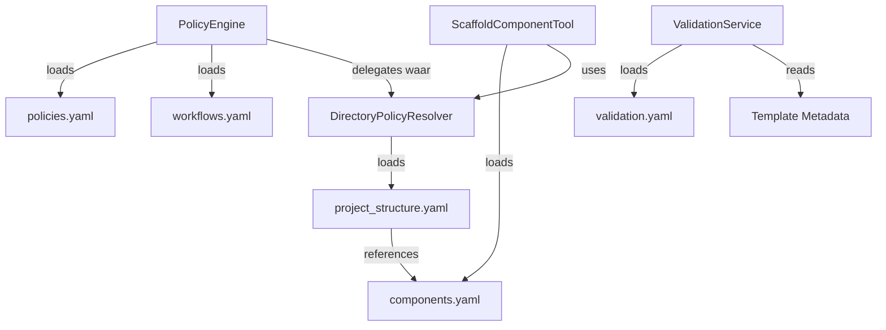
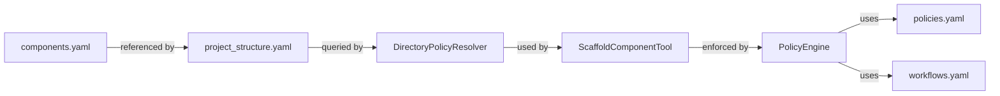
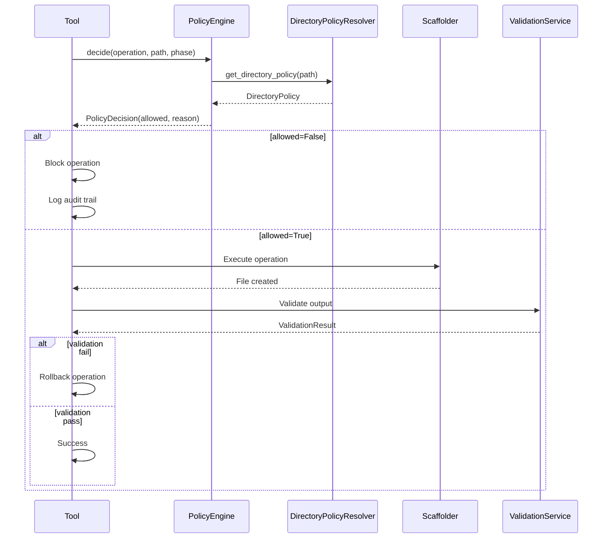
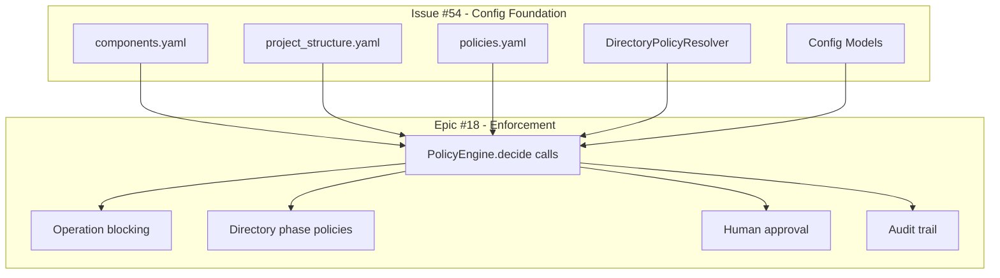
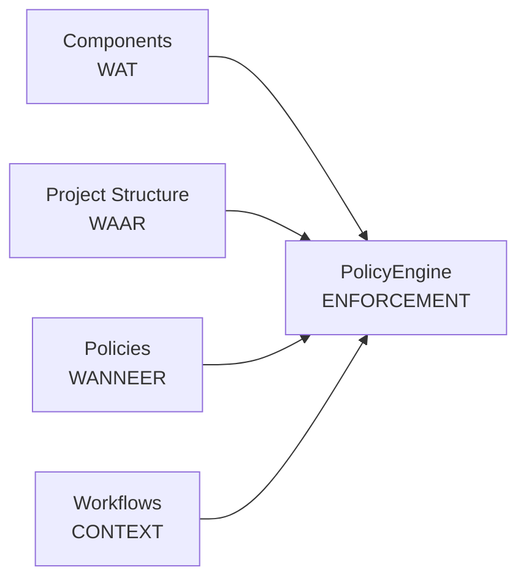

# Issue #54 Research: Config Foundation for Enforcement

**Date:** 2026-01-09  
**Author:** GitHub Copilot (Claude Sonnet 4.5)  
**Status:** FINAL  
**Issue:** #54 - Config: Scaffold Rules Configuration  
**Parent:** Epic #49 - MCP Platform Configurability  
**Enables:** Epic #18 - Enforcement via Hard Tooling Constraints

---

## Executive Summary

Issue #54 creates the **configuration foundation** for Epic #18 enforcement by defining:
- **WAT** kan gemaakt worden (components.yaml)
- **WAAR** het gemaakt mag worden (project_structure.yaml)
- **WANNEER** operaties toegestaan zijn (policies.yaml)

**Key Principle:** CONFIG in Issue #54, ENFORCEMENT in Epic #18.

**Critical SRP Decision:** Each config has ONE responsibility, each tool has ONE concern:
- `components.yaml` → Component registry (wat kan scaffolded)
- `project_structure.yaml` → Directory structure (waar files mogen)
- `policies.yaml` → Operation policies (wanneer operations toegestaan)
- `workflows.yaml` (exists) → Phase sequences per workflow type
- `validation.yaml` (exists) → Template validation rules

---

## 1. Current State Analysis

### 1.1 PolicyEngine Status

**Location:** `mcp_server/core/policy_engine.py` (229 lines)  
**Usage:** **NOWHERE** - exists but not called by any tool  

**Hardcoded Rules Found:**
- `_decide_commit()`: TDD prefixes (red/green/refactor/docs)
- `_decide_scaffold()`: allowed_phases = {"design", "tdd"}
- `_decide_create_file()`: blocked_patterns, allowed_extensions, allowed_dirs

**Critical Finding:** PolicyEngine can be refactored WITHOUT breaking current flow since it has zero integration points.

### 1.2 Current Project Structure

Seven top-level directories identified:
- **backend/** - Backend code (DTOs, Workers, Adapters, Services)
- **mcp_server/** - MCP platform (tools, scaffolding, core, validation)
- **tests/** - Test suite (unit, integration, e2e)
- **docs/** - Documentation
- **scripts/** - Utility scripts (no restrictions)
- **proof_of_concepts/** - Experimental code (no restrictions)
- **.st3/** - Platform configuration

### 1.3 Hardcoded Component Types

**Location:** `mcp_server/tools/scaffold_tools.py` lines 105-115

**9 component types identified:** dto, worker, adapter, tool, resource, schema, interface, service, generic

**Current pattern:** Hardcoded dict mapping component_type string → ComponentScaffolder instance

---

## 2. Four Config Domains (SRP)

### Domain 1: WAT (Component Registry)

**Purpose:** Define scaffoldable component types  
**Config File:** `.st3/components.yaml` (NEW)  
**Consumer:** ScaffoldComponentTool  
**Scope:** Component type definitions with metadata

**Required Information per Component:**
- Component type identifier (dto, worker, etc.)
- Human-readable description
- Template path reference
- Test generation flag
- Future: Scaffolder class path (dynamic loading)

**Design Note:** Metadata-only approach for Issue #54, dynamic loading deferred to future work.

### Domain 2: WAAR (Project Structure)

**Purpose:** Define directory structure and file policies  
**Config File:** `.st3/project_structure.yaml` (NEW)  
**Consumer:** DirectoryPolicyResolver utility (NEW)  
**Scope:** Directory definitions, allowed content, scaffolding requirements

**Required Information per Directory:**
- Directory path
- Parent directory (for inheritance)
- Description
- Allowed component types
- Allowed file extensions
- Patterns requiring scaffolding

**Design Decision:** FLAT list with parent_dir field, NOT nested structure. Enables extensibility without schema changes.

### Domain 3: WANNEER (Operation Policies)

**Purpose:** Define when operations are allowed  
**Config File:** `.st3/policies.yaml` (NEW)  
**Consumer:** PolicyEngine  
**Scope:** Operation-level policies only (NOT directory-specific phase policies)

**Required Information per Operation:**
- Operation identifier (scaffold, create_file, commit)
- Description
- Allowed phases (empty = all phases)
- Operation-specific settings (e.g., require_tdd_prefix for commits)

**Critical Scope Decision:** Directory-specific phase policies (e.g., "backend only allows scaffold in design phase") are DEFERRED to Epic #18. Too complex for foundation, can be added as config extension later.

**Rationale for Deferral:**
- Complexity: backend × 6 phases × 3 operations = 18 policy combinations per directory
- Not essential: Epic #18 enforcement works with operation-level policies
- Extensibility: Can be added without breaking changes
- Focus: Keep Issue #54 manageable

### Domain 4: HOE (Scaffold Configuration)

**Purpose:** Define HOW scaffolding works  
**Config Files:** Template metadata (YAML frontmatter) + validation.yaml (Issue #52)  
**Status:** ✅ ALREADY SOLVED - no new config needed

**Existing Solutions:**
- Template YAML frontmatter: Validation rules, variables, purpose
- validation.yaml (Issue #52): Template-specific validation rules
- JinjaRenderer: Template loading and rendering

---

## 3. Single Responsibility Principle

### 3.1 Component Responsibilities

**PolicyEngine:**
- Responsibility: WAT + WANNEER enforcement
- Reads: policies.yaml, workflows.yaml
- Delegates: Directory lookups to DirectoryPolicyResolver
- Does NOT: Read project_structure.yaml directly (SRP violation)

**DirectoryPolicyResolver (NEW utility):**
- Responsibility: WAAR knowledge
- Reads: project_structure.yaml
- Provides: Directory policy lookup by path
- Handles: Parent directory inheritance, path matching

**ScaffoldComponentTool:**
- Responsibility: WAT + HOE execution
- Reads: components.yaml
- Uses: DirectoryPolicyResolver for path validation
- Does NOT: Enforce phase policies (PolicyEngine responsibility)

**ValidationService (exists):**
- Responsibility: HOE quality
- Reads: validation.yaml, template metadata
- When: AFTER operation execution
- Scope: Template compliance, NOT policy enforcement

### 3.2 Config Cross-References

**SSOT Principle:** Configs reference each other declaratively. Invalid references = fatal error at config load time.

**Validation Requirements:**
- policies.yaml: `allowed_phases` must exist in workflows.yaml
- project_structure.yaml: `allowed_component_types` must exist in components.yaml
- Cross-config validation enforced at startup (fail-fast)

---

## 4. Config Validation Strategy

**Approach:** Fail-fast at config load time, NOT at operation runtime.

**Benefits:**
- Early error detection (startup, not when user tries operation)
- SSOT enforced automatically
- Clear error messages with config file reference

**Validation Types:**
1. **Schema validation:** Pydantic models ensure structure correctness
2. **Cross-reference validation:** Check referenced entities exist
3. **Logical validation:** Check for circular dependencies, conflicts

**Error Handling:** ConfigError with file path, line number, and specific violation.

---

## 5. Dynamic Component Loading

**Question:** Should components.yaml support dynamic loading of scaffolder classes?

**Analysis:**
- **Complexity:** Python import strings, error handling, security concerns
- **Risk:** Breaking existing hardcoded scaffolder dict
- **Value:** Low for Issue #54 (9 types rarely change, adding new type requires code anyway)
- **Extensibility:** Plugin architecture for custom component types (nice-to-have)

**Decision:** Metadata-only approach for Issue #54, structure SUPPORTS future dynamic loading.

**Future Work (separate issue):**
- Add scaffolder_class field to components.yaml
- Implement dynamic importlib loading
- Security validation for imported classes
- Error handling for missing/invalid classes

---

## 6. Enforcement Pipeline

**Key Principles:**
- PolicyEngine runs BEFORE operation (guard)
- Validation runs AFTER operation (quality gate)
- Rollback on validation failure = tool responsibility
- Audit trail maintained throughout
- Clear separation: decide → execute → validate

---

## 7. Issue #54 Scope - Final Definition

### IN SCOPE

**1. Create 3 Config Files:**
- `.st3/components.yaml` - Component registry (9 types, metadata only)
- `.st3/project_structure.yaml` - Directory structure (flat list with parent field)
- `.st3/policies.yaml` - Operation policies (scaffold/create_file/commit)

**2. Create Pydantic Config Models:**
- `ComponentRegistryConfig` - Singleton, no cross-validation
- `ProjectStructureConfig` - Singleton, validates against components.yaml
- `OperationPoliciesConfig` - Singleton, validates against workflows.yaml
- All with `load()` classmethod, fail-fast on errors

**3. Create DirectoryPolicyResolver Utility:**
- Reads project_structure.yaml
- Provides directory policy lookup by path
- Handles parent directory inheritance
- Handles path matching (exact, prefix, pattern)

**4. Refactor PolicyEngine:**
- Load configs via singleton pattern
- Replace hardcoded rules with config lookups
- Delegate directory lookups to DirectoryPolicyResolver (SRP)
- Maintain existing audit trail
- NO enforcement changes (config-driven only)

**5. Refactor ScaffoldComponentTool:**
- Load components.yaml via ComponentRegistryConfig
- Validate component_type against config
- Use DirectoryPolicyResolver for path validation
- Keep hardcoded scaffolder dict (no dynamic loading yet)

**6. Tests:**
- Config model loading (100% coverage)
- Cross-config validation (invalid references caught)
- DirectoryPolicyResolver (path matching, inheritance)
- PolicyEngine config integration
- ScaffoldComponentTool config integration

**7. Documentation:**
- Update agent.md (new configs, enforcement pipeline)
- Document config cross-references and SSOT validation
- Document DirectoryPolicyResolver usage patterns

### OUT OF SCOPE

**Deferred to Epic #18:**
- Directory-specific phase policies in policies.yaml
- Actual ENFORCEMENT by PolicyEngine (blocking operations)
- Integration of PolicyEngine.decide() calls in tools
- Architectural pattern validation
- Phase activity enforcement
- Human approval flows

**Deferred to Separate Issues:**
- Dynamic component loading (importlib, plugin architecture)
- SRP refactoring (ScaffoldComponentTool responsibilities split)
- DRY refactoring (fallback logic, suffix logic extraction)
- JinjaRenderer extraction to core (reusability)
- File operations consolidation (PathResolver utility)
- Project scaffolding tool (empty dir → full project)

---

## 8. Directory Structure Pattern

**Design Decision:** Flat list with parent_dir field, NOT nested structure.

**Example Pattern:**
- `backend` (parent: null) → top-level
- `backend/dtos` (parent: backend) → inherits backend policies
- `backend/dtos/shared` (parent: backend/dtos) → inherits dtos policies

**Benefits:**
- **Extensible:** Add any depth without schema changes
- **Simple:** No complex nested parsing logic
- **Traceable:** Parent chain explicit in config
- **Flexible:** Override specific policies while inheriting rest

**DirectoryPolicyResolver Lookup Strategy:**
1. Try exact path match
2. Try parent directory match (walk up tree)
3. Fallback to workspace root policy

**Inheritance Rules:**
- Child inherits parent's allowed_component_types unless overridden
- Child inherits parent's allowed_extensions unless overridden
- Child adds to parent's require_scaffold_for patterns (cumulative)

---

## 9. Migration Strategy

### Phase 1: Config Creation (Issue #54)

**Goal:** Config foundation WITHOUT breaking changes

**Steps:**
1. Create 3 config files describing CURRENT project structure
2. Create Pydantic models with cross-validation
3. Create DirectoryPolicyResolver utility
4. Refactor PolicyEngine to load configs (no enforcement change)
5. Refactor ScaffoldComponentTool to use components.yaml
6. Tests (100% coverage)
7. Documentation updates

**Critical Constraint:** PolicyEngine loads configs but doesn't enforce until Epic #18.

### Phase 2: Enforcement Integration (Epic #18)

**Goal:** Use config foundation for actual enforcement

**Steps:**
1. Tools call PolicyEngine.decide() before operations
2. PolicyEngine BLOCKS operations based on config
3. Add directory-specific phase policies to policies.yaml
4. Implement human approval flows
5. Extend audit trail for violations
6. Quality gates integration

**Epic #18 Extension Points:**
- policies.yaml: Add directory_policies section
- PolicyEngine: Add decide() integration in tools
- Audit trail: Track policy violations
- Human approval: Override mechanism

---

## 10. Key Decisions Summary

| Decision | Rationale |
|----------|-----------|
| **3 configs (not 1)** | SRP - each config one responsibility, different consumers |
| **NO directory phase policies in Issue #54** | Too complex (18+ policies per directory), not essential for foundation |
| **Flat directory list with parent field** | Extensible without schema changes, simple lookup logic |
| **DirectoryPolicyResolver utility** | SRP - PolicyEngine delegates waar lookups, reusable |
| **Metadata-only components.yaml** | Dynamic loading deferred, reduces risk, simpler migration |
| **Cross-config validation at load** | SSOT enforced, fail-fast at startup, clear error messages |
| **PolicyEngine loads but doesn't enforce** | No breaking changes, Epic #18 adds enforcement |
| **Validation AFTER operation** | Separate concern from policy enforcement, quality gate |

---

## 11. Foundation for Epic #18

### How Issue #54 Enables Epic #18

**Config Infrastructure Provided:**
- ✅ components.yaml → What can be created
- ✅ project_structure.yaml → Where it can be created
- ✅ policies.yaml → When operations allowed
- ✅ Cross-config validation → SSOT enforced
- ✅ DirectoryPolicyResolver → Waar knowledge utility

**Extension Points for Epic #18:**
- policies.yaml: Add directory_policies section for fine-grained control
- PolicyEngine: Add decide() integration points in all tools
- Audit trail: Track policy decisions and violations
- Human approval: Override mechanism for exceptional cases
- Quality gates: Pre-commit hooks, CI/CD integration

**Lego Block Pattern:**

**Composability:** Each config has SRP, references others declaratively, can be extended independently without breaking changes.

---

## 12. Unresolved Questions for Planning Phase

### 12.1 Config Schema Details

**Q1:** Should project_structure.yaml use glob patterns or regex for require_scaffold_for?
- Glob patterns: Simpler, more readable (e.g., `**/*.py`)
- Regex: More powerful, steeper learning curve (e.g., `^backend/.*\.py$`)

**Q2:** Should policies.yaml support exclusion patterns for operations?
- Example: "scaffold allowed in design phase EXCEPT in docs/"
- Adds complexity, may not be needed for MVP

### 12.2 DirectoryPolicyResolver Design

**Q3:** Should DirectoryPolicyResolver cache lookups?
- Performance benefit for repeated lookups
- Memory overhead for large projects
- Cache invalidation strategy needed

**Q4:** Should inheritance be explicit or implicit in config?
- Explicit: Parent policies listed in child config (verbose but clear)
- Implicit: Automatic inheritance (concise but magical)

### 12.3 Error Handling

**Q5:** What should happen when config file is missing?
- Fail-fast: Raise error (strict enforcement)
- Fallback: Use hardcoded defaults (graceful degradation)
- Hybrid: Required configs fail, optional configs have defaults

**Q6:** Should config validation errors block server startup?
- Strict: Yes, prevents invalid state
- Lenient: No, warn and continue with partial config

---

## Next Steps

**Ready for Planning Phase:**

1. Design detailed YAML schemas for 3 configs
2. Design Pydantic models (fields, validators, relationships)
3. Design DirectoryPolicyResolver interface (methods, caching strategy)
4. Design PolicyEngine refactor (config loading, decision methods)
5. Design ScaffoldComponentTool refactor (registry usage)
6. Plan test coverage (100% requirement)
7. Plan migration strategy (hardcoded → config, no breaking changes)

**User Confirmation Needed:**
- ✅ Scope clear: 3 configs + DirectoryPolicyResolver + PolicyEngine refactor (load only)
- ✅ SRP maintained: PolicyEngine delegates waar to DirectoryPolicyResolver
- ✅ SSOT validation: Cross-config validation at load time
- ✅ No breaking changes: PolicyEngine loads but doesn't enforce until Epic #18
- ✅ Directory structure: Flat with parent field, lookup utility
- ❓ Unresolved questions: Schema details, caching strategy, error handling approach

---

**End of Research Phase - Ready for Planning**