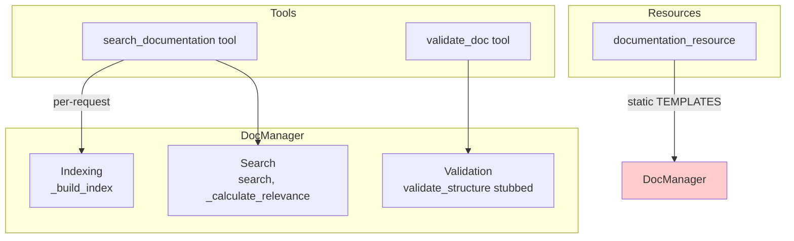
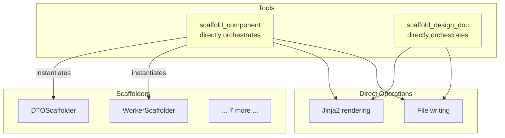
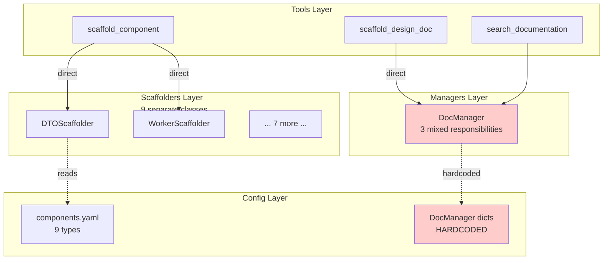
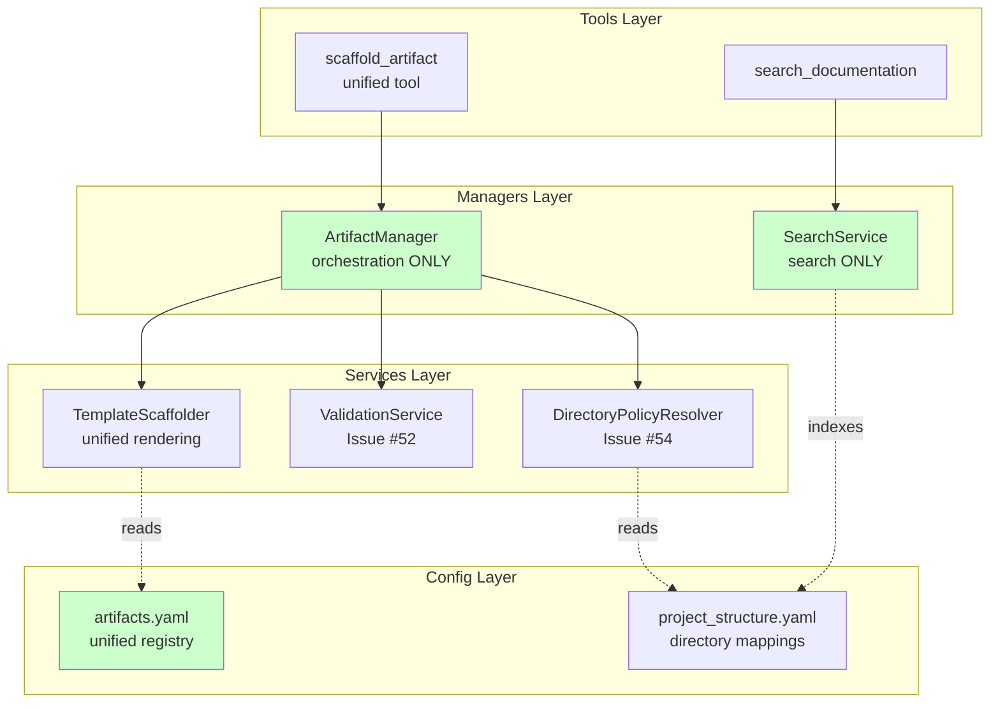

# Issue #56 Research: Unified Artifact Registry

| Metadata | Value |
|----------|-------|
| **Date** | 2026-01-17 |
| **Author** | GitHub Copilot |
| **Status** | APPROVED |
| **Issue** | [#56](https://github.com/user/repo/issues/56) |
| **Phase** | Research |
| **Epic** | [#49 - Platform Configurability](https://github.com/user/repo/issues/49) |
| **Related** | [#52 - Template Validation](#52), [#54 - Config Foundation](#54) |

---

## Executive Summary

### The Problem

**Original Scope:** Externalize DocManager hardcoded dicts (TEMPLATES, SCOPE_DIRS) to `.st3/documents.yaml`

**Discovered Issues:**
1. Creating separate `documents.yaml` duplicates `components.yaml` structure (SRP/DRY violation)
2. Documents and code components are both artifacts requiring same configuration patterns
3. `base_path` in components.yaml duplicates path information from project_structure.yaml
4. 9 separate scaffolder classes duplicate template-driven scaffolding logic
5. No unified scaffolding orchestration layer exists (tools call scaffolders directly)
6. DocManager mixes concerns (indexing + search + validation)

### The Solution Direction

**Unified Artifact System:**
- Single artifacts.yaml registry (not separate components.yaml + documents.yaml)
- Remove path duplication (use project_structure.yaml only)
- Unified template-driven scaffolding (eliminate 9 scaffolder class duplication)
- Clear orchestration layer for artifact creation

### Impact

**Positive:**
- ✅ DRY: Single source of truth for paths and artifact definitions
- ✅ SRP: Clear separation (registry / structure / orchestration)
- ✅ Consistency: Same patterns for all artifact types
- ✅ Extensibility: Easy to add new artifact types

**Challenges:**
- ❌ Breaking change (components.yaml → artifacts.yaml)
- ❌ Broader scope than original issue
- ❌ Requires new orchestration layer

---

## Current State Analysis

### Configuration Files

**components.yaml (175 lines):**
- 9 component types defined
- Each has 12 fields: type_id, description, scaffolder_class, scaffolder_module, template_path, fallback_template, name_suffix, base_path, test_base_path, generate_test, required_fields, optional_fields
- All template_path fields are `null` (Issue #107 scope)

**project_structure.yaml (105 lines):**
- 15 directories configured
- Each has: parent, description, allowed_component_types, allowed_extensions (optional), require_scaffold_for (optional)
- Document directories (docs/architecture, docs/development, etc.) NOT configured

**policies.yaml (42 lines):**
- 3 operations: scaffold, create_file, commit
- Defines allowed_phases per operation
- NO artifact state transition triggers defined

**DocManager (197 lines):**
- Hardcoded TEMPLATES dict (4 types)
- Hardcoded SCOPE_DIRS dict (5 scopes)
- Per-request instantiation (rebuilds index every call)
- 6 public methods: __init__, search, validate_structure, get_template, get_document_count, list_documents
- 3 responsibilities: indexing, search, validation (SRP violation potential)

**ScaffoldManager:**
- ❌ **DOES NOT EXIST**
- Scaffolding currently handled directly by tools (scaffold_component, scaffold_design_doc)
- Tools directly: validate config → instantiate scaffolder → call render → write file
- No orchestration layer

### Critical Issues Discovered

#### Issue 1: Path Duplication (DRY Violation)

**Observation:**
```yaml
# components.yaml
dto:
  base_path: "backend/dtos"  # ← Defined here

# project_structure.yaml  
directories:
  backend/dtos:
    allowed_component_types: [dto]  # ← Link also here
```

**Problem:** If directory structure changes, must update TWO files.

**Question:** Is `base_path` even needed if `allowed_component_types` already links artifacts to directories?

#### Issue 2: 9 Scaffolder Classes for Same Logic

**Observation:**
- DTOScaffolder, WorkerScaffolder, AdapterScaffolder, ToolScaffolder, ResourceScaffolder, SchemaScaffolder, InterfaceScaffolder, ServiceScaffolder, GenericScaffolder
- All follow pattern: load template → render Jinja2 → write file
- Only difference: which template to use (comes from components.yaml)

**Problem:** Logic duplication across 9 classes. Template path already in config.

**Question:** If template path is in config and rendering is generic, why 9 classes?

#### Issue 3: No Orchestration Layer

**Observation:**
- scaffold_component tool directly:
  1. Validates against components.yaml
  2. Instantiates specific scaffolder (e.g., DTOScaffolder)
  3. Calls scaffolder.render()
  4. Writes file via safe_edit_file

- scaffold_design_doc tool directly:
  1. Validates against DocManager.TEMPLATES
  2. Loads template
  3. Renders Jinja2
  4. Writes file

**Problem:** Scaffolding logic split across tools. No single point of orchestration.

**Question:** Should there be a manager layer (like DocManager for search) for creation?

#### Issue 4: DocManager Responsibility Confusion

**Observation:**
Current DocManager responsibilities:
1. **Indexing** - Scans filesystem, builds index of .md files
2. **Search** - Query processing, relevance scoring, snippet extraction
3. **Validation** - Template structure checks (stubbed)

**Problem:** Mixing READ concerns (search existing) with WRITE concerns (validate new).

**Question:** Is DocManager for:
- Option A: Document SEARCH only (indexing + search)
- Option B: Document LIFECYCLE (creation + search + validation)
- Option C: Document CREATION only (scaffolding + validation)

#### Issue 5: Components vs Artifacts Terminology

**Observation:**
- Config file named `components.yaml`
- Field named `allowed_component_types`
- But documents are NOT components (different concept)
- Research shows: both are "artifacts" in workflow

**Problem:** Terminology doesn't scale to documents, git texts, tests.

**Question:** Should rename to `artifacts.yaml` and `allowed_artifacts`?

### DocManager Role Ambiguity

**Current DocManager:**



**Questions:**
1. Should DocManager handle document **creation** (scaffolding)?
2. Should search be extracted to separate SearchService?
3. Should validation delegate to ValidationService (Issue #52)?
4. Is DocManager analogous to (theoretical) ScaffoldManager?

### Scaffolding Architecture Gap

**Current (No Orchestration):**



**Observation:** Tools have too much responsibility (validation + instantiation + rendering + writing).

**Question:** Should there be ScaffoldManager that tools call?

---

## Research Findings

### Finding 1: Artifacts Are Fundamentally Uniform

**Evidence:**
- Code components: require scaffolding, placement rules, validation, lifecycle
- Documents: require scaffolding, placement rules, validation, lifecycle
- Git texts: would benefit from scaffolding, placement rules, validation

**Difference:** Enforcement level (code: hard blocks, documents: warnings), not enforcement presence.

**Implication:** Could be treated uniformly through shared configuration and tooling.

### Finding 2: Path Information Duplicated

**Evidence:**
```yaml
# components.yaml defines paths
dto:
  base_path: "backend/dtos"
  test_base_path: "tests/backend/dtos"

# project_structure.yaml ALSO defines paths  
directories:
  backend/dtos:
    parent: backend
    allowed_component_types: [dto]  # This link is sufficient
```

**Analysis:** `allowed_component_types` already establishes artifact-to-directory mapping. `base_path` is redundant.

**Implication:** Can remove path fields from artifact registry (DRY).

### Finding 3: Template Rendering Is Generic

**Evidence:**
All scaffolder classes follow identical pattern:
1. Load template from path
2. Validate context has required fields
3. Render Jinja2 template with context
4. Return rendered content

Only artifact-specific part: which template path (from config).

**Implication:** Could use single template renderer instead of 9 scaffolder classes.

### Finding 4: No Scaffolding Orchestration Layer

**Evidence:**
- scaffold_component tool directly validates, instantiates scaffolder, renders, writes
- scaffold_design_doc tool directly validates, renders, writes
- No manager to delegate to (unlike search which has DocManager)

**Analysis:** Tools mix interface concerns (MCP protocol) with business logic (scaffolding).

**Implication:** Manager layer would separate concerns (like DocManager does for search).

### Finding 5: DocManager Has Mixed Concerns

**Evidence:**
DocManager methods serve different purposes:
- **READ**: search, _build_index, get_document_count, list_documents (indexing + search)
- **VALIDATE**: validate_structure (stubbed, not using Issue #52)
- **TEMPLATE**: get_template (stubbed, unused)

**Analysis:** No CREATE methods (no scaffold_document). But also has search (unrelated to scaffolding).

**Question:** Is DocManager for:
1. Document SEARCH (current primary use)
2. Document SCAFFOLDING (suggested in previous research)
3. Both (violates SRP)

### Finding 6: Validation Already Exists (Issue #52)

**Evidence:**
- ValidationService with LayeredTemplateValidator (STRICT/ARCHITECTURAL/GUIDELINE)
- Template metadata in YAML comment blocks
- TemplateAnalyzer extracts validation rules

**Current Problem:** DocManager.validate_structure is stubbed (only checks "# " title).

**Implication:** Should delegate to ValidationService, not reimplement validation.

### Finding 7: State Machines Need Configuration

**Evidence:**
Documents have lifecycle:
- research.md: DRAFT → APPROVED → DEFINITIVE
- tracking.md: LIVING DOCUMENT (never changes)

Code components:
- CREATED (immutable after scaffolding)

**Current State:** No state machine configuration exists. Manual status management.

**Implication:** Need to define valid transitions per artifact type (structural rules).

---

## Design Pattern Analysis

### Pattern 1: Manager Classes

**Current Implementation:**
- DocManager, GitManager, PhaseStateEngine, WorkflowManager, ProjectManager, DirectoryPolicyResolver
- Constructor accepts optional dependencies (| None = None)
- Falls back to default implementations if None provided
- Stores workspace_root or derived paths as instance variables
- Public methods for business logic, private (\_method) for internals
- **NOT singletons** - instantiated per-request or per-tool
- Google-style docstrings

**Example:**
```python
class DocManager:
    def __init__(self, docs_dir: Path | None = None) -> None:
        if docs_dir is None:
            workspace = Path(settings.server.workspace_root)
            self.docs_dir = workspace / "docs"
        else:
            self.docs_dir = docs_dir
        self._index: list[dict[str, Any]] = []
        self._build_index()
```

**Issue #56 Application:**
- ArtifactManager follows same pattern
- SearchService extracted from DocManager

---

### Pattern 2: Scaffolder Classes

**Current Implementation:**
- BaseScaffolder provides base implementation
- ComponentScaffolder Protocol defines interface
- Requires JinjaRenderer dependency in constructor
- validate() and scaffold() methods expected
- Returns ScaffoldResult dataclass
- **Note:** Only base classes exist, concrete scaffolders (DTOScaffolder, WorkerScaffolder) not implemented yet

**Example:**
```python
@dataclass(frozen=True)
class ScaffoldResult:
    content: str
    file_name: str | None = None

class BaseScaffolder:
    def __init__(self, renderer: "JinjaRenderer") -> None:
        self.renderer = renderer
    
    def validate(self, **kwargs: Any) -> bool:
        if "name" in kwargs:
            validate_pascal_case(kwargs["name"])
        return True
```

**Issue #56 Application:**
- TemplateScaffolder extends BaseScaffolder
- Follows Protocol interface
- Uses JinjaRenderer dependency

---

### Pattern 3: Config/Registry Pattern

**Current Implementation:**
- All configs use Pydantic BaseModel
- Singleton pattern via ClassVar + from_file() classmethod
- YAML files stored in .st3/ directory
- reset_instance() classmethod for testing
- Raises ConfigError (not ValidationError) on file issues
- Field validation using Pydantic validators
- Nested models for complex structures

**Example:**
```python
class ComponentRegistryConfig(BaseModel):
    components: Dict[str, ComponentDefinition] = Field(...)
    singleton_instance: ClassVar[Optional["ComponentRegistryConfig"]] = None
    
    @classmethod
    def from_file(cls, config_path: str = ".st3/components.yaml") -> "ComponentRegistryConfig":
        if cls.singleton_instance is not None:
            return cls.singleton_instance
        # Load YAML, validate, cache
        cls.singleton_instance = cls(**data)
        return cls.singleton_instance
    
    @classmethod
    def reset_instance(cls) -> None:
        cls.singleton_instance = None
```

**Issue #56 Application:**
- ArtifactRegistryConfig follows exact same pattern
- Singleton via ClassVar + from_file()
- .st3/artifacts.yaml location
- reset_instance() for tests

---

### Pattern 4: Tool Integration Pattern

**Current Implementation:**
- All tools inherit from BaseTool
- Separate Pydantic input model per tool (ToolNameInput)
- Constructor accepts optional manager (| None = None)
- Falls back to default manager if None
- async execute(params: InputModel) signature
- Returns ToolResult.text() or ToolResult.error()
- Automatic error handling via @tool_error_handler decorator

**Example:**
```python
class ValidateDocInput(BaseModel):
    content: str = Field(..., description="Document content")
    template_type: str = Field(..., description="Template type")

class ValidateDocTool(BaseTool):
    name = "validate_document_structure"
    description = "Validate document structure"
    args_model = ValidateDocInput
    
    def __init__(self, manager: DocManager | None = None) -> None:
        self.manager = manager or DocManager()
    
    @property
    def input_schema(self) -> dict[str, Any]:
        return self.args_model.model_json_schema()
    
    async def execute(self, params: ValidateDocInput) -> ToolResult:
        result = self.manager.validate_structure(params.content, params.template_type)
        return ToolResult.text(f"Validation result: {result}")
```

**Issue #56 Application:**
- scaffold_artifact tool follows BaseTool pattern
- ScaffoldArtifactInput Pydantic model
- Optional ArtifactManager injection

---

### Pattern 5: Dependency Injection Pattern

**Current Implementation:**
- Constructor parameters use Optional type (| None = None)
- Defaults instantiated in constructor if None
- **NO DI container** - manual construction
- Tests inject mocks, production uses defaults
- Layers: Tool → Manager → Adapter/Config

**Example:**
```python
# Manager with adapter injection
class GitManager:
    def __init__(self, adapter: GitAdapter | None = None) -> None:
        self.adapter = adapter or GitAdapter()

# Tool with manager injection
class CreateBranchTool(BaseTool):
    def __init__(self, manager: GitManager | None = None) -> None:
        self.manager = manager or GitManager()
```

**Issue #56 Application:**
- ArtifactManager accepts optional registry and scaffolder
- SearchService may be stateless (no instance dependencies)
- Tools inject optional ArtifactManager

---

### Pattern 6: Error Handling Pattern

**Current Implementation:**
- MCPError base exception with message, code, hints
- Specialized: ValidationError, PreflightError, ExecutionError, MCPSystemError
- ConfigError separate (config loading only)
- @tool_error_handler decorator auto-converts to ToolResult.error()
- Exceptions store metadata (hints, blockers, recovery strategies)

**Example:**
```python
class MCPError(Exception):
    def __init__(self, message: str, code: str = "ERR_INTERNAL", hints: list[str] | None = None):
        self.message = message
        self.code = code
        self.hints = hints or []

class ValidationError(MCPError):
    def __init__(self, message: str, hints: list[str] | None = None):
        super().__init__(message, code="ERR_VALIDATION", hints=hints)

# Usage
raise ValidationError(
    f"Unknown artifact type: {artifact_type}",
    hints=[f"Available: {', '.join(available_types)}"]
)
```

**Issue #56 Application:**
- Use existing ValidationError for unknown artifact types
- Use ConfigError for artifacts.yaml loading issues
- No new exception types needed

---

### Pattern 7: Testing Pattern

**Current Implementation:**
- pytest with fixtures
- Integration tests exist (tests/integration/)
- Unit tests minimal (tests/unit/ nearly empty)
- Uses MagicMock for dependencies
- tmp_path fixture for temporary directories
- Class-based organization (TestClassName)
- @pytest.mark.asyncio for async tests

**Example:**
```python
class TestIssue39CrossMachine:
    @pytest.fixture
    def workspace_root(self, tmp_path: Path) -> Path:
        workspace = tmp_path / "workspace"
        workspace.mkdir()
        return workspace
    
    @pytest.mark.asyncio
    async def test_complete_flow(self, workspace_root: Path) -> None:
        project_manager = ProjectManager(workspace_root=workspace_root)
        git_manager = MagicMock()
        # Test logic
```

**Issue #56 Application:**
- CREATE unit tests (currently missing pattern)
- tests/unit/managers/test_artifact_manager.py
- tests/unit/scaffolders/test_template_scaffolder.py
- Fixtures for mock registry, mock dependencies
- Separate success and error test cases

---

### Pattern 8: Service Pattern (NEW)

**Current Implementation:**
- **Does NOT exist** in current codebase
- No services/ directory
- Managers currently handle all business logic

**Issue #56 Introduction:**
SearchService establishes NEW pattern:
- Stateless utility functions
- Extracted from managers when no state needed
- Static methods or simple functions
- Pure business logic without persistence concerns

**Example:**
```python
class SearchService:
    """Stateless service for documentation search.
    
    Services are stateless utilities extracted from managers.
    Unlike managers, don't store state between calls.
    """
    
    @staticmethod
    def search_index(
        index: list[dict[str, Any]],
        query: str,
        max_results: int = 10
    ) -> list[dict[str, Any]]:
        """Pure function - no instance state required."""
        # Search logic
```

**Rationale:**
- DocManager's search logic doesn't need instance state
- Extracting to SearchService creates stateless utility
- Managers orchestrate, services execute pure logic

---

## Design Pattern Summary

| Pattern | Status | Issue #56 Action |
|---------|--------|------------------|
| **Manager Pattern** | ✅ Established | Follow for ArtifactManager |
| **Scaffolder Pattern** | ⚠️ Base only | Implement TemplateScaffolder |
| **Config Pattern** | ✅ Consistent | Follow for ArtifactRegistryConfig |
| **Tool Pattern** | ✅ Established | Follow for scaffold_artifact |
| **DI Pattern** | ✅ Consistent | Optional injection throughout |
| **Error Pattern** | ✅ Established | Use existing exceptions |
| **Testing Pattern** | ⚠️ Minimal units | Create unit tests |
| **Service Pattern** | ❌ NEW | Introduce with SearchService |

**Consistency Rules for Issue #56:**
1. ✅ Manager constructors: `def __init__(self, dependency: Type | None = None)`
2. ✅ Configs: Pydantic + singleton + from_file() + reset_instance()
3. ✅ Tools: BaseTool + Pydantic input + optional manager DI
4. ✅ Errors: Use ValidationError, ConfigError (existing hierarchy)
5. ✅ YAML: .st3/ directory location
6. ✅ Docstrings: Google-style
7. ✅ Testing: pytest + fixtures + MagicMock
8. ✅ Services: NEW pattern, stateless, extracted from managers

---

## Decisions (Answered Questions)

### D1: Configuration Structure (was Q1)

**Decision:** ✅ **Single artifacts.yaml** (NOT separate components.yaml + documents.yaml)

**Rationale:**
- Architectural insights principle: "Artifacts Are Fundamentally Uniform"
- Documents and code are both artifacts requiring same patterns (WAT/WAAR/WANNEER/HOE)
- Separate configs would violate SRP/DRY
- Consistent with Epic #49 pattern (single workflow config, not per-phase configs)

**Implementation:** components.yaml → artifacts.yaml (breaking change acceptable per Issue #50 pattern)

---

### D2: Path Fields (was Q2)

**Decision:** ✅ **Remove base_path** from artifacts.yaml (use project_structure.yaml only)

**Rationale:**
- `allowed_component_types` in project_structure.yaml ALREADY establishes artifact-to-directory link
- Having base_path in artifacts.yaml violates DRY (path info in TWO places)
- SRP: artifacts.yaml defines WHAT exists, project_structure.yaml defines WHERE they go
- Simpler: lookup directory via `find_directories_for_artifact(type)` helper

**Breaking Change:** Yes, but justified by DRY principle

---

### D3: Scaffolder Architecture (was Q3)

**Decision:** ✅ **Unify into single TemplateScaffolder** (eliminate 9 scaffolder classes)

**Rationale:**
- All 9 scaffolders follow IDENTICAL workflow: load template → render Jinja2 → write file
- Only difference: template path (already in config)
- No artifact-specific logic found in existing scaffolders
- Template-driven everything principle: configuration drives behavior

**Implementation:**
```python
class TemplateScaffolder:
    def scaffold(self, artifact_type: str, context: dict) -> str:
        artifact = artifacts_config.get_artifact(artifact_type)
        template = load_template(artifact.template)
        return template.render(**context)
```

**Migration:** Delete DTOScaffolder, WorkerScaffolder, etc. → Single class

---

### D4: Manager Layer (was Q4)

**Decision:** ✅ **Create ArtifactManager** (unified manager for all artifacts)

**Rationale:**
- Architectural insights: DocManager currently has 3 mixed responsibilities
- ScaffoldManager doesn't exist (tools call scaffolders directly)
- Unified artifact principle: same patterns for code/docs/git texts
- Manager separates concerns: tools (MCP protocol) vs business logic (scaffolding)

**Architecture:**
```
Tools (scaffold_artifact)
  ↓
ArtifactManager (orchestration)
  ↓
├── TemplateScaffolder (rendering)
├── ValidationService (validation - Issue #52)
└── DirectoryPolicyResolver (placement - Issue #54)
```

**DocManager fate:** Extract search → SearchService, scaffolding → ArtifactManager

---

### D5: DocManager Role (was Q5)

**Decision:** ✅ **Option D: Split into SearchService + ArtifactManager**

**Current DocManager has 3 responsibilities:**
1. Indexing + Search (READ operations)
2. Validation (delegates to Issue #52)
3. Template management (unused, stubbed)

**New architecture:**

**SearchService** (extracted from DocManager):
- Indexing: _build_index()
- Search: search(), _calculate_relevance()
- Listing: get_document_count(), list_documents()
- **Responsibility:** Find existing documents

**ArtifactManager** (new, replaces scaffolding parts):
- Scaffolding: scaffold_artifact()
- Validation: validate_artifact() (delegates to ValidationService)
- Placement: get_artifact_path() (uses DirectoryPolicyResolver)
- **Responsibility:** Create new artifacts

**Rationale:**
- SRP: Separate READ (search) from WRITE (scaffold)
- ArtifactManager handles ALL artifacts (not just documents)
- SearchService handles ALL searchable content (docs, later code)

---

### D6: Scope of Issue #56 (was Q6)

**Decision:** ✅ **Medium Scope** (unified artifacts, core tooling, defer enforcement)

**IN SCOPE for Issue #56:**
1. ✅ Create artifacts.yaml (merge components + documents + future git texts)
2. ✅ Remove base_path duplication (use project_structure.yaml only)
3. ✅ Extend project_structure.yaml with document directories
4. ✅ Create ArtifactManager (unified orchestration)
5. ✅ Create TemplateScaffolder (unified rendering)
6. ✅ Split DocManager → SearchService (search only)
7. ✅ Add state machine definitions to artifacts.yaml (structure only)
8. ✅ Update scaffold_component tool → scaffold_artifact (unified interface)
9. ✅ Migrate all existing code to new architecture

**OUT OF SCOPE for Issue #56 (deferred to Epic #18):**
- ❌ State transition EXECUTION (PolicyEngine triggers)
- ❌ Automated status changes (phase_exit handlers)
- ❌ Enforcement of state machines (blocking invalid transitions)
- ❌ artifact_state_triggers in policies.yaml (trigger definitions)

**Rationale:**
- Epic #49 is EXTERNALIZATION (data → config), not enforcement (execution)
- State machines: define structure NOW (valid states/transitions), execute LATER (Epic #18)
- Addresses DRY/SRP issues without massive scope creep
- Creates foundation for Epic #18 enforcement

---

## Additional Decisions

### D7: Terminology Standardization

**Decision:** ✅ Rename "component" → "artifact" throughout codebase

**Changes:**
- components.yaml → artifacts.yaml
- allowed_component_types → allowed_artifact_types
- ComponentRegistryConfig → ArtifactRegistryConfig
- scaffold_component → scaffold_artifact
- ComponentTypeManager → ArtifactTypeManager (if needed)

**Rationale:** Consistent terminology that scales beyond code components

---

### D8: State Machine Configuration

**Decision:** ✅ Add state_machine section to artifacts.yaml (structure only)

**Schema:**
```yaml
artifact_types:
  - type: doc
    name: research
    template: documents/research.md.jinja2
    state_machine:
      states: [DRAFT, APPROVED, DEFINITIVE]
      initial_state: DRAFT
      valid_transitions:
        - from: DRAFT
          to: [APPROVED, DEFINITIVE]
        - from: APPROVED
          to: [DEFINITIVE]
```

**Rationale:**
- Defines structural validity (which transitions CAN happen)
- Epic #18 will add triggers (WHEN transitions happen)
- Separates structure from behavior (SRP)

**Special case:**
```yaml
state_machine:
  states: [LIVING DOCUMENT]
  initial_state: LIVING DOCUMENT
  valid_transitions: []  # No state changes allowed
```

---

### D9: Directory Configuration

**Decision:** ✅ Extend project_structure.yaml with ALL artifact locations

**Add document directories:**
```yaml
directories:
  - path: docs/architecture
    parent: docs
    allowed_artifact_types: [architecture, design, tracking]
  
  - path: docs/development
    parent: docs
    allowed_artifact_types: [research, planning, design, tracking]
  
  - path: docs/reference
    parent: docs
    allowed_artifact_types: [reference]
```

**Rationale:** Complete directory → artifact mapping in one place

---

### D10: Validation Integration

**Decision:** ✅ ArtifactManager delegates to ValidationService (Issue #52)

**Flow:**
1. Tool calls: `artifact_manager.scaffold_artifact(type, context)`
2. ArtifactManager loads template
3. ArtifactManager renders template
4. **ArtifactManager validates** via ValidationService.validate_template()
5. ArtifactManager writes file via safe_edit_file

**Rationale:** No duplication of validation logic, reuse Issue #52 infrastructure

---

### D11: Backward Compatibility

**Decision:** ✅ **Breaking change** (NO backward compatibility, like Issue #50)

**Migration strategy:**
- Update all tools/managers to use artifacts.yaml
- Update all tests
- Delete components.yaml after migration
- Document breaking change in CHANGELOG

**Rationale:**
- Clean architecture more valuable than compatibility
- Early in project lifecycle (acceptable to break)
- Consistent with Issue #50 pattern

---

## Scope Summary

### What Issue #56 Delivers

**Configuration (data externalization):**
- ✅ artifacts.yaml (unified registry with state machines)
- ✅ Extended project_structure.yaml (document directories)
- ✅ Pydantic models (ArtifactRegistryConfig, ArtifactDefinition)

**Architecture (unified tooling):**
- ✅ ArtifactManager (orchestration for all artifacts)
- ✅ TemplateScaffolder (unified rendering)
- ✅ SearchService (extracted from DocManager)

**Tools (unified interface):**
- ✅ scaffold_artifact (replaces scaffold_component + scaffold_design_doc)
- ✅ Updated search_documentation (uses SearchService)

**Migration:**
- ✅ All existing code updated to new architecture
- ✅ All tests updated
- ✅ components.yaml deleted

### What Issue #56 Does NOT Deliver

**Enforcement (deferred to Epic #18):**
- ❌ PolicyEngine integration
- ❌ Automated state transitions
- ❌ artifact_state_triggers in policies.yaml
- ❌ Phase transition handlers

**Future Extensions:**
- ❌ Git text scaffolding (issue description, PR description)
- ❌ Test scaffolding automation
- ❌ Multi-file artifact patterns

---

## Architecture Diagrams

### Current Architecture (Before Issue #56)



**Problems:**
- 🔴 No orchestration (tools call scaffolders directly)
- 🔴 9 scaffolder class duplication
- 🔴 Hardcoded templates in DocManager
- 🔴 DocManager mixed responsibilities
- 🔴 Separate code/doc scaffolding paths

---

### Target Architecture (After Issue #56)



**Improvements:**
- ✅ Single orchestration layer (ArtifactManager)
- ✅ Single scaffolder (TemplateScaffolder)
- ✅ Unified config (artifacts.yaml)
- ✅ Clear SRP (managers/services/config)
- ✅ Same path for all artifacts

---

## Implementation Phases

### Phase 1: Configuration Foundation
**TDD Cycles 1-3**
- **Config Pattern:** Create ArtifactRegistryConfig (Pydantic + singleton + from_file())
- Create artifacts.yaml with merged component + document definitions
- Add state_machine section to artifact definitions
- Extend project_structure.yaml with document directories
- Create ArtifactDefinition nested model
- Add reset_instance() for testing
- **Validation:** Use ConfigError for YAML loading issues
- **Testing:** Unit tests for config loading, singleton behavior, validation

### Phase 2: Unified Scaffolding
**TDD Cycles 4-6**
- **Scaffolder Pattern:** Create TemplateScaffolder extending BaseScaffolder
- Follows ComponentScaffolder Protocol
- **DI Pattern:** JinjaRenderer injected in constructor (| None = None)
- Returns ScaffoldResult dataclass
- Implement validate() and scaffold() methods
- Load templates from ArtifactRegistryConfig
- **Validation:** Use ValidationError for unknown artifact types
- **Testing:** Unit tests for scaffolder, mock renderer, mock registry

### Phase 3: Manager Layer
**TDD Cycles 7-8**
- **Manager Pattern:** Create ArtifactManager
- Constructor: `def __init__(self, workspace_root: Path | None = None, registry: ArtifactRegistryConfig | None = None)`
- Falls back to defaults if None (DI pattern)
- Stores workspace_root as instance variable
- Public methods: scaffold_artifact(), get_artifact_path(), validate_artifact()
- Private methods: _load_template(), _resolve_directory()
- Delegates to TemplateScaffolder for rendering
- Delegates to DirectoryPolicyResolver for placement
- **NOT singleton** - instantiated per tool
- **Testing:** Unit tests with mocked dependencies

### Phase 4: Search Extraction
**TDD Cycles 9-10**
- **Service Pattern (NEW):** Create SearchService
- Extract search logic from DocManager
- Stateless static methods
- search_index(), calculate_relevance(), extract_snippets()
- No instance state - pure functions
- Update search_documentation tool to use SearchService
- Deprecate DocManager (mark for removal)
- **Testing:** Unit tests for search algorithms, no mocks needed (stateless)

### Phase 5: Tool Unification
**TDD Cycles 11-12**
- **Tool Pattern:** Create scaffold_artifact tool
- Inherits from BaseTool
- ScaffoldArtifactInput Pydantic model
- Optional ArtifactManager injection (| None = None)
- async execute(params: ScaffoldArtifactInput) → ToolResult
- input_schema property from Pydantic
- @tool_error_handler automatic (via BaseTool)
- Deprecate scaffold_component tool
- Deprecate scaffold_design_doc tool
- **Testing:** Integration tests with real ArtifactManager

### Phase 6: Migration & Cleanup
**TDD Cycles 13-14**
- Update all tools to use ArtifactManager
- Update all references from components.yaml → artifacts.yaml
- Delete 9 scaffolder stub classes (only BaseScaffolder existed)
- Rename ComponentRegistryConfig → ArtifactRegistryConfig (breaking change)
- Rename allowed_component_types → allowed_artifact_types
- Delete components.yaml after artifacts.yaml proven
- Update all integration tests
- **Validation:** Ensure all tools use ValidationError consistently
- **Testing:** Full regression test suite

---

## Success Criteria

Issue #56 succeeds when:

1. ✅ **Single artifacts.yaml** exists with all artifact types (code + docs)
2. ✅ **No path duplication** (removed base_path, use project_structure.yaml only)
3. ✅ **Single TemplateScaffolder** (9 scaffolder classes deleted)
4. ✅ **ArtifactManager exists** (orchestration layer created)
5. ✅ **SearchService exists** (extracted from DocManager)
6. ✅ **scaffold_artifact tool** works for ALL artifact types
7. ✅ **State machines defined** in artifacts.yaml (structure only)
8. ✅ **All tests pass** with new architecture
9. ✅ **No hardcoded artifact data** remains in Python code
10. ✅ **SRP maintained** across all configs (artifacts/structure/policies)

---

## Next Steps

1. ✅ **Research complete** - All questions answered, decisions made
2. ➡️ **Transition to Planning** - Create planning.md with TDD cycle breakdown
3. 🔄 **Design schemas** - Complete artifacts.yaml structure
4. 🔄 **Design architecture** - ArtifactManager + TemplateScaffolder + SearchService
5. 🔄 **Plan migration** - Breaking changes, test updates

---

**Status:** DRAFT → APPROVED (ready for planning)  
**All Critical Questions:** ANSWERED  
**Scope:** DEFINED (medium scope, Epic #49 only)  
**Next:** planning.md creation
