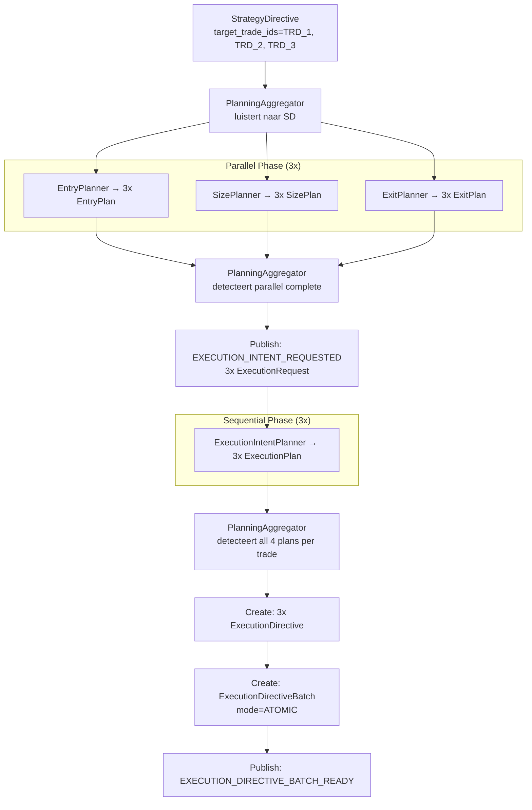

```mermaid
graph TB
    SD[StrategyDirective<br/>target_trade_ids=TRD_1, TRD_2, TRD_3]
    
    PA1[PlanningAggregator<br/>luistert naar SD]
    
    subgraph "Parallel Phase (3x)"
        EP1[EntryPlanner → 3x EntryPlan]
        SP1[SizePlanner → 3x SizePlan]
        XP1[ExitPlanner → 3x ExitPlan]
    end
    
    PA2[PlanningAggregator<br/>detecteert parallel complete]
    
    ER[Publish: EXECUTION_INTENT_REQUESTED<br/>3x ExecutionRequest]
    
    subgraph "Sequential Phase (3x)"
        EIP[ExecutionIntentPlanner → 3x ExecutionPlan]
    end
    
    PA3[PlanningAggregator<br/>detecteert all 4 plans per trade]
    
    ED[Create: 3x ExecutionDirective]
    
    EDB[Create: ExecutionDirectiveBatch<br/>mode=ATOMIC]
    
    EVT[Publish: EXECUTION_DIRECTIVE_BATCH_READY]
    
    SD --> PA1
    PA1 --> EP1 & SP1 & XP1
    EP1 & SP1 & XP1 --> PA2
    PA2 --> ER
    ER --> EIP
    EIP --> PA3
    PA3 --> ED
    ED --> EDB
    EDB --> EVT
```