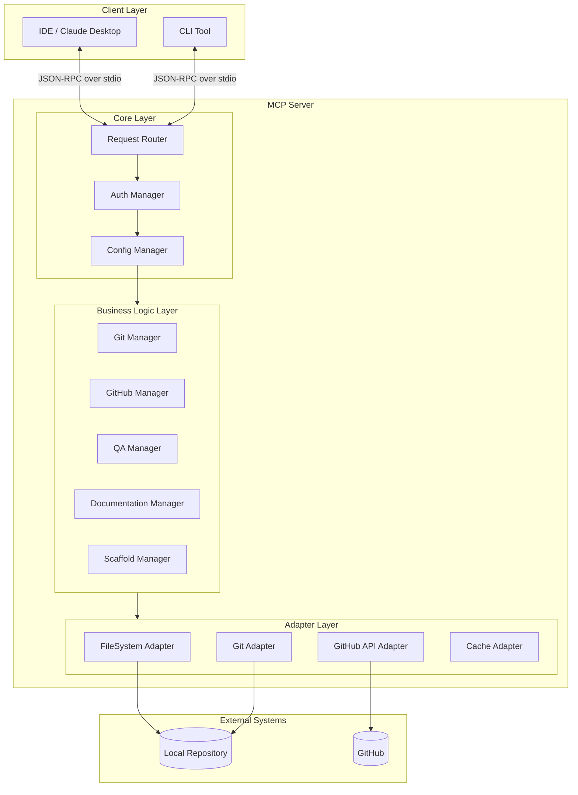
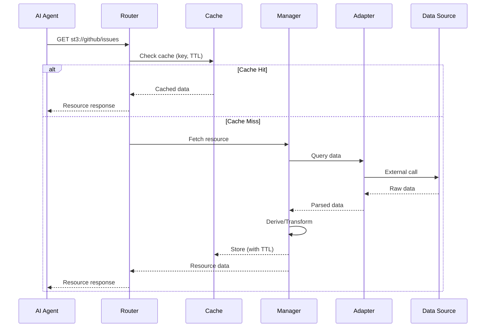
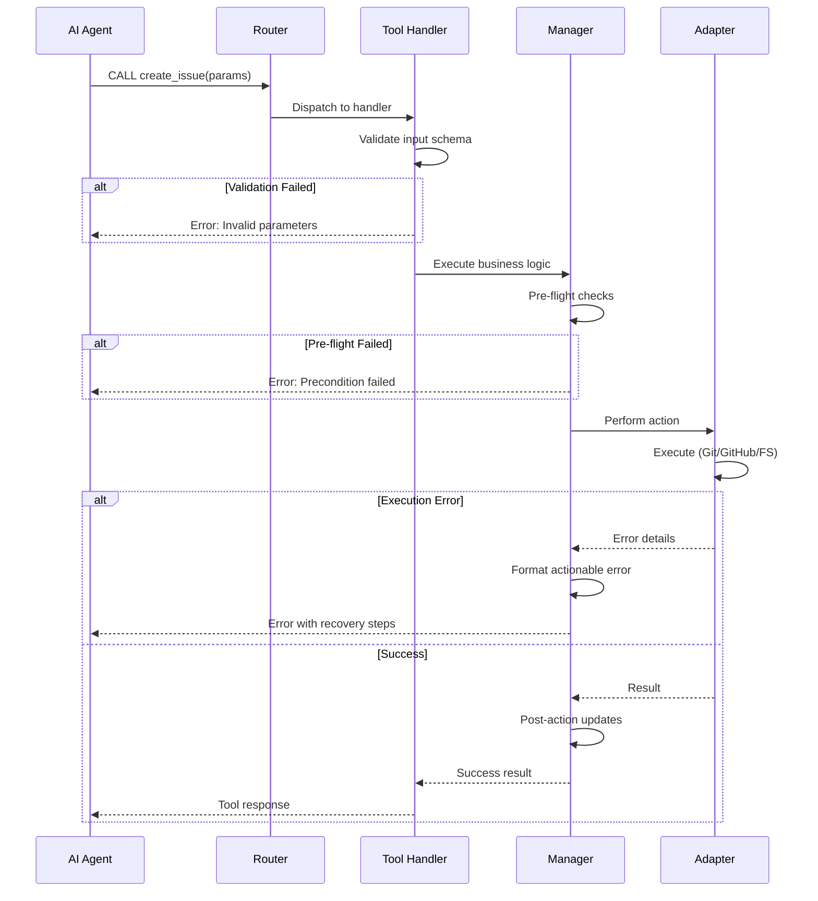
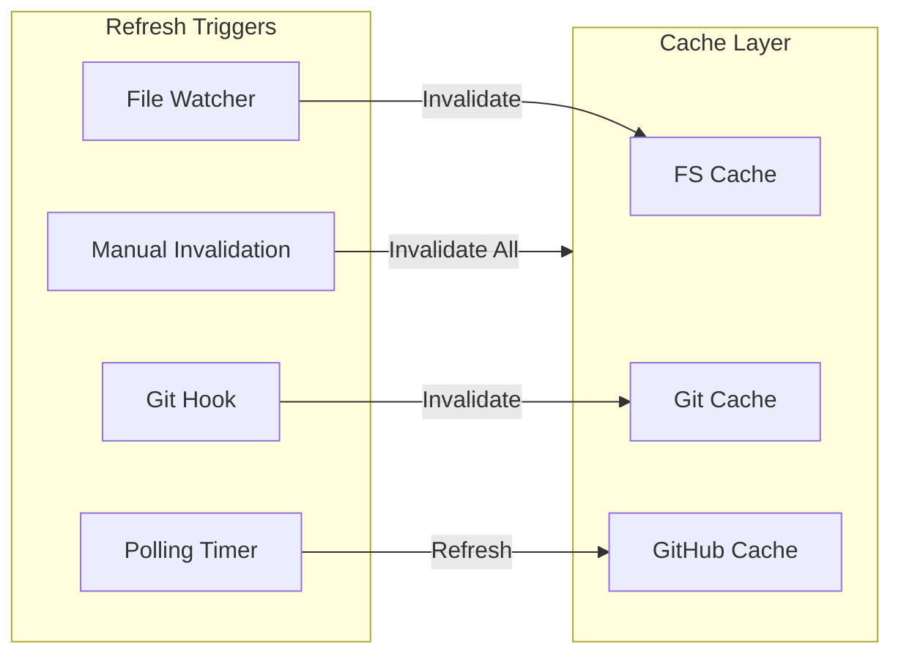
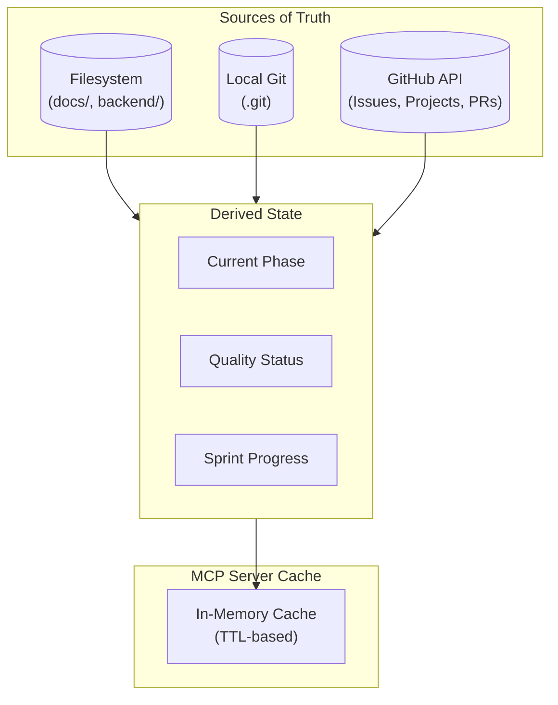

# ST3 Workflow MCP Server - Architecture

**Status:** DRAFT  
**Version:** 2.0  
**Last Updated:** 2025-12-08

---

## 1. Overview

### 1.1 Purpose

The **ST3 Workflow MCP Server** is a specialized Model Context Protocol (MCP) server designed to orchestrate the development workflow of the SimpleTraderV3 project. It acts as an intelligent bridge between AI agents and the project's development environment.

### 1.2 Core Capabilities

| Capability | Description |
|------------|-------------|
| **Semantic Context** | Exposes project status, rules, GitHub issues, and active tasks as structured Resources |
| **Enforced Workflows** | Encapsulates Git, QA, and GitHub processes into robust, rule-enforcing Tools |
| **Fail-Safe Operations** | Prevents common errors via pre-flight validation (e.g., quality gates before merge) |
| **GitHub Integration** | Full issue lifecycle management, project board sync, and PR automation |
| **Documentation Automation** | Template-based document scaffolding and structure validation |

### 1.3 Design Principles

The MCP Server follows the same core principles as the ST3 project itself:

| Principle | Application to MCP Server |
|-----------|---------------------------|
| **Plugin First** | Tools and Resources are modular, self-contained units with clear interfaces |
| **Separation of Concerns** | Managers handle business logic; Adapters handle external system integration |
| **Configuration-Driven** | Server behavior controlled via `mcp_config.yaml`, not hardcoded |
| **Contract-Driven** | All tool inputs/outputs defined via JSON Schema; Resources have explicit schemas |


### 1.4 Development Lifecycle

The MCP Server orchestrates a 7-phase development lifecycle ensuring strict adherence to TDD and quality standards.

> **Detailed Process:** See [PHASE_WORKFLOWS.md](./PHASE_WORKFLOWS.md) for the complete definition of phases, entry/exit criteria, and automated transitions.

| Phase | Focus | Key Activities |
|-------|-------|----------------|
| **0. Discovery** | Problem Exploration | Discussion, prototypes, tech spike |
| **1. Planning** | Work Breakdown | Requirements gathering, task creation |
| **2. Architectural** | System Design | High-level design, component boundaries |
| **3. Component** | Detailed Design | Interface definition, data modeling |
| **4. TDD** | Implementation | Red-Green-Refactor loop |
| **5. Integration** | Wiring & Testing | End-to-end verification, regression testing |
| **6. Documentation** | Handover | Reference docs, usage guides |

---

## 2. Tech Stack

### 2.1 Decision: Python (`mcp` package)

The SimpleTraderV3 project is strictly **100% Python**. Using Python for the MCP server enables maximum synergy.

### 2.2 Rationale

| Criterion | TypeScript (Default MCP) | Python (`mcp`) | Decision |
|-----------|-------------------------|----------------|----------|
| **Project Consistency** | ❌ Introduces Node.js toolchain | ✅ 100% Python | **Python** |
| **Code Reuse** | ❌ Cannot import ST3 validators | ✅ Direct import of `backend.*` | **Python** |
| **Tooling** | ❌ Separate linting/testing | ✅ Shared pytest, pylint, mypy | **Python** |
| **Configuration** | ❌ Separate package.json | ✅ Shared pyproject.toml | **Python** |
| **Maintenance** | ❌ Context switching | ✅ Single ecosystem | **Python** |

### 2.3 Dependencies

```yaml
runtime:
  python: ">=3.11"
  mcp: ">=0.9.0"           # MCP SDK
  pydantic: ">=2.0"        # Schema validation
  gitpython: ">=3.1"       # Git operations
  pygithub: ">=2.0"        # GitHub API
  watchdog: ">=3.0"        # File system watching
  jinja2: ">=3.0"          # Template rendering
  httpx: ">=0.25"          # HTTP client for GitHub

development:
  pytest: ">=7.0"
  pytest-asyncio: ">=0.21"
  mypy: ">=1.0"
```

---

## 3. System Architecture

### 3.1 High-Level Component Diagram



### 3.2 Layer Responsibilities

| Layer | Components | Responsibility |
|-------|------------|----------------|
| **Core** | Router, Auth, Config | Request handling, authentication, configuration |
| **Business Logic** | Managers | Workflow logic, rule enforcement, state derivation |
| **Adapters** | FS, Git, GitHub, Cache | External system integration, data access |

---

## 4. Module Structure

```
mcp_server/
├── __init__.py
├── server.py                    # MCP server entry point
├── config.py                    # Configuration loading
│
├── core/
│   ├── __init__.py
│   ├── router.py                # Request routing
│   ├── auth.py                  # Token management
│   └── errors.py                # Custom exceptions
│
├── managers/
│   ├── __init__.py
│   ├── git_manager.py           # Git operations + validation
│   ├── github_manager.py        # GitHub API orchestration
│   ├── qa_manager.py            # Quality gate execution
│   ├── doc_manager.py           # Documentation operations
│   └── scaffold_manager.py      # Code/doc generation
│
├── adapters/
│   ├── __init__.py
│   ├── filesystem.py            # File read/write
│   ├── git.py                   # GitPython wrapper
│   ├── github.py                # PyGithub wrapper
│   └── cache.py                 # TTL-based caching
│
├── resources/
│   ├── __init__.py
│   ├── status.py                # st3://status/* resources
│   ├── github.py                # st3://github/* resources
│   ├── rules.py                 # st3://rules/* resources
│   └── templates.py             # st3://templates/* resources
│
├── tools/
│   ├── __init__.py
│   ├── discovery.py             # search_documentation, get_work_context
│   ├── documentation.py         # scaffold_document, validate_structure
│   ├── github_issues.py         # create_issue, update_issue, close_issue, etc.
│   ├── scaffold_artifact.py     # scaffold_artifact (unified code/doc scaffolding)
│   ├── quality.py               # run_quality_gates, fix_whitespace, count_tests
│   └── git.py                   # create_feature_branch, commit_tdd_phase, etc.
│
├── schemas/
│   ├── __init__.py
│   ├── config_schema.py         # mcp_config.yaml schema
│   ├── tool_schemas.py          # Tool input/output schemas
│   └── resource_schemas.py      # Resource output schemas
│
└── templates/
    ├── components/
    │   ├── dto.py.jinja2
    │   ├── worker.py.jinja2
    │   └── test.py.jinja2
    └── documents/
        ├── design.md.jinja2
        └── reference.md.jinja2
```

---

## 5. Data Flow

### 5.1 Resource Request Flow



### 5.2 Tool Execution Flow



---

## 6. Resources Architecture

### 6.1 Resource URIs

| URI Pattern | Manager | Adapter | Cache TTL |
|-------------|---------|---------|-----------|
| `st3://status/implementation` | DocumentIndexer | FileSystem | 30s |
| `st3://status/phase` | GitManager + GHManager | Git + GitHub | 10s |
| `st3://github/issues` | GHManager | GitHub | 60s |
| `st3://github/project` | GHManager | GitHub | 120s |
| `st3://rules/coding_standards` | DocumentIndexer | FileSystem | 60s |
| `st3://artifacts/list` | ArtifactRegistry | FileSystem | 300s |

### 6.2 Resource Refresh Strategy



---

## 7. Tools Architecture

### 7.1 Tool Categories

| Category | Manager | Tools Count | Side Effects |
|----------|---------|-------------|--------------|
| Discovery | DocumentIndexer | 2 | None (read-only) |
| Documentation | ArtifactManager | 3 | Creates/modifies files |
| GitHub Issues | GHManager | 7 | Creates/modifies issues, project board |
| Implementation | ArtifactManager | 2 | Creates files |
| Quality | ValidationService | 3 | May modify files (auto-fix) |
| Git | GitManager | 4 | Git operations, pushes |
| Validation | ValidationService | 3 | Validates structure, strictness, naming |

### 7.2 Tool Validation Pattern

All tools follow a consistent validation pattern:

```python
@mcp.tool()
async def create_issue(
    title: str,
    body: str,
    labels: list[str] | None = None,
    milestone: str | None = None,
) -> CreateIssueResult:
    """Creates a GitHub issue with project board integration."""
    
    # 1. Schema validation (automatic via Pydantic)
    
    # 2. Pre-flight checks
    if milestone and not await github_manager.milestone_exists(milestone):
        raise ToolError("ERR_MILESTONE_NOT_FOUND", f"Milestone '{milestone}' does not exist")
    
    # 3. Execute
    result = await github_manager.create_issue(title, body, labels, milestone)
    
    # 4. Post-action (e.g., add to project board)
    await github_manager.add_to_project(result.issue_number)
    
    return result
```

### 7.3 Idempotency & Dry-Run Support

| Tool | Idempotent | Dry-Run | Notes |
|------|------------|---------|-------|
| `search_documentation` | ✅ | N/A | Read-only |
| `create_issue` | ❌ | ✅ | Returns preview |
| `update_issue` | ❌ | ✅ | Returns diff |
| `run_quality_gates` | ✅ | N/A | Read-only check |
| `fix_whitespace` | ✅ | ✅ | Same result if re-run |
| `create_feature_branch` | ❌ | ✅ | Returns branch name |
| `commit_tdd_phase` | ❌ | ✅ | Returns commit message |

---

## 8. Configuration

### 8.1 Configuration File: `mcp_config.yaml`

```yaml
# MCP Server Configuration
server:
  name: "st3-workflow"
  version: "1.0.0"
  workspace_root: "d:/dev/SimpleTraderV3"

github:
  owner: "MikeyVK"
  repo: "S1mpleTraderV3"
  project_number: 1
  default_labels:
    feature: ["type:feature"]
    fix: ["type:fix"]
    docs: ["type:docs"]

quality_gates:
  pylint:
    enabled: true
    config: "pyproject.toml"
    required_score: 10.0
  mypy:
    enabled: true
    strict: true
    target: "backend/dtos/"
  pytest:
    enabled: true
    markers: ["unit"]

cache:
  filesystem_ttl: 30
  git_ttl: 10
  github_ttl: 60
  github_project_ttl: 120

templates:
  component_templates: "mcp_server/templates/components/"
  document_templates: "docs/reference/templates/"

logging:
  level: "INFO"
  audit_log: "logs/mcp_audit.log"
```

### 8.2 Environment Variables

| Variable | Required | Description |
|----------|----------|-------------|
| `GITHUB_TOKEN` | ✅ | GitHub Personal Access Token with `repo`, `project` scopes |
| `MCP_CONFIG_PATH` | ❌ | Override config file path (default: `mcp_config.yaml`) |
| `MCP_LOG_LEVEL` | ❌ | Override log level (DEBUG, INFO, WARNING, ERROR) |

---

## 9. State Management

### 9.1 State Sources



### 9.2 State Derivation Rules

| Derived State | Sources | Logic |
|---------------|---------|-------|
| `current_phase` | Git branch + GitHub Project | Branch type + active iteration |
| `blocking_issues` | GitHub Issues | Issues with `blocker` or `critical` label |
| `ready_for_merge` | QA output + Git status | All gates pass + branch up-to-date |
| `sprint_progress` | GitHub Project | Completed vs total points in iteration |

### 9.3 Cache Invalidation

| Event | Invalidation |
|-------|--------------|
| File saved in `docs/` | Invalidate `st3://status/*`, `st3://rules/*`, `st3://templates/*` |
| Git checkout/commit | Invalidate `st3://status/phase` |
| GitHub webhook | Invalidate `st3://github/*` |
| Tool execution with side-effects | Invalidate affected resources |

---

## 10. Error Handling

### 10.1 Error Categories

| Category | When | Response Pattern |
|----------|------|------------------|
| **Validation Error** | Before execution | `{"error": "ERR_*", "message": "...", "hints": [...]}` |
| **Pre-flight Error** | During checks | `{"error": "ERR_*", "message": "...", "blockers": [...]}` |
| **Execution Error** | During action | `{"error": "ERR_*", "message": "...", "recovery": [...]}` |
| **System Error** | Infrastructure | `{"error": "ERR_SYSTEM", "message": "...", "fallback": "..."}` |

### 10.2 Error Codes

| Code | Category | Description |
|------|----------|-------------|
| `ERR_VALIDATION` | Validation | Input doesn't match schema |
| `ERR_UNCOMMITTED_CHANGES` | Pre-flight | Git working directory not clean |
| `ERR_QUALITY_GATE_FAILED` | Pre-flight | One or more quality gates failed |
| `ERR_TESTS_FAILING` | Pre-flight | pytest failures |
| `ERR_BRANCH_EXISTS` | Execution | Branch already exists |
| `ERR_GITHUB_AUTH` | System | GITHUB_TOKEN invalid/missing |
| `ERR_RATE_LIMIT` | System | GitHub API rate limited |
| `ERR_ISSUE_NOT_FOUND` | Execution | Issue number doesn't exist |
| `ERR_MILESTONE_NOT_FOUND` | Execution | Milestone doesn't exist |
| `ERR_PROJECT_NOT_FOUND` | Execution | GitHub Project not configured |

### 10.3 Graceful Degradation

| Failure | Fallback Behavior |
|---------|-------------------|
| GitHub API unavailable | Use cached data; disable GitHub tools; warn user |
| File watcher fails | Switch to polling mode |
| Git CLI unavailable | Return error; cannot proceed |

---

## 11. Security

### 11.1 Authentication & Authorization

| Aspect | Implementation |
|--------|----------------|
| **MCP Transport** | stdio (local) - inherits OS-level security |
| **GitHub Token** | Environment variable; never logged; scoped to repo |
| **File Access** | Sandboxed to workspace root; `../` traversal blocked |

### 11.2 Audit Logging

All tool executions are logged:

```json
{
  "timestamp": "2025-12-08T18:45:00Z",
  "tool": "create_issue",
  "params": {"title": "...", "labels": [...]},
  "result": "success",
  "issue_number": 47,
  "duration_ms": 1250
}
```

### 11.3 Sensitive Data Handling

| Data Type | Handling |
|-----------|----------|
| GitHub Token | Read from env; masked in logs as `***` |
| Issue bodies | Logged truncated (first 100 chars) |
| File contents | Not logged; only paths logged |

---

## 12. Deployment

### 12.1 Installation

```bash
# From project root
pip install -e ./mcp_server

# Or with development dependencies
pip install -e "./mcp_server[dev]"
```

### 12.2 Claude Desktop Integration

```json
// claude_desktop_config.json
{
  "mcpServers": {
    "st3-workflow": {
      "command": "python",
      "args": ["-m", "mcp_server"],
      "cwd": "d:/dev/SimpleTraderV3",
      "env": {
        "GITHUB_TOKEN": "${GITHUB_TOKEN}"
      }
    }
  }
}
```

### 12.3 Development Mode

```bash
# Run with debug logging
MCP_LOG_LEVEL=DEBUG python -m mcp_server

# Run tests
pytest mcp_server/tests/ -v

# Type checking
mypy mcp_server/
```

---

## 13. Extension Points

### 13.1 Adding New Tools

```python
# mcp_server/tools/my_tools.py
from mcp_server.core import mcp

@mcp.tool()
async def my_new_tool(param1: str, param2: int = 10) -> MyToolResult:
    """Tool description for AI agent."""
    # Implementation
    return MyToolResult(...)
```

### 13.2 Adding New Resources

```python
# mcp_server/resources/my_resources.py
from mcp_server.core import mcp

@mcp.resource("st3://my/resource")
async def my_resource() -> MyResourceData:
    """Resource description."""
    # Implementation
    return MyResourceData(...)
```

### 13.3 Adding New Templates

1. Create Jinja2 template in `mcp_server/templates/`
2. Register in `.st3/artifacts.yaml` registry
3. Use via `scaffold_artifact` tool with new artifact_type

---

## 14. Testing Strategy

### 14.1 Test Categories

| Category | Location | Purpose |
|----------|----------|---------|
| Unit Tests | `mcp_server/tests/unit/` | Manager logic, validation |
| Integration Tests | `mcp_server/tests/integration/` | Adapter integration |
| E2E Tests | `mcp_server/tests/e2e/` | Full tool execution |

### 14.2 Mocking Strategy

| Component | Mock Strategy |
|-----------|---------------|
| GitHub API | `responses` library for HTTP mocking |
| Git CLI | `unittest.mock` for subprocess |
| Filesystem | `pytest-tmp-files` for isolated dirs |

---

## 15. Related Documentation

- **[RESOURCES.md](RESOURCES.md)** - Specification of available MCP resources (`st3://...`)
- **[TOOLS.md](TOOLS.md)** - Specification of available MCP tools
- **[GITHUB_SETUP.md](GITHUB_SETUP.md)** - GitHub configuration (labels, milestones, project)
- **[PHASE_WORKFLOWS.md](PHASE_WORKFLOWS.md)** - Development phase workflows
- **[IMPLEMENTATION_PLAN.md](IMPLEMENTATION_PLAN.md)** - Implementation roadmap

---

## Version History

| Version | Date | Changes |
|---------|------|---------|
| 2.0 | 2025-12-08 | Major revision: Added module structure, data flow diagrams, configuration, deployment, testing strategy |
| 1.0 | 2025-12-08 | Initial architecture |
