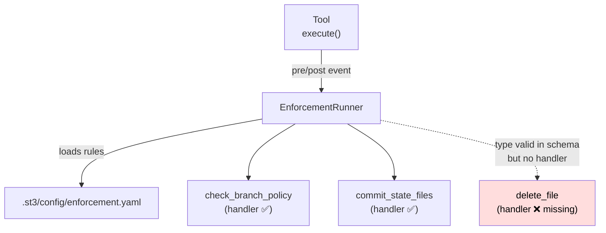
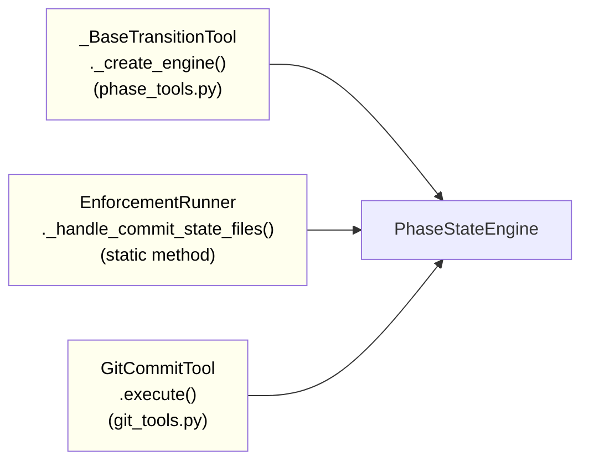

<!-- docs/mcp_server/architectural_diagrams/04_enforcement_layer.md -->
<!-- template=architecture version=8b924f78 created=2026-03-13T19:06Z updated=2026-03-13 -->
# Enforcement Layer

**Status:** DRAFT
**Version:** 1.0
**Last Updated:** 2026-03-13

---

## Purpose

Show the enforcement layer: how tool events trigger configured actions, which handlers are
registered, which are missing, and where `PhaseStateEngine` gets instantiated.

## Scope

**In Scope:** `EnforcementRunner`, `EnforcementRegistry`, `enforcement.yaml`, PSE instantiation
routes

**Out of Scope:** Phase contract checks (see 02), git operation detail

---

## 1. Enforcement Dispatch Flow

When a tool is called, `EnforcementRunner` checks `enforcement.yaml` for matching `event_source`
+ `timing` rules and dispatches to the registered handler. The diagram shows the three currently
configured rules and the missing `delete_file` handler.

The red `delete_file` node: the action type passes Pydantic validation in `EnforcementAction`
but has no registered handler in `_build_default_registry()`. Using it in `enforcement.yaml`
triggers a `ConfigError` at startup.

---

## 2. Currently Configured Rules

Three rules exist in `enforcement.yaml`. No `merge` event rule and no post-merge cleanup rule
are present.

| Rule | Event Source | Timing | Action |
|------|-------------|--------|--------|
| Branch base restriction | `create_branch` tool | pre | `check_branch_policy` |
| Persist state after phase transition | `transition_phase` tool | post | `commit_state_files` |
| Persist state after cycle transition | `transition_cycle` tool | post | `commit_state_files` |

---

## 3. PhaseStateEngine Instantiation Routes

`PhaseStateEngine` is constructed in three separate places with no composition root. Each
creates a new instance with its own `workspace_root` resolution.

Three instantiation routes mean three places to update if `PhaseStateEngine`'s constructor
signature changes. A composition root or factory would eliminate this duplication.

---

## Constraints & Decisions

| Decision | Rationale | Alternatives Rejected |
|----------|-----------|----------------------|
| YAML configuration for enforcement | Declarative; hot-reloadable without code changes | Hardcoded in Python (requires redeployment per rule change) |
| Registry validation at startup | Fail-fast on unknown action types; prevents silent runtime failures | Lazy validation per event (errors only surface during use) |

---

## Known Architectural Issues

| ID | Component | Issue | Severity |
|----|-----------|-------|----------|
| A-01 | `EnforcementRegistry` | `delete_file` action type has no handler → `ConfigError` at startup if used | High |
| RC-7 | PSE | Three instantiation routes, no composition root | Medium |
| Gap-6 | `enforcement.yaml` | No `event_source: merge` rule; no post-merge state cleanup | Medium |

---

## Related Documentation

- **[docs/mcp_server/architectural_diagrams/03_tool_layer.md][related-1]**
- **[docs/mcp_server/architectural_diagrams/05_config_layer.md][related-2]**
- **[docs/development/issue257/GAP_ANALYSE_ISSUE257.md][related-3]**

[related-1]: docs/mcp_server/architectural_diagrams/03_tool_layer.md
[related-2]: docs/mcp_server/architectural_diagrams/05_config_layer.md
[related-3]: docs/development/issue257/GAP_ANALYSE_ISSUE257.md

---

## Version History

| Version | Date | Author | Changes |
|---------|------|--------|---------|
| 1.0 | 2026-03-13 | Agent | Initial draft |
