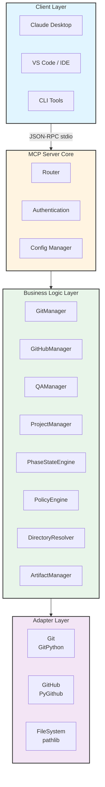
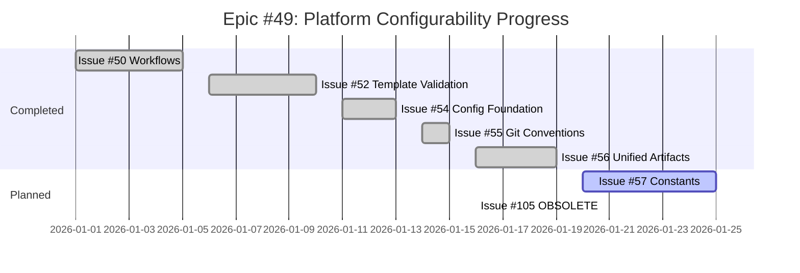

# ST3 Workflow MCP Server: Vision & Architecture Reference

**Document Type:** Vision & Architecture Reference  
**Status:** DEFINITIVE  
**Version:** 1.1  
**Created:** 2026-01-16  
**Last Updated:** 2026-01-19  
**Purpose:** Comprehensive reference for understanding MCP server vision, architecture, and roadmap  
**Audience:** New agents, developers, maintainers  
**Context:** Created during Issue #56 research to establish foundational understanding

---

## Executive Summary

### What is the ST3 Workflow MCP Server?

The **ST3 Workflow MCP Server** is an intelligent development orchestration platform that acts as an **AI-native development partner** for the SimpleTraderV3 project. It transforms software development from ad-hoc execution to a **structured, enforced, configuration-driven workflow**.

**In One Sentence:**  
*An MCP server that enforces architectural patterns, TDD principles, and quality standards through intelligent tooling and configuration-driven workflows, enabling AI agents to develop software with human-level discipline and consistency.*

### Why Does It Exist?

Traditional development workflows suffer from three fundamental problems:

1. **Knowledge Scatter**: Standards live in documentation but aren't enforced
2. **Manual Ceremony**: Developers repeat boilerplate and workflow steps manually
3. **Inconsistent Quality**: Quality depends on developer discipline, not system constraints

**The ST3 Workflow MCP Server solves these by:**
- **Encoding standards as enforced policies** (not just documentation)
- **Automating ceremony** (scaffolding, validation, transitions)
- **Making quality gates mandatory** (fail-fast on violations)

### Core Value Proposition

| Traditional Development | ST3 Workflow MCP Server |
|------------------------|-------------------------|
| Standards in docs (unenforced) | Standards as executable policies |
| Manual boilerplate | Template-driven scaffolding |
| Quality checks optional | Quality gates mandatory |
| Workflow guidance | Workflow enforcement |
| Static documentation | Dynamic context |
| Developer discipline | System constraints |

---

## The Problem We're Solving

### The Real Problem: Development at Scale

SimpleTraderV3 is a **plugin-driven, event-driven trading platform** with strict architectural principles:

1. **Plugin First**: All strategy logic is plugins
2. **Separation of Concerns**: Workers vs Platform vs Configuration
3. **Configuration-Driven**: Behavior controlled by YAML
4. **Contract-Driven**: Pydantic DTOs everywhere

**Challenge**: How do you maintain these principles when:
- Multiple developers work on the codebase
- AI agents generate code
- Requirements evolve over months/years
- Quality cannot be compromised (trading platform = money at risk)

### The MCP Server's Answer

**Transform implicit knowledge into executable constraints.**

Instead of:
> "Please follow TDD principles and write tests first"

We have:
> `git_add_or_commit(phase='red')` → **Blocks if non-test files are staged**

Instead of:
> "DTOs should be immutable Pydantic models"

We have:
> `scaffold_artifact(artifact_type='dto')` → **Generates validated, frozen BaseModel**

Instead of:
> "Check quality before merging"

We have:
> `transition_phase(to='integration')` → **Blocks if quality gates fail**

---

## Core Architectural Vision

### The Three-Layer Architecture



### Key Architectural Decisions

#### Decision 1: Python (Not TypeScript)

**Context**: MCP SDK supports both Python and TypeScript

**Decision**: 100% Python

**Rationale**:
- SimpleTraderV3 is 100% Python
- Direct import of `backend.*` validators
- Shared tooling (pytest, pylint, mypy)
- Shared configuration (pyproject.toml)
- Zero context switching
- Maximum code reuse

**Consequence**: Can directly use Pydantic models from backend in MCP tools

#### Decision 2: Configuration-Driven Everything

**Context**: Traditional MCP servers hardcode workflow logic

**Decision**: All behavior controlled by YAML configs

**Rationale**:
- Mirrors SimpleTraderV3's "Configuration-Driven" principle
- Workflows customizable without code changes
- Policies enforceable at config level
- Extensible without modifying Python code

**Consequence**: 7 YAML files control all server behavior

#### Decision 3: Strict Separation of Tooling vs Enforcement

**Context**: Quality gates and enforcement were tangled

**Decision**: Epic #76 provides tools, Epic #18 provides enforcement

**Rationale**:
- **Single Responsibility Principle** (SRP)
- Tools are generic executors (QAManager runs any gate)
- Enforcement decides when/where tools are required
- Decouples "what is possible" from "what is required"

**Consequence**: Clear boundaries, easier testing, simpler maintenance

---

## Domain Separation: The Three Realms

The MCP Server operates across three distinct domains with **fundamentally different enforcement models**:

### 1. Code Enforcement (Backend) - HARD CONSTRAINTS

**Purpose**: Ensure backend code follows architectural patterns

**Philosophy**: Code structure is **non-negotiable**, enforced at creation time

**Why Hard Enforcement?**
- **Code executes** → wrong structure = runtime errors
- **Dependencies matter** → import graph must be valid
- **Architectural contracts** → base classes must be implemented correctly
- **Type safety** → Pydantic validation, mypy checking
- **No flexibility** → DTOs are frozen, Workers implement IWorkerLifecycle

**Mechanisms**:
- `scaffold_artifact` generates compliant code from templates
- `validate_architecture` checks DTO/Worker structure
- Quality gates enforce style/typing
- PolicyEngine **BLOCKS** non-scaffolded creation in backend/

**Example Enforcement**:
```yaml
# policies.yaml
operations:
  create_file:
    blocked_patterns:
      - "backend/**"  # Must use scaffold_artifact
```

**Result**: Code that doesn't follow patterns **CANNOT BE CREATED**

### 2. Document Organization (Docs) - SOFT GUIDANCE

**Purpose**: Maintain consistent, navigable documentation

**Philosophy**: Documents follow **templates**, but content is **flexible and creative**

**Why Soft Guidance?**
- **Documents don't execute** → no runtime graph
- **No dependencies** → markdown is markdown
- **Human consumption** → flexibility in expression matters
- **Context-dependent** → different docs need different structures
- **Evolutionary** → docs evolve with understanding

**Mechanisms**:
- `scaffold_artifact` generates documents from templates (unified with code scaffolding)
- `validate_document_structure` checks sections/format (**warnings**, not errors)
- Template hierarchy (BASE → Architecture/Design/Reference)
- Status lifecycle (DRAFT → PRELIMINARY → APPROVED → DEFINITIVE)

**Example Organization**:
```
docs/
├── architecture/        # System design (numbered sections, Mermaid)
├── development/         # Pre-implementation design
├── reference/          # API docs, usage guides
├── implementation/     # Progress tracking (LIVING DOCUMENT)
└── mcp_server/         # MCP server docs (this file!)
```

**Result**: Docs that deviate from templates generate **WARNINGS**, not failures

### 3. Configuration Management (.st3/) - SCHEMA VALIDATION

**Purpose**: Centralize all workflow/policy configuration

**Philosophy**: Configuration is **code**, versioned and validated

**Why Schema Validation?**
- **Configs control behavior** → invalid config = broken server
- **Cross-references** → workflows.yaml references must exist
- **Type safety** → Pydantic models validate structure
- **Fail-fast** → startup errors, not runtime surprises

**Mechanisms**:
- 7 YAML files define all behavior
- Pydantic models validate at load time
- Cross-validation ensures consistency
- Singleton pattern for config access

**Configuration Files**:
```yaml
.st3/
├── workflows.yaml           # 6 workflows (feature, bug, hotfix, etc.)
├── workphases.yaml          # Phase/sub-phase definitions for commits
├── validation.yaml          # Template validation rules
├── artifacts.yaml           # Unified artifact registry (code + docs)
├── policies.yaml            # Operation policies (scaffold/create_file/commit)
├── project_structure.yaml   # 15 directory definitions
├── quality.yaml             # Quality gate definitions
├── git.yaml                 # Git conventions (branches, commits, TDD)
├── labels.yaml              # Label taxonomy + dynamic label patterns
├── issues.yaml              # Issue types, workflows, required label categories
├── scopes.yaml              # Valid scope values for scope:* labels
├── milestones.yaml          # Milestone whitelist (permissive when empty)
└── contributors.yaml        # Contributor/assignee whitelist (permissive when empty)
```

**Result**: Invalid configs **FAIL AT STARTUP**, zero runtime errors

**Note**: `artifacts.yaml` unifies code and document scaffolding (Issue #56 complete, January 2026)

#### Issue Configuration Files (added Issue #149)

These four files drive the `create_issue` tool's label assembly and validation:

| File | Purpose | Owner | Permissive when empty? |
|------|---------|-------|----------------------|
| `issues.yaml` | Maps `issue_type` → workflow + `type:*` label; defines required/optional label categories | Dev team | No — `issue_types` list must be non-empty |
| `scopes.yaml` | Lists valid values for `scope` parameter → assembled as `scope:{value}` label | Dev team | No — empty list rejects all scopes |
| `milestones.yaml` | Whitelist of known milestones for title-based lookup | Sync tooling | **Yes** — empty list skips milestone validation |
| `contributors.yaml` | Whitelist of valid assignee logins | Sync tooling | **Yes** — empty list skips assignee validation |

**`issues.yaml` structure:**
```yaml
version: "1.0"
issue_types:
  - name: feature           # Matches create_issue(issue_type="feature")
    workflow: feature        # Which workflow.yaml workflow to use
    label: "type:feature"   # type:* label applied automatically
required_label_categories: [type, priority, scope]
optional_label_inputs:
  is_epic:
    type: bool
    label: "type:epic"
    behavior: "Overrides type:* label from issue_type"
  parent_issue:
    type: int
    label_pattern: "parent:{value}"   # Dynamic label, created on-demand
```

**`scopes.yaml` structure:**
```yaml
version: "1.0"
scopes: [architecture, mcp-server, platform, tooling, workflow, documentation]
```

**`milestones.yaml` / `contributors.yaml` structure (permissive-when-empty):**
```yaml
version: "1.0"
milestones: []   # { number: int, title: str, state: "open"|"closed" }
# contributors: []   # { login: str, name: str (optional) }
# When list is empty, validation is skipped — tool accepts any value.
# Populate manually or via future sync tooling.
```

### The Critical Architectural Distinction

| Aspect | CODE (backend/) | DOCUMENTS (docs/) | CONFIG (.st3/) |
|--------|----------------|-------------------|----------------|
| **Enforcement** | HARD (blocks) | SOFT (warns) | SCHEMA (validates) |
| **Flexibility** | Low | High | Medium |
| **Validation** | AST, types, gates | Structure, format | Pydantic models |
| **Purpose** | Runtime artifacts | Human consumption | Behavior definition |
| **Dependencies** | Yes (imports) | No (standalone) | Yes (cross-refs) |
| **Error Impact** | Runtime crash | Hard to find | Server won't start |
| **Change Cost** | High (review, tests) | Low (edit, validate) | Medium (reload) |

---

## The Configuration Revolution (Epic #49)

### Vision: Transform Hardcoded Rules into Declarative YAML

**Progress**: 5/7 issues complete (71%)



### Completed Transformations ✅

#### Issue #50: Workflows

**Before** (Hardcoded):
```python
if workflow_type == "feature":
    return ["research", "planning", "design", "tdd", "integration", "documentation"]
```

**After** (Config):
```yaml
# workflows.yaml
workflows:
  feature:
    phases:
      - research
      - planning
      - design
      - tdd
      - integration
      - documentation
```

**Impact**: Add new workflow = edit YAML, zero code changes

#### Issue #52: Template Validation

**Before** (Hardcoded):
```python
RULES = {
    "BASE": {"required_sections": ["Purpose", "Scope"], "line_limit": 300}
}
```

**After** (Config + Template Metadata):
```yaml
# Template YAML frontmatter
{# TEMPLATE_METADATA
validates:
  strict:
    - rule: frontmatter_presence
    - rule: section_presence
#}
```

**Impact**: Validation rules in templates, no Python changes

#### Issue #54: Config Foundation

**Before** (Hardcoded):
```python
SCAFFOLDERS = {"dto": DTOScaffolder(), "worker": WorkerScaffolder()}
```

**After** (Config):
```yaml
# artifacts.yaml (unified registry)
artifact_types:
  - type: code
    type_id: dto
    name: "Data Transfer Object"
    template_path: "components/dto.py.jinja2"
    required_fields: [name, description]
```

**Impact**: Artifact registry unifies code and document scaffolding (Issue #56)

#### Issue #55: Git Conventions

**Before** (Hardcoded):
```python
VALID_BRANCHES = ["feature", "fix", "refactor"]
TDD_PHASES = ["red", "green", "refactor"]
```

**After** (Config):
```yaml
# git.yaml
branch_types: [feature, fix, refactor]
tdd_phases:
  red: test
  green: feat
  refactor: refactor
```

**Impact**: Git workflow customizable per project

#### Issue #56: Unified Artifacts ✅ COMPLETE

**Status**: Completed January 19, 2026

**Achievement**: Unified code and document scaffolding into single `artifacts.yaml` registry

**Before** (Scattered):
- `components.yaml` for code artifacts (dto, worker, adapter)
- Hardcoded `TEMPLATES` dict in DocManager
- Hardcoded `SCOPE_DIRS` dict in DocManager
- Separate tools: `scaffold_component`, `scaffold_design_doc`

**After** (Unified):
```yaml
# artifacts.yaml
artifact_types:
  # Code artifacts
  - type: code
    type_id: dto
    template_path: "components/dto.py.jinja2"
  
  # Document artifacts
  - type: document
    type_id: design
    template_path: "documents/design.md.jinja2"
    scope: development
```

**Tools Unified**:
- Single `scaffold_artifact` tool replaces both `scaffold_component` and `scaffold_design_doc`
- Unified template resolution logic
- Consistent validation across code and documents

**Impact**: 
- ✅ Zero hardcoded template metadata
- ✅ Single source of truth for all scaffolding
- ✅ Extensible without code changes
- ✅ Consistent mental model

### Planned Transformations ⏳

#### Issue #57: Constants

**Target**: Externalize 40+ magic numbers and regex patterns

**Status**: Next in queue

#### Issue #105: Dynamic Loading ❌ OBSOLETE

**Status**: Superseded by Issue #56 (January 2026)

**Original Target**: Load scaffolders dynamically from `components.yaml`

**Actual Solution**: Issue #56 unified code + document scaffolding into single `scaffold_artifact` tool with `artifacts.yaml` registry

**Reason for Obsolescence**: The unified artifacts approach eliminates the need for dynamic scaffolder loading by treating all artifacts (code and documents) uniformly through a single registry and tool

---

## Epic Roadmap & Critical Path

```mermaid
graph LR
    subgraph Epic49["Epic #49: Platform Configurability<br/>71% Complete"]
        I50[Issue #50<br/>Workflows<br/>✅]
        I52[Issue #52<br/>Validation<br/>✅]
        I54[Issue #54<br/>Foundation<br/>✅]
        I55[Issue #55<br/>Git<br/>✅]
        I56[Issue #56<br/>Artifacts<br/>✅]
        I57[Issue #57<br/>Constants<br/>⏳]
        I105[Issue #105<br/>OBSOLETE<br/>❌]
    end
    
    subgraph Epic18["Epic #18: TDD Enforcement<br/>30% Complete"]
        I42[Issue #42<br/>8-Phase Model<br/>🔴 BLOCKED]
        QGE[Quality Gates<br/>Enforcement<br/>🔴 BLOCKED]
    end
    
    subgraph Epic76["Epic #76: Quality Gates<br/>80% Complete"]
        QAM[QAManager<br/>✅]
        QY[quality.yaml<br/>✅]
        GC[Gate Catalog<br/>✅]
    end
    
    I50 --> I52
    I52 --> I54
    I54 --> I55
    I55 --> I56
    I56 --> I57
    I56 -.obsoletes.-> I105
    
    Epic76 -.blocks.-> I42
    I42 -.blocks.-> QGE
    
    classDef done fill:#c8e6c9,stroke:#4caf50,stroke-width:2px
    classDef active fill:#fff9c4,stroke:#fbc02d,stroke-width:2px
    classDef blocked fill:#ffcdd2,stroke:#f44336,stroke-width:2px
    classDef obsolete fill:#e0e0e0,stroke:#9e9e9e,stroke-width:2px,stroke-dasharray: 5 5
    
    class I50,I52,I54,I55,I56,QAM,QY,GC done
    class I57 active
    class I42,QGE blocked
    class I105 obsolete
```



### Blocker Chain

**Critical Path**:
1. Issue #42 (8-phase model) **BLOCKED** → contradicts TDD principles
2. Epic #18 enforcement **BLOCKED** → needs Issue #42 foundation
3. Quality Gate Enforcement **BLOCKED** → needs Epic #76 tools (80% complete)

**Issue #56 is COMPLETE** ✅

---

## Key Learnings from Completed Work

### Learning 1: Configuration-Driven Architecture Scales

**Evidence**:
- Issue #50: 6 workflows in 80 lines YAML
- Issue #55: 11 conventions in 60 lines YAML
- Issue #56: 15 artifact types in 120 lines YAML
- Config load time: 17.91ms (well under 100ms target)

**Implication**: Continue Epic #49

### Learning 2: Separation of Concerns is Non-Negotiable

**Context**: Epic #76 (Quality Gates) vs Epic #18 (Enforcement)

**Benefit**:
- Adding new gate: Edit quality.yaml (5 min)
- Adding gate requirement: Edit policy.yaml (5 min)
- No code changes, no circular dependencies

### Learning 3: Singleton Pattern for Configs is Essential

**Pattern**:
```python
class WorkflowConfig:
    _instance: ClassVar["WorkflowConfig | None"] = None
    
    @classmethod
    def load(cls) -> "WorkflowConfig":
        if cls._instance is None:
            cls._instance = cls._load_from_yaml()
        return cls._instance
```

**Benefits**: Single load, cross-validation, fail-fast, thread-safe

### Learning 4: Unified Registries Beat Specialized Systems

**Context**: Issue #56 unified code + document scaffolding

**Discovery**:
- Separate systems (`scaffold_component`, `scaffold_design_doc`) created mental overhead
- Unified `scaffold_artifact` tool simplified mental model
- Single `artifacts.yaml` registry easier to extend
- Consistent validation logic across artifact types

**Benefit**:
- Zero context switching between code and docs
- New artifact type: Add to artifacts.yaml, zero code changes
- Testing simplified (one scaffolding path)

**Implication**: Seek unification opportunities in future work

### Learning 5: MCP SDK Limitations Exist

**Discovery**: Claude Desktop caches MCP tool schemas
- Changed git.yaml → server reloaded correctly
- Claude Desktop showed old schema
- **Required VS Code restart**

**Limitation**: MCP protocol doesn't have "schema changed" notification

**Implication**: Config changes require client restart

---

## Design Patterns

### 1. Singleton Config Pattern

**Usage**: All config classes

**Structure**:
```python
class GitConfig:
    _instance: ClassVar["GitConfig | None"] = None
    
    @classmethod
    def load(cls) -> "GitConfig":
        if cls._instance is None:
            cls._instance = cls._load_from_yaml()
        return cls._instance
```

### 2. Manager Pattern

**Responsibility**: Business logic, orchestration, validation

**Key Principle**: Managers orchestrate, adapters execute

### 3. Adapter Pattern

**Responsibility**: External system integration, no business logic

**Key Principle**: Adapters are thin wrappers, no decisions

### 4. PolicyEngine Pattern

**Responsibility**: Config-driven policy evaluation

**Key Principle**: Policies are data, engine is logic

### 5. Unified Registry Pattern

**Usage**: artifacts.yaml (Issue #56)

**Principle**: Single source of truth for all related entities

**Structure**:
```yaml
# artifacts.yaml
artifact_types:
  - type: code|document
    type_id: unique_identifier
    template_path: path/to/template.jinja2
    # ... metadata
```

**Benefits**:
- Zero hardcoded metadata
- Consistent lookup mechanism
- Easy extensibility
- Simplified mental model

---

## Current Architecture Status (January 2026)

### What's Complete ✅

**Configuration System**:
- 7 YAML config files operational
- Pydantic validation for all configs
- Singleton pattern for config access
- Cross-validation between configs
- Fail-fast startup validation

**Scaffolding System**:
- Unified `scaffold_artifact` tool
- Single `artifacts.yaml` registry
- 15 artifact types (code + documents)
- Template-based generation
- Validation integration

**Quality System**:
- QAManager operational
- quality.yaml gate definitions
- 8 quality gates implemented
- Integration with validation system

**Git Workflow**:
- TDD phase enforcement (red/green/refactor)
- Branch naming conventions
- Commit message format enforcement
- Phase transition validation

### What's Next ⏳

**Issue #57: Constants**:
- Externalize magic numbers
- Create constants.yaml
- Update code to load from config
- Timeline: Q1 2026

**Epic #18: TDD Enforcement**:
- Resolve Issue #42 blocker
- Implement phase-based enforcement
- Quality gate requirements
- Timeline: Q2 2026

---

## Conclusion

The ST3 Workflow MCP Server is transforming software development by:

1. **Encoding standards as executable constraints**
2. **Automating ceremony through intelligent tooling**
3. **Separating concerns across three domains** (Code/Documents/Config)
4. **Using configuration to drive behavior** (Epic #49 at 71%)
5. **Enforcing quality where it matters** (Code hard, Docs soft)
6. **Unifying scattered systems** (artifacts.yaml, Issue #56 complete)

**Recent Achievement**: Issue #56 completed January 19, 2026 - unified code and document scaffolding into single `artifacts.yaml` registry with `scaffold_artifact` tool, eliminating all hardcoded template metadata.

---

**Document Status**: DEFINITIVE  
**Version**: 1.1  
**Last Updated**: 2026-01-19  
**Maintenance**: Update when major architectural decisions are made  
**Next Review**: 2026-02-16 (monthly)
