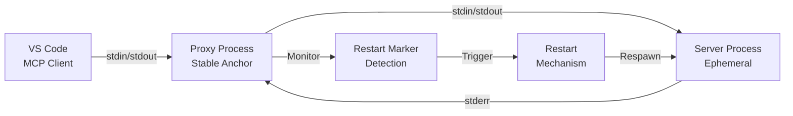
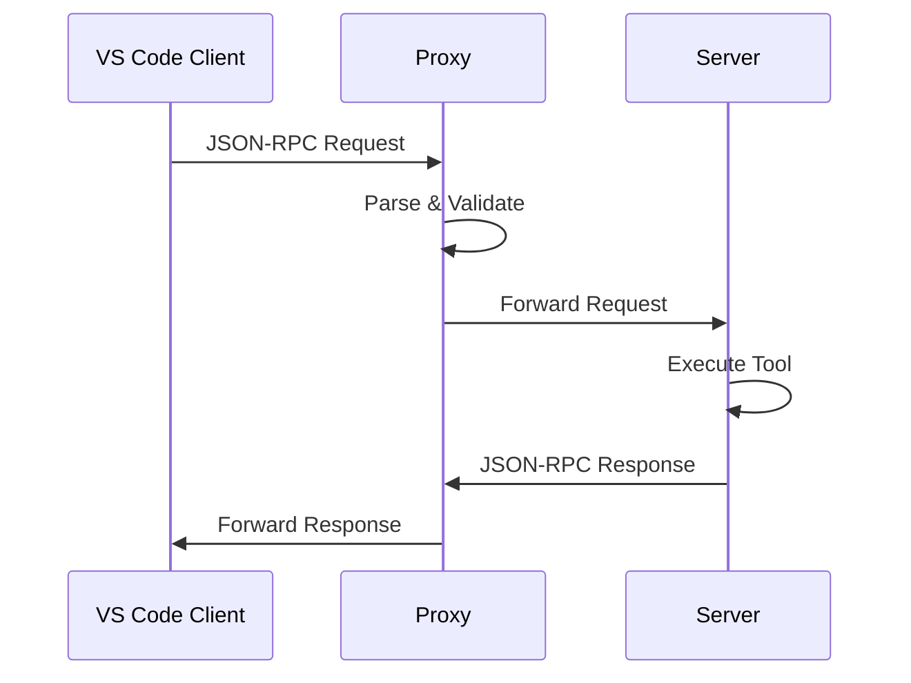
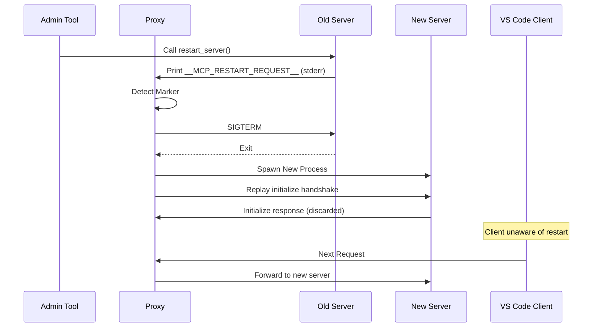
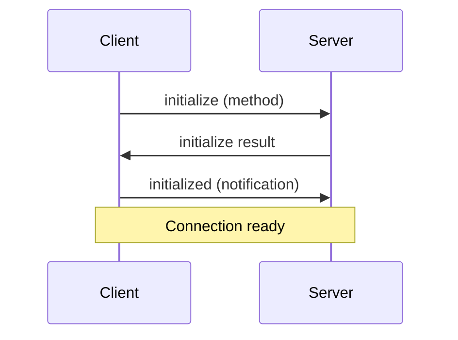
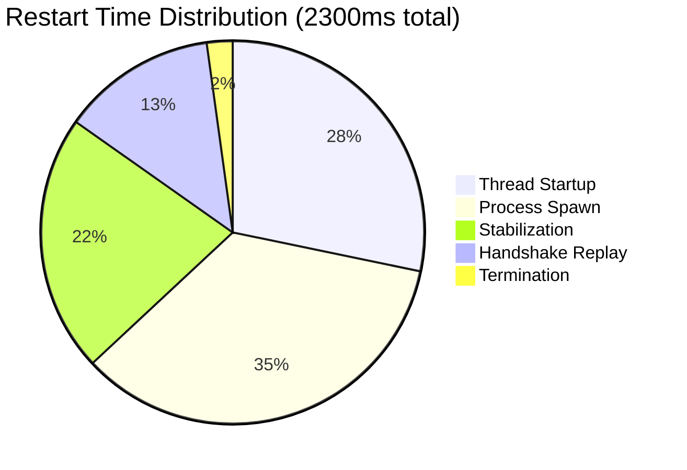

# MCP Transparent Restart Proxy

**Component**: `mcp_server.core.proxy`  
**Type**: Infrastructure  
**Status**: Production  
**Python**: 3.10+

## Overview

The MCP Transparent Restart Proxy is an infrastructure component that enables hot-reloading of the MCP server process without requiring client reconnection. It acts as a stable stdio anchor between the MCP client (VS Code) and the ephemeral server process.

### Key Capabilities

- **Zero-Downtime Restarts**: Server process restarts without client disconnection
- **Protocol Compliance**: Maintains MCP handshake integrity across restarts
- **UTF-8 Safety**: Full Unicode support on Windows (emoji, CJK characters)
- **Generic Validation**: Prevents encoding-related crashes
- **Structured Logging**: Comprehensive audit trail for debugging

### Performance

| Metric | Value |
|--------|-------|
| Restart latency | ~2.3s |
| Tool response overhead | +0.6ms (14%) |
| Memory footprint | ~5MB |

---

## Architecture

### Component Model



**Process Lifecycle**:
- **Proxy**: Lives for entire VS Code session (stable)
- **Server**: Ephemeral, terminated and respawned on restart

### Request Flow



### Restart Flow



---

## Configuration

### VS Code MCP Settings

**File**: `.vscode/mcp.json`

```json
{
  "mcpServers": {
    "st3-workflow": {
      "command": "D:\\dev\\SimpleTraderV3\\.venv\\Scripts\\python.exe",
      "args": ["-m", "mcp_server.core.proxy"],
      "env": {}
    }
  }
}
```

**Critical**: The client must launch the **proxy**, not the server directly.

### Environment Variables

| Variable | Value | Purpose |
|----------|-------|---------|
| `PYTHONUTF8` | `1` | Force UTF-8 mode in server subprocess (Windows) |

Set automatically by the proxy when spawning the server.

---

## API Reference

### Proxy Class

```python
class MCPProxy:
    """Transparent MCP server restart proxy."""
    
    def __init__(self):
        """Initialize proxy state and UTF-8 encoding."""
        
    def run(self):
        """Main proxy loop - read from stdin, forward to server."""
        
    def start_server(self, is_restart: bool = False):
        """Spawn server subprocess and optionally replay handshake."""
        
    def trigger_restart(self):
        """Execute transparent server restart."""
```

### Restart Marker

**Constant**: `RESTART_MARKER = "__MCP_RESTART_REQUEST__"`

**Detection**: The proxy monitors server stderr for this magic string. When detected, a transparent restart is triggered.

**Usage** (from server code):

```python
def restart_server() -> dict[str, str]:
    """Trigger transparent proxy restart."""
    print("__MCP_RESTART_REQUEST__", file=sys.stderr, flush=True)
    return {"status": "restart_initiated"}
```

### Entry Point

```bash
# Launch proxy (VS Code does this via mcp.json)
python -m mcp_server.core.proxy
```

---

## Protocol Handling

### MCP Handshake

The Model Context Protocol requires a strict initialization sequence:



### Handshake Replay Strategy

**Problem**: After restart, the new server expects a full handshake, but the client believes it's already initialized.

**Solution**: The proxy captures the initial `initialize` request and replays it to each new server instance:

```python
# On initial connection
if message.get("method") == "initialize":
    self.init_request = message  # Capture

# On restart
if is_restart and self.init_request:
    self.server_process.stdin.write(
        json.dumps(self.init_request) + "\n"
    )
    response = self.server_process.stdout.readline()
    # Discard response (client already has it)
```

**Critical Timing**: A 300ms sleep allows the new server to initialize before receiving the handshake.

---

## UTF-8 Encoding

### Multi-Layer Strategy

The proxy implements three layers of UTF-8 enforcement to ensure correct handling of emoji and CJK characters on Windows:

#### Layer 1: Stream Reconfiguration

```python
def _setup_utf8_encoding():
    """Force UTF-8 encoding on Windows stdin/stdout/stderr."""
    if sys.platform == 'win32':
        import io
        sys.stdin = io.TextIOWrapper(
            sys.stdin.buffer, encoding='utf-8', errors='replace'
        )
        sys.stdout = io.TextIOWrapper(
            sys.stdout.buffer, encoding='utf-8', 
            errors='replace', line_buffering=True
        )
        sys.stderr = io.TextIOWrapper(
            sys.stderr.buffer, encoding='utf-8', 
            errors='replace', line_buffering=True
        )
```

**Effect**: Proxy reads stdin as UTF-8, preventing mojibake.

#### Layer 2: Server Environment

```python
env = os.environ.copy()
env["PYTHONUTF8"] = "1"

self.server_process = subprocess.Popen(
    [...],
    env=env,
    encoding="utf-8",
    errors="replace"
)
```

**Effect**: Server subprocess inherits UTF-8 mode.

#### Layer 3: Generic Validation

```python
message = json.loads(line)

# Validate strict UTF-8 encoding
try:
    json.dumps(message, ensure_ascii=False).encode('utf-8')
except (UnicodeError, ValueError) as e:
    # Block invalid message, send error response
    ...
```

**Effect**: Prevents server crashes from malformed Unicode (e.g., lone surrogates).

### Character Support

| Type | Example | Support |
|------|---------|---------|
| Emoji | 🚀 ✅ 🔥 | ✅ Full |
| CJK | 管道 漢字 | ✅ Full |
| Lone Surrogates | `\uD83D` | ❌ Blocked + Error |

---

## Error Handling

### Validation Levels

```mermaid
graph TD
    A[Message Received] --> B{Stream Decode}
    B -->|Error| C[Replace with �]
    B -->|Success| D{JSON Parse}
    D -->|Error| E[Log & Drop]
    D -->|Success| F{UTF-8 Validate}
    F -->|Error| G[Block + Error Response]
    F -->|Success| H[Forward to Server]
```



### Error Response Format

When validation fails, the proxy sends a JSON-RPC error:

```json
{
  "jsonrpc": "2.0",
  "id": 123,
  "error": {
    "code": -32602,
    "message": "Validation failed: surrogates not allowed"
  }
}
```

### Error Categories

| Error Type | Handling | User Impact |
|------------|----------|-------------|
| **Stream Decode Error** | Replace with `�` | Degraded, not blocked |
| **JSON Parse Error** | Log + drop | Silent failure |
| **UTF-8 Validation** | Block + error response | Request rejected |
| **Server Crash** | Auto-restart | ~2.3s downtime |

---

## Logging & Observability

### Audit Log

**Location**: `mcp_server/logs/mcp_audit.log`  
**Format**: Structured JSON (one event per line)

**Example Entry**:

```json
{
  "timestamp": "2026-01-15T14:23:45.123Z",
  "level": "INFO",
  "logger": "mcp_proxy",
  "message": "Server ready (startup: 850ms)",
  "event_type": "server_ready",
  "proxy_pid": 12345,
  "server_pid": 67890,
  "restart_count": 0,
  "startup_time_ms": 850
}
```

### Event Types

| Event | Description |
|-------|-------------|
| `proxy_started` | Proxy initialization |
| `server_spawned` | Server subprocess created |
| `initialize_captured` | MCP handshake captured |
| `initialize_replayed` | Handshake replayed after restart |
| `server_ready` | Server ready for requests |
| `restart_marker_detected` | Restart marker found on stderr |
| `restart_initiated` | Restart process started |
| `restart_completed` | Restart finished |
| `validation_blocked` | Message blocked by validation |
| `proxy_stopped` | Proxy shutdown |

### Querying Logs

**Find restart events**:
```bash
jq 'select(.event_type == "restart_completed")' mcp_audit.log
```

**Calculate average restart time**:
```bash
jq -s 'map(select(.event_type == "restart_completed").restart_duration_ms) | add / length' mcp_audit.log
```

**Find validation errors**:
```bash
jq 'select(.event_type == "validation_blocked")' mcp_audit.log
```

---

## Performance Characteristics

### Restart Latency Breakdown



### Tool Response Overhead

| Scenario | Latency | Overhead |
|----------|---------|----------|
| Direct server | 4.2ms | - |
| Via proxy | 4.8ms | +0.6ms (14%) |

**Breakdown**:
- JSON parsing: 0.2ms
- Validation: 0.3ms
- Pipe forwarding: 0.1ms

---

## Troubleshooting

### Proxy Won't Start

**Symptom**: VS Code shows "MCP Server disconnected"

**Diagnosis**:
```bash
# Test proxy manually
python -m mcp_server.core.proxy
# Should print: [PROXY] MCP Proxy starting (PID=...)
```

**Common Causes**:
- Python not in PATH
- `mcp_server` package not installed
- Incorrect working directory

### Restart Not Triggering

**Symptom**: Calling `restart_server()` tool has no effect

**Diagnosis**:
```bash
# Check audit log for marker detection
jq 'select(.event_type == "restart_marker_detected")' mcp_audit.log
```

**Common Causes**:
- Marker not printed to stderr (check stdout vs stderr)
- Stderr buffering (ensure `flush=True`)
- Proxy stderr reader thread crashed

### Emoji Showing as Mojibake

**Symptom**: 🚀 displays as `🚀`

**Diagnosis**:
```python
import sys
print(f"stdin: {sys.stdin.encoding}")
# Should print: stdin: utf-8
```

**Common Causes**:
- `_setup_utf8_encoding()` not called
- Windows system encoding overriding
- Missing `PYTHONUTF8=1` in server subprocess

### High Restart Latency

**Symptom**: Restarts take >5 seconds

**Diagnosis**:
```bash
# Check recent restart times
jq 'select(.event_type == "restart_completed") | .restart_duration_ms' mcp_audit.log | tail -5
```

**Common Causes**:
- Server process not terminating gracefully (check for hanging threads)
- Heavy disk I/O during spawn (antivirus scanning)
- Slow import times (optimize server startup)

### Validation Errors

**Symptom**: Messages blocked with "surrogates not allowed"

**Diagnosis**:
```bash
# Find blocked messages
jq 'select(.event_type == "validation_blocked") | .raw_line' mcp_audit.log
```

**Resolution**:
- Client sending malformed Unicode
- Check client encoding configuration
- Validate input at source

---

## Best Practices

### Development

1. **Always use the proxy in development**  
   Configure `mcp.json` to launch the proxy, not the server directly.

2. **Monitor audit logs during development**  
   ```bash
   tail -f mcp_server/logs/mcp_audit.log | jq
   ```

3. **Test restart behavior**  
   ```python
   # In MCP tool
   restart_server()
   # Verify no client disconnection
   ```

### Production

1. **Set up log rotation**  
   The audit log grows unbounded. Implement rotation:
   ```bash
   # Rotate if >10MB
   if [ $(stat -f%z mcp_audit.log) -gt 10485760 ]; then
       mv mcp_audit.log mcp_audit.log.1
   fi
   ```

2. **Monitor restart frequency**  
   High restart counts indicate instability:
   ```bash
   jq -s 'map(select(.event_type == "restart_completed")) | length' mcp_audit.log
   ```

3. **Alert on validation errors**  
   Validation errors indicate client issues:
   ```bash
   # Alert if >10 validation errors in last hour
   jq 'select(.event_type == "validation_blocked")' mcp_audit.log | tail -100
   ```

---

## Limitations

1. **Message Dropping During Restart**  
   Messages sent during the restart window (~2.3s) are dropped. Clients should implement retry logic for critical operations.

2. **No Message Queueing**  
   The proxy does not buffer messages during restart. This is intentional to avoid state synchronization issues.

3. **Single Server Instance**  
   One proxy manages one server. No load balancing or parallel execution.

4. **No Automatic Health Checks**  
   The proxy does not ping the server. Silent hangs are not detected automatically.

5. **Windows-Only UTF-8 Fixes**  
   The UTF-8 reconfiguration is Windows-specific. Other platforms may have different encoding issues.

---

## Future Enhancements

### Connection Pooling
Maintain a warm standby process to reduce restart latency from ~2.3s to <500ms.

### Message Queueing
Buffer messages during restart and replay after completion. Requires deduplication logic.

### Health Monitoring
Periodic ping/pong checks with auto-restart on timeout.

### Incremental Reload
Hot-reload individual modules using `importlib.reload()` for sub-second update times.

### Multi-Server Support
Load balancing across multiple server instances for parallel tool execution.

---

## References

### Related Documentation
- [MCP Protocol Specification](https://modelcontextprotocol.io/specification)
- [Python subprocess Module](https://docs.python.org/3/library/subprocess.html)
- [UTF-8 Everywhere Manifesto](http://utf8everywhere.org/)

### Source Files
- `mcp_server/core/proxy.py` - Main implementation (467 lines)
- `mcp_server/tools/admin_tools.py` - Restart trigger (~30 lines)
- `.vscode/mcp.json` - Client configuration

### Related Issues
- Issue #113: Initial implementation
- Issue #55: Original concept discussion