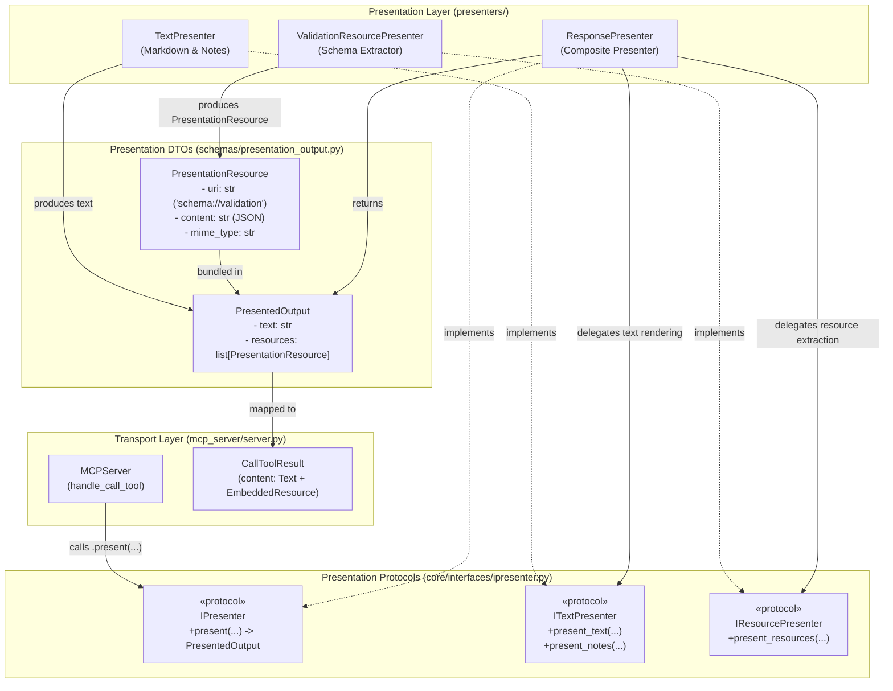
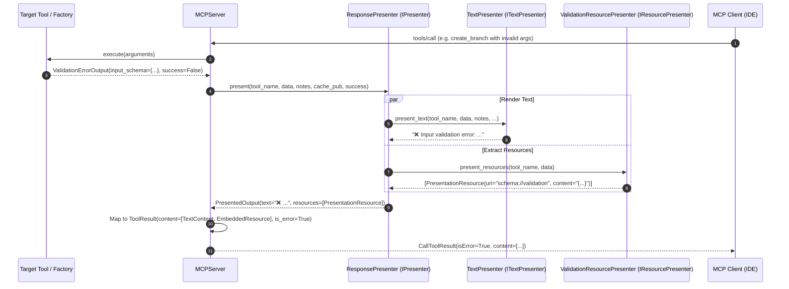

<!-- docs\reference\presentation_architecture.md -->
<!-- template=reference version=064954ea created=2026-08-19T19:43Z updated=2026-08-19T19:48Z -->
# Presentation Architecture & Resource Delegation Reference

**Status:** DEFINITIVE  
**Version:** 1.1.0  
**Last Updated:** 2026-08-19  

**Source:** [mcp_server/presenters/](file:///c:/temp/pgmcp/mcp_server/presenters/)  
**Tests:** [tests/mcp_server/unit/test_presenter.py](file:///c:/temp/pgmcp/tests/mcp_server/unit/test_presenter.py) (26 tests)  

---

## 1. Architectural Purpose & Overview

This document specifies the Presentation Layer Architecture in `phase-gate-mcp`. The layer segregates text rendering, error formatting, operation notes aggregation, and embedded resource packaging from the core MCP transport layer (`MCPServer`).

### Key Architecture Principles
- **Single Responsibility Principle (SRP)**: `MCPServer` coordinates tool execution without touching schema payloads or markdown templating.
- **Interface Segregation Principle (ISP)**: Consumers depend on focused protocols (`ITextPresenter`, `IResourcePresenter`) rather than monolithic presenter classes.
- **Dependency Inversion Principle (DIP)**: Core and transport components depend upon abstract `IPresenter` protocols.
- **Composition over Inheritance**: `ResponsePresenter` combines delegate presenters through constructor injection.

### Architecture Diagram



---

## 2. Sequence & Execution Flow



---

## 3. Protocol & DTO Reference

### 3.1 DTO Models (`mcp_server/schemas/presentation_output.py`)

#### `PresentationResource`
Immutable DTO representing an embedded presentation resource.
```python
class PresentationResource(BaseModel):
    model_config = ConfigDict(frozen=True, extra="forbid")

    uri: str
    content: str
    mime_type: str = "application/json"
```

#### `PresentedOutput`
Immutable DTO combining rendered markdown text and associated resources.
```python
class PresentedOutput(BaseModel):
    model_config = ConfigDict(frozen=True, extra="forbid")

    text: str
    resources: list[PresentationResource] = Field(default_factory=list)
```

---

### 3.2 Protocols (`mcp_server/core/interfaces/ipresenter.py`)

#### `ITextPresenter`
Renders markdown text for tools, execution errors, cache fallbacks, and operation notes.
```python
@runtime_checkable
class ITextPresenter(Protocol):
    def present_text(
        self,
        tool_name: str,
        data: BaseModel | dict[str, Any],
        notes: list[NoteEntry] | None = None,
        cache_pub: CachePublication | None = None,
        success: bool | None = None,
    ) -> str: ...

    def present_notes(self, tool_name: str, notes: list[NoteEntry]) -> str | None: ...
```

#### `IResourcePresenter`
Extracts and packages embedded presentation resources.
```python
@runtime_checkable
class IResourcePresenter(Protocol):
    def present_resources(
        self,
        tool_name: str,
        data: BaseModel | dict[str, Any],
    ) -> list[PresentationResource]: ...
```

#### `IPresenter`
Unified presenter coordinating text and resource delegates.
```python
@runtime_checkable
class IPresenter(Protocol):
    def present(
        self,
        tool_name: str,
        data: BaseModel | dict[str, Any],
        notes: list[NoteEntry] | None = None,
        cache_pub: CachePublication | None = None,
        success: bool | None = None,
    ) -> PresentedOutput: ...
```

---

## 4. Implementations (`mcp_server/presenters/`)

### 4.1 `ResponsePresenter`
Composite presenter that implements `IPresenter` by delegating to `ITextPresenter` and `IResourcePresenter`.

```python
class ResponsePresenter(IPresenter):
    def __init__(
        self,
        text_presenter: ITextPresenter,
        resource_presenter: IResourcePresenter,
    ) -> None:
        self._text_presenter = text_presenter
        self._resource_presenter = resource_presenter

    def present(
        self,
        tool_name: str,
        data: BaseModel | dict[str, Any],
        notes: list[NoteEntry] | None = None,
        cache_pub: CachePublication | None = None,
        success: bool | None = None,
    ) -> PresentedOutput:
        text = self._text_presenter.present_text(
            tool_name=tool_name,
            data=data,
            notes=notes,
            cache_pub=cache_pub,
            success=success,
        )
        resources = self._resource_presenter.present_resources(
            tool_name=tool_name,
            data=data,
        )
        return PresentedOutput(text=text, resources=resources)
```

### 4.2 `ValidationResourcePresenter`
Extracts `input_schema` from `ValidationErrorOutput` and packages it into `schema://validation` embedded JSON resources.

```python
class ValidationResourcePresenter(IResourcePresenter):
    def present_resources(
        self,
        tool_name: str,
        data: BaseModel | dict[str, Any],
    ) -> list[PresentationResource]:
        schema_dict: dict[str, Any] | None = None

        if isinstance(data, ValidationErrorOutput) and data.input_schema is not None:
            schema_dict = data.input_schema
        elif isinstance(data, dict) and data.get("error_type") == "ValidationError":
            schema_dict = data.get("input_schema")

        if schema_dict is not None:
            return [
                PresentationResource(
                    uri="schema://validation",
                    mime_type="application/json",
                    content=json.dumps(schema_dict, indent=2),
                )
            ]
        return []
```

---

## 5. Bootstrap Wiring & Composition Root

In `mcp_server/bootstrap.py`:
```python
text_presenter = TextPresenter(config=configs.presentation_config)
validate_presentation_alignment(text_presenter, core_tools)
resource_presenter = ValidationResourcePresenter()

presenter = ResponsePresenter(
    text_presenter=text_presenter,
    resource_presenter=resource_presenter,
)

server = MCPServer(
    settings=settings,
    tools=tools,
    resources=resources,
    presenter=presenter,
    publisher=managers.response_cache,
)
```

---

## 6. Related Documentation

- Research: [`docs/development/issue414/research.md`](file:///c:/temp/pgmcp/docs/development/issue414/research.md)
- Design: [`docs/development/issue414/design.md`](file:///c:/temp/pgmcp/docs/development/issue414/design.md)
- Planning: [`docs/development/issue414/planning.md`](file:///c:/temp/pgmcp/docs/development/issue414/planning.md)
- Validation: [`docs/development/issue414/validation.md`](file:///c:/temp/pgmcp/docs/development/issue414/validation.md)
- Architecture Principles: [`docs/coding_standards/ARCHITECTURE_PRINCIPLES.md`](file:///c:/temp/pgmcp/docs/coding_standards/ARCHITECTURE_PRINCIPLES.md)
