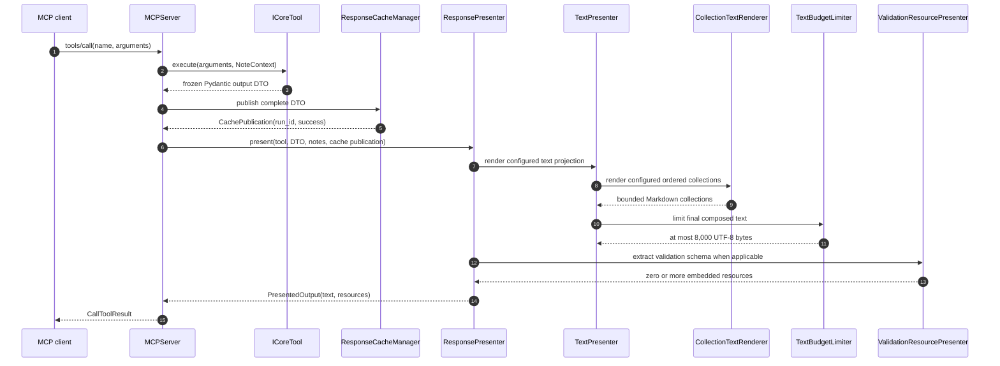

<!-- docs/reference/presentation_architecture.md -->
<!-- template=reference version=064954ea created=2026-08-19T19:43Z updated=2026-08-22 -->
# Presentation Architecture and Resource Delegation

**Status:** DEFINITIVE  
**Version:** 2.0.0  
**Last Updated:** 2026-08-22

**Configuration:** [presentation.yaml](../../.pgmcp/config/presentation.yaml)  
**Composition root:** [bootstrap.py](../../mcp_server/bootstrap.py)  
**Presenter implementation:** [mcp_server/presenters](../../mcp_server/presenters)

---

## Purpose

The presentation layer turns a complete structured tool-output DTO into a bounded,
actionable Markdown projection for the chat while keeping the complete DTO authoritative
in the MCP Resource cache. Presentation configuration owns wording, field selection,
ordering, and per-tool item limits. Generic Python components own rendering mechanics,
startup validation, and the final byte ceiling.

This boundary has two complementary outputs:

1. a compact text response for routine decisions;
2. a complete resource at `pgmcp://cache/runs/{run_id}` for exhaustive structured data
   and verbose diagnostics.

Validation-input errors may additionally carry an embedded `schema://validation`
resource. That resource is separate from the cached tool-output DTO.

## End-to-End Flow



The DTO is published before presentation. Collection limits and text truncation therefore
never remove fields or items from the cached representation.

## Ownership Boundaries

| Concern | Authoritative owner |
|---|---|
| Tool result semantics and complete data | Frozen tool-output DTO |
| Complete run payload | MCP Resource cache |
| Per-tool wording, scalar selection, collection declarations, headings, order, and item limits | `presentation.yaml` |
| Configuration shape | `PresentationConfig` and its nested frozen schemas |
| Supported tool identity and output model | Runtime-derived `SupportedToolContract` catalog |
| Settings-dependent exposed tools | `ToolAssembly.active_tools` |
| Scalar/list/tuple formatting | `SafeNoneFormatter` |
| Ordered collection rendering | `CollectionTextRenderer` |
| Final text ceiling | `TextBudgetLimiter` |
| Composition of text and embedded validation resources | `ResponsePresenter` |

Business logic, managers, adapters, and domain validation services do not construct
user-facing presentation strings.

## Runtime Tool Catalog

`ServerBootstrapper` constructs one `ToolAssembly` containing:

- `supported_tools`: all 50 tool implementations supported by this server build;
- `supported_contracts`: the minimal derived pair of tool name and concrete Pydantic
  output model for each supported tool;
- `active_tools`: the settings-dependent subset exposed to the MCP client.

With a GitHub token, all 50 tools are active. Without a token, 38 tools remain active;
the twelve PR, label, and milestone tools are inactive. The supported catalog remains
complete in both modes so configuration drift is detected independently of credentials.

The catalog is derived from the constructed tools at runtime. It is not maintained as a
second static tool metadata file.

## Declarative Presentation Configuration

`presentation.yaml` contains one entry for every supported tool and global formatting
policy. A tool entry can use:

| Field | Purpose |
|---|---|
| `template_success` / `template_failure` | Scalar Markdown projection for the normal result envelope |
| `max_items` | Shared bound for inline scalar sequences and every configured collection depth |
| `collections` | Ordered `list[T]` or variadic `tuple[T, ...]` projection declarations |
| `collections[].children` | Recursive projection of direct ordered-sequence fields on model items |
| `enum_cases` | Additional configured text selected by a serialized enum value |
| `next_instructions` | Configured follow-up text, such as context reload reminders |
| note groups | Configured exclusion, suggestion, recovery, and information messages |

Global formatting defines the None placeholder, sequence separator, item-omission text,
collection-omission text, truncation notices, and the byte ceiling.

### Ordered Sequences

Only exact `list[T]` and variadic `tuple[T, ...]` annotations are supported. `T` must be a
scalar (`str`, `int`, `float`, `bool`, or enum) or a Pydantic model. Arbitrary iterables,
mappings, sets, sorting, filtering, and tool-specific renderer branches are deliberately
unsupported.

Flat scalar sequences may appear directly in an ordinary template, for example issue
labels. Structured sequences use a collection declaration with an optional heading and
an item template. Child collections are evaluated depth-first. Every level preserves DTO
order and applies the tool's `max_items` independently.

Example:

```yaml
list_issues:
  category: query
  max_items: 10
  template_success: "Found {issues_count} issues matching criteria."
  collections:
    - field: issues
      heading: "Issues:"
      item_template: >-
        - #{number} [{state}] {title} — {html_url} |
        labels: {labels} | assignees: {assignees_summary} | created: {created_at}
```

When more than ten issues exist, the text adds an omission line. All issues remain in the
cached `ListIssuesOutput` DTO.

### Runtime Shape Rules

On a successful output, a configured collection must exist and must have the configured
list/tuple and item shape. Missing fields, wrong container types, wrong item types, or
missing item placeholders raise `ConfigError` with field/path context. Generic failure
envelopes may omit success-only collections; the presenter does not fabricate them.

## Startup Validation

`validate_presentation_alignment` runs during server bootstrap against the complete
supported catalog. Startup fails fast when:

- a supported tool lacks a presentation entry or configuration names an unknown tool;
- a tool name is duplicated or its concrete output model cannot be resolved;
- a template placeholder is absent from the tool's DTO or uses a forbidden generic
  presentation field;
- a configured collection is not a supported ordered-sequence field, has invalid item
  placeholders, or declares an invalid child;
- an enum case targets a non-enum field or unknown value;
- a bounded sequence has no `max_items`, or `max_items` exists without a bounded sequence;
- global formatting cannot preserve the mandatory truncation notice and fixed-shape
  cache reference within the configured budget.

This validation uses the same runtime-derived contracts that drive tool activation. It
therefore avoids a second catalog source of truth while validating inactive supported
tools as well as active ones.

## Final UTF-8 Byte Ceiling

The global `max_text_response_bytes` value is `8000`. `TextBudgetLimiter` is the final
step after scalar templates, enum blocks, collections, instructions, notes, cache-failure
fallbacks, and the cache reference have been composed.

- Under-budget text is returned byte-for-byte unchanged.
- Over-budget text is truncated on a UTF-8-safe boundary, preferring complete Markdown
  blocks or lines.
- If truncation intersects a fenced code block, the limiter closes the fence when the
  budget permits.
- A truthful truncation notice and one complete cache reference are reserved when cache
  publication succeeded.
- If cache publication failed, the notice explicitly says complete details are
  unavailable; it does not claim that a resource exists.

The byte ceiling is universal. Individual tools configure item limits, not their own
text budgets.

## Cache and Client Guidance

The inline projection is sufficient when it contains the information needed for the
current action. Read the cached resource when completeness, fields intentionally omitted
from the projection, or verbose diagnostics are required. Examples include complete Git
output, diffs, test tracebacks, quality-gate process details, and complete validation
schemas.

Do not parse the presented Markdown to reconstruct DTO data. The resource is the
structured contract.

`scaffold_schema` is a deliberate resource-oriented exception: the text identifies the
artifact type, while the nested JSON Schema remains in the cached DTO.

## Quality-Gate Limitation

`run_quality_gates` presents bounded gate status records, but each gate's `details` field
is still an opaque string and remains cache-only. A generic structured finding DTO and an
inline finding limit are deferred work; the presenter does not parse gate-specific text.

## Primary Implementation and Evidence

- [Presentation configuration schema](../../mcp_server/config/schemas/presentation_config.py)
- [Text presenter and startup alignment](../../mcp_server/presenters/text_presenter.py)
- [Collection renderer](../../mcp_server/presenters/collection_text_renderer.py)
- [Text budget limiter](../../mcp_server/presenters/text_budget_limiter.py)
- [Response presenter](../../mcp_server/presenters/response_presenter.py)
- [Validation resource presenter](../../mcp_server/presenters/validation_resource_presenter.py)
- [Presentation composition tests](../../tests/mcp_server/unit/presenters/test_text_presenter_composition.py)
- [Presentation rollout tests](../../tests/mcp_server/unit/config/test_tool_presentation_rollout.py)

## Related Documentation

- [MCP tools navigation](tools/README.md)
- [Quality and validation tools](tools/quality.md)
- [Discovery and admin tools](tools/discovery.md)
- [Architecture principles](../coding_standards/ARCHITECTURE_PRINCIPLES.md)

---

## Version History

| Version | Date | Author | Changes |
|---|---|---|---|
| 2.0.0 | 2026-08-22 | Agent | Document bounded declarative projection, runtime catalog alignment, ordered collections, and final byte limiting |
| 1.1.0 | 2026-08-19 | Agent | Document composite text and validation-resource presentation |
