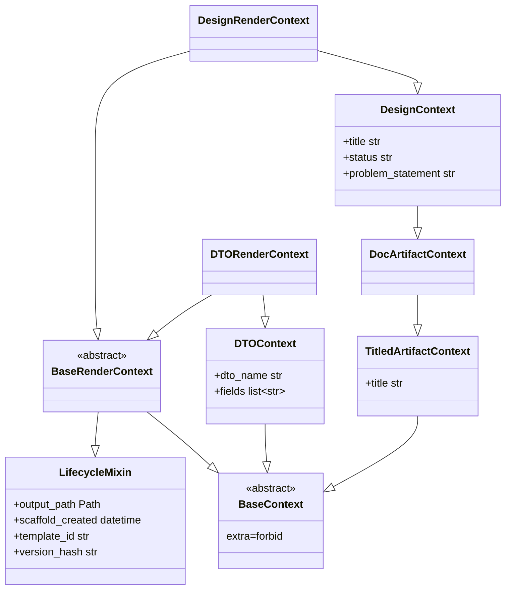
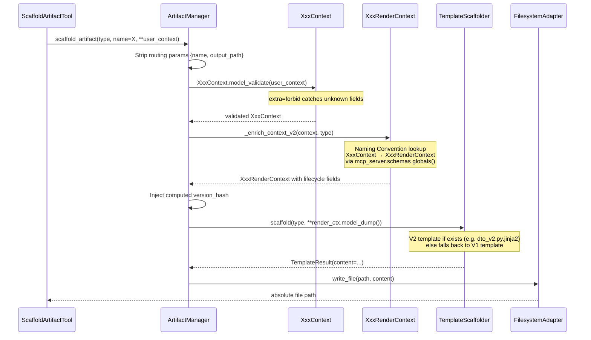

<!-- docs\reference\schema-template-maintenance.md -->
<!-- template=reference version=064954ea created=2026-02-18T22:17Z updated= -->
# Schema & Template Maintenance Reference


**Status:** DEFINITIVE  
**Version:** 1.0  
**Last Updated:** 2026-02-18  

**Source:** [mcp_server/schemas/][source]  
**Tests:** [tests/unit/mcp_server/managers/test_feature_flag_v2.py][tests] (12 tests)  

---

## API Reference

### Architecture: Two-Schema Pattern

Every artifact type has exactly two Pydantic classes: a user-facing **Context** and a system-enriched **RenderContext**.



**Rule:** `XxxContext` = what the caller provides. `XxxRenderContext` = what the template receives. The `ArtifactManager` is the only code that crosses this boundary.

### LifecycleMixin: System-Managed Fields

Located: `mcp_server/schemas/mixins/lifecycle.py`

The mixin defines 4 fields that are **never user-provided**. They are injected by `_enrich_context_v2()` inside `ArtifactManager`:

| Field | Type | Description |
|---|---|---|
| `output_path` | `Path` | Absolute path where artifact was written |
| `scaffold_created` | `datetime` | UTC timestamp at moment of scaffolding |
| `template_id` | `str` | Template identifier e.g. `"dto"`, `"design"` |
| `version_hash` | `str` | 8-char lowercase hex from tier-chain hash |

The `version_hash` validator enforces `len == 8` and `[0-9a-f]` only. It connects to `.st3/template_registry.yaml` for provenance tracking.

`BaseRenderContext` inherits both `LifecycleMixin` and `BaseContext`, so every `XxxRenderContext` automatically has all 4 lifecycle fields plus the artifact-specific fields.

### V2 Pipeline: Full Data Flow

Triggered when `PYDANTIC_SCAFFOLDING_ENABLED=true` (default) and `artifact_type` is in `_v2_context_registry`.



**V1 fallback:** If `PYDANTIC_SCAFFOLDING_ENABLED=false` or `artifact_type` not in registry, the V1 dict-based pipeline runs unchanged. V1 tests use `monkeypatch.setenv('PYDANTIC_SCAFFOLDING_ENABLED', 'false')` to opt out explicitly.

### _v2_context_registry: Artifact Type Mapping

Located: `mcp_server/managers/artifact_manager.py` (module-level constant)

This dict drives V2 routing. Every entry maps an `artifact_type` string to the corresponding `XxxContext` class name looked up from `mcp_server.schemas`.

| artifact_type | Context class | Template file |
|---|---|---|
| `dto` | `DTOContext` | `dto_v2.py.jinja2` ✓ |
| `worker` | `WorkerContext` | `worker.py.jinja2` (V1 used) |
| `tool` | `ToolContext` | `tool.py.jinja2` (V1 used) |
| `schema` | `SchemaContext` | `config_schema.py.jinja2` (V1 used) |
| `service` | `ServiceContext` | `service_command.py.jinja2` (V1 used) |
| `generic` | `GenericContext` | `generic.py.jinja2` (V1 used) |
| `unit_test` | `UnitTestContext` | `test_unit.py.jinja2` (V1 used) |
| `integration_test` | `IntegrationTestContext` | `test_integration.py.jinja2` (V1 used) |
| `research` | `ResearchContext` | `research.md.jinja2` (V1 used) |
| `planning` | `PlanningContext` | `planning.md.jinja2` (V1 used) |
| `design` | `DesignContext` | `design.md.jinja2` (V1 used) |
| `architecture` | `ArchitectureContext` | `architecture.md.jinja2` (V1 used) |
| `reference` | `ReferenceContext` | `reference.md.jinja2` (V1 used) |
| `commit` | `CommitContext` | `commit.txt.jinja2` (V1 used) |
| `pr` | `PRContext` | `pr.md.jinja2` (V1 used) |
| `issue` | `IssueContext` | `issue.md.jinja2` (V1 used) |

Only `dto` currently has a dedicated V2 template (`dto_v2.py.jinja2`). All others fall back to their V1 template while still being validated via Pydantic. A V2 template is optional — Pydantic validation alone catches missing/extra fields even with a V1 template.

### Template ↔ Schema Contract

Templates access context fields directly by name. V1 templates use defensive `{{ field | default('') }}` patterns because dict contents are unvalidated. V2 templates omit defenses because the schema guarantees presence.

**V1 template pattern** (`dto.py.jinja2`):
```jinja
# Defensive: field may or may not exist in dict
class {{ name | default('UnknownDTO') }}(BaseModel):
    
    {{ field.name }}: {{ field.type }} = Field(...)
    
```

**V2 template pattern** (`dto_v2.py.jinja2`):
```jinja
# Schema-guaranteed: dto_name and fields always present
class {{ dto_name }}(BaseModel):
    
    {{ field_def }} = Field(description="{{ field_def.split(':')[0].strip() }} field")
    
```

**Contract rule:** The template variable names must match the Pydantic field names on the `XxxRenderContext`. Change a field name in the schema → must change it in the template. The reverse is also true.

### Routing Parameters: name and output_path

Two kwargs are **routing params**, not user context. They are stripped before `model_validate()` and handled separately:

| Param | Injected by | Purpose | Where restored |
|---|---|---|---|
| `name` | `ScaffoldArtifactTool` (always) | `get_artifact_path(type, name)` for path resolution | `enriched_context["name"]` after `model_dump()` |
| `output_path` | Caller (optional) | Explicit output override | `provided_output_path` param of `_enrich_context_v2()` |

The strip set in the V2 branch is: `_v2_strip_keys = {"output_path", "name"}`. Any future routing param added to `scaffold_artifact()` must also be added to this set.

**Why this matters:** `XxxContext` schemas declare `extra='forbid'`. Any unknown key (including routing params) causes `ValidationError`. This is enforced by Pydantic, not by application code — which means mistakes surface immediately as `extra_forbidden` errors rather than silently corrupt context.

### Adding a New Artifact Type: Step-by-Step

Follow these steps exactly in order. Each step is mandatory unless marked optional.

**1. Create the Context schema** (`mcp_server/schemas/contexts/new_type.py`)
```python
from mcp_server.schemas.base import BaseContext  # or DocArtifactContext for docs
from pydantic import Field

class NewTypeContext(BaseContext):
    """User-facing context for new_type artifacts."""
    # Required fields (all user must provide)
    my_required_field: str = Field(description="...")
    # Optional fields with defaults
    my_optional: list[str] = Field(default_factory=list, description="...")
```
Rules: `extra='forbid'` is inherited. Field names must match the template variables exactly.

**2. Create the RenderContext** (`mcp_server/schemas/render_contexts/new_type.py`)
```python
from mcp_server.schemas.base import BaseRenderContext
from mcp_server.schemas.contexts.new_type import NewTypeContext

class NewTypeRenderContext(BaseRenderContext, NewTypeContext):
    """System-enriched context for new_type template rendering."""
    pass  # Inherits all fields via multiple inheritance
```
This class body is always `pass`. All logic lives in the base classes.

**3. Export from `mcp_server/schemas/__init__.py`**
```python
from mcp_server.schemas.contexts.new_type import NewTypeContext
from mcp_server.schemas.render_contexts.new_type import NewTypeRenderContext
```
Mandatory: `_enrich_context_v2()` discovers `NewTypeRenderContext` via `getattr(schemas_module, 'NewTypeRenderContext')`. If not exported, the V2 pipeline silently falls back to V1.

**4. Register in `_v2_context_registry`** (`mcp_server/managers/artifact_manager.py`)
```python
_v2_context_registry: dict[str, str] = {
    # ... existing entries ...
    "new_type": "NewTypeContext",  # Add this line
}
```

**5. Create the template** (`mcp_server/scaffolding/templates/concrete/new_type.py.jinja2`)
Use template variables that match the `NewTypeContext` field names exactly. No `| default()` guards needed — schema validation guarantees field presence.

**6. Register in `.st3/artifacts.yaml`** — verify `type_id: new_type` exists with correct `template_path` and `type` (`code` or `document`).

**7. Write a V2 smoke test** (see `tests/integration/test_v2_smoke_all_types.py` for the pattern):
```python
@pytest.mark.parametrize("artifact_type,context", [
    ("new_type", {"my_required_field": "value"}),
])
def test_v2_smoke_new_type(v2_manager, artifact_type, context):
    result = asyncio.run(v2_manager.scaffold_artifact(artifact_type, **context))
    assert result is not None
```

### Base Class Selection Guide

Choose the right base class for the Context schema:

| Base class | Use for | Inherits |
|---|---|---|
| `BaseContext` | Code artifacts: dto, worker, tool, service, unit_test, integration_test, generic, schema | `extra=forbid` |
| `TitledArtifactContext` | Tracking artifacts that need a `title` field: commit, pr, issue | `BaseContext` + `title: str` + non-empty validator |
| `DocArtifactContext` | Document artifacts: design, research, planning, architecture, reference | `TitledArtifactContext` |

**Never** inherit directly from `BaseRenderContext` in a Context class. The only classes that may inherit from `BaseRenderContext` are `XxxRenderContext` classes.


## Related Documentation
None
---

## Version History

| Version | Date | Author | Changes |
|---------|------|--------|---------|
| 1.0 | 2026-02-18 | Agent | Initial draft |