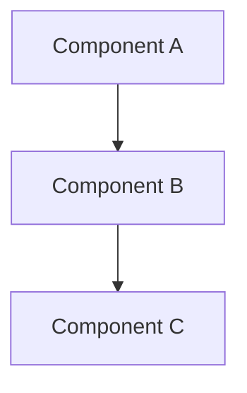

# docs/architecture/{DOCUMENT_NAME}.md
# {Document Title} - S1mpleTraderV3

<!--
ARCHITECTURE TEMPLATE - Extends BASE_TEMPLATE
Purpose: Conceptual system design documentation (300-1000 lines)

Inherits from BASE:
├── Header (Status, Version, Last Updated)
├── Purpose, Scope, Prerequisites
├── Related Documentation + Link definitions
└── Version History

Adds:
├── Numbered sections (## 1. Concept, ### 1.1 Detail)
├── Mermaid diagrams for visualization
└── Constraints & Decisions table

Rules:
├── NO implementation code (link to source files)
├── Focus on WHAT and WHY, not HOW
└── Stable concepts, not implementation details
-->

<!-- ═══════════════════════════════════════════════════════════════════════════
     HEADER SECTION (from BASE)
     ═══════════════════════════════════════════════════════════════════════════ -->

**Status:** {DRAFT | PRELIMINARY | APPROVED | DEFINITIVE}  
**Version:** {X.Y}  
**Last Updated:** {YYYY-MM-DD}  

---

<!-- ═══════════════════════════════════════════════════════════════════════════
     CONTEXT SECTION (from BASE)
     ═══════════════════════════════════════════════════════════════════════════ -->

## Purpose

{One paragraph describing:
- What architectural concept this document defines
- Why this design exists (problem it solves)
- Target audience: developers implementing against this architecture}

## Scope

**In Scope:**
- {Architectural concept 1}
- {Architectural concept 2}

**Out of Scope:**
- Implementation details → See [{REFERENCE_DOC.md}][ref-doc]
- {Related concept} → See [{OTHER_ARCH.md}][other-arch]

## Prerequisites

[OPTIONAL - delete if no prior reading required]

Read these first:
1. [{CORE_PRINCIPLES.md}][prereq-1] - Fundamental design philosophy
2. [{RELATED_ARCHITECTURE.md}][prereq-2] - {why needed for context}

---

<!-- ═══════════════════════════════════════════════════════════════════════════
     CONTENT SECTION (ARCHITECTURE-SPECIFIC: numbered, diagrams, no code)
     ═══════════════════════════════════════════════════════════════════════════ -->

## 1. {First Architectural Concept}

{Describe the concept at a high level. Focus on:
- What it is (definition)
- Why it exists (rationale)
- How it relates to other concepts}

### 1.1. {Aspect of First Concept}

{Drill down into specifics. Use Mermaid diagrams:}

### 1.2. {Another Aspect}

{Continue with related details}

---

## 2. {Second Architectural Concept}

{Next major concept...}

### 2.1. {Subsection}

{Details...}

---

## 3. Constraints & Decisions

[OPTIONAL - include for significant architectural decisions]

| Decision | Rationale | Alternatives Rejected |
|----------|-----------|----------------------|
| {Decision 1} | {Why chosen} | {What was not chosen} |
| {Decision 2} | {Why chosen} | {What was not chosen} |

---

<!-- ═══════════════════════════════════════════════════════════════════════════
     FOOTER SECTION (from BASE)
     ═══════════════════════════════════════════════════════════════════════════ -->

## Related Documentation

- **[{PIPELINE_FLOW.md}][related-1]** - {how it relates}
- **[{WORKER_TAXONOMY.md}][related-2]** - {how it relates}
- **[{implementation.py}][source-1]** - Source implementation

<!-- Link definitions -->

[ref-doc]: ../reference/path/to/doc.md "Reference documentation"
[other-arch]: ./OTHER_ARCHITECTURE.md "Related architecture"
[prereq-1]: ./CORE_PRINCIPLES.md "Core design principles"
[prereq-2]: ./RELATED.md "Related architecture"
[related-1]: ./PIPELINE_FLOW.md "Pipeline overview"
[related-2]: ./WORKER_TAXONOMY.md "Worker categories"
[source-1]: ../../backend/path/to/file.py "Implementation"

---

## Version History

| Version | Date | Author | Changes |
|---------|------|--------|---------|
| {X.Y} | {YYYY-MM-DD} | {Name/AI} | {Brief description} |
| 1.0 | {YYYY-MM-DD} | {Name/AI} | Initial document |
