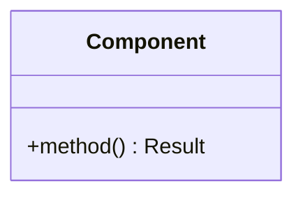

# docs/development/{DOCUMENT_NAME}_DESIGN.md
# {Component} Design

<!--
DESIGN TEMPLATE - Extends BASE_TEMPLATE
Purpose: Pre-implementation design documentation (300-600 lines)

Inherits from BASE:
├── Header (Status, Version, Last Updated)
├── Purpose, Scope, Prerequisites
├── Related Documentation + Link definitions
└── Version History

Adds:
├── Header: Created, Implementation Phase
├── Numbered decision sections
├── Design Options with pros/cons
├── Open Questions table
└── Approval section

Rules:
├── Code examples allowed (illustrative, not production)
├── Status lifecycle: PRELIMINARY → APPROVED
└── Focus on decision rationale
-->

<!-- ═══════════════════════════════════════════════════════════════════════════
     HEADER SECTION (from BASE + Design-specific fields)
     ═══════════════════════════════════════════════════════════════════════════ -->

**Status:** {PRELIMINARY | APPROVED}  
**Version:** {X.Y}  
**Created:** {YYYY-MM-DD}  
**Last Updated:** {YYYY-MM-DD}  
**Implementation Phase:** {Phase X.Y - description}  

---

<!-- ═══════════════════════════════════════════════════════════════════════════
     CONTEXT SECTION (from BASE)
     ═══════════════════════════════════════════════════════════════════════════ -->

## Purpose

{One paragraph describing:
- What component/feature this design covers
- What problem it solves
- Context: why this design is needed now}

## Scope

**In Scope:**
- {Design aspect 1}
- {Design aspect 2}

**Out of Scope:**
- {Aspect handled elsewhere} → See [{OTHER_DESIGN.md}][other-design]
- {Future enhancement} → Deferred to Phase {X}

## Prerequisites

[OPTIONAL - delete if no prior reading required]

Read these first:
1. [{ARCHITECTURE_DOC.md}][prereq-1] - Architectural context
2. [{RELATED_DESIGN.md}][prereq-2] - Related component design

---

<!-- ═══════════════════════════════════════════════════════════════════════════
     CONTENT SECTION (DESIGN-SPECIFIC: context, options, decision)
     ═══════════════════════════════════════════════════════════════════════════ -->

## 1. Context & Requirements

### 1.1. Problem Statement

{What problem does this component solve? Be specific.}

### 1.2. Requirements

**Functional:**
- [ ] {Requirement 1}
- [ ] {Requirement 2}

**Non-Functional:**
- [ ] {Performance requirement}
- [ ] {Maintainability requirement}

### 1.3. Constraints

- {Constraint from architecture}
- {Constraint from existing implementation}

---

## 2. Design Options

### 2.1. Option A: {Name}

{Description of this approach}

```python
# Illustrative code (design-level, not production)
class ComponentA:
    def method(self) -> Result:
        ...
```

**Pros:**
- ✅ {Advantage 1}
- ✅ {Advantage 2}

**Cons:**
- ❌ {Disadvantage 1}
- ❌ {Disadvantage 2}

### 2.2. Option B: {Name}

{Description of alternative approach}

**Pros:**
- ✅ {Advantage 1}

**Cons:**
- ❌ {Disadvantage 1}

---

## 3. Chosen Design

**Decision:** Option {A/B} - {Name}

**Rationale:** {Why this option was selected over alternatives}

### 3.1. Component Structure



### 3.2. Key Design Decisions

| Decision | Rationale |
|----------|-----------|
| {Decision 1} | {Why} |
| {Decision 2} | {Why} |

---

## 4. Open Questions

[OPTIONAL - remove section when all resolved and status is APPROVED]

| Question | Options | Status |
|----------|---------|--------|
| {Question 1} | {Option A / Option B} | 🔴 Open |
| {Question 2} | {Options} | 🟡 Discussed |

---

<!-- ═══════════════════════════════════════════════════════════════════════════
     FOOTER SECTION (from BASE)
     ═══════════════════════════════════════════════════════════════════════════ -->

## Related Documentation

- **[{ARCHITECTURE.md}][arch]** - Architectural context
- **[{RELATED_DESIGN.md}][related]** - Related component
- **[{TODO.md}][todo]** - Implementation tracking

<!-- Link definitions -->

[other-design]: ./OTHER_DESIGN.md "Related design"
[prereq-1]: ../architecture/ARCHITECTURE.md "Architecture"
[prereq-2]: ./RELATED_DESIGN.md "Related design"
[arch]: ../architecture/RELEVANT.md "Architecture context"
[related]: ./RELATED_DESIGN.md "Related component"
[todo]: ../TODO.md "Project tracking"

---

## Version History

| Version | Date | Author | Changes |
|---------|------|--------|---------|
| {X.Y} | {YYYY-MM-DD} | {Name/AI} | {Brief description} |
| 1.0 | {YYYY-MM-DD} | {Name/AI} | Initial design |
