# 0_ARCHITECTURE_OVERVIEW.md

# **S1mpleTrader: Architectonische Blauwdruk**

Status: Definitief

## **Voorwoord: Kernfilosofie - Het Platform als Framework**

Welkom bij de architectonische blauwdruk voor S1mpleTrader. Dit document dient als de centrale gids voor een systeem dat is ontworpen als een agnostisch **besturingssysteem** voor kwantitatieve strategen.

De kernvisie is dat het platform zelf geen specifieke manier van handelen afdwingt. Zijn enige doel is het bieden van een extreem robuust, flexibel en schaalbaar **framework**. Binnen dit framework kan een quant alle mogelijke kwantitatieve en operationele functionaliteit implementeren via zelfstandige, specialistische plugins.

**Paradigma: "Operators zijn dom, configuratie is slim"**

De architectuur benadrukt de configuratie-gedreven natuur van het systeem. Het 5-categorie worker ecosysteem (Context, Opportunity, Threat, Planning, Execution) wordt aangestuurd door data-gedreven operators die hun gedrag volledig ontlenen aan configuratie. De Persistence Suite garandeert atomische betrouwbaarheid, terwijl het Causale ID Framework volledige traceerbaarheid biedt van elke beslissing.

De configuratie is het draaiboek; de plugins zijn de acteurs; het platform is het podium.

Deze documentatie beschrijft de architectuur die deze visie mogelijk maakt.

## **De Architectuur in Hoofdstukken**

### **Hoofdstuk 1: De Communicatie Architectuur**

De kern van de architectuur is de radicale scheiding tussen business- en communicatielogica. Dit hoofdstuk beschrijft het EventAdapter-patroon en de rol van de `wiring_map.yaml`, die samen het "zenuwstelsel" van het platform vormen.

**→ Lees de volledige uitwerking in: `1_BUS_COMMUNICATION_ARCHITECTURE.md`**

### **Hoofdstuk 2: Architectuur & Componenten**

Dit hoofdstuk beschrijft de strikt gelaagde opbouw (Backend, Service, Frontend) en introduceert het **5-categorie worker ecosysteem** (Context, Opportunity, Threat, Planning, Execution) met 27 sub-categorieën. Centraal staat het concept van **data-gedreven operators** en de geïntegreerde **Persistence Suite** voor atomische betrouwbaarheid.

**→ Lees de volledige uitwerking in: `2_ARCHITECTURE.md`**

### **Hoofdstuk 3: De Configuratie Trein**

Configuratie is de kern van het systeem. Dit document is een gedetailleerde gids voor de volledige hiërarchie van YAML-bestanden, van `platform.yaml` tot `plugin_manifest.yaml`, die samen een volledige Operation definiëren. Inclusief de `operators.yaml` voor operator gedragsconfiguratie.

**→ Lees de volledige uitwerking in: `3_DE_CONFIGURATIE_TREIN.md`**

### **Hoofdstuk 4: De Anatomie van een Plugin**

Een plugin is de fundamentele, zelfstandige en testbare eenheid van logica. Dit hoofdstuk beschrijft de mappenstructuur, het `manifest.yaml`, het `schema.py` en de vijf worker types met **27 sub-categorieën**. Ook worden de **gelaagde plugin capabilities** beschreven (Pure Logic, Stateful, Event-Aware, Journaling).

**→ Lees de volledige uitwerking in: `4_DE_PLUGIN_ANATOMIE.md`**

### **Hoofdstuk 5: De Analytische Pijplijn**

De kern van elke analytische strategie is de pijplijn die een idee stapsgewijs valideert. Dit hoofdstuk beschrijft het **parallel event-driven model** over 3 abstractieniveaus (Workers → Operators → Engine) en de workflow van opportuniteit detectie naar trade executie via het 5-categorie ecosysteem.

**→ Lees de volledige uitwerking in: `5_DE_WORKFLOW_ORKESTRATIE.md`**

### **Hoofdstuk 6: Frontend Integration**

Dit hoofdstuk beschrijft de web-based frontend architectuur voor S1mpleTrader, inclusief de **Operator Configuration UI** voor visueel configureren van worker ecosystemen, de **Causale Trade Explorer** voor post-mortem analyse met volledige causale tracking, en de Plugin IDE voor ontwikkeling en testing.

**→ Lees de volledige uitwerking in: `6_FRONTEND_INTEGRATION.md`**

### **Hoofdstuk 7: Robuustheid & Operationele Betrouwbaarheid**

Een live trading-systeem moet veerkrachtig zijn. Dit hoofdstuk beschrijft de verdedigingslinies: de **Persistence Suite** met atomische schrijfacties (journaling), protocollen voor netwerkveerkracht, het Supervisor-model voor crash recovery, en het **Traceability Framework** voor volledige causale analyse.

**→ Lees de volledige uitwerking in: `7_RESILIENCE_AND_OPERATIONS.md`**

### **Hoofdstuk 8: Ontwikkelstrategie & Tooling**

Dit document beschrijft de workflow en tooling, van de visuele 'Strategy Builder' tot de 'Causale Trade Explorer' en de cruciale rol van het Causale ID Framework voor volledige traceerbaarheid van elke beslissing in het systeem.

**→ Lees de volledige uitwerking in: `8_DEVELOPMENT_STRATEGY.md`**

### **Hoofdstuk 9: Meta Workflows**

Bovenop de executie van een enkele strategie draaien "Meta Workflows" om geavanceerde analyses uit te voeren. Dit hoofdstuk beschrijft de `OptimizationService` en `VariantTestService`.

**→ Lees de volledige uitwerking in: `9_META_WORKFLOWS.md`**

### **Hoofdstuk 10: Coding Standaarden & Design Principles**

Een consistente codebase is essentieel. Dit hoofdstuk beschrijft de verplichte standaarden (PEP 8, Type Hinting) en de kern design principles (SOLID, Factory Pattern, DTO's), inclusief de interface-driven Persistence Suite architectuur.

**→ Lees de volledige uitwerking in: `10_CODING_STANDAARDS_DESIGN_PRINCIPLES.md`**

## **Bijlages**

*   **Bijlage A: Terminologie**: Een uitgebreid, alfabetisch naslagwerk met beschrijvingen van alle belangrijke concepten en componenten. [→ `A_BIJLAGE_TERMINOLOGIE.md`](A_BIJLAGE_TERMINOLOGIE.md)
*   **Bijlage B: Openstaande Vraagstukken**: Een overzicht van bekende "onbekenden" die tijdens de implementatie verder onderzocht moeten worden. [→ `B_BIJLAGE_OPENSTAANDE_VRAAGSTUKKEN.md`](B_BIJLAGE_OPENSTAANDE_VRAAGSTUKKEN.md)
*   **Bijlage C: MVP**: De scope en componenten van het Minimum Viable Product. [→ `C_BIJLAGE_MVP.pdf`](C_BIJLAGE_MVP.pdf)
*   **Bijlage D: Plugin IDE**: De architectuur en UX voor de web-based IDE voor plugins. [→ `D_BIJLAGE_PLUGIN_IDE.md`](D_BIJLAGE_PLUGIN_IDE.md)

---

# 10_CODING_STANDAARDS_DESIGN_PRINCIPLES.md

# **10. Coding Standaarden & Design Principles**

**Status:** Definitief
Dit document beschrijft de verplichte standaarden en best practices voor het schrijven van alle code binnen het S1mpleTrader-project.

## **Inhoudsopgave**

1. [Executive Summary](#executive-summary)
2. [Code Kwaliteit & Stijl](#101-code-kwaliteit--stijl)
3. [Contract-Gedreven Ontwikkeling](#102-contract-gedreven-ontwikkeling)
4. [Dependency Injection Principes](#103-dependency-injection-principes)
5. [Configuratie-Gedreven Design](#104-configuratie-gedreven-design)
6. [Gelaagde Logging & Traceability](#105-gelaagde-logging--traceability)
7. [Testen als Voorwaarde](#106-testen-als-voorwaarde)
8. [Overige Standaarden](#107-overige-standaarden)
9. [Design Principles & Kernconcepten](#108-design-principles--kernconcepten)

---

## **Executive Summary**

Dit document legt de fundering voor een consistente, leesbare, onderhoudbare en robuuste codebase voor S1mpleTrader. Het naleven van deze standaarden is niet optioneel en is cruciaal voor het succes van het project.

### **🎯 Kernprincipes**

**1. Strikte Code Kwaliteit en Stijl**
-   Alle code is **PEP 8 compliant** met een maximale regellengte van 100 tekens.
-   **Volledige type hinting** is verplicht.
-   **Engelse docstrings** in Google Style zijn de standaard voor alle bestanden, klassen en functies.

**2. Contract-Gedreven Ontwikkeling**
-   Alle data die tussen componenten wordt uitgewisseld, wordt ingekapseld in **Pydantic BaseModels**.
-   Uitwisselbare componenten erven van **abstracte basisklassen (Interfaces)**.

**3. Dependency Injection als Kernpatroon**
-   **Constructor Injection** is de standaard voor alle dependencies.
-   Componenten zijn afhankelijk van **abstracties (interfaces)**, niet van concrete implementaties.
-   Een **Gecentraliseerd Factory Model** (`PersistorFactory`, `EventAdapterFactory`, `OperatorFactory`) beheert de creatie van complexe objecten.

**4. Scheiding van ROL en CAPABILITIES**
-   De **ROL** van een worker (zijn architecturale doel) wordt bepaald door de keuze van de basisklasse (`StandardWorker` of `EventDrivenWorker`).
-   De **CAPABILITIES** (extra vaardigheden zoals `state` en `events`) worden expliciet aangevraagd in het `manifest.yaml` en dynamisch geïnjecteerd.

**5. Configuratie-Gedreven Design**
-   Het principe **"YAML is intelligentie, code is mechanica"** is leidend. Het gedrag van het systeem, met name van de operators, wordt gedefinieerd in configuratie (`operators.yaml`), niet in de code.

### **🔑 Design Patterns**

-   **SOLID**: De principes van Single Responsibility, Open/Closed, Dependency Inversion, etc., worden strikt toegepast.
-   **Factory Pattern**: Voor het creëren van complexe, geconfigureerde objecten.
-   **Adapter Pattern**: Om plugins "bus-agnostisch" te maken.
-   **CQRS (Command Query Responsibility Segregation)**: Een strikte scheiding tussen operaties die data lezen (Queries) en operaties die de staat veranderen (Commands).

---

## **10.1. Code Kwaliteit & Stijl**

### **10.1.1. Fundamenten**

*   **PEP 8 Compliant:** Alle Python-code moet strikt voldoen aan de [PEP 8](https://peps.python.org/pep-0008/) stijlgids. Een linter wordt gebruikt om dit te handhaven.
    *   **Regellengte:** Maximaal 100 tekens.
    *   **Naamgeving:** snake\_case voor variabelen, functies en modules; PascalCase voor klassen.
*   **Volledige Type Hinting:** Alle functies, methodes, en variabelen moeten volledig en correct getypeerd zijn. We streven naar een 100% getypeerde codebase om runtime-fouten te minimaliseren.
*   **Commentaar in het Engels:** Al het commentaar in de code (\# ...) en docstrings moeten in het Engels zijn voor universele leesbaarheid en onderhoudbaarheid.

### **10.1.2. Gestructureerde Docstrings**

Elk bestand, elke klasse en elke functie moet een duidelijke docstring hebben.

*   **Bestands-Header Docstring:** Elk .py-bestand begint met een gestandaardiseerde header die de inhoud en de plaats in de architectuur beschrijft.
    ```python
    # backend/assembly/component_builder.py  
    """  
    Contains the ComponentBuilder, responsible for assembling and instantiating  
    all required Operator and Worker components for a given strategy_link.

    @layer: Backend (Assembly)  
    @dependencies: [PyYAML, Pydantic]  
    @responsibilities:  
        - Reads the strategy_blueprint.yaml.  
        - Validates the workforce configuration.  
        - Instantiates all required plugin workers and operators.  
    """
    ```

*   **Imports:** Alle imports staan bovenaan het bestand. Het is van belang dat deze in de juiste volgorde staan. We zullen hiervoor ten alle tijden een onderverdeling gebruiken in de volgende drie groepen en volgorde:
    *   **1. Standard Library Imports**
    *   **2. Third-Party Imports**
    *   **3. Our Application Imports**
        Alle imports zullen absoluut zijn en opbouwen vanaf de project root.

Indien mogelijk worden imports gegroepeerd om lange regels te voorkomen en te blijven voldoen aan de PEP 8.

*   **Functie & Methode Docstrings (Google Style):** Voor alle functies en methodes hanteren we de **Google Style Python Docstrings**. Dit is een leesbare en gestructureerde manier om parameters, return-waarden en voorbeelden te documenteren.
    ```python
    def process_data(df: pd.DataFrame, length: int = 14) -> pd.DataFrame:  
        """Calculates an indicator and adds it as a new column.

        Args:  
            df (pd.DataFrame): The input DataFrame with OHLCV data.  
            length (int, optional): The lookback period for the indicator.  
                Defaults to 14.

        Returns:  
            pd.DataFrame: The DataFrame with the new indicator column added.  
        """  
        # ... function logic ...  
        return df
    ```

### **10.1.3. Naamgevingsconventies**

Naast de algemene [PEP 8]-richtlijnen hanteren we een aantal strikte, aanvullende conventies om de leesbaarheid en de architectonische zuiverheid van de code te vergroten.

*   **Interfaces (Contracten):**
    *   **Principe:** Elke abstracte klasse (ABC) of Protocol die een contract definieert, moet worden voorafgegaan door een hoofdletter I.
    *   **Doel:** Dit maakt een onmiddellijk en ondubbelzinnig onderscheid tussen een abstract contract en een concrete implementatie.
    *   Voorbeeld:
        ```python
        # Het contract (de abstractie)  
        class IAPIConnector(Protocol):
            ...  
        # De concrete implementatie  
        class KrakenAPIConnector(IAPIConnector):
            ...  
        ```

*   **Interne Attributen en Methodes:**
    *   **Principe:** Attributen of methodes die niet bedoeld zijn voor gebruik buiten de klasse, moeten worden voorafgegaan door een enkele underscore (\_).
    *   **Doel:** Dit communiceert duidelijk de publieke API van een klasse.
    *   Voorbeeld:
        ```python
        class AnalysisOperator:  
            def __init__(self):  
                self._app_config = ... # Intern  
            def run_pipeline(self): # Publiek  
                self._prepare_workers() # Intern

            def _prepare_workers(self):  
                ...  
        ```

## **10.2. Contract-Gedreven Ontwikkeling**

### **10.2.1. Pydantic voor alle Data-Structuren**

*   **Principe:** Alle data die tussen componenten wordt doorgegeven, moet worden ingekapseld in een **Pydantic BaseModel**. Dit geldt voor DTO's, configuraties en plugin-parameters.
*   **Voordeel:** Dit garandeert dat data van het juiste type en de juiste structuur is *voordat* het wordt verwerkt.

### **10.2.2. Abstracte Basisklassen (Interfaces)**

*   **Principe:** Componenten die uitwisselbaar moeten zijn (zoals plugins), moeten erven van een gemeenschappelijke abstracte basisklasse (ABC) die een consistent contract afdwingt.

## **10.3. Dependency Injection Principes** ⭐

De S1mpleTrader-architectuur is gebouwd op strikte dependency injection principes om testbaarheid, flexibiliteit en onderhoudbaarheid te maximaliseren.

### **10.3.1. Constructor Injection als Standaard**

Alle dependencies worden geïnjecteerd via de constructor, nooit via property setters of method parameters.

**Goed voorbeeld:**
```python
# backend/core/operators/base_operator.py
class BaseOperator:
    """Operator met geïnjecteerde dependencies."""
    
    def __init__(
        self,
        config: OperatorConfig,
        component_builder: ComponentBuilder,
        event_bus: EventBus,
        persistor_factory: PersistorFactory
    ):
        self.config = config
        self._component_builder = component_builder
        self._event_bus = event_bus
        self._persistor_factory = persistor_factory
```

**Slecht voorbeeld:**
```python
# ❌ NIET DOEN: Dependencies via properties
class BadOperator:
    def __init__(self, config: OperatorConfig):
        self.config = config
        self.event_bus = None  # ❌ Wordt later gezet
    
    def set_event_bus(self, bus: EventBus):  # ❌ Setter pattern
        self.event_bus = bus
```

### **10.3.2. ROL-definitie en Capability-injectie**

Componenten hangen af van abstracties ([`IStatePersistor`](../../backend/core/interfaces/persistors.py:IStatePersistor), [`IJournalPersistor`](../../backend/core/interfaces/persistors.py:IJournalPersistor), [`IEventHandler`](../../backend/core/interfaces/event_handler.py:IEventHandler)), niet van concrete implementaties. De architectuur scheidt de **ROL** van een worker (hoe deze wordt aangeroepen) van zijn **CAPABILITIES** (extra vaardigheden).

1.  **De ROL wordt bepaald door de basisklasse:**
    *   `StandardWorker`: Doet mee aan de georkestreerde pijplijn en implementeert de `process()` methode.
    *   `EventDrivenWorker`: Reageert autonoom op events van de EventBus.

2.  **CAPABILITIES worden aangevraagd in het manifest en geïnjecteerd door de `WorkerBuilder`.**

Een worker vraagt een capability aan, en de `WorkerBuilder` injecteert de benodigde dependency (die een interface implementeert) in de constructor.

**Voorbeeld: Worker die State en Event-capabilities aanvraagt**

Een worker kan zowel een `StandardWorker` zijn als stateful en event-aware willen zijn. Hij erft alleen van `StandardWorker` en de rest wordt geconfigureerd.

**`manifest.yaml`**
```yaml
# manifest.yaml
name: "MyStatefulEventfulWorker"
# ...
capabilities:
  state:
    enabled: true
    state_dto: "dtos.state_dto.MyState"
  events:
    enabled: true # Let op: dit is een StandardWorker die OOK events kan publishen
    publishes:
      - as_event: "MyWorkDoneEvent"
```
**`worker.py` (De implementatie is nu heel schoon)**
```python
# plugins/my_worker/worker.py
from backend.core.base_worker import StandardWorker
from backend.core.interfaces.persistors import IStatePersistor
from backend.core.interfaces.event_handler import IEventHandler

class MyStatefulEventfulWorker(StandardWorker):
    """
    Worker met state en event capabilities, geïnjecteerd via de constructor.
    De ROL (StandardWorker) is gedefinieerd door de klasse.
    De CAPABILITIES (state, events) zijn geconfigureerd in het manifest.
    """
    def __init__(
        self,
        params: Any,
        state_persistor: IStatePersistor,  # ← Geïnjecteerd door WorkerBuilder
        event_handler: IEventHandler      # ← Geïnjecteerd door WorkerBuilder
    ):
        super().__init__(params)
        self._state_persistor = state_persistor
        self._event_handler = event_handler
        self._state = state_persistor.load()

    def process(self, context: Any, **kwargs) -> Any:
        # Doe werk...
        self._state.counter += 1
        self.commit_state()
        self.emit("MyWorkDoneEvent", {"counter": self._state.counter})
        return context

    def commit_state(self) -> None:
        """Schrijft de state weg via de geïnjecteerde persistor."""
        self._state_persistor.save_atomic(self._state)

    def emit(self, event_name: str, payload: Any) -> None:
        """Publiceert een event via de geïnjecteerde handler."""
        self._event_handler.publish(event_name, payload)
```

### **10.3.3. Gecentraliseerd Factory Model voor Complexe Objecten**

Complexe object-constructie gebeurt via **gespecialiseerde, gecentraliseerde factories**. Elke factory heeft één enkele verantwoordelijkheid. Andere componenten (zoals de `WorkerBuilder`) worden "klanten" van deze factories en bevatten zelf geen bouwlogica meer.

*   `PersistorFactory`: De **enige** bron voor het creëren van `IStatePersistor` en `IJournalPersistor` instanties.
*   `EventAdapterFactory`: De **enige** bron voor het creëren van `IEventHandler` (EventAdapter) instanties.
*   `OperatorFactory`: Creëert `BaseOperator` instanties op basis van configuratie.

**EventAdapterFactory Voorbeeld:**
```python
# backend/assembly/event_adapter_factory.py
from backend.core.interfaces.event_handler import IEventHandler
from backend.core.event_bus import EventBus
from .plugin_event_adapter import PluginEventAdapter

class EventAdapterFactory:
    """
    Gespecialiseerde factory voor het creëren van event adapters.
    Dit is de enige plek die weet hoe een IEventHandler wordt gebouwd.
    """
    def __init__(self, event_bus: EventBus):
        self._event_bus = event_bus

    def create_event_handler_for_component(
        self,
        target_component: Any,
        wiring_instructions: List[WiringInstruction]
    ) -> IEventHandler:
        """Creëert en configureert een adapter voor een specifieke component."""
        adapter = PluginEventAdapter(
            event_bus=self._event_bus,
            target_component=target_component
        )
        adapter.apply_wirings(wiring_instructions)
        return adapter
```
**OperatorFactory Voorbeeld (Klant van andere componenten):**
```python
# backend/assembly/operator_factory.py
from backend.core.operators.base_operator import BaseOperator

class OperatorFactory:
    """Factory voor het creëren van operators op basis van configuratie."""
    def __init__(
        self,
        config_loader: ConfigLoader,
        worker_builder: WorkerBuilder, # ← Let op: geen 'component_builder' meer
        event_bus: EventBus,
        persistor_factory: PersistorFactory
    ):
        self._config_loader = config_loader
        self._worker_builder = worker_builder
        self._event_bus = event_bus
        self._persistor_factory = persistor_factory

    def create_operator(self, operator_id: str) -> BaseOperator:
        """Creëert een operator instance op basis van operators.yaml."""
        config = self._config_loader.load_operator_config(operator_id)
        
        # Bereid de workforce voor (het nieuwe "Geprepareerde Workforce Model")
        workforce_dto = self._worker_builder.build_workforce_for_operator(config)
        
        # De Operator krijgt alleen de standard_workers en is "dom"
        return BaseOperator(
            config=config,
            workers=workforce_dto.standard_workers, # ← Geprepareerde lijst!
            event_bus=self._event_bus
        )
```

### **10.3.4. "Plugins zijn slim, infrastructuur is dom" Principe**

Plugins bevatten business logica, infrastructuur componenten (operators, persistors) zijn generieke executors.

**Goed voorbeeld - Slimme Plugin:**
```python
# plugins/opportunity_workers/fvg_detector/worker.py
from backend.core.base_worker import BaseWorker

class FVGDetector(BaseWorker):
    """Smart: bevat FVG detectie logica."""
    
    def process(self, context: TradingContext) -> List[Signal]:
        signals = []
        
        # Business logica: wat IS een FVG?
        for i in range(len(context.enriched_df) - 3):
            if self._is_fvg(context.enriched_df, i):
                signals.append(Signal(
                    opportunity_id=uuid4(),
                    timestamp=context.enriched_df.index[i],
                    signal_type='fvg_entry'
                ))
        
        return signals
    
    def _is_fvg(self, df, i):
        # Pure business logica
        return (df['low'].iloc[i+2] > df['high'].iloc[i])
```

**Goed voorbeeld - Domme Infrastructuur:**
```python
# backend/core/operators/base_operator.py
class BaseOperator:
    """Dumb: voert alleen uit volgens configuratie."""
    
    def run(self, context: Any, **kwargs) -> Any:
        """Generieke executie - gedrag bepaald door config."""
        workforce = self._component_builder.get_workforce(...)
        
        # Delegeer naar execution strategy (uit configuratie)
        if self.config.execution_strategy == ExecutionStrategy.SEQUENTIAL:
            return self._execute_sequential(workforce, context)
        elif self.config.execution_strategy == ExecutionStrategy.PARALLEL:
            return self._execute_parallel(workforce, context)
        # etc...
```

### **10.3.5. Dependency Injection in Tests**

Tests moeten gemakkelijk mock dependencies kunnen injecteren.

```python
# tests/test_base_stateful_worker.py
def test_stateful_worker_commits_state():
    # Arrange: Create mock persistor
    mock_persistor = MockStatePersistor()
    worker = TrailingStopManager(
        params={"trail_percent": 0.02},
        state_persistor=mock_persistor  # ← Injecteer mock
    )
    
    # Act
    context = create_test_context(current_price=50000)
    worker.process(context)
    
    # Assert
    assert mock_persistor.save_called
    assert mock_persistor.saved_data['high_water_mark'] == 50000
```

## **10.4. Configuratie-Gedreven Design** ⭐

"**YAML is intelligentie, code is mechanica**"

### **10.4.1. Operators.yaml als Perfecte Scheiding**

Het [`operators.yaml`](../../config/operators.yaml) bestand is het perfecte voorbeeld van configuratie-gedreven design - het volledige gedrag van operators wordt gedefinieerd zonder code te wijzigen.

**Configuratie definieert gedrag:**
```yaml
# config/operators.yaml
operators:
  - operator_id: "ContextOperator"
    manages_worker_type: "ContextWorker"
    execution_strategy: "SEQUENTIAL"      # ← Gedrag in configuratie
    aggregation_strategy: "CHAIN_THROUGH" # ← Niet in code!
    
  - operator_id: "OpportunityOperator"
    manages_worker_type: "OpportunityWorker"
    execution_strategy: "PARALLEL"
    aggregation_strategy: "COLLECT_ALL"
```

**Code is generieke executor:**
```python
# backend/core/operators/base_operator.py
class BaseOperator:
    """Generieke operator - gedrag via configuratie."""
    
    def run(self, context: Any) -> Any:
        # Lees configuratie
        strategy = self.config.execution_strategy
        
        # Voer uit volgens configuratie
        if strategy == ExecutionStrategy.SEQUENTIAL:
            return self._execute_sequential(...)
        elif strategy == ExecutionStrategy.PARALLEL:
            return self._execute_parallel(...)
```

### **10.4.2. Validatie via Pydantic Schemas**

Alle configuratie wordt gevalideerd door Pydantic schemas voordat executie begint.

**OperatorConfig Schema:**
```python
# backend/dtos/config/operator_config.py
from pydantic import BaseModel, Field
from backend.core.enums import ExecutionStrategy, AggregationStrategy

class OperatorConfig(BaseModel):
    """Configuration schema for a single operator."""
    
    operator_id: str = Field(
        ...,
        description="Unique identifier for this operator"
    )
    manages_worker_type: str = Field(
        ...,
        description="The worker type this operator manages"
    )
    execution_strategy: ExecutionStrategy = Field(
        ...,
        description="How workers are executed (SEQUENTIAL/PARALLEL/EVENT_DRIVEN)"
    )
    aggregation_strategy: AggregationStrategy = Field(
        ...,
        description="How worker outputs are combined"
    )

class OperatorSuiteConfig(BaseModel):
    """Configuration schema for all operators."""
    
    operators: List[OperatorConfig] = Field(
        ...,
        description="List of operator configurations"
    )
```

**ExecutionStrategy en AggregationStrategy Enums:**
```python
# backend/core/enums.py
class ExecutionStrategy(str, Enum):
    """How workers are executed."""
    SEQUENTIAL = "SEQUENTIAL"  # One by one, chained
    PARALLEL = "PARALLEL"      # All at once, collect results
    EVENT_DRIVEN = "EVENT_DRIVEN"  # React to events

class AggregationStrategy(str, Enum):
    """How worker outputs are combined."""
    CHAIN_THROUGH = "CHAIN_THROUGH"  # Output N → Input N+1
    COLLECT_ALL = "COLLECT_ALL"      # Collect all in list
    NONE = "NONE"                     # No aggregation
```

### **10.4.3. Best Practices voor Configuratie Design**

✅ **DO's:**
-   Definieer gedrag in YAML, niet in code
-   Gebruik Pydantic voor alle configuratie validatie
-   Maak configuratie zelf-documenterend met `description` fields
-   Test configuratie-wijzigingen zonder code te wijzigen

❌ **DON'Ts:**
-   Hard-code gedrag dat via configuratie zou kunnen
-   Valideer configuratie niet met Pydantic
-   Maak configuratie te complex - begin simpel
-   Skip configuratie documentatie

**Voorbeeld van Perfecte Scheiding:**
```yaml
# config/operators.yaml - Intelligence
- operator_id: "PlanningOperator"
  execution_strategy: "SEQUENTIAL"  # ← Business beslissing
  rationale: >
    Planning moet sequentieel - exit planning heeft entry nodig,
    sizing heeft stop loss afstand nodig.
```

```python
# backend/core/operators/base_operator.py - Mechanics
class BaseOperator:
    """Dumb executor - intelligence in config."""
    
    def run(self, context: Any) -> Any:
        # Pure mechanica - geen business logica
        if self.config.execution_strategy == ExecutionStrategy.SEQUENTIAL:
            return self._execute_sequential(...)
```

## **10.5. Gelaagde Logging & Traceability**

### **10.5.1. Drie Lagen van Logging**

1.  **Laag 1: stdio (Console via print()):** Uitsluitend voor snelle, lokale, vluchtige debugging. Mag nooit gecommit worden.
2.  **Laag 2: Gestructureerde JSON-logs:** De standaard output voor alle runs, bedoeld voor analyse.
3.  **Laag 3: De Web UI (Log Explorer):** De primaire interface voor het analyseren en debuggen van runs.

### **10.5.2. Traceability via Causaal ID Framework**

Het systeem maakt gebruik van een rijk causaal framework.

```python
from uuid import uuid4

# OpportunityID - "Waarom werd deze trade overwogen?"
signal = Signal(
    opportunity_id=uuid4(),
    timestamp=...,
    signal_type='fvg_entry'
)

# TradeID met causale link - "Waarom werd deze trade geopend?"
plan = TradePlan(
    trade_id=uuid4(),
    opportunity_id=signal.opportunity_id,  # ← Causale link!
    entry_price=50000.0
)

# ThreatID - "Waarom werd deze trade gesloten?"
threat = CriticalEvent(
    threat_id=uuid4(),
    threat_type='MAX_DRAWDOWN_BREACHED'
)
```

## **10.6. Testen als Voorwaarde**

### **10.6.1. De Testfilosofie: Elk .py Bestand Heeft een Test**

De "Testen als Voorwaarde"-filosofie wordt uitgebreid naar **alle** Python bestanden in het project, inclusief de architecturale contracten zelf (Schema's, DTOs en Interfaces). Dit garandeert de robuustheid van de "Contract-Gedreven Architectuur" vanaf de basis.

**Kernprincipe:** Geen enkel .py bestand is compleet zonder een corresponderend test bestand. Dit geldt voor:
- **Worker implementaties** (`worker.py` → `tests/test_worker.py`)
- **Configuratie schemas** (`*_schema.py` → `tests/unit/config/schemas/test_*_schema.py`)
- **Data Transfer Objects** (`*.py` in `dtos/` → `tests/unit/dtos/test_*.py`)
- **Interface definities** (`*.py` in `interfaces/` → abstracte testklassen)
- **Infrastructuur componenten** (operators, services, factories)

**Motivatie:**
In een Contract-Gedreven Architectuur zijn de contracten (Pydantic-modellen en interfaces) de meest kritieke onderdelen van de codebase. Fouten of onduidelijkheden in deze contracten leiden onvermijdelijk tot onverwachte runtime-fouten in de componenten die ze gebruiken.

### **10.6.2. Teststrategie per Type**

#### **10.6.2.1. Testen van Configuratie Schema's**

**Doel:** Garanderen dat het schema robuust is tegen zowel geldige als ongeldige configuratie-data.

**Wat te testen:**
- **Happy Path:** Kan het schema succesvol parsen met een correct en volledig YAML-voorbeeld?
- **Default Values:** Worden optionele velden correct gevuld met standaardwaarden als ze ontbreken?
- **Validatie Fouten:** Werpt het schema een ValidationError op bij incorrecte data (verkeerd type, ongeldige enum-waarde, ontbrekend verplicht veld)?

**Voorbeeld:**
```python
# tests/unit/config/schemas/test_operators_schema.py
import pytest
from pydantic import ValidationError
from backend.config.schemas.operators_schema import OperatorConfig
from backend.core.enums import ExecutionStrategy, AggregationStrategy

def test_operator_config_happy_path():
    """Tests successful validation with correct data."""
    data = {
        "operator_id": "TestOperator",
        "manages_worker_type": "ContextWorker",
        "execution_strategy": "SEQUENTIAL",
        "aggregation_strategy": "CHAIN_THROUGH"
    }
    config = OperatorConfig(**data)
    assert config.operator_id == "TestOperator"
    assert config.execution_strategy == ExecutionStrategy.SEQUENTIAL

def test_operator_config_invalid_strategy():
    """Tests that an invalid enum value raises a ValidationError."""
    data = {
        "operator_id": "TestOperator",
        "manages_worker_type": "ContextWorker",
        "execution_strategy": "INVALID_STRATEGY",
        "aggregation_strategy": "CHAIN_THROUGH"
    }
    with pytest.raises(ValidationError):
        OperatorConfig(**data)
```

#### **10.6.2.2. Testen van Data Transfer Objects (DTOs)**

**Doel:** Verifiëren dat de "vervoerscontainers" voor data correct functioneren.

**Wat te testen:**
- **Happy Path:** Kan de DTO succesvol worden aangemaakt met geldige data?
- **Standaardwaarden & Factories:** Worden velden met default_factory (bijvoorbeeld uuid4) correct geïnitialiseerd?
- **Type Coercion:** Converteert Pydantic data correct (bijvoorbeeld een str naar een datetime) waar van toepassing?

**Voorbeeld:**
```python
# tests/unit/dtos/pipeline/test_signal_dto.py
from uuid import UUID
from datetime import datetime
from backend.dtos.pipeline.signal import Signal

def test_signal_dto_creation():
    """Tests basic instantiation and default value generation."""
    now = datetime.utcnow()
    signal = Signal(
        timestamp=now,
        asset="BTC/EUR",
        direction="long",
        signal_type="fvg_entry"
    )
    
    assert isinstance(signal.opportunity_id, UUID)
    assert signal.asset == "BTC/EUR"
```

#### **10.6.2.3. Testen van Interface Contracten**

**Doel:** Afdwingen dat concrete klassen zich aan het gedefinieerde gedrag van een interface houden.

**Strategie:**
- We schrijven een **abstracte testklasse** die de *verwachtingen* van de interface test.
- Vervolgens maken we voor **elke concrete implementatie** een testklasse die erft van de abstracte testklasse.

**Voorbeeld:**
```python
# tests/unit/core/interfaces/test_persistors.py
from abc import ABC, abstractmethod
import pytest

class AbstractTestIStatePersistor(ABC):
    """Abstract test for IStatePersistor contract."""
    
    @abstractmethod
    def get_persistor_instance(self, path):
        """Must return an instance of the persistor to test."""
        raise NotImplementedError
    
    def test_save_and_load_cycle(self, tmp_path):
        """Test basic save and load functionality."""
        persistor = self.get_persistor_instance(tmp_path / "state.json")
        test_data = {"key": "value", "count": 1}
        
        persistor.save_atomic(test_data)
        loaded_data = persistor.load()
        assert loaded_data == test_data

# Concrete test for JsonPersistor
from backend.data.persistors.json_persistor import JsonPersistor

class TestJsonPersistor(AbstractTestIStatePersistor):
    """Concrete test for the JsonPersistor implementation."""
    def get_persistor_instance(self, path):
        return JsonPersistor(path=path, mode="atomic")

# Als we later een DatabasePersistor maken, voegen we simpelweg toe:
# class TestDatabasePersistor(AbstractTestIStatePersistor):
#     def get_persistor_instance(self, path):
#         return DatabasePersistor(connection_string="...")
```

Deze aanpak garandeert dat elke nieuwe implementatie van een interface automatisch volledig getest wordt.

### **10.6.3. Worker Testing**

*   **Principe:** Code zonder tests wordt beschouwd als onvolledig.
*   **Implementatie:** Elke plugin is **verplicht** om een tests/test\_worker.py-bestand te bevatten. Continue Integratie (CI) voert alle tests automatisch uit na elke push.

### **10.6.4. Testing Patterns voor Dependency Injection**

```python
# tests/test_event_aware_worker.py
def test_event_aware_worker_publishes_events():
    # Arrange: Mock event handler
    mock_handler = MockEventHandler()
    worker = DCAOpportunityScorer(
        params={"score_regime": True},
        event_handler=mock_handler  # ← Inject mock
    )
    
    # Act
    context = create_test_context()
    signals = worker.process(context)
    
    # Assert
    assert len(mock_handler.published_events) == 1
    assert mock_handler.published_events[0][0] == "dca_opportunity_scored"
```

## **10.7. Overige Standaarden**

*   **Internationalisatie (i18n):**
    *   **Principe:** *Alle* tekst die direct of indirect aan een gebruiker kan worden getoond, moet via de internationalisatie-laag lopen. Hardgecodeerde, gebruikersgerichte strings in de Python-code zijn niet toegestaan.
    *   **Implementatie:** Een centrale Translator-klasse laadt YAML-bestanden uit de /locales map. Code gebruikt vertaalsleutels in "dot-notation" (bv. log.backtest.complete).
    *   **Scope van de Regel:** Deze regel is van toepassing op, maar niet beperkt tot, de volgende onderdelen:
        1.  Log Berichten: Alle log-berichten die bedoeld zijn om de gebruiker te informeren over de voortgang of status van de applicatie (voornamelijk INFO-niveau en hoger). Foutmeldingen voor ontwikkelaars (DEBUG-niveau) mogen wel hardcoded zijn.
            ```python
            # Correct
            logger.info('run.starting', pair=pair_name)
            # Incorrect
            logger.info(f'Starting run for {pair_name}...')
            ```
        2.  Pydantic Veldbeschrijvingen: Alle description velden binnen Pydantic-modellen (DTO's, configuratie-schema's). Deze beschrijvingen kunnen direct in de UI of in documentatie worden getoond.
            ```python
            # Correct
            equity: float = Field(..., description="ledger_state.equity.desc")
            # Incorrect
            equity: float = Field(..., description="The total current value...")
            ```
        3.  **Plugin Manifesten:** Alle beschrijvende velden in een plugin\_manifest.yaml, zoals description en display\_name. Een PluginQueryService moet deze velden door de Translator halen voordat ze naar de frontend worden gestuurd.
    *   **Interactie met Logger:** De Translator wordt één keer geïnitialiseerd en geïnjecteerd in de LogFormatter. De formatter is de enige component binnen het logsysteem die sleutels vertaalt naar leesbare berichten. Componenten die direct output genereren (zoals UI Presenters) krijgen de Translator ook apart geïnjecteerd.

### **10.7.1. Structuur van i18n Dotted Labels**

Om de locales/\*.yaml bestanden georganiseerd en onderhoudbaar te houden, hanteren we een strikte, hiërarchische structuur voor alle vertaalsleutels. De structuur volgt over het algemeen het pad van de component of het datamodel waar de tekst wordt gebruikt.

*   **Principe:** component\_of\_laag.specifieke\_context.naam\_van\_de\_tekst

**Voorbeelden van de Structuur:**

1.  Log Berichten:
    De sleutel begint met de naam van de module of de belangrijkste klasse waarin de log wordt aangeroepen.
    **Structuur:** component\_name.actie\_of\_gebeurtenis
    **Voorbeelden:**
    ```yaml
    # Voor backend/assembly/plugin_registry.py  
    plugin_registry:  
      scan_start: "Scanning for plugins in '{path}'..."  
      scan_complete: "Scan complete. Found {count} valid plugins."

    # Voor services/operators/analysis_operator.py  
    analysis_operator:  
      run_start: "AnalysisOperator run starting..."  
      critical_event: "Critical event detected: {event_type}"
    ```

2.  Pydantic Veldbeschrijvingen (description):
    De sleutel weerspiegelt het pad naar het veld binnen het DTO of schema. De sleutel eindigt altijd op .desc om aan te geven dat het een beschrijving is.
    **Structuur:** schema\_naam.veld\_naam.desc
    **Voorbeelden:**
    ```yaml
    # Voor backend/dtos/ledger_state.py  
    ledger_state:  
      equity:  
        desc: "The total current value of the ledger."  
      available_cash:  
        desc: "The amount of cash available for new positions."

    # Voor een plugin's schema.py  
    ema_detector_params:  
      period:  
        desc: "The lookback period for the EMA calculation."
    ```

3.  Plugin Manifesten (plugin\_manifest.yaml):
    Voor de beschrijvende velden van een plugin gebruiken we een structuur die de plugin uniek identificeert.
    **Structuur:** plugins.plugin\_naam.veld\_naam
    **Voorbeelden:**
    ```yaml
    plugins:  
      ema_detector:  
        display_name: "EMA Detector"  
        description: "Calculates and adds an Exponential Moving Average."  
      fvg_detector:  
        display_name: "FVG Detector"  
        description: "Detects a Fair Value Gap after a Market Structure Shift."
    ```

*   **Configuratie Formaat:** YAML is de standaard voor alle door mensen geschreven configuratie. JSON wordt gebruikt voor machine-naar-machine data-uitwisseling.

## **10.8. Design Principles & Kernconcepten**

De architectuur is gebouwd op de **SOLID**\-principes en een aantal kern-ontwerppatronen die de vier kernprincipes (Plugin First, Scheiding van Zorgen, Configuratie-gedreven, Contract-gedreven) tot leven brengen.

### **10.8.1. De Synergie: Configuratie- & Contract-gedreven Executie**

Het meest krachtige concept is de combinatie van configuratie- en contract-gedreven werken. De code is de motor; **de configuratie is de bestuurder, en de contracten zijn de verkeersregels die zorgen dat de bestuurder binnen de lijntjes blijft.**

*   **Configuratie-gedreven:** De *volledige samenstelling* van een strategie (welke plugins, in welke volgorde, met welke parameters) wordt gedefinieerd in een strategy\_blueprint.yaml. Dit maakt het mogelijk om strategieën drastisch te wijzigen zonder één regel code aan te passen.
*   **Contract-gedreven:** Elk stukje configuratie en data wordt gevalideerd door een strikt **Pydantic-schema**. Dit werkt op twee niveaus:
    1.  **Algemene Schema's:** De hoofdstructuur van een operation.yaml wordt gevalideerd door een algemeen schema. Dit contract dwingt af dat er bijvoorbeeld altijd een strategy\_links sectie aanwezig is.
    2.  **Plugin-Specifieke Schema's:** De parameters voor een specifieke plugin (bv. de length van een EMA-indicator) worden gevalideerd door de Pydantic-klasse in de schema.py van *die ene plugin*.

Bij het starten van een Operation, leest de applicatie de YAML-bestanden en bouwt een set gevalideerde configuratie-objecten. Als een parameter ontbreekt, een verkeerd type heeft, of een plugin wordt aangeroepen die niet bestaat, faalt de applicatie *onmiddellijk* met een duidelijke foutmelding. Dit voorkomt onvoorspelbare runtime-fouten en maakt het systeem extreem robuust en voorspelbaar.

### **10.8.2. SOLID in de Praktijk**

Voorbeelden met worker categorieën en [`BaseOperator`](../../backend/core/operators/base_operator.py).

*   **SRP (Single Responsibility Principle):** Elke klasse heeft één duidelijke taak.
    *   Een [`FVGDetector`](../../plugins/signal_generators/fvg_entry_detector/worker.py) ([`OpportunityWorker`](../../backend/core/base_worker.py:OpportunityWorker)) detecteert alleen Fair Value Gaps. Het transformeren naar een trade plan gebeurt in een aparte [`LimitEntryPlanner`](../../plugins/entry_planners/) ([`PlanningWorker`](../../backend/core/base_worker.py:PlanningWorker)).
    *   [`BaseOperator`](../../backend/core/operators/base_operator.py) heeft één verantwoordelijkheid: het uitvoeren van een workforce volgens zijn configuratie. De *intelligentie* (welke execution strategy) zit in [`operators.yaml`](../../config/operators.yaml).

*   **OCP (Open/Closed Principle):** Uitbreidbaar zonder bestaande code te wijzigen.
    *   Wil je een nieuwe exit-strategie toevoegen? Je maakt simpelweg een nieuwe exit\_planner-plugin ([`PlanningWorker`](../../backend/core/base_worker.py:PlanningWorker)); de [`PlanningOperator`](../../backend/core/operators/base_operator.py) hoeft hiervoor niet aangepast te worden.
    *   Wil je een nieuwe execution strategy? Voeg deze toe aan [`ExecutionStrategy`](../../backend/core/enums.py:ExecutionStrategy) enum en implementeer de logica in [`BaseOperator._execute_custom()`](../../backend/core/operators/base_operator.py) - alle operators krijgen automatisch deze capability.

*   **DIP (Dependency Inversion Principle):** Hoge-level modules hangen af van abstracties.
    *   De Operations-service hangt af van de [`IAPIConnector`](../../backend/core/interfaces/connectors.py:IAPIConnector)-interface, niet van de specifieke KrakenAPIConnector.
    *   Een worker die state nodig heeft (ongeacht zijn ROL), hangt af van de [`IStatePersistor`](../../backend/core/interfaces/persistors.py:IStatePersistor)-interface, niet van `JsonPersistor`. De `WorkerBuilder` injecteert de concrete persistor op basis van de manifest-configuratie. Testing met een `MockPersistor` is hierdoor triviaal.

### **10.8.3. Kernpatronen**

Nieuwe factories en patterns.

*   **Factory Pattern:** Het Assembly Team gebruikt factories om componenten te creëren:
    *   [`ComponentBuilder`](../../backend/assembly/component_builder.py) - Centraliseert het ontdekken, valideren en creëren van alle plugins
    *   [`OperatorFactory`](../../backend/assembly/operator_factory.py) - Creëert operators op basis van [`operators.yaml`](../../config/operators.yaml)
    *   [`PersistorFactory`](../../backend/assembly/persistor_factory.py) - Creëert gespecialiseerde persistors voor data, state en journaling

**OperatorFactory Voorbeeld:**
```python
# backend/assembly/operator_factory.py
class OperatorFactory:
    """Creates BaseOperator instances based on operators.yaml configuration."""
    
    def create_operator(self, operator_id: str) -> BaseOperator:
        """Factory method - creates configured operator."""
        config = self._load_operator_config(operator_id)
        
        return BaseOperator(
            config=config,
            component_builder=self._component_builder,
            event_bus=self._event_bus,
            persistor_factory=self._persistor_factory
        )
```

**PersistorFactory Voorbeeld:**
```python
# backend/assembly/persistor_factory.py
class PersistorFactory:
    """Creates specialized persistors for different data types."""
    
    def create_state_persistor(self, worker_id: str) -> IStatePersistor:
        """Creates atomic persistor for worker state."""
        return JsonPersistor(
            path=f"state/{worker_id}/state.json",
            mode="atomic"  # Crash-safe writes
        )
    
    def create_journal_persistor(self, strategy_id: str) -> IJournalPersistor:
        """Creates append-only persistor for strategy journal."""
        return JsonPersistor(
            path=f"journals/{strategy_id}/journal.json",
            mode="append"  # Historical log
        )
```

*   **Strategy Pattern:** De "Plugin First"-benadering is de puurste vorm van dit patroon. Elke plugin is een uitwisselbare strategie voor een specifieke taak.

*   **Adapter Pattern:** [`PluginEventAdapter`](../../backend/assembly/plugin_event_adapter.py) maakt plugins bus-agnostisch door events te vertalen tussen plugin API en EventBus.

**PluginEventAdapter Voorbeeld:**
```python
# backend/assembly/plugin_event_adapter.py
class PluginEventAdapter:
    """Adapts plugin event API to EventBus, keeping plugins bus-agnostic."""
    
    def __init__(self, event_bus: EventBus):
        self._event_bus = event_bus
    
    def publish(self, event_name: str, payload: Any) -> None:
        """Adapter method - translates plugin.emit() to bus.publish()."""
        self._event_bus.publish(event_name, payload)
    
    def subscribe(self, event_name: str, handler: Callable) -> None:
        """Adapter method - translates plugin.on_event() to bus.subscribe()."""
        self._event_bus.subscribe(event_name, handler)
```

*   **DTO's (Data Transfer Objects):** Pydantic-modellen zorgen voor een voorspelbare en type-veilige dataflow tussen alle componenten.

**DTO Updates:**
```python
# backend/dtos/pipeline/signal.py
from pydantic import BaseModel, Field
from uuid import UUID

class Signal(BaseModel):
    """Base signal DTO for opportunity detection."""
    
    opportunity_id: UUID = Field(
        ...,
        description="Unique ID for tracing this opportunity through the pipeline"
    )
    timestamp: datetime
    asset: str
    direction: str  # 'long' or 'short'
    signal_type: str

# backend/dtos/execution/critical_event.py
class CriticalEvent(BaseModel):
    """Critical event DTO for threat detection."""
    
    threat_id: UUID = Field(
        ...,
        description="Unique ID for tracing this threat"
    )
    threat_type: str
    severity: str  # 'LOW', 'MEDIUM', 'HIGH', 'CRITICAL'
    details: Dict[str, Any]

# backend/dtos/pipeline/trade_plan.py
class TradePlan(BaseModel):
    """Complete trade plan DTO."""
    
    trade_id: UUID = Field(
        ...,
        description="Unique ID for this trade"
    )
    opportunity_id: UUID = Field(
        ...,
        description="Causally linked to the opportunity that triggered this plan"
    )
    entry_price: float
    stop_loss: float
    take_profit: float
    position_size: float
```

### **10.8.4. Event-Driven Design Patterns** ⭐

Patterns voor event-aware workflows.

#### **10.8.4.1. Event Publishing Best Practices**

**Simpele API - Bus Agnostisch:**
```python
# plugins/opportunity_workers/dca_opportunity_scorer/worker.py
from backend.core.base_worker import BaseEventAwareWorker

class DCAOpportunityScorer(BaseEventAwareWorker):
    """Event-aware worker - publishes scores."""
    
    def process(self, context: TradingContext) -> List[Signal]:
        score = self._calculate_score(context)
        
        signal = Signal(
            opportunity_id=uuid4(),
            timestamp=context.current_timestamp,
            metadata={'opportunity_score': score}
        )
        
        # Simple API - no EventBus coupling
        self.emit("dca_opportunity_scored", signal)
        
        return [signal]
```

#### **10.8.4.2. Event Chain Design**

**Fan-Out Pattern - Één event triggert meerdere workers:**
```yaml
# strategy_blueprint.yaml
opportunity_workers:
  - plugin: "multi_timeframe_analyzer"
    publishes:
      - event: "htf_bullish"
      - event: "htf_bearish"
      - event: "htf_neutral"

planning_workers:
  entry_planning:
    - plugin: "aggressive_entry"
      triggers: ["htf_bullish"]  # Alleen bij bullish HTF
    
    - plugin: "conservative_entry"
      triggers: ["htf_neutral"]  # Alleen bij neutral HTF
```

**Fan-In Pattern - Meerdere events → één worker:**
```yaml
# strategy_blueprint.yaml
planning_workers:
  entry_planning:
    - plugin: "adaptive_dca_planner"
      triggers:
        - "dca_opportunity_scored"  # From OpportunityWorker
        - "dca_risk_assessed"       # From ThreatWorker
      requires_all: true  # Wait for BOTH events
```

#### **10.8.4.3. Bus-Agnostische Worker Implementatie**

Workers communiceren via de [`IEventHandler`](../../backend/core/interfaces/event_handler.py:IEventHandler) interface, nooit direct met de EventBus. De `WorkerBuilder` gebruikt de `EventAdapterFactory` om een correct geconfigureerde handler te injecteren.

**Worker implementatie (ROL & Capability Model):**
```python
# Een EventDrivenWorker is van nature bus-agnostisch
class MyCustomEventWorker(EventDrivenWorker):
    """Bus-agnostische event-driven worker."""
    def __init__(self, params: Any, event_handler: IEventHandler):
        super().__init__(params)
        self._event_handler = event_handler # Interface, niet EventBus!

    # Deze methodes worden aangeroepen door de adapter,
    # op basis van 'wirings' in het manifest.
    def on_some_trigger(self, payload: Any) -> None:
        # ... doe werk ...
        self.emit("work_is_done", {"status": "success"})

    def emit(self, event_name: str, payload: Any) -> None:
        """Publiceert via adapter - worker kent de bus niet."""
        self._event_handler.publish(event_name, payload)
```
**Adapter injectie via de WorkerBuilder (Gecentraliseerd Factory Model):**
```python
# backend/assembly/worker_builder.py
class WorkerBuilder:
    """
    Gebruikt gespecialiseerde factories om capabilities te injecteren.
    """
    def __init__(
        self,
        event_adapter_factory: EventAdapterFactory, # ← Geïnjecteerd!
        persistor_factory: PersistorFactory         # ← Geïnjecteerd!
    ):
        self._event_adapter_factory = event_adapter_factory
        self._persistor_factory = persistor_factory

    def _build_worker(self, manifest, params) -> BaseWorker:
        # ... (laad WorkerClass, etc.) ...
        
        injected_dependencies = {"params": params}
        
        # Heeft deze worker state nodig?
        if manifest.capabilities.state.enabled:
            state_persistor = self._persistor_factory.create_state_persistor(...)
            injected_dependencies["state_persistor"] = state_persistor
            
        # Heeft deze worker events nodig?
        if manifest.capabilities.events.enabled:
            # Vraag de specialist om een adapter te bouwen
            event_handler = self._event_adapter_factory.create_event_handler_for_component(...)
            injected_dependencies["event_handler"] = event_handler

        # De worker wordt geïnstantieerd met alle benodigde dependencies
        worker_instance = WorkerClass(**injected_dependencies)
        return worker_instance
```

#### **10.8.4.4. Event Docstring Voorbeeld**

```python
# plugins/opportunity_workers/dca_opportunity_scorer/worker.py
class DCAOpportunityScorer(BaseEventAwareWorker):
    """
    Scores DCA opportunities based on multiple market factors.
    
    This worker is event-driven and publishes its results for downstream
    consumers to react to.
    
    Events:
        Subscribes to:
            - "on_schedule:weekly_dca": Triggered by scheduler for weekly evaluation
        
        Publishes:
            - "dca_opportunity_scored": Emitted when opportunity score is calculated
              Payload: Signal with metadata['opportunity_score']
    
    Args:
        params: Configuration parameters including scoring weights
        event_handler: Event adapter for bus-agnostic communication
    
    Example:
        ```yaml
        # In strategy_blueprint.yaml
        opportunity_workers:
          - plugin: "dca_opportunity_scorer"
            triggers:
              - "on_schedule:weekly_dca"
            publishes:
              - event: "dca_opportunity_scored"
                payload_type: "Signal"
            params:
              score_regime: true
              score_price_zone: true
        ```
    """
    
    def process(self, context: TradingContext) -> List[Signal]:
        """
        Calculates opportunity score and publishes result.
        
        Args:
            context: Current trading context with enriched data
        
        Returns:
            List of Signal DTOs with opportunity scores
        """
        score = self._calculate_score(context)
        
        signal = Signal(
            opportunity_id=uuid4(),
            timestamp=context.current_timestamp,
            asset=context.asset_pair,
            direction='long',
            signal_type='dca_opportunity',
            metadata={'opportunity_score': score}
        )
        
        # Publish for downstream consumers
        self.emit("dca_opportunity_scored", signal)
        
        return [signal]
```

### **10.8.5. CQRS (Command Query Responsibility Segregation)**

*   **Principe:** We hanteren een strikte scheiding tussen operaties die data lezen (Queries) en operaties die de staat van de applicatie veranderen (Commands). Een methode mag óf data retourneren, óf data wijzigen, maar nooit beide tegelijk. Dit principe voorkomt onverwachte bijeffecten en maakt het gedrag van het systeem glashelder en voorspelbaar.
*   **Implementatie in de Service Laag:** Dit principe is het meest expliciet doorgevoerd in de architectuur van onze data-services, waar we een duidelijke scheiding hebben tussen *lezers* en *schrijvers*:
    1.  **Query Services (Lezers):**
        *   **Naamgeving:** Services die uitsluitend data lezen, krijgen de QueryService-suffix (bv. PluginQueryService).
        *   **Methodes:** Alle publieke methodes in een Query Service zijn "vragen" en beginnen met het get\_ prefix (bv. get\_coverage).
        *   **Contract:** De DTO's die deze methodes accepteren, krijgen de Query-suffix (bv. CoverageQuery).
    2.  **Command Services (Schrijvers):**
        *   **Naamgeving:** Services die de staat van de data veranderen, krijgen de CommandService-suffix (bv. DataCommandService).
        *   **Methodes:** Alle publieke methodes in een Command Service zijn "opdrachten" en hebben een actieve, werkwoordelijke naam die de actie beschrijft (bv. synchronize, fetch\_period).
        *   **Contract:** De DTO's die deze methodes accepteren, krijgen de Command-suffix (bv. SynchronizationCommand).
*   **Scope:** Deze CQRS-naamgevingsconventie is de standaard voor alle services binnen de Service-laag die direct interacteren met de staat van data of het systeem. Het naleven van deze conventie is verplicht om de voorspelbaarheid en onderhoudbaarheid van de codebase te garanderen.

---

**Voor meer details over de architectuur, zie:**
-   [`2_ARCHITECTURE.md`](2_ARCHITECTURE.md) - Complete architectuur
-   [`3_DE_CONFIGURATIE_TREIN.md`](3_DE_CONFIGURATIE_TREIN.md) - Configuratie-gedreven design
-   [`4_DE_PLUGIN_ANATOMIE.md`](4_DE_PLUGIN_ANATOMIE.md) - Plugin development guide

**Einde Document**

---

# 1_BUS_COMMUNICATION_ARCHITECTURE.md

# **1. S1mpleTrader: De Communicatie Architectuur**

Versie: 3.0
Status: Definitief
Dit document beschrijft de communicatie-architectuur van S1mpleTrader, gericht op de scheiding tussen business- en communicatielogica via het EventAdapter Patroon.

## **Inhoudsopgave**

1. [Executive Summary](#executive-summary)
2. [Visie & Filosofie: Scheiding van Logica](#11-visie--filosofie-scheiding-van-logica)
3. [De Architectuur: Het EventAdapter Patroon](#12-de-architectuur-het-eventadapter-patroon)
4. [NIEUW: PluginEventAdapter Architectuur](#13-nieuw-plugineventadapter-architectuur)
5. [NIEUW: Event Chain Validatie](#14-nieuw-event-chain-validatie)
6. [De Levenscyclus in de Praktijk](#15-de-levenscyclus-in-de-praktijk)
7. [De Event Map: De Grondwet van de Communicatie](#16-de-event-map-de-grondwet-van-de-communicatie)
8. [Event-Driven Architectuur: Drie Niveaus](#17-event-driven-architectuur-drie-niveaus)
9. [De Operator Suite](#18-de-operator-suite)

---

## **Executive Summary**

Dit document beschrijft de communicatie-architectuur van S1mpleTrader, die is gebaseerd op een radicale scheiding tussen businesslogica en communicatielogica. De kern van het ontwerp is het **EventAdapter Patroon**, dat ervoor zorgt dat kerncomponenten zoals Operators en Workers "bus-agnostisch" zijn en geen directe kennis hebben van de EventBus.

### **🎯 Kernkenmerken**

**1. Bus-Agnostische Componenten**
- Businesslogica (Operators, Workers) is volledig geïsoleerd van de communicatielaag.
- Componenten zijn pure Python-klassen die DTOs accepteren en retourneren.

**2. EventAdapter Patroon**
- Generieke "vertalers" (`EventAdapter`) overbruggen de kloof tussen de EventBus en de business-componenten.
- Het gedrag van adapters wordt volledig gedefinieerd in configuratie (`wiring_map.yaml`), niet in code.

**3. Manifest-Gedreven Capabilities**
- De ROL van een worker (`StandardWorker` vs. `EventDrivenWorker`) wordt gescheiden van zijn CAPABILITIES (state, events, journaling), die in het `manifest.yaml` worden aangevraagd.
- De `WorkerBuilder` injecteert dynamisch de benodigde functionaliteit.

**4. "Fail Fast" met Event Chain Validatie**
- Een `EventChainValidator` analyseert de volledige event-stroom bij het opstarten om runtime problemen zoals zwevende events, onbereikbare subscribers en circulaire afhankelijkheden te voorkomen.

**5. Progressive Complexity**
- De architectuur ondersteunt drie niveaus van complexiteit, waardoor het systeem toegankelijk is voor beginners (impliciete pijplijnen) en tegelijkertijd krachtig voor experts (custom event chains).

### **🔑 Design Principes**

✅ **Scheiding van Verantwoordelijkheden** - Businesslogica weet niets van communicatie.
✅ **Configuratie boven Code** - Event-routing en adapter-gedrag worden gedefinieerd in YAML.
✅ **"Fail Fast" Validatie** - Voorkom runtime fouten door validatie tijdens de bootstrap-fase.
✅ **Opt-in Complexiteit** - Begin simpel en voeg event-driven complexiteit alleen toe waar nodig.

---

## **1.1. Visie & Filosofie: Scheiding van Logica**

### **1.1.1. Inleiding & Doel**

Dit document beschrijft de communicatie-architectuur van S1mpleTrader. De kern van dit ontwerp is niet simpelweg het gebruik van een event-gedreven model, maar de **radicale scheiding tussen businesslogica en communicatielogica**.

Het doel is een systeem te creëren waarin de componenten die de daadwerkelijke strategie- en businesslogica bevatten (Operators en Workers) volledig puur, agnostisch en onwetend zijn van het communicatiemechanisme (de EventBus).

### **1.1.2. De Filosofie: Bus-Agnostische Componenten**

In deze architectuur is een Operator (bv. de [`OpportunityOperator`](backend/core/operators/base_operator.py)) een pure Python-klasse. Zijn taak is het uitvoeren van een specifieke business-taak: hij accepteert een DTO (Data Transfer Object) als input en retourneert een DTO als output. Hij weet niets van "subscriben" of "publishen".

De volledige verantwoordelijkheid voor de communicatie met de EventBus wordt gedelegeerd aan een generieke tussenlaag: het **EventAdapter Patroon**.

### **1.1.3. Kernprincipe: Event-Driven is OPTIONEEL**

Een fundamenteel principe is dat **event-driven communicatie optioneel is**. Het systeem ondersteunt drie abstractieniveaus:

1.  **Niveau 1: Impliciete Pijplijnen (95% van gebruik)**
    De quant definieert workers, het systeem genereert automatisch de event chain. Geen event management nodig.

2.  **Niveau 2: Predefined Triggers (Opt-in)**
    Gebruik voorgedefinieerde trigger namen voor common use cases zonder custom events.

3.  **Niveau 3: Custom Event Chains (Expert Mode)**
    Volledige controle met custom events en complexe workflows.

Dit "progressive complexity" model zorgt ervoor dat beginners direct kunnen starten, terwijl experts alle kracht hebben die ze nodig hebben.

---

## **1.2. De Architectuur: Het EventAdapter Patroon**

### **1.2.1. De EventAdapter als Vertaler**

De EventAdapter is een generieke, herbruikbare "vertaler" wiens enige taak het is om een brug te slaan tussen de EventBus en een pure business-component (Operator). Zijn gedrag wordt niet in code, maar in configuratie gedefinieerd via de [`wiring_map.yaml`](config/wiring_map.yaml).

**Voorbeeld van een wiring_map.yaml-regel:**

```yaml
# wiring_map.yaml (Applicatie-niveau routing)
- adapter_id: "OpportunityPipelineAdapter"
  listens_to: "ContextReady"
  invokes:
    component: "OpportunityOperator"
    method: "run_pipeline"
  publishes_result_as: "SignalsGenerated"
```

Deze regel instrueert het systeem om:

1.  Een EventAdapter te creëren.
2.  Deze adapter te laten luisteren naar het `ContextReady`-event.
3.  Wanneer dat event binnenkomt, de [`run_pipeline()`](backend/core/operators/base_operator.py:run_pipeline)-methode van de OpportunityOperator aan te roepen met de event-payload.
4.  Als de methode een resultaat teruggeeft, dit resultaat te publiceren op de bus onder de naam `SignalsGenerated`.

### **1.2.2. De Rol van de EventWiringFactory en EventAdapterFactory**

Tijdens het opstarten van de applicatie leest de EventWiringFactory de volledige wiring_map.yaml. Haar rol is echter niet langer om zelf de adapters te bouwen. Volgens het Gecentraliseerde Factory Model is de EventWiringFactory een "klant" van de gespecialiseerde EventAdapterFactory.

Het proces is als volgt:

De EventWiringFactory leest de wiring_map.yaml.

Voor elke regel vertaalt het de configuratie naar een gestandaardiseerde WiringInstruction DTO.

Het roept vervolgens de centrale EventAdapterFactory aan met deze instructies en de doelcomponent (bv. de OpportunityOperator).

De EventAdapterFactory, de enige specialist die weet hoe een adapter gebouwd moet worden, creëert en configureert de EventAdapter-instantie en abonneert deze op de EventBus.

Deze scheiding van verantwoordelijkheden zorgt ervoor dat de bouwlogica voor adapters op één enkele, onderhoudbare plek is geconcentreerd, wat het DRY (Don't Repeat Yourself) principe versterkt.

---

## **1.3. NIEUW: Het "Manifest-Gedreven Capability Model"**

### **1.3.1. Filosofie: Scheiding van ROL en CAPABILITIES**

**SHIFT 4 (Geconsolideerd): Van Impliciete Basisklassen naar een Expliciet Contract**

S1mpleTrader introduceert een fundamentele architecturale scheiding die plugins volledig isoleert van de EventBus-implementatie. De oude aanpak, waarbij een klasse als BaseEventAwareWorker zowel de rol als de vaardigheden van een worker impliceerde, wordt vervangen.

De nieuwe kernfilosofie is een zuivere scheiding van verantwoordelijkheden:

De **ROL** van een worker is **Declaratief**: De ontwikkelaar kiest expliciet een van de twee abstracte basisklassen. Deze keuze definieert hoe de worker wordt aangestuurd in de architectuur.

-   **StandardWorker**: Voor een worker die deelneemt aan de georkestreerde, "top-down" pijplijn (aangeroepen via `process()`).
-   **EventDrivenWorker**: Voor een worker die autonoom en "bottom-up" reageert op events van de EventBus.

De **CAPABILITIES** van een worker zijn **Geconfigureerd**: Alle extra vaardigheden (state, journaling, en ook event-gedrag) worden uitsluitend gedeclareerd in een centrale `capabilities`-sectie binnen het `manifest.yaml`.

De `WorkerBuilder` leest deze combinatie van **ROL** (via de klasse) en **CAPABILITIES** (via het manifest) en valideert het contract. Als een worker de `events`-capability aanvraagt, wordt de benodigde `emit`-functionaliteit dynamisch geïnjecteerd door de `EventAdapterFactory`.

### **1.3.2. De Twee Pijlers van de Plugin Architectuur**

#### **Pijler 1: De Configuratie (manifest.yaml) - Het "Capability Paspoort"**

Dit is waar de plugin zijn behoeften en vaardigheden definieert. De `capabilities`-sectie is de enige bron van waarheid voor de extra functionaliteiten die een worker nodig heeft.

```yaml
# plugins/smart_dca_worker/manifest.yaml
capabilities:
  # Capability voor statefulness (optioneel)
  state:
    enabled: true
    state_dto: "dtos.state_dto.MyWorkerState"

  # Capability voor event-interactie
  events:
    enabled: true # Cruciaal: dit activeert de event-gedreven natuur
    publishes:
      # Definieert welke events deze worker MAG publiceren
      - payload_dto: "MyCustomSignal"
        as_event: "MyCustomEventFired"
    wirings:
      # Definieert op welke events deze worker reageert
      - listens_to: "SomeTriggerEvent"
        invokes:
          method: "on_some_trigger"
```

#### **Pijler 2: De ROL Definitie (Abstracte Basisklassen) - Het "Architecturale Contract"**

Een plugin-ontwikkelaar moet een van de volgende twee basisklassen kiezen. Dit dwingt een correcte implementatie af op architecturaal niveau.

```python
# backend/core/base_worker.py
from abc import ABC, abstractmethod

# Dit is de absolute basis, bevat alleen de __init__
class BaseWorker(ABC):
    def __init__(self, params: Any):
        self.params = params

# 1. Het contract voor de ROL: Standaard Worker
class StandardWorker(BaseWorker, ABC):
    """
    Definieert de ROL van een worker die deelneemt aan de georkestreerde
    pijplijn. Deze klasse dwingt de implementatie van een 'process'-methode af.
    """
    @abstractmethod
    def process(self, context: Any, **kwargs) -> Any:
        raise NotImplementedError

# 2. Het contract voor de ROL: Event-Driven Worker
class EventDrivenWorker(BaseWorker, ABC):
    """
    Definieert de ROL van een worker die uitsluitend reageert op events
    van de EventBus. Deze klasse heeft bewust GEEN 'process'-methode.
    """
    # Deze klasse is leeg. Zijn doel is om als ROL-definitie te dienen.
    pass
```

De `WorkerBuilder` valideert of de gekozen basisklasse overeenkomt met de intentie in het manifest. Een `EventDrivenWorker` die `events: enabled: false` heeft, zal bijvoorbeeld een `ConfigurationError` veroorzaken.

### **1.3.3. De Assemblage: De Rol van de Factories**

De "magie" van het verbinden van de worker met de EventBus gebeurt tijdens de setup-fase, georkestreerd door de componenten in de assembly-laag.

-   **De WorkerBuilder (De Vertaler):** Leest het manifest van een worker. Als `capabilities.events.enabled` true is, classificeert het de worker als event-gedreven. Het vertaalt de `publishes`- en `wirings`-secties naar een lijst van universele `WiringInstruction` DTOs.

-   **De EventAdapterFactory (De Specialist):** Wordt aangeroepen door de `WorkerBuilder`. Het ontvangt de worker-instantie en de lijst met `WiringInstructions`. Zijn taak is om:
    1.  Een `EventAdapter`-instantie te creëren.
    2.  De `emit`-methode van de adapter te "injecteren" in de worker-instantie, zodat de worker `self.emit(...)` kan aanroepen.
    3.  De adapter te abonneren op de juiste events op de EventBus, die de methodes van de worker aanroepen zoals gedefinieerd in de `wirings`.

Dit gecentraliseerde model zorgt ervoor dat de complexe logica voor het bouwen en injecteren van adapters op één plek staat (DRY) en dat elke component een duidelijke, enkele verantwoordelijkheid heeft (SRP).

---

## **1.4. NIEUW: Event Chain Validatie**

### **1.4.1. Het Probleem: Event Chain Integriteit**

In een event-driven systeem kunnen complexe problemen ontstaan:

-   **Orphaned Events:** Een plugin publiceert een event, maar niemand luistert ernaar
-   **Dead-End Events:** Een plugin verwacht een event, maar niemand publiceert het
-   **Circular Dependencies:** Event A triggert B, B triggert C, C triggert A
-   **Type Mismatches:** Een plugin publiceert `Signal`, een ander verwacht `TradePlan`

Deze problemen zijn moeilijk te debuggen tijdens runtime. **Oplossing: Validatie bij startup.**

### **1.4.2. Event Chain Validator**

De [`EventChainValidator`](backend/assembly/event_chain_validator.py) analyseert de volledige event chain tijdens startup:

```python
# backend/assembly/event_chain_validator.py
from typing import Dict, List, Set
from backend.config.schemas import StrategyBlueprint

class EventChainValidator:
    """
    Valideert de integriteit van event chains tijdens startup.
    
    Checks:
    1. Alle triggers hebben een publisher
    2. Geen circular dependencies
    3. Dead-end event detectie (waarschuwing)
    4. Payload DTO type consistency
    """
    
    def validate(self, 
                 blueprint: StrategyBlueprint,
                 wiring_map: Dict,
                 operators_config: Dict) -> ValidationResult:
        """
        Voert volledige validatie uit.
        
        Args:
            blueprint: Strategy blueprint met workforce definitie
            wiring_map: Applicatie-niveau event routing
            operators_config: Operator configuratie
            
        Returns:
            ValidationResult met errors en warnings
        """
        result = ValidationResult()
        
        # Build event graph
        graph = self._build_event_graph(blueprint, wiring_map)
        
        # Check 1: Publisher/Subscriber consistency
        self._validate_publishers_and_subscribers(graph, result)
        
        # Check 2: Circular dependencies
        self._detect_circular_dependencies(graph, result)
        
        # Check 3: Dead-end events
        self._detect_dead_ends(graph, result)
        
        # Check 4: DTO type consistency
        self._validate_payload_types(graph, result)
        
        return result
    
    def _build_event_graph(self, 
                          blueprint: StrategyBlueprint,
                          wiring_map: Dict) -> EventGraph:
        """
        Bouwt een gerichte graaf van alle event relaties.
        
        Nodes: Events
        Edges: Publisher → Event → Subscriber
        """
        graph = EventGraph()
        
        # Parse wiring_map (applicatie-niveau)
        for wire in wiring_map:
            event_name = wire['listens_to']
            result_event = wire.get('publishes_result_as')
            
            if result_event:
                graph.add_edge(event_name, result_event)
        
        # Parse plugin manifests (plugin-niveau)
        for worker_config in blueprint.all_workers():
            manifest = self._load_manifest(worker_config['plugin'])
            
            # Publishes
            for pub in manifest.get('publishes', []):
                graph.add_publisher(pub['event_name'], worker_config['plugin'])
            
            # Listens_to
            for sub in manifest.get('listens_to', []):
                graph.add_subscriber(sub['event_name'], worker_config['plugin'])
        
        return graph
    
    def _validate_publishers_and_subscribers(self,
                                            graph: EventGraph,
                                            result: ValidationResult) -> None:
        """
        Check 1: Alle triggers moeten een publisher hebben.
        """
        for event_name in graph.get_subscribed_events():
            publishers = graph.get_publishers(event_name)
            
            if not publishers:
                result.add_error(
                    f"Event '{event_name}' has subscribers but no publishers! "
                    f"Subscribers: {graph.get_subscribers(event_name)}"
                )
    
    def _detect_circular_dependencies(self,
                                     graph: EventGraph,
                                     result: ValidationResult) -> None:
        """
        Check 2: Detecteer circular dependencies via DFS.
        """
        visited = set()
        rec_stack = set()
        
        def dfs(event: str, path: List[str]) -> None:
            visited.add(event)
            rec_stack.add(event)
            
            for next_event in graph.get_downstream_events(event):
                if next_event not in visited:
                    dfs(next_event, path + [next_event])
                elif next_event in rec_stack:
                    # Circular dependency detected!
                    cycle = path[path.index(next_event):] + [next_event]
                    result.add_error(
                        f"Circular dependency detected: {' → '.join(cycle)}"
                    )
            
            rec_stack.remove(event)
        
        for event in graph.get_all_events():
            if event not in visited:
                dfs(event, [event])
    
    def _detect_dead_ends(self,
                         graph: EventGraph,
                         result: ValidationResult) -> None:
        """
        Check 3: Detecteer events die worden gepubliceerd maar niet gebruikt.
        """
        for event_name in graph.get_published_events():
            subscribers = graph.get_subscribers(event_name)
            
            if not subscribers:
                result.add_warning(
                    f"Event '{event_name}' is published but has no subscribers. "
                    f"Is this intentional?"
                )
    
    def _validate_payload_types(self,
                               graph: EventGraph,
                               result: ValidationResult) -> None:
        """
        Check 4: Valideer dat publishers en subscribers compatibele DTO types gebruiken.
        """
        for event_name in graph.get_all_events():
            publishers = graph.get_publishers_with_types(event_name)
            subscribers = graph.get_subscribers_with_types(event_name)
            
            # Check type consistency
            publisher_types = {p['payload_dto'] for p in publishers}
            
            if len(publisher_types) > 1:
                result.add_error(
                    f"Event '{event_name}' has multiple publishers with "
                    f"different payload types: {publisher_types}"
                )
```

### **1.4.3. Validatie tijdens Bootstrap**

De validatie wordt automatisch uitgevoerd tijdens het opstarten:

```python
# backend/assembly/context_builder.py
class ContextBuilder:
    """Orkestreert de volledige bootstrap fase."""
    
    def bootstrap(self, 
                  blueprint: StrategyBlueprint,
                  platform_config: PlatformConfig) -> BootstrapResult:
        """
        Bootstrap fase met event chain validatie.
        """
        # 1. Load alle configuraties
        wiring_map = self._load_wiring_map()
        operators_config = self._load_operators_config()
        
        # 2. Valideer event chain
        validator = EventChainValidator()
        validation_result = validator.validate(
            blueprint, 
            wiring_map, 
            operators_config
        )
        
        # 3. Stop als er errors zijn
        if validation_result.has_errors():
            raise EventChainValidationError(
                "Event chain validation failed:\n" + 
                "\n".join(validation_result.errors)
            )
        
        # 4. Log warnings
        for warning in validation_result.warnings:
            logger.warning(f"Event chain warning: {warning}")
        
        # 5. Continue met bootstrap...
        components = self._build_components(blueprint)
        
        return BootstrapResult(
            components=components,
            validation_result=validation_result
        )
```

### **1.4.4. Voorbeeld Validatie Output**

```
[INFO] Event Chain Validation Started
[INFO] Building event graph from blueprint and wiring_map...
[INFO] Found 12 events, 8 publishers, 15 subscribers
[✓] Check 1: All triggers have publishers
[✓] Check 2: No circular dependencies detected
[!] Check 3: Dead-end event detected: 'debug_signal_logged' has no subscribers
[✓] Check 4: Payload DTO types are consistent
[WARN] Event 'debug_signal_logged' is published but has no subscribers. Is this intentional?
[SUCCESS] Event chain validation completed with 0 errors, 1 warning
```

---

## **1.5. De Levenscyclus in de Praktijk**

### **1.5.1. De Bootstrap Fase (Het "Bedraden" van het Systeem)**

1.  De gebruiker start een Operation via een entrypoint.
2.  De applicatie laadt de volledige "Configuratie Trein":
    -   [`platform.yaml`](config/platform.yaml)
    -   [`strategy_blueprint.yaml`](config/runs/strategy_blueprint.yaml)
    -   [`operators.yaml`](config/operators.yaml)
    -   [`wiring_map.yaml`](config/wiring_map.yaml)
3.  De **[`EventChainValidator`](backend/assembly/event_chain_validator.py)** valideert de event integriteit 
4.  De **[`ComponentBuilder`](backend/assembly/context_builder.py)** instantieert alle benodigde componenten:
    -   5 Operators (Context, Opportunity, Threat, Planning, Execution)
    -   Alle Workers per Operator
    -   PluginEventAdapters voor event-aware workers
5.  De **[`ContextBootstrapper`](backend/assembly/context_builder.py)** zorgt voor het vullen van de initiële, rijke context *voordat* de Operation live gaat.
6.  De **[`EventWiringFactory`](backend/assembly/event_wiring_factory.py)** leest de [`wiring_map.yaml`](config/wiring_map.yaml) en creëert de EventAdapters, die zich abonneren op de EventBus.
7.  Het `OperationStarted`-event wordt gepubliceerd. Het systeem is nu "live".

### **1.5.2. Een Runtime Voorbeeld (De Tick-Loop met 5 Operators)**

**Runtime Flow (5 Operators):**

```
1. ExecutionEnvironment publiceert TradingContext
                    ↓
2. ContextOperator verrijkt context
   └→ publiceert ContextReady
                    ↓
        ┌───────────┴───────────┐
        ▼                       ▼
3. OpportunityOperator    ThreatOperator
   (parallelle executie)
   └→ publiceert          └→ publiceert
      SignalsGenerated       ThreatEvents
        │                       │
        └───────────┬───────────┘
                    ▼
4. PlanningOperator (combineert beide)
   └→ publiceert PlansReady
                    ↓
5. ExecutionOperator voert uit
   └→ publiceert ExecutionApproved
```

**Belangrijke Wijziging t.o.v.:**
-   **ExecutionEnvironment** publiceert nu direct [`TradingContext`](backend/dtos/state/trading_context.py) in plaats van `MarketSnapshot`
-   **ContextOperator** is nu een standaard operator (verrijkt bestaande context)
-   **OpportunityOperator** en **ThreatOperator** draaien parallel
-   **PlanningOperator** combineert opportunities en threats tot plannen

---

## **1.6. De Event Map: De Grondwet van de Communicatie**

De [`event_map.yaml`](config/event_map.yaml) definieert alle toegestane events en hun contracten.

### **1.6.1. Event Map (5 Operators)**

| Event Naam | Payload (DTO Contract) | Mogelijke Publisher(s) | Mogelijke Subscriber(s) |
|:-----------|:-----------------------|:-----------------------|:------------------------|
| **Operation Lifecycle** | | | |
| `OperationStarted` | [`OperationParameters`](backend/dtos/state/operation_parameters.py) | OperationService | EventAdapter (voor ContextOperator), ContextBootstrapper |
| `BootstrapComplete` | [`BootstrapResult`](backend/dtos/state/bootstrap_result.py) | ContextBootstrapper | ExecutionEnvironment |
| `ShutdownRequested` | [`ShutdownSignal`](backend/dtos/execution/shutdown_signal.py) | UI, EventAdapter (van ThreatWorker) | OperationService |
| `OperationFinished` | [`OperationSummary`](backend/dtos/state/operation_summary.py) | OperationService | ResultLogger, UI |
| --- | --- | --- | --- |
| **Tick Lifecycle (5 Operators)** | | | |
| `ContextReady` | [`TradingContext`](backend/dtos/state/trading_context.py) | ExecutionEnvironment, EventAdapter (van ContextOperator) | EventAdapter (voor OpportunityOperator, ThreatOperator) |
| `SignalsGenerated` | [`List[OpportunitySignal]`](backend/dtos/pipeline/signal.py) | EventAdapter (van OpportunityOperator) | EventAdapter (voor PlanningOperator) |
| `ThreatsDetected` | [`List[CriticalEvent]`](backend/dtos/execution/critical_event.py) | EventAdapter (van ThreatOperator) | EventAdapter (voor PlanningOperator, ExecutionOperator) |
| `PlansReady` | [`List[RoutedTradePlan]`](backend/dtos/pipeline/routed_trade_plan.py) | EventAdapter (van PlanningOperator) | EventAdapter (voor ExecutionOperator) |
| `ExecutionApproved` | [`List[ExecutionDirective]`](backend/dtos/execution/execution_directive.py) | EventAdapter (van ExecutionOperator) | ExecutionEnvironment |
| --- | --- | --- | --- |
| **State & Monitoring Lifecycle** | | | |
| `LedgerStateChanged` | [`LedgerState`](backend/dtos/state/ledger_state.py) | ExecutionEnvironment | EventAdapter (voor ThreatWorker) |
| `AggregatePortfolioUpdated` | [`AggregateMetrics`](backend/dtos/state/aggregate_metrics.py) | EventAdapter (van ThreatWorker) | UI, EventAdapter (voor ExecutionWorker) |
| --- | --- | --- | --- |
| **Analyse Lifecycle** | | | |
| `BacktestCompleted` | [`BacktestResult`](backend/dtos/state/backtest_result.py) | OperationService | ResultLogger, UI |
| --- | --- | --- | --- |
| **Scheduler Events** | | | |
| `DAILY_MARKET_OPEN_TICK` | [`ScheduledTick`](backend/dtos/state/scheduled_tick.py) | Scheduler | EventAdapter (voor ExecutionWorker) |
| `WEEKLY_DCA_TICK` | [`ScheduledTick`](backend/dtos/state/scheduled_tick.py) | Scheduler | EventAdapter (voor OpportunityWorker, ThreatWorker) |

### **1.6.2. Operator Configuratie (operators.yaml)**

Het gedrag van Operators wordt geconfigureerd via [`operators.yaml`](config/operators.yaml):

```yaml
# config/operators.yaml
operators:
  - operator_id: "ContextOperator"
    manages_worker_type: "ContextWorker"
    execution_strategy: "SEQUENTIAL"      # Workers één voor één
    aggregation_strategy: "CHAIN_THROUGH" # Output → volgende input
  
  - operator_id: "OpportunityOperator"
    manages_worker_type: "OpportunityWorker"
    execution_strategy: "PARALLEL"        # Workers tegelijkertijd
    aggregation_strategy: "COLLECT_ALL"   # Verzamel alle signalen
  
  - operator_id: "ThreatOperator"
    manages_worker_type: "ThreatWorker"
    execution_strategy: "PARALLEL"
    aggregation_strategy: "COLLECT_ALL"   # Verzamel alle threats
  
  - operator_id: "PlanningOperator"
    manages_worker_type: "PlanningWorker"
    execution_strategy: "SEQUENTIAL"
    aggregation_strategy: "CHAIN_THROUGH" # Signal → Plan transformatie
  
  - operator_id: "ExecutionOperator"
    manages_worker_type: "ExecutionWorker"
    execution_strategy: "EVENT_DRIVEN"    # Op basis van events
    aggregation_strategy: "NONE"          # Geen aggregatie
```

---

## **1.7. Event-Driven Architectuur: Drie Niveaus**

### **1.7.1. Filosofie: Progressive Complexity**

S1mpleTrader omarmt het principe van **progressive complexity**: beginners kunnen simpel starten, experts krijgen alle kracht die ze nodig hebben.

### **1.7.2. Niveau 1: Impliciete Pijplijnen (95% van gebruik)**

**Voor wie:** Standaard quant die een lineaire strategie wil bouwen.

**Hoe het werkt:** De quant definieert workers, het systeem genereert automatisch de event chain.

**Voorbeeld:**

```yaml
# strategy_blueprint.yaml
workforce:
  context_workers:
    - plugin: "ema_detector"
    - plugin: "market_structure_detector"
  
  opportunity_workers:
    - plugin: "fvg_detector"
  
  planning_workers:
    entry_planning:
      - plugin: "limit_entry_planner"
    exit_planning:
      - plugin: "liquidity_target_exit"
    size_planning:
      - plugin: "fixed_risk_sizer"
    order_routing:
      - plugin: "default_router"
  
  execution_workers:
    trade_initiation:
      - plugin: "default_plan_executor"
```

**Automatisch gegenereerde event flow:**
```
ContextReady → SignalsGenerated → PlansReady → ExecutionApproved
```

**Voordelen:**
-   ✅ Geen event management nodig
-   ✅ Duidelijke, lineaire flow
-   ✅ "Het werkt gewoon"

### **1.7.3. Niveau 2: Predefined Triggers (Opt-in)**

**Voor wie:** Quant die specifieke workers op specifieke momenten wil activeren.

**Voorbeeld:**

```yaml
workforce:
  threat_workers:
    - plugin: "max_drawdown_monitor"
      triggers:
        - "on_ledger_update"  # Predefined trigger
    
    - plugin: "news_event_monitor"
      triggers:
        - "on_context_ready"
```

**Predefined Triggers:**
-   `on_context_ready`: Wanneer context klaar is
-   `on_signal_generated`: Wanneer een signaal is gegenereerd
-   `on_ledger_update`: Wanneer ledger verandert
-   `on_position_opened`: Wanneer een positie wordt geopend
-   `on_position_closed`: Wanneer een positie wordt gesloten
-   `on_schedule`: Tijd-gebaseerd (via scheduler)

### **1.7.4. Niveau 3: Custom Event Chains (Expert Mode)**

**Voor wie:** Geavanceerde quant die complexe, event-driven workflows wil bouwen.

**Voorbeeld: Smart DCA**

```yaml
workforce:
  opportunity_workers:
    - plugin: "dca_opportunity_scorer"
      triggers:
        - "on_schedule:weekly_dca"
      publishes:
        - event: "dca_opportunity_scored"
          payload_type: "Signal"
  
  threat_workers:
    - plugin: "dca_risk_assessor"
      triggers:
        - "on_schedule:weekly_dca"
      publishes:
        - event: "dca_risk_assessed"
          payload_type: "CriticalEvent"
  
  planning_workers:
    entry_planning:
      - plugin: "adaptive_dca_planner"
        triggers:
          - "dca_opportunity_scored"
          - "dca_risk_assessed"
        requires_all: true  # Wacht op beide events
        publishes:
          - event: "dca_plan_ready"
            payload_type: "TradePlan"
```

**Event Flow:**
```
Scheduler → WEEKLY_DCA_TICK
         ↓
    ┌────┴────┐
    ▼         ▼
Opportunity  Threat
  Scorer    Assessor
    │         │
    ▼         ▼
dca_opportunity_scored  dca_risk_assessed
         │         │
         └────┬────┘
              ▼
      Adaptive DCA Planner
              ▼
        dca_plan_ready
```

---

## **1.8. De Operator Suite**

### **1.8.1. 5 Operators**

-   [`ContextOperator`](backend/core/operators/base_operator.py) - "De Cartograaf"
-   [`OpportunityOperator`](backend/core/operators/base_operator.py) - "De Verkenner" (was deel van Analysis)
-   [`ThreatOperator`](backend/core/operators/base_operator.py) - "De Waakhond" (was Monitor)
-   [`PlanningOperator`](backend/core/operators/base_operator.py) - "De Strateeg" (NIEUW, was deel van Analysis)
-   [`ExecutionOperator`](backend/core/operators/base_operator.py) - "De Uitvoerder"

### **1.8.2. Operator Responsibilities**

| Operator | Input | Output | Execution Strategy |
|:---------|:------|:-------|:-------------------|
| **ContextOperator** | [`TradingContext`](backend/dtos/state/trading_context.py) (base) | [`TradingContext`](backend/dtos/state/trading_context.py) (verrijkt) | SEQUENTIAL |
| **OpportunityOperator** | [`TradingContext`](backend/dtos/state/trading_context.py) | [`List[OpportunitySignal]`](backend/dtos/pipeline/signal.py) | PARALLEL |
| **ThreatOperator** | [`TradingContext`](backend/dtos/state/trading_context.py), [`LedgerState`](backend/dtos/state/ledger_state.py) | [`List[CriticalEvent]`](backend/dtos/execution/critical_event.py) | PARALLEL |
| **PlanningOperator** | [`OpportunitySignal`](backend/dtos/pipeline/signal.py), [`List[CriticalEvent]`](backend/dtos/execution/critical_event.py) | [`List[RoutedTradePlan]`](backend/dtos/pipeline/routed_trade_plan.py) | SEQUENTIAL |
| **ExecutionOperator** | [`RoutedTradePlan`](backend/dtos/pipeline/routed_trade_plan.py) | [`List[ExecutionDirective]`](backend/dtos/execution/execution_directive.py) | EVENT_DRIVEN |

### **1.8.3. Data-Driven Operator Configuratie**

S1mpleTrader gebruikt één generieke `BaseOperator` die zijn gedrag volledig baseert op configuratie.

Dankzij het "Geprepareerde Workforce Model" is de `BaseOperator` een pure, "domme" uitvoerder geworden. Hij heeft geen kennis meer van event-gedreven workers. De classificatie van workers gebeurt vooraf door de `WorkerBuilder`, die een `Workforce` DTO teruggeeft met twee gescheiden lijsten: `standard_workers` en `event_driven_workers`.

De `OperatorFactory` geeft alleen de `standard_workers` door aan de constructor van de `BaseOperator`. De `event_driven_workers` zijn op dat punt al via de `EventAdapterFactory` aan de EventBus gekoppeld en leiden een autonoom leven.

De implementatie van de `BaseOperator` is hierdoor extreem simpel en robuust:

```python
# backend/core/operators/base_operator.py
class BaseOperator:
    """
    Generieke operator die een PRE-GEFILTERDE lijst van workers orkestreert
    volgens de meegegeven strategie.
    
    Gedrag wordt bepaald door operators.yaml, niet door code.
    """
    
    def __init__(self,
                 operator_id: str,
                 workers: List[IWorker], # Belangrijk: dit zijn ALLEEN standard_workers
                 execution_strategy: ExecutionStrategy,
                 aggregation_strategy: AggregationStrategy):
        self.operator_id = operator_id
        self.workers = workers
        self.execution_strategy = execution_strategy
        self.aggregation_strategy = aggregation_strategy
    
    def run_pipeline(self, context: TradingContext) -> Any:
        """
        Voert de worker pipeline uit. Let op: er is geen 'EVENT_DRIVEN' tak meer,
        omdat die workers deze operator nooit bereiken.
        """
        if self.execution_strategy == ExecutionStrategy.SEQUENTIAL:
            return self._run_sequential(context)
        elif self.execution_strategy == ExecutionStrategy.PARALLEL:
            return self._run_parallel(context)
        # De 'EVENT_DRIVEN' strategie is geen verantwoordelijkheid meer
        # van de operator's runtime executie.
```

Deze aanpak zorgt voor een zuivere scheiding van verantwoordelijkheden: de assembly-laag is verantwoordelijk voor de voorbereiding en classificatie, terwijl de `BaseOperator` zich puur richt op de operationele uitvoering van zijn georkestreerde pijplijn.

---

## **Conclusie**

S1mpleTrader introduceert een robuuste, flexibele en elegante communicatie-architectuur die:

✅ **Bus-agnostische plugins** - Volledige isolatie via PluginEventAdapter
✅ **Twee-niveaus event routing** - Plugin contracts + applicatie bedrading
✅ **Automatische event chain validatie** - Catch errors tijdens startup
✅ **Progressive complexity** - Van simpel naar expert zonder refactoring
✅ **5-operator model** - Duidelijke scheiding van verantwoordelijkheden
✅ **Data-driven configuratie** - Gedrag in YAML, niet in code

Deze architectuur maakt het mogelijk om complexe, event-driven strategieën te bouwen terwijl het systeem begrijpelijk en onderhoudbaar blijft voor quants van alle niveaus.

---

**Referenties:**
-   [`WORKER_TAXONOMIE_V3.md`](../development/251014%20Bijwerken%20documentatie/WORKER_TAXONOMIE_V3.md) - Uitgebreide worker taxonomie
-   [`Uitwerking Kernafwijking #4A2`](../development/251014%20Bijwerken%20documentatie/Uitwerking%20Kernafwijking%20%234A2%20-%20Plugin%20Event%20Architectuur.md) - Plugin event architectuur details
-   [`2_ARCHITECTURE.md`](2_ARCHITECTURE.md) - Hoofd architectuur document

---

# 2_ARCHITECTURE.md

# **2. Architectuur & Componenten**

**Status:** Definitief
Dit document beschrijft de architectuur van S1mpleTrader, die een robuuste, flexibele en conceptueel zuivere systeemarchitectuur biedt.

## **Inhoudsopgave**

1. [Executive Summary](#executive-summary)
2. [Inleiding: Architectuur Principes](#21-inleiding-architectuur-principes)
3. [De Configuratie: De Bron van Waarheid](#22-de-configuratie-de-bron-van-waarheid)
4. [De Gelaagde Architectuur](#23-de-gelaagde-architectuur)
5. [Het Worker Ecosysteem: 5 Gespecialiseerde Rollen](#24-het-worker-ecosysteem-5-gespecialiseerde-rollen)
6. [Het Traceability Framework](#25-het-traceability-framework)
7. [De Ledger/Journal Scheiding](#26-de-ledgerjournal-scheiding)
8. [De Data-Gedreven Operator](#27-de-data-gedreven-operator)
9. [De Persistence Suite](#28-de-persistence-suite)
10. [Plugin Capabilities Model](#29-plugin-capabilities-model)
11. [Componenten in Detail](#210-componenten-in-detail)
12. [Dataflow & Orchestratie](#211-dataflow--orchestratie)

---

## **Executive Summary**

De S1mpleTrader-architectuur is ontworpen om de conceptuele zuiverheid, flexibiliteit en analytische kracht van het platform te maximaliseren. Dit wordt bereikt door een doordachte systeemarchitectuur die de kern van het platform vormt.

### **🎯 Architectuur Kernprincipes**

**1. Gespecialiseerde Worker Taxonomie**
- Vijf gespecialiseerde worker-categorieën (`Context`, `Opportunity`, `Threat`, `Planning`, `Execution`) voor een zuiverdere scheiding van verantwoordelijkheden.

**2. Rijk Causaal ID Framework**
- Getypeerde, causale IDs (`OpportunityID`, `ThreatID`, `TradeID`) die een volledige "waarom"-analyse van elke trade mogelijk maken.

**3. Gescheiden Ledger & Journal**
- Splitsing van de state in een snelle, operationele `StrategyLedger` (huidige staat) en een rijke, analytische `StrategyJournal` (volledige, causale geschiedenis), wat zowel de performance als de analysemogelijkheden verbetert.

**4. Data-Gedreven Operator**
- Een enkele, data-gedreven `BaseOperator` wiens gedrag wordt gedicteerd door `operators.yaml`, wat het DRY-principe versterkt.

**5. Unified Persistence Suite**
- Een formele, interface-gedreven architectuur voor data-persistentie (`IDataPersistor`, `IStatePersistor`, `IJournalPersistor`) voor consistentie en betrouwbaarheid.

**6. Manifest-Gedreven Capabilities**
- Een zuivere scheiding tussen de **ROL** van een worker (bepaald door de basisklasse) en zijn **CAPABILITIES** (aangevraagd in het `manifest.yaml`), wat zorgt voor een expliciet en valideerbaar contract.

### **🔑 Design Principes**

✅ **Configuratie-gedreven** - Gedrag wordt gedefinieerd in YAML, niet in code.
✅ **Conceptuele Zuiverheid** - Elke component heeft één duidelijke verantwoordelijkheid (SRP).
✅ **Volledige Traceability** - Elke beslissing in het systeem is volledig herleidbaar.
✅ **Opt-in Complexiteit** - Het systeem is standaard eenvoudig en wordt alleen complexer waar nodig.

---

## **2.1. Inleiding: Architectuur Principes**

De S1mpleTrader-architectuur is ontworpen om het **Single Responsibility Principle (SRP)** te maximaliseren, complexiteit effectief te moduleren, en een intuïtief model te bieden dat aansluit bij hoe een quant denkt over trading.

### **2.1.1. De Fundamentele Architectuur Principes**

De architectuur is gebaseerd op zes kernprincipes die samen een robuuste, flexibele en conceptueel zuivere systeemarchitectuur creëren:

| Principe | Huidige Implementatie | Voordeel |
|----------|---------------------|----------|
| 1. Worker Taxonomie | 5 gespecialiseerde categorieën | Zuiverdere scheiding van verantwoordelijkheden |
| 2. Traceability | Rijk Causaal ID Framework | Volledige "waarom"-analyse mogelijk |
| 3. State Management | Gescheiden Ledger + Journal | Performance & analytische kracht |
| 4. Operator Model | 1 data-gedreven BaseOperator | Flexibiliteit & DRY-principe |
| 5. Persistence | Unified Persistence Suite | Consistentie & betrouwbaarheid |
| 6. Plugin Model | Manifest-Gedreven Capability Model | Zuivere scheiding ROL & CAPABILITIES |

### **2.1.2. Kernprincipes**

De fundamentele principes van het systeem zijn:

✅ **Plugin-First** - Alle businesslogica in plugins
✅ **Configuratie-gedreven** - YAML definieert gedrag
✅ **Contract-gedreven** - Pydantic validatie overal
✅ **Event-driven** - Asynchrone communicatie
✅ **Testbaar** - Pure functies, dependency injection
✅ **Agnostisch** - Platform-onafhankelijke componenten

---

## **2.2. De Configuratie: De Bron van Waarheid**

De S1mpleTrader architectuur blijft fundamenteel **configuratie-gedreven**. YAML-bestanden vormen het complete "draaiboek" dat de operatie van het trading-ecosysteem beschrijft.

### **2.2.1. Configuratie Hiërarchie**

```
config/
├── platform.yaml              # Globale platform settings
├── operators.yaml             # Operator gedrag configuratie
├── schedule.yaml              # Tijd-gebaseerde events
├── connectors.yaml            # Live exchange connecties
├── index.yaml                 # Centrale configuratie index
├── operation.yaml             # Strategisch niveau
└── runs/
    └── strategy_blueprint.yaml # Strategie definitie
```

### **2.2.2. Configuratiebestanden**

#### [`operators.yaml`](../config/operators.yaml) - Operator Gedrag

```yaml
# Definieert het gedrag van elke Operator in het systeem
operators:
  - operator_id: "ContextOperator"
    manages_worker_type: "ContextWorker"
    execution_strategy: "SEQUENTIAL"
    aggregation_strategy: "CHAIN_THROUGH"
  
  - operator_id: "OpportunityOperator"
    manages_worker_type: "OpportunityWorker"
    execution_strategy: "PARALLEL"
    aggregation_strategy: "COLLECT_ALL"
  
  - operator_id: "ThreatOperator"
    manages_worker_type: "ThreatWorker"
    execution_strategy: "PARALLEL"
    aggregation_strategy: "COLLECT_ALL"
  
  - operator_id: "PlanningOperator"
    manages_worker_type: "PlanningWorker"
    execution_strategy: "SEQUENTIAL"
    aggregation_strategy: "CHAIN_THROUGH"
  
  - operator_id: "ExecutionOperator"
    manages_worker_type: "ExecutionWorker"
    execution_strategy: "EVENT_DRIVEN"
    aggregation_strategy: "NONE"
```

#### [`schedule.yaml`](../config/schedule.yaml) - Tijd-gebaseerde Events

```yaml
# Definieert scheduled events voor operationele taken
schedules:
  - name: "weekly_dca"
    cron: "0 10 * * 1"  # Elke maandag 10:00
    event: "WEEKLY_DCA_TICK"
  
  - name: "daily_rebalance"
    cron: "0 22 * * *"  # Elke dag 22:00
    event: "DAILY_REBALANCE_TICK"
```

**→ Voor complete uitwerking van de configuratie-hiërarchie, zie: [`3_DE_CONFIGURATIE_TREIN.md`](3_DE_CONFIGURATIE_TREIN.md)**

---

## **2.3. De Gelaagde Architectuur**

De applicatie behoudt haar strikte drie-lagen architectuur met **eenrichtingsverkeer** van afhankelijkheden:

```
┌─────────────────────────────────────────────────────────┐
│  FRONTEND LAAG  (/frontends)                            │
│  "De Gebruikersinterface"                               │
│  - CLI Presenters & Reporters                           │
│  - Web UI (React/TypeScript)                            │
│  - BFF API Layer                                        │
└────────────────────┬────────────────────────────────────┘
                     │ (Communiceert via BFF API)
                     ▼
┌─────────────────────────────────────────────────────────┐
│  SERVICE LAAG  (/services)                              │
│  "De Orkestratielaag"                                   │
│  - Operators (via BaseOperator)                         │
│  - EventBus & EventAdapters                             │
│  - Meta Workflows (Optimization, Variant Testing)       │
└────────────────────┬────────────────────────────────────┘
                     │ (Gebruikt componenten uit backend)
                     ▼
┌─────────────────────────────────────────────────────────┐
│  BACKEND LAAG  (/backend)                               │
│  "De Motor & Gereedschapskist"                          │
│  - Core Components (Workers, DTOs, Interfaces)          │
│  - Assembly Team (Factories, Builders, Registry)        │
│  - Persistence Suite                                    │
│  - ExecutionEnvironments                                │
└─────────────────────────────────────────────────────────┘
```

### **2.3.1. Laag Verantwoordelijkheden**

| Laag | Mag Gebruiken | Mag NIET Gebruiken | Kernverantwoordelijkheid |
|------|---------------|-------------------|--------------------------|
| **Frontend** | Service Laag (via API) | Backend direct, EventBus | Gebruikersinteractie |
| **Service** | Backend, EventBus | Frontend | Workflow orchestratie |
| **Backend** | Eigen componenten | Service Laag, EventBus | Herbruikbare businesslogica |

---

## **2.4. Het Worker Ecosysteem: 5 Gespecialiseerde Rollen**

De architectuur biedt een verfijnd worker-model dat de workflow van een quant intuïtiever weerspiegelt door de verantwoordelijkheden strikter te scheiden.

### **2.4.1. De Vijf Worker Categorieën**

| Vorige Indeling (4 Categorieën) | Huidige Architectuur (5 Categorieën) |
|--------------------------------|-------------------------------------|
| ContextWorker                  | ContextWorker ✓                     |
| AnalysisWorker                 | OpportunityWorker (detectie)        |
|                                | PlanningWorker (planning)           |
| MonitorWorker                  | ThreatWorker (hernoemd)             |
| ExecutionWorker                | ExecutionWorker ✓                   |

### **2.4.2. De 5 Worker Categorieën**
#### **1. ContextWorker - "De Cartograaf"**

**Single Responsibility:** Het in kaart brengen en verrijken van ruwe marktdata met objectieve context.

```python
from backend.core.base_worker import BaseWorker
from backend.dtos.state.trading_context import TradingContext

class EMADetector(BaseWorker):
    """Berekent EMA indicatoren."""
    
    def process(self, context: TradingContext) -> TradingContext:
        # Verrijk DataFrame met EMA kolommen
        context.enriched_df['ema_20'] = context.enriched_df['close'].ewm(span=20).mean()
        context.enriched_df['ema_50'] = context.enriched_df['close'].ewm(span=50).mean()
        return context
```

**Sub-Types:** [`ContextType`](../backend/core/enums.py:ContextType)
-   `REGIME_CLASSIFICATION` - Trending vs ranging
-   `STRUCTURAL_ANALYSIS` - Market structure, swing points
-   `INDICATOR_CALCULATION` - Technical indicators
-   `MICROSTRUCTURE_ANALYSIS` - Orderbook data
-   `TEMPORAL_CONTEXT` - Sessions, killzones
-   `SENTIMENT_ENRICHMENT` - News, social media
-   `FUNDAMENTAL_ENRICHMENT` - On-chain, earnings

**Kernprincipe:** Objectief en beschrijvend - "Dit is wat er is"

**Technische Afbakening:** Een ContextWorker mag nooit een Signal DTO of een OpportunityID genereren. Zijn enige toegestane output is een verrijkt TradingContext-object. Hij voegt data toe aan de "kaart", maar plaatst er geen vlaggen op.

---

#### **2. OpportunityWorker - "De Verkenner"** ✨

**Single Responsibility:** Het herkennen van handelskansen op basis van patronen en strategieën.

```python
from backend.core.base_worker import BaseWorker
from backend.dtos.pipeline.signal import Signal

class FVGDetector(BaseWorker):
    """Detecteert Fair Value Gaps."""
    
    def process(self, context: TradingContext) -> List[Signal]:
        signals = []
        for i in range(len(context.enriched_df) - 3):
            if self._is_fvg(context.enriched_df, i):
                signals.append(Signal(
                    opportunity_id=uuid4(),  # ✨ Causale ID
                    timestamp=context.enriched_df.index[i],
                    asset=context.asset_pair,
                    direction='long',
                    signal_type='fvg_entry'
                ))
        return signals
```

**Sub-Types:** [`OpportunityType`](../backend/core/enums.py:OpportunityType)
-   `TECHNICAL_PATTERN` - FVG's, breakouts, divergenties
-   `MOMENTUM_SIGNAL` - Trend continuation
-   `MEAN_REVERSION` - Oversold/overbought
-   `STATISTICAL_ARBITRAGE` - Pair trading
-   `EVENT_DRIVEN` - News-based signals
-   `SENTIMENT_SIGNAL` - Extreme fear/greed
-   `ML_PREDICTION` - Model predictions

**Kernprincipe:** Probabilistisch en creatief - "Ik zie een mogelijkheid"

**Technische Afbakening:** De OpportunityWorker is de eerste en enige component in de workflow die een OpportunityID mag genereren. Dit is de technische poortwachter die de overgang markeert van objectieve analyse naar subjectieve, strategie-specifieke interpretatie.

---

#### **3. ThreatWorker - "De Waakhond"** 🔄

**Single Responsibility:** Het detecteren van risico's en bedreigingen in de operatie.

```python
from backend.core.base_worker import BaseWorker
from backend.dtos.execution.critical_event import CriticalEvent

class MaxDrawdownMonitor(BaseWorker):
    """Monitort portfolio drawdown."""
    
    def process(self, ledger_state: StrategyLedger) -> Optional[CriticalEvent]:
        current_drawdown = ledger_state.calculate_drawdown()
        
        if current_drawdown > self.params.max_drawdown_percent:
            return CriticalEvent(
                threat_id=uuid4(),  # ✨ Causale ID
                threat_type='MAX_DRAWDOWN_BREACHED',
                severity='HIGH',
                details={'current_drawdown': current_drawdown}
            )
        return None
```

**Sub-Types:** [`ThreatType`](../backend/core/enums.py:ThreatType)
-   `PORTFOLIO_RISK` - Drawdown, exposure, correlation
-   `MARKET_RISK` - Volatility spikes, liquidity drought
-   `SYSTEM_HEALTH` - Connection issues, data gaps
-   `STRATEGY_PERFORMANCE` - Win rate degradation
-   `EXTERNAL_EVENT` - Breaking news, regulatory changes

**Kernprincipe:** Defensief en informatief - "Let op, hier is een risico"

**Naamgeving Rationale:** "Threat" benadrukt dualiteit met "Opportunity" en is duidelijker dan "Monitor"

---

#### **4. PlanningWorker - "De Strateeg"** ✨

**Single Responsibility:** Het transformeren van handelskansen naar concrete, uitvoerbare plannen.

```python
from backend.core.base_worker import BaseWorker
from backend.dtos.pipeline.trade_plan import TradePlan

class LimitEntryPlanner(BaseWorker):
    """Plant limit entry orders."""
    
    def process(self, signal: Signal, context: TradingContext) -> TradePlan:
        # Bepaal entry prijs op basis van signal
        entry_price = self._calculate_entry(signal, context)
        
        return TradePlan(
            trade_id=uuid4(),  # ✨ TradeID voor tracking
            opportunity_id=signal.opportunity_id,  # ✨ Causale link
            entry_price=entry_price,
            entry_type='LIMIT',
            # ... rest van plan
        )
```

**Sub-Types:** [`PlanningPhase`](../backend/core/enums.py:PlanningPhase)
-   `ENTRY_PLANNING` - Waar stap ik in?
-   `EXIT_PLANNING` - Waar plaats ik stops/targets?
-   `SIZE_PLANNING` - Hoeveel risico neem ik?
-   `ORDER_ROUTING` - Hoe voer ik technisch uit?

**Kernprincipe:** Deterministisch en tactisch - "Gegeven deze kans, dit is het plan"

---

#### **5. ExecutionWorker - "De Uitvoerder"**

**Single Responsibility:** Het uitvoeren en actief beheren van trades en operationele taken.

```python
from backend.core.base_worker import BaseWorker

class DefaultPlanExecutor(BaseWorker):
    """Voert trade plannen uit."""
    
    def
process(self, plan: RoutedTradePlan) -> None:
        # Voer plan uit via ExecutionEnvironment
        self.execution_env.execute_trade(plan)
```

**Sub-Types:** [`ExecutionType`](../backend/core/enums.py:ExecutionType)
-   `TRADE_INITIATION` - Het initiëren van trades
-   `POSITION_MANAGEMENT` - Beheer van lopende posities
-   `RISK_SAFETY` - Emergency exits, circuit breakers
-   `OPERATIONAL` - DCA, rebalancing, scheduled tasks

**Kernprincipe:** Actief en deterministisch - "Ik voer uit en beheer"

---

### **2.4.3. De Dataflow: Hoe Werken Ze Samen?**

```
┌─────────────────────────────────────────────────────────────┐
│  RUWE DATA (Ticks, OHLCV, News, Orderbook, etc.)           │
└────────────────────────┬────────────────────────────────────┘
                         │
                         ▼
         ┌───────────────────────────────┐
         │   1. ContextWorker            │
         │   "Ik breng in kaart"         │
         └───────────┬───────────────────┘
                     │ TradingContext (verrijkt)
                     ├──────────────┬────────────────┐
                     ▼              ▼                ▼
         ┌─────────────────┐  ┌──────────────┐  ┌──────────────┐
         │ 2. Opportunity  │  │ 3. Threat    │  │              │
         │    Worker       │  │    Worker    │  │  (Parallel)  │
         │ "Ik zie kansen" │  │ "Ik zie      │  │              │
         │                 │  │  risico's"   │  │              │
         └────────┬────────┘  └──────┬───────┘  └──────────────┘
                  │                  │
                  │ Signal           │ CriticalEvent (warnings)
                  │                  │
                  └────────┬─────────┘
                           ▼
                 ┌──────────────────────┐
                 │  4. PlanningWorker   │
                 │  "Ik maak een plan"  │
                 │  (gebruikt 2 & 3)    │
                 └──────────┬───────────┘
                            │ RoutedTradePlan
                            ▼
                 ┌──────────────────────┐
                 │  5. ExecutionWorker  │
                 │  "Ik voer uit"       │
                 └──────────────────────┘
                            │
                            ▼
                    ┌───────────────┐
                    │  MARKT        │
                    └───────────────┘
```

---

## **2.5. Het Traceability Framework**

De architectuur biedt een rijk framework van getypeerde, causale IDs die de volledige "waarom"-keten van elke beslissing vastleggen.

### **2.5.1. Het Causale ID Framework**

Het systeem gebruikt vier getypeerde IDs die samen een complete causale keten vormen:

### **2.5.2. Het Causale ID Framework**

SimpleTrader introduceert vier getypeerde IDs die samen een complete causale keten vormen:

```python
from uuid import UUID
from backend.dtos.pipeline.signal import Signal
from backend.dtos.pipeline.trade_plan import TradePlan

# 1. OpportunityID - Gegenereerd door OpportunityWorker
signal = Signal(
    opportunity_id=uuid4(),  # ← "Waarom openen?"
    timestamp=...,
    signal_type='fvg_entry'
)

# 2. TradePlan met causale link
plan = TradePlan(
    trade_id=uuid4(),                    # ← "Welke trade?"
    opportunity_id=signal.opportunity_id, # ← Causale link!
    entry_price=50000.0
)

# 3. ThreatID - Gegenereerd door ThreatWorker
threat = CriticalEvent(
    threat_id=uuid4(),     # ← "Waarom ingrijpen?"
    threat_type='MAX_DRAWDOWN_BREACHED'
)

# 4. ScheduledID - Gegenereerd door Scheduler
scheduled_action = ScheduledEvent(
    scheduled_id=uuid4(),  # ← "Waarom nu?"
    schedule_name='weekly_dca'
)
```

### **2.5.3. Gebruik in StrategyJournal**

Het [`StrategyJournal`](../backend/core/strategy_journal.py) legt deze causale links vast:

```json
{
  "journal_entries": [
    {
      "timestamp": "2025-10-14T10:00:00Z",
      "event_type": "OPPORTUNITY_DETECTED",
      "opportunity_id": "uuid-abc-123",
      "signal_type": "fvg_entry",
      "price": 50000.0
    },
    {
      "timestamp": "2025-10-14T10:00:05Z",
      "event_type": "TRADE_OPENED",
      "trade_id": "uuid-def-456",
      "opportunity_id": "uuid-abc-123",  // ← Causale link: waarom geopend
      "entry_price": 50100.0
    },
    {
      "timestamp": "2025-10-14T11:30:00Z",
      "event_type": "TRADE_CLOSED",
      "trade_id": "uuid-def-456",
      "threat_id": "uuid-ghi-789",       // ← Causale link: waarom gesloten
      "closure_reason": "MAX_DRAWDOWN_BREACHED",
      "exit_price": 49500.0
    }
  ]
}
```

**Analytische Kracht:** In de Trade Explorer UI kan nu exact worden gereconstrueerd:
-   "Trade X werd geopend vanwege opportunity Y"
-   "Trade X werd gesloten vanwege threat Z"
-   "Opportunity Q werd afgewezen vanwege threat R"

---

## **2.6. De Ledger/Journal Scheiding**

De architectuur scheidt de operationele staat van de analytische geschiedenis voor maximale performance en SRP.

### **2.6.1. De Gescheiden Componenten**

Het systeem gebruikt twee complementaire componenten voor optimale performance en functionaliteit.

### **2.6.2. De Scheiding**

#### **StrategyLedger - "Het Domme Grootboek"**

**Verantwoordelijkheid:** Alleen actuele, operationele staat voor snelle executie.

```python
# backend/core/strategy_ledger.py
class StrategyLedger:
    """Snelle, operationele state tracking."""
    
    capital: Decimal
    open_positions: List[Position]      # ← Alleen actieve posities
    recently_closed: List[Position]     # ← Voor context (laatste 10)
    unrealized_pnl: Decimal
    realized_pnl: Decimal
    
    # GEEN causale IDs
    # GEEN volledige historie
    # GEEN analytische data
```

**Gebruik:** Door ExecutionWorkers voor snelle beslissingen.

#### **StrategyJournal - "De Intelligente Notulist"**

**Verantwoordelijkheid:** Onveranderlijk, causaal logboek van ALLE gebeurtenissen.

```python
# backend/core/strategy_journal.py (conceptueel)
class StrategyJournal:
    """Append-only, causaal logboek."""
    
    journal_entries: List[JournalEntry]
    
    # Bevat:
    # - Gedetecteerde opportunities (incl. metadata)
    # - Actieve threats
    # - Trade opens/closes met causale links
    # - AFGEWEZEN kansen met redenatie
    # - Parameter wijzigingen
```

**Gebruik:** Door de Trade Explorer UI en performance analyse tools.

### **2.6.3. Dataflow**

```
Plugin (OpportunityWorker)
    ↓
    Detecteert kans
    ↓
    ├─→ Publiceert Signal (workflow)
    └─→ Logt in StrategyJournal (via BaseJournalingWorker)

Plugin (ExecutionWorker)
    ↓
    Opent trade
    ↓
    ├─→ Update StrategyLedger (actuele staat)
    └─→ Logt in StrategyJournal (volledige context + causale ID)

Plugin (ThreatWorker)
    ↓
    Detecteert risico
    ↓
    ├─→ Publiceert CriticalEvent (workflow)
    └─→ Logt in StrategyJournal (threat + severity)
```

---

## **2.7. De Data-Gedreven Operator**

De architectuur gebruikt een generieke `BaseOperator` die zijn gedrag laat dicteren door configuratie.

### **2.7.1. Het "Geprepareerde Workforce Model"**

Dankzij deze nieuwe architectuur is de `BaseOperator` een pure, "domme" uitvoerder geworden. Hij heeft geen kennis van of runtime-logica voor `EventDrivenWorker`-instanties. De classificatie van alle workers gebeurt vooraf in de assembly-laag door de `WorkerBuilder`.

De `OperatorFactory` creëert de `BaseOperator`-instantie en geeft alleen de `StandardWorkers` door die de operator moet orkestreren. De `EventDrivenWorkers` zijn op dat punt al via de `EventAdapterFactory` aan de EventBus gekoppeld en leiden een autonoom leven, volledig buiten de `run`-methode van de operator om.

### **2.7.2. Execution & Aggregation Strategies**

Hoewel een operator in `operators.yaml` geconfigureerd kan worden als `EVENT_DRIVEN`, betekent dit niet dat de `BaseOperator` zelf de event-logica afhandelt. Het dient als een signaal voor de `OperatorFactory` en `ComponentBuilder` over hoe de bijbehorende workers behandeld moeten worden tijdens de setup. De runtime `run`-methode van de operator is hierdoor sterk vereenvoudigd.

#### **Execution Strategies**

| Strategy | Beschrijving | Gebruik |
|---|---|---|
| `SEQUENTIAL` | Workers één voor één, output → input | ContextWorker, PlanningWorker |
| `PARALLEL` | Workers tegelijkertijd, verzamel resultaten | OpportunityWorker, ThreatWorker |

#### **Aggregation Strategies**

| Strategy | Beschrijving | Gebruik |
|---|---|---|
| `COLLECT_ALL` | Verzamel alle niet-None resultaten in lijst | Parallel workers |
| `CHAIN_THROUGH` | Output van worker N → input van worker N+1 | Sequential workers |
| `NONE` | Geen aggregatie, voor side-effects | Typisch voor `EVENT_DRIVEN` workers |

### **2.7.3. Implementatie**

De implementatie van de `BaseOperator` reflecteert deze versimpeling: de `EVENT_DRIVEN`-tak is bewust verwijderd uit de runtime-methode.

```python
# backend/core/operators/base_operator.py
class BaseOperator:
    """Generieke operator die een PRE-GEFILTERDE lijst van workers orkestreert."""
    
    def __init__(self, config: OperatorConfig, workers: List[IWorker], **services):
        self.config = config
        self.workers = workers # Belangrijk: dit zijn ALLEEN standard_workers
        self._services = services
    
    def run(self, context: Any, **kwargs) -> Any:
        """
        Hoofdmethode - delegeert naar strategie.
        De EVENT_DRIVEN tak is hier niet meer nodig.
        """
        if self.config.execution_strategy == ExecutionStrategy.SEQUENTIAL:
            results = self._execute_sequential(self.workers, context)
        elif self.config.execution_strategy == ExecutionStrategy.PARALLEL:
            results = self._execute_parallel(self.workers, context)
        else:
            results = [] # Operator doet niets voor andere strategieën
        
        return self._aggregate(results)
```

### **2.7.4. Voordelen**

✅ **DRY:** Geen duplicatie van orkestratie-logica
✅ **SRP:** Operator focust puur op executie, niet op classificatie
✅ **Flexibiliteit:** Wijzig gedrag via YAML, niet code
✅ **Testbaar:** Eén simpele, voorspelbare component om te testen

---

## **2.8. De Persistence Suite**

De architectuur biedt een formele, geünificeerde architectuur voor alle data-persistentie via de [`PersistorFactory`](../backend/assembly/persistor_factory.py).

### **2.8.1. De Drie Pijlers**

| Data Type | Interface | Implementatie | Gebruik |
|-----------|-----------|---------------|---------|
| **Marktdata** | [`IDataPersistor`](../backend/core/interfaces/persistors.py:IDataPersistor) | [`ParquetPersistor`](../backend/data/persistors/parquet_persistor.py) | Grote tijdreeksen |
| **Plugin State** | [`IStatePersistor`](../backend/core/interfaces/persistors.py:IStatePersistor) | [`JsonPersistor`](../backend/data/persistors/json_persistor.py) (atomic) | Read-write state |
| **Strategy Journal** | [`IJournalPersistor`](../backend/core/interfaces/persistors.py:IJournalPersistor) | [`JsonPersistor`](../backend/data/persistors/json_persistor.py) (append) | Append-only log |

### **2.8.2. Dependency Injection Pattern**

```python
# De PersistorFactory creëert gespecialiseerde persistors
class PersistorFactory:
    def create_data_persistor(self) -> IDataPersistor:
        return ParquetPersistor(...)
    
    def create_state_persistor(self, worker_id: str) -> IStatePersistor:
        return JsonPersistor(
            path=f"state/{worker_id}/state.json",
            mode="atomic"  # Journal → fsync → rename
        )
    
    def create_journal_persistor(self, strategy_id: str) -> IJournalPersistor:
        return JsonPersistor(
            path=f"journals/{strategy_id}/journal.json",
            mode="append"  # Append-only writes
        )
```

### **2.8.3. Atomic Writes voor Crash Recovery**

```python
# JsonPersistor implementeert crash-safe writes
class JsonPersistor:
    def save_atomic(self, data: dict) -> None:
        """Crash-safe write met journaling."""
        # 1. Schrijf naar .journal bestand
        with open(f"{self.path}.journal", 'w') as f:
            json.dump(data, f)
            f.flush()
            os.fsync(f.fileno())  # 2. Force naar disk
        
        # 3. Atomic rename
        os.rename(f"{self.path}.journal", self.path)
    
    def load_with_recovery(self) -> dict:
        """Herstel van crash."""
        # Als .journal bestaat, herstel eerst
        if os.exists(f"{self.path}.journal"):
            os.rename(f"{self.path}.journal", self.path)
        
        # Laad normale file
        with open(self.path) as f:
            return json.load(f)
```

---

## **2.9. Het "Manifest-Gedreven Capability Model"**

De architectuur biedt een zuivere, expliciete scheiding tussen de **ROL** van een worker en zijn **CAPABILITIES** via het manifest-gedreven model.

### **2.9.1. De Twee Pijlers van de Plugin Architectuur**

#### **Pijler 1: De ROL van een worker is Declaratief**

De ontwikkelaar kiest expliciet een van de twee abstracte basisklassen. Deze keuze definieert de architecturale rol van de worker: hoe hij wordt aangestuurd.

```python
# backend/core/base_worker.py
from abc import ABC, abstractmethod

class BaseWorker(ABC):
    """De absolute basis voor alle workers."""
    def __init__(self, params: Any):
        self.params = params

class StandardWorker(BaseWorker, ABC):
    """
    ROL: Een worker in de georkestreerde pijplijn.
    CONTRACT: MOET een 'process'-methode implementeren.
    """
    @abstractmethod
    def process(self, context: Any, **kwargs) -> Any:
        raise NotImplementedError

class EventDrivenWorker(BaseWorker, ABC):
    """
    ROL: Een autonome worker die reageert op de EventBus.
    CONTRACT: Heeft GEEN 'process'-methode.
    """
    pass
```

#### **Pijler 2: De CAPABILITIES van een worker zijn Geconfigureerd**

Alle extra vaardigheden die een worker nodig heeft, worden uitsluitend gedeclareerd in een centrale `capabilities`-sectie binnen het `manifest.yaml`. Dit is de enige bron van waarheid voor de behoeften van een plugin.

```yaml
# manifest.yaml
capabilities:
  # Capability voor statefulness
  state:
    enabled: true
    state_dto: "dtos.state_dto.MyWorkerState"

  # Capability voor event-interactie
  events:
    enabled: true
    publishes:
      - as_event: "MyCustomEventFired"
        payload_dto: "MyCustomSignal"
    wirings:
      - listens_to: "SomeTriggerEvent"
        invokes:
          method: "on_some_trigger"
  
  # Capability voor journaling
  journaling:
    enabled: true
```

### **2.9.2. De Rol van de WorkerBuilder**

De `WorkerBuilder` fungeert als een "contract-valideerder" en assemblage-lijn:

1.  **Lees Contract:** Inspecteert de **ROL** (basisklasse) en de aangevraagde **CAPABILITIES** (manifest).
2.  **Valideer:** Controleert of de implementatie overeenkomt met de configuratie (bv. een `EventDrivenWorker` moet `events: enabled: true` hebben).
3.  **Verzamel Onderdelen:** Vraagt de benodigde dependencies aan bij gespecialiseerde factories (bv. `PersistorFactory` voor state, `EventAdapterFactory` voor events).
4.  **Injecteer & Bouw:** Instantieert de worker en injecteert de dependencies (`self.state`, `self.emit`, `self.log_entry`, etc.) dynamisch in de worker-instantie.

Dit model zorgt voor maximale duidelijkheid, veiligheid en onderhoudbaarheid. De ontwikkelaar declareert expliciet zijn intenties, en het systeem valideert en faciliteert deze op een robuuste manier.

---

## **2.10. Componenten in Detail**

### **2.10.1. Core Components (Backend Laag)**

#### **ExecutionEnvironment**

**Rol:** De "wereld" waarin een strategie draait (`Backtest`, `Paper`, of `Live`).

**Huidige Implementatie:** Publiceert complete [`TradingContext`](../backend/dtos/state/trading_context.py) met alle relevante context informatie.

```python
class BacktestEnvironment(ExecutionEnvironment):
    def tick(self):
        """Process one historical tick."""
        # Creëer complete context
        context = TradingContext(
            timestamp=self.current_timestamp,
            ohlcv_df=self.get_historical_window(),
            strategy_link_id=self.strategy_link_id,  # ← Toegevoegd hier!
            asset_pair=self.asset_pair
        )
        
        # Publiceer naar ContextOperator
        self.event_bus.publish("ContextReady", context)
```

#### **StrategyLedger**

**Rol:** Operationele staat van één strategie-run (alleen actueel, geen historie).

```python
class StrategyLedger:
    """Snel, operationeel grootboek."""
    strategy_link_id: str
    capital: Decimal
    open_positions: List[Position]
    recently_closed: List[Position]  # Laatste 10 voor context
    unrealized_pnl: Decimal
    realized_pnl: Decimal
```

#### **StrategyJournal**

**Rol:** Onveranderlijk, causaal logboek van alle gebeurtenissen.

```python
class StrategyJournal:
    """Append-only, causaal logboek."""
    strategy_link_id: str
    journal_entries: List[JournalEntry]
    
    # Entries bevatten:
    # - OpportunityID, ThreatID, TradeID, ScheduledID
    # - Timestamps, details, causale links
    # - Afgewezen kansen met redenatie
```

### **2.10.2. Assembly Components**

#### **ComponentBuilder**

**Rol:** Assembleert complete strategy-runs op basis van [`strategy_blueprint.yaml`](../config/runs/strategy_blueprint.yaml).

**Functionaliteit:**
-   Gebruikt [`OperatorFactory`](../backend/assembly/operator_factory.py) voor operators
-   Injecteert persistors in workers
-   Configureert event routing

#### **OperatorFactory**

**Rol:** Creëert [`BaseOperator`](../backend/core/operators/base_operator.py) instanties op basis van [`operators.yaml`](../config/operators.yaml).

```python
class OperatorFactory:
    def create_operator(self, operator_id: str) -> BaseOperator:
        config = self._load_config(operator_id)
        return BaseOperator(
            config=config,
            component_builder=self.component_builder,
            **self.injected_services
        )
```

#### **PersistorFactory**

**Rol:** Creëert gespecialiseerde persistors voor data, state en journaling.

```python
class PersistorFactory:
    def create_state_persistor(self, worker_id: str) -> IStatePersistor:
        return JsonPersistor(path=f"state/{worker_id}/", mode="atomic")
    
    def create_journal_persistor(self, strategy_id: str) -> IJournalPersistor:
        return JsonPersistor(path=f"journals/{strategy_id}/", mode="append")
```

#### **PluginRegistry**

**Rol:** Ontdekt en valideert alle plugins in [`plugins/`](../plugins/) directory.

**Functionaliteit:**
-   Valideert `subtype` field in manifests
-   Ondersteunt event-aware plugins

#### **WorkerBuilder**

**Rol:** Instantieert workers op basis van hun manifest, valideert hun contract en injecteert dependencies via gespecialiseerde factories.

**De "Manifest-Gedreven Assemblagelijn":**

De `WorkerBuilder` opereert als een strikte assemblagelijn. Zijn gedrag wordt volledig gedicteerd door de combinatie van de **ROL** (basisklasse) en de **CAPABILITIES** (manifest) van de te bouwen plugin.

De logica is als volgt:

1.  **Classificeer de worker:** De builder bepaalt de **ROL** (`StandardWorker` of `EventDrivenWorker`) via de basisklasse en leest de aangevraagde `capabilities` uit het manifest.
2.  **Valideer het contract:** Het controleert of de ROL en capabilities consistent zijn.
3.  **Delegeer creatie van dependencies:**
    -   Indien `state: enabled`: Roept de `PersistorFactory` aan om een `IStatePersistor` te creëren en injecteert deze.
    -   Indien `events: enabled`: Vertaalt de `wirings` en `publishes` secties naar `WiringInstruction` DTOs en roept de `EventAdapterFactory` aan om de worker te koppelen aan de EventBus en de `emit`-functie te injecteren.
    -   Indien `journaling: enabled`: Roept de `PersistorFactory` aan om een `IJournalPersistor` te creëren en injecteert deze.
4.  **Assembleer de worker:** De builder instantieert de worker-klasse en injecteert de verzamelde dependencies.

De `WorkerBuilder` neemt nooit zelf beslissingen; het vertaalt en delegeert. Als het manifest sluitend en correct is, slaagt de bouw; zo niet, faalt de bouw met een duidelijke `ConfigurationError`.

---

## **2.11. Dataflow & Orchestratie**

### **2.11.1. Complete Dataflow**

```
┌────────────────────────────────────────────────────────────┐
│  ExecutionEnvironment (Backtest/Paper/Live)                │
│  - Genereert/ontvangt market data                          │
│  - Creëert TradingContext (incl. strategy_link_id)         │
└───────────────────────┬────────────────────────────────────┘
                        │ Publiceert "ContextReady" event
                        │ Payload: TradingContext (ruw)
                        ▼
┌────────────────────────────────────────────────────────────┐
│  BaseOperator (ContextOperator config)                     │
│  - Execution: SEQUENTIAL                                   │
│  - Aggregation: CHAIN_THROUGH                              │
│  ├─→ ContextWorker 1 (verrijkt context)                   │
│  ├─→ ContextWorker 2 (verrijkt verder)                    │
│  └─→ ContextWorker N (finale verrijking)                  │
└───────────────────────┬────────────────────────────────────┘
                        │ Publiceert "ContextEnriched" event
                        │ Payload: TradingContext (verrijkt)
             ┌──────────┴──────────┬─────────────────┐
             ▼                     ▼                 ▼
┌──────────────────────┐  ┌────────────────┐  ┌──────────────┐
│ BaseOperator         │  │ BaseOperator   │  │              │
│ (OpportunityOp)      │  │ (ThreatOp)     │  │  (Parallel)  │
│ - PARALLEL           │  │ - PARALLEL     │  │              │
│ - COLLECT_ALL        │  │ - COLLECT_ALL  │  │              │
│                      │  │                │  │              │
│ OpportunityWorkers   │  │ ThreatWorkers  │  │              │
│ (detecteren kansen)  │  │ (detecteren    │  │              │
│                      │  │  risico's)     │  │              │
└──────────┬───────────┘  └────────┬───────┘  └──────────────┘
           │                       │
           │ List[Signal]          │ List[CriticalEvent]
           │ (+ OpportunityIDs)    │ (+ ThreatIDs)
           └───────────┬───────────┘
                       ▼
           ┌───────────────────────────┐
           │ BaseOperator              │
           │ (PlanningOperator)        │
           │ - SEQUENTIAL              │
           │ - CHAIN_THROUGH           │
           │                           │
           │ ├─→ Entry Planning        │
           │ ├─→ Exit Planning         │
           │ ├─→ Size Planning         │
           │ └─→ Order Routing         │
           └───────────┬───────────────┘
                       │ RoutedTradePlan
                       │ (+ TradeID + causale links)
                       ▼
           ┌───────────────────────────┐
           │ BaseOperator              │
           │ (ExecutionOperator)       │
           │ - EVENT_DRIVEN            │
           │ - NONE                    │
           │                           │
           │ ExecutionWorkers          │
           │ (voeren uit + beheren)    │
           └───────────┬───────────────┘
                       │
                       ├─→ Update StrategyLedger (staat)
                       └─→ Log in StrategyJournal (historie + causaal)
                       │
                       ▼
           ┌───────────────────────────┐
           │ ExecutionEnvironment      │
           │ (Execute in market)       │
           └───────────────────────────┘
```

### **2.11.2. Event Chain**

```
ExecutionEnvironment
    ↓
ContextReady (TradingContext)
    ↓
ContextOperator
    ↓
ContextEnriched (TradingContext)
    ↓
    ├─→ OpportunityOperator → SignalsDetected (List[Signal])
    └─→ ThreatOperator → ThreatsDetected (List[CriticalEvent])
    ↓
PlanningOperator (combines both)
    ↓
PlanReady (RoutedTradePlan)
    ↓
ExecutionOperator
    ↓
    ├─→ LedgerStateChanged (StrategyLedger update)
    └─→ JournalEntryLogged (StrategyJournal append)
```

---

## **2.12. Samenvatting: Architectuur Voordelen**

### **2.12.1. Conceptuele Zuiverheid**

✅ Elke worker heeft één duidelijke verantwoordelijkheid
✅ OpportunityWorker vs ThreatWorker (dualiteit en semantiek)
✅ PlanningWorker overbrugt analyse en executie
✅ Scheiding van operationele staat en analytische geschiedenis

### **2.12.2. Flexibiliteit & Schaalbaarheid**

✅ Data-gedreven operators: wijzig gedrag via YAML
✅ Event-driven workflows mogelijk zonder complexity burden
✅ Opt-in capabilities: gebruik alleen wat je nodig hebt
✅ Unified persistence: consistente interface voor alle storage

### **2.12.3. Analytische Kracht**

✅ Causaal ID framework: volledige "waarom"-analyse
✅ StrategyJournal: afgewezen kansen + complete context
✅ Traceability: reconstructie van complete beslissingsketen
✅ Trade Explorer: visuele analyse van causale links

### **2.12.4. Robuustheid**

✅ Atomic writes: crash-safe state persistence
✅ Dependency injection: testbare, herbruikbare componenten
✅ Interface-driven: flexibele implementaties
✅ Backwards compatibility: geleidelijke migratie mogelijk

---

## **2.13. Gerelateerde Documenten**

Voor diepere uitwerkingen van specifieke onderdelen:

-   **Configuratie:** [`3_DE_CONFIGURATIE_TREIN.md`](3_DE_CONFIGURATIE_TREIN.md)
-   **Worker Taxonomie:** [`WORKER_TAXONOMIE_V3.md`](../development/251014%20Bijwerken%20documentatie/WORKER_TAXONOMIE_V3.md)
-   **Migratie Gids:** [`MIGRATION_MAP.md`](MIGRATION_MAP.md)
-   **Plugin Ontwikkeling:** [`4_DE_PLUGIN_ANATOMIE.md`](4_DE_PLUGIN_ANATOMIE.md)
-   **Terminologie:** [`A_BIJLAGE_TERMINOLOGIE.md`](A_BIJLAGE_TERMINOLOGIE.md)

---

**Einde Architectuur Document**

---

# 3_DE_CONFIGURATIE_TREIN.md

# **3. De Configuratie Trein: Een Gids voor S1mpleTrader YAML-bestanden**

Status: Definitief
Dit document beschrijft de "configuratie trein": de logische hiërarchie en samenhang van de YAML-bestanden die een volledige, gevalideerde en uitvoerbare operatie definiëren.

## **Inhoudsopgave**

1. [Executive Summary](#executive-summary)
2. [Voorwoord: Configuratie is Koning](#31-voorwoord-configuratie-is-koning)
3. [Het Landschap van de Configuratie](#32-het-landschap-van-de-configuratie)
4. [De Platform- & Systeemarchitectuur](#33-de-platform--systeemarchitectuur)
5. [De Operationele Configuratie](#34-de-operationele-configuratie)
6. [Event & Capability Configuratie](#35-event--capability-configuratie)
7. [Code Voorbeelden](#36-code-voorbeelden)
8. [De Plugin-Configuratie](#37-de-plugin-configuratie)
9. [De Onderlinge Samenhang](#38-de-onderlinge-samenhang---de-configuratie-trein-in-actie)
10. [Configuratie Validatie](#39-configuratie-validatie)
11. [Best Practices](#310-best-practices)

---

## **Executive Summary**

In de S1mpleTrader-architectuur is de configuratie de applicatie. De YAML-bestanden vormen het complete draaiboek dat de operatie van het trading-ecosysteem beschrijft, gebaseerd op het principe: **"Operators zijn dom, configuratie is slim"**. Dit document beschrijft de "configuratie trein", de logische hiërarchie van YAML-bestanden die samen een volledige operatie definiëren.

### **🎯 Kernkenmerken**

**1. Configuratie Hiërarchie**
- Een duidelijke hiërarchie van 11 gespecialiseerde YAML-bestanden, van stabiele platform-instellingen (`platform.yaml`) tot dynamische strategie-definities (`strategy_blueprint.yaml`).

**2. Data-Gedreven Operators**
- Het gedrag van de 5 core operators (`Context`, `Opportunity`, `Threat`, `Planning`, `Execution`) wordt niet langer in code, maar in `operators.yaml` gedefinieerd via `execution_strategy` en `aggregation_strategy`.

**3. Gescheiden Werelden**
- Een strikte scheiding tussen `connectors.yaml` (live verbindingen), `data_sources.yaml` (lokale data), en `environments.yaml` (abstracte "werelden") zorgt voor een heldere en veilige configuratie.

**4. Manifest-Gedreven Capabilities**
- De configuratie van event-gedrag en andere speciale vaardigheden is verplaatst naar een `capabilities`-sectie in het `manifest.yaml` van de plugin, wat zorgt voor een **Single Source of Truth**.

### **🔑 Design Principes**

✅ **Configuratie is Koning** - Alle operationele logica is gedefinieerd in YAML.
✅ **Single Responsibility Principle (SRP)** - Elk configuratiebestand heeft één duidelijke functie.
✅ **"Fail Fast" Validatie** - Het systeem valideert de volledige configuratie-keten bij het opstarten om runtime fouten te voorkomen.
✅ **Expliciete Contracten** - De `event_map.yaml` en `wiring_map.yaml` vormen de "grondwet" en "bouwtekening" van de systeemcommunicatie.

---

## **3.1. Voorwoord: Configuratie is Koning**

> **"Operators zijn dom, configuratie is slim"**

In de S1mpleTrader-architectuur is de configuratie niet slechts een set instellingen - het **IS** de applicatie. De YAML-bestanden zijn het **draaiboek** dat de volledige operatie van het trading-ecosysteem beschrijft. Het platform zelf is een agnostische uitvoerder die tot leven komt op basis van deze bestanden.

**Van Hard-Coded naar Data-Driven**

De architectuur markeert een fundamentele paradigma-shift:
-   **Vorige aanpak**: Operator-logica was hard-coded in Python classes
-   **Huidige aanpak**: Operators zijn generieke executors, configuratie dicteert gedrag

Dit document beschrijft de "configuratie trein": de logische hiërarchie en samenhang van de verschillende YAML-bestanden die samen een volledige, gevalideerde en uitvoerbare operatie definiëren. We volgen de stroom van de meest stabiele, platform-brede bestanden tot de meest specifieke, gedetailleerde plugin-parameters.

## **3.2. Het Landschap van de Configuratie**

De configuratie is opgedeeld in een reeks van gespecialiseerde bestanden. Elk bestand heeft een duidelijke Single Responsibility (SRP).

**De Hiërarchie (van Stabiel naar Dynamisch):**

1.  [`platform.yaml`](config/platform.yaml) - De fundering van het hele platform
2.  [`operators.yaml`](config/operators.yaml) - Het gedrag van alle operators ⭐
3.  [`connectors.yaml`](config/connectors.yaml) - De technische "stekkerdoos" voor **live** verbindingen
4.  [`data_sources.yaml`](config/data_sources.yaml) - De catalogus van **lokale** historische datasets
5.  [`environments.yaml`](config/environments.yaml) - De definitie van de abstracte "werelden"
6.  [`event_map.yaml`](config/event_map.yaml) - De grondwet van de interne communicatie
7.  [`wiring_map.yaml`](config/wiring_map.yaml) - De bouwtekening van de dataflow
8.  [`schedule.yaml`](config/schedule.yaml) - De agnostische "metronoom" van het systeem
9.  [`operation.yaml`](config/operation.yaml) - Het centrale "draaiboek" van de quant
10. [`strategy_blueprint.yaml`](config/runs/strategy_blueprint.yaml) - De gedetailleerde "receptenkaart"
11. [`plugin_manifest.yaml`](plugins/*/plugin_manifest.yaml) - De "ID-kaart" van elke individuele plugin

## **3.3. De Platform- & Systeemarchitectuur**

Deze bestanden vormen de stabiele basis. Ze worden doorgaans één keer opgezet en veranderen zelden.

### **3.3.1. platform.yaml - De Fundering**

*   **Doel**: Definieert globale, niet-strategische instellingen voor het hele platform. Dit is het domein van de platformbeheerder, niet van de quant.
*   **Inhoud**:
    *   **Logging-profielen**: Definieert welke log-niveaus worden getoond (developer, analysis)
    *   **Taalinstellingen**: Bepaalt de standaardtaal voor de UI en logs
    *   **Archiveringsformaat**: Bepaalt of resultaten worden opgeslagen als csv, parquet, etc.
    *   **Bestandspaden**: Definieert de root-locatie van de plugins-map

*   **Voorbeeld (Conceptueel)**:
    ```yaml
    # config/platform.yaml
    language: "nl"
    logging:
      profile: "analysis"
      profiles:
        developer: [INFO, WARNING, ERROR]
        analysis: [DEBUG, INFO, SETUP, MATCH, FILTER, RESULT, TRADE, ERROR]
    archiving:
      format: "parquet"
    plugins_root_path: "plugins"
    ```

### **3.3.2. operators.yaml - Het Configuratie-Hart** ⭐

> **"Operators zijn dom, configuratie is slim"**

*   **Doel**: Het **meest cruciale configuratiebestand** dat het gedrag van alle 5 operators definieert. Dit bestand maakt het mogelijk om orkestratie-strategieën te wijzigen zonder een regel code aan te passen.

*   **Waarom Dit Cruciaal Is**:
    -   **Huidige architectuur**: Eén [`BaseOperator`](backend/core/operators/base_operator.py) class, vijf configuraties
    -   **Resultaat**: Maximum flexibiliteit, geen code-wijzigingen nodig

*   **Structuur**:
    ```yaml
    # config/operators.yaml
    operators:
      - operator_id: "ContextOperator"
        manages_worker_type: "ContextWorker"
        execution_strategy: "SEQUENTIAL"      # Hoe worden workers uitgevoerd?
        aggregation_strategy: "CHAIN_THROUGH" # Hoe worden outputs gecombineerd?
    ```

Execution Strategies:

| Strategy | Beschrijving | Gebruikt door OperatorFactory voor... |
|---|---|---|
| `SEQUENTIAL` | Workers draaien één voor één, output → input chaining | `ContextOperator`, `PlanningOperator` |
| `PARALLEL` | Workers draaien tegelijkertijd, verzamel alle outputs | `OpportunityOperator`, `ThreatOperator` |
| `EVENT_DRIVEN` | Setup-signaal: Geeft aan dat de workers `EventDrivenWorkers` zijn die autonoom opereren. De `BaseOperator` zelf heeft GEEN runtime-logica voor deze strategie. | `ExecutionOperator` |

#### **Volledige Configuratie voor Alle 5 Operators**:

```yaml
# config/operators.yaml
operators:
  # === CONTEXT OPERATOR ===
  # Verrijkt context sequentieel, elke worker bouwt voort op de vorige
  - operator_id: "ContextOperator"
    manages_worker_type: "ContextWorker"
    execution_strategy: "SEQUENTIAL"
    aggregation_strategy: "CHAIN_THROUGH"
    rationale: >
      Context workers (altijd StandardWorker) moeten sequentieel draaien omdat
      latere workers vaak afhankelijk zijn van de output van eerdere.

  # === OPPORTUNITY OPERATOR ===
  # Zoekt parallel naar kansen, verzamel alle gevonden signalen
  - operator_id: "OpportunityOperator"
    manages_worker_type: "OpportunityWorker"
    execution_strategy: "PARALLEL"
    aggregation_strategy: "COLLECT_ALL"
    rationale: >
      Opportunity workers (altijd StandardWorker) kunnen onafhankelijk en
      tegelijkertijd verschillende patronen herkennen.

  # === THREAT OPERATOR ===
  # Monitort parallel voor risico's, verzamel alle detecties
  - operator_id: "ThreatOperator"
    manages_worker_type: "ThreatWorker"
    execution_strategy: "PARALLEL"
    aggregation_strategy: "COLLECT_ALL"
    rationale: >
      Threat workers (kunnen StandardWorker of EventDrivenWorker zijn)
      detecteren parallel risico's. De operator beheert alleen de StandardWorkers.

  # === PLANNING OPERATOR ===
  # Plant sequentieel: entry → exit → size → routing
  - operator_id: "PlanningOperator"
    manages_worker_type: "PlanningWorker"
    execution_strategy: "SEQUENTIAL"
    aggregation_strategy: "CHAIN_THROUGH"
    rationale: >
      Planning workers (altijd StandardWorker) zijn sequentieel; elke fase
      verfijnt het plan op basis van de vorige fase.

  # === EXECUTION OPERATOR ===
  # De workers zijn autonoom en reageren op events.
  - operator_id: "ExecutionOperator"
    manages_worker_type: "ExecutionWorker"
    execution_strategy: "EVENT_DRIVEN"
    aggregation_strategy: "NONE"
    rationale: >
      De 'EVENT_DRIVEN' strategie signaleert aan de assembly-laag dat deze
      workers van het type EventDrivenWorker zijn. De operator zelf
      orkestreert ze niet; ze worden direct aan de EventBus gekoppeld.
```

#### **Configuratie Override per Strategy**:

Je kunt operator gedrag ook per strategy overriden:

```yaml
# strategy_blueprint.yaml
name: "Experimental_Parallel_Planning"

# Override default operator behavior
operator_overrides:
  PlanningOperator:
    execution_strategy: "PARALLEL"  # Test parallel planning
    aggregation_strategy: "COLLECT_ALL"

workforce:
  # ... rest van configuratie
```

### **3.3.3. connectors.yaml - De Stekkerdoos**

*   **Doel**: Centraliseert de technische configuratie van **alle** mogelijke verbindingen met externe, **live** partijen (exchanges).
*   **Inhoud**: Een lijst van benoemde connector-instanties. Elke instantie heeft een unieke naam (de *identifier*), een type (die de ConnectorFactory vertelt welke Python-klasse hij moet gebruiken), en de benodigde credentials en API-eindpunten.

*   **Voorbeeld (Conceptueel)**:
    ```yaml
    # config/connectors.yaml
    kraken_live_eur_account:
      type: "kraken_private"
      api_key: "${KRAKEN_API_KEY}"
      api_secret: "${KRAKEN_API_SECRET}"
    
    binance_paper_trading:
      type: "binance_public"
      base_url: "https://testnet.binance.vision/api"
    ```

### **3.3.4. data_sources.yaml - De Archievenkast**

*   **Doel**: Centraliseert de definitie van alle beschikbare, op schijf opgeslagen, **historische datasets** (archieven). Dit creëert een register van alle "backtest-werelden".
*   **Inhoud**: Een lijst van benoemde data sources. Elke data source heeft een unieke naam (de *identifier*) en specificaties over de fysieke locatie en het type data.

*   **Voorbeeld (Conceptueel)**:
    ```yaml
    # config/data_sources.yaml
    btc_eur_15m_archive:
      type: "parquet_archive"
      path: "source_data/BTC_EUR_15m/"
      asset_pair: "BTC/EUR"
      timeframe: "15m"
    ```

### **3.3.5. environments.yaml - De Werelden**

*   **Doel**: Definieert de operationele "werelden" (live, paper, backtest) en koppelt ze aan een technische bron.
*   **Inhoud**: Een lijst van benoemde omgevingen met een unieke naam, een type, en een verwijzing naar ofwel een connector_id ofwel een data_source_id.

*   **Voorbeeld (Conceptueel)**:
    ```yaml
    # config/environments.yaml
    live_kraken_main:
      type: "live"
      connector_id: "kraken_live_eur_account" # VERWIJST NAAR connectors.yaml
    
    backtest_2020_2024_btc:
      type: "backtest"
      data_source_id: "btc_eur_15m_archive" # VERWIJST NAAR data_sources.yaml
    ```

### **3.3.6. event_map.yaml - De Grondwet van de Communicatie**

*   **Doel**: Functioneert als de strikte "Grondwet" voor alle communicatie op de EventBus. Het definieert welke events mogen bestaan en wat hun exacte data-contract is.
*   **Inhoud**: Een lijst van alle toegestane event-namen met hun verplichte payload_dto-contract.

*   **Voorbeeld (Conceptueel)**:
    ```yaml
    # config/event_map.yaml
    - event_name: "OperationStarted"
      payload_dto: "OperationParameters"
    - event_name: "ContextReady"
      payload_dto: "TradingContext"
    - event_name: "OpportunityDetected"
      payload_dto: "OpportunitySignal"
    - event_name: "ThreatDetected"
      payload_dto: "ThreatEvent"
    ```

### **3.3.7. wiring_map.yaml - De Bouwtekening van de Dataflow**

*   **Doel**: De "bouwtekening" die beschrijft hoe Operators via EventAdapters op de EventBus worden aangesloten. Het definieert de dataflow: welk event triggert welke actie?
*   **Inhoud**: Een lijst van "wiring"-regels die een component en method koppelen aan een listens_to event, en specificeren hoe het resultaat gepubliceerd wordt (publishes_result_as).

*   **Voorbeeld (Conceptueel)**:
    ```yaml
    # config/wiring_map.yaml
    - adapter_id: "ContextPipelineAdapter"
      listens_to: "MarketDataReceived"
      invokes:
        component: "ContextOperator"
        method: "run_pipeline"
      publishes_result_as: "ContextReady"
    
    - adapter_id: "OpportunityPipelineAdapter"
      listens_to: "ContextReady"
      invokes:
        component: "OpportunityOperator"
        method: "run_pipeline"
      publishes_result_as: "OpportunityDetected"
    ```

### **3.3.8. schedule.yaml - De Metronoom**

*   **Doel**: Configureert de Scheduler service voor alle tijd-gebaseerde events.
*   **Inhoud**: Een lijst van event-definities, elk met een event_name en een type (interval of cron).

*   **Voorbeeld (Conceptueel)**:
    ```yaml
    # config/schedule.yaml
    schedules:
      - name: "five_minute_reconciliation"
        event: "RECONCILIATION_TICK"
        type: "interval"
        value: "5m"
      
      - name: "daily_dca_buy_signal"
        event: "WEEKLY_DCA_TICK"
        type: "cron"
        value: "0 10 * * 1"  # Elke maandag 10:00
        timezone: "Europe/Amsterdam"
    ```

## **3.4. De Operationele Configuratie**

Deze bestanden beschrijven de **strategische en operationele intentie** van de quant.

### **3.4.1. operation.yaml - Het Centrale Draaiboek**

*   **Doel**: Het **hoofdbestand** dat een volledige operatie definieert door strategy_links te creëren die blueprints aan environments koppelen.
*   **Inhoud**: Een display_name, description, en een lijst van strategy_links, elk met een strategy_blueprint_id en een execution_environment_id.

*   **Voorbeeld (Conceptueel)**:
    ```yaml
    # config/operations/my_btc_operation.yaml
    display_name: "Mijn BTC Operatie (Live & Backtest)"
    description: "Draait een ICT/SMC strategie live en backtest een DCA strategie."
    strategy_links:
      - strategy_blueprint_id: "ict_smc_strategy"
        execution_environment_id: "live_kraken_main"
        is_active: true
    
      - strategy_blueprint_id: "smart_dca_btc"
        execution_environment_id: "backtest_2020_2024_btc"
        is_active: true
    ```

### **3.4.2. strategy_blueprint.yaml - Het Gedetailleerde Recept** ⭐

*   **Doel**: Bevat de **volledige configuratie van alle plugins** (workforce) voor één strategy_link.
*   **Huidige structuur**: 5 worker categorieën met gestructureerde sub-categorieën

#### **De 5-Worker Structuur**:

```yaml
# strategy_blueprint.yaml
display_name: "ICT/SMC Strategy"
version: "1.0.0"

workforce:
  # === 1. CONTEXT WORKERS ===
  # Bouw de "kaart" van de markt
  context_workers:
    - plugin: "market_structure_detector"
      subtype: "structural_analysis"
      params:
        detect_bos: true
        detect_choch: true
    
    - plugin: "regime_classifier"
      subtype: "regime_classification"
      params:
        lookback_period: 100

  # === 2. OPPORTUNITY WORKERS ===
  # Detecteer handelskansen
  opportunity_workers:
    - plugin: "fvg_detector"
      subtype: "technical_pattern"
      params:
        min_gap_size: 5
        require_structure_break: true
    
    - plugin: "liquidity_sweep_detector"
      subtype: "momentum_signal"
      params:
        detect_stop_hunts: true

  # === 3. THREAT WORKERS ===
  # Monitor risico's (parallel aan opportunity detection)
  threat_workers:
    - plugin: "max_drawdown_monitor"
      subtype: "portfolio_risk"
      params:
        max_daily_drawdown: 2.0
    
    - plugin: "news_event_monitor"
      subtype: "market_risk"
      params:
        high_impact_events: true
        pause_trading_minutes_before: 30

  # === 4. PLANNING WORKERS ===
  # Transformeer kansen naar concrete plannen
  # Gestructureerd in 4 sub-fasen
  planning_workers:
    entry_planning:
      - plugin: "limit_entry_at_fvg"
        params:
          entry_at_fvg_midpoint: true
    
    exit_planning:
      - plugin: "liquidity_target_exit"
        params:
          target_opposite_liquidity: true
          stop_below_order_block: true
    
    size_planning:
      - plugin: "fixed_risk_sizer"
        params:
          risk_per_trade_percent: 1.0
    
    order_routing:
      - plugin: "limit_order_router"

  # === 5. EXECUTION WORKERS ===
  # Voer uit en beheer actieve posities
  # Gestructureerd in 4 sub-categorieën
  execution_workers:
    trade_initiation:
      - plugin: "default_plan_executor"
    
    position_management:
      - plugin: "partial_profit_taker"
        params:
          take_50_percent_at_first_target: true
      
      - plugin: "trailing_stop_manager"
        params:
          trail_after_first_target: true
          trail_by_structure: true
    
    risk_safety:
      - plugin: "emergency_exit_on_news"
        params:
          exit_all_on_high_impact_news: true
    
    operational: []  # Geen operational workers in deze strategie
```

#### **Sub-Categorie Specificatie**:

Elke worker categorie heeft zijn eigen sub-types (zie [`MIGRATION_MAP.md`](docs/system/MIGRATION_MAP.md) sectie 4):

| Categorie | Sub-Type Enum | Aantal | Voorbeelden |
|-----------|---------------|--------|-------------|
| [`ContextWorker`](backend/core/base_worker.py) | [`ContextType`](backend/core/enums.py:ContextType) | 7 | regime_classification, structural_analysis, indicator_calculation |
| [`OpportunityWorker`](backend/core/base_worker.py) | [`OpportunityType`](backend/core/enums.py:OpportunityType) | 7 | technical_pattern, momentum_signal, mean_reversion |
| [`ThreatWorker`](backend/core/base_worker.py) | [`ThreatType`](backend/core/enums.py:ThreatType) | 5 | portfolio_risk, market_risk, system_health |
| [`PlanningWorker`](backend/core/base_worker.py) | [`PlanningPhase`](backend/core/enums.py:PlanningPhase) | 4 | entry_planning, exit_planning, size_planning, order_routing |
| [`ExecutionWorker`](backend/core/base_worker.py) | [`ExecutionType`](backend/core/enums.py:ExecutionType) | 4 | trade_initiation, position_management, risk_safety, operational |

## **3.5. Event & Capability Configuratie** ⭐

S1mpleTrader hanteert het "Manifest-Gedreven Capability Model". De configuratie van een worker is strikt gescheiden in zijn **ROL** (de basisklasse die de ontwikkelaar kiest) en zijn **CAPABILITIES** (de extra functies die in het manifest worden aangevraagd). De configuratie gebruikt een centrale `capabilities`-sectie in het `manifest.yaml`.

### **Niveau 1: Standaard Pijplijn (Geen Capability Nodig)**

**Voor wie**: De meeste quants die een lineaire strategie bouwen.
**Hoe het werkt**: De ontwikkelaar kiest de `StandardWorker` als basisklasse. Er is geen `capabilities`-sectie nodig in het manifest, tenzij state of journaling wordt gebruikt. Het systeem creëert automatisch de dataflow tussen de operators.

**Voorbeeld**:
Een `fvg_detector` erft van `StandardWorker`. Zijn manifest is minimaal:

```yaml
# plugins/opportunity_workers/fvg_detector/manifest.yaml
identification:
  name: "fvg_detector"
  type: "opportunity_worker"
  # ... etc.
# Geen 'capabilities' sectie nodig voor basisfunctionaliteit
```

De `strategy_blueprint.yaml` wijst de worker simpelweg toe aan de juiste operator:

```yaml
# strategy_blueprint.yaml
workforce:
  opportunity_workers:
    - plugin: "fvg_detector"
```

### **Niveau 2: Event-Gedreven Workers (Capability Configuratie)**

**Voor wie**: Quants die autonome workers willen bouwen die reageren op de EventBus.
**Hoe het werkt**:

1.  De ontwikkelaar kiest de `EventDrivenWorker` als basisklasse. Deze klasse heeft geen `process`-methode.
2.  In het `manifest.yaml` wordt de `events`-capability geactiveerd. Hier worden de `publishes` (wat de worker mag uitzenden) en `wirings` (waar de worker op reageert) gedefinieerd.

**Voorbeeld: Smart DCA met Event Coördinatie**:
De `dca_opportunity_scorer` erft van `EventDrivenWorker`. Zijn manifest definieert zijn volledige event-contract:

```yaml
# plugins/opportunity_workers/dca_opportunity_scorer/manifest.yaml
identification:
  name: "dca_opportunity_scorer"
  type: "opportunity_worker"
  # ... etc.

capabilities:
  events:
    enabled: true
    publishes:
      - as_event: "dca_opportunity_scored"
        payload_dto: "Signal"
    wirings:
      # Deze worker wordt actief wanneer de scheduler de 'WEEKLY_DCA_TICK' publiceert,
      # en roept dan zijn eigen 'on_weekly_tick' methode aan.
      - listens_to: "WEEKLY_DCA_TICK"
        invokes:
          method: "on_weekly_tick"
```

De `strategy_blueprint.yaml` hoeft alleen de worker toe te wijzen. De volledige event-logica staat nu in het manifest.

```yaml
# strategy_blueprint.yaml
workforce:
  opportunity_workers:
    - plugin: "dca_opportunity_scorer"
```

Deze aanpak zorgt voor een **Single Source of Truth**: het manifest van een plugin beschrijft zijn volledige set van benodigde vaardigheden, wat het systeem transparant en robuust maakt.

## **3.6. Code Voorbeelden**

### **3.6.1. Volledige ICT/SMC Strategy Blueprint**

```yaml
# config/strategy_blueprints/ict_smc_liquidity_sweep.yaml
name: "ICT_FVG_Liquidity_Sweep"
version: "1.0.0"
description: "ICT/SMC methodologie met FVG entries en liquidity targets"

workforce:
  # === CONTEXT: Bouw de ICT "kaart" ===
  context_workers:
    # Structurele analyse
    - plugin: "market_structure_detector"
      subtype: "structural_analysis"
      params:
        detect_bos: true          # Break of Structure
        detect_choch: true        # Change of Character
    
    - plugin: "liquidity_zone_mapper"
      subtype: "structural_analysis"
      params:
        map_buy_side_liquidity: true
        map_sell_side_liquidity: true
    
    - plugin: "order_block_identifier"
      subtype: "structural_analysis"
    
    # Indicatoren
    - plugin: "premium_discount_calculator"
      subtype: "indicator_calculation"
      params:
        fibonacci_levels: [0.5, 0.618, 0.786]
    
    - plugin: "session_analyzer"
      subtype: "temporal_context"
      params:
        london_session: true
        new_york_session: true
        killzones: true
    
    # Regime
    - plugin: "higher_timeframe_bias"
      subtype: "regime_classification"
      params:
        timeframes: ["4H", "Daily", "Weekly"]
  
  # === OPPORTUNITY: Detecteer ICT setups ===
  opportunity_workers:
    - plugin: "fvg_detector"
      subtype: "technical_pattern"
      params:
        min_gap_size: 5
        require_structure_break: true
    
    - plugin: "optimal_trade_entry_finder"
      subtype: "technical_pattern"
      params:
        look_for_ote: true         # Optimal Trade Entry
        require_order_block: true
    
    - plugin: "liquidity_sweep_detector"
      subtype: "momentum_signal"
      params:
        detect_stop_hunts: true
  
  # === THREAT: Monitor risico's ===
  threat_workers:
    - plugin: "max_drawdown_monitor"
      subtype: "portfolio_risk"
      triggers:
        - "on_ledger_update"
      params:
        max_daily_drawdown: 2.0
    
    - plugin: "news_event_monitor"
      subtype: "market_risk"
      triggers:
        - "on_context_ready"
      params:
        high_impact_events: true
        pause_trading_minutes_before: 30
    
    - plugin: "economic_calendar_monitor"
      subtype: "external_event"
      params:
        track_fomc: true
        track_nfp: true
  
  # === PLANNING: Construeer het trade plan ===
  planning_workers:
    entry_planning:
      - plugin: "limit_entry_at_fvg"
        params:
          entry_at_fvg_midpoint: true
    
    exit_planning:
      - plugin: "liquidity_target_exit"
        params:
          target_opposite_liquidity: true
          stop_below_order_block: true
      
      - plugin: "atr_based_stops"
        params:
          atr_multiplier: 1.5
    
    size_planning:
      - plugin: "fixed_risk_sizer"
        params:
          risk_per_trade_percent: 1.0
    
    order_routing:
      - plugin: "limit_order_router"
  
  # === EXECUTION: Voer uit en beheer ===
  execution_workers:
    trade_initiation:
      - plugin: "default_plan_executor"
    
    position_management:
      - plugin: "partial_profit_taker"
        params:
          take_50_percent_at_first_target: true
          move_stop_to_breakeven: true
      
      - plugin: "trailing_stop_manager"
        params:
          trail_after_first_target: true
          trail_by_structure: true
    
    risk_safety:
      - plugin: "emergency_exit_on_news"
        params:
          exit_all_on_high_impact_news: true
```

### **3.6.2. Smart DCA Strategy (Event-Driven)**

```yaml
# config/strategy_blueprints/smart_dca_btc.yaml
name: "Smart_DCA_BTC"
version: "1.0.0"
description: "Intelligent DCA die reageert op marktcondities en risico's"

workforce:
  # === CONTEXT ===
  context_workers:
    - plugin: "regime_classifier"
      subtype: "regime_classification"
      params:
        lookback_period: 100
    
    - plugin: "premium_discount_detector"
      subtype: "indicator_calculation"
      params:
        fibonacci_levels: [0.5, 0.618]
    
    - plugin: "volatility_percentile_calculator"
      subtype: "indicator_calculation"
      params:
        lookback_period: 90
  
  # === OPPORTUNITY (Event-Aware) ===
  opportunity_workers:
    - plugin: "dca_opportunity_scorer"
      subtype: "technical_pattern"
      triggers:
        - "on_schedule:weekly_dca"
      publishes:
        - event: "dca_opportunity_scored"
          payload_type: "Signal"
          description: "Published when DCA opportunity is scored"
      params:
        score_regime: true
        score_price_zone: true
        score_volatility: true
        weights:
          regime: 0.4
          price_zone: 0.4
          volatility: 0.2
  
  # === THREAT (Event-Aware) ===
  threat_workers:
    - plugin: "dca_risk_assessor"
      subtype: "portfolio_risk"
      triggers:
        - "on_schedule:weekly_dca"
      publishes:
        - event: "dca_risk_assessed"
          payload_type: "CriticalEvent"
          description: "Published when DCA risk is assessed"
      params:
        max_drawdown_for_dca: 15.0
        max_volatility_percentile: 95
        min_liquidity_threshold: 1000000
  
  # === PLANNING (Event-Aware met Synchronisatie) ===
  planning_workers:
    entry_planning:
      - plugin: "adaptive_dca_planner"
        triggers:
          - "dca_opportunity_scored"
          - "dca_risk_assessed"
        requires_all: true
        publishes:
          - event: "dca_plan_ready"
            payload_type: "TradePlan"
        params:
          base_amount: 1000
          min_amount: 500
          max_amount: 2000
          # Beslissingsmatrix:
          decision_matrix:
            high_opportunity_low_risk: 2000
            high_opportunity_medium_risk: 1000
            medium_opportunity_low_risk: 1000
            medium_opportunity_medium_risk: 500
            low_opportunity: 500
            high_risk: 0  # Skip
  
  # === EXECUTION ===
  execution_workers:
    operational:
      - plugin: "dca_plan_executor"
        triggers:
          - "dca_plan_ready"
        params:
          execution_method: "market_order"
          log_to_journal: true
```

**Scheduler Configuratie**:
```yaml
# config/schedule.yaml
schedules:
  - name: "weekly_dca"
    event: "WEEKLY_DCA_TICK"
    type: "cron"
    value: "0 10 * * 1"  # Elke maandag 10:00
    timezone: "Europe/Amsterdam"
```

### **3.6.3. Event Configuratie Voorbeelden**

#### **Voorbeeld 1: Threat Worker met Predefined Trigger**

```yaml
threat_workers:
  - plugin: "max_drawdown_monitor"
    subtype: "portfolio_risk"
    triggers:
      - "on_ledger_update"  # Predefined trigger
    params:
      max_drawdown_percent: 10.0
      check_frequency: "on_update"  # Real-time monitoring
```

#### **Voorbeeld 2: Multi-Event Worker**

```yaml
execution_workers:
  risk_safety:
    - plugin: "emergency_exit_agent"
      triggers:
        - "MAX_DRAWDOWN_BREACHED"     # Custom event from threat worker
        - "HIGH_VOLATILITY_DETECTED"  # Custom event from threat worker
        - "CONNECTION_LOST"           # System event
      requires_all: false  # Trigger op ELK event (niet alle)
      params:
        exit_method: "market_order"
        close_all_positions: true
```

#### **Voorbeeld 3: Fan-Out Pattern**

```yaml
opportunity_workers:
  - plugin: "multi_timeframe_analyzer"
    subtype: "technical_pattern"
    publishes:
      - event: "htf_bullish"         # Higher timeframe bullish
        payload_type: "Signal"
      - event: "htf_bearish"         # Higher timeframe bearish
        payload_type: "Signal"
      - event: "htf_neutral"         # Higher timeframe neutral
        payload_type: "Signal"

planning_workers:
  entry_planning:
    - plugin: "aggressive_entry_planner"
      triggers:
        - "htf_bullish"  # Alleen bij bullish HTF
    
    - plugin: "conservative_entry_planner"
      triggers:
        - "htf_neutral"  # Alleen bij neutral HTF
```

## **3.7. De Plugin-Configuratie**

Deze bestanden zijn onderdeel van de plugin zelf en maken hem vindbaar, valideerbaar en configureerbaar.

### **3.7.1. manifest.yaml - De ID-kaart en het Capability Paspoort**

**Doel**: Maakt een plugin ontdekbaar, begrijpelijk en valideerbaar voor de Assembly Laag. Het is de enige bron van waarheid over de identiteit en de behoeften (capabilities) van de plugin.

**Inhoud**:

-   **`identification`**: Metadata zoals `name`, `type`, `subtype`.
-   **`dependencies`**: Vereiste data-kolommen.
-   **`capabilities`**: Een cruciale sectie die alle extra, opt-in functionaliteiten definieert die de worker nodig heeft.

**Voorbeeld**:
Een `EventDrivenWorker` die ook `state` nodig heeft.

```yaml
# plugins/threat_workers/dca_risk_assessor/manifest.yaml
identification:
  name: "dca_risk_assessor"
  display_name: "DCA Risk Assessor"
  type: "threat_worker"
  subtype: "portfolio_risk"
  version: "1.0.0"
  description: "Beoordeelt risico's voor een DCA-aankoop."
  author: "S1mpleTrader Team"

dependencies:
  requires: ['close', 'high', 'low']

# De centrale hub voor alle speciale vaardigheden.
capabilities:
  # 1. Deze worker heeft state nodig.
  state:
    enabled: true
    state_dto: "dtos.state.RiskState"

  # 2. Deze worker is event-gedreven.
  events:
    enabled: true
    publishes:
      - as_event: "dca_risk_assessed"
        payload_dto: "CriticalEvent"
    wirings:
      - listens_to: "WEEKLY_DCA_TICK"
        invokes:
          method: "assess_risk"
```

De oude `event_config`-sectie is hiermee volledig vervangen door de `capabilities.events`-structuur, wat zorgt voor een consistent en uniform model voor alle plugin-vaardigheden.

## **3.8. De Onderlinge Samenhang - De "Configuratie Trein" in Actie**

De magie van het systeem zit in hoe OperationService deze bestanden aan elkaar koppelt tijdens de bootstrap-fase.

**Voorbeeld Flow**:

1.  **Startpunt**: De gebruiker start de applicatie met de opdracht: `run ict_smc_operation`

2.  **OperationService leest [`operation.yaml`](config/operation.yaml)**:
    -   Hij vindt de strategy_link voor `ict_smc_strategy`

3.  **Analyse van de Link**:
    -   OperationService kijkt naar de `execution_environment_id`: `live_kraken_main`
    -   Hij zoekt in [`environments.yaml`](config/environments.yaml) en vindt `live_kraken_main`
    -   Hij ziet dat dit een live-omgeving is die `connector_id: kraken_live_eur_account` vereist
    -   Hij zoekt nu in [`connectors.yaml`](config/connectors.yaml) en vindt de connector details
    
    -   Vervolgens kijkt OperationService naar de `strategy_blueprint_id`: `ict_smc_strategy`
    -   Hij laadt [`strategy_blueprints/ict_smc_strategy.yaml`](config/runs/strategy_blueprint.yaml)
    -   Voor elke plugin in de workforce, gebruikt het Assembly Team de [`manifest.yaml`](plugins/*/plugin_manifest.yaml) van die plugin om de code te vinden en de params te valideren

4.  **Operator Configuratie**:
    -   OperationService laadt [`operators.yaml`](config/operators.yaml)
    -   Hij bouwt 5 operator instances op basis van de configuratie
    -   Elke operator krijgt zijn execution_strategy en aggregation_strategy

5.  **Event Chain Setup**:
    -   OperationService analyseert de event configuratie in de blueprints
    -   Hij genereert automatisch impliciete chains waar nodig
    -   Hij valideert dat alle custom events correct zijn gekoppeld
    -   Hij laadt [`wiring_map.yaml`](config/wiring_map.yaml) om de EventBus te configureren

6.  **Scheduler Setup**:
    -   Als er scheduled events zijn, laadt OperationService [`schedule.yaml`](config/schedule.yaml)
    -   Hij configureert de Scheduler om de juiste events te publiceren

Het resultaat is een volledig geassembleerd, gevalideerd en onderling verbonden ecosysteem van plugins en operators, klaar om van start te gaan, **puur en alleen op basis van de declaratieve YAML-bestanden**.

## **3.9. Configuratie Validatie**

Het systeem valideert automatisch de volledige configuratie tijdens bootstrap:

**Validatie Checks**:

1.  **Schema Validatie**: Alle YAML bestanden tegen Pydantic schemas
2.  **Referentie Validatie**: Alle ID verwijzingen (connector_id, plugin_id, etc.) bestaan
3.  **Event Chain Validatie**: Alle triggers hebben een publisher
4.  **Dependency Validatie**: Alle plugin dependencies zijn vervuld
5.  **Operator Configuratie**: Alle operators hebben een valid configuratie

**Error Handling**:
```python
# Conceptueel
try:
    operations.bootstrap()
except ConfigurationError as e:
    if isinstance(e, MissingReferenceError):
        print(f"❌ Configuration error: {e.field} '{e.value}' not found in {e.source_file}")
    elif isinstance(e, EventChainError):
        print(f"❌ Event chain error: Worker '{e.worker}' triggers '{e.event}' but no publisher found")
    elif isinstance(e, SchemaValidationError):
        print(f"❌ Schema error in {e.file}: {e.errors}")
```

## **3.10. Best Practices**

### **DO's**:

✅ **Start simpel** - Gebruik Niveau 1 (impliciete chains) tenzij je specifieke behoeften hebt
✅ **Gebruik sub-types** - Ze helpen met organisatie en plugin discovery
✅ **Test je configuratie** - Gebruik de validatie tools voordat je live gaat
✅ **Documenteer custom events** - Maak duidelijk wat elk event betekent
✅ **Volg naming conventions** - Consistent gebruik van snake_case voor IDs

### **DON'Ts**:

❌ **Complexiteit zonder reden** - Gebruik geen custom events als predefined triggers voldoen
❌ **Circular dependencies** - Voorkom event loops in je configuratie
❌ **Hard-coded waarden** - Gebruik environment variables voor credentials
❌ **Te veel workers** - Begin klein, schaal op waar nodig
❌ **Onduidelijke IDs** - Gebruik beschrijvende namen voor alle identifiers

---

**Einde Document**

Voor meer details over specifieke concepten, zie:
-   [`WORKER_TAXONOMIE_V3.md`](docs/development/251014%20Bijwerken%20documentatie/WORKER_TAXONOMIE_V3.md) - Volledige worker taxonomie uitwerking
-   [`2_ARCHITECTURE.md`](docs/system/2_ARCHITECTURE.md) - Core architectuur principes
-   [`4_DE_PLUGIN_ANATOMIE.md`](docs/system/4_DE_PLUGIN_ANATOMIE.md) - Plugin development guide

---

# 4_DE_PLUGIN_ANATOMIE.md

# **4\. De Anatomie van een Plugin**

Status: Definitief
Dit document beschrijft de gedetailleerde structuur en de technische keuzes achter de plugins in de S1mpleTrader-architectuur.

## **Inhoudsopgave**

1. [Executive Summary](#executive-summary)
2. [Fundamentele Mappenstructuur](#41-fundamentele-mappenstructuur)
3. [Formaat Keuzes: YAML vs. JSON](#42-formaat-keuzes-yaml-vs-json)
4. [Het Manifest: De Zelfbeschrijvende ID-kaart](#43-het-manifest-de-zelfbeschrijvende-id-kaart)
5. [De Worker & het BaseWorker Raamwerk](#44-de-worker--het-baseworker-raamwerk)
6. [Gelaagde Plugin Capaciteiten](#45-gelaagde-plugin-capaciteiten)

---

## **Executive Summary**

Dit document beschrijft de plugin anatomie van S1mpleTrader, een modulair systeem gebouwd op vier kernprincipes:

### **🎯 Kernkenmerken**

**1. 5-Categorie Worker Model**
- ContextWorker - De Cartograaf (marktdata verrijking)
- OpportunityWorker - De Verkenner (handelskansen herkennen)
- ThreatWorker - De Waakhond (risico's detecteren)
- PlanningWorker - De Strateeg (kansen → plannen)
- ExecutionWorker - De Uitvoerder (plannen uitvoeren)

**2. 27 Sub-Categorieën voor Fijnmazige Classificatie**
- Een gedetailleerde taxonomie voor het classificeren van elke plugin, wat filtering en begrip verbetert.

**3. Het "Manifest-Gedreven Capability Model"**
- De architectuur scheidt de **ROL** van een worker (bepaald door de basisklasse `StandardWorker` of `EventDrivenWorker`) strikt van zijn **CAPABILITIES** (aangevraagd in het `manifest.yaml`).

**4. Opt-in Capabilities**
- De `capabilities`-sectie in het manifest stelt een plugin in staat om expliciet extra functionaliteit aan te vragen, zoals `state`, `events`, en `journaling`.

### **🔑 Design Principes**

✅ **Plugin First** - Alles begint bij de plugin.
✅ **Zelfbeschrijvend** - Het manifest is de enige bron van waarheid.
✅ **ROL vs. CAPABILITIES** - Zuivere scheiding van verantwoordelijkheden.
✅ **Opt-in Complexiteit** - Vraag alleen de capabilities aan die je nodig hebt.

---

**Architectuur Kenmerken:**
-   5 Worker Categorieën: Context, Opportunity, Threat, Planning, Execution
-   27 Sub-Categorieën voor fijnmazige classificatie
-   Gelaagde Plugin Capaciteiten (opt-in complexiteit)
-   Event Configuration support voor expert workflows

## **4.1. Fundamentele Mappenstructuur**

Elke plugin is een opzichzelfstaande Python package. Deze structuur garandeert dat logica, contracten en metadata altijd bij elkaar blijven, wat essentieel is voor het "Plugin First" principe.

### **Basis Structuur (90% van plugins)**

```
plugins/[plugin_naam]/
├── manifest.yaml           # De ID-kaart (wie ben ik?)
├── worker.py               # De Logica (wat doe ik?)
├── schema.py               # Het Contract (wat heb ik nodig?)
├── context_schema.py       # Het visuele contract (wat kan ik laten zien?)
└── test/test_worker.py     # De Kwaliteitscontrole (werk ik correct?)
```

### **Uitgebreide Structuur (event-aware plugins)**

Voor plugins die gebruik maken van event communication ([`BaseEventAwareWorker`](backend/core/base_worker.py:BaseEventAwareWorker)):

```
plugins/[plugin_naam]/
├── manifest.yaml           # De ID-kaart (wie ben ik?)
├── worker.py               # De Logica (wat doe ik?)
├── schema.py               # Het Contract (wat heb ik nodig?)
├── context_schema.py       # Het visuele contract (wat kan ik laten zien?)
├── dtos/                   # Event DTO's (ALLEEN voor event-aware plugins)
│   ├── __init__.py
│   ├── opportunity_signal.py    # Voorbeeld: custom Signal DTO
│   └── threat_alert.py          # Voorbeeld: custom CriticalEvent DTO
└── test/test_worker.py     # De Kwaliteitscontrole (werk ik correct?)
```

### **Bestandsbeschrijvingen**

*   **[`manifest.yaml`](plugins/)**: De "ID-kaart" van de plugin. Dit bestand maakt de plugin vindbaar en begrijpelijk voor het Assembly Team. Bevat ook de optionele `event_config` sectie voor event-aware plugins.

*   **[`worker.py`](plugins/)**: Bevat de Python-klasse met de daadwerkelijke businesslogica van de plugin. Erft van [`BaseWorker`](backend/core/base_worker.py) of een van de gespecialiseerde basisklassen.

*   **[`schema.py`](plugins/)**: Bevat het Pydantic-model dat de structuur en validatieregels voor de configuratieparameters (`params`) van de plugin definieert.

*   **[`context_schema.py`](plugins/)**: Bevat het concrete context model voor de visualisatie van gegevens die de plugin produceert. Dit is cruciaal voor de "Trade Explorer" in de frontend.

*   **`dtos/`** (optioneel): Bevat custom Data Transfer Objects voor event payloads. **Alleen nodig voor event-aware plugins** die custom event payloads publiceren (niet de standaard [`Signal`](backend/dtos/pipeline/signal.py) of [`CriticalEvent`](backend/dtos/pipeline/) types).
    *   *Voorbeeld*: Een [`OpportunityWorker`](backend/core/base_worker.py) die een custom opportunity score publiceert
    *   *Voorbeeld*: Een [`ThreatWorker`](backend/core/base_worker.py) die een custom threat alert stuurt

*   **[`test/test_worker.py`](plugins/)**: Bevat de verplichte unit tests voor het valideren van de werking van de plugin. Een 100% score als uitkomst van pytest is noodzakelijk voor de succesvolle "enrollment" van een nieuwe plugin.

### **Wanneer dtos/ Map Nodig Is**

De `dtos/` map is **ALLEEN** nodig wanneer:
1.  De plugin event-aware is ([`BaseEventAwareWorker`](backend/core/base_worker.py:BaseEventAwareWorker))
2.  **EN** de plugin custom event payloads publiceert die niet de standaard types zijn

**95% van plugins heeft GEEN dtos/ map nodig** omdat:
-   Ze zijn stateless (geen events)
-   Of ze gebruiken standaard DTO's zoals [`Signal`](backend/dtos/pipeline/signal.py) en [`TradePlan`](backend/dtos/pipeline/trade_plan.py)

## **4.2. Formaat Keuzes: YAML vs. JSON**

De keuze voor een dataformaat hangt af van de primaire gebruiker: **een mens of een machine**. We hanteren daarom een hybride model om zowel leesbaarheid als betrouwbaarheid te maximaliseren.

*   **YAML voor Menselijke Configuratie**
    *   **Toepassing:** manifest.yaml en alle door de gebruiker geschreven strategy\_blueprint.yaml en operation.yaml-bestanden.
    *   **Waarom:** De superieure leesbaarheid, de mogelijkheid om commentaar toe te voegen, en de flexibelere syntax zijn essentieel voor ontwikkelaars en strategen die deze bestanden handmatig schrijven en onderhouden.
*   **JSON voor Machine-Data**
    *   **Toepassing:** Alle machine-gegenereerde data, zoals API-responses, state-bestanden, en gestructureerde logs.
    *   **Waarom:** De strikte syntax en universele portabiliteit maken JSON de betrouwbare standaard voor communicatie tussen systemen en voor het opslaan van gestructureerde data waar absolute betrouwbaarheid vereist is.

## **4.3. Het Manifest: De Zelfbeschrijvende ID-kaart**

Het manifest.yaml is de kern van het "plugin discovery" mechanisme. Het stelt het Assembly Team in staat om een plugin volledig te begrijpen **zonder de Python-code te hoeven inspecteren**. Dit manifest is een strikt contract dat alle cruciale metadata van een plugin vastlegt.

### **4.3.1. Identification**

De identification-sectie bevat alle beschrijvende metadata.

*   **name**: De unieke, machine-leesbare naam (bv. [`market_structure_detector`](plugins/structural_context/market_structure_detector/)).
*   **display_name**: De naam zoals deze in de UI wordt getoond.
*   **type**: De **cruciale** categorie die bepaalt tot welke van de vijf functionele pijlers de plugin behoort. Toegestane waarden zijn:
    *   [`context_worker`](backend/core/enums.py:WorkerType) - "De Cartograaf" - Verrijkt marktdata met context
    *   [`opportunity_worker`](backend/core/enums.py:WorkerType) - "De Verkenner" - Herkent handelskansen
    *   [`threat_worker`](backend/core/enums.py:WorkerType) - "De Waakhond" - Detecteert risico's
    *   [`planning_worker`](backend/core/enums.py:WorkerType) - "De Strateeg" - Transformeert kansen naar plannen
    *   [`execution_worker`](backend/core/enums.py:WorkerType) - "De Uitvoerder" - Voert plannen uit en beheert posities
    
*   **subtype**: De **sub-categorie** binnen het worker type. Zie sectie 4.3.1b voor alle 27 sub-categorieën.
*   **version**: De semantische versie van de plugin (bv. 1.0.1).
*   **description**: Een korte, duidelijke beschrijving van de functionaliteit.
*   **author**: De naam van de ontwikkelaar.

**Rationale voor de Indeling:**
De [`OpportunityWorker`](backend/core/base_worker.py) categorie richt zich op patroonherkenning en signaal generatie, terwijl [`PlanningWorker`](backend/core/base_worker.py) zich focust op trade constructie (entry/exit planning, sizing, routing).

Deze scheiding zorgt voor conceptuele zuiverheid en sluit beter aan bij hoe een quant denkt over strategievorming.

### **4.3.1b. De 27 Sub-Categorieën**

De architectuur biedt een verfijnde taxonomie met **27 sub-categorieën** verdeeld over de 5 worker types. Deze sub-categorieën bieden fijnmazige classificatie voor betere organisatie, filtering en begrip van plugin functionaliteit.

#### **ContextType (7 sub-categorieën)**

Voor [`ContextWorker`](backend/core/base_worker.py) plugins die marktdata verrijken:

*   [`REGIME_CLASSIFICATION`](backend/core/enums.py:ContextType) - Markt regime & conditie classificatie
    *   *Voorbeelden:* ADX trend filter, volatility regime classifier
*   [`STRUCTURAL_ANALYSIS`](backend/core/enums.py:ContextType) - Technische structuur analyse
    *   *Voorbeelden:* Market structure detector, swing point identifier, liquidity zones
*   [`INDICATOR_CALCULATION`](backend/core/enums.py:ContextType) - Indicatoren & berekeningen
    *   *Voorbeelden:* EMA, RSI, MACD, Bollinger Bands, ATR
*   [`MICROSTRUCTURE_ANALYSIS`](backend/core/enums.py:ContextType) - Orderbook & microstructuur
    *   *Voorbeelden:* Orderbook imbalance, bid-ask spread analyzer
*   [`TEMPORAL_CONTEXT`](backend/core/enums.py:ContextType) - Temporele context
    *   *Voorbeelden:* Session analyzer, time-of-day patterns, killzones
*   [`SENTIMENT_ENRICHMENT`](backend/core/enums.py:ContextType) - Sentiment & alternatieve data
    *   *Voorbeelden:* News sentiment, social media analysis, fear & greed index
*   [`FUNDAMENTAL_ENRICHMENT`](backend/core/enums.py:ContextType) - On-chain & fundamentele data
    *   *Voorbeelden:* On-chain metrics, earnings data, economic indicators

**Organisatieprincipe:** Type data-verrijking en abstractieniveau

#### **OpportunityType (7 sub-categorieën)**

Voor [`OpportunityWorker`](backend/core/base_worker.py) plugins die handelskansen herkennen:

*   [`TECHNICAL_PATTERN`](backend/core/enums.py:OpportunityType) - Technische patroon herkenning
    *   *Voorbeelden:* FVG detector, breakout scanner, divergence finder
*   [`MOMENTUM_SIGNAL`](backend/core/enums.py:OpportunityType) - Momentum & trend following
    *   *Voorbeelden:* Trend continuation, momentum breakout
*   [`MEAN_REVERSION`](backend/core/enums.py:OpportunityType) - Mean reversion strategieën
    *   *Voorbeelden:* Oversold/overbought, range bounce
*   [`STATISTICAL_ARBITRAGE`](backend/core/enums.py:OpportunityType) - Arbitrage & statistical
    *   *Voorbeelden:* Pair trading, correlation breaks
*   [`EVENT_DRIVEN`](backend/core/enums.py:OpportunityType) - Event-driven signalen
    *   *Voorbeelden:* News-based signals, "buy the rumour"
*   [`SENTIMENT_SIGNAL`](backend/core/enums.py:OpportunityType) - Sentiment-driven signalen
    *   *Voorbeelden:* Extreme fear/greed, social sentiment spikes
*   [`ML_PREDICTION`](backend/core/enums.py:OpportunityType) - Machine learning predictions
    *   *Voorbeelden:* Trained model predictions, pattern recognition AI

**Organisatieprincipe:** Strategische benadering en theoretische basis

#### **ThreatType (5 sub-categorieën)**

Voor [`ThreatWorker`](backend/core/base_worker.py) plugins die risico's detecteren:

*   [`PORTFOLIO_RISK`](backend/core/enums.py:ThreatType) - Portfolio & financieel risico
    *   *Voorbeelden:* Max drawdown monitor, exposure monitor, correlation risk
*   [`MARKET_RISK`](backend/core/enums.py:ThreatType) - Markt risico & volatiliteit
    *   *Voorbeelden:* Volatility spike detector, liquidity drought detector
*   [`SYSTEM_HEALTH`](backend/core/enums.py:ThreatType) - Systeem & technische gezondheid
    *   *Voorbeelden:* Connection monitor, data gap detector, latency monitor
*   [`STRATEGY_PERFORMANCE`](backend/core/enums.py:ThreatType) - Strategie performance
    *   *Voorbeelden:* Win rate degradation, parameter drift detector
*   [`EXTERNAL_EVENT`](backend/core/enums.py:ThreatType) - Externe events
    *   *Voorbeelden:* Breaking news monitor, regulatory change detector

**Organisatieprincipe:** Domein van risico

#### **PlanningPhase (4 sub-categorieën)**

Voor [`PlanningWorker`](backend/core/base_worker.py) plugins die plannen construeren:

*   [`ENTRY_PLANNING`](backend/core/enums.py:PlanningPhase) - Entry planning
    *   *Voorbeelden:* Limit entry planner, market entry planner, TWAP entry
*   [`EXIT_PLANNING`](backend/core/enums.py:PlanningPhase) - Exit planning (stops & targets)
    *   *Voorbeelden:* Liquidity target exit, ATR-based stops, fixed R:R
*   [`SIZE_PLANNING`](backend/core/enums.py:PlanningPhase) - Position sizing
    *   *Voorbeelden:* Fixed risk sizer, Kelly criterion, volatility-based sizing
*   [`ORDER_ROUTING`](backend/core/enums.py:PlanningPhase) - Order routing & execution tactics
    *   *Voorbeelden:* Default router, limit order router, iceberg router

**Organisatieprincipe:** Natuurlijke volgorde van trade planning

#### **ExecutionType (4 sub-categorieën)**

Voor [`ExecutionWorker`](backend/core/base_worker.py) plugins die uitvoeren en beheren:

*   [`TRADE_INITIATION`](backend/core/enums.py:ExecutionType) - Trade initiatie
    *   *Voorbeelden:* Plan executor, manual trade executor
*   [`POSITION_MANAGEMENT`](backend/core/enums.py:ExecutionType) - Actieve position management
    *   *Voorbeelden:* Trailing stop manager, partial profit taker, scale-in/out
*   [`RISK_SAFETY`](backend/core/enums.py:ExecutionType) - Risk & safety management
    *   *Voorbeelden:* Emergency exit agent, circuit breaker, forced liquidation
*   [`OPERATIONAL`](backend/core/enums.py:ExecutionType) - Operationele & geplande taken
    *   *Voorbeelden:* DCA rebalancer, scheduled rebalancing, portfolio cleanup

**Organisatieprincipe:** Aard van de actie en lifecycle fase

#### **Overzichtstabel**

| Worker Type | Sub-Categorie Enum | Aantal | Organisatie Principe |
|-------------|-------------------|--------|---------------------|
| [`ContextWorker`](backend/core/base_worker.py) | [`ContextType`](backend/core/enums.py:ContextType) | 7 | Type data-verrijking |
| [`OpportunityWorker`](backend/core/base_worker.py) | [`OpportunityType`](backend/core/enums.py:OpportunityType) | 7 | Strategische benadering |
| [`ThreatWorker`](backend/core/base_worker.py) | [`ThreatType`](backend/core/enums.py:ThreatType) | 5 | Domein van risico |
| [`PlanningWorker`](backend/core/base_worker.py) | [`PlanningPhase`](backend/core/enums.py:PlanningPhase) | 4 | Planningsfase |
| [`ExecutionWorker`](backend/core/base_worker.py) | [`ExecutionType`](backend/core/enums.py:ExecutionType) | 4 | Type actie |

**Totaal:** 5 hoofdcategorieën, 27 sub-categorieën

### **4.3.2. Dependencies (Het Data Contract)**

De dependencies-sectie is het formele contract dat definieert welke data een plugin nodig heeft om te functioneren en wat het produceert. Dit is de kern van de "context-bewuste" UI en validatie.

*   **requires (Verplichte DataFrame Kolommen)**: Een lijst van datakolommen die een ContextWorker als **harde eis** verwacht in de DataFrame (bv. \['high', 'low', 'close'\]). Het Assembly Team controleert of aan deze vereisten wordt voldaan.
*   **provides (Geproduceerde DataFrame Kolommen)**: Een lijst van nieuwe datakolommen die een ContextWorker als **output** toevoegt aan de DataFrame (bv. \['is\_swing\_high'\]).
*   **requires\_context (Verplichte Rijke Data)**: Een lijst van **niet-DataFrame** data-objecten die de plugin als **harde eis** verwacht in de TradingContext. Als deze data niet beschikbaar is, zal de plugin in de UI **uitgeschakeld** zijn en zal de ComponentBuilder een fout genereren bij de bootstrap.
    *   *Voorbeeld*: \['orderbook\_snapshot'\].
*   **uses (Optionele Rijke Data)**: Een lijst van **niet-DataFrame** data-objecten die de plugin kan gebruiken voor een **verbeterde analyse**, maar die **niet verplicht** zijn. Als deze data niet beschikbaar is, zal de plugin in een "fallback-modus" werken.
    *   *Voorbeeld*: \['tick\_by\_tick\_volume'\].
*   **produces\_events (Gepubliceerde Events)**: **Specifiek voor ThreatWorker-plugins** (was MonitorWorker). Dit is een lijst van de unieke event-namen die deze monitor kan publiceren op de EventBus.

### **4.3.3. Capabilities (Optioneel)**

Dit is de meest cruciale sectie van het manifest in de nieuwe architectuur. Het vervangt de oude `event_config` en legt alle extra vaardigheden vast die een worker nodig heeft. Standaard heeft een worker geen extra capabilities.

> **⚠️ BELANGRIJK PRINCIPE: Single Source of Truth**
>
> Het `manifest.yaml` is de **enige bron van waarheid** voor de behoeften van een plugin. De `WorkerBuilder` leest deze sectie en injecteert de benodigde functionaliteit via gespecialiseerde factories. Dit garandeert dat een plugin volledig zelfstandig en portable is.

```yaml
# manifest.yaml
capabilities:
  # Capability voor statefulness
  state:
    enabled: true
    state_dto: "dtos.state_dto.MyWorkerState"

  # Capability voor event-interactie
  events:
    enabled: true
    publishes:
      # Definieert welke events deze worker MAG publiceren
      - as_event: "MyCustomEventFired"
        payload_dto: "MyCustomSignal"
    wirings:
      # Definieert op welke events deze worker reageert en welke methode wordt aangeroepen
      - listens_to: "SomeTriggerEvent"
        invokes:
          method: "on_some_trigger"

  # Capability voor journaling
  journaling:
    enabled: true
```

### **4.3.4. Permissions (Optioneel)**

De `permissions`-sectie fungeert als een beveiligingscontract. Standaard heeft een plugin geen toegang tot externe bronnen.

-   **`network_access`**: Een 'allowlist' van netwerkbestemmingen.
-   **`filesystem_access`**: Een 'allowlist' van bestanden of mappen.

## **4.4. De Worker & het Architecturale Contract**

De `worker.py` bevat de daadwerkelijke logica. Om de ontwikkeling te standaardiseren, dwingt de architectuur een expliciete keuze af voor de **ROL** van de worker. De ontwikkelaar moet erven van een van de twee abstracte basisklassen.

### **De ROL-definitie: Het Architecturale Contract**

Een ontwikkelaar moet een van de volgende twee basisklassen kiezen. Dit definieert de architecturale rol van de worker.

```python
# backend/core/base_worker.py
from abc import ABC, abstractmethod

# De absolute basis, bevat alleen de __init__
class BaseWorker(ABC):
    def __init__(self, params: Any):
        self.params = params

# 1. De ROL en het contract voor een Standaard Worker
class StandardWorker(BaseWorker, ABC):
    """
    Definieert de ROL van een worker die deelneemt aan de georkestreerde
    pijplijn. Deze klasse dwingt de implementatie van een 'process'-methode af.
    """
    @abstractmethod
    def process(self, context: Any, **kwargs) -> Any:
        raise NotImplementedError

# 2. De ROL en het contract voor een Event-Driven Worker
class EventDrivenWorker(BaseWorker, ABC):
    """
    Definieert de ROL van een worker die uitsluitend reageert op events
    van de EventBus. Deze klasse heeft bewust GEEN 'process'-methode.
    Zijn methodes worden aangeroepen door de EventAdapter n.a.v. de
    'wirings' configuratie in het manifest.
    """
    pass
```

### **Voorbeeld van een StandardWorker**

Dit type worker is voor 90% van de gevallen de juiste keuze. Het is een pure, voorspelbare component in een georkestreerde pijplijn.

```python
# plugins/opportunity_workers/fvg_detector/worker.py
from backend.core.base_worker import StandardWorker
from backend.dtos.pipeline.signal import Signal

class FVGDetector(StandardWorker):
    """Detecteert Fair Value Gaps - pure, voorspelbare logica."""

    def process(self, context: TradingContext) -> List[Signal]:
        signals = []
        # Pure business logica...
        return signals
```

### **Voorbeeld van een EventDrivenWorker**

Dit type worker is voor autonome componenten die reageren op de EventBus.

```python
# plugins/threat_workers/dca_risk_assessor/worker.py
from backend.core.base_worker import EventDrivenWorker

class DCARiskAssessor(EventDrivenWorker):
    """Beoordeelt risico's n.a.v. een wekelijkse tick."""

    def assess_risk(self, payload: Any):
        # Deze methode wordt aangeroepen door de EventAdapter
        # zoals geconfigureerd in manifest.yaml
        risk_event = self._calculate_risk()
        if risk_event:
            # De 'emit' functie is dynamisch geïnjecteerd
            # door de EventAdapterFactory omdat de 'events'
            # capability is aangevraagd in het manifest.
            self.emit("dca_risk_assessed", risk_event)
```

### **Dynamisch Geïnjecteerde Capabilities**

Functionaliteit zoals `self.state`, `self.emit` en `self.log_entry` wordt niet langer verkregen via overerving van verschillende basisklassen. In plaats daarvan worden deze methodes en properties dynamisch geïnjecteerd door de `WorkerBuilder` en de bijbehorende factories wanneer een plugin de betreffende capability aanvraagt in zijn `manifest.yaml`.

Dit zorgt voor een zuivere scheiding:

-   De **klasse** (`worker.py`) definieert de **ROL** en de businesslogica.
-   De **configuratie** (`manifest.yaml`) definieert de **CAPABILITIES** die de worker nodig heeft om die logica uit te voeren.

**Zie ook:**
-   [`Uitwerking Kernafwijking #4`](docs/development/251014%20Bijwerken%20documentatie/Uitwerking%20Kernafwijking%20%234%20-%20Gelaagde%20Plugin%20Capaciteiten.md) - Volledige uitwerking gelaagde capaciteiten
-   [`Uitwerking Kernafwijking #4A2`](docs/development/251014%20Bijwerken%20documentatie/Uitwerking%20Kernafwijking%20%234A2%20-%20Plugin%20Event%20Architectuur.md) - Deep dive event architectuur

---

# 5_DE_WORKFLOW_ORKESTRATIE.md

# **5. Het Worker Ecosysteem: Configureerbare Workflow Orkestratie**

Status: Definitief
Dit document beschrijft het flexibele, configureerbare workflow orkestratiesysteem van S1mpleTrader.

## **Inhoudsopgave**

1. [Executive Summary](#executive-summary)
2. [Introductie: De Paradigma Shift](#51-introductie-de-paradigma-shift)
3. [Fase 1: Context Phase - "De Cartograaf"](#52-fase-1-context-phase---de-cartograaf)
4. [Fase 2A: Opportunity Detection - "De Verkenner"](#53-fase-2a-opportunity-detection---de-verkenner)
5. [Fase 2B: Threat Detection - "De Waakhond" (Parallel)](#54-fase-2b-threat-detection---de-waakhond-parallel)
6. [Fase 3: Planning Phase - "De Strateeg"](#55-fase-3-planning-phase---de-strateeg)
7. [Fase 4: Execution Phase - "De Uitvoerder"](#56-fase-4-execution-phase---de-uitvoerder)
8. [Event-Driven Workflow: Drie Abstractieniveaus](#57-event-driven-workflow-drie-abstractieniveaus)
9. [Rolverdeling: Operators & Event Routing](#58-rolverdeling-operators--event-routing)
10. [Feedback Loops & Causale Traceerbaarheid](#59-feedback-loops--causale-traceerbaarheid)
11. [Samenvatting: De Paradigma Shift](#510-samenvatting-de-paradigma-shift)

---

## **Executive Summary**

Dit document beschrijft het flexibele, configureerbare workflow orkestratiesysteem van S1mpleTrader. De vier kernprincipes zijn:

### **1. Van Lineaire Pijplijn naar Parallel Event-Driven Ecosysteem**

Het systeem biedt een 5-fase parallel systeem waar Opportunities en Threats simultaan worden gedetecteerd, waardoor snellere responstijden en betere risicobeheersing mogelijk zijn.

### **2. Configureerbare Orkestratie (Niet Hard-Coded)**

Operators zijn **niet hard-coded parallel of sequentieel**. Hun gedrag wordt bepaald door [`operators.yaml`](config/operators.yaml) configuratie via:
- **ExecutionStrategy**: SEQUENTIAL, PARALLEL, of EVENT_DRIVEN
- **AggregationStrategy**: CHAIN_THROUGH of COLLECT_ALL

Dit maakt het systeem aanpasbaar zonder code-wijzigingen.

### **3. Drie Abstractieniveaus voor Event Workflows**

- **Niveau 1 (Impliciet)**: Definieer alleen workers, systeem genereert events automatisch
- **Niveau 2 (Predefined)**: Gebruik standaard triggers zoals `on_context_ready`, `on_ledger_update`
- **Niveau 3 (Custom)**: Volledige controle met custom events en routing

Deze progressieve complexiteit maakt het systeem toegankelijk voor beginners én krachtig voor experts.

### **4. Hybride Orkestratie: Operators + Events**

Het systeem werkt op twee complementaire niveaus:
- **Primair**: Operators roepen workers aan volgens ExecutionStrategy (configureerbaar gedrag)
- **Secundair**: Events voor cross-operator communicatie (opt-in voor complexe workflows)

**Kernprincipe**: Events zijn niet verplicht - ze zijn een krachtige aanvulling voor geavanceerde use cases, terwijl de basis orkestratie via configureerbare operators verloopt.

---

## **5.1. Introductie: De Paradigma Shift**

### **5.1.1. Van Lineaire Pijplijn naar Event-Driven Ecosysteem**

**Huidige Architectuur:** Een flexibel, event-driven ecosysteem met configureerbare orkestratie en intelligente parallelle verwerking:


### **5.1.2. De Vier Kerncriteria**

Dit document beschrijft de volledige workflow van data tot handelsactie, gebaseerd op vier fundamentele principes:

1.  **Configureerbare Orkestratie** - Operators zijn niet hard-coded parallel of sequentieel, maar configureerbaar via [`operators.yaml`](config/operators.yaml). Workers worden aangeroepen volgens hun ExecutionStrategy (SEQUENTIAL, PARALLEL, of EVENT_DRIVEN) en resultaten worden geaggregeerd volgens de AggregationStrategy (CHAIN_THROUGH of COLLECT_ALL). Zie [`2_ARCHITECTURE.md`](2_ARCHITECTURE.md#27-de-data-gedreven-operator) voor details.

2.  **Hybride Orkestratie Model** - Workers communiceren **optioneel** via events (voor complexe workflows), maar de primaire orkestratie gebeurt via Operators die workers aanroepen volgens hun ExecutionStrategy configuratie. Events zijn opt-in, niet verplicht. De meeste workflows werken zonder expliciete event definitie.

3.  **Opt-in Complexiteit** - Drie abstractieniveaus (Impliciet → Predefined → Custom) maken het systeem toegankelijk voor beginners én krachtig voor experts.

4.  **Causale Traceerbaarheid** - Elke actie is traceerbaar naar zijn oorzaak via een rijk framework van causale IDs (OpportunityID, ThreatID, TradeID, ScheduledID).

### **5.1.3. De 5 Worker Categorieën**

De workflow is opgedeeld in vijf conceptueel verschillende fases, elk beheerd door een gespecialiseerde Operator:

| Fase | Worker Type | Rol | Output |
|------|-------------|-----|--------|
| **1. Context** | [`ContextWorker`](backend/core/base_worker.py:BaseWorker) | "De Cartograaf" - verrijkt data | Verrijkte [`TradingContext`](backend/dtos/state/trading_context.py:TradingContext) |
| **2. Opportunity** | [`OpportunityWorker`](backend/core/base_worker.py:BaseWorker) | "De Verkenner" - detecteert kansen | [`Signal`](backend/dtos/pipeline/signal.py:Signal) DTOs |
| **3. Threat** | [`ThreatWorker`](backend/core/base_worker.py:BaseWorker) | "De Waakhond" - detecteert risico's | [`CriticalEvent`](backend/dtos/execution/critical_event.py:CriticalEvent) DTOs |
| **4. Planning** | [`PlanningWorker`](backend/core/base_worker.py:BaseWorker) | "De Strateeg" - maakt plannen | [`RoutedTradePlan`](backend/dtos/pipeline/routed_trade_plan.py:RoutedTradePlan) DTO |
| **5. Execution** | [`ExecutionWorker`](backend/core/base_worker.py:BaseWorker) | "De Uitvoerder" - voert uit | Directe acties |

**Architectuur Principe:** "Opportunity" en "Planning" zijn gescheiden verantwoordelijkheden voor optimale conceptuele zuiverheid.

---

## **5.2. Fase 1: Context Phase - "De Cartograaf"**

### **5.2.1. Verantwoordelijkheid**

De Context Phase verrijkt ruwe marktdata met objectieve, beschrijvende informatie. Het creëert een "kaart" van de markt zonder te filteren of te oordelen.

**Kernprincipe:** Objectief en beschrijvend - "Dit is wat er is"

### **5.2.2. Worker Types**

[`ContextWorker`](backend/core/base_worker.py:BaseWorker) plugins zijn georganiseerd in 7 sub-types volgens [`ContextType`](backend/core/enums.py:ContextType):

1.  **Regime Classification** - Markt regime & conditie classificatie
2.  **Structural Analysis** - Technische structuren (swings, zones)
3.  **Indicator Calculation** - Technische indicatoren
4.  **Microstructure Analysis** - Orderbook & liquiditeit
5.  **Temporal Context** - Sessies, tijd patronen
6.  **Sentiment Enrichment** - Nieuws, social media
7.  **Fundamental Enrichment** - On-chain, economische data

### **5.2.3. Praktijkvoorbeeld**

**Use Case:** ICT/SMC Strategie

```yaml
# strategy_blueprint.yaml
workforce:
  context_workers:
    # Structurele analyse
    - plugin: "market_structure_detector"
      subtype: "structural_analysis"
      params:
        detect_bos: true
        detect_choch: true
    
    # Indicatoren
    - plugin: "ema_detector"
      subtype: "indicator_calculation"
      params:
        periods: [20, 50, 200]
    
    # Regime classificatie
    - plugin: "adx_regime_classifier"
      subtype: "regime_classification"
      params:
        adx_threshold: 25
```

**Input:** Ruwe OHLCV [`DataFrame`](backend/dtos/state/trading_context.py:TradingContext.ohlcv_df)

**Proces:** Elke worker voegt kolommen toe aan de DataFrame:
-   `market_structure_detector` → `trend_direction`, `is_bos`, `is_choch`
-   `ema_detector` → `ema_20`, `ema_50`, `ema_200`
-   `adx_regime_classifier` → `regime` ('trending' of 'ranging')

**Output:** Verrijkte [`enriched_df`](backend/dtos/state/trading_context.py:TradingContext.enriched_df) in het [`TradingContext`](backend/dtos/state/trading_context.py:TradingContext) object

**Event:** Publiceert `ContextReady` event wanneer voltooid

---

## **5.3. Fase 2A: Opportunity Detection - "De Verkenner"**

### **5.3.1. Verantwoordelijkheid**

De Opportunity Detection Phase herkent handelskansen op basis van patronen, theorieën en strategieën. Het genereert "handelsideeën" zonder concrete plannen te maken.

**Kernprincipe:** Probabilistisch en creatief - "Ik zie een mogelijkheid"

### **5.3.2. Worker Types**

[`OpportunityWorker`](backend/core/base_worker.py:BaseWorker) plugins zijn georganiseerd in 7 sub-types volgens [`OpportunityType`](backend/core/enums.py:OpportunityType):

1.  **Technical Pattern** - Patroonherkenning (FVG, breakouts)
2.  **Momentum Signal** - Trend following signalen
3.  **Mean Reversion** - Oversold/overbought detectie
4.  **Statistical Arbitrage** - Arbitrage opportuniteiten
5.  **Event Driven** - Nieuws-gebaseerde signalen
6.  **Sentiment Signal** - Sentiment extremen
7.  **ML Prediction** - Machine learning voorspellingen

### **5.3.3. Parallelle Verwerking**

Opportunity workers worden standaard **parallel** uitgevoerd volgens de ExecutionStrategy configuratie in [`operators.yaml`](config/operators.yaml). Alle opportunity workers ontvangen dezelfde [`TradingContext`](backend/dtos/state/trading_context.py:TradingContext) en genereren hun signalen onafhankelijk.


### **5.3.4. Praktijkvoorbeeld**

**Use Case:** ICT FVG Entry Detection

```yaml
opportunity_workers:
  - plugin: "fvg_entry_detector"
    subtype: "technical_pattern"
    params:
      min_gap_size: 5
      require_structure_break: true
  
  - plugin: "volume_spike_refiner"
    subtype: "technical_pattern"
    params:
      min_volume_percentile: 80
```

**Input:** Verrijkte [`TradingContext`](backend/dtos/state/trading_context.py:TradingContext) (met `is_bos`, `trend_direction`, etc.)

**Proces:**
1.  `fvg_entry_detector` scant voor Fair Value Gaps na een structure break
2.  `volume_spike_refiner` valideert volume op het signaal moment

**Output:** [`Signal`](backend/dtos/pipeline/signal.py:Signal) DTOs met unieke `opportunity_id`:

```python
Signal(
    opportunity_id=uuid4(),  # Causale ID
    timestamp="2025-10-14T10:00:00Z",
    asset="BTC/EUR",
    direction="long",
    signal_type="fvg_entry",
    metadata={"gap_size": 8.5, "volume_percentile": 85}
)
```

**Event:** Publiceert `SignalGenerated` events per signaal

---

## **5.4. Fase 2B: Threat Detection - "De Waakhond" (Parallel)**

### **5.4.1. Verantwoordelijkheid**

De Threat Detection Phase draait **parallel** aan Opportunity Detection en monitort risico's, bedreigingen en afwijkingen. Het publiceert waarschuwende events maar handelt **nooit zelf**.

**Kernprincipe:** Defensief en informatief - "Let op, hier is een risico"

### **5.4.2. Worker Types**

[`ThreatWorker`](backend/core/base_worker.py:BaseWorker) plugins zijn georganiseerd in 5 sub-types volgens [`ThreatType`](backend/core/enums.py:ThreatType):

1.  **Portfolio Risk** - Drawdown, exposure, correlatie
2.  **Market Risk** - Volatiliteit, liquiditeit
3.  **System Health** - Connectie, data kwaliteit
4.  **Strategy Performance** - Underperformance, drift
5.  **External Event** - Breaking news, regulatie

### **5.4.3. Parallelle Verwerking met Opportunities**


### **5.4.4. Praktijkvoorbeeld**

**Use Case:** Risk Management voor Trading Strategie

```yaml
threat_workers:
  - plugin: "max_drawdown_monitor"
    subtype: "portfolio_risk"
    triggers:
      - "on_ledger_update"  # Predefined trigger
    params:
      max_daily_drawdown: 2.0
      max_total_drawdown: 10.0
  
  - plugin: "volatility_spike_detector"
    subtype: "market_risk"
    triggers:
      - "on_context_ready"
    params:
      volatility_threshold_percentile: 95
```

**Input:**
-   [`StrategyLedger`](backend/core/strategy_ledger.py) (voor portfolio risk)
-   Verrijkte [`TradingContext`](backend/dtos/state/trading_context.py:TradingContext) (voor market risk)

**Output:** [`CriticalEvent`](backend/dtos/execution/critical_event.py:CriticalEvent) DTOs met unieke `threat_id`:

```python
CriticalEvent(
    threat_id=uuid4(),  # Causale ID
    timestamp="2025-10-14T10:00:00Z",
    event_type="MAX_DRAWDOWN_BREACHED",
    severity="HIGH",
    metadata={
        "current_drawdown": 2.5,
        "max_allowed": 2.0,
        "recommendation": "HALT_NEW_TRADES"
    }
)
```

**Event:** Publiceert `ThreatDetected` events

---

## **5.5. Fase 3: Planning Phase - "De Strateeg"**

### **5.5.1. Verantwoordelijkheid**

De Planning Phase transformeert opportunities naar concrete, uitvoerbare plannen. Het luistert naar **beide** Opportunity signals én Threat events om intelligente beslissingen te maken.

**Kernprincipe:** Deterministisch en tactisch - "Gegeven deze kans en deze risico's, dit is het plan"

### **5.5.2. De Vier Planning Sub-Fases**

[`PlanningWorker`](backend/core/base_worker.py:BaseWorker) plugins zijn georganiseerd in 4 sequentiële sub-fases volgens [`PlanningPhase`](backend/core/enums.py:PlanningPhase):

```mermaid
graph LR
    Signal[Opportunity Signal] --> Entry[1. Entry Planning]
    Entry --> Exit[2. Exit Planning]
    Exit --> Size[3. Size Planning]
    Size --> Route[4. Order Routing]
    Route --> Plan[Routed Trade Plan]
    
    Threats[Threat Events] -.->|Beïnvloeden| Entry
    Threats -.->|Beïnvloeden| Exit
    Threats -.->|Beïnvloeden| Size
    
    style Entry fill:#FFD700
    style Exit fill:#FFD700
    style Size fill:#FFD700
    style Route fill:#FFD700
    style Threats fill:#FFB6C1,stroke-dasharray: 5 5
```



### **5.5.3. Planning Sub-Fases Gedetailleerd**

#### **5.5.3.1. Entry Planning**

**Doel:** Bepaal de precieze entry prijs en methode.

**Voorbeelden:**
-   `limit_entry_at_fvg` - Limit order op FVG midpoint
-   `market_entry_immediate` - Direct market order
-   `twap_entry` - Verdeeld over tijd

**Input:** [`Signal`](backend/dtos/pipeline/signal.py:Signal)
**Output:** [`EntrySignal`](backend/dtos/pipeline/entry_signal.py:EntrySignal) (Signal + entry_price)

#### **5.5.3.2. Exit Planning**

**Doel:** Bepaal stop-loss en take-profit niveaus.

**Voorbeelden:**
-   `liquidity_target_exit` - Stops bij liquidity zones
-   `atr_based_stops` - Stops op basis van ATR
-   `fixed_rr_exit` - Fixed Risk:Reward ratio

**Input:** [`EntrySignal`](backend/dtos/pipeline/entry_signal.py:EntrySignal)
**Output:** [`RiskDefinedSignal`](backend/dtos/pipeline/risk_defined_signal.py:RiskDefinedSignal) (EntrySignal + sl_price + tp_price)

#### **5.5.3.3. Size Planning**

**Doel:** Bepaal positiegrootte op basis van risico en kapitaal.

**Threats Invloed:** Als `MAX_DRAWDOWN_BREACHED` gedetecteerd → reduce size of skip

**Voorbeelden:**
-   `fixed_risk_sizer` - Fixed % risico per trade
-   `kelly_criterion_sizer` - Kelly criterion sizing
-   `adaptive_sizer` - Past aan op basis van threat events

**Input:** [`RiskDefinedSignal`](backend/dtos/pipeline/risk_defined_signal.py:RiskDefinedSignal) + Threat events
**Output:** [`TradePlan`](backend/dtos/pipeline/trade_plan.py:TradePlan) (RiskDefinedSignal + position_size)

#### **5.5.3.4. Order Routing**

**Doel:** Vertaal het strategische plan naar tactische executie-instructies.

**Voorbeelden:**
-   `limit_order_router` - Limit orders
-   `iceberg_router` - Verberg grote orders
-   `smart_router` - Intelligent order routing

**Input:** [`TradePlan`](backend/dtos/pipeline/trade_plan.py:TradePlan)
**Output:** [`RoutedTradePlan`](backend/dtos/pipeline/routed_trade_plan.py:RoutedTradePlan) (TradePlan + order_type + routing params)

### **5.5.4. Praktijkvoorbeeld**

```yaml
planning_workers:
  entry_planning:
    - plugin: "limit_entry_at_fvg"
      params:
        entry_at_midpoint: true
  
  exit_planning:
    - plugin: "liquidity_target_exit"
      params:
        stop_below_order_block: true
        target_opposite_liquidity: true
  
  size_planning:
    - plugin: "adaptive_risk_sizer"
      params:
        base_risk_percent: 1.0
        reduce_on_high_threat: true  # Reageert op Threat events!
  
  order_routing:
    - plugin: "limit_order_router"
```

**DTO Evolutie:**

```
Signal (opportunity_id)
  ↓
EntrySignal (opportunity_id, entry_price: 50000.00)
  ↓
RiskDefinedSignal (opportunity_id, entry: 50000, sl: 49500, tp: 51000)
  ↓
TradePlan (opportunity_id, ..., position_size: 0.02 BTC)
  ↓
RoutedTradePlan (opportunity_id, ..., order_type: "limit", tif: "GTC")
```

**Causale Traceerbaarheid:** Alle DTOs behouden de originele `opportunity_id` voor volledige traceerbaarheid.

---

## **5.6. Fase 4: Execution Phase - "De Uitvoerder"**

### **5.6.1. Verantwoordelijkheid**

De Execution Phase voert plannen uit en beheert actieve posities dynamisch. Het reageert op triggers (tijd, events, markt).

**Kernprincipe:** Actief en deterministisch - "Ik voer uit en beheer"

### **5.6.2. Worker Types**

[`ExecutionWorker`](backend/core/base_worker.py:BaseWorker) plugins zijn georganiseerd in 4 sub-types volgens [`ExecutionType`](backend/core/enums.py:ExecutionType):

1.  **Trade Initiation** - Het initiëren van nieuwe trades
2.  **Position Management** - Dynamisch beheer van lopende posities
3.  **Risk Safety** - Noodmaatregelen en circuit breakers
4.  **Operational** - Geplande, operationele taken (DCA, rebalancing)

### **5.6.3. Praktijkvoorbeeld**

```yaml
execution_workers:
  trade_initiation:
    - plugin: "default_plan_executor"
  
  position_management:
    - plugin: "trailing_stop_manager"
      params:
        trail_after_first_target: true
        trail_by_structure: true
    
    - plugin: "partial_profit_taker"
      params:
        take_50_percent_at_first_target: true
        move_stop_to_breakeven: true
  
  risk_safety:
    - plugin: "emergency_exit_agent"
      triggers:
        - "on_threat_detected"  # Reageert op Threat events!
      params:
        exit_on_severity: ["CRITICAL", "HIGH"]
  
  operational:
    - plugin: "weekly_dca_executor"
      triggers:
        - "on_schedule:weekly_dca"
```

**Threat Integration:** De `emergency_exit_agent` luistert naar `ThreatDetected` events en kan posities forceren te sluiten bij kritieke risico's.

---

## **5.7. Event-Driven Workflow: Twee Architecturale Pijlers**

De architectuur benadert event-gedreven workflows niet langer als een "abstractieniveau", maar als een fundamentele architecturale keuze die wordt vastgelegd in de **ROL** van een worker. De configuratie van deze ROL wordt vervolgens gedefinieerd door de **CAPABILITIES** in het manifest.

### **Pijler 1: De ROL Bepaalt de Workflow (Code)**

Een ontwikkelaar kiest expliciet een van de twee basisklassen, wat de fundamentele workflow bepaalt:

-   **`StandardWorker` (De Pijplijn-Deelnemer)**
    -   **Workflow**: Deze worker is onderdeel van een door een `BaseOperator` georkestreerde, voorspelbare pijplijn (sequentieel of parallel).
    -   **Contract**: Moet een `process()`-methode implementeren.
    -   **Gebruik**: Voor 90% van de gevallen waar een duidelijke, lineaire dataflow gewenst is (Context → Opportunity → Planning).

-   **`EventDrivenWorker` (De Autonome Agent)**
    -   **Workflow**: Deze worker opereert autonoom en reageert op events van de EventBus. Hij is niet onderdeel van de `run()`-methode van een operator.
    -   **Contract**: Heeft geen `process()`-methode. Zijn functionaliteit zit in de methodes die worden aangeroepen n.a.v. events.
    -   **Gebruik**: Voor complexe, asynchrone strategieën (zoals de Smart DCA), monitoring-taken of workers die op meerdere, onvoorspelbare triggers moeten reageren.

### **Pijler 2: Het Manifest Bepaalt de Details (Configuratie)**

Zodra de ROL is gekozen, definieert het `manifest.yaml` de specifieke `capabilities` die de worker nodig heeft om zijn rol te vervullen.

**Voorbeeld: Smart DCA (Event-Driven)**
De `dca_opportunity_scorer` is een `EventDrivenWorker`. Zijn manifest legt zijn volledige event-contract vast:

```yaml
# manifest.yaml van dca_opportunity_scorer
identification:
  name: "dca_opportunity_scorer"
  type: "opportunity_worker"
  # ...

capabilities:
  events:
    enabled: true # Dit is de cruciale vlag
    publishes:
      - as_event: "dca_opportunity_scored"
        payload_dto: "Signal"
    wirings:
      # Deze worker wordt actief wanneer de scheduler 'WEEKLY_DCA_TICK' publiceert,
      # en roept dan zijn eigen 'on_weekly_tick' methode aan.
      - listens_to: "WEEKLY_DCA_TICK"
        invokes:
          method: "on_weekly_tick"
```

In de `strategy_blueprint.yaml` hoeft de quant de worker alleen maar toe te wijzen. De complexiteit is volledig ingekapseld in de plugin zelf.

```yaml
# strategy_blueprint.yaml
workforce:
  opportunity_workers:
    - plugin: "dca_opportunity_scorer"
```

Deze aanpak elimineert de noodzaak voor "abstractieniveaus" en maakt de intentie van de ontwikkelaar expliciet en afdwingbaar, terwijl de configuratie voor de quant eenvoudig blijft.

### **Event Chain Validatie**

Het systeem valideert de volledige event chain tijdens de bootstrap-fase, onafhankelijk van de ROL van de workers. Het controleert de `publishes` en `wirings` in alle manifesten om te garanderen dat:

-   Elke `listens_to` een overeenkomstige `publishes` heeft.
-   Er geen circulaire afhankelijkheden zijn.
-   Payload DTO-types overeenkomen.

---

## **5.8. Rolverdeling: De Assembly Laag & De "Domme" Operator**

De orkestratie is een zuiver voorbeeld van het Single Responsibility Principle. De verantwoordelijkheid is strikt verdeeld tussen de **Assembly Laag** (de "slimme" voorbereiders) en de **`BaseOperator`** (de "domme" uitvoerder).

### **5.8.1. De Assembly Laag: De "Slimme" Voorbereiders**

Tijdens de bootstrap-fase orkestreren de componenten in de assembly-laag (`WorkerBuilder`, `OperatorFactory`, `EventAdapterFactory`) het volledige proces:

1.  **Classificatie (`WorkerBuilder`)**: De `WorkerBuilder` inspecteert elke worker. Het leest de basisklasse (`StandardWorker` of `EventDrivenWorker`) en het manifest.
2.  **Preparatie (`WorkerBuilder`)**:
    -   Voor `StandardWorkers`: Deze worden verzameld in de `standard_workers`-lijst.
    -   Voor `EventDrivenWorkers`: De `WorkerBuilder` roept de `EventAdapterFactory` aan om ze direct aan de EventBus te koppelen. Deze workers worden in de `event_driven_workers`-lijst geplaatst.
3.  **Levering (`WorkerBuilder`)**: De `WorkerBuilder` retourneert een `Workforce` DTO met twee gescheiden, voorbereide lijsten: `standard_workers` en `event_driven_workers`.
4.  **Operator Creatie (`OperatorFactory`)**: De `OperatorFactory` creëert een `BaseOperator`-instantie. Het geeft **alleen** de `standard_workers`-lijst door aan de constructor van de operator.

### **5.8.2. De `BaseOperator`: De "Domme" Uitvoerder**

De `BaseOperator` is extreem eenvoudig en robuust. Zijn enige verantwoordelijkheid is het uitvoeren van de `run()`-methode op de lijst van `StandardWorkers` die hij heeft ontvangen.

-   Hij heeft **geen kennis** van het bestaan van `EventDrivenWorkers`.
-   Zijn `run()`-methode bevat **geen logica** voor een `EVENT_DRIVEN` `execution_strategy`, omdat die workers hem nooit bereiken.
-   Hij focust puur op het toepassen van zijn geconfigureerde `execution_strategy` (`SEQUENTIAL` of `PARALLEL`) op zijn toegewezen `StandardWorkers`.

Deze architectuur, bekend als het **"Geprepareerde Workforce Model"**, zorgt voor een maximale scheiding van verantwoordelijkheden, wat leidt tot een eenvoudiger, robuuster en beter testbaar systeem. De "intelligentie" zit in de voorbereiding (de assembly-laag), niet in de operationele uitvoering (de operator).

---

## **5.9. Feedback Loops & Causale Traceerbaarheid**

### **5.9.1. De Technische Feedback Loop (Real-time)**

Deze loop gebeurt ***binnen*** een Operation, via de EventBus:


**Mechanisme:**
1.  ExecutionEnvironment publiceert `LedgerStateChanged` event na elke trade
2.  Deze event wordt opgenomen in de volgende [`TradingContext`](backend/dtos/state/trading_context.py:TradingContext)
3.  Workers hebben altijd de meest actuele financiële staat beschikbaar

### **5.9.2. De Strategische Feedback Loop (Human-in-the-loop)**

Deze loop vindt plaats ***tussen*** Operations:

```
Operation 1 → Resultaten → Analyse → Blueprint Aanpassing → Operation 2
```

De quant analyseert [`StrategyJournal`](backend/core/strategy_journal.py) data en past de [`strategy_blueprint.yaml`](config/runs/strategy_blueprint.yaml) aan.

### **5.9.3. Causale Traceerbaarheid Framework**

**ID Types:**

| ID Type | Gegenereerd Door | Doel |
|---------|------------------|------|
| **OpportunityID** | [`OpportunityWorker`](backend/core/base_worker.py:BaseWorker) | "Waarom is deze trade geopend?" |
| **ThreatID** | [`ThreatWorker`](backend/core/base_worker.py:BaseWorker) | "Waarom is deze trade aangepast/gesloten?" |
| **TradeID** | [`ExecutionWorker`](backend/core/base_worker.py:BaseWorker) | Primaire sleutel in journal |
| **ScheduledID** | Scheduler | "Waarom is deze actie nu uitgevoerd?" |

**Voorbeeld Journal Entry:**

```json
{
  "timestamp": "2025-10-14T10:05:00Z",
  "event_type": "TRADE_OPENED",
  "trade_id": "uuid-789",
  "opportunity_id": "uuid-456",  // Causale link!
  "details": {
    "strategy": "ICT_FVG_Liquidity_Sweep",
    "opportunity_type": "fvg_entry",
    "entry_price": 50000.00,
    "position_size": 0.02
  }
}
```

**Voorbeeld Rejection Entry:**

```json
{
  "timestamp": "2025-10-14T10:00:05Z",
  "event_type": "OPPORTUNITY_REJECTED",
  "opportunity_id": "uuid-123",
  "rejection_reason": {
    "threat_id": "uuid-789",  // Causale link!
    "threat_type": "MAX_DRAWDOWN_BREACHED",
    "details": {
      "current_drawdown": 2.5,
      "max_allowed": 2.0
    }
  }
}
```

**Analyse Mogelijkheden:**
-   "Welke opportunities werden het vaakst afgekeurd en waarom?"
-   "Welke threat types hadden de meeste impact op performance?"
-   "Wat was de gemiddelde tijd tussen opportunity detection en execution?"

---

## **5.10. Samenvatting: De Paradigma Shift**

### **5.10.1. Architectuur Kenmerken**

| Aspect | Huidige Implementatie |
|--------|----------------------|
| **Structuur** | Event-driven 5-categorie ecosysteem |
| **Verwerking** | Configureerbaar (SEQUENTIAL/PARALLEL/EVENT_DRIVEN) |
| **Opportunity/Threat** | Parallel detectie met dualiteit |
| **Analysis/Planning** | Gescheiden verantwoordelijkheden |
| **Orkestratie** | Configureerbaar via operators.yaml |
| **Event Model** | Drie abstractieniveaus + twee orkestratie niveaus |
| **Traceability** | Rijk causaal ID framework |
| **Flexibiliteit** | Opt-in complexiteit |

### **5.10.2. Kernvoordelen**

1.  **Conceptuele Zuiverheid** - Elke worker categorie heeft één duidelijke verantwoordelijkheid
2.  **Configureerbare Kracht** - Gedrag aanpasbaar via YAML zonder code-wijzigingen
3.  **Parallelle Efficiëntie** - Opportunities en Threats worden simultaan gedetecteerd
4.  **Intelligente Compositie** - Complexiteit komt van configuratie, niet van plugin code
5.  **Causale Transparantie** - Elke actie is traceerbaar naar zijn oorzaak
6.  **Progressieve Complexiteit** - Van simpel naar complex zonder refactoring
7.  **Methodologie Agnostisch** - Ondersteunt ICT, Wyckoff, ML, DCA, en meer

### **5.10.3. Configuratie Format**

Het systeem ondersteunt verschillende configuratie formaten voor maximale flexibiliteit:

```yaml
# Huidig aanbevolen format
workforce:
  opportunity_workers:
    - plugin: "fvg_detector"
      subtype: "technical_pattern"
```

---

## **5.11. Volgende Stappen**

**Voor Strategie Ontwikkelaars:**
1.  Begin met **Niveau 1** (Impliciete Pijplijnen) voor eenvoudige strategieën
2.  Upgrade naar **Niveau 2** (Predefined Triggers) voor threat monitoring
3.  Gebruik **Niveau 3** (Custom Events) voor complexe workflows zoals Smart DCA

**Voor Plugin Ontwikkelaars:**
1.  Lees [`WORKER_TAXONOMIE_V3.md`](docs/development/251014%20Bijwerken%20documentatie/WORKER_TAXONOMIE_V3.md) voor volledige taxonomie
2.  Gebruik de juiste base class ([`BaseWorker`](backend/core/base_worker.py:BaseWorker), [`BaseEventAwareWorker`](backend/core/base_worker.py:BaseEventAwareWorker), etc.)
3.  Definieer het juiste `type` en `subtype` in je manifest

**Voor Architecten:**
1.  Lees [`2_ARCHITECTURE.md`](docs/system/2_ARCHITECTURE.md) voor architectonische context
2.  Review event chain validatie logica in [`ComponentBuilder`](backend/assembly/component_builder.py)
3.  Begrijp de twee niveaus van orkestratie (Operator Config vs Event Mapping)

---

**Einde Document**

*"Van lineaire pijplijn naar configureerbaar ecosysteem - waar operators en events harmonieus samenwerken in een hybride orkestratie model."*

---

# 6_FRONTEND_INTEGRATION.md

# **6. Frontend Integratie: De UI als Intelligente IDE**

Status: Definitief
Dit document beschrijft de volledige gebruikersworkflow en de frontend-architectuur die nodig is om de optimale gebruikerservaring te realiseren.

## **Inhoudsopgave**

1. [Executive Summary](#executive-summary)
2. [De Filosofie: De UI als IDE](#61-de-filosofie-de-ui-als-ide)
3. [De Werkruimtes: Een Context-Bewuste Workflow](#62-de-werkruimtes-een-context-bewuste-workflow)
4. [De "Top-Down" Configuratie Flow](#63-de-top-down-configuratie-flow)
5. [Het Frontend-Backend Contract: BFF & TypeScript](#64-het-frontend-backend-contract-bff--typescript)
6. [Architectuur Features](#65-architectuur-features)

---

## **Executive Summary**

Dit document beschrijft de frontendstrategie, die de web-UI transformeert van een simpele presentatielaag naar de **primaire, geïntegreerde ontwikkelomgeving (IDE)** voor de kwantitatieve strateeg. De architectuur is ontworpen om de fundamentele architectuur volledig te ondersteunen, waardoor de "Bouwen → Meten → Leren"-cyclus wordt versneld van uren naar minuten.

### **🎯 Kernkenmerken**

**1. Context-Bewuste Werkruimtes**
- De UI is georganiseerd in context-bewuste werkruimtes (`Operation Management`, `Strategy Builder`, `Backtesting & Analysis`, etc.) die de gebruiker door een logische, hiërarchische workflow leiden.

**2. Visuele Workforce Builder**
- Een visuele editor voor het samenstellen van strategieën, gebaseerd op de 5 worker-categorieën en 27 sub-categorieën, die de complexiteit van de onderliggende YAML-configuratie verbergt.

**3. Manifest-Gedreven UI**
- De UI wordt dynamisch gegenereerd op basis van de `manifest.yaml` en `schema.py` van de plugins. Componenten zoals de `Plugin Library` en `Configuratie Panelen` passen zich aan de metadata van de plugins aan.

**4. Causale Traceability Visualisatie**
- De `Trade Explorer` en `StrategyJournal Viewer` bieden diepgaande analysemogelijkheden door het visualiseren van de causale keten (`OpportunityID` → `TradeID` → `ThreatID`), waardoor de "waarom"-vraag achter elke trade beantwoord kan worden.

### **🔑 Design Principes**

✅ **UI als IDE** - De webapplicatie is de primaire omgeving voor strategie-ontwikkeling en -analyse.
✅ **Configuratie-gedreven** - De UI is een visuele schil over de onderliggende YAML-configuratie.
✅ **"Fail Fast" in de UI** - De UI voorkomt ongeldige configuraties door alleen compatibele en beschikbare opties te tonen.
✅ **Contractuele Zekerheid** - Een strikt contract tussen frontend en backend, afgedwongen door TypeScript-interfaces die automatisch worden gegenereerd uit Pydantic-modellen.

---

## **6.1. De Filosofie: De UI als IDE**

De kern van de frontendstrategie is een paradigmaverschuiving: de web-UI is niet langer een simpele presentatielaag, maar de **primaire, geïntegreerde ontwikkelomgeving (IDE)** voor de kwantitatieve strateeg. Elke stap in de workflow, van het beheren van operaties tot het diepgaand analyseren van resultaten, vindt plaats binnen een naadloze, interactieve webapplicatie.

**Architectuur Ondersteuning:**
-   Volledige ondersteuning voor 5 worker categorieën
-   27 sub-categorieën voor fijnmazige classificatie
-   Event configuratie wizard (3 niveaus: Implicit/Predefined/Custom)
-   Operator gedrag configuratie UI
-   Causaal traceability framework visualisatie

Dit maximaliseert de efficiëntie en verkort de **"Bouwen → Meten → Leren"**-cyclus van dagen of uren naar minuten.

---

## **6.2. De Werkruimtes: Een Context-Bewuste Workflow**

De hoofdnavigatie van de applicatie wordt gevormd door een reeks "werkruimtes". De workflow is hiërarchisch en context-bewust, beginnend bij de Operation.

| **OPERATION MANAGEMENT** | **STRATEGY BUILDER** | **BACKTESTING & ANALYSIS** | **LIVE MONITORING** | **PLUGIN DEVELOPMENT** |

### **6.2.1. Werkruimte Updates**

**STRATEGY BUILDER** (Grootste update):
-   **5 Worker Categorieën** gevisualiseerd (Context, Opportunity, Threat, Planning, Execution)
-   **Plugin Bibliotheek** gefilterd op **27 sub-categorieën**:
    -   ContextType (7): regime_classification, structural_analysis, indicator_calculation, etc.
    -   OpportunityType (7): technical_pattern, momentum_signal, mean_reversion, etc.
    -   ThreatType (5): portfolio_risk, market_risk, system_health, etc.
    -   PlanningPhase (4): entry_planning, exit_planning, size_planning, order_routing
    -   ExecutionType (4): trade_initiation, position_management, risk_safety, operational
-   **Event Configuratie Wizard** (3 niveaus)
-   **Operator Configuration UI** (NIEUW)

**BACKTESTING & ANALYSIS**:
-   **Causale ID Filtering** (OpportunityID, ThreatID, TradeID)
-   **StrategyJournal Viewer** (inclusief afgewezen kansen)
-   **Causale Reconstructie Tool**
-   **Event Chain Visualisatie**

**LIVE MONITORING**:
-   **Ledger vs Journal** onderscheid
-   **Real-time Causal Event Stream**
-   **Threat Detection Alerts** met ThreatID linking

---

## **6.3. De "Top-Down" Configuratie Flow**

De gebruiker wordt door een logische, gelaagde wizard geleid die frictie minimaliseert en contextuele hulp biedt op basis van de gemaakte keuzes.

### **Fase 1: Werkruimte "OPERATION MANAGEMENT" (Het Fundament)**

Dit is het onbetwiste startpunt voor elke activiteit. Een Operation definieert de "wereld" waarin strategieën opereren.

*   **User Goal:** Het definiëren en beheren van de overkoepelende "draaiboeken" ([`operation.yaml`](config/operation.yaml)) voor backtesting, paper trading en live trading.
*   **UI Componenten:**
    1.  **Operations Hub:** Een dashboard met een overzicht van alle geconfigureerde operaties (mijn_btc_operatie.yaml, live_eth_dca.yaml, etc.).
    2.  **Operation Creatie Wizard:** Een wizard die de gebruiker helpt een nieuw operation.yaml te configureren door hem door de velden te leiden.
        *   **Stap 1: Koppel Blueprints aan Werelden:** De gebruiker creëert strategy_links door een strategy_blueprint_id te selecteren uit de bibliotheek en deze te koppelen aan een execution_environment_id (die op hun beurt weer gedefinieerd zijn in [`environments.yaml`](config/environments.yaml)).
        *   **Stap 2: Activeer Strategieën:** De gebruiker stelt per strategy_link in of deze is_active is.
*   **Vanuit dit dashboard** kan de gebruiker doorklikken om de strategieën binnen een operatie te beheren of een nieuwe strategie ([`strategy_blueprint.yaml`](config/runs/strategy_blueprint.yaml)) te creëren.

---

### **Fase 2: Werkruimte "STRATEGY BUILDER" (Context-Bewust Bouwen)** ⭐

Deze werkruimte wordt **altijd gestart vanuit de context van een specifieke Operation**. De wizard is nu "slim" en zich bewust van de grenzen en mogelijkheden die door de gekoppelde ExecutionEnvironments worden gedefinieerd.

*   **User Goal:** Het intuïtief en foutloos samenstellen van een strategie-blueprint ([`strategy_blueprint.yaml`](config/runs/strategy_blueprint.yaml)) die gegarandeerd kan draaien binnen de geselecteerde "wereld".

#### **6.3.1. Data Selectie**

De wizard toont alleen de handelsparen en timeframes die beschikbaar zijn binnen de ExecutionEnvironment(s) van de actieve Operation.

#### **6.3.2. Visuele Workforce Builder** ⭐

**5-Categorieën Layout:**

```
┌─────────────────────────────────────────────────────────────┐
│  WORKFORCE CONFIGURATION                                     │
├─────────────────────────────────────────────────────────────┤
│                                                              │
│  ┌─────────────────────────────────────────────────────┐   │
│  │  1. CONTEXT WORKERS - "De Cartograaf"               │   │
│  │  Verrijkt marktdata met objectieve context          │   │
│  │                                                       │   │
│  │  [+] Add ContextWorker                              │   │
│  │      Filter by:  [All ▼] [regime_classification]    │   │
│  │                           [structural_analysis]      │   │
│  │                           [indicator_calculation]    │   │
│  │                           ... 7 sub-types total      │   │
│  │                                                       │   │
│  │  📦 EMA Detector (indicator_calculation)            │   │
│  │  📦 Market Structure Detector (structural_analysis) │   │
│  │  📦 ADX Regime Classifier (regime_classification)   │   │
│  └─────────────────────────────────────────────────────┘   │
│                                                              │
│  ┌─────────────────────────────────────────────────────┐   │
│  │  2. OPPORTUNITY WORKERS - "De Verkenner" ✨         │   │
│  │  Herkent handelskansen op basis van patronen        │   │
│  │                                                       │   │
│  │  [+] Add OpportunityWorker                          │   │
│  │      Filter by:  [All ▼] [technical_pattern]        │   │
│  │                           [momentum_signal]          │   │
│  │                           [mean_reversion]           │   │
│  │                           ... 7 sub-types total      │   │
│  │                                                       │   │
│  │  📦 FVG Detector (technical_pattern)                │   │
│  │      ⚙️ OpportunityID: auto-generated              │   │
│  │  📦 Liquidity Sweep Detector (momentum_signal)      │   │
│  └─────────────────────────────────────────────────────┘   │
│                                                              │
│  ┌─────────────────────────────────────────────────────┐   │
│  │  3. THREAT WORKERS - "De Waakhond" 🔄               │   │
│  │  Detecteert risico's en bedreigingen (parallel)     │   │
│  │                                                       │   │
│  │  [+] Add ThreatWorker                               │   │
│  │      Filter by:  [All ▼] [portfolio_risk]           │   │
│  │                           [market_risk]              │   │
│  │                           [system_health]            │   │
│  │                           ... 5 sub-types total      │   │
│  │                                                       │   │
│  │  📦 Max Drawdown Monitor (portfolio_risk)           │   │
│  │      ⚙️ ThreatID: auto-generated                   │   │
│  │      🎯 Trigger: on_ledger_update                   │   │
│  │  📦 News Event Monitor (market_risk)                │   │
│  │      🎯 Trigger: on_context_ready                   │   │
│  └─────────────────────────────────────────────────────┘   │
│                                                              │
│  ┌─────────────────────────────────────────────────────┐   │
│  │  4. PLANNING WORKERS - "De Strateeg" ✨             │   │
│  │  Transformeert kansen naar uitvoerbare plannen       │   │
│  │                                                       │   │
│  │  Gestructureerd in 4 fasen:                         │   │
│  │                                                       │   │
│  │  📋 Entry Planning                                  │   │
│  │     📦 Limit Entry at FVG                           │   │
│  │                                                       │   │
│  │  📋 Exit Planning                                   │   │
│  │     📦 Liquidity Target Exit                        │   │
│  │     📦 ATR-based Stops                              │   │
│  │                                                       │   │
│  │  📋 Size Planning                                   │   │
│  │     📦 Fixed Risk Sizer (1% risk)                   │   │
│  │                                                       │   │
│  │  📋 Order Routing                                   │   │
│  │     📦 Limit Order Router                           │   │
│  └─────────────────────────────────────────────────────┘   │
│                                                              │
│  ┌─────────────────────────────────────────────────────┐   │
│  │  5. EXECUTION WORKERS - "De Uitvoerder"             │   │
│  │  Voert uit en beheert actieve posities              │   │
│  │                                                       │   │
│  │  Gestructureerd in 4 sub-categorieën:               │   │
│  │                                                       │   │
│  │  🎬 Trade Initiation                                │   │
│  │     📦 Default Plan Executor                        │   │
│  │                                                       │   │
│  │  📊 Position Management                             │   │
│  │     📦 Partial Profit Taker                         │   │
│  │     📦 Trailing Stop Manager                        │   │
│  │                                                       │   │
│  │  🛡️ Risk & Safety                                   │   │
│  │     📦 Emergency Exit on News                       │   │
│  │                                                       │   │
│  │  ⚙️ Operational                                     │   │
│  │     (geen workers in deze strategie)                │   │
│  └─────────────────────────────────────────────────────┘   │
│                                                              │
└─────────────────────────────────────────────────────────────┘
```

6.3.2a. Plugin Bibliotheek - Dynamische Filtering op Multiple Dimensies
interface PluginFilter {
  workerType?: WorkerType;           // Context, Opportunity, Threat, Planning, Execution
  subType?: SubType;                 // 27 sub-categorieën
  capabilities?: string[];           // "state", "events", "journaling"
  requiresContext?: string[];        // Rijke data vereisten
  executionEnv?: string;             // Compatibel met huidige environment
}

interface PluginCard {
  name: string;
  displayName: string;
  type: WorkerType;
  subtype: SubType;
  description: string;
  capabilities: string[];           // ["state", "events"]
  dependencies: {
    requires: string[];             // DataFrame columns
    requiresContext: string[];      // Rijke data
  };
  isCompatible: boolean;            // Voor huidige environment
  disabledReason?: string;          // Waarom niet beschikbaar
}

UI Visualisatie:┌─────────────────────────────────────────────────────────────┐
│  PLUGIN LIBRARY                                              │
├─────────────────────────────────────────────────────────────┤
│  Filters:                                                    │
│  Worker Type:  [OpportunityWorker ▼]                        │
│  Sub-Type:     [technical_pattern ▼]                        │
│  Capabilities: [☐ state] [☐ events] [☐ journaling]         │
│  Environment:  [live_kraken_main ▼]                         │
│                                                              │
│  ─────────────────────────────────────────────────────────  │
│                                                              │
│  📦 FVG Detector                      ⭐⭐⭐⭐⭐ (12 reviews)  │
│  Type: OpportunityWorker → technical_pattern               │
│  Detecteert Fair Value Gaps na structurele breaks          │
│                                                              │
│  ✅ Compatible | 🏷️ No special capabilities               │
│  📊 Requires: close, high, low                             │
│  [Add to Workforce]  [Preview Config]  [View Docs]         │
│                                                              │
│  ─────────────────────────────────────────────────────────  │
│                                                              │
│  📦 Adaptive DCA Planner              ⭐⭐⭐⭐⭐ (15 reviews) │
│  Type: PlanningWorker → entry_planning                     │
│  Event-driven DCA planner met risk assessment              │
│                                                              │
│  ✅ Compatible | 🏷️ Capabilities: [state], [events]      │
│  [Add to Workforce]  [Configure]  [View Docs]             │
│                                                              │
└─────────────────────────────────────────────────────────────┘

#### **6.3.2b. Operator Configuration UI**

**Doel:** Visuele editor voor [`operators.yaml`](config/operators.yaml) die quants in staat stelt operator gedrag te configureren zonder YAML te bewerken.

**UI Componenten:**

```
┌─────────────────────────────────────────────────────────────┐
│  OPERATOR CONFIGURATION                                      │
├─────────────────────────────────────────────────────────────┤
│                                                              │
│  ┌────────────────────────────────────────────────────┐    │
│  │  ContextOperator                                    │    │
│  │  Manages: ContextWorker plugins                    │    │
│  │                                                      │    │
│  │  Execution Strategy:                                │    │
│  │  ● SEQUENTIAL  ○ PARALLEL  ○ EVENT_DRIVEN          │    │
│  │                                                      │    │
│  │  Aggregation Strategy:                              │    │
│  │  ● CHAIN_THROUGH  ○ COLLECT_ALL  ○ NONE            │    │
│  │                                                      │    │
│  │  📊 Data Flow Preview:                             │    │
│  │  ┌──────────────────────────────────────────┐      │    │
│  │  │  Worker 1 → Worker 2 → Worker 3 → Output │      │    │
│  │  │  (Sequential chaining)                    │      │    │
│  │  └──────────────────────────────────────────┘      │    │
│  │                                                      │    │
│  │  ℹ️ Rationale: Context workers moeten sequentieel │    │
│  │     draaien omdat latere workers afhankelijk zijn  │    │
│  │     van de output van eerdere workers.             │    │
│  └────────────────────────────────────────────────────┘    │
│                                                              │
│  ┌────────────────────────────────────────────────────┐    │
│  │  OpportunityOperator                                │    │
│  │  Manages: OpportunityWorker plugins                │    │
│  │                                                      │    │
│  │  Execution Strategy:                                │    │
│  │  ○ SEQUENTIAL  ● PARALLEL  ○ EVENT_DRIVEN          │    │
│  │                                                      │    │
│  │  Aggregation Strategy:                              │    │
│  │  ○ CHAIN_THROUGH  ● COLLECT_ALL  ○ NONE            │    │
│  │                                                      │    │
│  │  📊 Data Flow Preview:                             │    │
│  │  ┌──────────────────────────────────────────┐      │    │
│  │  │    ┌─ Worker 1 ─┐                        │      │    │
│  │  │    ├─ Worker 2 ─┤→ [Signal 1, Signal 2] │      │    │
│  │  │    └─ Worker 3 ─┘                        │      │    │
│  │  │  (Parallel collection)                   │      │    │
│  │  └──────────────────────────────────────────┘      │    │
│  │                                                      │    │
│  │  ℹ️ Rationale: Opportunity detection is onafhanke-│    │
│  │     lijk - verschillende detectoren kunnen tegelijk│    │
│  │     verschillende patronen herkennen.               │    │
│  └────────────────────────────────────────────────────┘    │
│                                                              │
│  [... ThreatOperator, PlanningOperator, ExecutionOperator] │
│                                                              │
│  ┌────────────────────────────────────────────────────┐    │
│  │  💾 Save Configuration                              │    │
│  │  ○ Global (operators.yaml)                         │    │
│  │  ● Strategy Override (strategy_blueprint.yaml)     │    │
│  │                                                      │    │
│  │  [Cancel]  [Validate]  [Save & Apply]              │    │
│  └────────────────────────────────────────────────────┘    │
│                                                              │
└─────────────────────────────────────────────────────────────┘
```

**TypeScript Interface:**

```typescript
// Frontend: Operator configuration
interface OperatorConfig {
  operatorId: string;
  managesWorkerType: WorkerType;
  executionStrategy: ExecutionStrategy;
  aggregationStrategy: AggregationStrategy;
  rationale?: string;
}

enum ExecutionStrategy {
  SEQUENTIAL = "SEQUENTIAL",
  PARALLEL = "PARALLEL",
  EVENT_DRIVEN = "EVENT_DRIVEN"
}

enum AggregationStrategy {
  CHAIN_THROUGH = "CHAIN_THROUGH",
  COLLECT_ALL = "COLLECT_ALL",
  NONE = "NONE"
}

// Preview component
function DataFlowPreview({ config }: { config: OperatorConfig }) {
  if (config.executionStrategy === ExecutionStrategy.SEQUENTIAL) {
    return <SequentialChainDiagram />;
  } else if (config.executionStrategy === ExecutionStrategy.PARALLEL) {
    return <ParallelCollectionDiagram />;
  } else {
    return <EventDrivenDiagram />;
  }
}
```

6.3.3. Event & Capability Configuratie
De event-configuratie is onlosmakelijk verbonden met de events-capability in het manifest.yaml. De UI toont de configuratie-opties binnen de context van de worker die de events-capability heeft aangevraagd. Geen aparte "Event Configuration Wizard" - de configuratie wordt direct beheerd in het paneel van de betreffende worker.

6.3.4. Configuratie Paneel (Enhanced)Wanneer een plugin wordt geplaatst, verschijnt er een paneel met een automatisch gegenereerd formulier op basis van de schema.py en het manifest.yaml van de plugin. Enhancements:Capabilities Indicators: Toont welke capabilities (state, events, journaling) zijn ingeschakeld in het manifest.Inline Capability Configuratie: Biedt direct de mogelijkheid om de details van een capability te configureren (bv. de wirings voor de events-capability).Voorbeeld: EventDrivenWorker Configuratie┌─────────────────────────────────────────────────────────────┐
│  PLUGIN CONFIGURATION: Adaptive DCA Planner                  │
├─────────────────────────────────────────────────────────────┤
│                                                              │
│  🏷️ Type: PlanningWorker → entry_planning                 │
│  📦 ROL: EventDrivenWorker                                  │
│                                                              │
│  ✅ Capabilities (van manifest.yaml):                        │
│     - state                                                  │
│     - events                                                 │
│                                                              │
│  ⚙️ Parameters (van schema.py):                             │
│  ┌────────────────────────────────────────────────────┐    │
│  │  base_amount:    [1000  ] EUR                       │    │
│  │  min_amount:     [500   ] EUR                       │    │
│  │  max_amount:     [2000  ] EUR                       │    │
│  └────────────────────────────────────────────────────┘    │
│                                                              │
│  📡 Event Capability Configuratie (van manifest.yaml):       │
│  ┌────────────────────────────────────────────────────┐    │
│  │  Publishes:                                         │    │
│  │  - Event: [dca_plan_ready ▼]                      │    │
│  │    Payload: [TradePlan ▼]                           │    │
│  │  [+ Add Publication]                                │    │
│  │                                                      │    │
│  │  Wirings (Luistert naar):                           │    │
│  │  - Event: [dca_opportunity_scored ▼]              │    │
│  │    Invokes: [on_opportunity_scored ▼] (methode)     │    │
│  │                                                      │    │
│  │  - Event: [dca_risk_assessed ▼]                   │    │
│  │    Invokes: [on_risk_assessed ▼] (methode)          │    │
│  │  [+ Add Wiring]                                     │    │
│  └────────────────────────────────────────────────────┘    │
│                                                              │
│  🆔 Causale IDs:                                            │
│  ┌────────────────────────────────────────────────────┐    │
│  │  Receives: OpportunityID (from scorer)             │    │
│  │            ThreatID (from assessor)                 │    │
│  │  Generates: TradeID (new trade plan)                │    │
│  │  Links: OpportunityID → TradeID (causaal)          │    │
│  └────────────────────────────────────────────────────┘    │
│                                                              │
│  [Cancel]  [Save]  [Visualize Event Flow]                  │
│                                                              │
└─────────────────────────────────────────────────────────────┘

*   **Backend Interactie:** De UI haalt de gefilterde lijst plugins op via een `PluginQueryService`. Bij het opslaan stuurt de UI een JSON-representatie van de strategie naar een `StrategyBlueprintEditorService`, die het als een [`strategy_blueprint.yaml`](config/runs/strategy_blueprint.yaml)-bestand wegschrijft.

---

### **Fase 3: Werkruimte "BACKTESTING & ANALYSIS"** ⭐

*   **User Goal:** Het rigoureus testen van strategieën en het diepgaand analyseren van de resultaten met volledige causale traceability.

#### **6.3.5. UI Componenten**

1.  **Run Launcher:** Een sectie binnen de Operations Hub waar de gebruiker een Operation selecteert en een backtest, optimalisatie of varianten-test kan starten.

2.  **Live Progress Dashboard:** Toont de live voortgang van een lopende Operation.

3.  **Resultaten Hub:** Een centrale plek waar alle voltooide runs worden getoond, met doorklikmogelijkheden naar:

    **a) Optimization Results:** Een interactieve tabel om de beste parameter-sets te vinden.

    **b) Comparison Arena:** Een grafische vergelijking van strategie-varianten.

    **c) Trade Explorer (Enhanced):** ⭐ De krachtigste analyse-tool met causale traceability.

#### **6.3.6. Trade Explorer (Causale Features)** ⭐

**Causale ID Filtering:**

```
┌─────────────────────────────────────────────────────────────┐
│  TRADE EXPLORER                                              │
├─────────────────────────────────────────────────────────────┤
│                                                              │
│  Filters:                                                    │
│  Date Range:      [2024-01-01] to [2024-12-31]             │
│  Trade Outcome:   [All ▼] [Profitable] [Loss] [BE]         │
│                                                              │
│  🆔 Causale Filtering (NIEUW):                              │
│  OpportunityID:   [abc-123-...    ] [🔍 Search]            │
│  ThreatID:        [def-456-...    ] [🔍 Search]            │
│  TradeID:         [ghi-789-...    ] [🔍 Search]            │
│                                                              │
│  ────────────────────────────────────────────────────────   │
│                                                              │
│  📊 Trade #1: Profitable (+2.3%)                            │
│  ┌────────────────────────────────────────────────────┐    │
│  │  🆔 TradeID: ghi-789-abc                           │    │
│  │  📈 Opened: 2024-06-15 10:30:00                   │    │
│  │  📉 Closed: 2024-06-15 14:20:00                   │    │
│  │                                                      │    │
│  │  🔗 Causale Keten:                                 │    │
│  │  ┌──────────────────────────────────────────┐      │    │
│  │  │  Opened because:                          │      │    │
│  │  │  💡 OpportunityID: abc-123-xyz            │      │    │
│  │  │     → FVG detected after BOS             │      │    │
│  │  │     → Score: 85/100                       │      │    │
│  │  │                                            │      │    │
│  │  │  Closed because:                          │      │    │
│  │  │  🎯 Target reached (+2.3%)                │      │    │
│  │  │  ⚠️ No threats detected                   │      │    │
│  │  └──────────────────────────────────────────┘      │    │
│  │                                                      │    │
│  │  [View Context] [View Journal] [Reconstruct]       │    │
│  └────────────────────────────────────────────────────┘    │
│                                                              │
│  📊 Trade #2: Loss (-1.0%)                                  │
│  ┌────────────────────────────────────────────────────┐    │
│  │  🆔 TradeID: jkl-012-def                           │    │
│  │  📈 Opened: 2024-06-16 09:15:00                   │    │
│  │  📉 Closed: 2024-06-16 09:45:00 (Early Exit!)     │    │
│  │                                                      │    │
│  │  🔗 Causale Keten:                                 │    │
│  │  ┌──────────────────────────────────────────┐      │    │
│  │  │  Opened because:                          │      │    │
│  │  │  💡 OpportunityID: def-456-uvw            │      │    │
│  │  │     → Liquidity sweep detected            │      │    │
│  │  │     → Score: 75/100                       │      │    │
│  │  │                                            │      │    │
│  │  │  Closed because:                          │      │    │
│  │  │  ⚠️ ThreatID: mno-789-pqr                │      │    │
│  │  │     → HIGH_VOLATILITY_DETECTED            │      │    │
│  │  │     → Emergency exit triggered            │      │    │
│  │  └──────────────────────────────────────────┘      │    │
│  │                                                      │    │
│  │  [View Context] [View Journal] [Reconstruct]       │    │
│  └────────────────────────────────────────────────────┘    │
│                                                              │
└─────────────────────────────────────────────────────────────┘
```

**StrategyJournal Viewer:**

```
┌─────────────────────────────────────────────────────────────┐
│  STRATEGY JOURNAL                                            │
├─────────────────────────────────────────────────────────────┤
│                                                              │
│  Show: [☑ Opportunities] [☑ Threats] [☑ Trades]            │
│        [☑ Accepted] [☑ Rejected]                            │
│                                                              │
│  ────────────────────────────────────────────────────────   │
│                                                              │
│  2024-06-15 10:30:00 | OPPORTUNITY_DETECTED                 │
│  💡 OpportunityID: abc-123-xyz                              │
│  Type: fvg_entry                                            │
│  Signal: FVG detected after BOS at 50,125                   │
│  Score: 85/100                                              │
│  Context: Bullish HTF bias, London session                  │
│                                                              │
│  2024-06-15 10:30:05 | OPPORTUNITY_ACCEPTED ✅              │
│  💡 OpportunityID: abc-123-xyz → 🆔 TradeID: ghi-789-abc   │
│  Decision: No active threats, proceed with entry            │
│                                                              │
│  ────────────────────────────────────────────────────────   │
│                                                              │
│  2024-06-15 11:45:00 | OPPORTUNITY_DETECTED                 │
│  💡 OpportunityID: stu-901-wxy                              │
│  Type: breakout_signal                                      │
│  Signal: Break of structure at 50,500                       │
│  Score: 70/100                                              │
│                                                              │
│  2024-06-15 11:45:02 | OPPORTUNITY_REJECTED ❌              │
│  💡 OpportunityID: stu-901-wxy                              │
│  ⚠️ ThreatID: vwx-234-yz                                   │
│  Reason: MAX_DRAWDOWN_THRESHOLD (current: 8.5%, max: 10%)  │
│  Decision: Skip trade, risk too high                        │
│                                                              │
│  ────────────────────────────────────────────────────────   │
│                                                              │
│  [Export CSV] [Export JSON] [Filter by OpportunityID]      │
│                                                              │
└─────────────────────────────────────────────────────────────┘
```

**Causale Reconstructie Tool:**

```
┌─────────────────────────────────────────────────────────────┐
│  CAUSALE RECONSTRUCTIE: Trade #1                             │
├─────────────────────────────────────────────────────────────┤
│                                                              │
│  📊 Complete Event Chain                                    │
│  ┌────────────────────────────────────────────────────┐    │
│  │                                                      │    │
│  │  10:29:55  MarketDataReceived                       │    │
│  │     ↓                                                │    │
│  │  10:30:00  ContextEnriched                          │    │
│  │     ├─→ EMA 20/50 crossed                           │    │
│  │     ├─→ Market structure: BOS detected              │    │
│  │     └─→ Session: London killzone                    │    │
│  │     ↓                                                │    │
│  │  10:30:00  OpportunityDetected                      │    │
│  │     💡 OpportunityID: abc-123-xyz                   │    │
│  │     Signal: FVG detected after BOS                  │    │
│  │     Worker: fvg_detector                            │    │
│  │     Score: 85/100                                   │    │
│  │     ↓                                                │    │
│  │  10:30:02  ThreatCheck                              │    │
│  │     ✅ No active threats                            │    │
│  │     Portfolio drawdown: 2.3% (max: 10%)            │    │
│  │     Volatility percentile: 45 (max: 95)            │    │
│  │     ↓                                                │    │
│  │  10:30:05  PlanReady                                │    │
│  │     🆔 TradeID: ghi-789-abc                         │    │
│  │     Entry: 50,125 (limit order)                     │    │
│  │     Stop: 50,050 (liquidity zone)                   │    │
│  │     Target: 50,250 (opposite liquidity)             │    │
│  │     Size: 0.1 BTC (1% risk)                         │    │
│  │     ↓                                                │    │
│  │  10:30:10  TradeExecuted                            │    │
│  │     Entry filled at 50,125                          │    │
│  │     ↓                                                │    │
│  │  14:20:00  TradeExited                              │    │
│  │     Exit reason: Target reached                     │    │
│  │     Exit price: 50,275 (+2.3%)                      │    │
│  │                                                      │    │
│  └────────────────────────────────────────────────────┘    │
│                                                              │
│  📈 Context Snapshot at Trade Time:                         │
│  [View Chart] [View Indicators] [View Orderbook]           │
│                                                              │
│  [Export Timeline] [Compare with Similar Trades]           │
│                                                              │
└─────────────────────────────────────────────────────────────┘
```

**TypeScript Interfaces:**

```typescript
// Causale trade analysis DTOs
interface TradeAnalysis {
  tradeId: string;
  opportunityId: string;      // ✨ Waarom geopend
  threatId?: string;          // ✨ Waarom gesloten (als threat)
  openedAt: Date;
  closedAt: Date;
  outcome: "profit" | "loss" | "breakeven";
  pnl: number;
  causaleChain: CausaleEvent[];
}

interface CausaleEvent {
  timestamp: Date;
  eventType: "OPPORTUNITY_DETECTED" | "OPPORTUNITY_ACCEPTED" | "OPPORTUNITY_REJECTED" 
           | "THREAT_DETECTED" | "TRADE_OPENED" | "TRADE_CLOSED";
  opportunityId?: string;
  threatId?: string;
  tradeId?: string;
  details: Record<string, any>;
  reason?: string;             // Voor rejections/closures
}

interface StrategyJournalEntry {
  timestamp: Date;
  eventType: string;
  opportunityId?: string;
  threatId?: string;
  tradeId?: string;
  signalType?: string;
  details: Record<string, any>;
  decision?: "accepted" | "rejected";
  rejectionReason?: string;
}
```

*   **Backend Interactie:** De UI roept de Operations-service, OptimizationService en VariantTestService aan. Nieuwe services: `CausaleAnalysisService`, `JournalQueryService`.

---

### **Fase 4: Werkruimte "LIVE MONITORING"** ⭐

*   **User Goal:** De prestaties van live-operaties continu monitoren met onderscheid tussen operationele staat en analytische geschiedenis.

#### **6.3.7. UI Componenten**

**Live Dashboard:**

```
┌─────────────────────────────────────────────────────────────┐
│  LIVE OPERATION: ICT_SMC_Strategy                            │
├─────────────────────────────────────────────────────────────┤
│                                                              │
│  📊 StrategyLedger (Operationele Staat)                     │
│  ┌────────────────────────────────────────────────────┐    │
│  │  Capital:           €10,000                         │    │
│  │  Realized PnL:      +€523.45 (+5.23%)              │    │
│  │  Unrealized PnL:    -€12.30 (-0.12%)               │    │
│  │                                                      │    │
│  │  Open Positions: 1                                  │    │
│  │  • BTC/EUR: 0.05 @ 50,125 (2h ago)                │    │
│  │    Current: 50,100 (-0.05%)                         │    │
│  │                                                      │    │
│  │  Recently Closed: 3                                 │    │
│  │  • Trade #12: +2.3% (4h ago)                       │    │
│  │  • Trade #13: +1.8% (6h ago)                       │    │
│  │  • Trade #14: -1.0% (8h ago, threat exit)          │    │
│  └────────────────────────────────────────────────────┘    │
│                                                              │
│  📜 StrategyJournal (Analytische Historie)                  │
│  ┌────────────────────────────────────────────────────┐    │
│  │  Total Opportunities Detected: 47                   │    │
│  │  • Accepted: 15 (31.9%)                            │    │
│  │  • Rejected: 32 (68.1%)                            │    │
│  │                                                      │    │
│  │  Rejection Reasons:                                 │    │
│  │  • MAX_DRAWDOWN_THRESHOLD: 18 (56.3%)             │    │
│  │  • HIGH_VOLATILITY: 9 (28.1%)                      │    │
│  │  • NEWS_EVENT: 5 (15.6%)                           │    │
│  │                                                      │    │
│  │  [View Full Journal] [Export Analysis]             │    │
│  └────────────────────────────────────────────────────┘    │
│                                                              │
│  ⚠️ Active Threats (Real-time)                             │
│  ┌────────────────────────────────────────────────────┐    │
│  │  🟡 Portfolio Drawdown: 6.2% (Threshold: 10%)      │    │
│  │     🆔 ThreatID: xyz-123-abc                       │    │
│  │     Severity: MEDIUM                                │    │
│  │     Action: Monitoring                              │    │
│  │                                                      │    │
│  │  🟢 Market Volatility: Normal (Percentile: 45)     │    │
│  │  🟢 Connection: Stable (Latency: 23ms)             │    │
│  └────────────────────────────────────────────────────┘    │
│                                                              │
│  📡 Real-time Causal Event Stream                           │
│  ┌────────────────────────────────────────────────────┐    │
│  │  14:25:32  ContextEnriched                          │    │
│  │  14:25:33  OpportunityDetected                      │    │
│  │            💡 OpportunityID: new-789-xyz            │    │
│  │            Type: fvg_entry, Score: 72/100           │    │
│  │  14:25:34  ThreatCheck                              │    │
│  │            ⚠️ ThreatID: thr-456-def                │    │
│  │            Type: PORTFOLIO_RISK (6.2% drawdown)     │    │
│  │  14:25:35  OpportunityRejected                      │    │
│  │            Reason: Risk threshold too close         │    │
│  │            💡 OpportunityID: new-789-xyz REJECTED   │    │
│  └────────────────────────────────────────────────────┘    │
│                                                              │
│  🚨 EMERGENCY CONTROLS                                      │
│  [⏸️ Pause Strategy] [🛑 Close All Positions] [⚙️ Settings]│
│                                                              │
└─────────────────────────────────────────────────────────────┘
```

**TypeScript Interfaces:**

```typescript
// Live monitoring DTOs
interface LiveStrategyState {
  ledger: StrategyLedgerSnapshot;
  journal: StrategyJournalSummary;
  activeThreats: ActiveThreat[];
  realtimeEventStream: CausaleEvent[];
}

interface StrategyLedgerSnapshot {
  capital: number;
  realizedPnl: number;
  unrealizedPnl: number;
  openPositions: Position[];
  recentlyClosed: Position[];  // Last 10 for context
}

interface StrategyJournalSummary {
  totalOpportunities: number;
  accepted: number;
  rejected: number;
  rejectionReasons: Record<string, number>;
}

interface ActiveThreat {
  threatId: string;
  threatType: string;
  severity: "LOW" | "MEDIUM" | "HIGH" | "CRITICAL";
  details: Record<string, any>;
  timestamp: Date;
  action: "monitoring" | "throttling" | "emergency_exit";
}
```

*   Een prominente **"Noodstop"-knop** per strategy_link of voor de hele Operation, die een `ShutdownRequested`-event publiceert.
*   **Backend Interactie:** De UI leest de live-staat via API-endpoints die gekoppeld zijn aan de `AggregatePortfolioUpdated`- en `LedgerStateChanged`-events. Nieuw: `JournalStreamService` voor real-time journal updates.

---

### **Fase 5: Werkruimte "PLUGIN DEVELOPMENT"**

*   **User Goal:** Het snel en betrouwbaar ontwikkelen en testen van de herbruikbare "LEGO-stukjes" (plugins).
*   **UI Componenten:**
    *   **Plugin Registry Viewer:** Een overzichtstabel van alle ontdekte plugins met sub-categorie filtering.
    *   **Plugin Creator Wizard:** Een formulier om de boilerplate-code voor een nieuwe plugin te genereren, inclusief keuze voor capabilities (stateful/event-aware/journaling).
    *   **Unit Test Runner:** Een UI-knop per plugin om de bijbehorende unit tests op de backend uit te voeren.
    *   **Capability Selector:** Visuele wizard voor het kiezen van plugin capabilities (BaseWorker, BaseStatefulWorker, BaseEventAwareWorker, BaseJournalingWorker).
*   **Backend Interactie:** De UI communiceert met een `PluginQueryService` en een `PluginEditorService`.

---

## **6.4. Het Frontend-Backend Contract: BFF & TypeScript**

De naadloze ervaring wordt technisch mogelijk gemaakt door twee kernprincipes:

1.  **Backend-for-Frontend (BFF):** De [`frontends/web/api/`](frontends/web/api/) is geen generieke API, maar een **backend die exclusief voor de [`frontends/web/ui/`](frontends/web/ui/) werkt**. Hij levert data in exact het formaat dat de UI-componenten nodig hebben.

2.  **Contractuele Zekerheid met TypeScript:** We formaliseren het contract. Een tool in de ontwikkel-workflow leest de Pydantic-modellen en genereert automatisch corresponderende **TypeScript interfaces**. Een wijziging in de backend die niet in de frontend wordt doorgevoerd, leidt onmiddellijk tot een **compile-fout**, niet tot een onverwachte bug in productie.

### **6.4.1. DTO Interfaces**

**DTOs voor causale traceability:**

```typescript
// backend/dtos/pipeline/opportunity_signal.ts (gegenereerd uit Pydantic)
interface OpportunitySignal {
  opportunityId: string;          // ✨ Causale ID
  timestamp: Date;
  asset: string;
  direction: "long" | "short";
  signalType: string;
  metadata: Record<string, any>;
  score?: number;                 // ✨ Opportunity score
}

// backend/dtos/execution/threat_signal.ts
interface ThreatSignal {
  threatId: string;               // ✨ Causale ID
  threatType: string;
  severity: "LOW" | "MEDIUM" | "HIGH" | "CRITICAL";
  timestamp: Date;
  details: Record<string, any>;
  affectedStrategy?: string;
}

// backend/dtos/pipeline/trade_plan.ts
interface TradePlan {
  tradeId: string;                // ✨ Trade tracking ID
  opportunityId: string;          // ✨ Causale link naar opportunity
  entryPrice: number;
  stopLoss: number;
  takeProfit: number;
  size: number;
  direction: "long" | "short";
  metadata: Record<string, any>;
}

// backend/dtos/execution/routed_trade_plan.ts
interface RoutedTradePlan extends TradePlan {
  routingStrategy: string;
  orderType: "MARKET" | "LIMIT" | "STOP";
  executionTactics?: ExecutionTactics;
}
```

**Event Configuration DTOs:**

```typescript
// backend/core/event_config.ts
interface PluginEventConfig {
  triggers?: string[];            // Events this plugin listens to
  publishes?: PublishedEvent[];   // Events this plugin emits
  requiresAll?: boolean;          // Wait for all triggers?
}

interface PublishedEvent {
  eventName: string;
  payloadType: string;
  description?: string;
}

// backend/core/operator_config.ts
interface OperatorConfig {
  operatorId: string;
  managesWorkerType: WorkerType;
  executionStrategy: "SEQUENTIAL" | "PARALLEL" | "EVENT_DRIVEN";
  aggregationStrategy: "CHAIN_THROUGH" | "COLLECT_ALL" | "NONE";
}
```

### **6.4.2. BFF API Endpoints**

**Endpoints voor causale analyse:**

```typescript
// GET /api/analysis/causal-chain/:tradeId
// Returns complete causal event chain for a trade
interface CausalChainResponse {
  tradeId: string;
  opportunityId: string;
  threatId?: string;
  events: CausaleEvent[];
  contextSnapshots: ContextSnapshot[];
}

// GET /api/journal/:strategyId
// Returns StrategyJournal entries with filtering
interface JournalQueryParams {
  startDate?: Date;
  endDate?: Date;
  eventTypes?: string[];
  opportunityIds?: string[];
  threatIds?: string[];
  includeRejected?: boolean;
}

// GET /api/plugins/registry
// Returns plugin library with sub-category filtering
interface PluginRegistryResponse {
  plugins: PluginCard[];
  subCategories: {
    contextTypes: string[];
    opportunityTypes: string[];
    threatTypes: string[];
    planningPhases: string[];
    executionTypes: string[];
  };
}

// POST /api/operators/configure
// Save operator configuration (global or per-strategy)
interface OperatorConfigRequest {
  scope: "global" | "strategy";
  strategyId?: string;
  operators: OperatorConfig[];
}
```

Deze aanpak zorgt voor een robuust, ontkoppeld en tegelijkertijd perfect gesynchroniseerd ecosysteem.

---

## **6.5. Architectuur Features: Samenvatting**

6.5.1. De Architectuur in de UI| # | Kenmerk | UI Impact | Componenten || 1 | 5 Worker Categorieën | Visuele workforce met 5 secties + 27 sub-categorie filters | Workforce Builder, Plugin Library || 2 | Causaal ID Framework | Volledige "waarom"-analyse in Trade Explorer | Trade Explorer, Journal Viewer, Causal Reconstruction || 3 | Ledger/Journal Scheiding | Gescheiden views voor operationele staat vs analytische historie | Live Dashboard, Journal Viewer || 4 | Data-Gedreven Operators | Visuele operator configuratie editor | Operator Configuration UI || 5 | Unified Persistence | Transparant voor UI (backend implementatie detail) | N/A || 6 | Manifest-Gedreven Capabilities | Capability indicators & inline configuratie in worker paneel | Plugin Cards, Configuration Panel |

### **6.5.2. UI Componenten**

**Strategy Builder:**
-   ✨ **5-Worker Categorieën Layout** met visuele scheiding
-   ✨ **27 Sub-Categorie Filters** in plugin bibliotheek
-   ✨ **Event Configuration Wizard** (3 niveaus)
-   ✨ **Operator Configuration UI** met data flow preview
-   ✨ **Capability Indicators** op plugin cards
-   ✨ **Causale ID Information** in configuratie panels

**Backtesting & Analysis:**
-   ✨ **Causale ID Filtering** (OpportunityID, ThreatID, TradeID)
-   ✨ **StrategyJournal Viewer** met rejected opportunities
-   ✨ **Causale Reconstructie Tool** (complete event chain)
-   ✨ **Event Chain Visualizer** (grafische weergave)

**Live Monitoring:**
-   ✨ **Ledger vs Journal** gescheiden displays
-   ✨ **Real-time Causal Event Stream** viewer
-   ✨ **Threat Detection Alerts** met ThreatID linking
-   ✨ **Rejection Reasons Dashboard** (waarom werden kansen afgewezen)

### **6.5.3. TypeScript Type Safety**

**Het systeem biedt volledige type safety voor:**
-   ✅ Alle 5 worker categorieën + 27 sub-types
-   ✅ Event configuration (triggers, publishes, requiresAll)
-   ✅ Operator configuration (execution + aggregation strategies)
-   ✅ Causale IDs (OpportunityID, ThreatID, TradeID, ScheduledID)
-   ✅ Plugin capabilities (Stateful, EventAware, Journaling)
-   ✅ StrategyJournal entries met causale links

### **6.5.4. User Experience Improvements**

**Voor de Beginner:**
-   Impliciete event chains (geen configuratie nodig)
-   Duidelijke worker categorieën met beschrijvende namen
-   Gefilterde plugin bibliotheek (alleen compatibele plugins)
-   Automatische causale ID generatie

**Voor de Intermediate:**
-   Predefined triggers (eenvoudige event configuratie)
-   Sub-categorie filtering voor betere plugin discovery
-   Operator configuratie UI met rationale
-   Trade Explorer met causale filtering

**Voor de Expert:**
-   Custom event chains met visuele editor
-   Event chain validation en preview
-   Complete causale reconstructie tools
-   Operator override per strategy

---

## **6.6. Implementatie Prioriteiten**

### **Phase 1: Core Support (Must Have)**

1.  ✅ **5 Worker Categorieën** in Workforce Builder
2.  ✅ **27 Sub-Categorie Filtering** in Plugin Library
3.  ✅ **Capability Indicators** op plugin cards
4.  ✅ **Basic Causale ID Display** in Trade Explorer

**Tijdsinschatting:** 4 weken

### **Phase 2: Event Configuration (Important)**

1.  ✅ **3-Niveau Event Wizard** (Implicit/Predefined/Custom)
2.  ✅ **Event Chain Validator**
3.  ✅ **Event Flow Visualizer**

**Tijdsinschatting:** 3 weken

### **Phase 3: Operator Configuration (Important)**

1.  ✅ **Operator Configuration UI**
2.  ✅ **Data Flow Preview** componenten
3.  ✅ **Strategy Override** support

**Tijdsinschatting:** 2 weken

### **Phase 4: Advanced Causale Features (Nice to Have)**

1.  ✅ **StrategyJournal Viewer** met rejected opportunities
2.  ✅ **Causale Reconstructie Tool**
3.  ✅ **Real-time Event Stream**
4.  ✅ **Threat Detection Dashboard**

**Tijdsinschatting:** 3 weken

**Totaal:** ~12 weken (3 maanden) voor volledige UI support

---

## **6.7. Gerelateerde Documenten**

Voor diepere uitwerkingen van specifieke concepten:

-   **Architectuur:** [`2_ARCHITECTURE.md`](2_ARCHITECTURE.md) - V3 Core architectuur en 6 paradigma-shifts
-   **Worker Taxonomie:** [`WORKER_TAXONOMIE_V3.md`](../development/251014%20Bijwerken%20documentatie/WORKER_TAXONOMIE_V3.md) - Volledige 5-categorieën + 27 sub-types uitwerking
-   **Configuratie:** [`3_DE_CONFIGURATIE_TREIN.md`](3_DE_CONFIGURATIE_TREIN.md) - YAML configuratie inclusief operators.yaml
-   **Plugin Anatomie:** [`4_DE_PLUGIN_ANATOMIE.md`](4_DE_PLUGIN_ANATOMIE.md) - Plugin capabilities en event configuration
-   **Migratie:** [`MIGRATION_MAP.md`](MIGRATION_MAP.md) - → V3 mappings voor UI updates

---

## **6.8. Conclusie**

De frontend integratie transfor mee de UI van een simpele presentatielaag naar een volledig geïntegreerde IDE voor kwantitatieve strategen. De 6 paradigma-shifts worden allemaal ondersteund met intuïtieve, krachtige UI componenten die de complexiteit verbergen voor beginners maar de volledige kracht beschikbaar maken voor experts.

**Kernvoordelen:**
-   ✅ **Intuïtiever:** 5 duidelijke worker categorieën + 27 herkenbare sub-types
-   ✅ **Krachtiger:** Volledige causale traceability ("waarom werd deze trade geopend/gesloten?")
-   ✅ **Flexibeler:** 3 niveaus van event configuratie (van simpel naar expert)
-   ✅ **Transparanter:** Ledger/Journal scheiding + rejected opportunities logging
-   ✅ **Configureerbaar:** Operator gedrag aanpasbaar zonder code wijzigingen

**De "Bouwen → Meten → Leren" cyclus is nu sneller dan ooit:**
-   **Bouwen:** Visuele workforce builder met intelligente filtering (minuten)
-   **Meten:** Real-time causale event stream + threat detection (seconden)
-   **Leren:** Complete causale reconstructie + afgewezen kansen analyse (minuten)

---

**Einde Frontend Integratie Document**

**Versie Historie:**
-   V1.0 (2023): Initiële versie met 4 worker categorieën
-  .0 (2024): Details hersteld
-   Huidige versie: Volledige architectuur support - 5 worker categorieën, causaal ID framework, operator configuratie UI, event wizard

---

# 7_RESILIENCE_AND_OPERATIONS.md

# **7. Robuustheid & Operationele Betrouwbaarheid**

Status: Definitief
Dit document beschrijft de strategieën en architectonische patronen die S1mpleTrader veerkrachtig maken tegen technische fouten.

## **Inhoudsopgave**

1. [Executive Summary](#executive-summary)
2. [De Persistence Suite Architectuur](#71-de-persistence-suite-architectuur)
3. [Het Traceability Framework](#72-het-traceability-framework)
4. [Journaling Architectuur: Ledger vs Journal Scheiding](#73-journaling-architectuur-ledger-vs-journal-scheiding)
5. [Integriteit van de Staat: Atomiciteit en Persistentie](#74-integriteit-van-de-staat-atomiciteit-en-persistentie)
6. [Netwerkveerkracht en Staatssynchronisatie](#75-netwerkveerkracht-en-staatssynchronisatie)
7. [Applicatie Crash Recovery (Supervisor Model)](#76-applicatie-crash-recovery-supervisor-model)
8. [Samenvatting: De Drie Pijlers van Robuustheid](#77-samenvatting-de-drie-pijlers-van-robuustheid)

---

## **Executive Summary**

Dit document beschrijft de architectonische patronen die de robuustheid en operationele betrouwbaarheid van S1mpleTrader garanderen. De strategie is gebaseerd op drie fundamentele pijlers die samen een veerkrachtig systeem vormen dat bestand is tegen crashes, netwerkfouten en data-corruptie.

### **🎯 De Drie Pijlers van Robuustheid**

**1. Unified Persistence Suite (SHIFT 3)**
-   Een uniforme, interface-gedreven architectuur voor alle data-opslag, die een strikte scheiding van verantwoordelijkheden afdwingt voor marktdata (`IDataPersistor`), plugin-staat (`IStatePersistor`), en de `StrategyJournal` (`IJournalPersistor`). Dit zorgt voor consistentie, testbaarheid en flexibiliteit.

**2. Causaal Traceability Framework (SHIFT 5)**
-   Vervanging van de simpele `CorrelationID` door een rijk framework van getypeerde, causale IDs (`OpportunityID`, `ThreatID`, `TradeID`). Dit maakt een volledige "waarom"-analyse van elke beslissing mogelijk en is cruciaal voor debugging en strategische analyse.

**3. Strikte Scheiding van Ledger en Journal**
-   Een duidelijke scheiding tussen de snelle, operationele `StrategyLedger` (de huidige staat) en het rijke, onveranderlijke `StrategyJournal` (de volledige, causale geschiedenis). Dit verbetert zowel de performance als de analytische diepgang.

### **🔑 Kernmechanismen**

-   **Atomic Writes**: Alle kritieke state-updates gebruiken een `Write-Ahead Log` (journaling) patroon (`.journal` → `fsync` → `rename`) om data-integriteit te garanderen, zelfs bij een crash.
-   **State Reconciliation**: Een "pull"-mechanisme dat periodiek en bij het opstarten de interne staat van het systeem vergelijkt met de "absolute waarheid" van de exchange om discrepanties te corrigeren.
-   **Supervisor Model**: Een watchdog-proces (`run_supervisor.py`) monitort het hoofdproces van de applicatie en zorgt voor automatische herstart en herstel na een crash.

**Kernprincipe**: In een trading-systeem is data-integriteit niet optioneel. Elke regel code die met persistentie te maken heeft, is geschreven met de aanname dat "het volgende moment alles kan crashen".

---

## **7.1. De Persistence Suite Architectuur**

De architectuur biedt een uniforme, interface-gedreven model voor alle data-persistentie via een consistent systeem. Dit creëert een gelaagde, ontkoppelde architectuur gebaseerd op het **Dependency Inversion Principle**.

### **7.1.1. Filosofie: Uniformiteit, Ontkoppeling en Specialisatie**

De kernfilosofie bestaat uit drie pijlers:

*   **Uniformiteit:** Alle interacties met de persistence-laag verlopen via een centrale [`PersistorFactory`](backend/assembly/persistor_factory.py).
*   **Ontkoppeling:** Componenten zijn afhankelijk van **abstracte interfaces** ([`Protocol`](backend/core/interfaces/persistors.py)), niet van concrete implementaties. Dit maakt het systeem flexibel, testbaar en uitbreidbaar.
*   **Specialisatie (SRP):** We erkennen dat verschillende soorten data verschillende opslagbehoeften hebben. Daarom definiëren we gespecialiseerde interfaces voor elk type data.

### **7.1.2. De Drie Persistentie Interfaces**

We identificeren drie fundamenteel verschillende soorten data, elk met een eigen interface:

#### **1. IDataPersistor: Marktdata Persistentie**

```python
# backend/core/interfaces/persistors.py
class IDataPersistor(Protocol):
    """Interface voor grote volumes tijdreeksdata (OHLCV, trades)."""
    
    def save_trades(self, pair: str, trades: List[TradeTick]) -> None:
        """Slaat trade data op in geoptimaliseerd formaat."""
        ...
    
    def get_data_coverage(self, pair: str) -> List[DataCoverage]:
        """Retourneert beschikbare dataranges."""
        ...
```

*   **Doel:** Grote volumes, sterk gestructureerde, kolom-georiënteerde tijdreeksdata.
*   **Implementatie:** [`ParquetPersistor`](backend/data/persistors/parquet_persistor.py), geoptimaliseerd voor snelle analytische queries op grote datasets.
*   **Use Case:** OHLCV data, trade ticks, historische marktdata voor backtesting.

#### **2. IStatePersistor: Plugin State Persistentie**

```python
# backend/core/interfaces/persistors.py
class IStatePersistor(Protocol):
    """Interface voor transactionele, atomische state-opslag."""
    
    def save_state(self, plugin_id: str, state: Dict[str, Any]) -> None:
        """Slaat plugin state op met atomische garanties."""
        ...
    
    def load_state(self, plugin_id: str) -> Dict[str, Any]:
        """Laadt plugin state met crash recovery."""
        ...
```

*   **Doel:** Kleine, transactionele, read-write data die **absolute atomische consistentie** vereist.
*   **Implementatie:** Een instantie van [`JsonPersistor`](backend/data/persistors/json_persistor.py), die robuuste journaling-logica implementeert (`.journal`, `fsync`, `rename`).
*   **Use Case:** Interne staat van stateful plugins (counters, accumulators, cached calculations).

#### **3. IJournalPersistor: Strategy Journal Persistentie**

```python
# backend/core/interfaces/persistors.py
class IJournalPersistor(Protocol):
    """Interface voor append-only historische journaling."""
    
    def append(self, strategy_id: str, entries: List[Dict[str, Any]]) -> None:
        """Voegt entries toe aan het strategie-journaal."""
        ...
    
    def read_entries(self, strategy_id: str, 
                     start_time: datetime, 
                     end_time: datetime) -> List[Dict[str, Any]]:
        """Leest journal entries voor analyse."""
        ...
```

*   **Doel:** Semi-gestructureerde, **append-only**, historische logdata die causale reconstructie mogelijk maakt.
*   **Implementatie:** Een *andere* instantie van dezelfde [`JsonPersistor`](backend/data/persistors/json_persistor.py), geconfigureerd voor append-only schrijven.
*   **Use Case:** Volledige causale geschiedenis van beslissingen, inclusief **afgewezen kansen** en threat-interventies.

### **7.1.3. PersistorFactory: De Centrale Builder**

De [`PersistorFactory`](backend/assembly/persistor_factory.py) is de "hoofdaannemer" die alle persistor-instanties creëert en beheert:

```python
# backend/assembly/persistor_factory.py
class PersistorFactory:
    """
    Centraal punt voor het creëren van alle persistor-instanties.
    Implementeert het Factory Pattern met Dependency Injection.
    """
    
    def __init__(self, config: PlatformConfig):
        self._config = config
        self._state_persistor: IStatePersistor | None = None
        self._journal_persistor: IJournalPersistor | None = None
        self._data_persistor: IDataPersistor | None = None
    
    def get_state_persistor(self) -> IStatePersistor:
        """Retourneert de plugin state persistor (JsonPersistor instantie 1)."""
        if not self._state_persistor:
            self._state_persistor = JsonPersistor(
                base_path=self._config.paths.state_directory,
                mode="transactional"  # Atomic writes met journaling
            )
        return self._state_persistor
    
    def get_journal_persistor(self) -> IJournalPersistor:
        """Retourneert de strategy journal persistor (JsonPersistor instantie 2)."""
        if not self._journal_persistor:
            self._journal_persistor = JsonPersistor(
                base_path=self._config.paths.journal_directory,
                mode="append_only"  # Geen overwrites, alleen appends
            )
        return self._journal_persistor
    
    def get_data_persistor(self) -> IDataPersistor:
        """Retourneert de market data persistor (ParquetPersistor)."""
        if not self._data_persistor:
            self._data_persistor = ParquetPersistor(
                base_path=self._config.paths.market_data_directory
            )
        return self._data_persistor
```

**Cruciaal design detail:** De factory maakt **twee aparte instanties** van dezelfde `JsonPersistor`-klasse aan, elk met:
-   **Gescheiden opslagpaden** (state/ vs journal/)
-   **Verschillende configuraties** (transactional vs append_only)
-   **Geïsoleerde verantwoordelijkheden** (atomische state vs historische log)

### **7.1.4. Dependency Injection in de Praktijk**

Componenten ontvangen hun persistor-dependencies via constructor injection, georkestreerd door de `WorkerBuilder`. De builder leest het `manifest.yaml` van een plugin om te bepalen welke `capabilities` deze nodig heeft.

**WorkerBuilder Integratie:**

De `WorkerBuilder` fungeert als de centrale "assemblagelijn". Het inspecteert de `capabilities`-sectie van het manifest en injecteert de correcte persistor-interface als de capability is aangevraagd.

```python
# backend/assembly/worker_builder.py
class WorkerBuilder:
    """Bouwt worker instances met de juiste dependencies."""

    def __init__(self, persistor_factory: PersistorFactory):
        self._persistor_factory = persistor_factory

    def build_worker(self, manifest: dict, params: dict) -> BaseWorker:
        """Creëert een worker en injecteert capabilities op basis van het manifest."""
        
        worker_class = self._load_worker_class(manifest['identification']['name'])
        
        # Instantieer de basis-worker
        worker_instance = worker_class(params)
        
        # Lees de capabilities en injecteer dependencies
        capabilities = manifest.get('capabilities', {})
        
        if capabilities.get('state', {}).get('enabled'):
            state_persistor = self._persistor_factory.get_state_persistor()
            
            # Dynamische injectie van de state-property en commit-methode
            self._inject_state_capability(
                worker_instance,
                state_persistor,
                manifest['identification']['name']
            )
            
        if capabilities.get('journaling', {}).get('enabled'):
            journal_persistor = self._persistor_factory.get_journal_persistor()
            
            # Dynamische injectie van de log_entries-methode
            self._inject_journaling_capability(worker_instance, journal_persistor)
            
        # ... (injectie voor andere capabilities zoals 'events')
            
        return worker_instance
```

**Voorbeeld van een Worker die State Gebruikt:**

De worker-klasse zelf blijft een simpele `StandardWorker` of `EventDrivenWorker`. Het erft geen speciale state-functionaliteit. De `self.state` property en `self.commit_state()` methode worden dynamisch aan de instantie toegevoegd door de `WorkerBuilder`.

```python
# Een worker die state nodig heeft, vraagt dit aan in zijn manifest.
# De code zelf blijft simpel en focust op businesslogica.

from backend.core.base_worker import StandardWorker

class TrailingStopManager(StandardWorker):
    """
    Beheert trailing stops. De state-functionaliteit wordt
    automatisch geïnjecteerd door de WorkerBuilder.
    """
    def process(self, context: TradingContext) -> None:
        current_price = context.current_price
        
        # De 'self.state' property is beschikbaar omdat de capability
        # is aangevraagd in manifest.yaml.
        high_water_mark = self.state.get('high_water_mark', current_price)
        
        if current_price > high_water_mark:
            self.state['high_water_mark'] = current_price
            
            # De 'self.commit_state()' methode is ook geïnjecteerd.
            self.commit_state()
```

Deze aanpak ontkoppelt de businesslogica van de worker volledig van de implementatiedetails van persistentie, wat de worker extreem testbaar en herbruikbaar maakt.

### **7.1.5. Rationale: Waarom Deze Architectuur?**

Deze architectuur biedt een uniforme oplossing voor data-persistentie:

1.  **Inconsistentie Eliminatie:** had verschillende benaderingen per data-type (direct Parquet, custom per plugin, via service-laag). SimpleTrader uniformeert via interfaces.

2.  **Testbaarheid:** Door dependency injection kunnen we in tests eenvoudig mock-persistors injecteren zonder het bestandssysteem te raken.

3.  **Code Hergebruik:** De `JsonPersistor`-klasse wordt hergebruikt voor zowel state als journal, maar met verschillende configuraties. Dit respecteert het DRY-principe zonder Single Responsibility te schenden.

4.  **Flexibiliteit:** We kunnen morgen een `DatabaseStatePersistor` introduceren zonder dat een enkele plugin hoeft te veranderen—ze zijn gekoppeld aan de interface, niet de implementatie.

---

## **7.2. Het Traceability Framework**

De architectuur biedt een rijk framework van **getypeerde, semantische IDs** die de volledige causale keten van elke trade-beslissing vastleggen.

### **7.2.1. Causale Reconstructie**

**Het huidige systeem biedt:**
```python
# Causale ID Framework
class TradeEntry:
    trade_id: UUID           # Ankerpunt: unieke trade identifier
    opportunity_id: UUID     # WAAROM geopend: link naar detecterende opportunity
    approved_at: datetime
    
class TradeExit:
    trade_id: UUID           # Zelfde ankerpunt
    threat_id: UUID          # WAAROM gesloten: link naar triggende threat
    closed_at: datetime
```

### **7.2.2. De Vier Causale ID Types**

| ID Type | Gegenereerd Door | Semantische Betekenis | Primair Gebruik |
|---------|------------------|----------------------|-----------------|
| **TradeID** | [`PlanningWorker`](backend/core/base_worker.py) of [`ExecutionWorker`](backend/core/base_worker.py) | Ankerpunt van de trade lifecycle | Primaire sleutel in alle trade-gerelateerde records |
| **OpportunityID** | [`OpportunityWorker`](backend/core/base_worker.py) | "Reden voor opening" | Causale link: "Deze trade werd geopend omdat opportunity X werd gedetecteerd" |
| **ThreatID** | [`ThreatWorker`](backend/core/base_worker.py) | "Reden voor ingreep" | Causale link: "Deze trade werd gesloten/aangepast omdat threat Y werd gedetecteerd" |
| **ScheduledID** | Scheduler | "Reden gebaseerd op tijd" | Causale link: "Deze actie werd uitgevoerd omdat het geplande moment Z werd bereikt" |

### **7.2.3. Causale Reconstructie: Complete Workflow**

#### **Stap 1: Opportunity Detection**

```python
# plugins/fvg_detector/worker.py (OpportunityWorker)
class FVGDetector(BaseOpportunityWorker):
    
    def process(self, context: TradingContext) -> List[OpportunitySignal]:
        """Detecteert Fair Value Gaps."""
        
        if self._detect_bullish_fvg(context.ohlcv_df):
            # Genereer unieke OpportunityID
            opportunity_id = uuid.uuid4()
            
            signal = OpportunitySignal(
                opportunity_id=opportunity_id,  # ← Causaal ankerpunt
                opportunity_type=OpportunityType.TECHNICAL_PATTERN,
                direction=Direction.LONG,
                detected_at=context.timestamp,
                confidence=0.85,
                metadata={
                    "pattern": "bullish_fvg",
                    "gap_size": 0.0023
                }
            )
            
            return [signal]
        
        return []
```

#### **Stap 2: Threat Assessment**

```python
# plugins/drawdown_monitor/worker.py (ThreatWorker)
class DrawdownMonitor(BaseThreatWorker):
    
    def process(self, context: TradingContext) -> List[ThreatSignal]:
        """Monitort portfolio drawdown."""
        
        current_dd = self._calculate_drawdown(context.portfolio_state)
        
        if current_dd > self.config['max_drawdown']:
            # Genereer unieke ThreatID
            threat_id = uuid.uuid4()
            
            threat = ThreatSignal(
                threat_id=threat_id,  # ← Causaal ankerpunt
                threat_type=ThreatType.PORTFOLIO_RISK,
                severity=Severity.HIGH,
                detected_at=context.timestamp,
                metadata={
                    "current_drawdown": current_dd,
                    "threshold": self.config['max_drawdown']
                }
            )
            
            return [threat]
        
        return []
```

#### **Stap 3: Risk Governor (met Journaling)**

```python
# plugins/risk_governor/worker.py (ExecutionWorker + BaseJournalingWorker)
class RiskGovernor(BaseJournalingWorker, BaseExecutionWorker):
    
    def process(self, 
                opportunity: OpportunitySignal,
                active_threats: List[ThreatSignal],
                context: TradingContext) -> OpportunitySignal | None:
        """
        Keurt opportunities goed of af. LOGT ALLE beslissingen.
        """
        
        if active_threats:
            # REJECTION: Log de causale keten
            rejection_entry = {
                "event_type": "OPPORTUNITY_REJECTED",
                "opportunity_id": str(opportunity.opportunity_id),  # ← Causale link
                "threat_id": str(active_threats[0].threat_id),      # ← Causale link
                "rejection_reason": {
                    "threat_type": active_threats[0].threat_type.value,
                    "severity": active_threats[0].severity.value,
                    "details": active_threats[0].metadata
                },
                "opportunity_details": {
                    "pattern": opportunity.metadata.get("pattern"),
                    "confidence": opportunity.confidence
                }
            }
            
            # Log naar StrategyJournal
            self.log_entries([rejection_entry], context)
            
            return None  # Opportunity wordt NIET doorgegeven
        
        # APPROVAL: Log de goedkeuring
        approval_entry = {
            "event_type": "OPPORTUNITY_APPROVED",
            "opportunity_id": str(opportunity.opportunity_id),
            "approved_for_planning": True
        }
        
        self.log_entries([approval_entry], context)
        
        return opportunity  # Opportunity gaat door naar Planning
```

#### **Stap 4: Trade Planning & Execution**

```python
# plugins/entry_planner/worker.py (PlanningWorker)
class EntryPlanner(BasePlanningWorker):
    
    def process(self, 
                opportunity: OpportunitySignal,
                context: TradingContext) -> TradePlan:
        """Creëert een concrete trade plan."""
        
        # Genereer unieke TradeID
        trade_id = uuid.uuid4()
        
        plan = TradePlan(
            trade_id=trade_id,                      # ← Nieuwe ankerpunt
            opportunity_id=opportunity.opportunity_id,  # ← Causale link terug
            entry_price=self._calculate_entry(context),
            stop_loss=self._calculate_stop(context),
            take_profit=self._calculate_target(context),
            position_size=self._calculate_size(context)
        )
        
        return plan

# plugins/trade_executor/worker.py (ExecutionWorker)
class TradeExecutor(BaseJournalingWorker, BaseExecutionWorker):
    
    def process(self, 
                plan: TradePlan,
                context: TradingContext) -> ExecutionResult:
        """Voert de trade uit en logt."""
        
        result = self._execute_order(plan)
        
        # Log de trade opening met COMPLETE causale context
        opening_entry = {
            "event_type": "TRADE_OPENED",
            "trade_id": str(plan.trade_id),              # ← Primaire ankerpunt
            "opportunity_id": str(plan.opportunity_id),  # ← "Waarom geopend"
            "execution_details": {
                "entry_price": result.fill_price,
                "position_size": result.filled_quantity,
                "slippage": result.slippage
            },
            "plan_details": {
                "stop_loss": plan.stop_loss,
                "take_profit": plan.take_profit
            }
        }
        
        self.log_entries([opening_entry], context)
        
        return result
```

#### **Stap 5: Position Monitoring & Exit**

```python
# plugins/stop_manager/worker.py (ExecutionWorker)
class StopManager(BaseJournalingWorker, BaseExecutionWorker):
    
    def process(self,
                active_positions: List[Position],
                active_threats: List[ThreatSignal],
                context: TradingContext) -> List[ExecutionDirective]:
        """Monitort stops en sluit posities bij threats."""
        
        directives = []
        
        for position in active_positions:
            # Check of er een threat is die deze positie bedreigt
            relevant_threat = self._find_relevant_threat(position, active_threats)
            
            if relevant_threat:
                # CLOSE POSITION met causale documentatie
                close_directive = ExecutionDirective(
                    action=Action.CLOSE_POSITION,
                    trade_id=position.trade_id,
                    reason="threat_triggered"
                )
                directives.append(close_directive)
                
                # Log de EXIT met complete causale context
                exit_entry = {
                    "event_type": "TRADE_CLOSED",
                    "trade_id": str(position.trade_id),         # ← Ankerpunt
                    "threat_id": str(relevant_threat.threat_id), # ← "Waarom gesloten"
                    "close_reason": "threat_intervention",
                    "threat_details": {
                        "threat_type": relevant_threat.threat_type.value,
                        "severity": relevant_threat.severity.value
                    },
                    "performance": {
                        "pnl": position.unrealized_pnl,
                        "return_pct": position.return_percentage
                    }
                }
                
                self.log_entries([exit_entry], context)
        
        return directives
```

### **7.2.4. Causale Reconstructie: Praktische Use Cases**

#### **Use Case 1: "Waarom werd deze verliezende trade geopend?"**

```sql
-- Query op StrategyJournal
SELECT 
    t.trade_id,
    t.opportunity_id,
    o.pattern,
    o.confidence,
    t.final_pnl
FROM trade_openings t
JOIN opportunity_detections o ON t.opportunity_id = o.opportunity_id
WHERE t.final_pnl < 0
ORDER BY t.final_pnl ASC
LIMIT 10;
```

**Resultaat:** We kunnen exact zien welk patroon (FVG, MSS, etc.) en met welke confidence elke verliezende trade werd geopend.

#### **Use Case 2: "Hoeveel kansen werden gemist door risk management?"**

```python
# Analysis script
rejected_opportunities = journal.query(event_type="OPPORTUNITY_REJECTED")

rejection_by_threat = defaultdict(list)
for rejection in rejected_opportunities:
    threat_type = rejection['rejection_reason']['threat_type']
    rejection_by_threat[threat_type].append(rejection)

# Output:
# PORTFOLIO_RISK: 23 opportunities rejected (max drawdown breach)
# MARKET_RISK: 15 opportunities rejected (high volatility)
# SYSTEM_HEALTH: 2 opportunities rejected (connection issues)
```

#### **Use Case 3: "Complete lifecycle van een trade"**

```python
def reconstruct_trade_lifecycle(journal: StrategyJournal, trade_id: UUID) -> dict:
    """Reconstrueert de complete causale geschiedenis van een trade."""
    
    # Stap 1: Vind de opening
    opening = journal.query(
        event_type="TRADE_OPENED",
        trade_id=trade_id
    )[0]
    
    # Stap 2: Vind de oorspronkelijke opportunity
    opportunity = journal.query(
        event_type="OPPORTUNITY_DETECTED",
        opportunity_id=opening['opportunity_id']
    )[0]
    
    # Stap 3: Vind de exit
    closing = journal.query(
        event_type="TRADE_CLOSED",
        trade_id=trade_id
    )[0]
    
    # Stap 4: Vind de threat die de exit triggerde
    threat = journal.query(
        event_type="THREAT_DETECTED",
        threat_id=closing['threat_id']
    )[0]
    
    return {
        "trade_summary": {
            "trade_id": trade_id,
            "pnl": closing['performance']['pnl']
        },
        "opening_cause": {
            "pattern": opportunity['metadata']['pattern'],
            "confidence": opportunity['confidence'],
            "detected_at": opportunity['timestamp']
        },
        "closing_cause": {
            "threat_type": threat['threat_type'],
            "severity": threat['severity'],
            "triggered_at": threat['timestamp']
        }
    }
```

**Output:**
```json
{
    "trade_summary": {
        "trade_id": "a3f2...",
        "pnl": -45.23
    },
    "opening_cause": {
        "pattern": "bullish_fvg",
        "confidence": 0.85,
        "detected_at": "2025-10-14T10:00:00Z"
    },
    "closing_cause": {
        "threat_type": "MARKET_RISK",
        "severity": "HIGH",
        "triggered_at": "2025-10-14T10:15:23Z"
    }
}
```

### **7.2.5. Traceability in het StrategyJournal**

Alle causale IDs worden persistent gemaakt in het [`StrategyJournal`](backend/core/strategy_journal.py):

```json
{
    "strategy_id": "mss_fvg_strategy",
    "journal_entries": [
        {
            "timestamp": "2025-10-14T10:00:00Z",
            "event_type": "OPPORTUNITY_DETECTED",
            "opportunity_id": "a1b2c3...",
            "opportunity_type": "TECHNICAL_PATTERN",
            "metadata": {"pattern": "bullish_fvg"}
        },
        {
            "timestamp": "2025-10-14T10:00:01Z",
            "event_type": "THREAT_DETECTED",
            "threat_id": "d4e5f6...",
            "threat_type": "PORTFOLIO_RISK",
            "metadata": {"current_drawdown": 0.15}
        },
        {
            "timestamp": "2025-10-14T10:00:02Z",
            "event_type": "OPPORTUNITY_REJECTED",
            "opportunity_id": "a1b2c3...",
            "threat_id": "d4e5f6...",
            "rejection_reason": "max_drawdown_exceeded"
        }
    ]
}
```

---

## **7.3. Journaling Architectuur: Ledger vs Journal Scheiding**

De architectuur biedt een strikte conceptuele en architectonische scheiding tussen **operationele staat** en **historische log**.

### **7.3.1. StrategyLedger: Operationele Staat (Snel & Minimaal)**

De [`StrategyLedger`](backend/core/strategy_ledger.py) is de **real-time, read-write cache** van de huidige operationele staat:

```python
# backend/core/strategy_ledger.py
class StrategyLedger:
    """
    Bevat ALLEEN de actuele operationele staat van een strategie.
    Geoptimaliseerd voor snelle read/write operaties tijdens trading.
    """
    
    def __init__(self):
        self.capital: float = 10000.0
        self.open_positions: List[Position] = []
        self.closed_positions: List[Position] = []  # Alleen recent (laatste 10)
        self.unrealized_pnl: float = 0.0
        self.realized_pnl: float = 0.0
        
        # GEEN historische data
        # GEEN causale IDs
        # GEEN afgewezen opportunities
```

**Karakteristieken:**
-   **Performance:** ⚡ Extreem snel (minimale data in geheugen)
-   **Volatiliteit:** Hoge mutatie-frequentie (elke tick)
-   **Retentie:** Alleen actuele + recente closed positions
-   **Persistentie:** Via [`IStatePersistor`](backend/core/interfaces/persistors.py:IStatePersistor) met atomische writes

### **7.3.2. StrategyJournal: Historische Log (Rijk & Immutable)**

Het [`StrategyJournal`](backend/core/strategy_journal.py) is de **append-only, historische log** van alle beslissingen:

```python
# backend/core/strategy_journal.py
class StrategyJournal:
    """
    Bevat de VOLLEDIGE historische log van alle events, beslissingen,
    en causale relaties. Append-only, immutable na schrijven.
    """
    
    def __init__(self, journal_persistor: IJournalPersistor):
        self._persistor = journal_persistor
    
    def log_event(self, event: JournalEntry) -> None:
        """Voegt een event toe aan het immutable journal."""
        self._persistor.append(
            strategy_id=event.strategy_id,
            entries=[event.to_dict()]
        )
```

**Karakteristieken:**
-   **Performance:** Geoptimaliseerd voor batch-writes, niet voor real-time queries
-   **Volledigheid:** Bevat ALLE events, inclusief:
    -   ✅ Gedetecteerde opportunities
    -   ✅ Gedetecteerde threats
    -   ✅ **Afgewezen opportunities** (met reden)
    -   ✅ Goedgekeurde opportunities
    -   ✅ Trade openings (met causale OpportunityID)
    -   ✅ Trade closings (met causale ThreatID)
-   **Immutability:** Entries worden NOOIT gewijzigd na schrijven
-   **Persistentie:** Via [`IJournalPersistor`](backend/core/interfaces/persistors.py:IJournalPersistor) in append-only mode

### **7.3.3. Journaling via de 'journaling' Capability**

Plugins krijgen directe, maar ontkoppelde, toegang tot het `StrategyJournal` door de `journaling` capability aan te vragen in hun `manifest.yaml`.

**De Rol van de WorkerBuilder:**

Als de `WorkerBuilder` de `journaling: enabled: true` vlag in het manifest van een worker ziet, voert het de volgende stappen uit:

1.  Het vraagt de singleton `IJournalPersistor`-instantie op bij de `PersistorFactory`.
2.  Het injecteert dynamisch een `log_entries`-methode in de worker-instantie. Deze methode fungeert als een-interface die de aanroep delegeert naar de `IJournalPersistor`.

**Voorbeeld van een Worker die Journaling Gebruikt:**

De worker-code blijft gefocust op de businesslogica. De ontwikkelaar hoeft alleen te weten dat hij `self.log_entries()` kan aanroepen.

```python
# plugins/risk_governor/worker.py
from backend.core.base_worker import StandardWorker

class RiskGovernor(StandardWorker):
    """
    Keurt opportunities goed of af en LOGT ALLE beslissingen.
    De 'log_entries' methode is dynamisch geïnjecteerd.
    """
    def process(self,
                opportunity: OpportunitySignal,
                active_threats: List[ThreatSignal],
                context: TradingContext) -> OpportunitySignal | None:
        
        if active_threats:
            # REJECTION: Formuleer de journal entry
            rejection_entry = {
                "event_type": "OPPORTUNITY_REJECTED",
                "opportunity_id": str(opportunity.opportunity_id),
                "threat_id": str(active_threats[0].threat_id),
                # ... overige details
            }
            
            # Log naar StrategyJournal via de geïnjecteerde methode
            self.log_entries([rejection_entry], context)
            
            return None # Opportunity wordt afgewezen
        
        # ... (logica voor goedkeuring)
        
        return opportunity
```

**Filosofie: "De Plugin als Intelligente Bron"**

Deze architectuur behoudt het kernprincipe:

-   De **plugin** is de enige die de semantische inhoud en rationale van zijn beslissingen kent en formuleert de journal entries.
-   De **`log_entries`-methode** (geïnjecteerd) is de gestandaardiseerde, ontkoppelde interface naar de persistence-laag.
-   De **persistor** is "dom" en slaat simpelweg op wat hij via de interface ontvangt.

### **7.3.4. Event-to-Journal Mapping**

Alle belangrijke events worden gelogd met rijke causale context:

| Event Type | Worker Type | Journaled Data | Causale IDs |
|------------|-------------|----------------|-------------|
| **OPPORTUNITY_DETECTED** | OpportunityWorker | Pattern, confidence, market conditions | `opportunity_id` (nieuw) |
| **THREAT_DETECTED** | ThreatWorker | Threat type, severity, trigger values | `threat_id` (nieuw) |
| **OPPORTUNITY_REJECTED** | ExecutionWorker | Rejection reason, threat details | `opportunity_id`, `threat_id` |
| **OPPORTUNITY_APPROVED** | ExecutionWorker | Approval criteria, context | `opportunity_id` |
| **TRADE_OPENED** | ExecutionWorker | Entry details, plan specs | `trade_id` (nieuw), `opportunity_id` |
| **POSITION_ADJUSTED** | ExecutionWorker | Adjustment reason, new parameters | `trade_id`, `threat_id` (optional) |
| **TRADE_CLOSED** | ExecutionWorker | Exit reason, performance metrics | `trade_id`, `threat_id` (optional) |

### **7.3.5. Practical Example: Complete Decision Trail**

```python
# Voorbeeld: Een volledige beslissingsketen in het journal

# Event 1: Opportunity detectie
{
    "timestamp": "2025-10-14T10:00:00.000Z",
    "event_type": "OPPORTUNITY_DETECTED",
    "opportunity_id": "opp_a1b2c3",
    "opportunity_type": "TECHNICAL_PATTERN",
    "worker": "fvg_detector",
    "metadata": {
        "pattern": "bullish_fvg",
        "gap_size": 0.0023,
        "confidence": 0.85,
        "price_level": 61250.00
    }
}

# Event 2: Threat detectie (parallel)
{
    "timestamp": "2025-10-14T10:00:00.050Z",
    "event_type": "THREAT_DETECTED",
    "threat_id": "threat_d4e5f6",
    "threat_type": "PORTFOLIO_RISK",
    "worker": "drawdown_monitor",
    "metadata": {
        "current_drawdown": 0.15,
        "max_allowed": 0.10,
        "severity": "HIGH"
    }
}

# Event 3: Opportunity rejection
{
    "timestamp": "2025-10-14T10:00:00.100Z",
    "event_type": "OPPORTUNITY_REJECTED",
    "opportunity_id": "opp_a1b2c3",  # ← Link terug
    "threat_id": "threat_d4e5f6",     # ← Link naar reden
    "worker": "risk_governor",
    "rejection_reason": {
        "primary": "max_drawdown_exceeded",
        "threat_details": {
            "current_drawdown": 0.15,
            "threshold": 0.10
        },
        "opportunity_details": {
            "pattern": "bullish_fvg",
            "confidence": 0.85
        }
    }
}
```

Deze entry-keten maakt het mogelijk om later te analyseren:
-   Hoeveel high-confidence FVG opportunities werden gemist door drawdown limits?
-   Wat was de gemiddelde confidence van afgewezen vs uitgevoerde opportunities?
-   Welke threat types zijn de meest restrictieve?

---

## **7.4. Integriteit van de Staat: Atomiciteit en Persistentie**

Een trading-systeem is inherent 'stateful'. De huidige staat (open posities, kapitaal, de interne staat van een stateful plugin) is de basis voor toekomstige beslissingen. Het corrumperen van deze staat is catastrofaal.

### **7.4.1. Atomische Schrijfacties (Journaling)**

*   **Probleem:** Een applicatiecrash of stroomuitval tijdens het schrijven van een state-bestand (bv. state.json voor een stateful ExecutionWorker) kan leiden tot een half geschreven, corrupt bestand, met permanent dataverlies tot gevolg.
*   **Architectonische Oplossing:** We implementeren een **Write-Ahead Log (WAL)** of **Journaling**-patroon, een techniek die door professionele databases wordt gebruikt.
*   **Gedetailleerde Workflow:**
    1.  **Schrijf naar Journaal:** De [`save_state()`](backend/core/base_worker.py:BaseStatefulWorker.save_state)-methode van een stateful plugin schrijft de nieuwe staat **nooit** direct naar state.json. Het serialiseert de data naar een tijdelijk bestand: `state.json.journal`.
    2.  **Forceer Sync naar Schijf:** Na het schrijven roept de methode [`os.fsync()`](https://docs.python.org/3/library/os.html#os.fsync) aan op het `.journal`-bestands-handle. Dit is een cruciale, expliciete instructie aan het besturingssysteem om alle databuffers onmiddellijk naar de fysieke schijf te schrijven.
    3.  **Atomische Hernoeming:** Alleen als de sync succesvol is, wordt de [`os.rename()`](https://docs.python.org/3/library/os.html#os.rename)-operatie uitgevoerd om `state.json.journal` te hernoemen naar `state.json`. Deze rename-operatie is op de meeste moderne bestandssystemen een **atomische handeling**: het slaagt in zijn geheel, of het faalt in zijn geheel.
    4.  **Herstel-Logica:** De [`load_state()`](backend/core/base_worker.py:BaseStatefulWorker.load_state)-methode van de plugin bevat de herstel-logica. Bij het opstarten controleert het: "Bestaat er een `.journal`-bestand?". Zo ja, dan weet het dat de applicatie is gecrasht na stap 2 maar vóór stap 3. De herstelprocedure is dan het voltooien van de rename-operatie.

**Implementatie in JsonPersistor:**

```python
# backend/data/persistors/json_persistor.py
class JsonPersistor:
    """
    Generieke JSON persistor met atomische write garanties.
    Implementeert zowel IStatePersistor als IJournalPersistor.
    """
    
    def save_state(self, plugin_id: str, state: Dict[str, Any]) -> None:
        """Atomische state save via journaling."""
        state_file = self._get_state_path(plugin_id)
        journal_file = f"{state_file}.journal"
        
        # Stap 1: Schrijf naar journal
        with open(journal_file, 'w') as f:
            json.dump(state, f, indent=2)
            f.flush()
            
            # Stap 2: Force sync naar schijf
            os.fsync(f.fileno())
        
        # Stap 3: Atomische rename
        os.rename(journal_file, state_file)
    
    def load_state(self, plugin_id: str) -> Dict[str, Any]:
        """Load met crash recovery."""
        state_file = self._get_state_path(plugin_id)
        journal_file = f"{state_file}.journal"
        
        # Check voor incomplete write (crash recovery)
        if os.path.exists(journal_file):
            logger.warning(f"Detected incomplete write for {plugin_id}, recovering...")
            os.rename(journal_file, state_file)
        
        # Normal load
        if os.path.exists(state_file):
            with open(state_file, 'r') as f:
                return json.load(f)
        
        return {}  # Empty state voor nieuwe plugin
```

---

## **7.5. Netwerkveerkracht en Staatssynchronisatie**

Een live-systeem is afhankelijk van een stabiele verbinding en moet kunnen omgaan met de onvermijdelijke instabiliteit van het internet. De kernfilosofie is: **de exchange is de enige bron van waarheid.** Ons platform onderhoudt slechts een real-time cache van die waarheid.

*   **Architectonische Oplossing:** De verantwoordelijkheid voor het managen van de verbinding en de staatssynchronisatie ligt bij de [`LiveEnvironment`](backend/environments/live_environment.py) en wordt aangestuurd door gespecialiseerde ThreatWorkers en ExecutionWorkers. We gebruiken een tweeledige strategie van "push" en "pull".

### **7.5.1. Mechanisme 1: Real-time Synchronisatie via 'Push' (WebSocket)**

*   **Doel:** De interne staat ([`StrategyLedger`](backend/core/strategy_ledger.py)) met minimale latency synchroon houden tijdens de normale operatie.
*   **Componenten:** De [`LiveEnvironment`](backend/environments/live_environment.py) en zijn [`IAPIConnector`](backend/core/interfaces/connectors.py:IAPIConnector).
*   **Proces:**
    1.  De LiveEnvironment zet via de IAPIConnector een **private WebSocket-verbinding** ([`start_user_data_stream()`](backend/core/interfaces/connectors.py:IAPIConnector.start_user_data_stream)) op.
    2.  Wanneer een door S1mpleTrader geplaatste order wordt gevuld, *pusht* de exchange onmiddellijk een `TradeExecuted`-bericht.
    3.  De IAPIConnector vangt dit bericht op en vertaalt het naar een intern `LedgerStateChanged`-event.
    4.  Een ThreatWorker die de LedgerState observeert, wordt geactiveerd door dit event en kan indien nodig andere componenten informeren.

### **7.5.2. Mechanisme 2: Herstel & Verificatie via 'Pull' (State Reconciliation)**

*   **Doel:** Het cruciale veiligheidsnet voor periodieke verificatie en, belangrijker nog, voor **herstel na een crash** of netwerkonderbreking.
*   **Componenten:** Een `ReconciliationMonitor` (een ThreatWorker) en de LiveEnvironment.
*   **Proces:**
    1.  **Trigger**: De Scheduler publiceert een periodiek event (bv. `five_minute_reconciliation_tick`) zoals gedefinieerd in [`schedule.yaml`](config/schedule.yaml).
    2.  De ReconciliationMonitor luistert naar dit event en start de [`reconcile_state()`](backend/environments/live_environment.py:LiveEnvironment.reconcile_state)-procedure. Dit gebeurt **altijd** bij het opstarten van een live Operation.
    3.  **Pull**: De monitor instrueert de LiveEnvironment om via de IAPIConnector de REST API van de exchange aan te roepen ([`get_open_orders()`](backend/core/interfaces/connectors.py:IAPIConnector.get_open_orders), [`get_open_positions()`](backend/core/interfaces/connectors.py:IAPIConnector.get_open_positions)) om de "absolute waarheid" op te halen.
    4.  **Vergelijk**: Het vergelijkt deze lijst van "echte" posities en orders met de staat van de StrategyLedgers die het beheert.
    5.  **Corrigeer**: Bij discrepanties wordt de StrategyLedger geforceerd gecorrigeerd om de staat van de exchange te weerspiegelen, en wordt een CRITICAL-waarschuwing gelogd.

### **7.5.3. Verbindingsbeheer & Circuit Breaker**

*   **Componenten:** Een `ConnectionMonitor` (ThreatWorker), een `CircuitBreakerWorker` (ExecutionWorker), en de LiveEnvironment's DataSource.
*   **Proces:**
    1.  **Heartbeat & Reconnect**: De DataSource monitort de verbinding. Bij een onderbreking start het een automatisch reconnect-protocol met een **exponential backoff**-algoritme.
    2.  **Event Publicatie**: Als de DataSource na een configureerbaar aantal pogingen geen verbinding kan herstellen, publiceert het een `CONNECTION_LOST`-event.
    3.  De **ConnectionMonitor** vangt dit event op en publiceert een strategisch event, bijvoorbeeld `CONNECTION_UNSTABLE_DETECTED`.
    4.  De **CircuitBreakerWorker** luistert naar `CONNECTION_UNSTABLE_DETECTED` en activeert de **Circuit Breaker**:
        *   Het publiceert een `HALT_NEW_SIGNALS`-event.
        *   Het stuurt een kritieke alert naar de gebruiker.
        *   Het kan (optioneel) proberen alle open posities die door S1mpleTrader worden beheerd, te sluiten door een `EXECUTE_EMERGENCY_EXIT`-event te publiceren.

---

## **7.6. Applicatie Crash Recovery (Supervisor Model)**

*   **Probleem:** Het hoofdproces van het platform (de Operations-service) kan crashen door een onverwachte bug.
*   **Architectonische Oplossing:** We scheiden het *starten* van de applicatie van de *applicatie zelf* door middel van een **Supervisor (Watchdog)**-proces, aangestuurd door [`run_supervisor.py`](run_supervisor.py).
*   **Gedetailleerde Workflow:**
    1.  **Entrypoint [`run_supervisor.py`](run_supervisor.py):** Dit is het enige script dat je handmatig start in een live-omgeving.
    2.  **Supervisor Proces:** Dit script start een lichtgewicht "supervisor"-proces dat een *kind-proces* voor de daadwerkelijke Operations-service start en monitort.
    3.  **Herstart & Herstel Cyclus:**
        *   Als het Operations-proces onverwacht stopt, detecteert de Supervisor dit.
        *   De Supervisor start de Operations-service opnieuw.
        *   De *nieuwe* Operations-instantie start in een **"herstelmodus"**:
            *   **Stap A (Plugin State Herstel):** Via de [`WorkerBuilder`](backend/assembly/worker_builder.py) worden alle stateful plugins geladen met hun [`load_state()`](backend/core/base_worker.py:BaseStatefulWorker.load_state)-methodes, die de journaling-logica (zie 7.4.1) gebruiken om een consistente staat te herstellen.
            *   **Stap B (Ledger Herstel):** De **State Reconciliation**-procedure (zie 7.5.2) wordt onmiddellijk uitgevoerd om alle StrategyLedgers te synchroniseren met de exchange.
            *   **Stap C (Hervatting):** Alleen als beide stappen succesvol zijn, gaat de Operation verder met de normale-tick verwerking.

---

## **7.7. Samenvatting: De Drie Pijlers van Robuustheid**

De robuustheid van S1mpleTrader rust op drie fundamentele architectonische pijlers:

1.  **Persistence Suite (SHIFT 3):** Uniform, interface-gedreven model voor alle data-opslag met scheiding van verantwoordelijkheden (marktdata, state, journal) en dependency injection voor testbaarheid.

2.  **Traceability Framework (SHIFT 5):** Getypeerde causale IDs (TradeID, OpportunityID, ThreatID, ScheduledID) die complete reconstructie van beslissingsketen mogelijk maken—niet alleen "wat gebeurde" maar "waarom het gebeurde".

3.  **Ledger/Journal Scheiding:** Strikte scheiding tussen operationele staat (StrategyLedger: snel, minimaal) en historische log (StrategyJournal: compleet, inclusief afgewezen kansen) met directe journaling via BaseJournalingWorker.

Deze drie pijlers creëren een systeem dat niet alleen betrouwbaar is tijdens normale operaties, maar ook robuust herstelt van crashes, netwerkfouten en andere onverwachte omstandigheden.

**Kernprincipe:** In een trading-systeem is data-integriteit niet optioneel—het is de basis. Elke regel code die met persistentie te maken heeft, moet geschreven zijn met de aanname dat "het volgende moment kan alles crashen".

---

# 8_DEVELOPMENT_STRATEGY.md

# **8. Ontwikkelstrategie & Tooling**

**Status:** Definitief
Dit document beschrijft de methodiek, de workflow en de tooling voor het ontwikkelen, testen en debuggen van het S1mpleTrader-ecosysteem.

## **Inhoudsopgave**

1. [Executive Summary](#executive-summary)
2. [Filosofie: Rapid, Lean & Progressive Complexity](#81-filosofie-rapid-lean--progressive-complexity)
3. [De "Supercharged" Ontwikkelcyclus](#82-de-supercharged-ontwikkelcyclus)
4. [Plugin Development Workflow](#83-plugin-development-workflow)
5. [Event Debugging Tools](#84-event-debugging-tools)
6. [De Tooling in Detail](#85-de-tooling-in-detail)
7. [Development Workflow per Worker Type](#86-development-workflow-per-worker-type)
8. [Testing Strategieën](#87-testing-strategieën)
9. [Logging & Traceability](#88-logging--traceability)

---

## **Executive Summary**

Dit document beschrijft de ontwikkelstrategie voor S1mpleTrader, die is ontworpen om een snelle, efficiënte en data-gedreven ontwikkelomgeving te creëren. De filosofie is gebaseerd op **Rapid, Lean & Progressive Complexity**, waarbij de Web UI de centrale IDE is en de "Bouwen → Meten → Leren"-cyclus wordt geminimaliseerd.

### **🎯 Kernkenmerken**

**1. Scheiding van ROL en CAPABILITIES**
-   De **ROL** van een worker (zijn architecturale doel) wordt bepaald door de keuze van de basisklasse (`StandardWorker` of `EventDrivenWorker`).
-   De **CAPABILITIES** (extra vaardigheden zoals `state`, `events`, `journaling`) worden expliciet aangevraagd in het `manifest.yaml` en dynamisch geïnjecteerd door de `WorkerBuilder`.

**2. "Supercharged" Ontwikkelcyclus via de Web UI**
-   De volledige workflow, van visuele strategie-constructie in de **Strategy Builder** tot diepgaande analyse in de **Backtesting Hub**, vindt plaats binnen een naadloze, visuele webapplicatie.

**3. Geavanceerde Event Debugging Tools**
-   S1mpleTrader introduceert een reeks tools voor het debuggen van event-driven workflows, waaronder een **Event Chain Validator** (om de integriteit van de event-stroom bij het opstarten te controleren), een **Event Topology Viewer** (voor visueel inzicht), en een **Causale ID Tracer** (om de volledige beslissingsketen van een trade te reconstrueren).

**4. Gelaagde Teststrategie**
-   Een strikte teststrategie met **Unit Tests** (per plugin, geïsoleerd), **Integratietests** (samenwerking tussen componenten), en **End-to-End Tests** (volledige backtest-reproductie) garandeert de robuustheid van het systeem.

### **🔑 Design Principes**

✅ **De Gebruiker staat Centraal** - De workflow van de kwantitatieve strateeg is leidend.
✅ **Opt-in Complexiteit** - Begin simpel; voeg alleen complexiteit toe waar nodig.
✅ **Snelle Feedback Loop** - Minimaliseer de tijd tussen een idee en het zien van het resultaat.
✅ **Testen als Voorwaarde** - Geen enkele component is "klaar" zonder succesvolle, geautomatiseerde tests.

---

## **8.1. Filosofie: Rapid, Lean & Progressive Complexity**

### **8.1.1. Kernprincipes**

We stappen af van een traditionele, op de CLI gerichte workflow. De nieuwe filosofie is gebaseerd op een combinatie van **Lean UX**, **User-Centered Design (UCD)** en **Progressive Complexity**, met als doel een "supercharged" ontwikkelcyclus te creëren.

*   **De Gebruiker staat Centraal:** De primaire gebruiker ("De Kwantitatieve Strateeg") en diens workflow bepalen wat we bouwen en in welke volgorde. De Web UI is het centrale instrument.
*   **Compact Ontwikkelen:** We bouwen in de kleinst mogelijke, onafhankelijke eenheden (een plugin) en testen deze geïsoleerd.
*   **Opt-in Complexiteit:** Start simpel (90% blijft [`BaseWorker`](../../backend/core/base_worker.py)), voeg alleen capabilities toe wanneer echt nodig.
*   **Direct Testen:** Elke plugin wordt vergezeld van unit tests. Geen enkele component wordt als "klaar" beschouwd zonder succesvolle, geautomatiseerde tests.
*   **Snelle Feedback Loop (Bouwen → Meten → Leren):** De tijd tussen een idee, een codewijziging en het zien van het visuele resultaat moet minimaal zijn. De Web UI is de motor van deze cyclus.
*   **Event-Driven is Optioneel:** Gebruik events alleen wanneer nodig - 95% van plugins gebruikt de impliciete pijplijn.

### **8.1. Filosofie: Rapid, Lean & De Scheiding van ROL en CAPABILITIES**

De ontwikkelstrategie van S1mpleTrader is gebouwd op een fundamenteel principe: de strikte scheiding tussen de **ROL** van een worker (zijn architecturale doel) en zijn **CAPABILITIES** (zijn extra vaardigheden). Dit vervangt de oude "complexiteitsniveaus".

**Pijler 1: De ROL Bepaalt de Workflow (Code)**

De ontwikkelaar maakt een expliciete, architecturale keuze door een van de twee basisklassen te kiezen. Dit bepaalt hoe de worker wordt aangestuurd.

-   **`StandardWorker` (90% van de gevallen)**
    -   **ROL**: Een deelnemer in een voorspelbare, door een operator georkestreerde pijplijn (sequentieel of parallel).
    -   **Gebruik**: Voor alle lineaire data-transformaties. "Het werkt gewoon."

-   **`EventDrivenWorker` (10% van de gevallen)**
    -   **ROL**: Een autonome agent die reageert op events en onafhankelijk van een operator-pijplijn functioneert.
    -   **Gebruik**: Voor complexe, asynchrone workflows, monitoring, of wanneer een worker op meerdere triggers moet reageren.

**Pijler 2: CAPABILITIES Bepalen de Vaardigheden (Configuratie)**

Alle extra vaardigheden worden aangevraagd in de `capabilities`-sectie van het `manifest.yaml`. De `WorkerBuilder` leest dit manifest en injecteert de benodigde functionaliteit dynamisch in de worker-instantie.

```yaml
# manifest.yaml
capabilities:
  # Vraagt state-persistence aan.
  # De WorkerBuilder injecteert 'self.state' en 'self.commit_state()'.
  state:
    enabled: true
    state_dto: "dtos.state_dto.MyWorkerState"

  # Vraagt event-communicatie aan.
  # De WorkerBuilder injecteert 'self.emit()' en koppelt de wirings.
  events:
    enabled: true
    publishes:
      - as_event: "MyCustomEvent"
        payload_dto: "MyCustomDTO"
    wirings:
      - listens_to: "SomeTrigger"
        invokes:
          method: "on_some_trigger"
```

Deze "opt-in" benadering houdt de basis-worker extreem simpel en veilig, en de complexiteit wordt alleen toegevoegd waar het expliciet nodig is.

---

## **8.2. De "Supercharged" Ontwikkelcyclus**

De gehele workflow, van het bouwen van een strategie tot het analyseren van de resultaten, vindt plaats binnen de naadloze, visuele webapplicatie.

### **8.2.1. Fase 1: Visuele Strategie Constructie (De "Strategy Builder")**

**Doel:** Snel en foutloos een nieuwe strategie ([`strategy_blueprint.yaml`](../../config/runs/strategy_blueprint.yaml)) samenstellen.

**Updates:**
-   Worker type selector met 5 hoofdcategorieën
-   Sub-categorie filter met 27 opties
-   Capability badges (State, Events, Journaling)
-   Event topology preview
-   Operator configuratie visualisatie

**Proces:**
1.  De gebruiker opent de "Strategy Builder" in de Web UI.
2.  In een zijbalk verschijnen alle beschikbare plugins, opgehaald via een API en gegroepeerd per type en sub-type:
    ```
    ├─ ContextWorker (12)
    │  ├─ Regime Classification (3)
    │  ├─ Structural Analysis (4)
    │  └─ Indicator Calculation (5)
    ├─ OpportunityWorker (23)
    │  ├─ Technical Pattern (8) ⭐⭐⭐⭐⭐
    │  ├─ Momentum Signal (5) ⭐⭐⭐⭐
    │  └─ Mean Reversion (3) ⭐⭐⭐
    ├─ ThreatWorker (8)
    │  ├─ Portfolio Risk (3)
    │  └─ Market Risk (2)
    ├─ PlanningWorker (15)
    │  ├─ Entry Planning (4)
    │  ├─ Exit Planning (5)
    │  ├─ Size Planning (3)
    │  └─ Order Routing (3)
    └─ ExecutionWorker (6)
       ├─ Trade Initiation (2)
       ├─ Position Management (2)
       └─ Operational (2)
    ```
3.  De gebruiker sleept plugins naar de "slots" in een visuele weergave van de workforce.
4.  Voor elke geplaatste plugin genereert de UI automatisch een configuratieformulier op basis van de [`schema.py`](../../plugins/) van de plugin. Input wordt direct in de browser gevalideerd.
5.  **NIEUW:** Event-aware plugins tonen een "⚡ Configure Events" knop voor event setup.
6.  **NIEUW:** Real-time event chain validatie tijdens het bouwen.
7.  Bij het opslaan wordt de configuratie als YAML op de server aangemaakt.

**Operator Configuratie Visualisatie:**

```yaml
# Automatisch gegenereerd op basis van operators.yaml
Operators:
  Context    → SEQUENTIAL  → CHAIN_THROUGH
  Opportunity → PARALLEL   → COLLECT_ALL
  Threat     → PARALLEL   → COLLECT_ALL
  Planning   → SEQUENTIAL  → CHAIN_THROUGH
  Execution  → EVENT_DRIVEN → NONE
```

### **8.2.2. Fase 2: Interactieve Analyse (De "Backtesting Hub")**

**Doel:** De gebouwde strategieën rigoureus testen en de resultaten diepgaand analyseren.

**Updates:**
-   Causale ID filtering (opportunity_id, threat_id, trade_id)
-   Event flow timeline visualizer
-   Rejection reason analysis
-   Event chain performance metrics

**Proces:**
1.  **Run Launcher:** Vanuit de UI start de gebruiker een backtest of optimalisatie voor een specifieke Operation.
2.  **Live Progress:** Een dashboard toont de live voortgang met event counts.
3.  **Resultaten Analyse:**
    *   **Optimalisatie:** Resultaten verschijnen in een interactieve tabel (sorteren, filteren).
    *   **Diepgaande Analyse (Trade Explorer):** De gebruiker kan doorklikken naar een enkele run en door individuele trades bladeren, waarbij een interactieve grafiek alle contextuele data (marktstructuur, indicatoren, etc.) toont op het moment van de trade.
    *   **NIEUW - Causale Reconstructie:** Voor elke trade:
        -   Klik op trade → Toont opportunity_id → Navigeer naar origineel signaal
        -   Bekijk waarom trade werd geopend (opportunity details)
        -   Bekijk waarom trade werd gesloten (threat_id indien van toepassing)
        -   Visualiseer volledige beslissingsketen

**Trade Explorer - Causale View:**

```
Trade #42 (BTC/EUR)
├─ Opened: 2025-10-14 10:05:00
│  └─ Opportunity ID: uuid-456 ← Klikbaar
│     ├─ Type: fvg_entry (Technical Pattern)
│     ├─ Detector: fvg_detector
│     ├─ Context: Market structure break detected
│     └─ Metadata: {gap_size: 8.5, volume_percentile: 85}
│
├─ Modified: 2025-10-14 11:30:00
│  └─ Threat ID: uuid-789 ← Klikbaar
│     ├─ Type: MAX_DRAWDOWN_BREACHED
│     ├─ Detector: max_drawdown_monitor
│     └─ Action: Stop moved to breakeven
│
└─ Closed: 2025-10-14 14:00:00
   └─ Reason: Take profit hit
   └─ P&L: +€125.00
```

### **8.2.3. Fase 3: De Feedback Loop**

**Doel:** Een inzicht uit de analysefase direct omzetten in een verbetering.

**Updates:**
-   Event chain aanpassing direct vanuit Trade Explorer
-   Plugin capability upgrade suggesties
-   A/B testing voor event-driven vs. impliciete workflows

**Proces:** Vanuit de "Trade Explorer" klikt de gebruiker op "Bewerk Strategie". Hij wordt direct teruggebracht naar de "Strategy Builder" met de volledige [`strategy_blueprint.yaml`](../../config/runs/strategy_blueprint.yaml) al ingeladen, klaar om een aanpassing te doen. De cyclus begint opnieuw.

---

## **8.3. Plugin Development Workflow**

### **8.3.1. De Nieuwe Plugin Wizard - Intelligente Begeleiding**

De Plugin IDE leidt de ontwikkelaar door een gestructureerd proces.

**Stap 1: ROL Selectie**

De wizard stelt de fundamentele vraag:

> "Is deze worker onderdeel van een voorspelbare, stapsgewijze pijplijn, of moet hij autonoom reageren op onvoorspelbare events?"

-   **Pijplijn → `StandardWorker`**: De wizard genereert een `worker.py` met een `process()`-methode.
-   **Autonoom → `EventDrivenWorker`**: De wizard genereert een lege `worker.py` (zonder `process()`-methode) en adviseert om de `events`-capability in het manifest te configureren.

**Stap 2: Capability Selectie (via Manifest)**

In plaats van een "beslisboom" voor basisklassen, presenteert de wizard nu een "capability matrix" die direct het `manifest.yaml`-bestand aanpast.

```
┌──────────────────────────────────────────────────┐
│ 🔧 CAPABILITIES (manifest.yaml)                  │
│                                                   │
│ [ ] State Persistence (state)                    ℹ️  │
│     Voegt 'self.state' en 'self.commit_state()' toe │
│                                                   │
│ [ ] Event Communication (events)                 ℹ️  │
│     Voegt 'self.emit()' toe en configureert      │
│     'publishes' en 'wirings'.                    │
│                                                   │
│ [ ] Historical Journaling (journaling)           ℹ️  │
│     Voegt 'self.log_entries()' toe.              │
└──────────────────────────────────────────────────┘
```

Wanneer een checkbox wordt aangevinkt, wordt de corresponderende sectie automatisch aan het `manifest.yaml` toegevoegd, klaar om geconfigureerd te worden.

**Stap 3: Code Generatie**

De wizard genereert code die past bij de gekozen ROL, en voegt commentaar toe dat verwijst naar de aangevraagde capabilities.

**Voorbeeld: `StandardWorker` met `state` capability**

```python
# Auto-generated by S1mpleTrader Plugin IDE v2.1
# ROL: StandardWorker
# Capabilities: [state]

from backend.core.base_worker import StandardWorker
from backend.dtos.state.trading_context import TradingContext

class MyStatefulWorker(StandardWorker):
    """
    Deze worker heeft de 'state' capability aangevraagd in zijn manifest.
    'self.state' en 'self.commit_state()' zullen dynamisch
    worden geïnjecteerd door de WorkerBuilder.
    """
    def process(self, context: TradingContext) -> None:
        # Voorbeeld van state-gebruik
        counter = self.state.get('counter', 0)
        self.state['counter'] = counter + 1
        self.commit_state() # Slaat de state atomisch op
```

---

## **8.4. Event Debugging Tools** ✨ **NIEUW**

### **8.4.1. Event Chain Validator Output**

**Toegang:** Tools → Event Chain Validator

**Doel:** Valideer event integriteit tijdens ontwikkeling en startup.

**Output Format:**

```
┌──────────────────────────────────────────────────────┐
│ Event Chain Validation Results                       │
│ Strategy: mss_fvg_strategy                           │
│ Timestamp: 2025-10-14 10:00:00                       │
├──────────────────────────────────────────────────────┤
│                                                       │
│ ✓ Check 1: Publisher/Subscriber Consistency          │
│   All 12 events have valid publishers                │
│                                                       │
│ ✓ Check 2: Circular Dependencies                     │
│   No circular event chains detected                  │
│                                                       │
│ ⚠️ Check 3: Dead-End Events                          │
│   Warning: 'debug_signal_logged' has no subscribers │
│   Published by: fvg_detector                         │
│   Recommendation: Remove or add subscriber           │
│                                                       │
│ ✓ Check 4: Payload DTO Type Consistency              │
│   All event payloads match expected types            │
│                                                       │
├──────────────────────────────────────────────────────┤
│ Summary: 3/4 passed, 1 warning                       │
│                                                       │
│ [View Details] [Export Report] [Fix Warnings]        │
└──────────────────────────────────────────────────────┘
```

**Detailed Validation Report:**

```yaml
validation_report:
  timestamp: "2025-10-14T10:00:00Z"
  strategy: "mss_fvg_strategy"
  
  checks:
    - name: "Publisher/Subscriber Consistency"
      status: "PASS"
      events_checked: 12
      
    - name: "Circular Dependencies"
      status: "PASS"
      
    - name: "Dead-End Events"
      status: "WARNING"
      warnings:
        - event: "debug_signal_logged"
          publisher: "fvg_detector"
          subscribers: []
          recommendation: "Add subscriber or remove event"
          
    - name: "DTO Type Consistency"
      status: "PASS"
      
  event_graph:
    nodes: 15
    edges: 22
    longest_chain: 5
```

### **8.4.2. Event Topology Viewer**

**Toegang:** Tools → Event Topology Viewer

**Doel:** Visueel begrip van event chains en dependencies.

**Visual Representation:**

```
┌────────────────────────────────────────────────────────┐
│ Event Topology: mss_fvg_strategy                       │
│                                                         │
│ Filters: [Worker Type ▼] [Event Name: ___________]    │
│ Layout:  [Hierarchical ▼] [Export PNG]                │
├────────────────────────────────────────────────────────┤
│                                                         │
│              ┌───────────────┐                         │
│              │ Environment   │                         │
│              └───────┬───────┘                         │
│                      │ ContextReady                    │
│                      ▼                                  │
│       ┌──────────────────────────┐                     │
│       │ ContextOperator          │                     │
│       │ • ema_detector           │                     │
│       │ • market_structure       │                     │
│       └──────────┬───────────────┘                     │
│                  │ ContextEnriched                     │
│           ┌──────┴──────┬──────────────┐              │
│           ▼             ▼              ▼               │
│    ┌──────────┐  ┌──────────┐  ┌──────────┐          │
│    │Opportun- │  │ Threat   │  │Scheduler │          │
│    │ity Op    │  │ Op       │  │          │          │
│    │fvg_det   │  │max_dd    │  │weekly_dca│          │
│    └────┬─────┘  └────┬─────┘  └────┬─────┘          │
│         │             │             │                  │
│         │SignalsGen   │ThreatsDetect│WEEKLY_DCA       │
│         └──────┬──────┴──────┬──────┘                 │
│                ▼             ▼                         │
│        ┌───────────────────────────┐                  │
│        │ PlanningOperator           │                  │
│        │ • entry: limit_planner    │                  │
│        │ • exit: liquidity_target  │                  │
│        │ • size: fixed_risk        │                  │
│        │ • route: default_router   │                  │
│        └─────────┬─────────────────┘                  │
│                  │ PlansReady                         │
│                  ▼                                     │
│        ┌─────────────────────┐                        │
│        │ ExecutionOperator    │                        │
│        │ default_executor     │                        │
│        └──────────────────────┘                        │
│                                                         │
│ Click node for details | Click edge for payload schema│
└────────────────────────────────────────────────────────┘
```

**Node Detail Panel:**

```
┌────────────────────────────────────────┐
│ Plugin: fvg_detector                   │
│ Type: OpportunityWorker                │
│ Sub-type: Technical Pattern            │
├────────────────────────────────────────┤
│ Triggers:                              │
│ └─ ContextEnriched (implicit)          │
│                                         │
│ Publishes:                             │
│ └─ SignalsGenerated (via operator)     │
│                                         │
│ Dependencies:                          │
│ Requires: high, low, close             │
│ Provides: Signal DTOs                  │
│                                         │
│ Base Class: BaseWorker                 │
│ Complexity: 0 ⭐ (Simple)               │
│                                         │
│ [View Source] [Edit] [Clone]           │
└────────────────────────────────────────┘
```

### **8.4.3. Causale ID Tracer**

**Toegang:** Trade Explorer → Select Trade → [Trace Causality]

**Doel:** Reconstructeer volledige beslissingsketen voor één trade.

**Trace Output:**

```
┌────────────────────────────────────────────────────────┐
│ Causale Reconstructie: Trade #42                       │
│ Asset: BTC/EUR | Entry: €50,100 | Exit: €50,225       │
│ P&L: +€125.00 | Duration: 3h 55m                       │
├────────────────────────────────────────────────────────┤
│                                                         │
│ 🔍 OPPORTUNITY DETECTION                                │
│ ━━━━━━━━━━━━━━━━━━━━━━━━━━━━━━━━━━━━━━━━━━━━━━━━━━━━━ │
│                                                         │
│ Timestamp: 2025-10-14 10:00:00                         │
│ Opportunity ID: uuid-abc-123 ← ROOT CAUSE              │
│                                                         │
│ Plugin: fvg_detector (OpportunityWorker)               │
│ Type: Technical Pattern / FVG Entry                    │
│                                                         │
│ Context at Detection:                                  │
│ • Market Structure: Bullish Break of Structure         │
│ • EMA Alignment: 20 > 50 > 200 (trending up)          │
│ • Volume: 85th percentile spike                        │
│ • Gap Size: 8.5 pips                                   │
│                                                         │
│ Signal Metadata:                                       │
│ {                                                      │
│   "gap_size": 8.5,                                    │
│   "volume_percentile": 85,                            │
│   "bos_confirmed": true,                              │
│   "fvg_midpoint": 50050.00                            │
│ }                                                      │
│                                                         │
│ [View Raw Signal DTO] [Replay Context]                │
│                                                         │
├────────────────────────────────────────────────────────┤
│                                                         │
│ 🎯 PLANNING PHASE                                       │
│ ━━━━━━━━━━━━━━━━━━━━━━━━━━━━━━━━━━━━━━━━━━━━━━━━━━━━━ │
│                                                         │
│ Timestamp: 2025-10-14 10:00:05                         │
│ Trade ID: uuid-def-456                                 │
│ Linked to: Opportunity uuid-abc-123 ← CAUSALE LINK     │
│                                                         │
│ Entry Planning:                                        │
│ • Plugin: limit_entry_at_fvg                          │
│ • Entry Price: €50,100 (FVG midpoint)                 │
│ • Order Type: Limit                                    │
│                                                         │
│ Exit Planning:                                         │
│ • Plugin: liquidity_target_exit                       │
│ • Stop Loss: €49,500 (below order block)             │
│ • Take Profit: €51,000 (opposite liquidity)          │
│ • Risk:Reward: 1:1.5                                  │
│                                                         │
│ Size Planning:                                         │
│ • Plugin: fixed_risk_sizer                            │
│ • Risk per Trade: 1.0% of capital                     │
│ • Position Size: 0.02 BTC                             │
│                                                         │
│ [View Full Trade Plan] [Compare With Similar]         │
│                                                         │
├────────────────────────────────────────────────────────┤
│                                                         │
│ 🛡️ THREAT MONITORING (During Trade)                    │
│ ━━━━━━━━━━━━━━━━━━━━━━━━━━━━━━━━━━━━━━━━━━━━━━━━━━━━━ │
│                                                         │
│ Timestamp: 2025-10-14 11:30:00                         │
│ Threat ID: uuid-ghi-789                                │
│                                                         │
│ Plugin: max_drawdown_monitor (ThreatWorker)           │
│ Type: Portfolio Risk / Max Drawdown                    │
│ Severity: MEDIUM                                       │
│                                                         │
│ Details:                                               │
│ • Current Drawdown: 1.8%                              │
│ • Max Allowed: 2.0%                                   │
│ • Action Taken: Stop moved to breakeven               │
│ • Reason: "Approaching max drawdown threshold"        │
│                                                         │
│ Impact on Trade #42:                                   │
│ Stop Loss: €49,500 → €50,100 (breakeven)             │
│ Result: Protected profit when price dipped            │
│                                                         │
│ [View Full Threat Event] [See Other Affected Trades]  │
│                                                         │
├────────────────────────────────────────────────────────┤
│                                                         │
│ ⚡ EXECUTION EVENTS                                     │
│ ━━━━━━━━━━━━━━━━━━━━━━━━━━━━━━━━━━━━━━━━━━━━━━━━━━━━━ │
│                                                         │
│ 10:05:00 - Trade Opened                                │
│ │ Entry: €50,100                                       │
│ │ Size: 0.02 BTC                                       │
│ │                                                       │
│ 11:30:00 - Stop Modified (Threat Response)             │
│ │ New Stop: €50,100 (breakeven)                        │
│ │ Threat ID: uuid-ghi-789                              │
│ │                                                       │
│ 14:00:00 - Trade Closed                                │
│ │ Exit: €50,225                                        │
│ │ Reason: Take profit hit                              │
│ │ P&L: +€125.00                                        │
│                                                         │
└────────────────────────────────────────────────────────┘

[Export Trace] [Compare With Similar Trades] [Replay]
```

### **8.4.4. Event Flow Timeline Visualizer**

**Toegang:** Tools → Event Timeline

**Doel:** Chronologische visualisatie van alle events tijdens een run.

**Timeline View:**

```
┌────────────────────────────────────────────────────────┐
│ Event Flow Timeline                                     │
│ Run: mss_fvg_backtest_20251014                         │
│ Duration: 24h | Events: 1,247 | Trades: 23             │
├────────────────────────────────────────────────────────┤
│                                                         │
│ Filter: [Event Type ▼] [Worker ▼] [Search: _______]   │
│ Zoom:   [1h] [4h] [1d] [All]                           │
│                                                         │
│ ━━━━━━━━━━━━━━━━━━━━━━━━━━━━━━━━━━━━━━━━━━━━━━━━━━━━━ │
│                                                         │
│ 00:00 ├─────────────────────────────────────────────┤ │
│       │                                              │ │
│ 02:00 │  ●  ContextReady                            │ │
│       │   └─> SignalsGenerated (2 signals)          │ │
│       │       └─> PlansReady (2 plans)              │ │
│       │           └─> Trade Opened #1               │ │
│       │                                              │ │
│ 04:00 │  ●  ContextReady                            │ │
│       │   └─> SignalsGenerated (1 signal)           │ │
│       │       ⚠️  ThreatsDetected (Volatility Spike)│ │
│       │       └─> PlansReady (rejected due to risk) │ │
│       │                                              │ │
│ 06:00 │  ●  Trade Closed #1 (+€85)                  │ │
│       │                                              │ │
│ 08:00 │  ●  ContextReady                            │ │
│       │   └─> SignalsGenerated (3 signals)          │ │
│       │       └─> PlansReady (3 plans)              │ │
│       │           ├─> Trade Opened #2               │ │
│       │           ├─> Trade Opened #3               │ │
│       │           └─> Trade Opened #4               │ │
│       │                                              │ │
│ 10:00 │  ⏰ WEEKLY_DCA_TICK (Scheduled)             │ │
│       │   ├─> dca_opportunity_scored                │ │
│       │   └─> dca_risk_assessed                     │ │
│       │       └─> dca_plan_ready                    │ │
│       │           └─> DCA Purchase Executed         │ │
│       │                                              │ │
│ 12:00 │  ⚠️  MAX_DRAWDOWN_BREACHED                  │ │
│       │   └─> Emergency: All stops → breakeven     │ │
│       │                                              │ │
│ ...   │                                              │ │
│       │                                              │ │
│ 24:00 ├─────────────────────────────────────────────┤ │
│                                                         │
│ Click any event for details                            │
│ Click trade marker to jump to Trade Explorer           │
│                                                         │
└────────────────────────────────────────────────────────┘

Legend:
● Normal event    ⚠️ Threat event    ⏰ Scheduled    💰 Trade
```

**Event Detail Popup:**

```
┌─────────────────────────────────────────┐
│ Event: SignalsGenerated                 │
│ Time: 2025-10-14 02:00:00               │
├─────────────────────────────────────────┤
│ Operator: OpportunityOperator           │
│ Workers Executed: 3 (parallel)          │
│                                          │
│ Results:                                 │
│ • fvg_detector: 1 signal                │
│   └─ opportunity_id: uuid-abc-123       │
│ • breakout_scanner: 1 signal            │
│   └─ opportunity_id: uuid-def-456       │
│ • divergence_finder: 0 signals          │
│                                          │
│ Total Signals: 2                        │
│ Execution Time: 42ms                    │
│                                          │
│ [View Full Context] [Replay]            │
└─────────────────────────────────────────┘
```

---

## **8.5. De Tooling in Detail**

### **8.5.1. Gespecialiseerde Entrypoints**

De applicatie kent drie manieren om gestart te worden, elk met een eigen doel:

*   **[`run_web.py`](../../run_web.py) (De IDE):** Het primaire entrypoint voor de ontwikkelaar. Start de FastAPI-server die de Web UI en de bijbehorende API's serveert.
*   **[`run_backtest_cli.py`](../../run_backtest_cli.py) (De Robot):** De "headless" entrypoint voor het uitvoeren van een Operation, ideaal voor automatisering, zoals regressietesten en Continuous Integration (CI/CD) workflows.
*   **[`run_supervisor.py`](../../run_supervisor.py) (De Productie-schakelaar):** De minimalistische, robuuste starter voor de live trading-omgeving, die het Operations-proces monitort.

### **8.5.2. Strategy Builder met Operator Configuratie**

**Enhancement:** Visuele representatie van operator gedrag.

```
┌────────────────────────────────────────────────────────┐
│ Strategy Builder                                        │
│                                                         │
│ ┌─ Operator Configuration Preview ──────────────────┐  │
│ │                                                    │  │
│ │ Context Phase:                                     │  │
│ │ ├─ Execution: SEQUENTIAL                          │  │
│ │ ├─ Aggregation: CHAIN_THROUGH                     │  │
│ │ └─ Workers (2):                                    │  │
│ │    ├─ ema_detector                                │  │
│ │    └─ market_structure_detector                   │  │
│ │                                                    │  │
│ │ Opportunity Detection:                             │  │
│ │ ├─ Execution: PARALLEL ⚡                         │  │
│ │ ├─ Aggregation: COLLECT_ALL                       │  │
│ │ └─ Workers (2):                                    │  │
│ │    ├─ fvg_detector                                │  │
│ │    └─ volume_spike_refiner                        │  │
│ │                                                    │  │
│ │ Threat Monitoring:                                 │  │
│ │ ├─ Execution: PARALLEL ⚡                         │  │
│ │ ├─ Aggregation: COLLECT_ALL                       │  │
│ │ └─ Workers (1):                                    │  │
│ │    └─ max_drawdown_monitor                        │  │
│ │                                                    │  │
│ │ Planning Phase:                                    │  │
│ │ ├─ Execution: SEQUENTIAL                          │  │
│ │ ├─ Aggregation: CHAIN_THROUGH                     │  │
│ │ └─ Sub-phases:                                     │  │
│ │    ├─ Entry: limit_entry_planner                  │  │
│ │    ├─ Exit: liquidity_target_exit                 │  │
│ │    ├─ Size: fixed_risk_sizer                      │  │
│ │    └─ Route: default_router                       │  │
│ │                                                    │  │
│ │ Execution Phase:                                   │  │
│ │ ├─ Execution: EVENT_DRIVEN 📡                     │  │
│ │ ├─ Aggregation: NONE                              │  │
│ │ └─ Workers (1):                                    │  │
│ │    └─ default_plan_executor                       │  │
│ │                                                    │  │
│ └────────────────────────────────────────────────────┘  │
│                                                         │
│ [Edit Configuration] [Validate] [Save & Run]           │
└────────────────────────────────────────────────────────┘
```

### **8.5.3. Trade Explorer met Causale Reconstructie**

**Enhancement:** Volledige causale chain visualisatie per trade.

**Features:**
-   Click op trade → Toon opportunity_id → Navigeer naar origineel signaal
-   Bekijk alle threats die deze trade beïnvloedden
-   Visualiseer volledige beslissingsketen
-   Export causale graph als diagram
-   Compare met similar trades (zelfde opportunity type)

**Causale Graph View:**

```
Trade #42 Beslissingsketen:

2025-10-14 10:00:00
    ├─ [CONTEXT] Market Structure Break Detected
    │  Plugin: market_structure_detector
    │  Output: is_bos=true, trend_direction='bullish'
    │
    └─> [OPPORTUNITY] FVG Entry Signal
        Opportunity ID: uuid-abc-123
        Plugin: fvg_detector
        Metadata: gap_size=8.5, volume_percentile=85
        │
        └─> [PLANNING] Entry/Exit/Size Planning
            Trade ID: uuid-def-456
            Entry: €50,100 | Stop: €49,500 | Target: €51,000
            Size: 0.02 BTC (1% risk)
            │
            └─> [EXECUTION] Trade Opened
                10:05:00 - Position opened
                │
                ├─> [THREAT] Max Drawdown Warning
                │   11:30:00 - Threat ID: uuid-ghi-789
                │   Plugin: max_drawdown_monitor
                │   Action: Stop moved to breakeven
                │
                └─> [EXECUTION] Trade Closed
                    14:00:00 - Take profit hit
                    Exit: €50,225 | P&L: +€125.00
```

### **8.5.4. Plugin IDE met Capability Selectors**

**Enhancement:** Visuele capability matrix en real-time complexity feedback.

**Features:**
-   Interactive beslisboom voor base class selectie
-   Live preview van gegenereerde code
-   Event configuration wizard (3 niveaus)
-   Automatic manifest.yaml generation
-   Test template generation met fixtures
-   Real-time event chain validatie

---

## **8.6. Development Workflow per Worker Type**

### **8.6.1. ContextWorker Development**

**Karakteristieken:**
-   Altijd [`BaseWorker`](../../backend/core/base_worker.py) (geen state/events nodig)
-   Input: [`TradingContext`](../../backend/dtos/state/trading_context.py) met base DataFrame
-   Output: Verrijkte `TradingContext` met extra kolommen
-   Sequential execution in operator

**Workflow:**

```python
# 1. Definieer requirements in manifest.yaml
identification:
  type: "context_worker"
  subtype: "indicator_calculation"

dependencies:
  requires: ['close']  # Input kolommen
  provides: ['ema_20', 'ema_50']  # Output kolommen

# 2. Implementeer pure logica in worker.py
class EMADetector(BaseWorker):
    def process(self, context: TradingContext) -> TradingContext:
        # Pure calculation - geen state, geen events
        context.enriched_df['ema_20'] = \
            context.enriched_df['close'].ewm(span=20).mean()
        context.enriched_df['ema_50'] = \
            context.enriched_df['close'].ewm(span=50).mean()
        
        return context

# 3. Test met fixtures
def test_ema_detector():
    context = create_test_context(prices=[100, 102, 101, 103])
    detector = EMADetector(params)
    
    result = detector.process(context)
    
    assert 'ema_20' in result.enriched_df.columns
    assert result.enriched_df['ema_20'].iloc[-1] > 100
```

### **8.6.2. OpportunityWorker Development**

**Karakteristieken:**
-   Meestal [`BaseWorker`](../../backend/core/base_worker.py) (95%)
-   Soms [`BaseEventAwareWorker`](../../backend/core/base_worker.py) voor scheduled/complex flows
-   Input: Verrijkte [`TradingContext`](../../backend/dtos/state/trading_context.py)
-   Output: List van [`Signal`](../../backend/dtos/pipeline/signal.py) DTOs met `opportunity_id`
-   Parallel execution in operator

**Workflow (Simpel):**

```python
# manifest.yaml
identification:
  type: "opportunity_worker"
  subtype: "technical_pattern"

dependencies:
  requires: ['high', 'low', 'close', 'is_bos']

# worker.py
class FVGDetector(BaseWorker):
    def process(self, context: TradingContext) -> List[Signal]:
        signals = []
        
        for i in range(len(context.enriched_df) - 3):
            if self._is_fvg(context.enriched_df, i):
                signals.append(Signal(
                    opportunity_id=uuid4(),  # ← Causale ID
                    timestamp=context.enriched_df.index[i],
                    asset=context.asset_pair,
                    direction='long',
                    signal_type='fvg_entry',
                    metadata={'gap_size': self._calc_gap_size(i)}
                ))
        
        return signals
```

**Workflow (Event-Aware):**

```python
# manifest.yaml
identification:
  type: "opportunity_worker"
  subtype: "technical_pattern"

event_config:
  triggers:
    - "on_schedule:weekly_dca"
  publishes:
    - event_name: "dca_opportunity_scored"
      payload_type: "Signal"

# worker.py
class DcaOpportunityScorer(BaseEventAwareWorker):
    def process(self, context: TradingContext) -> List[Signal]:
        score = self._calculate_score(context)
        
        if score > self.params.threshold:
            signal = Signal(
                opportunity_id=uuid4(),
                metadata={'opportunity_score': score}
            )
            
            # Publish voor downstream workers
            self.emit("dca_opportunity_scored", signal)
            
            return [signal]
        
        return []
```

### **8.6.3. ThreatWorker Development**

**Karakteristieken:**
-   Meestal [`BaseWorker`](../../backend/core/base_worker.py)
-   Vaak gebruikt met predefined triggers (`on_ledger_update`)
-   Input: [`TradingContext`](../../backend/dtos/state/trading_context.py) en/of [`StrategyLedger`](../../backend/core/strategy_ledger.py)
-   Output: Optional [`CriticalEvent`](../../backend/dtos/execution/critical_event.py) DTO met `threat_id`
-   Parallel execution in operator

**Workflow:**

```python
# manifest.yaml
identification:
  type: "threat_worker"
  subtype: "portfolio_risk"

event_config:
  triggers:
    - "on_ledger_update"  # Predefined trigger

# worker.py
class MaxDrawdownMonitor(BaseWorker):
    def process(self, 
                ledger: StrategyLedger,
                context: TradingContext) -> Optional[CriticalEvent]:
        
        current_dd = ledger.calculate_drawdown()
        
        if current_dd > self.params.max_drawdown_percent:
            return CriticalEvent(
                threat_id=uuid4(),  # ← Causale ID
                timestamp=context.current_timestamp,
                threat_type='MAX_DRAWDOWN_BREACHED',
                severity='HIGH',
                metadata={
                    'current_drawdown': current_dd,
                    'max_allowed': self.params.max_drawdown_percent
                }
            )
        
        return None
```

### **8.6.4. PlanningWorker Development**

**Karakteristieken:**
-   Altijd [`BaseWorker`](../../backend/core/base_worker.py) voor standard planning
-   [`BaseEventAwareWorker`](../../backend/core/base_worker.py) voor complex coordination
-   Input: Depends on sub-phase (Signal → EntrySignal → RiskDefinedSignal → TradePlan)
-   Output: Next DTO in chain
-   Sequential execution (chain through)

**Workflow (Entry Planning):**

```python
# manifest.yaml
identification:
  type: "planning_worker"
  subtype: "entry_planning"

# worker.py
class LimitEntryPlanner(BaseWorker):
    def process(self, signal: Signal) -> EntrySignal:
        # Bepaal entry prijs op basis van signal metadata
        entry_price = self._calculate_entry_price(signal)
        
        return EntrySignal(
            **signal.dict(),  # Inherit all signal fields
            entry_price=entry_price,
            entry_type='LIMIT'
        )
```

**Workflow (Event Coordination):**

```python
# manifest.yaml
identification:
  type: "planning_worker"
  subtype: "entry_planning"

event_config:
  triggers:
    - "dca_opportunity_scored"
    - "dca_risk_assessed"
  requires_all: true  # Wait for BOTH!
  publishes:
    - event_name: "dca_plan_ready"
      payload_type: "TradePlan"

# worker.py
class AdaptiveDCAPlanner(BaseEventAwareWorker):
    def __init__(self, params):
        super().__init__(params)
        self._opportunity_score = None
        self._risk_level = None
    
    def on_event(self, event_name: str, payload: Any):
        if event_name == "dca_opportunity_scored":
            self._opportunity_score = payload.metadata['score']
        elif event_name == "dca_risk_assessed":
            self._risk_level = payload.metadata['risk_level']
    
    def process(self, context: TradingContext) -> Optional[TradePlan]:
        # Only execute when both events received
        if self._opportunity_score is None or self._risk_level is None:
            return None
        
        # Calculate adaptive amount
        amount = self._decide_amount(
            self._opportunity_score,
            self._risk_level
        )
        
        if amount > 0:
            plan = TradePlan(
                trade_id=uuid4(),
                amount=amount,
                # ... rest of plan
            )
            
            self.emit("dca_plan_ready", plan)
            return plan
        
        return None
```

### **8.6.5. ExecutionWorker Development**

**Karakteristieken:**
-   [`BaseWorker`](../../backend/core/base_worker.py) voor simple execution
-   [`BaseStatefulWorker`](../../backend/core/base_worker.py) voor position management (state nodig)
-   [`BaseEventAwareWorker`](../../backend/core/base_worker.py) voor scheduled/emergency actions
-   Event-driven execution in operator
-   Side effects (market orders, position modifications)

**Workflow (Stateful Position Management):**

```python
# manifest.yaml
identification:
  type: "execution_worker"
  subtype: "position_management"

# worker.py
class TrailingStopManager(BaseStatefulWorker):
    def process(self, 
                context: TradingContext,
                ledger: StrategyLedger) -> None:
        
        for position in ledger.open_positions:
            current_price = context.current_price
            
            # Lees state
            hwm_key = f"hwm_{position.trade_id}"
            hwm = self.state.get(hwm_key, position.entry_price)
            
            # Update high water mark
            if current_price > hwm:
                self.state[hwm_key] = current_price
                self.commit_state()  # ← Atomic write
                
                # Calculate new stop
                new_stop = hwm * (1 - self.params.trail_percent)
                
                # Execute stop modification
                self.execution_env.modify_stop(
                    position.trade_id,
                    new_stop
                )
```

---

## **8.7. Testing Strategieën**

### **8.7.1. De Testfilosofie: Elk .py Bestand Heeft een Test**

De "Testen als Voorwaarde"-filosofie wordt uitgebreid naar **alle** Python bestanden, inclusief de architecturale contracten zelf (Schema's, DTOs en Interfaces). Dit garandeert de robuustheid van de "Contract-Gedreven Architectuur" vanaf de basis.

**Kernprincipe:** Geen enkel .py bestand is compleet zonder een corresponderend test bestand. Dit geldt voor:
- Worker implementaties (`worker.py` → `tests/test_worker.py`)
- Configuratie schemas (`*_schema.py` → `tests/test_*_schema.py`)
- Data Transfer Objects (`*_dto.py` → `tests/test_*_dto.py`)
- Interface definities (`*.py` in `interfaces/` → abstracte testklassen)

### **8.7.2. Testen van Configuratie Schema's**

**Doel:** Garanderen dat configuratie schema's robuust zijn tegen zowel geldige als ongeldige data.

**Wat te testen:**
- **Happy Path:** Succesvol parsen met correct en volledig voorbeeld
- **Default Values:** Optionele velden correct gevuld met standaardwaarden
- **Validatie Fouten:** ValidationError bij incorrecte data

**Voorbeeld:**
```python
# tests/unit/config/schemas/test_operators_schema.py
import pytest
from pydantic import ValidationError
from backend.config.schemas.operators_schema import OperatorConfig
from backend.core.enums import ExecutionStrategy, AggregationStrategy

def test_operator_config_happy_path():
    """Tests successful validation with correct data."""
    data = {
        "operator_id": "TestOperator",
        "manages_worker_type": "ContextWorker",
        "execution_strategy": "SEQUENTIAL",
        "aggregation_strategy": "CHAIN_THROUGH"
    }
    config = OperatorConfig(**data)
    assert config.operator_id == "TestOperator"
    assert config.execution_strategy == ExecutionStrategy.SEQUENTIAL

def test_operator_config_invalid_strategy():
    """Tests that an invalid enum value raises a ValidationError."""
    data = {
        "operator_id": "TestOperator",
        "manages_worker_type": "ContextWorker",
        "execution_strategy": "INVALID_STRATEGY",
        "aggregation_strategy": "CHAIN_THROUGH"
    }
    with pytest.raises(ValidationError):
        OperatorConfig(**data)
```

### **8.7.3. Testen van Data Transfer Objects (DTOs)**

**Doel:** Verifiëren dat de "vervoerscontainers" voor data correct functioneren.

**Wat te testen:**
- **Happy Path:** Succesvolle creatie met geldige data
- **Standaardwaarden & Factories:** Velden met default_factory correct geïnitialiseerd
- **Type Coercion:** Data correct geconverteerd waar van toepassing

**Voorbeeld:**
```python
# tests/unit/dtos/pipeline/test_signal_dto.py
from uuid import UUID
from datetime import datetime
from backend.dtos.pipeline.signal import Signal

def test_signal_dto_creation():
    """Tests basic instantiation and default value generation."""
    now = datetime.utcnow()
    signal = Signal(
        timestamp=now,
        asset="BTC/EUR",
        direction="long",
        signal_type="fvg_entry"
    )
    
    assert isinstance(signal.opportunity_id, UUID)
    assert signal.asset == "BTC/EUR"
```

### **8.7.4. Testen van Interface Contracten**

**Doel:** Afdwingen dat concrete klassen zich aan het gedefinieerde gedrag van een interface houden.

**Strategie:** Abstracte testklassen die de verwachtingen van de interface testen.

**Voorbeeld:**
```python
# tests/unit/core/interfaces/test_persistors.py
from abc import ABC, abstractmethod
import pytest

class AbstractTestIStatePersistor(ABC):
    """Abstract test for IStatePersistor contract."""
    
    @abstractmethod
    def get_persistor_instance(self, path):
        """Must return an instance of the persistor to test."""
        raise NotImplementedError
    
    def test_save_and_load_cycle(self, tmp_path):
        """Test basic save and load functionality."""
        persistor = self.get_persistor_instance(tmp_path / "state.json")
        test_data = {"key": "value", "count": 1}
        
        persistor.save_atomic(test_data)
        loaded_data = persistor.load()
        assert loaded_data == test_data

# Concrete test for JsonPersistor
from backend.data.persistors.json_persistor import JsonPersistor

class TestJsonPersistor(AbstractTestIStatePersistor):
    """Concrete test for the JsonPersistor implementation."""
    def get_persistor_instance(self, path):
        return JsonPersistor(path=path, mode="atomic")
```

### **8.7.5. Unit Tests per Plugin**

Elke plugin-map krijgt een [`tests/test_worker.py`](../../plugins/). Deze test laadt een stukje voorbeeld-data, draait de [`worker.py`](../../plugins/) erop, en valideert of de output correct is. Dit gebeurt volledig geïsoleerd.

**Test Structure:**

```python
# tests/test_worker.py
import pytest
from backend.dtos.state.trading_context import TradingContext
from plugins.opportunity_workers.fvg_detector.worker import FVGDetector

@pytest.fixture
def test_context():
    """Create minimal test context with FVG pattern."""
    return TradingContext(
        timestamp=...,
        enriched_df=pd.DataFrame({
            'high': [100, 105, 110, 108, 115],
            'low': [98, 103, 109, 107, 113],
            'close': [99, 104, 109, 108, 114]
        }),
        asset_pair='BTC/EUR'
    )

def test_fvg_detector_finds_gap(test_context):
    """Test that FVG detector finds valid gap."""
    detector = FVGDetector(params={'min_gap_size': 5})
    
    signals = detector.process(test_context)
    
    assert len(signals) == 1
    assert signals[0].signal_type == 'fvg_entry'
    assert signals[0].opportunity_id is not None

def test_fvg_detector_no_gap_small_threshold():
    """Test that small gaps are ignored."""
    context = create_context_without_gap()
    detector = FVGDetector(params={'min_gap_size': 10})
    
    signals = detector.process(context)
    
    assert len(signals) == 0
```

**Test Coverage Requirements:**
-   ✓ Happy path (normale werking)
-   ✓ Edge cases (lege data, edge values)
-   ✓ Parameter validation
-   ✓ DTO structure validation
-   ✓ Voor event-aware: event emission tests

### **8.7.6. Testen van Workers met Capabilities**

Omdat `capabilities` dynamisch worden geïnjecteerd, blijven de workers zelf eenvoudig te testen. We hoeven alleen de geïnjecteerde methodes te mocken.

**Testen van een `state`-capability worker:**

```python
# tests/test_stateful_worker.py
from unittest.mock import MagicMock

def test_my_stateful_worker_updates_state():
    # 1. Maak een instantie van de worker
    worker = MyStatefulWorker(params={})
    
    # 2. Mock de geïnjecteerde attributen
    worker.state = {} # Start met een lege state dictionary
    worker.commit_state = MagicMock() # Mock de commit-methode
    
    # 3. Voer de businesslogica uit
    context = create_test_context()
    worker.process(context)
    
    # 4. Valideer de assertions
    assert worker.state['counter'] == 1
    worker.commit_state.assert_called_once()
```

**Testen van een `events`-capability worker:**

```python
# tests/test_event_worker.py
from unittest.mock import MagicMock

def test_my_event_worker_emits_event():
    # 1. Maak een instantie van de worker
    worker = MyEventWorker(params={})
    
    # 2. Mock de geïnjecteerde 'emit'-methode
    worker.emit = MagicMock()
    
    # 3. Voer de businesslogica uit die een event moet triggeren
    context = create_event_triggering_context()
    worker.process(context)
    
    # 4. Valideer dat 'emit' is aangeroepen met de juiste argumenten
    worker.emit.assert_called_once_with("MyCustomEvent", expected_payload)
```

Deze aanpak zorgt ervoor dat de unit tests van de worker volledig geïsoleerd blijven van de complexiteit van de `PersistorFactory` of de `EventBus`.

### **8.7.7. Integratietests**

Testen de samenwerking tussen de service laag componenten en het Assembly Team.

```python
# tests/integration/test_opportunity_pipeline.py
def test_full_opportunity_pipeline():
    """Test complete flow: Context → Opportunity → Planning."""
    
    # Setup
    blueprint = load_test_blueprint('simple_fvg_strategy.yaml')
    engine = assemble_engine(blueprint)
    
    # Execute one tick
    context = create_test_context()
    engine.process_tick(context)
    
    # Verify operator execution
    assert engine.context_operator.executed
    assert engine.opportunity_operator.executed
    assert engine.planning_operator.executed
    
    # Verify signals generated
    signals = engine.get_generated_signals()
    assert len(signals) > 0
    
    # Verify plans created
    plans = engine.get_created_plans()
    assert len(plans) > 0
    assert plans[0].opportunity_id == signals[0].opportunity_id
```

### **8.7.8. End-to-End Tests**

Een klein aantal tests die via [`run_backtest_cli.py`](../../run_backtest_cli.py) een volledige Operation draaien op een vaste dataset en controleren of het eindresultaat (de PnL) exact overeenkomt met een vooraf berekende waarde.

```python
# tests/e2e/test_full_backtest.py
def test_fvg_strategy_reproducible_results():
    """Test that strategy produces consistent results."""
    
    result = run_backtest(
        strategy='tests/fixtures/fvg_strategy.yaml',
        data='tests/fixtures/btc_eur_2024.parquet',
        start_date='2024-01-01',
        end_date='2024-01-31'
    )
    
    # Verify reproducibility
    assert result.total_pnl == pytest.approx(1250.50, abs=0.01)
    assert result.total_trades == 23
    assert result.win_rate == pytest.approx(0.652, abs=0.001)
```

---

## **8.8. Logging & Traceability**

### **8.8.1. Gelaagde Logging Strategie**

Logging is een multi-inzetbare tool, geen eenheidsworst. We onderscheiden drie lagen:

**Laag 1: stdio (De Console)**
*   **Doel:** Alleen voor *initiële, basic development* van een geïsoleerde plugin. Gebruik print() voor de snelle, "vuile" check. Dit is vluchtig en wordt niet bewaard.

**Laag 2: Gestructureerde Logs (JSON)**
*   **Doel:** De primaire output voor **backtests en paper trading**. Dit is de *databron* voor analyse.
*   **Implementatie:** Een logging.FileHandler die log-records als gestructureerde JSON-objecten wegschrijft naar een logbestand.
*   **Principe:** De console blijft schoon. De *echte* output is het log-bestand.

**Laag 3: De "Log Explorer" (Web UI)**
*   **Doel:** De primaire interface voor **analyse en debugging**.
*   **Implementatie:** Een tool in de frontend die het JSON-logbestand inleest en interactief presenteert, waardoor je kunt filteren op plugin_name of een Causale ID.

### **8.8.2. Traceability met Causale IDs**

Vier getypeerde causale IDs voor complete "waarom"-analyse:

```python
# 1. OpportunityID - Waarom werd deze trade geopend?
signal = Signal(
    opportunity_id=uuid4(),  # ← Root cause
    timestamp=...,
    signal_type='fvg_entry'
)

# 2. TradeID - Primaire identifier
plan = TradePlan(
    trade_id=uuid4(),
    opportunity_id=signal.opportunity_id,  # ← Causale link!
    ...
)

# 3. ThreatID - Waarom werd deze trade aangepast/gesloten?
threat = CriticalEvent(
    threat_id=uuid4(),
    threat_type='MAX_DRAWDOWN_BREACHED'
)

# 4. ScheduledID - Waarom gebeurde dit nu?
scheduled = ScheduledEvent(
    scheduled_id=uuid4(),
    schedule_name='weekly_dca'
)
```

**Gebruik in StrategyJournal:**

```json
{
  "journal_entries": [
    {
      "timestamp": "2025-10-14T10:00:00Z",
      "event_type": "OPPORTUNITY_DETECTED",
      "opportunity_id": "uuid-abc-123",
      "signal_type": "fvg_entry",
      "metadata": {"gap_size": 8.5}
    },
    {
      "timestamp": "2025-10-14T10:00:05Z",
      "event_type": "TRADE_OPENED",
      "trade_id": "uuid-def-456",
      "opportunity_id": "uuid-abc-123",  // ← Link!
      "entry_price": 50100.0
    },
    {
      "timestamp": "2025-10-14T11:30:00Z",
      "event_type": "TRADE_MODIFIED",
      "trade_id": "uuid-def-456",
      "threat_id": "uuid-ghi-789",  // ← Why modified?
      "modification": "stop_moved_to_breakeven"
    },
    {
      "timestamp": "2025-10-14T14:00:00Z",
      "event_type": "TRADE_CLOSED",
      "trade_id": "uuid-def-456",
      "closure_reason": "take_profit_hit",
      "pnl": 125.00
    }
  ]
}
```

**Analytische Queries:**

```python
# Vind alle trades van een specifieke opportunity
journal.filter(opportunity_id="uuid-abc-123")

# Vind alle trades gesloten door een threat
journal.filter(has_threat_id=True)

# Analyseer rejection rate per threat type
journal.aggregate_rejections_by_threat_type()

# Trace volledige levenscyclus van één trade
journal.trace_trade_lifecycle(trade_id="uuid-def-456")
```

### **8.8.3. Log Explorer UI**

**Features:**
-   Multi-dimensionale filtering (worker, event type, causale ID)
-   Timeline visualisatie
-   Correlation ID tracer
-   Export naar CSV/JSON
-   Real-time tail mode (live trading)

**Filter UI:**

```
┌────────────────────────────────────────────────────────┐
│ Log Explorer                                            │
├────────────────────────────────────────────────────────┤
│ Filters:                                                │
│ Worker:        [All Workers              ▼]            │
│ Event Type:    [All Events               ▼]            │
│ Opportunity ID: [___________________________]          │
│ Threat ID:      [___________________________]          │
│ Trade ID:       [___________________________]          │
│ Time Range:     [2025-10-14] to [2025-10-14]          │
│                                                         │
│ [Apply Filters] [Clear] [Export]                       │
├────────────────────────────────────────────────────────┤
│ Results: 1,247 entries                                  │
│                                                         │
│ 10:00:00 | fvg_detector       | OPPORTUNITY_DETECTED  │
│          | opportunity_id: uuid-abc-123                │
│          | [View Details] [Trace Lifecycle]            │
│                                                         │
│ 10:00:05 | limit_entry_planner | TRADE_OPENED         │
│          | trade_id: uuid-def-456                      │
│          | opportunity_id: uuid-abc-123 ← LINK         │
│          | [View Details] [Trace Lifecycle]            │
│                                                         │
│ 11:30:00 | max_drawdown_monitor | THREAT_DETECTED     │
│          | threat_id: uuid-ghi-789                     │
│          | [View Details] [See Affected Trades]        │
│                                                         │
│ ...                                                     │
└────────────────────────────────────────────────────────┘
```

---

## **8.9. Samenvatting: De Verbeteringen**

### **8.9.1. Architectuur Kenmerken**

| Aspect | Huidige Implementatie |
|--------|----------------------|
| **Worker Taxonomie** | 5 categorieën + 27 sub-types |
| **Plugin Capabilities** | Opt-in via base class hierarchy |
| **Event System** | 3 abstractieniveaus (Implicit → Predefined → Custom) |
| **Causale IDs** | 4 getypeerde IDs (Opportunity, Trade, Threat, Scheduled) |
| **Event Debugging** | Validator, Topology Viewer, Timeline |
| **Strategy Builder** | Met operator configuratie preview |
| **Trade Explorer** | Met causale reconstructie |
| **Plugin IDE** | Met capability selector & event wizard |

### **8.9.2. Kernvoordelen**

✅ **Progressive Complexity** - Start simpel, voeg toe wat nodig is
✅ **Event Debugging** - Complete toolset voor event-driven debugging
✅ **Causale Traceability** - Volledige "waarom"-analyse per trade
✅ **Visual Feedback** - Real-time preview en validatie tijdens development
✅ **Guided Development** - Beslisbomen en wizards voor elke stap
✅ **Testability** - Pure functies, dependency injection, mock support

---

## **8.10. Gerelateerde Documenten**

Voor diepere technische details:

-   **Plugin Anatomie:** [`4_DE_PLUGIN_ANATOMIE.md`](4_DE_PLUGIN_ANATOMIE.md)
-   **Event Architectuur:** [`1_BUS_COMMUNICATION_ARCHITECTURE.md`](1_BUS_COMMUNICATION_ARCHITECTURE.md)
-   **Worker Taxonomie:** [`2_ARCHITECTURE.md`](2_ARCHITECTURE.md#24-het-worker-ecosysteem-5-gespecialiseerde-rollen)
-   **Analytische Pijplijn:** [`5_DE_WORKFLOW_ORKESTRATIE.md`](5_DE_WORKFLOW_ORKESTRATIE.md)
-   **Plugin IDE Bijlage:** [`D_BIJLAGE_PLUGIN_IDE.md`](D_BIJLAGE_PLUGIN_IDE.md)

---

**Einde Document - 8_DEVELOPMENT_STRATEGY**

*"Van rigide templates naar intelligente begeleiding - waar ontwikkeling intuïtief wordt zonder complexiteit te verliezen."*

---

# 9_META_WORKFLOWS.md

# **9. Meta Workflows: Van Analyse tot Inzicht**

**Status:** Definitief
Dit document beschrijft de architectuur en de rol van de "Meta Workflows", de hoog-niveau services voor geavanceerde analyses en optimalisaties.

## **Inhoudsopgave**

1. [Executive Summary](#executive-summary)
2. [Concept: De Operations-Service als Motor](#91-concept-de-operations-service-als-motor)
3. [De OptimizationService (Het Onderzoekslab)](#92-de-optimizationservice-het-onderzoekslab)
4. [De VariantTestService (De Vergelijkings-Arena)](#93-de-varianttestservice-de-vergelijkings-arena)
5. [De Rol van ParallelRunService](#94-de-rol-van-parallelrunservice)
6. [Best Practices voor Meta Workflows](#95-best-practices-voor-meta-workflows)
7. [Integratie met Trade Explorer UI](#96-integratie-met-trade-explorer-ui)

---

## **Executive Summary**

Dit document beschrijft de "Meta Workflows" van S1mpleTrader, een laag van hoog-niveau services die bovenop de kern-executielogica draaien om geavanceerde, kwantitatieve analyses mogelijk te maken. Deze services gebruiken de `Operations-service` als een "black box"-motor die herhaaldelijk en systematisch wordt aangeroepen om complexe vragen te beantwoorden.

### **🎯 Kerncomponenten**

**1. De `OptimizationService` (Het Onderzoekslab)**
-   **Doel**: Het systematisch doorzoeken van een grote, multidimensionale parameterruimte om de meest performante configuraties te vinden.
-   Optimaliseert niet alleen worker-parameters, maar ook architecturale keuzes zoals worker sub-types, operator-strategieën (`execution_strategy`), en event-chain configuraties.

**2. De `VariantTestService` (De Vergelijkings-Arena)**
-   **Doel**: Het direct vergelijken van een klein aantal discrete strategie-varianten onder exact dezelfde marktomstandigheden om de robuustheid en impact van specifieke keuzes te valideren.
-   **Gebruik**: Ideaal voor "head-to-head" A/B-testen van bijvoorbeeld verschillende exit-strategieën of risicomanagement-configuraties.

**3. De `ParallelRunService` (De Werkpaard)**
-   **Doel**: Een herbruikbare backend-component die de efficiënte, parallelle uitvoering van duizenden backtests beheert. Zowel de `OptimizationService` als de `VariantTestService` zijn "klanten" van deze service.

### **🔑 Design Principes**

✅ **Configuratie-gedreven Analyse** - Zowel optimalisaties als variant-testen worden volledig gedefinieerd in YAML-bestanden (`optimization.yaml`, `variant.yaml`).
✅ **Multidimensionale Optimalisatie** - De architectuur maakt het mogelijk om niet alleen parameters te tunen, maar ook fundamentele strategische en architecturale keuzes te testen.
✅ **Causale Analyse in Resultaten** - De resultaten van meta-workflows bevatten causale data (bv. `opportunities_rejected`), waardoor diepgaandere inzichten mogelijk zijn dan alleen PnL.
✅ **Single Responsibility Principle (SRP)** - Elke service heeft één duidelijke verantwoordelijkheid: de `OptimizationService` definieert de "wat", de `ParallelRunService` regelt de "hoe".

---

## **9.1. Concept: De Operations-Service als Motor**

De Operations-service, aangestuurd via het [`run_operation.py`](../../run_operation.py) entrypoint, is de motor die in staat is om **één enkele, volledig gedefinieerde Operation** uit te voeren. Meta Workflows zijn services in de Service-laag die deze motor herhaaldelijk en systematisch aanroepen, met steeds een andere configuratie, om complexe, kwantitatieve vragen te beantwoorden.

Ze fungeren als "onderzoekleiders" die de Operations-service als een "black box"-motor gebruiken. Ze leunen zwaar op een [`ParallelRunService`](../../services/parallel_run_service.py) om duizenden backtests efficiënt en parallel uit te voeren.

### **9.1.1. Het 5-Worker Model**

Het systeem gebruikt 5 gespecialiseerde categorieën:
-   [`ContextWorker`](../../backend/core/base_worker.py) - "De Cartograaf"
-   [`OpportunityWorker`](../../backend/core/base_worker.py) - "De Verkenner"
-   [`ThreatWorker`](../../backend/core/base_worker.py) - "De Waakhond"
-   [`PlanningWorker`](../../backend/core/base_worker.py) - "De Strateeg"
-   [`ExecutionWorker`](../../backend/core/base_worker.py) - "De Uitvoerder"

**→ Voor volledige taxonomie, zie: [`2_ARCHITECTURE.md`](2_ARCHITECTURE.md#24-het-worker-ecosysteem-5-gespecialiseerde-rollen)**

---

## **9.2. De OptimizationService (Het Onderzoekslab)**

### **9.2.1. Doel & Analogie**

*   **Doel:** Het systematisch doorzoeken van een grote parameterruimte om de meest performante combinaties voor een strategie te vinden.
*   **Analogie:** Een farmaceutisch lab dat duizenden moleculaire variaties test om het meest effectieve medicijn te vinden.

### **9.2.2. Gedetailleerde Workflow**

#### **Input (Het Onderzoeksplan)**

De service vereist:
1.  **Basis [`operation.yaml`](../../config/operation.yaml)** - Definieert de te testen strategy_link
2.  **[`optimization.yaml`](../../config/optimizations/)** - Definieert de onderzoeksvraag:
    -   Welke parameters moeten worden gevarieerd
    -   Welke worker categorieën en sub-types
    -   Parameter ranges (start, end, step)

#### **Proces (De Experimenten)**

1.  **Parameter Space Generation**
    -   De OptimizationService genereert een volledige lijst van alle mogelijke parameter-combinaties
    -   Ondersteunt optimalisatie op verschillende niveaus:
        *   Worker parameters (traditioneel)
        *   Worker sub-type selectie
        *   Operator configuratie (execution/aggregation strategies)
        *   Event chain configuratie

2.  **Blueprint Generation**
    -   Voor elke combinatie creëert het:
        *   Een unieke, **tijdelijke [`strategy_blueprint.yaml`](../../config/runs/)** waarin de parameters zijn aangepast
        *   Een unieke, **tijdelijke en uitgeklede [`operation.yaml`](../../config/operation.yaml)** die slechts één strategy_link bevat

3.  **Parallel Execution**
    -   Het delegeert de volledige lijst van paden naar deze tijdelijke operation.yaml-bestanden aan de [`ParallelRunService`](../../services/parallel_run_service.py)

#### **Executie (Het Robotleger)**

*   De [`ParallelRunService`](../../services/parallel_run_service.py) start een pool van workers (één per CPU-kern)
*   Elke worker ontvangt een pad naar een unieke operation.yaml, roept de Operations-service aan via [`run_operation.py`](../../run_operation.py) en voert een volledige backtest uit

#### **Output (De Analyse)**

*   De OptimizationService verzamelt alle [`BacktestResult`](../../backend/dtos/execution/) objecten
*   Het creëert een pandas DataFrame met:
    -   Geteste parameters
    -   Worker configuraties (types, sub-types)
    -   Resulterende performance-metrieken
    -   Causale IDs voor traceerbaarheid
*   Deze data wordt naar de Web UI gestuurd voor presentatie in een interactieve, sorteerbare tabel

### **9.2.3. Optimalisatie Dimensies**

De OptimizationService ondersteunt optimalisatie op meerdere dimensies:

#### **1. Worker Parameter Optimization (Traditioneel)**

```yaml
# config/optimizations/optimize_fvg_params.yaml
optimization_config:
  name: "FVG Parameter Sweep"
  base_operation: "config/operations/ict_smc_backtest.yaml"
  
  parameter_space:
    - worker_category: "opportunity_workers"
      worker_plugin: "fvg_entry_detector"
      parameters:
        min_gap_size:
          start: 3
          end: 10
          step: 1
        require_structure_break:
          values: [true, false]
```

#### **2. Worker Sub-Type Selection**

```yaml
# config/optimizations/optimize_opportunity_types.yaml
optimization_config:
  name: "Opportunity Type Comparison"
  base_operation: "config/operations/multi_strategy_backtest.yaml"
  
  worker_selection:
    - worker_category: "opportunity_workers"
      subtype_variants:
        - subtype: "technical_pattern"
          plugins: ["fvg_detector", "breakout_scanner"]
        - subtype: "momentum_signal"
          plugins: ["trend_follower", "momentum_scanner"]
        - subtype: "mean_reversion"
          plugins: ["oversold_detector", "rsi_reversal"]
```

#### **3. Planning Phase Configuration**

```yaml
# config/optimizations/optimize_planning_phases.yaml
optimization_config:
  name: "Planning Strategy Comparison"
  base_operation: "config/operations/ict_smc_backtest.yaml"
  
  planning_variants:
    - phase: "entry_planning"
      variants:
        - plugin: "limit_entry_at_fvg"
          params:
            entry_at_midpoint: true
        - plugin: "market_entry_immediate"
        - plugin: "twap_entry"
          params:
            duration_minutes: 15
    
    - phase: "exit_planning"
      variants:
        - plugin: "liquidity_target_exit"
        - plugin: "atr_based_stops"
          params:
            atr_multiplier:
              start: 1.0
              end: 3.0
              step: 0.5
```

#### **4. Operator Configuration Optimization**

Deze dimensie test de impact van verschillende orkestratiestrategieën door de configuratie in `operators.yaml` te variëren.

```yaml
# config/optimizations/optimize_operator_strategies.yaml
optimization_config:
  name: "Operator Strategy Testing"
  base_operation: "config/operations/ict_smc_backtest.yaml"
  
  operator_variants:
    # Test de impact van parallelle vs. sequentiële planning
    - operator_id: "PlanningOperator"
      execution_strategy:
        values: ["SEQUENTIAL", "PARALLEL"]
      # Aggregation strategy wordt automatisch aangepast
      # (CHAIN_THROUGH voor SEQUENTIAL, COLLECT_ALL voor PARALLEL)

    # Test de impact van verschillende Opportunity detectie strategieën
    - operator_id: "OpportunityOperator"
      execution_strategy:
        values: ["PARALLEL"] # Standaard is parallel
```

#### **5. Event & Capability Optimization**

Deze dimensie test de impact van het toevoegen van event-driven gedrag. Dit wordt gedaan door te variëren tussen een `StandardWorker` (impliciete pijplijn) en een `EventDrivenWorker` (expliciete events).

```yaml
# config/optimizations/optimize_event_workflows.yaml
optimization_config:
  name: "Event Workflow Variants"
  base_operation: "config/operations/smart_dca.yaml"
  
  # We definiëren varianten door de ROL en CAPABILITIES van workers aan te passen
  worker_variants:
    - name: "implicit_chain_variant"
      description: "Traditionele pijplijn zonder expliciete events"
      overrides:
        planning_workers:
          entry_planning:
            # Gebruik een StandardWorker die wacht op een standaard input
            - plugin: "simple_dca_planner" # Dit is een StandardWorker
              # Geen 'events' capability in het manifest van deze plugin

    - name: "custom_event_chain_variant"
      description: "Volledig event-driven met coördinatie"
      overrides:
        planning_workers:
          entry_planning:
            # Gebruik een EventDrivenWorker die luistert naar custom events
            - plugin: "adaptive_dca_planner" # Dit is een EventDrivenWorker
              # Het manifest van deze plugin bevat de 'events' capability
              # met de benodigde 'wirings'.
```

### **9.2.4. Code Voorbeeld: Comprehensive Optimization**

```yaml
# config/optimizations/comprehensive_ict_optimization.yaml
optimization_config:
  name: "ICT Strategy Comprehensive Optimization"
  description: "Multi-dimensional optimization voor ICT/SMC strategie"
  base_operation: "config/operations/ict_smc_backtest.yaml"
  
  # === WORKER PARAMETERS ===
  parameter_space:
    # Opportunity Detection
    - worker_category: "opportunity_workers"
      worker_plugin: "fvg_entry_detector"
      subtype: "technical_pattern"
      parameters:
        min_gap_size:
          start: 3
          end: 10
          step: 1
        require_structure_break:
          values: [true, false]
    
    # Exit Planning
    - worker_category: "planning_workers"
      worker_phase: "exit_planning"
      worker_plugin: "liquidity_target_exit"
      parameters:
        target_opposite_liquidity:
          values: [true, false]
        stop_below_order_block:
          values: [true, false]
    
    # Size Planning
    - worker_category: "planning_workers"
      worker_phase: "size_planning"
      worker_plugin: "fixed_risk_sizer"
      parameters:
        risk_per_trade_percent:
          start: 0.5
          end: 2.0
          step: 0.25
  
  # === OPERATOR CONFIGURATION ===
  operator_variants:
    - operator_id: "OpportunityOperator"
      execution_strategy:
        values: ["PARALLEL"]  # Fixed
      aggregation_strategy:
        values: ["COLLECT_ALL"]  # Fixed
  
  # === PERFORMANCE METRICS ===
  optimization_targets:
    primary_metric: "sharpe_ratio"
    secondary_metrics:
      - "total_return"
      - "max_drawdown"
      - "win_rate"
    
  constraints:
    min_trades: 10
    max_drawdown: 15.0
  
  # === EXECUTION CONFIG ===
  parallel_config:
    max_workers: 8
    timeout_per_run: 300  # seconds
```

### **9.2.5. Results Output**

De OptimizationService genereert gestructureerde resultaten:

```python
# Conceptueel: OptimizationResult DTO
{
    "optimization_id": "uuid-abc-123",
    "optimization_name": "ICT Strategy Comprehensive Optimization",
    "timestamp": "2025-10-14T10:00:00Z",
    "total_combinations": 480,
    "successful_runs": 478,
    "failed_runs": 2,
    
    "results": [
        {
            "run_id": "uuid-def-456",
            "configuration": {
                "fvg_entry_detector": {
                    "min_gap_size": 5,
                    "require_structure_break": true
                },
                "liquidity_target_exit": {
                    "target_opposite_liquidity": true,
                    "stop_below_order_block": true
                },
                "fixed_risk_sizer": {
                    "risk_per_trade_percent": 1.0
                }
            },
            "metrics": {
                "sharpe_ratio": 2.45,
                "total_return": 34.5,
                "max_drawdown": 8.2,
                "win_rate": 58.3,
                "total_trades": 127
            },
            "causality": {
                "opportunities_detected": 245,
                "opportunities_filtered": 118,
                "threats_detected": 34
            }
        },
        # ... more results
    ],
    
    "best_configuration": {
        # Top performer based on primary_metric
    }
}
```

**→ Voor operator configuratie details, zie: [`2_ARCHITECTURE.md`](2_ARCHITECTURE.md#27-de-data-gedreven-operator)**
**→ Voor worker taxonomie, zie: [`2_ARCHITECTURE.md`](2_ARCHITECTURE.md#24-het-worker-ecosysteem-5-gespecialiseerde-rollen)**

---

## **9.3. De VariantTestService (De Vergelijkings-Arena)**

### **9.3.1. Doel & Analogie**

*   **Doel:** Het direct vergelijken van een klein aantal discrete strategie-varianten onder exact dezelfde marktomstandigheden om de robuustheid en de impact van specifieke keuzes te valideren.
*   **Analogie:** Een "head-to-head" race tussen een paar topatleten om te zien wie de beste allrounder is.

### **9.3.2. Gedetailleerde Workflow**

#### **Input (De Deelnemers)**

De service vereist:
1.  **Basis [`operation.yaml`](../../config/operation.yaml)**
2.  **[`variant.yaml`](../../config/variants/)** die de "deelnemers" definieert door middel van "overrides"

**Voorbeeld:**
*   **Variant A ("Baseline"):** De basisconfiguratie
*   **Variant B ("Aggressive Opportunity"):** Overschrijft opportunity_workers configuratie
*   **Variant C ("Conservative Exit"):** Vervangt exit planning plugins
*   **Variant D ("Parallel Planning"):** Overschrijft operator execution strategy

#### **Proces (De Race-Opzet)**

1.  De VariantTestService past voor elke gedefinieerde variant de "overrides" toe op de basis-blueprint om unieke, **tijdelijke [`strategy_blueprint.yaml`](../../config/runs/)**-bestanden te creëren
2.  Vervolgens creëert het voor elke variant een **tijdelijke, uitgeklede [`operation.yaml`](../../config/operation.yaml)** die naar de juiste tijdelijke blueprint linkt
3.  Het delegeert de lijst van paden naar deze operation.yaml-bestanden aan de [`ParallelRunService`](../../services/parallel_run_service.py)

#### **Executie (Het Startschot)**

*   De [`ParallelRunService`](../../services/parallel_run_service.py) voert voor elke variant een volledige backtest uit door de Operations-service aan te roepen met het juiste operation.yaml-bestand

#### **Output (De Finishfoto)**

*   De VariantTestService verzamelt de [`BacktestResult`](../../backend/dtos/execution/) objecten
*   Deze data wordt naar de Web UI gestuurd voor een directe, visuele vergelijking, bijvoorbeeld door de equity curves van alle varianten in één grafiek te plotten

### **9.3.3. Variant Dimensies**

#### **1. Worker Configuration Variants (Traditioneel)**

```yaml
# config/variants/fvg_strategy_variants.yaml
variant_config:
  name: "FVG Strategy Robustness Test"
  base_operation: "config/operations/ict_smc_backtest.yaml"
  
  variants:
    - name: "baseline"
      description: "Standard FVG configuratie"
      overrides: {}  # Geen wijzigingen
    
    - name: "strict_fvg"
      description: "Striktere FVG criteria"
      overrides:
        opportunity_workers:
          - plugin: "fvg_entry_detector"
            params:
              min_gap_size: 8
              require_structure_break: true
    
    - name: "relaxed_fvg"
      description: "Soepelere FVG criteria"
      overrides:
        opportunity_workers:
          - plugin: "fvg_entry_detector"
            params:
              min_gap_size: 3
              require_structure_break: false
```

#### **2. Worker Sub-Type Variants**

```yaml
# config/variants/opportunity_type_variants.yaml
variant_config:
  name: "Opportunity Type Head-to-Head"
  base_operation: "config/operations/multi_strategy_backtest.yaml"
  
  variants:
    - name: "technical_pattern"
      description: "Pure technical pattern detection"
      overrides:
        opportunity_workers:
          - plugin: "fvg_detector"
            subtype: "technical_pattern"
          - plugin: "breakout_scanner"
            subtype: "technical_pattern"
    
    - name: "momentum_signal"
      description: "Pure momentum signals"
      overrides:
        opportunity_workers:
          - plugin: "trend_follower"
            subtype: "momentum_signal"
          - plugin: "momentum_scanner"
            subtype: "momentum_signal"
    
    - name: "hybrid"
      description: "Mix van technical + momentum"
      overrides:
        opportunity_workers:
          - plugin: "fvg_detector"
            subtype: "technical_pattern"
          - plugin: "trend_follower"
            subtype: "momentum_signal"
```

#### **3. Planning Phase Variants**

```yaml
# config/variants/exit_strategy_variants.yaml
variant_config:
  name: "Exit Strategy Comparison"
  base_operation: "config/operations/ict_smc_backtest.yaml"
  
  variants:
    - name: "liquidity_targets"
      description: "ICT liquidity-based exits"
      overrides:
        planning_workers:
          exit_planning:
            - plugin: "liquidity_target_exit"
              params:
                target_opposite_liquidity: true
    
    - name: "atr_based"
      description: "ATR-based stops"
      overrides:
        planning_workers:
          exit_planning:
            - plugin: "atr_based_stops"
              params:
                atr_multiplier: 2.0
    
    - name: "fixed_rr"
      description: "Fixed Risk:Reward"
      overrides:
        planning_workers:
          exit_planning:
            - plugin: "fixed_rr_exit"
              params:
                risk_reward_ratio: 3.0
```

#### **4. Operator Configuration Variants**

```yaml
# config/variants/operator_strategy_variants.yaml
variant_config:
  name: "Operator Execution Strategy Test"
  base_operation: "config/operations/ict_smc_backtest.yaml"
  
  variants:
    - name: "sequential_planning"
      description: "Planning workers draaien sequentieel (default)"
      overrides:
        operator_overrides:
          PlanningOperator:
            execution_strategy: "SEQUENTIAL"
            aggregation_strategy: "CHAIN_THROUGH"
    
    - name: "parallel_planning"
      description: "Planning workers draaien parallel (experimental)"
      overrides:
        operator_overrides:
          PlanningOperator:
            execution_strategy: "PARALLEL"
            aggregation_strategy: "COLLECT_ALL"
    
    - name: "event_driven_opportunity"
      description: "Opportunity detection via events"
      overrides:
        operator_overrides:
          OpportunityOperator:
            execution_strategy: "EVENT_DRIVEN"
            aggregation_strategy: "NONE"
```

#### **5. Event Chain Variants**

Deze varianten testen de impact van verschillende workflow-architecturen door te wisselen tussen `StandardWorker`-gebaseerde (impliciete) en `EventDrivenWorker`-gebaseerde (expliciete) implementaties.

```yaml
# config/variants/event_chain_variants.yaml
variant_config:
  name: "Event Configuration Comparison"
  base_operation: "config/operations/smart_dca.yaml"
  
  variants:
    - name: "implicit_chain"
      description: "Automatische, lineaire pijplijn"
      overrides:
        planning_workers:
          entry_planning:
            # Vervang de event-driven planner door een simpele StandardWorker
            - plugin: "simple_dca_planner"

    - name: "custom_event_chain"
      description: "Volledig custom event-driven workflow"
      overrides:
        planning_workers:
          entry_planning:
            # Gebruik de originele EventDrivenWorker die coördinatie vereist
            - plugin: "adaptive_dca_planner"
```

Dit stelt ons in staat om de prestaties en robuustheid van een simpele, lineaire workflow direct te vergelijken met een complexere, asynchrone, event-gedreven workflow onder exact dezelfde marktomstandigheden.

### **9.3.4. Code Voorbeeld: Comprehensive Variant Test**

```yaml
# config/variants/comprehensive_robustness_test.yaml
variant_config:
  name: "ICT Strategy Robustness Test"
  description: "Test multiple dimensions van de strategie"
  base_operation: "config/operations/ict_smc_backtest.yaml"
  
  variants:
    # === BASELINE ===
    - name: "baseline"
      description: "Standard configuratie"
      overrides: {}
    
    # === OPPORTUNITY VARIANTS ===
    - name: "strict_entry"
      description: "Striktere entry criteria"
      overrides:
        opportunity_workers:
          - plugin: "fvg_entry_detector"
            subtype: "technical_pattern"
            params:
              min_gap_size: 8
              require_structure_break: true
              require_volume_confirmation: true
    
    - name: "relaxed_entry"
      description: "Soepelere entry criteria"
      overrides:
        opportunity_workers:
          - plugin: "fvg_entry_detector"
            subtype: "technical_pattern"
            params:
              min_gap_size: 3
              require_structure_break: false
    
    # === THREAT INTEGRATION ===
    - name: "threat_aware"
      description: "Actieve threat monitoring"
      overrides:
        threat_workers:
          - plugin: "max_drawdown_monitor"
            subtype: "portfolio_risk"
            triggers:
              - "on_ledger_update"
            params:
              max_daily_drawdown: 2.0
          
          - plugin: "volatility_spike_detector"
            subtype: "market_risk"
            triggers:
              - "on_context_ready"
            params:
              volatility_threshold_percentile: 95
        
        planning_workers:
          size_planning:
            - plugin: "adaptive_risk_sizer"
              params:
                base_risk_percent: 1.0
                reduce_on_high_threat: true  # Reageert op threats
    
    # === EXIT VARIANTS ===
    - name: "liquidity_exits"
      description: "ICT liquidity-based exits"
      overrides:
        planning_workers:
          exit_planning:
            - plugin: "liquidity_target_exit"
              params:
                target_opposite_liquidity: true
                stop_below_order_block: true
    
    - name: "atr_exits"
      description: "ATR-based exits"
      overrides:
        planning_workers:
          exit_planning:
            - plugin: "atr_based_stops"
              params:
                atr_multiplier: 2.0
    
    # === OPERATOR VARIANTS ===
    - name: "parallel_opportunity"
      description: "Test parallel opportunity detection"
      overrides:
        operator_overrides:
          OpportunityOperator:
            execution_strategy: "PARALLEL"
            aggregation_strategy: "COLLECT_ALL"
    
    # === EXECUTION VARIANTS ===
    - name: "aggressive_management"
      description: "Aggressive positie management"
      overrides:
        execution_workers:
          position_management:
            - plugin: "partial_profit_taker"
              params:
                take_50_percent_at_first_target: true
                move_stop_to_breakeven: true
            
            - plugin: "trailing_stop_manager"
              params:
                trail_after_first_target: true
                trail_by_structure: true
          
          risk_safety:
            - plugin: "emergency_exit_agent"
              triggers:
                - "on_threat_detected"
              params:
                exit_on_severity: ["CRITICAL", "HIGH"]

  # === COMPARISON CONFIGURATION ===
  comparison_config:
    metrics:
      - "sharpe_ratio"
      - "total_return"
      - "max_drawdown"
      - "win_rate"
      - "total_trades"
      - "avg_trade_duration"
    
    visualizations:
      - "equity_curves"
      - "drawdown_curves"
      - "monthly_returns"
      - "trade_distribution"
    
    causality_analysis:
      - "opportunities_per_variant"
      - "threats_per_variant"
      - "rejection_reasons"
```

### **9.3.5. Results Output**

De VariantTestService genereert gestructureerde vergelijkingsdata:

```python
# Conceptueel: VariantComparisonResult DTO
{
    "test_id": "uuid-abc-789",
    "test_name": "ICT Strategy Robustness Test",
    "timestamp": "2025-10-14T11:00:00Z",
    "total_variants": 10,
    "market_period": {
        "start": "2020-01-01",
        "end": "2024-12-31"
    },
    
    "results": [
        {
            "variant_name": "baseline",
            "metrics": {
                "sharpe_ratio": 2.45,
                "total_return": 34.5,
                "max_drawdown": 8.2,
                "win_rate": 58.3,
                "total_trades": 127
            },
            "causality": {
                "opportunity_id_count": 245,
                "threat_id_count": 34,
                "opportunities_rejected": 118,
                "top_rejection_reasons": [
                    {"threat_type": "MAX_DRAWDOWN_BREACHED", "count": 45},
                    {"threat_type": "VOLATILITY_SPIKE", "count": 28}
                ]
            }
        },
        {
            "variant_name": "threat_aware",
            "metrics": {
                "sharpe_ratio": 2.78,  # Improvement!
                "total_return": 31.2,
                "max_drawdown": 5.4,   # Lower drawdown
                "win_rate": 61.5,
                "total_trades": 98
            },
            "causality": {
                "opportunity_id_count": 245,
                "threat_id_count": 56,  # More threats detected
                "opportunities_rejected": 147,  # More rejected (defensive)
                "top_rejection_reasons": [
                    {"threat_type": "MAX_DRAWDOWN_BREACHED", "count": 67},
                    {"threat_type": "VOLATILITY_SPIKE", "count": 43},
                    {"threat_type": "MARKET_RISK_HIGH", "count": 37}
                ]
            }
        },
        # ... more variants
    ],
    
    "comparative_analysis": {
        "best_sharpe": "threat_aware",
        "best_return": "baseline",
        "lowest_drawdown": "threat_aware",
        "most_trades": "relaxed_entry",
        "most_defensive": "threat_aware"
    }
}
```

**→ Voor event configuratie details, zie: [`3_DE_CONFIGURATIE_TREIN.md`](3_DE_CONFIGURATIE_TREIN.md#35-event-configuratie-op-3-niveaus)**
**→ Voor causaal ID framework, zie: [`2_ARCHITECTURE.md`](2_ARCHITECTURE.md#25-het-traceability-framework)**

---

## **9.4. De Rol van ParallelRunService**

Deze service is een cruciale, herbruikbare Backend-component. Zowel de [`OptimizationService`](../../services/optimization_service.py) als de [`VariantTestService`](../../services/variant_test_service.py) zijn "klanten" van deze service.

### **9.4.1. Single Responsibility**

Zijn enige verantwoordelijkheid is het efficiënt managen van de multiprocessing-pool, het tonen van de voortgang en het netjes aggregeren van resultaten. Dit is een perfect voorbeeld van het **Single Responsibility Principle**.

### **9.4.2. Capabilities**

**Nieuwe functionaliteit:**

1.  **Causale ID Tracking** - Behoudt OpportunityIDs en ThreatIDs in aggregatie
2.  **Event Chain Validatie** - Valideert event configuraties voor elke run
3.  **Worker Type Awareness** - Begrijpt 5-worker model
4.  **Crash Recovery** - Atomic writes en recovery mechanismen
5.  **Progress Reporting** - Real-time voortgang met worker breakdown

```python
# Conceptueel: ParallelRunService interface
class ParallelRunService:
    def run_parallel(
        self,
        operation_paths: List[Path],
        max_workers: int = None,
        progress_callback: Callable = None
    ) -> List[BacktestResult]:
        """
        Voert operations parallel uit.
        
        Returns:
            List van BacktestResult met causale IDs intact
        """
        pass
```

**→ Voor parallel execution details, zie: [`7_RESILIENCE_AND_OPERATIONS.md`](7_RESILIENCE_AND_OPERATIONS.md)**

---

## **9.5. Best Practices voor Meta Workflows**

### **9.5.1. OptimizationService Best Practices**

✅ **DO:**
-   Start met kleine parameter ranges, schaal op indien nodig
-   Optimaliseer één dimensie tegelijk (worker params, dan operator config, dan events)
-   Gebruik constraints om onrealistische combinaties te filteren
-   Valideer resultaten met out-of-sample testing
-   Gebruik causale IDs om te begrijpen waarom configuraties wel/niet werken

❌ **DON'T:**
-   Optimaliseer niet te veel parameters tegelijkertijd (curse of dimensionality)
-   Negeer niet de runtime implications van grote parameter spaces
-   Gebruik niet alleen primaire metric - kijk ook naar drawdown en trade count
-   Vertrouw niet blind op beste resultaten - overfitting is reëel

### **9.5.2. VariantTestService Best Practices**

✅ **DO:**
-   Test meaningful verschillen tussen variants
-   Gebruik dezelfde marktperiode voor alle variants
-   Analyseer causale data (rejection reasons, threat patterns)
-   Visualiseer equity curves voor side-by-side vergelijking
-   Test operator configuratie variants voor robuustheid

❌ **DON'T:**
-   Maak niet te veel minor variants - focus op conceptuele verschillen
-   Vergelijk niet variants met fundamenteel verschillende strategieën
-   Negeer niet de causale analyse - dat is waar de inzichten zitten
-   Test niet zonder adequate data (minimaal 1000 bars)

### **9.5.3. Worker Category Considerations**

**Context Workers:**
-   Optimaliseer indicator parameters (EMA periods, ATR settings)
-   Test verschillende regime classification methods
-   Validate structural analysis algorithms

**Opportunity Workers:**
-   Test verschillende sub-types (technical_pattern vs momentum_signal)
-   Optimaliseer detection thresholds
-   Compare single vs multiple opportunity workers

**Threat Workers:**
-   Test verschillende risk thresholds
-   Validate threat detection timing (on_ledger_update vs on_context_ready)
-   Measure impact op rejection rates

**Planning Workers:**
-   Test entry/exit phase configurations
-   Optimize risk sizing algorithms
-   Compare order routing strategies

**Execution Workers:**
-   Test position management variants
-   Validate emergency exit triggers
-   Measure operational task efficiency

---

## **9.6. Integratie met Trade Explorer UI**

De resultaten van Meta Workflows worden gevisualiseerd in de Trade Explorer UI.

### **9.6.1. Optimization Results Viewer**

**Features:**
-   Sorteerbare tabel met alle parameter combinaties
-   Scatter plots (Risk vs Return, Sharpe vs Drawdown)
-   Heatmaps voor 2D parameter spaces
-   Causale analyse dashboard:
    *   Opportunities detected per configuratie
    *   Threats triggered per configuratie
    *   Rejection patterns

### **9.6.2. Variant Comparison Dashboard**

**Features:**
-   Side-by-side equity curves
-   Comparative metrics table
-   Drawdown overlays
-   Trade distribution histograms
-   Causale breakdown:
    *   OpportunityID counts per variant
    *   ThreatID patterns per variant
    *   Rejection reason analysis

**→ Voor UI integratie details, zie: [`6_FRONTEND_INTEGRATION.md`](6_FRONTEND_INTEGRATION.md)**

---

## **9.7. Gerelateerde Documenten**

Voor diepere uitwerkingen van gerelateerde concepten:

-   **Architectuur:** [`2_ARCHITECTURE.md`](2_ARCHITECTURE.md) - Core architectuur met 5-worker model
-   **Configuratie:** [`3_DE_CONFIGURATIE_TREIN.md`](3_DE_CONFIGURATIE_TREIN.md) - operators.yaml en event configuratie
-   **Worker Workflows:** [`5_DE_WORKFLOW_ORKESTRATIE.md`](5_DE_WORKFLOW_ORKESTRATIE.md) - Event workflows en causale IDs
-   **Operator Details:** [`2_ARCHITECTURE.md#27`](2_ARCHITECTURE.md#27-de-data-gedreven-operator) - BaseOperator en execution strategies
-   **Traceability:** [`2_ARCHITECTURE.md#25`](2_ARCHITECTURE.md#25-het-traceability-framework) - Causaal ID framework
-   **UI Integration:** [`6_FRONTEND_INTEGRATION.md`](6_FRONTEND_INTEGRATION.md) - Frontend visualisaties

---

## **9.8. Samenvatting: De Kracht van Meta Workflows**

### **9.8.1. Belangrijkste Voordelen**

1.  **Multidimensionale Optimalisatie** - Test niet alleen parameters, maar ook architecturale keuzes
2.  **Causale Transparantie** - Begrijp waarom configuraties wel/niet werken via OpportunityIDs en ThreatIDs
3.  **Flexibele Vergelijking** - Test worker types, operator strategies en event chains
4.  **Robuustheid Validatie** - Variant testing toont strategie gedrag onder verschillende condities
5.  **Intelligente Compositie** - Complexiteit komt van configuratie, niet van code

### **9.8.3. Use Cases**

**OptimizationService:**
-   Parameter tuning voor bestaande strategieën
-   Sub-type selection (welke OpportunityType werkt het beste?)
-   Operator strategy testing (SEQUENTIAL vs PARALLEL planning)
-   Event chain optimization (implicit vs custom)

**VariantTestService:**
-   A/B testing van strategische keuzes
-   Robuustheid validatie over verschillende marktregimes
-   Threat integration impact analyse
-   Exit strategy vergelijkingen

---

**Einde Document**

*"Van simpele parameter sweeps naar intelligente multi-dimensionale exploratie - waar data, configuratie en causaliteit samenkomen om strategische inzichten te ontsluiten."*

---

# A_BIJLAGE_TERMINOLOGIE.md

# **Bijlage A: Terminologie**

**Versie:** 3.0
**Status:** Definitief
Dit document is een alfabetische legenda van de terminologie die wordt gebruikt in de S1mpleTrader-architectuurdocumentatie.

## **Inhoudsopgave**

1. [Executive Summary](#executive-summary)
2. [Alfabetische Terminologie](#alfabetische-terminologie)
3. [Architectuur: Kernconcepten](#architectuur-kernconcepten)

---

## **Executive Summary**

Dit document dient als een centrale verklarende woordenlijst voor alle terminologie die wordt gebruikt in de S1mpleTrader architectuur. Het doel is om een eenduidig en consistent begrip van de kernconcepten te garanderen.

### **🎯 Kernconcepten**

**1. 5-Worker Taxonomie**
-   Het systeem gebruikt 5 gespecialiseerde rollen: `ContextWorker`, `OpportunityWorker`, `ThreatWorker`, `PlanningWorker`, en `ExecutionWorker`.

**2. ROL vs. CAPABILITIES**
-   De **ROL** van een worker (zijn architecturale doel) wordt bepaald door de basisklasse (`StandardWorker` of `EventDrivenWorker`).
-   De **CAPABILITIES** (extra vaardigheden zoals `state` en `events`) worden expliciet aangevraagd in het `manifest.yaml`.

**3. Data-Gedreven Operators**
-   Het gedrag van de 5 core operators wordt in `operators.yaml` gedefinieerd via `execution_strategy` en `aggregation_strategy`.

**4. Causaal ID Framework**
-   Een rijk systeem van getypeerde IDs (`OpportunityID`, `ThreatID`, `TradeID`) maakt volledige "waarom"-analyse mogelijk.

**5. Unified Persistence Suite**
-   Een formele, interface-gedreven architectuur voor data-persistentie (`IDataPersistor`, `IStatePersistor`, `IJournalPersistor`).

Dit document biedt gedetailleerde definities voor al deze termen om een helder begrip van de architectuur te faciliteren.

---

## **Alfabetische Terminologie**

**9-Fasen Trechter/pijplijn** 🚫 **DEPRECATED.** De fundamentele, sequentiële en procedurele workflow die een handelsidee stapsgewijs valideert en verrijkt. Deze is vervangen door de **5-Categorie Worker Taxonomie** (ContextWorker, OpportunityWorker, ThreatWorker, PlanningWorker, ExecutionWorker).

**AggregationStrategy** Een enum die bepaalt hoe een [`BaseOperator`](backend/core/operators/base_operator.py) de resultaten van meerdere workers combineert. Opties: `COLLECT_ALL` (verzamel alle resultaten), `CHAIN_THROUGH` (output wordt input voor volgende), `NONE` (geen aggregatie).

**AnalysisOperator** 🚫 **DEPRECATED.** De manager van de `AnalysisWorkers`. Opgesplitst in [`OpportunityOperator`](#opportunityoperator) (voor signal detection) en [`PlanningOperator`](#planningoperator) (voor trade planning).

**AnalysisPhase** 🚫 **DEPRECATED.** Enum voor analytische fasen. Vervangen door [`OpportunityType`](#opportunitytype) (voor signals) en [`PlanningPhase`](#planningphase) (voor planning).

**AnalysisWorker** 🚫 **DEPRECATED.** Een type plugin dat analytische handelsvoorstellen genereerde. Opgesplitst in [`OpportunityWorker`](#opportunityworker) (detecteert kansen) en [`PlanningWorker`](#planningworker) (maakt plannen).

**Assembly Team** De conceptuele naam voor de verzameling backend-componenten ([`PluginRegistry`](backend/assembly/plugin_registry.py), [`WorkerBuilder`](backend/assembly/worker_builder.py), [`ConnectorFactory`](backend/assembly/connector_factory.py), [`OperatorFactory`](#operatorfactory), [`PersistorFactory`](#persistorfactory)) die samen de technische orkestratie van plugins, connectoren, operators en persistors verzorgen.

**Atomic Writes (Journaling)** Een robuust state-saving mechanisme dat dataverlies bij een crash voorkomt door eerst naar een tijdelijk `.journal`-bestand te schrijven alvorens het originele state-bestand te overschrijven. Geïmplementeerd in de [`IStatePersistor`](#istatepersistor) en [`IJournalPersistor`](#ijournalpersistor) interfaces.

**Backend-for-Frontend (BFF)** Een gespecialiseerde API-laag in de architectuur die als enige doel heeft om data te leveren in het exacte formaat dat de Web UI nodig heeft, wat de frontend-code aanzienlijk versimpelt.

**BaseEventAwareWorker** 🚫 **DEPRECATED.** Verouderd concept. De vaardigheid om met events te werken is nu een **Capability** die wordt geconfigureerd in het `manifest.yaml`, niet langer een basisklasse waarvan geërfd wordt. Zie **Manifest-Gedreven Capability Model**.

**BaseJournalingWorker** 🚫 **DEPRECATED.** Verouderd concept. De vaardigheid om te loggen naar het journal is nu een **Capability** die wordt geconfigureerd in het `manifest.yaml`, niet langer een basisklasse waarvan geërfd wordt.

**BaseOperator** De generieke, data-gedreven operator-klasse. Een enkele klasse die alle orkestratie-verantwoordelijkheden kan overnemen, waarbij het gedrag volledig wordt bepaald door de [`operators.yaml`](#operatorsyaml) configuratie. Ontvangt een voorbereide lijst van `StandardWorkers` van de `OperatorFactory`.

**BaseStatefulWorker** 🚫 **DEPRECATED.** Verouderd concept. De vaardigheid om state bij te houden is nu een **Capability** die wordt geconfigureerd in het `manifest.yaml`, niet langer een basisklasse waarvan geërfd wordt.

**BaseWorker** De absolute, abstracte basisklasse voor alle workers. Definieert alleen de `__init__`. Een ontwikkelaar erft hier nooit direct van, maar kiest altijd een van de twee ROL-definiërende kinderen: [`StandardWorker`](#standardworker) of [`EventDrivenWorker`](#eventdrivenworker).

**Capability (Worker Capability)** Een extra vaardigheid die een worker kan bezitten, onafhankelijk van zijn ROL. Capabilities (zoals state, events, journaling) worden uitsluitend gedeclareerd in de `capabilities`-sectie van het `manifest.yaml`.

**EventAdapterFactory** De gespecialiseerde, centrale factory die als **enige** de verantwoordelijkheid heeft voor het creëren en configureren van `IEventHandler` (EventAdapter) instanties. Componenten zoals de `WorkerBuilder` zijn "klanten" van deze factory.

**ROL (Worker Rol)** De fundamentele, architecturale rol van een worker, die bepaalt *hoe* de worker wordt aangeroepen. Een ontwikkelaar kiest de ROL door te erven van [`StandardWorker`](#standardworker) (voor de georkestreerde pijplijn) of [`EventDrivenWorker`](#eventdrivenworker) (voor autonome, event-based acties).

**StandardWorker** Een abstracte basisklasse die de **ROL** definieert van een worker die deelneemt aan de georkestreerde, "top-down" pijplijn. Dwingt de implementatie van een `process()`-methode af.

**EventDrivenWorker** Een abstracte basisklasse die de **ROL** definieert van een worker die autonoom en "bottom-up" reageert op events van de EventBus. Heeft bewust geen `process()`-methode.

**Workforce DTO** Een Data Transfer Object dat de output is van de `WorkerBuilder`. Het bevat twee gescheiden lijsten: `standard_workers` en `event_driven_workers`. Dit is de kern van het "Geprepareerde Workforce Model", dat setup- en runtime-logica scheidt.
**Blueprint (`run_blueprint.yaml`)** 🚫 **DEPRECATED.** Verouderde term. Nu vervangen door [`strategy_blueprint.yaml`](#strategy_blueprintyaml).

**Causaal ID Framework** Het traceability systeem dat [`CorrelationID`](#correlationid) vervangt. Gebruikt getypeerde, semantische IDs ([`TradeID`](#tradeid), [`OpportunityID`](#opportunityid), [`ThreatID`](#threatid), [`ScheduledID`](#scheduledid)) om volledige causale reconstructie mogelijk te maken: "Waarom is deze trade geopend/gesloten?"

**Circuit Breaker** Een veiligheidsmechanisme, typisch binnen een [`ExecutionEnvironment`](backend/environments/), dat bij aanhoudende (netwerk)problemen de strategie in een veilige, passieve modus plaatst om verdere schade te voorkomen.

**Clock** De component binnen een [`ExecutionEnvironment`](backend/environments/) die de "hartslag" (ticks) van het systeem genereert, ofwel gesimuleerd uit historische data (`Backtest`) of real-time (`Live`/`Paper`).

**Configuratie-gedreven** Het kernprincipe dat het gedrag van de applicatie volledig wordt bestuurd door YAML-configuratiebestanden, niet door hardgecodeerde logica. Dit is uitgebreid met [`operators.yaml`](#operatorsyaml) voor operator-gedrag.

**`connectors.yaml`** Configuratiebestand dat de technische details (incl. secrets) voor verbindingen met externe, **live** partijen (bv. exchanges) definieert.

**Contract-gedreven** Het kernprincipe dat alle data-uitwisseling en configuratie wordt gevalideerd door strikte schema's (Pydantic, TypeScript-interfaces).

**ContextBuilder** 🚫 **DEPRECATED.** Verouderde term. De functionaliteit is nu onderdeel van de [`ContextOperator`](#contextoperator).

**ContextOperator** De operator (een instantie van [`BaseOperator`](backend/core/operators/base_operator.py)) die de `ContextWorkers` beheert. Luistert naar `MarketDataReceived`, orkestreert de executie van de context-verrijking, en publiceert het resultaat als `ContextReady`.

**ContextOrchestrator** 🚫 **DEPRECATED.** Verouderde term. De verantwoordelijkheden zijn overgenomen door de [`ContextOperator`](#contextoperator).

**ContextType** Enum met 7 sub-categorieën voor [`ContextWorker`](#contextworker) plugins: `REGIME_CLASSIFICATION`, `STRUCTURAL_ANALYSIS`, `INDICATOR_CALCULATION`, `MICROSTRUCTURE_ANALYSIS`, `TEMPORAL_CONTEXT`, `SENTIMENT_ENRICHMENT`, `FUNDAMENTAL_ENRICHMENT`. Georganiseerd naar type data-verrijking.

**ContextWorker** De "Cartograaf". Een type plugin dat ruwe marktdata verrijkt met analytische context (bv. het berekenen van indicatoren). Produceert een verrijkte [`TradingContext`](backend/dtos/state/trading_context.py).

**Correlation ID** 🚫 **DEPRECATED.** Een unieke identifier (UUID) voor simpele tracking. Vervangen door het [`Causaal ID Framework`](#causaal-id-framework) met getypeerde IDs voor volledige causale reconstructie.

**`data_sources.yaml`** Configuratiebestand dat de catalogus van alle beschikbare **lokale** historische datasets (bv. Parquet-archieven) op schijf registreert.

**DTO (Data Transfer Object)** Een Pydantic [`BaseModel`](backend/dtos/) (bv. [`Signal`](backend/dtos/pipeline/signal.py)) dat dient als een strikt contract voor data die als payload op de EventBus wordt doorgegeven.

**Entrypoints** De gespecialiseerde starter-scripts om de applicatie te draaien, zoals `run_operation.py`.

**`environments.yaml`** Configuratiebestand dat de "werelden" ([`ExecutionEnvironments`](backend/environments/)) definieert en ze koppelt aan een `connector_id` of `data_source_id`.

**EventAdapter** Een generieke component die als "vertaler" fungeert tussen de EventBus en de (bus-agnostische) [`Operator`](#baseoperator)-componenten, gedirigeerd door de `wiring_map.yaml`.

**Event Chain Validatie** Mechanisme dat automatisch valideert of alle event triggers een publisher hebben en vice versa. Voorkomt circular dependencies en waarschuwt voor "dode" events. Onderdeel van de **Event Architecture**.

**`event_map.yaml`** Configuratiebestand dat elke toegestane event-naam definieert en koppelt aan zijn verplichte DTO-contract.

**Event Topology** De term voor de volledige grafiek van event-producenten, -consumenten en hun onderlinge relaties. Kan automatisch worden gegenereerd (impliciete pijplijnen) of expliciet worden gedefinieerd (custom event chains).

**EventWiringFactory** De component die tijdens het opstarten de `wiring_map.yaml` leest. In het Gecentraliseerde Factory Model bevat deze factory zelf geen bouwlogica meer, maar is hij een "klant" van de [`EventAdapterFactory`](#eventadapterfactory). Zijn taak is gereduceerd tot het vertalen van de `wiring_map.yaml` en het aanroepen van de specialist.

**ExecutionEnvironment** De technische definitie van een "wereld" waarin een strategie kan draaien ([`Backtest`](backend/environments/backtest_environment.py), [`Paper`](backend/environments/paper_environment.py), of [`Live`](backend/environments/live_environment.py)). Verantwoordelijk voor het creëren van [`TradingContext`](backend/dtos/state/trading_context.py) inclusief `strategy_link_id`.

**ExecutionHandler** 🚫 **DEPRECATED.** Verouderde term. De verantwoordelijkheden zijn overgenomen door de [`ExecutionOperator`](#executionoperator).

**ExecutionOperator** De operator (een instantie van [`BaseOperator`](backend/core/operators/base_operator.py)) die de `ExecutionWorkers` beheert en `ExecutionApproved`-events verwerkt. Geeft de definitieve opdracht aan de [`ExecutionEnvironment`](backend/environments/).

**ExecutionStrategy** Een enum die bepaalt hoe een [`BaseOperator`](backend/core/operators/base_operator.py) zijn workers uitvoert. Opties: `SEQUENTIAL` (één voor één), `PARALLEL` (tegelijkertijd), `EVENT_DRIVEN` (op basis van events).

**ExecutionType** Enum met 4 sub-categorieën voor [`ExecutionWorker`](#executionworker) plugins: `TRADE_INITIATION`, `POSITION_MANAGEMENT`, `RISK_SAFETY`, `OPERATIONAL`. Georganiseerd naar type actie.

**ExecutionWorker** De "Uitvoerder". Een type plugin dat luistert naar specifieke triggers om **deterministische, op regels gebaseerde acties** direct uit te voeren. Voert plannen uit en beheert actieve posities.

**Feedback Loop (Strategisch)** De door de gebruiker bestuurde "Bouwen -> Meten -> Leren" cyclus, gefaciliteerd door de Web UI.

**Feedback Loop (Technisch)** De real-time feedback *binnen* een run, waarbij de staat van de [`StrategyLedger`](#strategyledger) de input kan zijn voor de volgende cyclus.

**Heartbeat** Een mechanisme in een live dataverbinding om de gezondheid van de connectie te monitoren door te controleren op periodieke signalen van de server.

**IDataPersistor** Protocol interface voor marktdata persistentie. Geoptimaliseerd voor grote volumes kolom-georiënteerde tijdreeksdata. Geïmplementeerd door [`ParquetPersistor`](backend/data/persistors/parquet_persistor.py). Onderdeel van de **Persistence Suite**.

**IEventHandler** Protocol interface voor event publicatie. Workers gebruiken deze abstractie in plaats van directe EventBus koppeling. Maakt workers testbaar en herbruikbaar. Onderdeel van de **Gelaagde Plugin Capaciteiten** architectuur.

**IJournalPersistor** Protocol interface voor strategy journal persistentie. Append-only, semi-gestructureerde historische logdata. Onderdeel van de **Persistence Suite**.

**Impliciete Pijplijnen** Event niveau waarbij het systeem automatisch de event chain genereert op basis van de workforce definitie. Voor 95% van standaard strategieën. **Geen event management nodig** voor de quant.

**IStatePersistor** Protocol interface voor plugin state persistentie. Kleine, transactionele, read-write data met atomische consistentie via journaling. Onderdeel van de **Persistence Suite**.

**Manifest (`plugin_manifest.yaml`)** De "ID-kaart" van een plugin. Bevat alle metadata die de [`PluginRegistry`](#pluginregistry) nodig heeft. Dit is de **Single Source of Truth** voor de **Capabilities** van een worker, gedefinieerd in een centrale `capabilities`-sectie (bv. voor state, events, journaling).

**Meta Workflows (`Optimization`, `VariantTest`)** Hoog-niveau operaties die de kern-executielogica herhaaldelijk en systematisch aanroepen voor complexe kwantitatieve analyses.

**MonitorOperator** 🚫 **DEPRECATED.** De manager van de `MonitorWorkers`. Nu hernoemd naar [`ThreatOperator`](#threatoperator) voor betere dualiteit met OpportunityOperator.

**MonitorWorker** 🚫 **DEPRECATED.** Verouderde naam voor [`ThreatWorker`](#threatworker). Hernoemd voor betere semantiek en duidelijkere verantwoordelijkheid.

**Operation** Het hoogste strategische niveau, gedefinieerd in een `operation.yaml`. Een verzameling van actieve Strategy Blueprints gekoppeld aan [`ExecutionEnvironments`](backend/environments/).

**`operation.yaml`** Het centrale "draaiboek" van de quant. Koppelt Strategy Blueprints aan [`ExecutionEnvironments`](backend/environments/).

**OperatorConfig** Pydantic schema dat een enkele operator-configuratie valideert vanuit [`operators.yaml`](#operatorsyaml). Definieert `operator_id`, `manages_worker_type`, `execution_strategy` en `aggregation_strategy`.

**OperatorFactory** De Assembly Team component die [`BaseOperator`](backend/core/operators/base_operator.py) instanties creëert op basis van de [`operators.yaml`](#operatorsyaml) configuratie. De "hoofdaannemer" voor operator-creatie.

**`operators.yaml`** Centraal configuratiebestand dat het gedrag van elke operator definieert (execution strategy, aggregation strategy). Het "configuratie-hart" dat hard-coded orkestratie vervangt.

**Opt-in Complexiteit** De filosofie waarbij de complexiteit van een worker wordt bepaald door expliciete keuzes:
1.  **ROL:** De ontwikkelaar kiest een `StandardWorker` of `EventDrivenWorker` basisklasse, waarmee de fundamentele rol wordt vastgelegd.
2.  **CAPABILITIES:** Extra vaardigheden (state, events, etc.) worden expliciet "aangezet" in de `capabilities`-sectie van het `manifest.yaml`.
Een worker zonder `capabilities`-sectie is 100% sandboxed en stateless.

**OptimizationService** De service die een grote parameterruimte systematisch doorzoekt door duizenden backtests parallel uit te voeren.

**OpportunityID** Getypeerde ID die de reden voor trade opening vastlegt. Gegenereerd door [`OpportunityWorker`](#opportunityworker). Beantwoordt de vraag: "Waarom is deze trade geopend?" Onderdeel van het [`Causaal ID Framework`](#causaal-id-framework).

**OpportunityOperator** De operator (een instantie van [`BaseOperator`](backend/core/operators/base_operator.py)) die de `OpportunityWorkers` beheert. Detecteert handelskansen en publiceert [`OpportunitySignal`](#opportunitysignal) events.

**OpportunitySignal** DTO voor opportunity signals. Bevat [`OpportunityID`](#opportunityid) in plaats van generieke `correlation_id`. Getypeerde signal met causale metadata.

**OpportunityType** Enum met 7 sub-categorieën voor [`OpportunityWorker`](#opportunityworker) plugins: `TECHNICAL_PATTERN`, `MOMENTUM_SIGNAL`, `MEAN_REVERSION`, `STATISTICAL_ARBITRAGE`, `EVENT_DRIVEN`, `SENTIMENT_SIGNAL`, `ML_PREDICTION`. Georganiseerd naar strategische benadering.

**OpportunityWorker** De "Verkenner". Een type plugin dat de verrijkte context analyseert om handelskansen te detecteren. Herkent patronen en genereert "handelsideeën" zonder concrete plannen. Vervangt de signal detection rol van `AnalysisWorker`.

**ParallelRunService** Een herbruikbare backend-component die het efficiënt managen van een `multiprocessing`-pool voor parallelle backtests verzorgt, ter ondersteuning van Meta Workflows.

**PersistorFactory** De Assembly Team component die alle persistor-instanties creëert en beheert. De "hoofdaannemer" voor de **Persistence Suite**. Creëert [`IDataPersistor`](#idatapersistor), [`IStatePersistor`](#istatepersistor) en [`IJournalPersistor`](#ijournalpersistor) implementaties.

**Platform (Het "Quant Operating System")** De fundamentele visie van S1mpleTrader als een agnostisch **besturingssysteem** dat een flexibel framework biedt voor plugins.

**`platform.yaml`** Configuratiebestand met globale, niet-strategische platforminstellingen.

**PlanningOperator** De operator (een instantie van [`BaseOperator`](backend/core/operators/base_operator.py)) die de `PlanningWorkers` beheert. Transformeert opportunity signals naar concrete, uitvoerbare plannen.

**PlanningPhase** Enum met 4 sub-categorieën voor [`PlanningWorker`](#planningworker) plugins: `ENTRY_PLANNING`, `EXIT_PLANNING`, `SIZE_PLANNING`, `ORDER_ROUTING`. Georganiseerd naar planningsfase in trade lifecycle.

**PlanningWorker** De "Strateeg". Een type plugin dat handelskansen transformeert naar concrete, uitvoerbare plannen. Bepaalt entry, exit, size en routing. Vervangt de planning rol van `AnalysisWorker`.

**Plugin** De fundamentele, zelfstandige en testbare eenheid van businesslogica in het systeem, behorend tot een van de vijf Worker-categorieën.

**Plugin-First** De filosofie dat alle businesslogica wordt geïmplementeerd in de vorm van onafhankelijke, herbruikbare en testbare plugins.

**PluginEventAdapter** Component die als "vertaler" fungeert tussen [`BaseEventAwareWorker`](#baseeventawareworker) en de EventBus. Leest event configuratie uit het plugin manifest en beheert subscriptions. Onderdeel van de **Plugin Event Architectuur**.

**PluginRegistry** De specialistische klasse binnen het Assembly Team die verantwoordelijk is voor het scannen van de `plugins/`-map en het valideren van alle manifesten.

**Portfolio** 🚫 **DEPRECATED.** Verouderde term. De strategische rol is overgenomen door **[`Operation`](#operation)**, de financiële rol door **[`StrategyLedger`](#strategyledger)**.

**Portfolio Blueprint** 🚫 **DEPRECATED.** Verouderde term. Nu vervangen door `operation.yaml`.

**PortfolioSupervisor** 🚫 **DEPRECATED.** Verouderde term. De verantwoordelijkheden zijn nu verdeeld over het [`Operation`](#operation)-concept en de verschillende Operators.

**Predefined Triggers** Event niveau met voorgedefinieerde trigger namen voor common use cases: `on_context_ready`, `on_signal_generated`, `on_ledger_update`, `on_position_opened`, `on_position_closed`, `on_schedule`. Voor meer controle zonder custom events.

**Pydantic** De Python-bibliotheek die wordt gebruikt voor datavalidatie en het definiëren van de data-contracten (DTO's, configuratie-schema's).

**RoutedTradePlan** DTO voor een volledig uitgewerkt trade plan. Output van [`PlanningWorker`](#planningworker), bevat entry, exit, size en routing details. Klaar voor executie door [`ExecutionWorker`](#executionworker).

**RunOrchestrator** 🚫 **DEPRECATED.** Verouderde term. Het opstartproces wordt nu direct gedreven door het uitvoeren van een [`Operation`](#operation).

**`schedule.yaml`** Configuratiebestand dat de Scheduler configureert om op gezette tijden (interval of cron) specifieke, tijd-gebaseerde events te publiceren. Creëert [`ScheduledID`](#scheduledid) voor traceability.

**ScheduledID** Getypeerde ID voor tijd-gedreven acties. Gegenereerd door de Scheduler. Beantwoordt de vraag: "Waarom is deze actie nu uitgevoerd?" Onderdeel van het [`Causaal ID Framework`](#causaal-id-framework).

**Schema (`schema.py`)** Het bestand binnen een plugin dat het Pydantic-model bevat dat de configuratieparameters van die specifieke plugin definieert en valideert.

**State Reconciliation** Het "pull"-proces voor live-omgevingen waarbij de interne [`StrategyLedger`](#strategyledger)-staat periodiek wordt gevalideerd en gecorrigeerd tegen de "enige bron van waarheid": de exchange.

**Strategy Builder** De specifieke "werkruimte" in de Web UI waar een gebruiker visueel een [`strategy_blueprint.yaml`](#strategy_blueprintyaml) kan samenstellen.

**`strategy_blueprint.yaml`** De gedetailleerde "receptenkaart". Beschrijft de volledige configuratie van plugins (`workforce`) en parameters voor één strategie. Uitgebreid met 5 worker categorieën en sub-structuur.

**StrategyEngine** 🚫 **DEPRECATED.** Verouderde term. De analytische logica is nu de verantwoordelijkheid van de [`OpportunityOperator`](#opportunityoperator), [`PlanningOperator`](#planningoperator) en hun workers.

**StrategyJournal** Het append-only, historische logbestand dat de volledige causale geschiedenis van een strategie-run vastlegt. Bevat opportunity detections, rejected opportunities (met [`ThreatID`](#threatid)), trade executions en alle causale links. Gescheiden van [`StrategyLedger`](#strategyledger) voor performance en analyserbaarheid.

**StrategyLedger** Het "domme grootboek". Een backend-component dat de financiële staat (kapitaal, posities, PnL) bijhoudt voor **één enkele, geïsoleerde strategie-run**. **Alleen operationele state**, geen historie (historie is in [`StrategyJournal`](#strategyjournal)).

**StrategyOperator** 🚫 **DEPRECATED.** Verouderde term. De generieke rol is opgesplitst in de vijf specifieke en functionele Operators: [`ContextOperator`](#contextoperator), [`OpportunityOperator`](#opportunityoperator), [`ThreatOperator`](#threatoperator), [`PlanningOperator`](#planningoperator), [`ExecutionOperator`](#executionoperator).

**StrategyWorker** 🚫 **DEPRECATED.** Verouderde term. Nu vervangen door [`OpportunityWorker`](#opportunityworker).

**Supervisor Model** Het crash-recovery mechanisme voor live trading, waarbij een extern "watchdog"-proces de hoofdapplicatie monitort en indien nodig herstart.

**ThreatID** Getypeerde ID die de reden voor ingreep vastlegt. Gegenereerd door [`ThreatWorker`](#threatworker). Beantwoordt de vraag: "Waarom is deze trade gesloten/aangepast?" Onderdeel van het [`Causaal ID Framework`](#causaal-id-framework).

**ThreatOperator** De operator (een instantie van [`BaseOperator`](backend/core/operators/base_operator.py)) die de `ThreatWorkers` beheert. Detecteert risico's en bedreigingen, publiceert strategische events. Hernoemd van `MonitorOperator` voor betere dualiteit met [`OpportunityOperator`](#opportunityoperator).

**ThreatSignal** DTO voor threat/risk signals. Bevat [`ThreatID`](#threatid) voor causale traceability. Getypeerde signal met threat metadata.

**ThreatType** Enum met 5 sub-categorieën voor [`ThreatWorker`](#threatworker) plugins: `PORTFOLIO_RISK`, `MARKET_RISK`, `SYSTEM_HEALTH`, `STRATEGY_PERFORMANCE`, `EXTERNAL_EVENT`. Georganiseerd naar domein van risico.

**ThreatWorker** De "Waakhond". Een type plugin dat de staat van de operatie observeert en informatieve, **strategische events** publiceert, maar **nooit** zelf handelt. Detecteert risico's en bedreigingen. Betere semantiek en dualiteit met [`OpportunityWorker`](#opportunityworker).

**Trade Explorer** De specifieke "werkruimte" in de Web UI die een diepgaande visuele analyse van de trades en de context van een voltooide run mogelijk maakt. Verrijkt met causale reconstructie via het [`Causaal ID Framework`](#causaal-id-framework).

**TradeID** Getypeerde ID als ankerpunt voor trade lifecycle. Gegenereerd door [`PlanningWorker`](backend/core/base_worker.py) of [`ExecutionWorker`](backend/core/base_worker.py). Primaire sleutel in [`StrategyJournal`](#strategyjournal). Onderdeel van het [`Causaal ID Framework`](#causaal-id-framework).

**TradingContext** DTO dat de volledige trading context bevat. Het wordt **direct gecreëerd door de ExecutionEnvironment** (inclusief `strategy_link_id`). Bevat OHLCV data, verrijkte context en metadata.

**TypeScript** De programmeertaal die voor de frontend wordt gebruikt om een type-veilig contract met de Pydantic-backend te garanderen via automatisch gegenereerde interfaces.

**VariantTestService** De service die een klein, gedefinieerd aantal strategie-varianten "head-to-head" met elkaar vergelijkt onder identieke marktomstandigheden.

**Worker (`worker.py`)** Het bestand binnen een plugin dat de Python-klasse met de daadwerkelijke businesslogica bevat.

**WorkerBuilder** De specialistische klasse binnen het Assembly Team die de volledige "workforce" voor een operator bouwt. Deze klasse heeft drie hoofdtaken:
1.  **Classificeren:** Leest de manifesten en classificeert workers om een [`Workforce DTO`](#workforcedto) te produceren.
2.  **Valideren:** Controleert of de ROL in de code (bv. `StandardWorker`) overeenkomt met de intentie in het manifest.
3.  **Assembleren:** Fungeert als "klant" van gespecialiseerde factories (zoals [`PersistorFactory`](#persistorfactory) en [`EventAdapterFactory`](#eventadapterfactory)) om de benodigde capabilities te injecteren in de worker-instanties.

**`wiring_map.yaml`** De "bouwtekening" van de dataflow. Beschrijft expliciet welke methode op welk component wordt aangeroepen als reactie op een specifiek event.

---

## **Architectuur: Kernconcepten**

### **Worker Taxonomie (5 Categorieën)**
De fundamentele organisatie van businesslogica:
1.  **[`ContextWorker`](#contextworker)** - "De Cartograaf" (verrijkt data)
2.  **[`OpportunityWorker`](#opportunityworker)** - "De Verkenner" (detecteert kansen)
3.  **[`ThreatWorker`](#threatworker)** - "De Waakhond" (detecteert risico's)
4.  **[`PlanningWorker`](#planningworker)** - "De Strateeg" (maakt plannen)
5.  **[`ExecutionWorker`](#executionworker)** - "De Uitvoerder" (voert uit & beheert)

### **Data-Gedreven Operators**
Eén generieke [`BaseOperator`](#baseoperator) klasse in plaats van vijf aparte classes. Gedrag bepaald door [`operators.yaml`](#operatorsyaml) configuratie. Definieert [`ExecutionStrategy`](#executionstrategy) en [`AggregationStrategy`](#aggregationstrategy).

### **Persistence Suite**
Uniform interface-driven model met drie gespecialiseerde interfaces:
-   [`IDataPersistor`](#idatapersistor) - Marktdata (Parquet)
-   [`IStatePersistor`](#istatepersistor) - Plugin state (JSON met journaling)
-   [`IJournalPersistor`](#ijournalpersistor) - Strategy journal (JSON append-only)

Beheerd door [`PersistorFactory`](#persistorfactory).

### **Manifest-Gedreven Capability Model**
De architectuur scheidt de **ROL** van een worker van zijn **CAPABILITIES**:
-   **ROL (via Klasse):** De ontwikkelaar kiest een basisklasse die de rol definieert.
    -   [`StandardWorker`](#standardworker): Voor de georkestreerde pijplijn (`process()`-methode).
    -   [`EventDrivenWorker`](#eventdrivenworker): Voor autonome, event-gedreven logica.
-   **CAPABILITIES (via Manifest):** Extra vaardigheden worden aangevraagd in `manifest.yaml`.
    -   `capabilities.state: { enabled: true }`
    -   `capabilities.events: { enabled: true }`
    -   `capabilities.journaling: { enabled: true }`
De `WorkerBuilder` leest dit contract en injecteert de benodigde dependencies.

### **Causale Traceability**
Het [`Causaal ID Framework`](#causaal-id-framework) gebruikt getypeerde IDs:
-   [`TradeID`](#tradeid) - Ankerpunt van trade
-   [`OpportunityID`](#opportunityid) - Waarom geopend?
-   [`ThreatID`](#threatid) - Waarom gesloten/aangepast?
-   [`ScheduledID`](#scheduledid) - Waarom nu?

### **Event Architectuur (3 Niveaus)**
1.  **[`Impliciete Pijplijnen`](#impliciete-pijplijnen)** - Automatisch gegenereerd (95% gebruik)
2.  **[`Predefined Triggers`](#predefined-triggers)** - Voorgedefinieerde trigger namen
3.  **Custom Event Chains** - Volledige controle voor experts

Gevalideerd door [`Event Chain Validatie`](#event-chain-validatie).

---

---

---

# B_BIJLAGE_OPENSTAANDE_VRAAGSTUKKEN.md

Bijlage B: Openstaande Vraagstukken & Onderzoekspunten
Dit document bevat een lijst van bekende "onbekenden" en complexe vraagstukken die tijdens de detailimplementatie van de-architectuur verder onderzocht en opgelost moeten worden. Ze worden hier vastgelegd om te verzekeren dat ze niet vergeten worden.

B.1. State Management voor Stateful Plugins (Status: Gedeeltelijk ontworpen)

Vraagstuk: Hoe persisteren, beheren en herstellen we de staat van stateful plugins (bv. een Grid Trading-strategie die zijn openstaande grid-levels moet onthouden) op een robuuste manier, met name na een applicatiecrash?

Zie ook: docs/system/6_RESILIENCE_AND_OPERATIONS.md (paragraaf 6.1.1)

B.2. Data Synchronisatie in Live Omgevingen

Vraagstuk: Hoe gaat de LiveEnvironment om met asynchrone prijs-ticks die voor verschillende assets op verschillende momenten binnenkomen? Moet de orkestratie tick-gedreven zijn (complexer, maar nauwkeuriger) of bar-gedreven (eenvoudiger, maar met mogelijke vertraging)?

B.3. Performance en Geheugengebruik

Vraagstuk: Wat is de meest efficiënte strategie voor het beheren van geheugen bij grootschalige Multi-Time-Frame (MTF) analyses, met name wanneer dit over meerdere assets parallel gebeurt? Hoe voorkomen we onnodige duplicatie van data in het geheugen?

B.4. Debugging en Traceability (Status: Ontworpen)

Vraagstuk: Welke tools of modi moeten we ontwikkelen om het debuggen van complexe, parallelle runs te faciliteren? Hoe kan een ontwikkelaar eenvoudig de volledige levenscyclus van één specifieke trade volgen (traceability) door alle lagen en plugins heen?

Zie ook: docs/system/7_DEVELOPMENT_STRATEGY.md (paragraaf 9.3.2)

---

# D_BIJLAGE_PLUGIN_IDE.md

# **Bijlage D: De Plugin Development Experience & IDE**

**Versie:** 3.0
**Status:** Definitief
Dit document beschrijft de architectuur en de gebruikerservaring (UX) voor de web-based Integrated Development Environment (IDE) voor plugins binnen S1mpleTrader.

## **Inhoudsopgave**

1. [Executive Summary](#executive-summary)
2. [Kernfilosofie: De Glijdende Schaal van Abstractie](#d1-kernfilosofie-de-glijdende-schaal-van-abstractie)
3. [De MVP: De "Intelligente Plugin Generator"](#d2-de-mvp-de-intelligente-plugin-generator)
4. [De Glijdende Schaal Visualisatie](#d3-de-glijdende-schaal-visualisatie)
5. [Plugin Browser & Discovery](#d4-plugin-browser--discovery)
6. [Event Configuration Wizard](#d5-event-configuration-wizard)
7. [Event Topology Viewer](#d6-event-topology-viewer)
8. [De Toekomstvisie: Gelaagde Web IDE](#d7-de-toekomstvisie-gelaagde-web-ide)
9. [UX/UI Mockups](#d8-uxui-mockups)
10. [Architectuur voor Plugin Internationalisatie](#d9-architectuur-voor-plugin-internationalisatie)

---

## **Executive Summary**

Dit document schetst de visie voor de S1mpleTrader Plugin IDE, een web-based ontwikkelomgeving die is ontworpen om het creëren van plugins te transformeren van een technische taak naar een intuïtief, creatief proces. De kernfilosofie is de **"glijdende schaal van abstractie"**, die complexiteit volledig opt-in maakt.

### **🎯 Kernkenmerken**

**1. Glijdende Schaal van Abstractie**
-   De IDE ondersteunt meerdere niveaus van complexiteit, van een "no-code" visuele bouwer tot een "pro-code" embedded editor, waardoor het toegankelijk is voor zowel niet-programmeurs als ervaren ontwikkelaars.

**2. Scheiding van ROL en CAPABILITIES**
-   De IDE begeleidt de ontwikkelaar bij het maken van de cruciale architecturale keuze voor de **ROL** van een worker (`StandardWorker` vs. `EventDrivenWorker`) en het selecteren van de benodigde **CAPABILITIES** (`state`, `events`, `journaling`) via een visuele matrix.

**3. Intelligente Plugin Generator (MVP)**
-   Een multi-step wizard die de ontwikkelaar door het creatieproces leidt, van basisidentificatie tot het definiëren van dependencies en event-configuraties.
-   De wizard genereert context-bewuste boilerplate-code, inclusief docstrings, type hints en `TODO`-commentaren die zijn afgestemd op de gekozen ROL en CAPABILITIES.

**4. Geavanceerde Discovery & Debugging Tools**
-   Een verbeterde **Plugin Browser** met multi-dimensionale filtering (op type, sub-categorie, capabilities, etc.) en een visueel badge-systeem.
-   Een **Event Topology Viewer** en **Causale ID Tracer** bieden diepgaand inzicht in de event-gedreven workflows en de beslissingsketen van trades.

### **🔑 Design Principes**

✅ **Progressive Disclosure** - Begin simpel, onthul complexiteit alleen wanneer nodig.
✅ **Visuele Feedback** - Toon direct de architecturale impact van elke keuze.
✅ **Guided Exploration** - Help de gebruiker de juiste tools en abstractieniveaus te kiezen.
✅ **"Fail Fast" Validatie** - Valideer configuraties en event-chains tijdens het ontwerpproces, niet pas tijdens runtime.

---

## **D.1. Kernfilosofie: De Glijdende Schaal van Abstractie**

### **D.1.1. Paradigma: Opt-in Complexiteit**

De fundamentele uitdaging van elk plugin-systeem is de balans tussen gebruiksgemak en de kracht van code. S1mpleTrader lost dit op met een **"glijdende schaal van abstractie"** - een modulair systeem waarbij complexiteit volledig opt-in is.

**De Drie Dimensies van Complexiteit:**

1.  **Worker Taxonomie** - Van simpel naar gespecialiseerd
    *   5 hoofdcategorieën ([`ContextWorker`](../../backend/core/base_worker.py), [`OpportunityWorker`](../../backend/core/base_worker.py), [`ThreatWorker`](../../backend/core/base_worker.py), [`PlanningWorker`](../../backend/core/base_worker.py), [`ExecutionWorker`](../../backend/core/base_worker.py))
    *   27 sub-categorieën voor fijnmazige classificatie
    *   Duidelijke "Single Responsibility" per type

2.  **ROL & Capabilities** - De scheiding van *Hoe* en *Wat*
    *   **ROL (Declaratief via Klasse):** De ontwikkelaar kiest de fundamentele ROL van de worker. Dit bepaalt *hoe* de worker wordt aangeroepen.
        *   `StandardWorker`: Neemt deel aan de georkestreerde pijplijn.
        *   `EventDrivenWorker`: Reageert autonoom op events.
    *   **CAPABILITIES (Configuratief via Manifest):** De ontwikkelaar "zet" extra vaardigheden aan in het `manifest.yaml`. Dit bepaalt *wat* de worker extra kan.
        *   `state`: Voor intern geheugen.
        *   `events`: Om te publiceren of te reageren op custom events.
        *   `journaling`: Om bij te dragen aan het strategy journal.

3.  **Event-Driven Workflows** - Van impliciete pijplijn naar custom events
    *   **Niveau 1:** Impliciete pijplijnen (95% van gebruik) - "Het werkt gewoon"
    *   **Niveau 2:** Predefined triggers (opt-in) - Gebruik standaard triggers
    *   **Niveau 3:** Custom event chains (expert mode) - Volledige controle

### **D.1.2. Kernprincipes**

1.  **Progressive Disclosure:** Begin simpel, onthul complexiteit alleen wanneer nodig
2.  **Visuele Feedback:** Toon direct de impact van keuzes op architectuur
3.  **Guided Exploration:** Help de gebruiker de juiste abstractieniveau te kiezen
4.  **Fail-Fast Validatie:** Valideer tijdens design-time, niet runtime

---

## **D.2. De MVP: De "Intelligente Plugin Generator"**

De eerste, meest cruciale stap is het bouwen van een Minimum Viable Product (MVP) dat het grootste pijnpunt voor de ontwikkelaar oplost: het handmatig aanmaken van de repetitieve boilerplate-code.

### **D.2.1. De "Nieuwe Plugin" Wizard**

Het hart van de MVP is een intelligent, multi-step formulier dat de ontwikkelaar door de creatie van een nieuwe plugin leidt.

#### **Step 1: Basis Identificatie**

**Velden:**

*   **Display Naam**
    *   **UI Element:** Tekstveld
    *   **Voorbeeld:** `Smart DCA Opportunity Scorer`
    *   **Validatie:** Uniek binnen project

*   **Technische Naam**
    *   **UI Element:** *Read-only* tekstveld (auto-gegenereerd)
    *   **Voorbeeld:** `smart_dca_opportunity_scorer`
    *   **Logica:** Automatisch `snake_case` conversie

*   **Beschrijving & Auteur**
    *   **UI Element:** Textarea & tekstveld
    *   **Doel:** Verrijken [`manifest.yaml`](../../plugins/) en docstrings

#### **Step 2: Worker Type Selector - 5+27 Taxonomie**

**UI Element:** Hierarchische dropdown met visuele icons

**Niveau 1: Hoofdcategorie (5 opties)**

| Icon | Categorie | Beschrijving | Populair |
|------|-----------|--------------|----------|
| 🗺️ | [`ContextWorker`](../../backend/core/enums.py:WorkerType) | "De Cartograaf" - Verrijk marktdata met context | ⭐⭐⭐ |
| 🔍 | [`OpportunityWorker`](../../backend/core/enums.py:WorkerType) | "De Verkenner" - Herken handelskansen | ⭐⭐⭐⭐⭐ |
| 🛡️ | [`ThreatWorker`](../../backend/core/enums.py:WorkerType) | "De Waakhond" - Detecteer risico's | ⭐⭐⭐ |
| 🎯 | [`PlanningWorker`](../../backend/core/enums.py:WorkerType) | "De Strateeg" - Transformeer kansen naar plannen | ⭐⭐⭐⭐ |
| ⚡ | [`ExecutionWorker`](../../backend/core/enums.py:WorkerType) | "De Uitvoerder" - Voer uit en beheer | ⭐⭐ |

**Niveau 2: Sub-categorie (dynamisch op basis van keuze)**

*Voorbeeld voor OpportunityWorker:*

```
OpportunityWorker ▼
├─ Technical Pattern         ⭐⭐⭐⭐⭐  (FVG's, breakouts)
├─ Momentum Signal          ⭐⭐⭐⭐   (Trend following)
├─ Mean Reversion           ⭐⭐⭐    (Oversold/overbought)
├─ Statistical Arbitrage    ⭐⭐     (Pair trading)
├─ Event Driven            ⭐⭐     (News-based)
├─ Sentiment Signal        ⭐       (Fear/greed)
└─ ML Prediction           ⭐       (Model predictions)
```

**Visuele Feedback:**
-   Rechts toont een "Preview Card" de geselecteerde combinatie
-   Icon + naam + beschrijving + "Typische use cases" lijst
-   Link naar voorbeelden: "Bekijk 12 bestaande plugins van dit type"

#### **Step 3: Rol & Capability Selector**

Deze stap is cruciaal en reflecteert de kern van de architectuur. De gebruiker definieert eerst de ROL en voegt daarna optionele CAPABILITIES toe.

**UI Element:** Twee-delig interactief formulier.

**Deel 1: Kies de ROL van je Worker**
```
┌─────────────────────────────────────────────────────────┐
│  Wat is de fundamentele ROL van deze plugin?             │
│                                                          │
│  (•) StandardWorker                                     │
│      "Mijn plugin is onderdeel van de standaard,        │
│       stapsgewijze dataverwerkingspijplijn."              │
│      Vereist implementatie van een process() methode.  │
│                                                          │
│  ( ) EventDrivenWorker                                  │
│      "Mijn plugin werkt autonoom en reageert alleen op  │
│       specifieke events van de event bus."               │
│      Heeft geen process() methode.                     │
└─────────────────────────────────────────────────────────┘
```
**Deel 2: Selecteer de benodigde CAPABILITIES**
```
┌─────────────────────────────────────────────────────────┐
│  Welke extra vaardigheden (Capabilities) heeft je nodig? │
│                                                          │
│  ⚠️ Houd het simpel! 90% van de plugins heeft GEEN       │
│     extra capabilities nodig.                            │
│                                                          │
│  ┌───────────────────────────────────────────────────┐ │
│  │ 🔧 State Persistence                            ℹ️ │ │
│  │ [ ] Deze plugin heeft "geheugen" nodig tussen     │ │
│  │     aanroepen.                                    │ │
│  └───────────────────────────────────────────────────┘ │
│                                                          │
│  ┌───────────────────────────────────────────────────┐ │
│  │ 📡 Event Communication                          ℹ️ │ │
│  │ [ ] Deze plugin moet custom events publiceren of  │ │
│  │     hierop reageren.                               │ │
│  └───────────────────────────────────────────────────┘ │
│                                                          │
│  ┌───────────────────────────────────────────────────┐ │
│  │ 📖 Historical Journaling                        ℹ️ │ │
│  │ [ ] Deze plugin schrijft naar het strategy journal. │ │
│  └───────────────────────────────────────────────────┘ │
│                                                          │
│  Geselecteerde ROL: StandardWorker                        │
│  Geselecteerde Capabilities: Geen                         │
│  Totale complexiteit: 0 ⭐ (PERFECT! Hou het simpel)      │
└─────────────────────────────────────────────────────────┘
```
**Intelligente Suggesties:**

De wizard analyseert de gekozen worker type/sub-categorie en suggereert welke *capabilities* aangezet moeten worden.

```yaml
# Voorbeeld: TrailingStopManager (ExecutionWorker + Position Management)
Suggestie: ✅ Activeer "State Persistence"
Reden: "Position management workers hebben doorgaans state nodig om bijvoorbeeld een high-water mark bij te houden."
```

#### **Step 4: Event Configuration (Conditioneel)**

**Zichtbaar alleen als:** "Event Communication" capability is geselecteerd.

**UI Tabs:**

1.  **Triggers** - Wanneer moet deze plugin draaien?
    -   Dropdown: Predefined triggers
    -   Custom event input met autocomplete
    
2.  **Publishes** - Wat publiceert deze plugin?
    -   Event naam + DTO type selector
    -   Validatie: uniek binnen project

3.  **Advanced**
    -   `requires_all` checkbox (wacht op alle triggers)
    -   Event chain preview diagram

**Zie [D.5 Event Configuration Wizard](#d5-event-configuration-wizard) voor details.**

#### **Step 5: Dependencies (Data Contract)**

**UI Element:** Smart dependency builder

```
┌─────────────────────────────────────────────────────────┐
│  Welke data heeft deze plugin nodig?                     │
│                                                          │
│  📊 DataFrame Kolommen:                                  │
│  ┌──────────────────────────────────────────┐          │
│  │ Requires (verplicht):                     │          │
│  │  [+] close                                │          │
│  │  [+] volume                               │          │
│  │  [Add Column]                             │          │
│  │                                            │          │
│  │ Provides (output):                        │          │
│  │  [+] opportunity_score                    │          │
│  │  [Add Column]                             │          │
│  └──────────────────────────────────────────┘          │
│                                                          │
│  🎯 Rijke Context Data:                                  │
│  ┌──────────────────────────────────────────┐          │
│  │ Requires Context (verplicht):             │          │
│  │  [ ] orderbook_snapshot                   │          │
│  │  [ ] tick_by_tick_volume                  │          │
│  │                                            │          │
│  │ Uses (optioneel):                         │          │
│  │  [ ] news_sentiment                       │          │
│  │  [ ] on_chain_metrics                     │          │
│  └──────────────────────────────────────────┘          │
│                                                          │
│  ⚠️ Validation:                                          │
│  ✓ All required data is available in default setup      │
└─────────────────────────────────────────────────────────┘
```

**Intelligente Features:**
-   Autocomplete van vaak gebruikte kolommen
-   Real-time validatie tegen platform capabilities
-   Waarschuwing als verplichte data niet standaard beschikbaar is

#### **Step 6: Review & Generate**

**UI:** Split-screen preview

**Links:** Samenvatting van alle keuzes
```
Plugin: Smart DCA Opportunity Scorer
├─ Type: OpportunityWorker / Technical Pattern
├─ Base Class: BaseEventAwareWorker
├─ Events: 
│  ├─ Triggers: on_schedule:weekly_dca
│  └─ Publishes: dca_opportunity_scored (Signal)
├─ Dependencies:
│  ├─ Requires: ['close', 'volume']
│  └─ Provides: ['opportunity_score']
└─ Complexity: 3 ⭐ (Medium)
```

**Rechts:** Live preview van gegenereerde bestanden (tabs)

-   [`manifest.yaml`](../../plugins/)
-   [`worker.py`](../../plugins/) (skeleton met TODOs)
-   [`schema.py`](../../plugins/)
-   [`tests/test_worker.py`](../../plugins/)

**Actions:**
-   [← Back] [Generate Plugin] [Generate & Open in Editor]

### **D.2.2. De Template Engine - Intelligente Code Generatie**

De backend [`PluginCreator`](../../backend/assembly/plugin_creator.py) genereert niet alleen statische boilerplate, maar **context-aware code** op basis van alle wizard keuzes.

**Voorbeeld Gegenereerde `worker.py` (BaseEventAwareWorker):**

```python
# plugins/opportunity_workers/smart_dca_opportunity_scorer/worker.py
"""
Smart DCA Opportunity Scorer

Auto-generated by S1mpleTrader Plugin IDE
Created: 2025-10-14
"""
from backend.core.base_worker import BaseEventAwareWorker
from backend.dtos.pipeline.signal import Signal
from backend.dtos.state.trading_context import TradingContext
from typing import List
from uuid import uuid4

class SmartDcaOpportunityScorer(BaseEventAwareWorker):
    """
    OpportunityWorker - Technical Pattern
    
    TODO: Implement your opportunity detection logic below.
    
    This worker is event-aware and can:
    - React to triggers: on_schedule:weekly_dca
    - Publish events: dca_opportunity_scored (Signal)
    
    See docs/system/4_DE_PLUGIN_ANATOMIE.md for BaseEventAwareWorker guide.
    """
    
    def process(self, context: TradingContext) -> List[Signal]:
        """
        Main processing method - called when trigger event fires.
        
        Args:
            context: Trading context with enriched_df containing:
                     - close (required)
                     - volume (required)
        
        Returns:
            List of Signal DTOs with opportunity_score in metadata
        """
        signals = []
        
        # TODO: Implement your opportunity detection logic
        # Example:
        # score = self._calculate_opportunity_score(context)
        # if score > self.params.threshold:
        #     signal = Signal(
        #         opportunity_id=uuid4(),
        #         timestamp=context.current_timestamp,
        #         asset=context.asset_pair,
        #         direction='long',
        #         signal_type='dca_opportunity',
        #         metadata={'opportunity_score': score}
        #     )
        #     
        #     # Publish event for downstream workers
        #     self.emit("dca_opportunity_scored", signal)
        #     
        #     signals.append(signal)
        
        return signals
    
    def _calculate_opportunity_score(self, context: TradingContext) -> float:
        """
        TODO: Implement your scoring logic.
        
        Example factors to consider:
        - Price deviation from MA
        - Volume patterns
        - Market regime
        """
        raise NotImplementedError("Implement your scoring logic")
```

**Key Features van Template Engine:**

1.  **Context-Aware Imports:** Alleen nodige imports op basis van capabilities
2.  **Inline Documentation:** Gegenereerde code bevat contextuele TODOs en voorbeelden
3.  **Type Hints:** Volledige type annotations voor IDE support
4.  **Example Code:** Commentaar met concrete voorbeelden relevant voor gekozen type

---

## **D.3. De Glijdende Schaal Visualisatie**

### **D.3.1. Concept: De ROL & Capability Keuzematrix**

Een interactieve visualisatie die de quant helpt de juiste combinatie van ROL en CAPABILITIES te kiezen. Dit is geen lineaire ladder meer, maar een matrix.

### **D.3.2. UI Layout: De Keuzematrix**
```
┌───────────────────────────────────────────────────────────────┐
│  🎯 Bepaal de Architectuur van je Plugin                      │
│                                                                │
│  Volg de 2 stappen om de juiste setup te kiezen:               │
└───────────────────────────────────────────────────────────────┘
┌───────────────────────────────────────────────────────────────┐
│  Stap 1: Kies de fundamentele ROL                              │
│                                                                │
│  ┌──────────────────────────┐   ┌──────────────────────────┐ │
│  │  StandardWorker       ✓  │   │  EventDrivenWorker       │ │
│  │  ━━━━━━━━━━━━━━━━━━━━━━━━  │   │  ━━━━━━━━━━━━━━━━━━━━━━━━  │ │
│  │  • Onderdeel van de       │   │  • Autonoom & reactief    │ │
│  │    standaard pijplijn.    │   │  • Reageert op events.    │ │
│  │  • Implementeert          │   │  • Geen process()       │ │
│  │    process().           │   │    methode.             │ │
│  └──────────────────────────┘   └──────────────────────────┘ │
└───────────────────────────────────────────────────────────────┘
┌───────────────────────────────────────────────────────────────┐
│  Stap 2: Voeg benodigde CAPABILITIES toe                       │
│                                                                │
│  Jouw Gekozen ROL: StandardWorker                             │
│                                                                │
│  [ ] 🔧 State Persistence                                    │
│      Voegt state_persistor toe aan __init__.               │
│      Nodig voor intern "geheugen".                           │
│                                                                │
│  [ ] 📡 Event Communication                                  │
│      Voegt event_handler toe aan __init__.                 │
│      Nodig om custom events te publiceren/ontvangen.         │
│                                                                │
│  [ ] 📖 Historical Journaling                                │
│      Voegt journal_persistor toe aan __init__.             │
│      Nodig om te schrijven naar het strategy journal.        │
└───────────────────────────────────────────────────────────────┘
┌───────────────────────────────────────────────────────────────┐
│  Jouw Selectie:                                                │
│  • ROL: StandardWorker                                        │
│  • Capabilities: [State, Events]                              │
│  • Resultaat: Een StandardWorker klasse die een             │
│    state_persistor en event_handler geïnjecteerd krijgt.  │
│                                                                │
│  [Bekijk Code Voorbeelden] [Bekijk Testing Guide]            │
└───────────────────────────────────────────────────────────────┘
```

### **D.3.3. Interactive Features**

1.  **Live Code Comparison:**
    -   Click op elk niveau toont side-by-side code comparison
    -   "Wat is het verschil?" tussen niveau N en N+1

2.  **Dependency Preview:**
    -   Visuele "web" van wat elk niveau vereist
    -   Testing complexity indicator

3.  **Performance Impact:**
    -   Geschatte performance overhead per niveau
    -   Memory footprint indicator

4.  **Similar Plugins:**
    -   "12 plugins gebruiken dit niveau" → bekijk voorbeelden

---

## **D.4. Plugin Browser & Discovery**

### **D.4.1. Enhanced Search & Filtering**

De Plugin Browser krijgt een complete overhaul met multi-dimensionale filtering.

**UI Layout:**

```
┌───────────────────────────────────────────────────────────────┐
│  🔍 Plugin Browser                            [+ New Plugin]   │
├───────────────────────────────────────────────────────────────┤
│                                                                │
│  Search: [_________________________]  [Clear Filters]         │
│                                                                │
│  ┌─ Filters ────────────────────────────────────────────────┐ │
│  │                                                           │ │
│  │  Worker Type:                                            │ │
│  │  ☑ Context (12)    ☑ Opportunity (23)   ☐ Threat (8)   │ │
│  │  ☑ Planning (15)   ☐ Execution (6)                      │ │
│  │                                                           │ │
│  │  Sub-Category:                       [Show All ▼]       │ │
│  │  ☑ Technical Pattern (8)                                │ │
│  │  ☑ Momentum Signal (5)                                  │ │
│  │  ☐ Mean Reversion (3)                                   │ │
│  │  ...                                                     │ │
│  │                                                           │ │
│  │  Capabilities:                                           │ │
│  │  ☐ State Persistence   ☐ Event Aware   ☐ Journaling    │ │
│  │                                                           │ │
│  │  Event Topology:                                         │ │
│  │  ☐ Publishers Only     ☐ Subscribers Only               │ │
│  │  ☐ Both                                                  │ │
│  │                                                           │ │
│  │  Status:                                                 │ │
│  │  ☑ Active   ☐ Deprecated   ☐ Experimental              │ │
│  └───────────────────────────────────────────────────────────┘ │
│                                                                │
│  ┌─ Results (38 plugins) ──────────────────────────────────┐ │
│  │                                                           │ │
│  │  📊 ema_detector                                         │ │
│  │  Context / Indicator Calculation                         │ │
│  │  Badges: [BaseWorker] [DataFrame Only]                  │ │
│  │  "Calculates EMA indicators for technical analysis"     │ │
│  │  Dependencies: close → ema_20, ema_50                   │ │
│  │  [View] [Edit] [Clone]                                  │ │
│  │  ─────────────────────────────────────────────────────── │ │
│  │                                                           │ │
│  │  🔍 fvg_detector                                         │ │
│  │  Opportunity / Technical Pattern                         │ │
│  │  Badges: [BaseWorker] [Pure Logic] [Popular ⭐⭐⭐⭐⭐]   │ │
│  │  "Detects Fair Value Gaps for entry opportunities"      │ │
│  │  Dependencies: high, low, close → Signals               │ │
│  │  [View] [Edit] [Clone]                                  │ │
│  │  ─────────────────────────────────────────────────────── │ │
│  │                                                           │ │
│  │  📡 adaptive_dca_planner                                 │ │
│  │  Planning / Entry Planning                               │ │
│  │  Badges: [Event-Aware 📡] [Complex ⚠️]                  │ │
│  │  "Smart DCA planner using event coordination"           │ │
│  │  Events: Listens[2] Publishes[1]                       │ │
│  │  [View] [Edit] [Clone] [→ Event Topology]              │ │
│  │  ─────────────────────────────────────────────────────── │ │
│  │                                                           │ │
│  │  ... (more results)                                      │ │
│  └───────────────────────────────────────────────────────────┘ │
└───────────────────────────────────────────────────────────────┘
```

### **D.4.2. Badge System**

Visuele badges voor snelle herkenning:

| Badge | Betekenis |
|-------|-----------|
| 🔧 `[BaseWorker]` | Pure, stateless |
| ⚙️ `[Stateful]` | Uses state persistence |
| 📡 `[Event-Aware]` | Participates in events |
| 📖 `[Journaling]` | Logs to journal |
| ⚠️ `[Complex]` | Multiple capabilities |
| 🆕 `[New]` | Created < 7 days ago |
| ⭐ `[Popular]` | Used in > 5 strategies |
| 🧪 `[Experimental]` | Beta/testing phase |
| ⚠️ `[Deprecated]` | Being phased out |

### **D.4.3. Quick Actions**

-   **View:** Bekijk volledige details + dependencies graph
-   **Edit:** Open in editor (lokale IDE of web IDE)
-   **Clone:** Maak kopie als startpunt voor nieuwe plugin
-   **Event Topology:** (alleen voor event-aware) → Opens visualizer

### **D.4.4. Dependency Graph Visualizer**

Click op "View" → "Dependencies" tab:

```
┌───────────────────────────────────────────────────────────────┐
│  Dependency Graph: adaptive_dca_planner                        │
├───────────────────────────────────────────────────────────────┤
│                                                                │
│         ┌─────────────────────┐                               │
│         │  TradingContext     │                               │
│         │  (from Environment) │                               │
│         └──────────┬──────────┘                               │
│                    │                                           │
│              ┌─────┴─────┐                                     │
│              ▼           ▼                                     │
│    ┌─────────────┐  ┌──────────────┐                         │
│    │ dca_        │  │ dca_risk_    │                         │
│    │ opportunity_│  │ assessor     │                         │
│    │ scorer      │  │              │                         │
│    └──────┬──────┘  └──────┬───────┘                         │
│           │                │                                   │
│           │ event:         │ event:                           │
│           │ dca_opport...  │ dca_risk...                      │
│           │                │                                   │
│           └────────┬───────┘                                   │
│                    ▼                                           │
│         ┌──────────────────────┐                              │
│         │ adaptive_dca_planner │ ◀── YOU ARE HERE            │
│         │ (requires_all: true) │                              │
│         └──────────┬───────────┘                              │
│                    │                                           │
│                    │ event: dca_plan_ready                     │
│                    ▼                                           │
│         ┌──────────────────────┐                              │
│         │ default_plan_        │                              │
│         │ executor             │                              │
│         └──────────────────────┘                              │
│                                                                │
│  Legend:                                                       │
│  ━━━ Data flow   ⚡ Event trigger   ● Required   ○ Optional  │
└───────────────────────────────────────────────────────────────┘
```

---

## **D.5. Event Configuration Wizard**

### **D.5.1. Concept: Guided Event Setup**

Voor plugins die [`BaseEventAwareWorker`](../../backend/core/base_worker.py) gebruiken, is event configuratie cruciaal maar complex. De wizard maakt dit toegankelijk via een 3-niveau benadering.

### **D.5.2. Niveau 1: Predefined Triggers (Simpel)**

**UI:**

```
┌───────────────────────────────────────────────────────────────┐
│  Event Configuration: adaptive_dca_planner                     │
├───────────────────────────────────────────────────────────────┤
│                                                                │
│  📌 Step 1: Wanneer moet deze plugin draaien?                 │
│                                                                │
│  Kies een of meer triggers:                                   │
│                                                                │
│  Systeem Triggers (Predefined):                               │
│  ☐ on_context_ready      - Na context verrijking             │
│  ☐ on_signal_generated   - Na opportunity detectie           │
│  ☐ on_ledger_update      - Na ledger wijziging               │
│  ☐ on_position_opened    - Na positie opening                │
│  ☐ on_position_closed    - Na positie sluiting               │
│  ☑ on_schedule:weekly_dca - Tijd-gebaseerd (schedule.yaml)   │
│                                                                │
│  [+ Add Custom Event Trigger] → Niveau 2                      │
│                                                                │
│  ⚙️ Advanced:                                                  │
│  ☐ Wait for all triggers (requires_all: true)                │
│     When checked, plugin waits until ALL triggers fire        │
│                                                                │
│  [Next: Configure Published Events →]                         │
└───────────────────────────────────────────────────────────────┘
```

### **D.5.3. Niveau 2: Custom Events (Intermediate)**

**UI:**

```
┌───────────────────────────────────────────────────────────────┐
│  📢 Step 2: Welke events publiceert deze plugin?              │
│                                                                │
│  Published Events:                                             │
│                                                                │
│  ┌───────────────────────────────────────────────────────────┐│
│  │ Event 1:                                                  ││
│  │                                                            ││
│  │ Event Name: [dca_opportunity_scored______________]        ││
│  │             ⚠️ Must be unique and descriptive             ││
│  │                                                            ││
│  │ Payload Type: [Signal                       ▼]           ││
│  │               Options: Signal, TradePlan,                ││
│  │                       CriticalEvent, Custom DTO          ││
│  │                                                            ││
│  │ Description (optional):                                   ││
│  │ [Published when DCA opportunity score is calculated____] ││
│  │                                                            ││
│  │ [Remove Event]                                            ││
│  └───────────────────────────────────────────────────────────┘│
│                                                                │
│  [+ Add Another Event]                                        │
│                                                                │
│  [← Back] [Next: Preview Event Chain →]                       │
└───────────────────────────────────────────────────────────────┘
```

### **D.5.4. Niveau 3: Event Chain Preview (Advanced)**

**UI:** Visual event flow builder

```
┌───────────────────────────────────────────────────────────────┐
│  🔍 Step 3: Event Chain Preview & Validation                  │
├───────────────────────────────────────────────────────────────┤
│                                                                │
│  Your plugin's event flow:                                    │
│                                                                │
│  TRIGGERS (incoming):                                         │
│  ┌────────────────────────────────────────────────┐          │
│  │ on_schedule:weekly_dca                          │          │
│  │ Source: Scheduler (schedule.yaml)              │          │
│  │ Frequency: Every Monday 10:00                  │          │
│  └────────────────────────────────────────────────┘          │
│           │                                                    │
│           ▼                                                    │
│  ┌────────────────────────────────────────────────┐          │
│  │ adaptive_dca_planner.process()                 │ ◀─ YOU   │
│  └────────────────────────────────────────────────┘          │
│           │                                                    │
│           ▼                                                    │
│  PUBLISHES (outgoing):                                        │
│  ┌────────────────────────────────────────────────┐          │
│  │ dca_opportunity_scored (Signal)                │          │
│  │ Subscribers: [2 found ✓]                      │          │
│  │  ├─ dca_risk_assessor                         │          │
│  │  └─ strategy_logger                           │          │
│  └────────────────────────────────────────────────┘          │
│                                                                │
│  Validation Results:                                          │
│  ✓ All triggers have publishers                              │
│  ✓ All published events have subscribers                     │
│  ✓ No circular dependencies detected                         │
│  ✓ Payload DTO types are consistent                          │
│                                                                │
│  [← Back] [Save Configuration]                                │
└───────────────────────────────────────────────────────────────┘
```

**Key Features:**

1.  **Real-time Validation:** Event chain validator runs tijdens configuratie
2.  **Subscriber Discovery:** Toont automatisch welke plugins luisteren
3.  **Impact Analysis:** "2 downstream plugins will be affected"
4.  **Cycle Detection:** Visuele waarschuwing bij circular dependencies

---

## **D.6. Event Topology Viewer**

### **D.6.1. Standalone Event Debugging Tool**

Toegankelijk via:
-   Plugin Browser → Event-aware plugin → [Event Topology]
-   Top menu → Tools → Event Topology Viewer

**Purpose:** Visueel debuggen en begrijpen van complexe event chains.

### **D.6.2. UI Layout**
```
┌───────────────────────────────────────────────────────────────┐
│  Event Topology Viewer                                         │
├───────────────────────────────────────────────────────────────┤
│                                                                │
│  Strategy: mss_fvg_strategy                    [Export PNG]   │
│                                                                │
│  Filters:                                                      │
│  Worker Type: [All Types          ▼]                          │
│  Event Name:  [___________________]                           │
│  [Show System Events] [Show Custom Events]                    │
│                                                                │
├───────────────────────────────────────────────────────────────┤
│                                                                │
│                    VISUAL EVENT GRAPH                          │
│                                                                │
│    ┌──────────────┐                                           │
│    │ Environment  │                                           │
│    └──────┬───────┘                                           │
│           │ ContextReady                                       │
│           ▼                                                    │
│    ┌──────────────────────────────────────────┐              │
│    │ ContextOperator                           │              │
│    │ ├─ ema_detector                          │              │
│    │ └─ market_structure_detector             │              │
│    └──────┬───────────────────────────────────┘              │
│           │ ContextEnriched                                    │
│        ┌──┴────────────┬─────────────────┐                    │
│        ▼               ▼                 ▼                     │
│  ┌─────────────┐ ┌─────────────┐ ┌────────────┐             │
│  │Opportunity  │ │Threat       │ │Scheduler   │             │
│  │Operator     │ │Operator     │ │            │             │
│  │ fvg_det...  │ │ max_dd...   │ │weekly_dca  │             │
│  └──────┬──────┘ └──────┬──────┘ └──────┬─────┘             │
│         │               │               │                     │
│         │SignalsGen.    │ThreatsDetect. │WEEKLY_DCA_TICK     │
│         └───────┬───────┴────────┬──────┘                     │
│                 ▼                ▼                             │
│         ┌───────────────────────────────┐                     │
│         │ PlanningOperator               │                     │
│         │ ├─ entry: limit_entry_planner │                     │
│         │ ├─ exit:  liquidity_target    │                     │
│         │ ├─ size:  fixed_risk_sizer    │                     │
│         │ └─ route: default_router      │                     │
│         └───────────┬───────────────────┘                     │
│                     │ PlansReady                               │
│                     ▼                                          │
│         ┌───────────────────────────┐                         │
│         │ ExecutionOperator          │                         │
│         │   default_plan_executor    │                         │
│         └────────────────────────────┘                         │
│                                                                │
│  Click on any node for details                                │
│  Click on any edge to see event payload schema                │
│                                                                │
├───────────────────────────────────────────────────────────────┤
│  Details Panel:                                                │
│  Selected: fvg_detector (OpportunityWorker)                   │
│                                                                │
│  Triggers:                                                     │
│  └─ ContextEnriched (implicit)                                │
│                                                                │
│  Publishes:                                                    │
│  └─ (none - uses implicit pipeline)                           │
│                                                                │
│  Dependencies:                                                 │
│  Requires: high, low, close                                   │
│  Provides: Signal (opportunity_id, timestamp, ...)            │
│                                                                │
│  [View Source] [Edit Plugin]                                  │
└───────────────────────────────────────────────────────────────┘
```

### **D.6.3. Interactive Features**

1.  **Hover Effects:**
    -   Hover over node → Highlight dependencies
    -   Hover over edge → Show payload DTO schema

2.  **Click Actions:**
    -   Click node → Show detailed panel
    -   Double-click node → Open plugin editor
    -   Click edge → Show event contract details

3.  **Layout Algorithms:**
    -   Hierarchical (default)
    -   Force-directed
    -   Circular
    -   Timeline (chronological flow)

4.  **Export Options:**
    -   PNG/SVG voor documentatie
    -   JSON voor programmatic analysis
    -   PlantUML voor diagrammen

---

## **D.7. De Toekomstvisie: Gelaagde Web IDE**

Na de MVP wordt de Web IDE uitgebreid tot een volwaardige ontwikkelomgeving door de volgende drie lagen van abstractie aan te bieden.

### **Laag 1: De "No-Code" Strategie Bouwer**

*   **Concept:** Visueel canvas met drag-and-drop LEGO-blokjes
*   **Interface:** Block-based programming (zoals Scratch/Blockly)
*   **Voorbeeld:** `[EMA(10)]` → `[Kruist Boven]` → `[EMA(50)]` → `[Genereer Long Signaal]`
*   **Testen:** Scenario-bouwer met "Gegeven X, verwacht Y"
*   **Doelgroep:** Quants zonder programmeerervaring

### **Laag 2: De "Low-Code" Scripting Helper**

*   **Concept:** "Mad Libs" benadering - vul alleen kernlogica in
*   **Interface:** Formulier met Python expression fields
*   **Abstractie:** Platform abstraheert DTO's en interfaces compleet
*   **Testen:** Test Data Generator UI + Assertie Helper
*   **Doelgroep:** Gemiddelde quant met basis Python kennis

### **Laag 3: De "Pro-Code" Embedded IDE**

*   **Concept:** Volledige Monaco Editor (VS Code engine) in browser
*   **Features:**
    -   Syntax highlighting
    -   IntelliSense voor S1mpleTrader-specifieke code
    -   Real-time linting (Pylint/Mypy)
    -   Integrated terminal
    -   Git integration
*   **Testen:** Handmatig pytest schrijven in tabblad
*   **Doelgroep:** Ervaren ontwikkelaars

---

## **D.8. UX/UI Mockups**

### **D.8.1. Plugin Creator - Main Wizard**

```
╔═══════════════════════════════════════════════════════════════╗
║ 🆕 Create New Plugin                            [Step 2 of 6] ║
╠═══════════════════════════════════════════════════════════════╣
║                                                                ║
║  Worker Type Selection                                        ║
║  ━━━━━━━━━━━━━━━━━━━━━━━━━━━━━━━━━━━━━━━━━━━━━━━━━━━━━━━━━━  ║
║                                                                ║
║  ┌─────────────────────────────────────────────────────────┐ ║
║  │                                                          │ ║
║  │  [🗺️ ContextWorker    ]  [🔍 OpportunityWorker ✓]      │ ║
║  │                                                          │ ║
║  │  [🛡️ ThreatWorker     ]  [🎯 PlanningWorker    ]       │ ║
║  │                                                          │ ║
║  │  [⚡ ExecutionWorker  ]                                 │ ║
║  │                                                          │ ║
║  └─────────────────────────────────────────────────────────┘ ║
║                                                                ║
║  Sub-Category (7 options):                                    ║
║  ━━━━━━━━━━━━━━━━━━━━━━━━━━━━━━━━━━━━━━━━━━━━━━━━━━━━━━━━━━  ║
║                                                                ║
║  ● Technical Pattern      ⭐⭐⭐⭐⭐                            ║
║    Perfect for: FVG's, breakouts, divergences                ║
║                                                                ║
║  ○ Momentum Signal        ⭐⭐⭐⭐                              ║
║    Perfect for: Trend following, momentum breakouts          ║
║                                                                ║
║  ○ Mean Reversion         ⭐⭐⭐                                ║
║    Perfect for: Oversold/overbought, range bounce            ║
║                                                                ║
║  ○ Statistical Arbitrage  ⭐⭐                                  ║
║  ○ Event Driven          ⭐⭐                                  ║
║  ○ Sentiment Signal      ⭐                                    ║
║  ○ ML Prediction         ⭐                                    ║
║                                                                ║
║  ┌─────────────────────────────────────────────────────────┐ ║
║  │ Preview:                                                 │ ║
║  │                                                          │ ║
║  │ 🔍 OpportunityWorker - Technical Pattern                │ ║
║  │                                                          │ ║
║  │ This worker type is responsible for detecting trading   │ ║
║  │ opportunities based on technical chart patterns.         │ ║
║  │                                                          │ ║
║  │ Common examples:                                         │ ║
║  │ • FVG (Fair Value Gap) detector                         │ ║
║  │ • Breakout scanner                                      │ ║
║  │ • Divergence finder                                     │ ║
║  │                                                          │ ║
║  │ [→ View 8 existing plugins of this type]                │ ║
║  └─────────────────────────────────────────────────────────┘ ║
║                                                                ║
║  [← Previous]  [Cancel]              [Next: Capabilities →]   ║
║                                                                ║
╚═══════════════════════════════════════════════════════════════╝
```

### **D.8.2. Capability Selector**

```
╔═══════════════════════════════════════════════════════════════╗
║ 🔧 Select Capabilities                          [Step 3 of 6] ║
╠═══════════════════════════════════════════════════════════════╣
║                                                                ║
║  ℹ️ Tip: 90% of plugins don't need any of these!             ║
║     Start simple with BaseWorker and add complexity later.    ║
║                                                                ║
║  ┏━━━━━━━━━━━━━━━━━━━━━━━━━━━━━━━━━━━━━━━━━━━━━━━━━━━━━━━┓ ║
║  ┃ ⚙️  State Persistence                               ℹ️  ┃ ║
║  ┃ [ ] Enable state management                            ┃ ║
║  ┃                                                         ┃ ║
║  ┃ Does your plugin need to remember information between  ┃ ║
║  ┃ ticks? Examples:                                        ┃ ║
║  ┃ • Track high water mark (trailing stops)              ┃ ║
║  ┃ • Learn/adapt parameters over time                    ┃ ║
║  ┃ • Maintain position history                           ┃ ║
║  ┃                                                         ┃ ║
║  ┃ Base Class: BaseStatefulWorker                         ┃ ║
║  ┃ Complexity: +2 ⭐                                       ┃ ║
║  ┃                                                         ┃ ║
║  ┃ [Show Code Example]                                    ┃ ║
║  ┗━━━━━━━━━━━━━━━━━━━━━━━━━━━━━━━━━━━━━━━━━━━━━━━━━━━━━━━┛ ║
║                                                                ║
║  ┏━━━━━━━━━━━━━━━━━━━━━━━━━━━━━━━━━━━━━━━━━━━━━━━━━━━━━━━┓ ║
║  ┃ 📡 Event Communication                              ℹ️  ┃ ║
║  ┃ [✓] Enable event communication                         ┃ ║
║  ┃                                                         ┃ ║
║  ┃ Does your plugin need to coordinate with other plugins ┃ ║
║  ┃ via events? Examples:                                   ┃ ║
║  ┃ • Wait for multiple signals before acting             ┃ ║
║  ┃ • Publish custom events for downstream workers        ┃ ║
║  ┃ • React to scheduled triggers                         ┃ ║
║  ┃                                                         ┃ ║
║  ┃ Base Class: BaseEventAwareWorker                       ┃ ║
║  ┃ Complexity: +3 ⭐                                       ┃ ║
║  ┃                                                         ┃ ║
║  ┃ [→ Configure Events]  ← Opens Event Wizard            ┃ ║
║  ┗━━━━━━━━━━━━━━━━━━━━━━━━━━━━━━━━━━━━━━━━━━━━━━━━━━━━━━━┛ ║
║                                                                ║
║  ┏━━━━━━━━━━━━━━━━━━━━━━━━━━━━━━━━━━━━━━━━━━━━━━━━━━━━━━━┓ ║
║  ┃ 📖 Historical Journaling                            ℹ️  ┃ ║
║  ┃ [ ] Enable strategy journaling                         ┃ ║
║  ┃                                                         ┃ ║
║  ┃ Should this plugin write to the strategy journal?      ┃ ║
║  ┃ Examples:                                               ┃ ║
║  ┃ • Log decision rationale (why rejected?)              ┃ ║
║  ┃ • Create audit trail                                  ┃ ║
║  ┃ • Research & debugging                                ┃ ║
║  ┃                                                         ┃ ║
║  ┃ Base Class: BaseJournalingWorker                       ┃ ║
║  ┃ Complexity: +1 ⭐                                       ┃ ║
║  ┗━━━━━━━━━━━━━━━━━━━━━━━━━━━━━━━━━━━━━━━━━━━━━━━━━━━━━━━┛ ║
║                                                                ║
║  ┌─────────────────────────────────────────────────────────┐ ║
║  │ Your Selection:                                          │ ║
║  │                                                          │ ║
║  │ Base Class: BaseEventAwareWorker                        │ ║
║  │ Total Complexity: 3 ⭐ (Medium)                          │ ║
║  │                                                          │ ║
║  │ You will have access to:                                │ ║
║  │ • self.emit(event_name, payload)                        │ ║
║  │ • def on_event(event_name, payload)                     │ ║
║  │                                                          │ ║
║  │ Event configuration required in manifest.yaml           │ ║
║  └─────────────────────────────────────────────────────────┘ ║
║                                                                ║
║  [← Previous]  [Cancel]              [Next: Events →]         ║
║                                                                ║
╚═══════════════════════════════════════════════════════════════╝
```

### **D.8.3. Event Configuration UI**

```
╔═══════════════════════════════════════════════════════════════╗
║ 📡 Configure Events                             [Step 4 of 6] ║
╠═══════════════════════════════════════════════════════════════╣
║                                                                ║
║  Tab: [Triggers ✓] [Publishes] [Advanced]                    ║
║                                                                ║
║  ━━━━━━━━━━━━━━━━━━━━━━━━━━━━━━━━━━━━━━━━━━━━━━━━━━━━━━━━━━  ║
║                                                                ║
║  When should this plugin run?                                 ║
║                                                                ║
║  Selected Triggers:                                           ║
║                                                                ║
║  ┌───────────────────────────────────────────────────────┐   ║
║  │ 1. on_schedule:weekly_dca                             │   ║
║  │    Source: Scheduler (schedule.yaml)                  │   ║
║  │    [✗ Remove]                                         │   ║
║  └───────────────────────────────────────────────────────┘   ║
║                                                                ║
║  Add Trigger:                                                 ║
║  ┌─────────────────────────────────────────────┐             ║
║  │ Predefined Triggers           ▼             │             ║
║  │ ─────────────────────────────────────────── │             ║
║  │ on_context_ready                            │             ║
║  │ on_signal_generated                         │             ║
║  │ on_ledger_update                            │             ║
║  │ on_position_opened                          │             ║
║  │ on_position_closed                          │             ║
║  │ on_schedule:weekly_dca              ✓       │             ║
║  │ ─────────────────────────────────────────── │             ║
║  │ Or enter custom event name:                 │             ║
║  │ [________________________]  [Add]           │             ║
║  └─────────────────────────────────────────────┘             ║
║                                                                ║
║  ⚙️ Trigger Behavior:                                         ║
║  [ ] Wait for all triggers (requires_all: true)              ║
║      When checked, plugin waits until ALL triggers fire      ║
║      before executing. Useful for coordination.              ║
║                                                                ║
║  ┌─────────────────────────────────────────────────────────┐ ║
║  │ Preview:                                                 │ ║
║  │                                                          │ ║
║  │ on_schedule:weekly_dca                                  │ ║
║  │        │                                                 │ ║
║  │        ▼                                                 │ ║
║  │ adaptive_dca_planner.process()                          │ ║
║  │                                                          │ ║
║  │ This plugin will run every Monday at 10:00              │ ║
║  └─────────────────────────────────────────────────────────┘ ║
║                                                                ║
║  [← Previous]  [Cancel]              [Next: Publishes →]      ║
║                                                                ║
╚═══════════════════════════════════════════════════════════════╝
```

### **D.8.4. Plugin Browser**

```
╔═══════════════════════════════════════════════════════════════╗
║ 🔍 Plugin Browser                             [+ New Plugin]  ║
╠═══════════════════════════════════════════════════════════════╣
║                                                                ║
║  Search: [fvg_________________]  🔍  [Clear]  [⚙️ Filters]    ║
║                                                                ║
║  ┌─ Active Filters ───────────────────────────────────────┐  ║
║  │ Worker Type: Opportunity (23)  [✗]                      │  ║
║  │ Sub-Category: Technical Pattern (8)  [✗]               │  ║
║  └──────────────────────────────────────────────────────────┘  ║
║                                                                ║
║  ┌─ Results (1 plugin) ──────────────────────────────────┐   ║
║  │                                                         │   ║
║  │  ┌─────────────────────────────────────────────────┐  │   ║
║  │  │ 🔍 fvg_detector                    ⭐⭐⭐⭐⭐      │  │   ║
║  │  │ ─────────────────────────────────────────────── │  │   ║
║  │  │ OpportunityWorker / Technical Pattern          │  │   ║
║  │  │                                                 │  │   ║
║  │  │ Badges: [BaseWorker] [Pure Logic] [Popular]   │  │   ║
║  │  │                                                 │  │   ║
║  │  │ "Detects Fair Value Gaps for entry opport..."  │  │   ║
║  │  │                                                 │  │   ║
║  │  │ Dependencies:                                   │  │   ║
║  │  │ Requires: high, low, close                     │  │   ║
║  │  │ Produces: Signal (opportunity_id, ...)         │  │   ║
║  │  │                                                 │  │   ║
║  │  │ Used in: 12 strategies                         │  │   ║
║  │  │ Last updated: 3 days ago                       │  │   ║
║  │  │                                                 │  │   ║
║  │  │ [📖 View Details] [✏️ Edit] [📋 Clone]         │  │   ║
║  │  └─────────────────────────────────────────────────┘  │   ║
║  │                                                         │   ║
║  └─────────────────────────────────────────────────────────┘   ║
║                                                                ║
╚═══════════════════════════════════════════════════════════════╝
```

---

## **D.9. Architectuur voor Plugin Internationalisatie**

### **D.9.1. Geïntegreerde i18n Workflow**

Om een uitwisselbaar ecosysteem te ondersteunen, faciliteert de IDE automatisch meertalige plugins.

**Structuur:**
```
plugins/fvg_detector/
├── manifest.yaml
├── worker.py
├── schema.py
└── locales/
    ├── en.yaml
    └── nl.yaml
```

**Abstractie in de IDE:**

1.  **Parameter Wizard:** Bij het definiëren van parameters in [`schema.py`](../../plugins/), vraagt de IDE om:
    -   Technical field name: `threshold`
    -   Display label (EN): `Entry Threshold`
    -   Display label (NL): `Instap Drempel`
    -   Help text (EN): `Minimum score to trigger entry`
    -   Help text (NL): `Minimale score om in te stappen`

2.  **Auto-generatie:** Het systeem genereert automatisch:
    ```yaml
    # locales/en.yaml
    parameters:
      threshold:
        label: "Entry Threshold"
        help: "Minimum score to trigger entry"
    
    # locales/nl.yaml
    parameters:
      threshold:
        label: "Instap Drempel"
        help: "Minimale score om in te stappen"
    ```

3.  **Visueel Context:** Context visualisaties (grafieken, lijnen) worden op dezelfde manier behandeld

**Resultaat:** De quant vult simpele tekstvelden in, het platform zorgt automatisch voor volledige i18n-infrastructuur.

---

## **D.10. Samenvatting & Roadmap**

### **D.10.1. MVP Features**

✅ **Intelligente Plugin Generator**
-   5 worker types + 27 sub-categorieën selector
-   Capability matrix met visual feedback
-   Event configuration wizard (3 niveaus)
-   Smart dependency builder
-   Context-aware code generation

✅ **Glijdende Schaal Visualisatie**
-   Interactive complexity ladder
-   Decision tree helper
-   Live code comparison
-   Similar plugins discovery

✅ **Enhanced Plugin Browser**
-   Multi-dimensionale filtering
-   Badge system
-   Dependency graph viewer
-   Event topology preview

✅ **Event Tooling**
-   Event configuration wizard
-   Event chain validation preview
-   Predefined triggers library
-   Custom event builder

### **D.10.2. Future Enhancements**

**Phase 2: No-Code Builder**
-   Visual block programming interface
-   Drag-and-drop strategy canvas
-   Auto-generated tests

**Phase 3: Low-Code Helper**
-   Expression-based logic builder
-   Template library
-   Guided testing UI

**Phase 4: Pro-Code IDE**
-   Full Monaco editor integration
-   IntelliSense voor S1mpleTrader
-   Integrated debugging
-   Git workflow

### **D.10.3. Cross-References**

Voor diepere technische details:
-   **Plugin Anatomie:** [`4_DE_PLUGIN_ANATOMIE.md`](4_DE_PLUGIN_ANATOMIE.md)
-   **Event Architectuur:** [`1_BUS_COMMUNICATION_ARCHITECTURE.md`](1_BUS_COMMUNICATION_ARCHITECTURE.md)
-   **Worker Taxonomie:** [`2_ARCHITECTURE.md`](2_ARCHITECTURE.md#24-het-worker-ecosysteem-5-gespecialiseerde-rollen)
-   **Base Worker Hierarchie:** [`backend/core/base_worker.py`](../../backend/core/base_worker.py)

---

**Einde Document - D_BIJLAGE_PLUGIN_IDE**

---

# 11. COMPLETE_SYSTEM_DESIGN.md


# **S1mpleTrader: Complete System Design**

**Versie:** 3.0  
**Status:** Definitief Ontwerp  
**Datum:** 2025-10-14  
**Auteur:** System Architect

---

## **Inhoudsopgave**

1. [Executive Summary](#1-executive-summary)
2. [Volledige Map- & Bestandstructuur](#2-volledige-map--en-bestandstructuur)
3. [Configuratie Schema's (Pydantic)](#3-configuratie-schemas-pydantic)
4. [Data Contracten (DTOs)](#4-data-contracten-dtos)
5. [Interface Contracten](#5-interface-contracten)
6. [Backend Assembly Componenten](#6-backend-assembly-componenten)
7. [Backend Core Componenten](#7-backend-core-componenten)
8. [Factories](#8-factories)
9. [Services Laag](#9-services-laag)
10. [Frontend Laag](#10-frontend-laag)
11. [Grafische Overzichten](#11-grafische-overzichten)
12. [Ontwikkelingsvolgorde](#12-ontwikkelingsvolgorde)

---

## **1. Executive Summary**

Dit document beschrijft het complete systeemontwerp voor S1mpleTrader, een configuratie-gedreven, event-driven trading platform gebouwd op strikte SOLID principes en dependency injection.

### **1.1. Kernprincipes**

✅ **Plugin-First** - Alle businesslogica in plugins  
✅ **Configuratie-gedreven** - YAML definieert gedrag, code is mechanica  
✅ **Contract-gedreven** - Pydantic validatie overal  
✅ **Event-driven** - Asynchrone communicatie (opt-in)  
✅ **Dependency Injection** - Constructor injection als standaard  
✅ **100% Test Coverage** - TDD adagium strikt gevolgd

### **1.2. Architectuur Highlights**

- **5 Worker Categorieën**: Context, Opportunity, Threat, Planning, Execution
- **27 Sub-Types**: Fijnmazige classificatie voor alle workers
- **Data-Gedreven Operators**: [`BaseOperator`](../../backend/core/operators/base_operator.py) met [`operators.yaml`](../../config/operators.yaml) configuratie
- **Gelaagde Capabilities**: Opt-in complexiteit via specialized base classes
- **Causaal ID Framework**: OpportunityID, ThreatID, TradeID, ScheduledID
- **Persistence Suite**: IDataPersistor, IStatePersistor, IJournalPersistor
- **Event Architecture**: Drie abstractieniveaus (Impliciet → Predefined → Custom)

---

## **2. Volledige Map- en Bestandstructuur**

```
S1mpleTraderV2/
├── backend/
│   ├── __init__.py
│   ├── py.typed
│   │
│   ├── config/
│   │   ├── __init__.py
│   │   ├── loader.py
│   │   ├── validator.py
│   │   └── schemas/
│   │       ├── __init__.py
│   │       ├── platform_schema.py
│   │   ├── operators_schema.py
│   │   ├── schedule_schema.py
│   │   ├── event_map_schema.py
│   │   ├── wiring_map_schema.py
│   │   ├── operation_schema.py
│   │   ├── strategy_blueprint_schema.py
│   │   ├── plugin_manifest_schema.py
│   │   ├── connectors_schema.py
│   │   ├── data_sources_schema.py
│   │   ├── environments_schema.py
│   │       └── connectors/
│   │           ├── __init__.py
│   │           └── kraken_schema.py
│   │
│   ├── core/
│   │   ├── __init__.py
│   │   ├── constants.py
│   │   ├── enums.py
│   │   │
│   │   ├── base_worker.py
│   │   ├── strategy_ledger.py
│   │   ├── strategy_journal.py
│   │   ├── event_bus.py
│   │   ├── scheduler.py
│   │   │
│   │   ├── operators/
│   │   │   ├── __init__.py
│   │   │   └── base_operator.py
│   │   │
│   │   └── interfaces/
│   │       ├── __init__.py
│   │       ├── worker.py                    # IWorker protocol
│   │       ├── operator.py                  # IOperator protocol
│   │       ├── event_handler.py
│   │       ├── connectors.py
│   │       ├── persistors.py
│   │       ├── execution.py                 # IExecutionHandler
│   │       └── environment.py               # IExecutionEnvironment
│   │
│   ├── assembly/
│   │   ├── __init__.py
│   │   ├── context_builder.py               # bootstrap orchestrator
│   │   ├── plugin_registry.py
│   │   ├── worker_builder.py
│   │   ├── operator_factory.py
│   │   ├── persistor_factory.py
│   │   ├── connector_factory.py
│   │   ├── plugin_event_adapter.py
│   │   ├── event_wiring_factory.py
│   │   ├── event_chain_validator.py
│   │   ├── dependency_validator.py
│   │   └── config_validator.py
│   │
│   ├── dtos/
│   │   ├── __init__.py
│   │   │
│   │   ├── config/
│   │   │   ├── __init__.py
│   │   │   ├── operator_config.py
│   │   │   ├── schedule_config.py
│   │   │   ├── event_definition.py
│   │   │   └── wiring_definition.py
│   │   │
│   │   ├── state/
│   │   │   ├── __init__.py
│   │   │   ├── trading_context.py
│   │   │   ├── ledger_state.py
│   │   │   ├── journal_entry.py
│   │   │   ├── operation_parameters.py
│   │   │   ├── bootstrap_result.py
│   │   │   ├── operation_summary.py
│   │   │   └── scheduled_tick.py
│   │   │
│   │   ├── pipeline/
│   │   │   ├── __init__.py
│   │   │   ├── signal.py
│   │   │   ├── entry_signal.py
│   │   │   ├── risk_defined_signal.py
│   │   │   ├── trade_plan.py
│   │   │   └── routed_trade_plan.py
│   │   │
│   │   ├── execution/
│   │   │   ├── __init__.py
│   │   │   ├── critical_event.py
│   │   │   ├── execution_directive.py
│   │   │   └── shutdown_signal.py
│   │   │
│   │   ├── market/
│   │   │   ├── __init__.py
│   │   │   ├── trade_tick.py
│   │   │   └── data_coverage.py
│   │   │
│   │   ├── queries/
│   │   │   ├── __init__.py
│   │   │   ├── coverage_query.py
│   │   │   ├── pairs_query.py
│   │   │   └── range_query.py
│   │   │
│   │   └── commands/
│   │       ├── __init__.py
│   │       ├── synchronization_command.py
│   │       ├── fetch_period_command.py
│   │       ├── extend_history_command.py
│   │       └── fill_gaps_command.py
│   │
│   ├── data/
│   │   ├── __init__.py
│   │   ├── loader.py
│   │   └── persistors/
│   │       ├── __init__.py
│   │       ├── parquet_persistor.py
│   │       └── json_persistor.py
│   │
│   ├── environments/
│   │   ├── __init__.py
│   │   ├── base_environment.py
│   │   ├── backtest_environment.py
│   │   ├── paper_environment.py
│   │   ├── live_environment.py
│   │   └── api_connectors/
│   │       ├── __init__.py
│   │       └── kraken_connector.py
│   │
│   └── utils/
│       ├── __init__.py
│       ├── app_logger.py
│       ├── translator.py
│       ├── dynamic_loader.py
│       └── data_utils.py
│
├── services/
│   ├── __init__.py
│   ├── operation_service.py
│   ├── scheduler_service.py
│   │
│   ├── data_services/
│   │   ├── __init__.py
│   │   ├── data_query_service.py
│   │   └── data_command_service.py
│   │
│   ├── meta_workflows/
│   │   ├── __init__.py
│   │   ├── optimization_service.py
│   │   ├── variant_test_service.py
│   │   └── parallel_run_service.py
│   │
│   └── api_services/
│       ├── __init__.py
│       ├── plugin_query_service.py
│       └── visualization_service.py
│
├── plugins/
│   ├── __init__.py
│   │
│   ├── context_workers/
│   │   ├── __init__.py
│   │   │
│   │   ├── regime_classification/           # ContextType: REGIME_CLASSIFICATION
│   │   │   ├── adx_regime_classifier/
│   │   │   │   ├── __init__.py
│   │   │   │   ├── manifest.yaml
│   │   │   │   ├── schema.py
│   │   │   │   ├── worker.py
│   │   │   │   └── tests/
│   │   │   │       ├── __init__.py
│   │   │   │       └── test_worker.py
│   │   │   └── volatility_regime_detector/
│   │   │
│   │   ├── structural_analysis/             # ContextType: STRUCTURAL_ANALYSIS
│   │   │   ├── market_structure_detector/
│   │   │   ├── liquidity_zone_mapper/
│   │   │   └── order_block_identifier/
│   │   │
│   │   ├── indicator_calculation/           # ContextType: INDICATOR_CALCULATION
│   │   │   ├── ema_detector/
│   │   │   ├── atr_calculator/
│   │   │   └── premium_discount_calculator/
│   │   │
│   │   ├── microstructure_analysis/         # ContextType: MICROSTRUCTURE_ANALYSIS
│   │   │   └── orderbook_imbalance_detector/
│   │   │
│   │   ├── temporal_context/                # ContextType: TEMPORAL_CONTEXT
│   │   │   └── session_analyzer/
│   │   │
│   │   ├── sentiment_enrichment/            # ContextType: SENTIMENT_ENRICHMENT
│   │   │   └── news_sentiment_analyzer/
│   │   │
│   │   └── fundamental_enrichment/          # ContextType: FUNDAMENTAL_ENRICHMENT
│   │       └── onchain_metrics_enricher/
│   │
│   ├── opportunity_workers/
│   │   ├── __init__.py
│   │   │
│   │   ├── technical_pattern/               # OpportunityType: TECHNICAL_PATTERN
│   │   │   ├── fvg_detector/
│   │   │   │   ├── __init__.py
│   │   │   │   ├── manifest.yaml
│   │   │   │   ├── schema.py
│   │   │   │   ├── worker.py
│   │   │   │   └── tests/
│   │   │   │       ├── __init__.py
│   │   │   │       └── test_worker.py
│   │   │   ├── breakout_scanner/
│   │   │   └── divergence_finder/
│   │   │
│   │   ├── momentum_signal/                 # OpportunityType: MOMENTUM_SIGNAL
│   │   │   ├── liquidity_sweep_detector/
│   │   │   └── trend_continuation_detector/
│   │   │
│   │   ├── mean_reversion/                  # OpportunityType: MEAN_REVERSION
│   │   │   └── oversold_detector/
│   │   │
│   │   ├── statistical_arbitrage/           # OpportunityType: STATISTICAL_ARBITRAGE
│   │   │   └── pair_trading_detector/
│   │   │
│   │   ├── event_driven/                    # OpportunityType: EVENT_DRIVEN
│   │   │   └── news_signal_generator/
│   │   │
│   │   ├── sentiment_signal/                # OpportunityType: SENTIMENT_SIGNAL
│   │   │   └── dca_opportunity_scorer/
│   │   │
│   │   └── ml_prediction/                   # OpportunityType: ML_PREDICTION
│   │       └── pattern_recognition_ai/
│   │
│   ├── threat_workers/
│   │   ├── __init__.py
│   │   │
│   │   ├── portfolio_risk/                  # ThreatType: PORTFOLIO_RISK
│   │   │   ├── max_drawdown_monitor/
│   │   │   │   ├── __init__.py
│   │   │   │   ├── manifest.yaml
│   │   │   │   ├── schema.py
│   │   │   │   ├── worker.py
│   │   │   │   └── tests/
│   │   │   │       ├── __init__.py
│   │   │   │       └── test_worker.py
│   │   │   ├── exposure_monitor/
│   │   │   └── correlation_risk_detector/
│   │   │
│   │   ├── market_risk/                     # ThreatType: MARKET_RISK
│   │   │   ├── volatility_spike_detector/
│   │   │   └── liquidity_drought_detector/
│   │   │
│   │   ├── system_health/                   # ThreatType: SYSTEM_HEALTH
│   │   │   ├── connection_monitor/
│   │   │   └── data_gap_detector/
│   │   │
│   │   ├── strategy_performance/            # ThreatType: STRATEGY_PERFORMANCE
│   │   │   └── winrate_degradation_detector/
│   │   │
│   │   └── external_event/                  # ThreatType: EXTERNAL_EVENT
│   │       └── news_event_monitor/
│   │
│   ├── planning_workers/
│   │   ├── __init__.py
│   │   │
│   │   ├── entry_planning/                  # PlanningPhase: ENTRY_PLANNING
│   │   │   ├── limit_entry_planner/
│   │   │   │   ├── __init__.py
│   │   │   │   ├── manifest.yaml
│   │   │   │   ├── schema.py
│   │   │   │   ├── worker.py
│   │   │   │   └── tests/
│   │   │   │       ├── __init__.py
│   │   │   │       └── test_worker.py
│   │   │   ├── market_entry_planner/
│   │   │   └── adaptive_dca_planner/        # Event-aware example
│   │   │
│   │   ├── exit_planning/                   # PlanningPhase: EXIT_PLANNING
│   │   │   ├── liquidity_target_exit/
│   │   │   ├── atr_based_stops/
│   │   │   └── fixed_rr_exit/
│   │   │
│   │   ├── size_planning/                   # PlanningPhase: SIZE_PLANNING
│   │   │   ├── fixed_risk_sizer/
│   │   │   ├── kelly_criterion_sizer/
│   │   │   └── adaptive_risk_sizer/
│   │   │
│   │   └── order_routing/                   # PlanningPhase: ORDER_ROUTING
│   │       ├── default_router/
│   │       ├── limit_order_router/
│   │       └── iceberg_router/
│   │
│   └── execution_workers/
│       ├── __init__.py
│       │
│       ├── trade_initiation/                # ExecutionType: TRADE_INITIATION
│       │   └── default_plan_executor/
│       │       ├── __init__.py
│       │       ├── manifest.yaml
│       │       ├── schema.py
│       │       ├── worker.py
│       │       └── tests/
│       │           ├── __init__.py
│       │           └── test_worker.py
│       │
│       ├── position_management/             # ExecutionType: POSITION_MANAGEMENT
│       │   ├── trailing_stop_manager/       # BaseStatefulWorker example
│       │   └── partial_profit_taker/
│       │
│       ├── risk_safety/                     # ExecutionType: RISK_SAFETY
│       │   └── emergency_exit_agent/
│       │
│       └── operational/                     # ExecutionType: OPERATIONAL
│           └── dca_executor/
│
├── config/
│   ├── __init__.py
│   ├── platform.yaml
│   ├── operators.yaml
│   ├── schedule.yaml
│   ├── event_map.yaml
│   ├── wiring_map.yaml
│   ├── connectors.yaml
│   ├── data_sources.yaml
│   ├── environments.yaml
│   ├── operation.yaml
│   ├── index.yaml
│   │
│   ├── runs/
│   │   ├── ict_smc_strategy.yaml           # strategy_blueprint voorbeeld
│   │   └── smart_dca_btc.yaml              # event-driven voorbeeld
│   │
│   ├── optimizations/
│   │   └── optimize_atr_params.yaml
│   │
│   ├── variants/
│   │   └── robustness_test.yaml
│   │
│   └── overrides/
│       └── use_eth_pair.yaml
│
├── frontends/
│   ├── __init__.py
│   │
│   ├── cli/
│   │   ├── __init__.py
│   │   ├── run_operation_entrypoint.py
│   │   ├── run_data_cli.py
│   │   ├── presenters/
│   │   │   ├── __init__.py
│   │   │   └── optimization_presenter.py
│   │   └── reporters/
│   │       ├── __init__.py
│   │       └── cli_reporter.py
│   │
│   └── web/
│       ├── __init__.py
│       ├── api/
│       │   ├── __init__.py
│       │   ├── main.py
│       │   └── routers/
│       │       ├── __init__.py
│       │       ├── operations_router.py
│       │       ├── backtest_router.py
│       │       └── plugins_router.py
│       │
│       └── ui/
│           ├── package.json
│           └── src/
│               └── App.tsx
│
├── tests/
│   ├── __init__.py
│   │
│   ├── unit/
│   │   ├── __init__.py
│   │   ├── config/
│   │   │   ├── __init__.py
│   │   │   ├── test_config_loader.py
│   │   │   └── test_config_validator.py
│   │   │
│   │   ├── core/
│   │   │   ├── __init__.py
│   │   │   ├── test_base_worker.py
│   │   │   ├── test_base_stateful_worker.py
│   │   │   ├── test_base_event_aware_worker.py
│   │   │   ├── test_strategy_ledger.py
│   │   │   ├── test_strategy_journal.py
│   │   │   ├── test_event_bus.py
│   │   │   ├── test_scheduler.py
│   │   │   └── operators/
│   │   │       ├── __init__.py
│   │   │       └── test_base_operator.py
│   │   │
│   │   ├── assembly/
│   │   │   ├── __init__.py
│   │   │   ├── test_plugin_registry.py
│   │   │   ├── test_worker_builder.py
│   │   │   ├── test_operator_factory.py
│   │   │   ├── test_persistor_factory.py
│   │   │   ├── test_plugin_event_adapter.py
│   │   │   └── test_event_chain_validator.py
│   │   │
│   │   ├── data/
│   │   │   ├── __init__.py
│   │   │   └── persistors/
│   │   │       ├── __init__.py
│   │   │       ├── test_parquet_persistor.py
│   │   │       └── test_json_persistor.py
│   │   │
│   │   └── environments/
│   │       ├── __init__.py
│   │       ├── test_backtest_environment.py
│   │       └── test_live_environment.py
│   │
│   ├── integration/
│   │   ├── __init__.py
│   │   ├── test_end_to_end_backtest.py
│   │   ├── test_event_chain_flow.py
│   │   └── test_operator_coordination.py
│   │
│   └── fixtures/
│       ├── __init__.py
│       ├── mock_persistors.py
│       ├── mock_event_handler.py
│       └── test_data_factory.py
│
├── locales/
│   ├── nl.yaml
│   └── en.yaml
│
├── tools/
│   └── validate_event_chains.py
│
├── run_operation.py
├── run_supervisor.py
├── run_web.py
├── requirements.txt
├── pytest.ini
├── .pylintrc
└── README.md
```

---

## **3. Configuratie Schema's (Pydantic)**

### **3.1. backend/config/schemas/operators_schema.py**

**Bestandsnaam:** `operators_schema.py`  
**Plek in architectuur:** Backend > Config > Schemas  
**Type:** Pydantic Schema  
**Layer:** Backend (Config)  
**Dependencies:** `[Pydantic, backend.core.enums]`  
**Beschrijving:** Valideert de [`operators.yaml`](../../config/operators.yaml) configuratie die het gedrag van alle operators definieert.

**Responsibilities:**
- Valideert operator configuraties (execution_strategy, aggregation_strategy)
- Dwingt correcte enum waarden af voor ExecutionStrategy en AggregationStrategy
- Zorgt voor type-veilige operator configuratie

```python
# backend/config/schemas/operators_schema.py
"""
Pydantic schema for validating operators.yaml configuration.

@layer: Backend (Config)
@dependencies: [Pydantic, backend.core.enums]
@responsibilities:
    - Validates operator configuration structure
    - Enforces correct ExecutionStrategy and AggregationStrategy values
    - Provides type-safe operator configuration objects
"""
from typing import List
from pydantic import BaseModel, Field
from backend.core.enums import ExecutionStrategy, AggregationStrategy

class OperatorConfig(BaseModel):
    """Configuration schema for a single operator."""
    
    operator_id: str = Field(
        ...,
        description="config.operator.operator_id.desc"
    )
    manages_worker_type: str = Field(
        ...,
        description="config.operator.manages_worker_type.desc"
    )
    execution_strategy: ExecutionStrategy = Field(
        ...,
        description="config.operator.execution_strategy.desc"
    )
    aggregation_strategy: AggregationStrategy = Field(
        ...,
        description="config.operator.aggregation_strategy.desc"
    )
    rationale: str = Field(
        default="",
        description="config.operator.rationale.desc"
    )

class OperatorSuiteConfig(BaseModel):
    """Configuration schema for all operators."""
    
    operators: List[OperatorConfig] = Field(
        ...,
        description="config.operator_suite.operators.desc"
    )
```

**Voorbeeld YAML:**
```yaml
# config/operators.yaml
operators:
  - operator_id: "ContextOperator"
    manages_worker_type: "ContextWorker"
    execution_strategy: "SEQUENTIAL"
    aggregation_strategy: "CHAIN_THROUGH"
    rationale: >
      Context workers must run sequentially because later workers
      often depend on output from earlier workers.
  
  - operator_id: "OpportunityOperator"
    manages_worker_type: "OpportunityWorker"
    execution_strategy: "PARALLEL"
    aggregation_strategy: "COLLECT_ALL"
    rationale: >
      Opportunity detection is independent - different detectors can
      recognize different patterns simultaneously.
```

---

### **3.2. backend/config/schemas/schedule_schema.py**

**Bestandsnaam:** `schedule_schema.py`  
**Plek in architectuur:** Backend > Config > Schemas  
**Type:** Pydantic Schema  
**Layer:** Backend (Config)  
**Dependencies:** `[Pydantic]`  
**Beschrijving:** Valideert de [`schedule.yaml`](../../config/schedule.yaml) configuratie voor tijd-gebaseerde events.

**Responsibilities:**
- Valideert scheduler configuraties
- Ondersteunt interval en cron-based scheduling
- Zorgt voor correcte timezone definitie

```python
# backend/config/schemas/schedule_schema.py
"""
Pydantic schema for validating schedule.yaml configuration.

@layer: Backend (Config)
@dependencies: [Pydantic]
@responsibilities:
    - Validates schedule configuration structure
    - Supports interval and cron-based scheduling
    - Ensures correct timezone specification
"""
from typing import List, Literal
from pydantic import BaseModel, Field

class ScheduleConfig(BaseModel):
    """Configuration schema for a single scheduled event."""
    
    name: str = Field(
        ...,
        description="config.schedule.name.desc"
    )
    event: str = Field(
        ...,
        description="config.schedule.event.desc"
    )
    type: Literal["interval", "cron"] = Field(
        ...,
        description="config.schedule.type.desc"
    )
    value: str = Field(
        ...,
        description="config.schedule.value.desc"
    )
    timezone: str = Field(
        default="UTC",
        description="config.schedule.timezone.desc"
    )

class ScheduleSuiteConfig(BaseModel):
    """Configuration schema for all schedules."""
    
    schedules: List[ScheduleConfig] = Field(
        default_factory=list,
        description="config.schedule_suite.schedules.desc"
    )
```

**Voorbeeld YAML:**
```yaml
# config/schedule.yaml
schedules:
  - name: "weekly_dca"
    event: "WEEKLY_DCA_TICK"
    type: "cron"
    value: "0 10 * * 1"  # Every Monday at 10:00
    timezone: "Europe/Amsterdam"
  
  - name: "five_minute_reconciliation"
    event: "RECONCILIATION_TICK"
    type: "interval"
    value: "5m"
```

---

### **3.3. backend/config/schemas/event_map_schema.py**

**Bestandsnaam:** `event_map_schema.py`  
**Plek in architectuur:** Backend > Config > Schemas  
**Type:** Pydantic Schema  
**Layer:** Backend (Config)  
**Dependencies:** `[Pydantic]`  
**Beschrijving:** Valideert de [`event_map.yaml`](../../config/event_map.yaml) die alle toegestane events en hun payloads definieert.

**Responsibilities:**
- Valideert event definities
- Dwingt DTO payload contracts af
- Creëert event "grondwet"

```python
# backend/config/schemas/event_map_schema.py
"""
Pydantic schema for validating event_map.yaml configuration.

@layer: Backend (Config)
@dependencies: [Pydantic]
@responsibilities:
    - Validates event definitions
    - Enforces DTO payload contracts
    - Creates event "constitution"
"""
from typing import List
from pydantic import BaseModel, Field

class EventDefinition(BaseModel):
    """Definition of a single allowed event."""
    
    event_name: str = Field(
        ...,
        description="config.event_definition.event_name.desc"
    )
    payload_dto: str = Field(
        ...,
        description="config.event_definition.payload_dto.desc"
    )
    description: str = Field(
        default="",
        description="config.event_definition.description.desc"
    )
    category: str = Field(
        default="custom",
        description="config.event_definition.category.desc"
    )

class EventMapConfig(BaseModel):
    """Configuration schema for event map."""
    
    events: List[EventDefinition] = Field(
        ...,
        description="config.event_map.events.desc"
    )
```

**Voorbeeld YAML:**
```yaml
# config/event_map.yaml
events:
  # Operation Lifecycle
  - event_name: "OperationStarted"
    payload_dto: "OperationParameters"
    category: "lifecycle"
  
  - event_name: "BootstrapComplete"
    payload_dto: "BootstrapResult"
    category: "lifecycle"
  
  # Tick Lifecycle
  - event_name: "ContextReady"
    payload_dto: "TradingContext"
    category: "tick"
  
  - event_name: "SignalsGenerated"
    payload_dto: "List[Signal]"
    category: "tick"
  
  - event_name: "ThreatsDetected"
    payload_dto: "List[CriticalEvent]"
    category: "tick"
```

---

### **3.4. backend/config/schemas/wiring_map_schema.py**

**Bestandsnaam:** `wiring_map_schema.py`  
**Plek in architectuur:** Backend > Config > Schemas  
**Type:** Pydantic Schema  
**Layer:** Backend (Config)  
**Dependencies:** `[Pydantic]`  
**Beschrijving:** Valideert de [`wiring_map.yaml`](../../config/wiring_map.yaml) die operator event routing definieert.

**Responsibilities:**
- Valideert event routing configuratie
- Definieert adapter-naar-component mappings
- Zorgt voor correcte method invocations

```python
# backend/config/schemas/wiring_map_schema.py
"""
Pydantic schema for validating wiring_map.yaml configuration.

@layer: Backend (Config)
@dependencies: [Pydantic]
@responsibilities:
    - Validates event routing configuration
    - Defines adapter-to-component mappings
    - Ensures correct method invocations
"""
from typing import List
from pydantic import BaseModel, Field

class InvocationConfig(BaseModel):
    """Defines which component and method to invoke."""
    
    component: str = Field(
        ...,
        description="config.invocation.component.desc"
    )
    method: str = Field(
        ...,
        description="config.invocation.method.desc"
    )

class WiringDefinition(BaseModel):
    """Definition of a single event adapter wiring."""
    
    adapter_id: str = Field(
        ...,
        description="config.wiring.adapter_id.desc"
    )
    listens_to: str = Field(
        ...,
        description="config.wiring.listens_to.desc"
    )
    invokes: InvocationConfig = Field(
        ...,
        description="config.wiring.invokes.desc"
    )
    publishes_result_as: str = Field(
        default="",
        description="config.wiring.publishes_result_as.desc"
    )

class WiringMapConfig(BaseModel):
    """Configuration schema for wiring map."""
    
    wirings: List[WiringDefinition] = Field(
        ...,
        description="config.wiring_map.wirings.desc"
    )
```

**Voorbeeld YAML:**
```yaml
# config/wiring_map.yaml
wirings:
  - adapter_id: "ContextPipelineAdapter"
    listens_to: "MarketDataReceived"
    invokes:
      component: "ContextOperator"
      method: "run_pipeline"
    publishes_result_as: "ContextReady"
  
  - adapter_id: "OpportunityPipelineAdapter"
    listens_to: "ContextReady"
    invokes:
      component: "OpportunityOperator"
      method: "run_pipeline"
    publishes_result_as: "SignalsGenerated"
```

---

### **3.5. backend/config/schemas/operation_schema.py**

**Bestandsnaam:** `operation_schema.py`  
**Plek in architectuur:** Backend > Config > Schemas  
**Type:** Pydantic Schema  
**Layer:** Backend (Config)  
**Dependencies:** `[Pydantic]`  
**Beschrijving:** Valideert [`operation.yaml`](../../config/operation.yaml) (was portfolio.yaml) - het centrale draaiboek.

**Responsibilities:**
- Valideert operation configuratie
- Definieert strategy_links structuur
- Zorgt voor correcte blueprint-environment koppeling

```python
# backend/config/schemas/operation_schema.py
"""
Pydantic schema for validating operation.yaml configuration.

@layer: Backend (Config)
@dependencies: [Pydantic]
@responsibilities:
    - Validates operation configuration
    - Defines strategy_links structure
    - Ensures correct blueprint-environment coupling
"""
from typing import List
from pydantic import BaseModel, Field

class StrategyLink(BaseModel):
    """Links a strategy blueprint to an execution environment."""
    
    strategy_blueprint_id: str = Field(
        ...,
        description="config.strategy_link.blueprint_id.desc"
    )
    execution_environment_id: str = Field(
        ...,
        description="config.strategy_link.environment_id.desc"
    )
    is_active: bool = Field(
        default=True,
        description="config.strategy_link.is_active.desc"
    )

class OperationConfig(BaseModel):
    """Configuration schema for an operation."""
    
    display_name: str = Field(
        ...,
        description="config.operation.display_name.desc"
    )
    description: str = Field(
        default="",
        description="config.operation.description.desc"
    )
    strategy_links: List[StrategyLink] = Field(
        ...,
        description="config.operation.strategy_links.desc"
    )
```

**Voorbeeld YAML:**
```yaml
# config/operation.yaml
display_name: "BTC Trading Operation (Live & Backtest)"
description: "Runs ICT/SMC strategy live and backtests a DCA strategy"
strategy_links:
  - strategy_blueprint_id: "ict_smc_strategy"
    execution_environment_id: "live_kraken_main"
    is_active: true
  
  - strategy_blueprint_id: "smart_dca_btc"
    execution_environment_id: "backtest_2020_2024"
    is_active: true
```

---

### **3.6. backend/config/schemas/strategy_blueprint_schema.py**

**Bestandsnaam:** `strategy_blueprint_schema.py`  
**Plek in architectuur:** Backend > Config > Schemas  
**Type:** Pydantic Schema  
**Layer:** Backend (Config)  
**Dependencies:** `[Pydantic, backend.core.enums]`  
**Beschrijving:** Valideert [`strategy_blueprint.yaml`](../../config/runs/) (was run_schema.py) met 5-worker structuur.

**Responsibilities:**
- Valideert volledige workforce definitie
- Ondersteunt 5 worker categorieën met sub-structuur
- Valideert optionele event configuratie per worker

```python
# backend/config/schemas/strategy_blueprint_schema.py
"""
Pydantic schema for validating strategy_blueprint.yaml configuration.

@layer: Backend (Config)
@dependencies: [Pydantic, backend.core.enums]
@responsibilities:
    - Validates complete workforce definition
    - Supports 5 worker categories with sub-structure
    - Validates optional event configuration per worker
"""
from typing import List, Dict, Any, Optional
from pydantic import BaseModel, Field
from backend.core.enums import (
    ContextType, OpportunityType, ThreatType, 
    PlanningPhase, ExecutionType
)

class EventPublishConfig(BaseModel):
    """Configuration for an event that a worker publishes."""
    
    event: str = Field(..., description="config.event_publish.event.desc")
    payload_type: str = Field(..., description="config.event_publish.payload_type.desc")
    description: str = Field(default="", description="config.event_publish.description.desc")

class WorkerEventConfig(BaseModel):
    """Optional event configuration for event-aware workers."""
    
    triggers: List[str] = Field(
        default_factory=list,
        description="config.worker_event.triggers.desc"
    )
    publishes: List[EventPublishConfig] = Field(
        default_factory=list,
        description="config.worker_event.publishes.desc"
    )
    requires_all: bool = Field(
        default=False,
        description="config.worker_event.requires_all.desc"
    )

class WorkerConfig(BaseModel):
    """Configuration for a single worker instance."""
    
    plugin: str = Field(..., description="config.worker.plugin.desc")
    subtype: Optional[str] = Field(None, description="config.worker.subtype.desc")
    params: Dict[str, Any] = Field(
        default_factory=dict,
        description="config.worker.params.desc"
    )
    event_config: Optional[WorkerEventConfig] = Field(
        None,
        description="config.worker.event_config.desc"
    )

class PlanningWorkersConfig(BaseModel):
    """Sub-structured planning workers configuration."""
    
    entry_planning: List[WorkerConfig] = Field(
        default_factory=list,
        description="config.planning_workers.entry_planning.desc"
    )
    exit_planning: List[WorkerConfig] = Field(
        default_factory=list,
        description="config.planning_workers.exit_planning.desc"
    )
    size_planning: List[WorkerConfig] = Field(
        default_factory=list,
        description="config.planning_workers.size_planning.desc"
    )
    order_routing: List[WorkerConfig] = Field(
        default_factory=list,
        description="config.planning_workers.order_routing.desc"
    )

class ExecutionWorkersConfig(BaseModel):
    """Sub-structured execution workers configuration."""
    
    trade_initiation: List[WorkerConfig] = Field(
        default_factory=list,
        description="config.execution_workers.trade_initiation.desc"
    )
    position_management: List[WorkerConfig] = Field(
        default_factory=list,
        description="config.execution_workers.position_management.desc"
    )
    risk_safety: List[WorkerConfig] = Field(
        default_factory=list,
        description="config.execution_workers.risk_safety.desc"
    )
    operational: List[WorkerConfig] = Field(
        default_factory=list,
        description="config.execution_workers.operational.desc"
    )

class WorkforceConfig(BaseModel):
    """Complete workforce configuration."""
    
    context_workers: List[WorkerConfig] = Field(
        default_factory=list,
        description="config.workforce.context_workers.desc"
    )
    opportunity_workers: List[WorkerConfig] = Field(
        default_factory=list,
        description="config.workforce.opportunity_workers.desc"
    )
    threat_workers: List[WorkerConfig] = Field(
        default_factory=list,
        description="config.workforce.threat_workers.desc"
    )
    planning_workers: PlanningWorkersConfig = Field(
        default_factory=PlanningWorkersConfig,
        description="config.workforce.planning_workers.desc"
    )
    execution_workers: ExecutionWorkersConfig = Field(
        default_factory=ExecutionWorkersConfig,
        description="config.workforce.execution_workers.desc"
    )

class OperatorOverride(BaseModel):
    """Override for operator behavior per strategy."""
    
    execution_strategy: Optional[str] = Field(
        None,
        description="config.operator_override.execution_strategy.desc"
    )
    aggregation_strategy: Optional[str] = Field(
        None,
        description="config.operator_override.aggregation_strategy.desc"
    )

class StrategyBlueprintConfig(BaseModel):
    """Configuration schema for a strategy blueprint."""
    
    display_name: str = Field(
        ...,
        description="config.strategy_blueprint.display_name.desc"
    )
    version: str = Field(
        ...,
        description="config.strategy_blueprint.version.desc"
    )
    description: str = Field(
        default="",
        description="config.strategy_blueprint.description.desc"
    )
    workforce: WorkforceConfig = Field(
        ...,
        description="config.strategy_blueprint.workforce.desc"
    )
    operator_overrides: Dict[str, OperatorOverride] = Field(
        default_factory=dict,
        description="config.strategy_blueprint.operator_overrides.desc"
    )
```

**Voorbeeld YAML:**
```yaml
# config/runs/ict_smc_strategy.yaml
display_name: "ICT/SMC Liquidity Sweep Strategy"
version: "1.0.0"
description: "ICT methodology with FVG entries and liquidity targets"

workforce:
  context_workers:
    - plugin: "market_structure_detector"
      subtype: "structural_analysis"
      params:
        detect_bos: true
        detect_choch: true
    
    - plugin: "ema_detector"
      subtype: "indicator_calculation"
      params:
        periods: [20, 50, 200]
  
  opportunity_workers:
    - plugin: "fvg_detector"
      subtype: "technical_pattern"
      params:
        min_gap_size: 5
        require_structure_break: true
  
  threat_workers:
    - plugin: "max_drawdown_monitor"
      subtype: "portfolio_risk"
      event_config:
        triggers:
          - "on_ledger_update"
      params:
        max_daily_drawdown: 2.0
  
  planning_workers:
    entry_planning:
      - plugin: "limit_entry_planner"
        params:
          entry_at_midpoint: true
    
    exit_planning:
      - plugin: "liquidity_target_exit"
        params:
          stop_below_order_block: true
    
    size_planning:
      - plugin: "fixed_risk_sizer"
        params:
          risk_per_trade_percent: 1.0
    
    order_routing:
      - plugin: "limit_order_router"
  
  execution_workers:
    trade_initiation:
      - plugin: "default_plan_executor"
```

---

### **3.7. backend/config/schemas/plugin_manifest_schema.py**

**Bestandsnaam:** `plugin_manifest_schema.py`  
**Plek in architectuur:** Backend > Config > Schemas  
**Type:** Pydantic Schema  
**Layer:** Backend (Config)  
**Dependencies:** `[Pydantic, backend.core.enums]`  
**Beschrijving:** Valideert plugin [`manifest.yaml`](../../plugins/) met uitbreidingen.

**Responsibilities:**
- Valideert plugin identification met type & subtype
- Valideert dependencies (requires, provides, requires_context)
- Valideert optionele event_config sectie
- Valideert permissions

```python
# backend/config/schemas/plugin_manifest_schema.py
"""
Pydantic schema for validating plugin manifest.yaml files.

@layer: Backend (Config)
@dependencies: [Pydantic, backend.core.enums]
@responsibilities:
    - Validates plugin identification with type & subtype
    - Validates dependencies (requires, provides, requires_context)
    - Validates optional event_config section
    - Validates permissions
"""
from typing import List, Optional
from pydantic import BaseModel, Field, StringConstraints
from typing_extensions import Annotated
from backend.core.enums import WorkerType

class PluginIdentification(BaseModel):
    """Plugin identification metadata."""
    
    name: Annotated[
        str,
        StringConstraints(strip_whitespace=True, to_lower=True, pattern=r"^[a-z0-9_]+$")
    ] = Field(description="manifest.identification.name.desc")
    
    display_name: str = Field(description="manifest.identification.display_name.desc")
    
    type: WorkerType = Field(description="manifest.identification.type.desc")
    
    subtype: str = Field(description="manifest.identification.subtype.desc")
    
    version: Annotated[
        str,
        StringConstraints(pattern=r"^\d+\.\d+\.\d+$")
    ] = Field(description="manifest.identification.version.desc")
    
    description: str = Field(description="manifest.identification.description.desc")
    
    author: str = Field(description="manifest.identification.author.desc")

class PluginDependencies(BaseModel):
    """Plugin data dependencies."""
    
    requires: List[str] = Field(
        default_factory=list,
        description="manifest.dependencies.requires.desc"
    )
    provides: List[str] = Field(
        default_factory=list,
        description="manifest.dependencies.provides.desc"
    )
    requires_context: List[str] = Field(
        default_factory=list,
        description="manifest.dependencies.requires_context.desc"
    )
    uses: List[str] = Field(
        default_factory=list,
        description="manifest.dependencies.uses.desc"
    )

class EventPublishDefinition(BaseModel):
    """Definition of an event that a plugin can publish."""
    
    event_name: str = Field(description="manifest.event_publish.event_name.desc")
    payload_type: str = Field(description="manifest.event_publish.payload_type.desc")
    description: str = Field(default="", description="manifest.event_publish.description.desc")

class PluginEventConfig(BaseModel):
    """Optional event configuration for event-aware plugins."""
    
    triggers: List[str] = Field(
        default_factory=list,
        description="manifest.event_config.triggers.desc"
    )
    publishes: List[EventPublishDefinition] = Field(
        default_factory=list,
        description="manifest.event_config.publishes.desc"
    )
    requires_all: bool = Field(
        default=False,
        description="manifest.event_config.requires_all.desc"
    )

class PluginPermissions(BaseModel):
    """Plugin security permissions."""
    
    network_access: List[str] = Field(
        default_factory=list,
        description="manifest.permissions.network_access.desc"
    )
    filesystem_access: List[str] = Field(
        default_factory=list,
        description="manifest.permissions.filesystem_access.desc"
    )

class PluginManifest(BaseModel):
    """Complete validated plugin manifest."""
    
    identification: PluginIdentification = Field(
        ...,
        description="manifest.identification.desc"
    )
    dependencies: PluginDependencies = Field(
        ...,
        description="manifest.dependencies.desc"
    )
    event_config: Optional[PluginEventConfig] = Field(
        None,
        description="manifest.event_config.desc"
    )
    permissions: PluginPermissions = Field(
        default_factory=PluginPermissions,
        description="manifest.permissions.desc"
    )
```

---

## **4. Data Contracten (DTOs)**

### **4.1. backend/dtos/config/operator_config.py**

**Bestandsnaam:** `operator_config.py`  
**Plek in architectuur:** Backend > DTOs > Config  
**Type:** Data Contract DTO  
**Layer:** Backend (DTO)  
**Dependencies:** `[Pydantic, backend.core.enums]`  
**Beschrijving:** Runtime DTO voor operator configuratie objecten.

**Responsibilities:**
- Representeert een gevalideerde operator configuratie in runtime
- Gebruikt door [`OperatorFactory`](../../backend/assembly/operator_factory.py)
- Bevat execution en aggregation strategie

```python
# backend/dtos/config/operator_config.py
"""
Runtime DTO for operator configuration.

@layer: Backend (DTO)
@dependencies: [Pydantic, backend.core.enums]
@responsibilities:
    - Represents validated operator configuration in runtime
    - Used by OperatorFactory
    - Contains execution and aggregation strategy
"""
from pydantic import BaseModel, Field
from backend.core.enums import ExecutionStrategy, AggregationStrategy

class OperatorConfig(BaseModel):
    """Runtime operator configuration."""
    
    operator_id: str
    manages_worker_type: str
    execution_strategy: ExecutionStrategy
    aggregation_strategy: AggregationStrategy
    rationale: str = ""
```

---

### **4.2. backend/dtos/state/ledger_state.py**

**Bestandsnaam:** `ledger_state.py`  
**Plek in architectuur:** Backend > DTOs > State  
**Type:** Data Contract DTO  
**Layer:** Backend (DTO)  
**Dependencies:** `[Pydantic, Decimal, datetime]`  
**Beschrijving:** DTO voor operationele ledger staat (alleen actueel, geen historie).

**Responsibilities:**
- Representeert actuele financiële staat van een strategie
- Bevat alleen open en recent gesloten posities
- Gebruikt voor snelle executie beslissingen

```python
# backend/dtos/state/ledger_state.py
"""
DTO for operational ledger state.

@layer: Backend (DTO)
@dependencies: [Pydantic, Decimal, datetime]
@responsibilities:
    - Represents current financial state of a strategy
    - Contains only open and recently closed positions
    - Used for fast execution decisions
"""
from typing import List
from decimal import Decimal
from datetime import datetime
from pydantic import BaseModel, Field

class Position(BaseModel):
    """Represents a single open or closed position."""
    
    trade_id: str = Field(..., description="ledger.position.trade_id.desc")
    opportunity_id: str = Field(..., description="ledger.position.opportunity_id.desc")
    asset: str
    direction: str  # 'long' or 'short'
    entry_price: Decimal
    position_size: Decimal
    stop_loss: Decimal
    take_profit: Decimal
    opened_at: datetime
    closed_at: Optional[datetime] = None
    exit_price: Optional[Decimal] = None
    pnl: Optional[Decimal] = None

class LedgerState(BaseModel):
    """Operational ledger state - fast, minimal data."""
    
    strategy_link_id: str
    capital: Decimal
    open_positions: List[Position] = Field(default_factory=list)
    recently_closed: List[Position] = Field(default_factory=list)
    unrealized_pnl: Decimal = Decimal("0")
    realized_pnl: Decimal = Decimal("0")
    
    def calculate_drawdown(self) -> float:
        """Calculate current drawdown percentage."""
        pass  # Implementation
```

---

### **4.3. backend/dtos/state/journal_entry.py**

**Bestandsnaam:** `journal_entry.py`  
**Plek in architectuur:** Backend > DTOs > State  
**Type:** Data Contract DTO  
**Layer:** Backend (DTO)  
**Dependencies:** `[Pydantic, datetime, UUID]`  
**Beschrijving:** DTO voor causale journal entries met volledige traceability.

**Responsibilities:**
- Representeert één entry in het StrategyJournal
- Bevat causale IDs (opportunity_id, threat_id, trade_id)
- Ondersteunt verschillende event types

```python
# backend/dtos/state/journal_entry.py
"""
DTO for causal journal entries.

@layer: Backend (DTO)
@dependencies: [Pydantic, datetime, UUID]
@responsibilities:
    - Represents one entry in the StrategyJournal
    - Contains causal IDs (opportunity_id, threat_id, trade_id)
    - Supports different event types
"""
from typing import Optional, Dict, Any
from datetime import datetime
from uuid import UUID
from pydantic import BaseModel, Field

class JournalEntry(BaseModel):
    """Single entry in the strategy journal with causal links."""
    
    timestamp: datetime = Field(..., description="journal.entry.timestamp.desc")
    event_type: str = Field(..., description="journal.entry.event_type.desc")
    
    # Causale IDs (optioneel, afhankelijk van event type)
    opportunity_id: Optional[UUID] = Field(None, description="journal.entry.opportunity_id.desc")
    threat_id: Optional[UUID] = Field(None, description="journal.entry.threat_id.desc")
    trade_id: Optional[UUID] = Field(None, description="journal.entry.trade_id.desc")
    scheduled_id: Optional[UUID] = Field(None, description="journal.entry.scheduled_id.desc")
    
    # Event-specifieke details
    details: Dict[str, Any] = Field(
        default_factory=dict,
        description="journal.entry.details.desc"
    )
    
    # Metadata
    strategy_link_id: str = Field(..., description="journal.entry.strategy_link_id.desc")
    worker_name: Optional[str] = Field(None, description="journal.entry.worker_name.desc")
```

---

### **4.4. backend/dtos/pipeline/signal.py**

**Bestandsnaam:** `signal.py`  
**Plek in architectuur:** Backend > DTOs > Pipeline  
**Type:** Data Contract DTO  
**Layer:** Backend (DTO)  
**Dependencies:** `[Pydantic, UUID, datetime]`  
**Beschrijving:** Signal DTO met opportunity_id voor causale traceability.

**Responsibilities:**
- Representeert een gedetecteerde handelskans
- Bevat OpportunityID als causale anchor
- Eerste DTO in de planning pipeline

```python
# backend/dtos/pipeline/signal.py
"""
Signal DTO with opportunity_id for causal traceability.

@layer: Backend (DTO)
@dependencies: [Pydantic, UUID, datetime]
@responsibilities:
    - Represents a detected trading opportunity
    - Contains OpportunityID as causal anchor
    - First DTO in the planning pipeline
"""
from typing import Dict, Any, Literal, Optional
from datetime import datetime
from uuid import UUID, uuid4
from pydantic import BaseModel, Field

class Signal(BaseModel):
    """
    Represents a detected trading opportunity.
    
    Uses OpportunityID instead of generic correlation_id
    for full causal traceability.
    """
    
    opportunity_id: UUID = Field(
        default_factory=uuid4,
        description="signal.opportunity_id.desc"
    )
    timestamp: datetime = Field(..., description="signal.timestamp.desc")
    asset: str = Field(..., description="signal.asset.desc")
    direction: Literal['long', 'short'] = Field(..., description="signal.direction.desc")
    signal_type: str = Field(..., description="signal.signal_type.desc")
    metadata: Dict[str, Any] = Field(
        default_factory=dict,
        description="signal.metadata.desc"
    )
```

---

### **4.5. backend/dtos/execution/critical_event.py**

**Bestandsnaam:** `critical_event.py`  
**Plek in architectuur:** Backend > DTOs > Execution  
**Type:** Data Contract DTO  
**Layer:** Backend (DTO)  
**Dependencies:** `[Pydantic, UUID, datetime]`  
**Beschrijving:** CriticalEvent DTO met threat_id voor causale traceability.

**Responsibilities:**
- Representeert een gedetecteerd risico of bedreiging
- Bevat ThreatID als causale anchor
- Gebruikt door ThreatWorkers en ExecutionWorkers

```python
# backend/dtos/execution/critical_event.py
"""
CriticalEvent DTO with threat_id for causal traceability.

@layer: Backend (DTO)
@dependencies: [Pydantic, UUID, datetime]
@responsibilities:
    - Represents a detected risk or threat
    - Contains ThreatID as causal anchor
    - Used by ThreatWorkers and ExecutionWorkers
"""
from typing import Dict, Any, Literal
from datetime import datetime
from uuid import UUID, uuid4
from pydantic import BaseModel, Field

class CriticalEvent(BaseModel):
    """
    Represents a detected threat or risk.
    
    Uses ThreatID for full causal traceability.
    """
    
    threat_id: UUID = Field(
        default_factory=uuid4,
        description="critical_event.threat_id.desc"
    )
    timestamp: datetime = Field(..., description="critical_event.timestamp.desc")
    threat_type: str = Field(..., description="critical_event.threat_type.desc")
    severity: Literal['LOW', 'MEDIUM', 'HIGH', 'CRITICAL'] = Field(
        ...,
        description="critical_event.severity.desc"
    )
    details: Dict[str, Any] = Field(
        default_factory=dict,
        description="critical_event.details.desc"
    )
    recommendation: Optional[str] = Field(
        None,
        description="critical_event.recommendation.desc"
    )
```

---

### **4.6. backend/dtos/state/trading_context.py**

**Bestandsnaam:** `trading_context.py`  
**Plek in architectuur:** Backend > DTOs > State  
**Type:** Data Contract DTO  
**Layer:** Backend (DTO)  
**Dependencies:** `[Pydantic, pandas, datetime]`  
**Beschrijving:** TradingContext - volledig en direct gecreëerd door ExecutionEnvironment.

**Responsibilities:**
- Bevat volledige trading context voor één tick
- Gecreëerd door ExecutionEnvironment (niet ContextOperator)
- Bevat strategy_link_id vanaf creatie
- Verrijkt door ContextWorkers

```python
# backend/dtos/state/trading_context.py
"""
TradingContext - complete and directly created by ExecutionEnvironment.

@layer: Backend (DTO)
@dependencies: [Pydantic, pandas, datetime]
@responsibilities:
    - Contains complete trading context for one tick
    - Created by ExecutionEnvironment (not ContextOperator)
    - Contains strategy_link_id from creation
    - Enriched by ContextWorkers
"""
from typing import Dict, Any, Optional
from datetime import datetime
import pandas as pd
from pydantic import BaseModel, Field, ConfigDict, PrivateAttr

class TradingContext(BaseModel):
    """
    Complete trading context for a single tick.
    
    Created by ExecutionEnvironment, includes strategy_link_id.
    """
    
    # Core identifiers
    timestamp: datetime = Field(..., description="trading_context.timestamp.desc")
    strategy_link_id: str = Field(..., description="trading_context.strategy_link_id.desc")
    asset_pair: str = Field(..., description="trading_context.asset_pair.desc")
    
    # Market data
    current_price: float = Field(..., description="trading_context.current_price.desc")
    ohlcv_df: pd.DataFrame = Field(..., description="trading_context.ohlcv_df.desc")
    enriched_df: pd.DataFrame = Field(..., description="trading_context.enriched_df.desc")
    
    # Financial state reference
    ledger_snapshot: Optional[Any] = Field(
        None,
        description="trading_context.ledger_snapshot.desc"
    )
    
    # Structural context registry (voor non-tabular data)
    _structural_context_registry: Dict[str, Any] = PrivateAttr(default_factory=dict)
    
    model_config = ConfigDict(arbitrary_types_allowed=True)
    
    def register_structural_data(self, source_plugin: str, data: Any) -> None:
        """Register complex, non-tabular data structure."""
        self._structural_context_registry[source_plugin] = data
    
    def get_structural_data(self, source_plugin: str, default: Any = None) -> Any:
        """Retrieve previously registered complex data."""
        return self._structural_context_registry.get(source_plugin, default)
```

---

## **5. Interface Contracten**

### **5.1. backend/core/interfaces/event_handler.py**

**Bestandsnaam:** `event_handler.py`  
**Plek in architectuur:** Backend > Core > Interfaces  
**Type:** Interface Contract (Protocol)  
**Layer:** Backend (Core Interfaces)  
**Dependencies:** `[typing, Protocol]`  
**Beschrijving:** Interface voor event publicatie - maakt workers bus-agnostisch.

**Responsibilities:**
- Definieert abstractie voor event publicatie
- Gebruikt door BaseEventAwareWorker
- Geïmplementeerd door PluginEventAdapter

```python
# backend/core/interfaces/event_handler.py
"""
Interface for event publication - makes workers bus-agnostic.

@layer: Backend (Core Interfaces)
@dependencies: [typing, Protocol]
@responsibilities:
    - Defines abstraction for event publication
    - Used by BaseEventAwareWorker
    - Implemented by PluginEventAdapter
"""
from typing import Protocol, Any, Callable
from pydantic import BaseModel

class IEventHandler(Protocol):
    """
    Interface for event publication and subscription.
    
    Workers use this abstraction instead of direct EventBus coupling,
    making them testable and reusable.
    """
    
    def publish(self, event_name: str, payload: BaseModel) -> None:
        """
        Publish an event with payload.
        
        Args:
            event_name: Name of the event to publish
            payload: Validated Pydantic model as payload
        """
        ...
    
    def subscribe(self, event_name: str, handler: Callable[[BaseModel], None]) -> None:
        """
        Subscribe to an event.
        
        Args:
            event_name: Name of the event to subscribe to
            handler: Callback function that receives the payload
        """
        ...
```

---

### **5.2. backend/core/interfaces/persistors.py**

**Bestandsnaam:** `persistors.py`  
**Plek in architectuur:** Backend > Core > Interfaces  
**Type:** Interface Contract (Protocol)  
**Layer:** Backend (Core Interfaces)  
**Dependencies:** `[typing, Protocol, pandas]`  
**Beschrijving:** Persistence Suite - drie gespecialiseerde interfaces.

**Responsibilities:**
- Definieert IDataPersistor voor marktdata (Parquet)
- Definieert IStatePersistor voor plugin state (JSON atomic)
- Definieert IJournalPersistor voor strategy journal (JSON append-only)

```python
# backend/core/interfaces/persistors.py
"""
Persistence Suite - three specialized interfaces.

@layer: Backend (Core Interfaces)
@dependencies: [typing, Protocol, pandas]
@responsibilities:
    - Defines IDataPersistor for market data (Parquet)
    - Defines IStatePersistor for plugin state (JSON atomic)
    - Defines IJournalPersistor for strategy journal (JSON append-only)
"""
from typing import Protocol, List, Dict, Any
import pandas as pd
from backend.dtos.market.trade_tick import TradeTick
from backend.dtos.market.data_coverage import DataCoverage

class IDataPersistor(Protocol):
    """
    Interface for market data persistence.
    
    Optimized for large volumes of column-oriented time-series data.
    """
    
    def get_first_timestamp(self, pair: str) -> int:
        """Get timestamp of oldest stored trade."""
        ...
    
    def get_last_timestamp(self, pair: str) -> int:
        """Get timestamp of most recent stored trade."""
        ...
    
    def save_trades(self, pair: str, trades: List[TradeTick]) -> None:
        """Save list of trade ticks."""
        ...
    
    def get_data_coverage(self, pair: str) -> List[DataCoverage]:
        """Get list of contiguous data blocks."""
        ...
    
    def load_ohlcv(
        self, 
        pair: str, 
        timeframe: str, 
        start: int, 
        end: int
    ) -> pd.DataFrame:
        """Load OHLCV data for specified range."""
        ...

class IStatePersistor(Protocol):
    """
    Interface for plugin state persistence.
    
    Small, transactional, read-write data with atomic consistency.
    Uses journaling pattern for crash recovery.
    """
    
    def load(self) -> Dict[str, Any]:
        """Load state with automatic crash recovery."""
        ...
    
    def save_atomic(self, state: Dict[str, Any]) -> None:
        """
        Atomic write with journaling.
        
        Pattern: write to .journal → fsync → rename
        """
        ...

class IJournalPersistor(Protocol):
    """
    Interface for strategy journal persistence.
    
    Append-only, semi-structured historical log data.
    """
    
    def append(self, entries: List[Dict[str, Any]]) -> None:
        """
        Append entries to journal.
        
        Entries are automatically enriched with timestamp if missing.
        """
        ...
    
    def read_all(self) -> List[Dict[str, Any]]:
        """Read complete journal."""
        ...
    
    def read_range(self, start: int, end: int) -> List[Dict[str, Any]]:
        """Read journal entries within time range."""
        ...
```

---

### **5.3. backend/core/interfaces/operator.py**

**Bestandsnaam:** `operator.py`  
**Plek in architectuur:** Backend > Core > Interfaces  
**Type:** Interface Contract (Protocol)  
**Layer:** Backend (Core Interfaces)  
**Dependencies:** `[typing, Protocol]`  
**Beschrijving:** Interface voor operators - definieert contract voor worker orchestratie.

**Responsibilities:**
- Definieert operator contract
- Gebruikt door OperatorFactory en EventAdapters
- Zorgt voor consistente operator API

```python
# backend/core/interfaces/operator.py
"""
Interface for operators - defines contract for worker orchestration.

@layer: Backend (Core Interfaces)
@dependencies: [typing, Protocol]
@responsibilities:
    - Defines operator contract
    - Used by OperatorFactory and EventAdapters
    - Ensures consistent operator API
"""
from typing import Protocol, Any

class IOperator(Protocol):
    """
    Interface for all operators.
    
    Operators orchestrate workers according to their configured
    ExecutionStrategy and AggregationStrategy.
    """
    
    def run_pipeline(self, context: Any, **kwargs) -> Any:
        """
        Execute the worker pipeline.
        
        Args:
            context: Input context (varies by operator type)
            **kwargs: Additional parameters (e.g., signals, threats)
        
        Returns:
            Aggregated result according to AggregationStrategy
        """
        ...
    
    def get_operator_id(self) -> str:
        """Get the unique identifier for this operator."""
        ...
```

---

### **5.4. backend/core/interfaces/worker.py**

**Bestandsnaam:** `worker.py`  
**Plek in architectuur:** Backend > Core > Interfaces  
**Type:** Interface Contract (Protocol)  
**Layer:** Backend (Core Interfaces)  
**Dependencies:** `[typing, Protocol]`  
**Beschrijving:** Interface voor workers - basis contract voor alle plugins.

**Responsibilities:**
- Definieert minimaal worker contract
- Gebruikt door WorkerBuilder en Operators
- Basis voor alle worker types

```python
# backend/core/interfaces/worker.py
"""
Interface for workers - base contract for all plugins.

@layer: Backend (Core Interfaces)
@dependencies: [typing, Protocol]
@responsibilities:
    - Defines minimal worker contract
    - Used by WorkerBuilder and Operators
    - Base for all worker types
"""
from typing import Protocol, Any
from backend.dtos.state.trading_context import TradingContext

class IWorker(Protocol):
    """
    Base interface for all workers.
    
    All workers must implement process() method, but the signature
    varies by worker type.
    """
    
    def process(self, context: TradingContext, **kwargs) -> Any:
        """
        Process the trading context and return result.
        
        Args:
            context: Current trading context
            **kwargs: Additional parameters (varies by worker type)
        
        Returns:
            Result (varies by worker type)
        """
        ...
```

---

## **6. Backend Assembly Componenten**

### **6.1. backend/assembly/operator_factory.py**

**Bestandsnaam:** `operator_factory.py`  
**Plek in architectuur:** Backend > Assembly  
**Type:** Factory  
**Layer:** Backend (Assembly)  
**Dependencies:** `[backend.config.loader, backend.core.operators.base_operator, backend.dtos.config]`  
**Beschrijving:** Factory voor het creëren van BaseOperator instanties op basis van operators.yaml.

**Responsibilities:**
- Leest en valideert operators.yaml configuratie
- Creëert BaseOperator instanties met juiste configuratie
- Injecteert dependencies (ComponentBuilder, EventBus, PersistorFactory)

```python
class OperatorFactory:
    """Creates BaseOperator instances based on operators.yaml."""
    
    def __init__(
        self,
        config_path: Path,
        worker_builder: WorkerBuilder, # <- Krijgt de WorkerBuilder geïnjecteerd
        event_bus: EventBus,
        logger: LogEnricher
    ):
        self._config_path = config_path
        self._worker_builder = worker_builder
        self._event_bus = event_bus
        self._logger = logger
        self._config = self._load_config()
    
    def _load_config(self) -> OperatorSuiteConfig:
        """Load and validate operators.yaml."""
        with open(self._config_path, 'r', encoding='utf-8') as f:
            config_data = yaml.safe_load(f)
        return OperatorSuiteConfig(**config_data)
    
    def create_operator(self, operator_id: str, blueprint: StrategyBlueprintConfig) -> BaseOperator:
        """
        Create a BaseOperator instance for the given operator_id.
        
        Args:
            operator_id: Unique identifier for the operator.
            blueprint: The strategy blueprint to build the workforce from.
        
        Returns:
            Configured BaseOperator instance.
        """
        operator_config = next(
            (op for op in self._config.operators if op.operator_id == operator_id), None
        )
        
        if not operator_config:
            raise ValueError(f"Operator '{operator_id}' not found in operators.yaml")
        
        # HET GEPREPAREERDE WORKFORCE MODEL:
        # 1. De WorkerBuilder classificeert en bouwt de *volledige* workforce.
        workforce_dto = self._worker_builder.build_workforce_for_operator(blueprint, operator_config)
        
        # 2. De Operator wordt "dom" en ontvangt alleen de voor hem bestemde lijst.
        return BaseOperator(
            config=operator_config,
            workers=workforce_dto.standard_workers, # <- Alleen standard workers!
            event_bus=self._event_bus,
            logger=self._logger
        )
    
    def create_all_operators(self, blueprint: StrategyBlueprintConfig) -> Dict[str, BaseOperator]:
        """
        Create all operators defined in operators.yaml for a given blueprint.
        
        Returns:
            Dictionary mapping operator_id to BaseOperator instance
        """
        operators = {}
        for operator_config in self._config.operators:
            operator = self.create_operator(operator_config.operator_id, blueprint)
            operators[operator_config.operator_id] = operator
```

---

### **6.2. backend/assembly/persistor_factory.py**

**Bestandsnaam:** `persistor_factory.py`  
**Plek in architectuur:** Backend > Assembly  
**Type:** Factory  
**Layer:** Backend (Assembly)  
**Dependencies:** `[backend.core.interfaces.persistors, backend.data.persistors]`  
**Beschrijving:** Factory voor het creëren van gespecialiseerde persistors.

**Responsibilities:**
- Creëert IDataPersistor implementaties (ParquetPersistor)
- Creëert IStatePersistor implementaties (JsonPersistor atomic mode)
- Creëert IJournalPersistor implementaties (JsonPersistor append mode)
- Beheert base paths voor alle persistors

```python
# backend/assembly/persistor_factory.py
"""
Factory for creating specialized persistors.

@layer: Backend (Assembly)
@dependencies: [backend.core.interfaces.persistors, backend.data.persistors]
@responsibilities:
    - Creates IDataPersistor implementations (ParquetPersistor)
    - Creates IStatePersistor implementations (JsonPersistor atomic mode)
    - Creates IJournalPersistor implementations (JsonPersistor append mode)
    - Manages base paths for all persistors
"""
from pathlib import Path
from backend.core.interfaces.persistors import (
    IDataPersistor, 
    IStatePersistor, 
    IJournalPersistor
)
from backend.data.persistors.parquet_persistor import ParquetPersistor
from backend.data.persistors.json_persistor import JsonPersistor

class PersistorFactory:
    """Creates specialized persistors for different data types."""
    
    def __init__(self, base_path: Path):
        """
        Initialize PersistorFactory.
        
        Args:
            base_path: Base directory for all persistence operations
        """
        self._base_path = base_path
        self._data_path = base_path / "data"
        self._state_path = base_path / "state"
        self._journal_path = base_path / "journals"
        
        # Ensure directories exist
        self._data_path.mkdir(parents=True, exist_ok=True)
        self._state_path.mkdir(parents=True, exist_ok=True)
        self._journal_path.mkdir(parents=True, exist_ok=True)
    
    def create_data_persistor(self) -> IDataPersistor:
        """
        Create persistor for market data.
        
        Returns:
            ParquetPersistor for efficient time-series storage
        """
        return ParquetPersistor(base_path=self._data_path)
    
    def create_state_persistor(self, worker_id: str) -> IStatePersistor:
        """
        Create persistor for worker state.
        
        Args:
            worker_id: Unique identifier for the worker
        
        Returns:
            JsonPersistor with atomic write mode (crash-safe)
        """
        state_file = self._state_path / worker_id / "state.json"
        state_file.parent.mkdir(parents=True, exist_ok=True)
        
        return JsonPersistor(
            path=state_file,
            mode="atomic"  # Journal → fsync → rename pattern
        )
    
    def create_journal_persistor(self, strategy_id: str) -> IJournalPersistor:
        """
        Create persistor for strategy journal.
        
        Args:
            strategy_id: Unique identifier for the strategy
        
        Returns:
            JsonPersistor with append-only mode
        """
        journal_file = self._journal_path / strategy_id / "journal.json"
        journal_file.parent.mkdir(parents=True, exist_ok=True)
        
        return JsonPersistor(
            path=journal_file,
            mode="append"  # Append-only writes
        )
```

---

### **6.3. backend/assembly/plugin_event_adapter.py**

**Bestandsnaam:** `plugin_event_adapter.py`  
**Plek in architectuur:** Backend > Assembly  
**Type:** Adapter  
**Layer:** Backend (Assembly)  
**Dependencies:** `[backend.core.interfaces, backend.core.event_bus]`  
**Beschrijving:** Adapter die bus-agnostische workers verbindt met EventBus.

**Responsibilities:**
- Leest event_config uit plugin manifest
- Implementeert IEventHandler interface voor workers
- Beheert event subscriptions en publications
- Valideert dat workers alleen toegestane events publiceren

```python
# backend/assembly/plugin_event_adapter.py
"""
Adapter that connects bus-agnostic workers with EventBus.

@layer: Backend (Assembly)
@dependencies: [backend.core.interfaces, backend.core.event_bus]
@responsibilities:
    - Reads event_config from plugin manifest
    - Implements IEventHandler interface for workers
    - Manages event subscriptions and publications
    - Validates that workers only publish allowed events
"""
from typing import Dict, Any, Callable, Set
from pydantic import BaseModel
from backend.core.interfaces.event_handler import IEventHandler
from backend.core.interfaces.worker import IWorker
from backend.core.event_bus import EventBus
from backend.utils.app_logger import LogEnricher

class PluginEventAdapter(IEventHandler):
    """
    Translates between worker API and EventBus.
    
    Makes workers completely bus-agnostic while enabling
    event-driven communication.
    """
    
    def __init__(
        self,
        worker: IWorker,
        manifest_config: Dict[str, Any],
        event_bus: EventBus,
        logger: LogEnricher
    ):
        """
        Initialize PluginEventAdapter.
        
        Args:
            worker: The worker instance to adapt
            manifest_config: Plugin manifest configuration
            event_bus: The event bus instance
            logger: Application logger
        """
        self._worker = worker
        self._manifest = manifest_config
        self._event_bus = event_bus
        self._logger = logger
        
        # Parse allowed publications from manifest
        event_config = manifest_config.get('event_config', {})
        self._allowed_publications: Set[str] = {
            pub['event_name'] 
            for pub in event_config.get('publishes', [])
        }
        
        # Track received events for requires_all logic
        self._triggers = set(event_config.get('triggers', []))
        self._requires_all = event_config.get('requires_all', False)
        self._received_events: Set[str] = set()
        
        # Subscribe to configured events
        self._subscribe_to_events()
    
    def _subscribe_to_events(self) -> None:
        """Subscribe to all events in listens_to configuration."""
        event_config = self._manifest.get('event_config', {})
        
        for trigger in event_config.get('triggers', []):
            # Create handler wrapper
            def handler_wrapper(payload: BaseModel) -> None:
                self._on_event_received(trigger, payload)
            
            self._event_bus.subscribe(trigger, handler_wrapper)
            self._logger.debug(f"Adapter subscribed to '{trigger}'")
    
    def _on_event_received(self, event_name: str, payload: BaseModel) -> None:
        """
        Handle received event.
        
        Implements requires_all logic if configured.
        """
        self._received_events.add(event_name)
        
        # Call worker's on_event method
        if hasattr(self._worker, 'on_event'):
            self._worker.on_event(event_name, payload)
        
        # Check if we should trigger process()
        if self._requires_all:
            if self._triggers.issubset(self._received_events):
                # All required events received, trigger process
                self._trigger_worker_process()
                self._received_events.clear()  # Reset for next cycle
        else:
            # Trigger on any event
            self._trigger_worker_process()
    
    def _trigger_worker_process(self) -> None:
        """Trigger worker's process method (implementation depends on operator)."""
        # This is called by the operator when appropriate
        pass
    
    def publish(self, event_name: str, payload: BaseModel) -> None:
        """
        Publish an event on behalf of the worker.
        
        Validates that the event is declared in manifest.
        """
        if event_name not in self._allowed_publications:
            raise PermissionError(
                f"Worker '{self._worker.__class__.__name__}' has no permission "
                f"to publish event '{event_name}'. "
                f"Declare it in the 'publishes' section of the manifest."
            )
        
        self._event_bus.publish(event_name, payload)
        self._logger.debug(f"Adapter published '{event_name}'")
    
    def subscribe(self, event_name: str, handler: Callable[[BaseModel], None]) -> None:
        """Subscribe to an event (delegated to EventBus)."""
        self._event_bus.subscribe(event_name, handler)
```

---

### **6.4. backend/assembly/event_chain_validator.py**

**Bestandsnaam:** `event_chain_validator.py`  
**Plek in architectuur:** Backend > Assembly  
**Type:** Validator  
**Layer:** Backend (Assembly)  
**Dependencies:** `[backend.config.schemas, typing]`  
**Beschrijving:** Valideert event chain integriteit tijdens bootstrap.

**Responsibilities:**
- Valideert dat alle triggers een publisher hebben
- Detecteert circular dependencies
- Waarschuwt voor dead-end events
- Valideert payload DTO type consistency

```python
# backend/assembly/event_chain_validator.py
"""
Validates event chain integrity during bootstrap.

@layer: Backend (Assembly)
@dependencies: [backend.config.schemas, typing]
@responsibilities:
    - Validates that all triggers have a publisher
    - Detects circular dependencies
    - Warns for dead-end events
    - Validates payload DTO type consistency
"""
from typing import Dict, List, Set, Any
from backend.config.schemas.strategy_blueprint_schema import StrategyBlueprintConfig
from backend.utils.app_logger import LogEnricher

class ValidationResult:
    """Container for validation results."""
    
    def __init__(self):
        self.errors: List[str] = []
        self.warnings: List[str] = []
    
    def add_error(self, message: str) -> None:
        """Add validation error."""
        self.errors.append(message)
    
    def add_warning(self, message: str) -> None:
        """Add validation warning."""
        self.warnings.append(message)
    
    def has_errors(self) -> bool:
        """Check if there are any errors."""
        return len(self.errors) > 0

class EventGraph:
    """Graph representation of event relationships."""
    
    def __init__(self):
        self._publishers: Dict[str, Set[str]] = {}  # event -> set of publishers
        self._subscribers: Dict[str, Set[str]] = {}  # event -> set of subscribers
        self._edges: Dict[str, Set[str]] = {}  # event -> downstream events
    
    def add_publisher(self, event_name: str, publisher: str) -> None:
        """Add a publisher for an event."""
        if event_name not in self._publishers:
            self._publishers[event_name] = set()
        self._publishers[event_name].add(publisher)
    
    def add_subscriber(self, event_name: str, subscriber: str) -> None:
        """Add a subscriber for an event."""
        if event_name not in self._subscribers:
            self._subscribers[event_name] = set()
        self._subscribers[event_name].add(subscriber)
    
    def add_edge(self, from_event: str, to_event: str) -> None:
        """Add an edge from one event to another."""
        if from_event not in self._edges:
            self._edges[from_event] = set()
        self._edges[from_event].add(to_event)
    
    def get_publishers(self, event_name: str) -> Set[str]:
        """Get all publishers for an event."""
        return self._publishers.get(event_name, set())
    
    def get_subscribers(self, event_name: str) -> Set[str]:
        """Get all subscribers for an event."""
        return self._subscribers.get(event_name, set())
    
    def get_downstream_events(self, event_name: str) -> Set[str]:
        """Get all downstream events."""
        return self._edges.get(event_name, set())
    
    def get_all_events(self) -> Set[str]:
        """Get all unique event names."""
        return set(self._publishers.keys()) | set(self._subscribers.keys())

class EventChainValidator:
    """
    Validates event chain integrity during startup.
    
    Performs comprehensive checks to prevent runtime event routing issues.
    """
    
    def __init__(self, logger: LogEnricher):
        """
        Initialize EventChainValidator.
        
        Args:
            logger: Application logger
        """
        self._logger = logger
    
    def validate(
        self,
        blueprint: StrategyBlueprintConfig,
        wiring_map: Dict[str, Any],
        operators_config: Dict[str, Any]
    ) -> ValidationResult:
        """
        Perform complete event chain validation.
        
        Args:
            blueprint: Strategy blueprint configuration
            wiring_map: Application-level event routing
            operators_config: Operator configuration
        
        Returns:
            ValidationResult with errors and warnings
        """
        result = ValidationResult()
        
        # Build event graph
        self._logger.info("Building event graph...")
        graph = self._build_event_graph(blueprint, wiring_map)
        
        # Perform checks
        self._logger.info("Validating publishers and subscribers...")
        self._validate_publishers_and_subscribers(graph, result)
        
        self._logger.info("Detecting circular dependencies...")
        self._detect_circular_dependencies(graph, result)
        
        self._logger.info("Detecting dead-end events...")
        self._detect_dead_ends(graph, result)
        
        return result
    
    def _build_event_graph(
        self,
        blueprint: StrategyBlueprintConfig,
        wiring_map: Dict[str, Any]
    ) -> EventGraph:
        """Build graph of all event relationships."""
        graph = EventGraph()
        
        # Parse wiring_map (application-level)
        for wire in wiring_map.get('wirings', []):
            listens_to = wire.get('listens_to')
            publishes = wire.get('publishes_result_as')
            
            if listens_to and publishes:
                graph.add_edge(listens_to, publishes)
        
        # Parse worker event configs (plugin-level)
        all_workers = (
            blueprint.workforce.context_workers +
            blueprint.workforce.opportunity_workers +
            blueprint.workforce.threat_workers +
            blueprint.workforce.planning_workers.entry_planning +
            blueprint.workforce.planning_workers.exit_planning +
            blueprint.workforce.planning_workers.size_planning +
            blueprint.workforce.planning_workers.order_routing +
            blueprint.workforce.execution_workers.trade_initiation +
            blueprint.workforce.execution_workers.position_management +
            blueprint.workforce.execution_workers.risk_safety +
            blueprint.workforce.execution_workers.operational
        )
        
        for worker_config in all_workers:
            plugin_name = worker_config.plugin
            event_config = worker_config.event_config
            
            if event_config:
                # Add publishers
                for pub in event_config.publishes:
                    graph.add_publisher(pub.event, plugin_name)
                
                # Add subscribers
                for trigger in event_config.triggers:
                    graph.add_subscriber(trigger, plugin_name)
        
        return graph
    
    def _validate_publishers_and_subscribers(
        self,
        graph: EventGraph,
        result: ValidationResult
    ) -> None:
        """Check that all triggers have publishers."""
        for event_name in graph.get_all_events():
            subscribers = graph.get_subscribers(event_name)
            publishers = graph.get_publishers(event_name)
            
            if subscribers and not publishers:
                result.add_error(
                    f"Event '{event_name}' has subscribers {subscribers} "
                    f"but no publishers!"
                )
    
    def _detect_circular_dependencies(
        self,
        graph: EventGraph,
        result: ValidationResult
    ) -> None:
        """Detect circular dependencies using DFS."""
        visited: Set[str] = set()
        rec_stack: Set[str] = set()
        
        def dfs(event: str, path: List[str]) -> None:
            visited.add(event)
            rec_stack.add(event)
            
            for next_event in graph.get_downstream_events(event):
                if next_event not in visited:
                    dfs(next_event, path + [next_event])
                elif next_event in rec_stack:
                    # Circular dependency!
                    cycle = path[path.index(next_event):] + [next_event]
                    result.add_error(
                        f"Circular dependency detected: {' → '.join(cycle)}"
                    )
            
            rec_stack.remove(event)
        
        for event in graph.get_all_events():
            if event not in visited:
                dfs(event, [event])
    
    def _detect_dead_ends(
        self,
        graph: EventGraph,
        result: ValidationResult
    ) -> None:
        """Detect events that are published but never consumed."""
        for event_name in graph.get_all_events():
            publishers = graph.get_publishers(event_name)
            subscribers = graph.get_subscribers(event_name)
            
            if publishers and not subscribers:
                result.add_warning(
                    f"Event '{event_name}' is published by {publishers} "
                    f"but has no subscribers. Is this intentional?"
                )
```

---

### **6.5. backend/assembly/event_wiring_factory.py**

**Bestandsnaam:** `event_wiring_factory.py`  
**Plek in architectuur:** Backend > Assembly  
**Type:** Factory  
**Layer:** Backend (Assembly)  
**Dependencies:** `[backend.config.schemas, backend.core.event_bus]`  
**Beschrijving:** Factory voor het creëren van EventAdapters op basis van wiring_map.yaml.

**Responsibilities:**
- Leest wiring_map.yaml configuratie
- Creëert EventAdapter instanties
- Verbindt operators aan EventBus via adapters
- Beheert adapter lifecycle

```python
# backend/assembly/event_wiring_factory.py
"""
Factory for creating EventAdapters based on wiring_map.yaml.

@layer: Backend (Assembly)
@dependencies: [backend.config.schemas, backend.core.event_bus]
@responsibilities:
    - Reads wiring_map.yaml configuration
    - Creates EventAdapter instances
    - Connects operators to EventBus via adapters
    - Manages adapter lifecycle
"""
from typing import Dict, Any, Callable
from pathlib import Path
import yaml
from backend.config.schemas.wiring_map_schema import WiringMapConfig
from backend.core.event_bus import EventBus
from backend.utils.app_logger import LogEnricher

class EventAdapter:
    """
    Generic event adapter that connects operators to EventBus.
    
    Configured via wiring_map.yaml, not hard-coded.
    """
    
    def __init__(
        self,
        adapter_id: str,
        listens_to: str,
        invokes_component: str,
        invokes_method: str,
        publishes_as: str,
        event_bus: EventBus,
        component_registry: Dict[str, Any],
        logger: LogEnricher
    ):
        """Initialize EventAdapter."""
        self.adapter_id = adapter_id
        self._listens_to = listens_to
        self._invokes_component = invokes_component
        self._invokes_method = invokes_method
        self._publishes_as = publishes_as
        self._event_bus = event_bus
        self._component_registry = component_registry
        self._logger = logger
        
        # Subscribe to event
        self._event_bus.subscribe(listens_to, self._on_event)
    
    def _on_event(self, payload: Any) -> None:
        """Handle event by invoking component method."""
        # Get component from registry
        component = self._component_registry.get(self._invokes_component)
        if not component:
            self._logger.error(
                f"Component '{self._invokes_component}' not found in registry"
            )
            return
        
        # Get method
        method = getattr(component, self._invokes_method, None)
        if not method or not callable(method):
            self._logger.error(
                f"Method '{self._invokes_method}' not found on "
                f"component '{self._invokes_component}'"
            )
            return
        
        # Invoke method
        result = method(payload)
        
        # Publish result if configured
        if self._publishes_as and result is not None:
            self._event_bus.publish(self._publishes_as, result)

class EventWiringFactory:
    """Creates and manages event adapters based on wiring_map.yaml."""
    
    def __init__(
        self,
        config_path: Path,
        event_bus: EventBus,
        logger: LogEnricher
    ):
        """
        Initialize EventWiringFactory.
        
        Args:
            config_path: Path to wiring_map.yaml
            event_bus: Event bus instance
            logger: Application logger
        """
        self._config_path = config_path
        self._event_bus = event_bus
        self._logger = logger
        self._config = self._load_config()
        self._adapters: Dict[str, EventAdapter] = {}
    
    def _load_config(self) -> WiringMapConfig:
        """Load and validate wiring_map.yaml."""
        with open(self._config_path, 'r', encoding='utf-8') as f:
            config_data = yaml.safe_load(f)
        return WiringMapConfig(**config_data)
    
    def create_adapters(
        self,
        component_registry: Dict[str, Any]
    ) -> Dict[str, EventAdapter]:
        """
        Create all adapters from wiring_map.
        
        Args:
            component_registry: Dictionary of instantiated components
        
        Returns:
            Dictionary of created adapters
        """
        for wiring in self._config.wirings:
            adapter = EventAdapter(
                adapter_id=wiring.adapter_id,
                listens_to=wiring.listens_to,
                invokes_component=wiring.invokes.component,
                invokes_method=wiring.invokes.method,
                publishes_as=wiring.publishes_result_as,
                event_bus=self._event_bus,
                component_registry=component_registry,
                logger=self._logger
            )
            
            self._adapters[wiring.adapter_id] = adapter
            self._logger.info(f"Created adapter '{wiring.adapter_id}'")
        
        return self._adapters
```

---

### **6.6. backend/assembly/context_builder.py**

**Bestandsnaam:** `context_builder.py`  
**Plek in architectuur:** Backend > Assembly  
**Type:** Builder/Orchestrator  
**Layer:** Backend (Assembly)  
**Dependencies:** `[backend.config.schemas, backend.assembly factories]`  
**Beschrijving:** Orkestreert de volledige bootstrap fase van een operation.

**Responsibilities:**
- Laadt en valideert alle configuratie bestanden
- Creëert alle operators via OperatorFactory
- Valideert event chains via EventChainValidator
- Creëert event adapters via EventWiringFactory
- Retourneert volledig geconfigureerd systeem

```python
# backend/assembly/context_builder.py
"""
Orchestrates the complete bootstrap phase of an operation.

@layer: Backend (Assembly)
@dependencies: [backend.config.schemas, backend.assembly factories]
@responsibilities:
    - Loads and validates all configuration files
    - Creates all operators via OperatorFactory
    - Validates event chains via EventChainValidator
    - Creates event adapters via EventWiringFactory
    - Returns fully configured system
"""
from typing import Dict, Any
from pathlib import Path
from backend.config.schemas.strategy_blueprint_schema import StrategyBlueprintConfig
from backend.config.schemas.platform_schema import PlatformConfig
from backend.assembly.operator_factory import OperatorFactory
from backend.assembly.event_chain_validator import EventChainValidator
from backend.assembly.event_wiring_factory import EventWiringFactory
from backend.assembly.worker_builder import WorkerBuilder
from backend.assembly.persistor_factory import PersistorFactory
from backend.core.event_bus import EventBus
from backend.utils.app_logger import LogEnricher

class BootstrapResult:
    """Container for bootstrap results."""
    
    def __init__(
        self,
        operators: Dict[str, Any],
        event_bus: EventBus,
        validation_result: Any
    ):
        self.operators = operators
        self.event_bus = event_bus
        self.validation_result = validation_result

class ContextBuilder:
    """
    Orchestrates the complete bootstrap phase.
    
    This is the "master assembler" that coordinates all factories
    and validators to create a fully configured operation.
    """
    
    def __init__(
        self,
        platform_config: PlatformConfig,
        logger: LogEnricher
    ):
        """
        Initialize ContextBuilder.
        
        Args:
            platform_config: Validated platform configuration
            logger: Application logger
        """
        self._platform_config = platform_config
        self._logger = logger
    
    def bootstrap(
        self,
        blueprint: StrategyBlueprintConfig,
        config_dir: Path
    ) -> BootstrapResult:
        """
        Execute complete bootstrap process.
        
        Args:
            blueprint: Strategy blueprint configuration
            config_dir: Directory containing all config files
        
        Returns:
            BootstrapResult with all components
        """
        self._logger.info("Bootstrap phase starting...")
        
        # 1. Create core infrastructure
        event_bus = EventBus(logger=self._logger)
        persistor_factory = PersistorFactory(
            base_path=Path(self._platform_config.data_root_path)
        )
        
        # 2. Create worker builder
        from backend.assembly.plugin_registry import PluginRegistry
        plugin_registry = PluginRegistry(
            platform_config=self._platform_config,
            logger=self._logger
        )
        worker_builder = WorkerBuilder(
            plugin_registry=plugin_registry,
            persistor_factory=persistor_factory,
            event_bus=event_bus,
            logger=self._logger
        )
        
        # 3. Create operator factory
        operator_factory = OperatorFactory(
            config_path=config_dir / "operators.yaml",
            worker_builder=worker_builder,
            event_bus=event_bus,
            persistor_factory=persistor_factory,
            logger=self._logger
        )
        
        # 4. Create all operators
        operators = operator_factory.create_all_operators()
        
        # 5. Validate event chains
        validator = EventChainValidator(logger=self._logger)
        
        # Load wiring_map for validation
        import yaml
        with open(config_dir / "wiring_map.yaml", 'r', encoding='utf-8') as f:
            wiring_map = yaml.safe_load(f)
        
        with open(config_dir / "operators.yaml", 'r', encoding='utf-8') as f:
            operators_config = yaml.safe_load(f)
        
        validation_result = validator.validate(
            blueprint,
            wiring_map,
            operators_config
        )
        
        # 6. Stop if errors
        if validation_result.has_errors():
            error_msg = "\n".join(validation_result.errors)
            raise ValueError(f"Event chain validation failed:\n{error_msg}")
        
        # 7. Log warnings
        for warning in validation_result.warnings:
            self._logger.warning(f"Event chain: {warning}")
        
        # 8. Create event adapters
        wiring_factory = EventWiringFactory(
            config_path=config_dir / "wiring_map.yaml",
            event_bus=event_bus,
            logger=self._logger
        )
        
        # Build component registry for adapters
        component_registry = {
            op_id: operator 
            for op_id, operator in operators.items()
        }
        
        adapters = wiring_factory.create_adapters(component_registry)
        
        self._logger.info(
            f"Bootstrap complete: {len(operators)} operators, "
            f"{len(adapters)} adapters"
        )
        
        return BootstrapResult(
            operators=operators,
            event_bus=event_bus,
            validation_result=validation_result
        )
```

---

## **7. Backend Core Componenten**

### **7.1. backend/core/enums.py**

**Bestandsnaam:** `enums.py`  
**Plek in architectuur:** Backend > Core  
**Type:** Enumerations  
**Layer:** Backend (Core)  
**Dependencies:** `[enum]`  
**Beschrijving:** Uitgebreide enums met alle worker types en sub-types.

**Responsibilities:**
- Definieert WorkerType enum (5 categorieën)
- Definieert alle sub-type enums (27 totaal)
- Definieert ExecutionStrategy en AggregationStrategy
- Definieert EnvironmentType en andere system enums

```python
# backend/core/enums.py
"""
Extended enums with all worker types and sub-types.

@layer: Backend (Core)
@dependencies: [enum]
@responsibilities:
    - Defines WorkerType enum (5 categories)
    - Defines all sub-type enums (27 total)
    - Defines ExecutionStrategy and AggregationStrategy
    - Defines EnvironmentType and other system enums
"""
from enum import Enum

# === WORKER TYPES (5 CATEGORIES) ===

class WorkerType(str, Enum):
    """
    The 5 fundamental worker categories in the architecture.
    
    Each represents a distinct functional role:
    - CONTEXT_WORKER: Enriches market data with context
    - OPPORTUNITY_WORKER: Detects trading opportunities
    - THREAT_WORKER: Detects risks and threats
    - PLANNING_WORKER: Transforms opportunities into plans
    - EXECUTION_WORKER: Executes and manages trades
    """
    CONTEXT_WORKER = "context_worker"
    OPPORTUNITY_WORKER = "opportunity_worker"
    THREAT_WORKER =
 "threat_worker"
    PLANNING_WORKER = "planning_worker"
    EXECUTION_WORKER = "execution_worker"

# === SUB-TYPE ENUMS (27 TOTAL) ===

class ContextType(str, Enum):
    """Sub-categories for ContextWorker plugins."""
    REGIME_CLASSIFICATION = "regime_classification"
    STRUCTURAL_ANALYSIS = "structural_analysis"
    INDICATOR_CALCULATION = "indicator_calculation"
    MICROSTRUCTURE_ANALYSIS = "microstructure_analysis"
    TEMPORAL_CONTEXT = "temporal_context"
    SENTIMENT_ENRICHMENT = "sentiment_enrichment"
    FUNDAMENTAL_ENRICHMENT = "fundamental_enrichment"

class OpportunityType(str, Enum):
    """Sub-categories for OpportunityWorker plugins."""
    TECHNICAL_PATTERN = "technical_pattern"
    MOMENTUM_SIGNAL = "momentum_signal"
    MEAN_REVERSION = "mean_reversion"
    STATISTICAL_ARBITRAGE = "statistical_arbitrage"
    EVENT_DRIVEN = "event_driven"
    SENTIMENT_SIGNAL = "sentiment_signal"
    ML_PREDICTION = "ml_prediction"

class ThreatType(str, Enum):
    """Sub-categories for ThreatWorker plugins."""
    PORTFOLIO_RISK = "portfolio_risk"
    MARKET_RISK = "market_risk"
    SYSTEM_HEALTH = "system_health"
    STRATEGY_PERFORMANCE = "strategy_performance"
    EXTERNAL_EVENT = "external_event"

class PlanningPhase(str, Enum):
    """Sub-categories for PlanningWorker plugins."""
    ENTRY_PLANNING = "entry_planning"
    EXIT_PLANNING = "exit_planning"
    SIZE_PLANNING = "size_planning"
    ORDER_ROUTING = "order_routing"

class ExecutionType(str, Enum):
    """Sub-categories for ExecutionWorker plugins."""
    TRADE_INITIATION = "trade_initiation"
    POSITION_MANAGEMENT = "position_management"
    RISK_SAFETY = "risk_safety"
    OPERATIONAL = "operational"

# === OPERATOR STRATEGIES ===

class ExecutionStrategy(str, Enum):
    """How workers are executed within an operator."""
    SEQUENTIAL = "SEQUENTIAL"      # One by one, chained
    PARALLEL = "PARALLEL"          # All at once, collect results
    EVENT_DRIVEN = "EVENT_DRIVEN"  # React to events

class AggregationStrategy(str, Enum):
    """How worker outputs are combined."""
    CHAIN_THROUGH = "CHAIN_THROUGH"  # Output N → Input N+1
    COLLECT_ALL = "COLLECT_ALL"      # Collect all in list
    NONE = "NONE"                     # No aggregation

# === ENVIRONMENT TYPES ===

class EnvironmentType(str, Enum):
    """The three execution environment types."""
    BACKTEST = "backtest"
    PAPER = "paper"
    LIVE = "live"

# === LOG LEVELS ===

class LogLevel(str, Enum):
    """Defines all valid logging levels."""
    DEBUG = "DEBUG"
    INFO = "INFO"
    WARNING = "WARNING"
    ERROR = "ERROR"
    CRITICAL = "CRITICAL"
    SETUP = "SETUP"
    MATCH = "MATCH"
    FILTER = "FILTER"
    POLICY = "POLICY"
    RESULT = "RESULT"
    TRADE = "TRADE"
```

---

### **7.2. backend/core/event_bus.py**

**Bestandsnaam:** `event_bus.py`  
**Plek in architectuur:** Backend > Core  
**Type:** Infrastructure Component  
**Layer:** Backend (Core)  
**Dependencies:** `[typing, Callable]`  
**Beschrijving:** Centraal event distribution mechanisme voor asynchrone communicatie.

**Responsibilities:**
- Beheert event subscriptions
- Publiceert events naar subscribers
- Valideert event payloads tegen event_map
- Thread-safe event distribution

```python
# backend/core/event_bus.py
"""
Central event distribution mechanism for asynchronous communication.

@layer: Backend (Core)
@dependencies: [typing, Callable]
@responsibilities:
    - Manages event subscriptions
    - Publishes events to subscribers
    - Validates event payloads against event_map
    - Thread-safe event distribution
"""
from typing import Dict, List, Callable, Any
from threading import Lock
from pydantic import BaseModel
from backend.utils.app_logger import LogEnricher

class EventBus:
    """
    Central event bus for asynchronous communication.
    
    Implements pub/sub pattern with type-safe payloads.
    """
    
    def __init__(self, logger: LogEnricher):
        """
        Initialize EventBus.
        
        Args:
            logger: Application logger
        """
        self._logger = logger
        self._subscriptions: Dict[str, List[Callable[[BaseModel], None]]] = {}
        self._lock = Lock()
    
    def subscribe(
        self, 
        event_name: str, 
        handler: Callable[[BaseModel], None]
    ) -> None:
        """
        Subscribe to an event.
        
        Args:
            event_name: Name of the event
            handler: Callback function
        """
        with self._lock:
            if event_name not in self._subscriptions:
                self._subscriptions[event_name] = []
            
            self._subscriptions[event_name].append(handler)
            self._logger.debug(
                f"EventBus: Subscribed to '{event_name}' "
                f"(total subscribers: {len(self._subscriptions[event_name])})"
            )
    
    def publish(self, event_name: str, payload: BaseModel) -> None:
        """
        Publish an event to all subscribers.
        
        Args:
            event_name: Name of the event
            payload: Event payload (must be Pydantic BaseModel)
        """
        with self._lock:
            subscribers = self._subscriptions.get(event_name, [])
        
        if not subscribers:
            self._logger.debug(
                f"EventBus: Event '{event_name}' published but no subscribers"
            )
            return
        
        self._logger.debug(
            f"EventBus: Publishing '{event_name}' to {len(subscribers)} subscribers"
        )
        
        for handler in subscribers:
            try:
                handler(payload)
            except Exception as e:
                self._logger.error(
                    f"EventBus: Error in subscriber for '{event_name}': {e}"
                )
    
    def unsubscribe(
        self, 
        event_name: str, 
        handler: Callable[[BaseModel], None]
    ) -> None:
        """
        Unsubscribe from an event.
        
        Args:
            event_name: Name of the event
            handler: Callback function to remove
        """
        with self._lock:
            if event_name in self._subscriptions:
                try:
                    self._subscriptions[event_name].remove(handler)
                    self._logger.debug(f"EventBus: Unsubscribed from '{event_name}'")
                except ValueError:
                    self._logger.warning(
                        f"EventBus: Handler not found for '{event_name}'"
                    )
    
    def clear_all(self) -> None:
        """Clear all subscriptions (used for cleanup)."""
        with self._lock:
            self._subscriptions.clear()
            self._logger.info("EventBus: All subscriptions cleared")
```

---

### **7.3. backend/core/scheduler.py**

**Bestandsnaam:** `scheduler.py`  
**Plek in architectuur:** Backend > Core  
**Type:** Infrastructure Component  
**Layer:** Backend (Core)  
**Dependencies:** `[schedule, threading, backend.core.event_bus]`  
**Beschrijving:** Tijd-gebaseerde event scheduling component.

**Responsibilities:**
- Leest schedule.yaml configuratie
- Publiceert scheduled events op EventBus
- Ondersteunt interval en cron-based scheduling
- Genereert ScheduledID voor traceability

```python
# backend/core/scheduler.py
"""
Time-based event scheduling component.

@layer: Backend (Core)
@dependencies: [schedule, threading, backend.core.event_bus]
@responsibilities:
    - Reads schedule.yaml configuration
    - Publishes scheduled events on EventBus
    - Supports interval and cron-based scheduling
    - Generates ScheduledID for traceability
"""
from typing import Dict, Any
from pathlib import Path
from datetime import datetime
from uuid import uuid4
import yaml
import schedule
import threading
import time
from backend.config.schemas.schedule_schema import ScheduleSuiteConfig
from backend.core.event_bus import EventBus
from backend.dtos.state.scheduled_tick import ScheduledTick
from backend.utils.app_logger import LogEnricher

class Scheduler:
    """
    Time-based event scheduler.
    
    Publishes scheduled events on the EventBus according to
    configured intervals or cron expressions.
    """
    
    def __init__(
        self,
        config_path: Path,
        event_bus: EventBus,
        logger: LogEnricher
    ):
        """
        Initialize Scheduler.
        
        Args:
            config_path: Path to schedule.yaml
            event_bus: Event bus for publishing events
            logger: Application logger
        """
        self._config_path = config_path
        self._event_bus = event_bus
        self._logger = logger
        self._config = self._load_config()
        self._running = False
        self._thread: Optional[threading.Thread] = None
        
        # Setup all schedules
        self._setup_schedules()
    
    def _load_config(self) -> ScheduleSuiteConfig:
        """Load and validate schedule.yaml."""
        with open(self._config_path, 'r', encoding='utf-8') as f:
            config_data = yaml.safe_load(f)
        return ScheduleSuiteConfig(**config_data)
    
    def _setup_schedules(self) -> None:
        """Setup all configured schedules."""
        for schedule_config in self._config.schedules:
            if schedule_config.type == "interval":
                self._setup_interval_schedule(schedule_config)
            elif schedule_config.type == "cron":
                self._setup_cron_schedule(schedule_config)
    
    def _setup_interval_schedule(self, config: Any) -> None:
        """Setup interval-based schedule."""
        # Parse interval (e.g., "5m" -> 5 minutes)
        value = config.value
        if value.endswith('s'):
            seconds = int(value[:-1])
            schedule.every(seconds).seconds.do(
                self._publish_event, config.event, config.name
            )
        elif value.endswith('m'):
            minutes = int(value[:-1])
            schedule.every(minutes).minutes.do(
                self._publish_event, config.event, config.name
            )
        elif value.endswith('h'):
            hours = int(value[:-1])
            schedule.every(hours).hours.do(
                self._publish_event, config.event, config.name
            )
    
    def _setup_cron_schedule(self, config: Any) -> None:
        """Setup cron-based schedule."""
        # TODO: Implement cron parsing and scheduling
        # Using croniter or similar library
        pass
    
    def _publish_event(self, event_name: str, schedule_name: str) -> None:
        """Publish a scheduled event."""
        tick = ScheduledTick(
            scheduled_id=uuid4(),
            schedule_name=schedule_name,
            timestamp=datetime.now()
        )
        
        self._event_bus.publish(event_name, tick)
        self._logger.debug(
            f"Scheduler: Published '{event_name}' from schedule '{schedule_name}'"
        )
    
    def start(self) -> None:
        """Start the scheduler in a background thread."""
        self._running = True
        self._thread = threading.Thread(target=self._run_loop, daemon=True)
        self._thread.start()
        self._logger.info("Scheduler started")
    
    def stop(self) -> None:
        """Stop the scheduler."""
        self._running = False
        if self._thread:
            self._thread.join(timeout=5)
        self._logger.info("Scheduler stopped")
    
    def _run_loop(self) -> None:
        """Main scheduler loop."""
        while self._running:
            schedule.run_pending()
            time.sleep(1)
```

---

### **7.4. backend/core/strategy_ledger.py**

**Bestandsnaam:** `strategy_ledger.py`  
**Plek in architectuur:** Backend > Core  
**Type:** State Management Component  
**Layer:** Backend (Core)  
**Dependencies:** `[Decimal, datetime, backend.dtos.state]`  
**Beschrijving:** Operationeel grootboek voor snelle executie (alleen actuele staat).

**Responsibilities:**
- Beheert actuele financiële staat van één strategie
- Bevat alleen open en recently closed positions
- Gebruikt voor snelle executie beslissingen
- GEEN historie, GEEN causale IDs (dat is StrategyJournal)

```python
# backend/core/strategy_ledger.py
"""
Operational ledger for fast execution (current state only).

@layer: Backend (Core)
@dependencies: [Decimal, datetime, backend.dtos.state]
@responsibilities:
    - Manages current financial state of one strategy
    - Contains only open and recently closed positions
    - Used for fast execution decisions
    - NO history, NO causal IDs (that's StrategyJournal)
"""
from typing import List, Optional
from decimal import Decimal
from datetime import datetime
from backend.dtos.state.ledger_state import LedgerState, Position

class StrategyLedger:
    """
    Fast, operational ledger.
    
    "The Dumb Ledger" - only current state, no history.
    History and causal data lives in StrategyJournal.
    """
    
    def __init__(
        self,
        strategy_link_id: str,
        initial_capital: Decimal
    ):
        """
        Initialize StrategyLedger.
        
        Args:
            strategy_link_id: Unique identifier for this strategy run
            initial_capital: Starting capital
        """
        self.strategy_link_id = strategy_link_id
        self.capital = initial_capital
        self.open_positions: List[Position] = []
        self.recently_closed: List[Position] = []  # Last 10 for context
        self.unrealized_pnl = Decimal("0")
        self.realized_pnl = Decimal("0")
    
    def add_position(self, position: Position) -> None:
        """Add a new open position."""
        self.open_positions.append(position)
        self._recalculate_unrealized_pnl()
    
    def close_position(
        self, 
        trade_id: str, 
        exit_price: Decimal,
        closed_at: datetime
    ) -> Optional[Position]:
        """
        Close a position.
        
        Args:
            trade_id: ID of the trade to close
            exit_price: Exit price
            closed_at: Closure timestamp
        
        Returns:
            Closed position or None if not found
        """
        # Find and remove from open positions
        position = next(
            (p for p in self.open_positions if p.trade_id == trade_id),
            None
        )
        
        if not position:
            return None
        
        self.open_positions.remove(position)
        
        # Calculate P&L
        if position.direction == 'long':
            pnl = (exit_price - position.entry_price) * position.position_size
        else:
            pnl = (position.entry_price - exit_price) * position.position_size
        
        # Update position
        position.closed_at = closed_at
        position.exit_price = exit_price
        position.pnl = pnl
        
        # Update ledger
        self.realized_pnl += pnl
        self.capital += pnl
        
        # Add to recently closed (keep last 10)
        self.recently_closed.append(position)
        if len(self.recently_closed) > 10:
            self.recently_closed.pop(0)
        
        self._recalculate_unrealized_pnl()
        
        return position
    
    def _recalculate_unrealized_pnl(self) -> None:
        """Recalculate total unrealized P&L from open positions."""
        # Implementation would calculate based on current prices
        pass
    
    def calculate_drawdown(self) -> float:
        """Calculate current drawdown percentage."""
        if self.capital == 0:
            return 0.0
        
        peak_capital = max(self.capital, self.capital + self.unrealized_pnl)
        current = self.capital + self.unrealized_pnl
        
        if peak_capital == 0:
            return 0.0
        
        return float((peak_capital - current) / peak_capital * 100)
    
    def get_state(self) -> LedgerState:
        """Get current state as DTO."""
        return LedgerState(
            strategy_link_id=self.strategy_link_id,
            capital=self.capital,
            open_positions=self.open_positions,
            recently_closed=self.recently_closed,
            unrealized_pnl=self.unrealized_pnl,
            realized_pnl=self.realized_pnl
        )
```

---

### **7.5. backend/core/strategy_journal.py**

**Bestandsnaam:** `strategy_journal.py`  
**Plek in architectuur:** Backend > Core  
**Type:** Logging Component  
**Layer:** Backend (Core)  
**Dependencies:** `[backend.core.interfaces.persistors, backend.dtos.state]`  
**Beschrijving:** Append-only causaal logboek van alle gebeurtenissen.

**Responsibilities:**
- Beheert onveranderlijk, causaal logboek
- Bevat opportunities, threats, trades met causale links
- Bevat afgewezen kansen met redenatie
- Gebruikt IJournalPersistor voor persistence

```python
# backend/core/strategy_journal.py
"""
Append-only causal log of all events.

@layer: Backend (Core)
@dependencies: [backend.core.interfaces.persistors, backend.dtos.state]
@responsibilities:
    - Manages immutable, causal log
    - Contains opportunities, threats, trades with causal links
    - Contains rejected opportunities with reasoning
    - Uses IJournalPersistor for persistence
"""
from typing import List, Dict, Any
from datetime import datetime
from backend.core.interfaces.persistors import IJournalPersistor
from backend.dtos.state.journal_entry import JournalEntry

class StrategyJournal:
    """
    Intelligent notary.
    
    Complete causal history with OpportunityID, ThreatID,
    TradeID for full "why" analysis.
    """
    
    def __init__(
        self,
        strategy_link_id: str,
        persistor: IJournalPersistor
    ):
        """
        Initialize StrategyJournal.
        
        Args:
            strategy_link_id: Unique identifier for this strategy run
            persistor: Injected journal persistor
        """
        self.strategy_link_id = strategy_link_id
        self._persistor = persistor
    
    def log_opportunity_detected(
        self,
        opportunity_id: str,
        signal_type: str,
        details: Dict[str, Any]
    ) -> None:
        """Log detected opportunity."""
        entry = JournalEntry(
            timestamp=datetime.now(),
            event_type="OPPORTUNITY_DETECTED",
            opportunity_id=opportunity_id,
            details=details,
            strategy_link_id=self.strategy_link_id
        )
        self._persistor.append([entry.dict()])
    
    def log_opportunity_rejected(
        self,
        opportunity_id: str,
        threat_id: str,
        rejection_reason: str,
        details: Dict[str, Any]
    ) -> None:
        """Log rejected opportunity with causal link to threat."""
        entry = JournalEntry(
            timestamp=datetime.now(),
            event_type="OPPORTUNITY_REJECTED",
            opportunity_id=opportunity_id,
            threat_id=threat_id,
            details={
                "rejection_reason": rejection_reason,
                **details
            },
            strategy_link_id=self.strategy_link_id
        )
        self._persistor.append([entry.dict()])
    
    def log_trade_opened(
        self,
        trade_id: str,
        opportunity_id: str,
        details: Dict[str, Any]
    ) -> None:
        """Log trade opening with causal link to opportunity."""
        entry = JournalEntry(
            timestamp=datetime.now(),
            event_type="TRADE_OPENED",
            trade_id=trade_id,
            opportunity_id=opportunity_id,  # Causal link!
            details=details,
            strategy_link_id=self.strategy_link_id
        )
        self._persistor.append([entry.dict()])
    
    def log_trade_closed(
        self,
        trade_id: str,
        threat_id: Optional[str],
        closure_reason: str,
        details: Dict[str, Any]
    ) -> None:
        """Log trade closure with optional causal link to threat."""
        entry = JournalEntry(
            timestamp=datetime.now(),
            event_type="TRADE_CLOSED",
            trade_id=trade_id,
            threat_id=threat_id,  # Causal link if closed due to threat
            details={
                "closure_reason": closure_reason,
                **details
            },
            strategy_link_id=self.strategy_link_id
        )
        self._persistor.append([entry.dict()])
    
    def log_threat_detected(
        self,
        threat_id: str,
        threat_type: str,
        severity: str,
        details: Dict[str, Any]
    ) -> None:
        """Log detected threat."""
        entry = JournalEntry(
            timestamp=datetime.now(),
            event_type="THREAT_DETECTED",
            threat_id=threat_id,
            details={
                "threat_type": threat_type,
                "severity": severity,
                **details
            },
            strategy_link_id=self.strategy_link_id
        )
        self._persistor.append([entry.dict()])
    
    def get_all_entries(self) -> List[JournalEntry]:
        """Get all journal entries."""
        raw_entries = self._persistor.read_all()
        return [JournalEntry(**entry) for entry in raw_entries]
    
    def get_entries_for_trade(self, trade_id: str) -> List[JournalEntry]:
        """Get all entries related to a specific trade."""
        all_entries = self.get_all_entries()
        return [
            entry for entry in all_entries
            if entry.trade_id == trade_id
        ]
```

---

### **7.6. backend/core/base_worker.py**

**Bestandsnaam:** `base_worker.py`
**Plek in architectuur:** Backend > Core
**Type:** Base Class (Abstract)
**Layer:** Backend (Core)
**Dependencies:** `[abc, typing]`
**Beschrijving:** Architectuur met ROL-definiërende basisklassen.

**Responsibilities:**
- Definieert `BaseWorker` als de absolute basis.
- Definieert `StandardWorker` als het contract voor de georkestreerde pijplijn (vereist `process()`).
- Definieert `EventDrivenWorker` als het contract voor autonome, event-based workers.
- De "gelaagde capabilities" worden niet langer door overerving bepaald, maar door configuratie in het manifest.

```python
# backend/core/base_worker.py
from abc import ABC, abstractmethod
from typing import Any
from backend.dtos.state.trading_context import TradingContext

class BaseWorker(ABC):
    """
    De absolute basisklasse voor alle workers. Bevat alleen de initializer.
    Een ontwikkelaar erft hier nooit direct van, maar kiest altijd een van
    de twee ROL-definiërende kinderen: StandardWorker of EventDrivenWorker.
    """
    def __init__(self, params: Any):
        self.params = params

class StandardWorker(BaseWorker, ABC):
    """
    Definieert de ROL van een worker die deelneemt aan de georkestreerde
    "top-down" pijplijn (SEQUENTIAL/PARALLEL).
    Deze klasse dwingt de implementatie van een `process`-methode af.
    """
    @abstractmethod
    def process(self, context: TradingContext, **kwargs) -> Any:
        """
        De kernlogica voor een standaard worker. MOET geïmplementeerd worden.
        """
        raise NotImplementedError

class EventDrivenWorker(BaseWorker, ABC):
    """
    Definieert de ROL van een worker die autonoom en "bottom-up" reageert op
    events van de EventBus.
    Deze klasse heeft bewust GEEN 'process'-methode. Zijn functionaliteit
    zit in de methodes die worden aangeroepen n.a.v. events.
    """
    # Deze klasse is een "marker" voor de rol.
    pass
```

---

### **7.7. backend/core/operators/base_operator.py**

**Bestandsnaam:** `base_operator.py`  
**Plek in architectuur:** Backend > Core > Operators  
**Type:** Base Class  
**Layer:** Backend (Core)  
**Dependencies:** `[backend.dtos.config, backend.assembly, backend.core.event_bus]`  
**Beschrijving:** Generieke, data-gedreven operator - één class voor alle 5 operators.

**Responsibilities:**
- Orkestreert workers volgens ExecutionStrategy
- Aggregeert resultaten volgens AggregationStrategy
- Implementeert SEQUENTIAL, PARALLEL en EVENT_DRIVEN executie
- Gebruikt WorkerBuilder voor worker instantiatie

```python
# backend/core/operators/base_operator.py
"""
Generic, data-driven operator - one class for all 5 operators.

@layer: Backend (Core)
@dependencies: [backend.dtos.config, backend.assembly, backend.core.event_bus]
@responsibilities:
    - Orchestrates workers according to ExecutionStrategy
    - Aggregates results according to AggregationStrategy
    - Implements SEQUENTIAL, PARALLEL and EVENT_DRIVEN execution
    - Uses WorkerBuilder for worker instantiation
"""
from typing import Any, List, Dict, Optional
from concurrent.futures import ThreadPoolExecutor, as_completed
from backend.dtos.config.operator_config import OperatorConfig
from backend.assembly.worker_builder import WorkerBuilder
from backend.core.event_bus import EventBus
from backend.core.enums import ExecutionStrategy, AggregationStrategy
from backend.dtos.state.trading_context import TradingContext
from backend.utils.app_logger import LogEnricher

class BaseOperator:
    """
    Generic, configuration-driven operator.
    
    "Dumb executor, setup-phase is smart"
    Behavior is determined by its configuration and the pre-prepared
    list of workers it receives.
    """
    
    def __init__(
        self,
        config: OperatorConfig,
        workers: List[Any], # <- Ontvangt een kant-en-klare lijst!
        event_bus: EventBus,
        logger: LogEnricher
    ):
        """
        Initialize BaseOperator.
        
        Args:
            config: Operator configuration from operators.yaml.
            workers: A pre-filtered list of StandardWorker instances to orchestrate.
            event_bus: Event bus for communication.
            logger: Application logger.
        """
        self.config = config
        self._workers = workers
        self._event_bus = event_bus
        self._logger = logger
        
        self._logger.info(
            f"{self.config.operator_id}: Initialized with {len(self._workers)} workers."
        )

    def run_pipeline(self, context: TradingContext, **kwargs) -> Any:
        """
        Execute the worker pipeline according to configured strategy.
        """
        # ... (implementatie van _execute_sequential en _execute_parallel blijft hetzelfde) ...
        # ... De 'event_driven' case kan verwijderd worden, omdat een Operator
        # ... nooit een lijst van EventDrivenWorkers zal ontvangen.
        if self.config.execution_strategy == ExecutionStrategy.SEQUENTIAL:
            return self._execute_sequential(context, **kwargs)
        elif self.config.execution_strategy == ExecutionStrategy.PARALLEL:
            return self._execute_parallel(context, **kwargs)
        else:
            # Een operator die standaard workers beheert, kan geen event-driven strategie hebben.
            # Deze validatie gebeurt in de setup-fase.
            self._logger.debug(f"Operator {self.config.operator_id} has no workers to execute.")
            return None

    # ... (_execute_sequential, _execute_parallel, _aggregate methodes blijven ongewijzigd) ...

    def get_operator_id(self) -> str:
        """Get operator identifier."""
        return self.config.operator_id
```

---

## **8. Factories**

### **8.1. backend/data/persistors/json_persistor.py**

**Bestandsnaam:** `json_persistor.py`  
**Plek in architectuur:** Backend > Data > Persistors  
**Type:** Persistor Implementation  
**Layer:** Backend (Data)  
**Dependencies:** `[json, pathlib, os]`  
**Beschrijving:** JSON persistor met atomic en append modes.

**Responsibilities:**
- Implementeert IStatePersistor (atomic mode)
- Implementeert IJournalPersistor (append mode)
- Crash-safe writes via journaling pattern
- Automatic crash recovery

```python
# backend/data/persistors/json_persistor.py
"""
JSON persistor with atomic and append modes.

@layer: Backend (Data)
@dependencies: [json, pathlib, os]
@responsibilities:
    - Implements IStatePersistor (atomic mode)
    - Implements IJournalPersistor (append mode)
    - Crash-safe writes via journaling pattern
    - Automatic crash recovery
"""
import json
import os
from pathlib import Path
from typing import Dict, Any, List, Literal

class JsonPersistor:
    """
    Flexible JSON persistor with multiple modes.
    
    Modes:
    - atomic: Crash-safe state writes (journal → fsync → rename)
    - append: Append-only journal writes
    """
    
    def __init__(
        self,
        path: Path,
        mode: Literal["atomic", "append"]
    ):
        """
        Initialize JsonPersistor.
        
        Args:
            path: Path to JSON file
            mode: Persistence mode (atomic or append)
        """
        self.path = path
        self.mode = mode
        self.journal_path = Path(str(path) + ".journal")
        
        # Ensure parent directory exists
        self.path.parent.mkdir(parents=True, exist_ok=True)
    
    # === IStatePersistor Implementation (atomic mode) ===
    
    def load(self) -> Dict[str, Any]:
        """
        Load state with automatic crash recovery.
        
        Returns:
            State dictionary or empty dict if file doesn't exist
        """
        # Check for crash recovery
        if self.journal_path.exists():
            self._recover_from_crash()
        
        # Load normal file
        if self.path.exists():
            with open(self.path, 'r', encoding='utf-8') as f:
                return json.load(f)
        
        return {}
    
    def save_atomic(self, state: Dict[str, Any]) -> None:
        """
        Atomic write with journaling pattern.
        
        Pattern: write to .journal → fsync → rename
        This ensures state is never corrupted even if crash occurs.
        
        Args:
            state: State dictionary to save
        """
        # 1. Write to journal file
        with open(self.journal_path, 'w', encoding='utf-8') as f:
            json.dump(state, f, indent=2)
            f.flush()
            os.fsync(f.fileno())  # 2. Force to disk
        
        # 3. Atomic rename
        os.replace(self.journal_path, self.path)
    
    def _recover_from_crash(self) -> None:
        """Recover from crash by completing interrupted write."""
        if self.journal_path.exists():
            os.replace(self.journal_path, self.path)
    
    # === IJournalPersistor Implementation (append mode) ===
    
    def append(self, entries: List[Dict[str, Any]]) -> None:
        """
        Append entries to journal.
        
        Args:
            entries: List of journal entries to append
        """
        # Load existing entries
        existing = []
        if self.path.exists():
            with open(self.path, 'r', encoding='utf-8') as f:
                existing = json.load(f)
        
        # Append new entries
        existing.extend(entries)
        
        # Write back (atomic for safety)
        self.save_atomic({'entries': existing})
    
    def read_all(self) -> List[Dict[str, Any]]:
        """
        Read complete journal.
        
        Returns:
            List of all journal entries
        """
        if self.path.exists():
            with open(self.path, 'r', encoding='utf-8') as f:
                data = json.load(f)
                return data.get('entries', [])
        return []
    
    def read_range(self, start: int, end: int) -> List[Dict[str, Any]]:
        """
        Read journal entries within time range.
        
        Args:
            start: Start timestamp (UNIX nanoseconds)
            end: End timestamp (UNIX nanoseconds)
        
        Returns:
            Filtered list of journal entries
        """
        all_entries = self.read_all()
        
        return [
            entry for entry in all_entries
            if start <= entry.get('timestamp', 0) <= end
        ]
```

---

## **9. Services Laag**

### **9.1. services/operation_service.py**

**Bestandsnaam:** `operation_service.py`  
**Plek in architectuur:** Services  
**Type:** Service (Orchestrator)  
**Layer:** Service  
**Dependencies:** `[backend.assembly, backend.core, backend.config]`  
**Beschrijving:** Hoofdservice voor het uitvoeren van een volledige operation.

**Responsibilities:**
- Laadt operation.yaml configuratie
- Bootstrap alle strategy_links via ContextBuilder
- Orkestreert parallel execution van meerdere strategieën
- Beheert operation lifecycle

```python
# services/operation_service.py
"""
Main service for executing a complete operation.

@layer: Service
@dependencies: [backend.assembly, backend.core, backend.config]
@responsibilities:
    - Loads operation.yaml configuration
    - Bootstraps all strategy_links via ContextBuilder
    - Orchestrates parallel execution of multiple strategies
    - Manages operation lifecycle
"""
from typing import Dict, List, Any
from pathlib import Path
import yaml
from backend.config.schemas.operation_schema import OperationConfig
from backend.config.schemas.platform_schema import PlatformConfig
from backend.assembly.context_builder import ContextBuilder
from backend.utils.app_logger import LogEnricher

class OperationService:
    """
    Orchestrates a complete operation.
    
    An operation can run multiple strategies simultaneously,
    each in its own ExecutionEnvironment.
    """
    
    def __init__(
        self,
        operation_config_path: Path,
        platform_config: PlatformConfig,
        logger: LogEnricher
    ):
        """
        Initialize OperationService.
        
        Args:
            operation_config_path: Path to operation.yaml
            platform_config: Validated platform configuration
            logger: Application logger
        """
        self._config_path = operation_config_path
        self._platform_config = platform_config
        self._logger = logger
        self._config = self._load_config()
        self._strategy_runs: Dict[str, Any] = {}
    
    def _load_config(self) -> OperationConfig:
        """Load and validate operation.yaml."""
        with open(self._config_path, 'r', encoding='utf-8') as f:
            config_data = yaml.safe_load(f)
        return OperationConfig(**config_data)
    
    def bootstrap(self) -> None:
        """Bootstrap all strategy links."""
        self._logger.info(
            f"Operation: {self._config.display_name} - "
            f"Bootstrapping {len(self._config.strategy_links)} strategy links"
        )
        
        for link in self._config.strategy_links:
            if not link.is_active:
                self._logger.info(
                    f"Skipping inactive strategy link: {link.strategy_blueprint_id}"
                )
                continue
            
            self._bootstrap_strategy_link(link)
    
    def _bootstrap_strategy_link(self, link: Any) -> None:
        """Bootstrap a single strategy link."""
        # Load strategy blueprint
        blueprint_path = (
            self._config_path.parent / 
            "runs" / 
            f"{link.strategy_blueprint_id}.yaml"
        )
        
        with open(blueprint_path, 'r', encoding='utf-8') as f:
            from backend.config.schemas.strategy_blueprint_schema import (
                StrategyBlueprintConfig
            )
            blueprint_data = yaml.safe_load(f)
            blueprint = StrategyBlueprintConfig(**blueprint_data)
        
        # Create context builder
        context_builder = ContextBuilder(
            platform_config=self._platform_config,
            logger=self._logger
        )
        
        # Bootstrap
        config_dir = self._config_path.parent
        bootstrap_result = context_builder.bootstrap(blueprint, config_dir)
        
        # Store for later execution
        self._strategy_runs[link.strategy_blueprint_id] = {
            'link': link,
            'blueprint': blueprint,
            'bootstrap_result': bootstrap_result
        }
        
        self._logger.info(
            f"Strategy link '{link.strategy_blueprint_id}' bootstrapped successfully"
        )
    
    def run(self) -> None:
        """Execute all bootstrapped strategy links."""
        self._logger.info(f"Operation: Starting execution of {len(self._strategy_runs)} strategies")
        
        # For MVP: sequential execution
        # TODO: Parallel execution for multiple strategies
        for strategy_id, run_data in self._strategy_runs.items():
            self._run_strategy(strategy_id, run_data)
    
    def _run_strategy(self, strategy_id: str, run_data: Dict[str, Any]) -> None:
        """Execute a single strategy."""
        self._logger.info(f"Starting strategy: {strategy_id}")
        
        # Get bootstrap result
        bootstrap_result = run_data['bootstrap_result']
        
        # Create execution environment
        # TODO: Use EnvironmentFactory based on link.execution_environment_id
        
        # Publish OperationStarted event
        from backend.dtos.state.operation_parameters import OperationParameters
        params = OperationParameters(
            strategy_link_id=strategy_id,
            timestamp=datetime.now()
        )
        bootstrap_result.event_bus.publish("OperationStarted", params)
        
        # The event chain will now execute automatically via adapters
        # Environment will publish MarketDataReceived/ContextReady events
        # which trigger the operator chain
```

---

### **9.2. services/scheduler_service.py**

**Bestandsnaam:** `scheduler_service.py`  
**Plek in architectuur:** Services  
**Type:** Service  
**Layer:** Service  
**Dependencies:** `[backend.core.scheduler, backend.core.event_bus]`  
**Beschrijving:** Service wrapper voor Scheduler component.

**Responsibilities:**
- Managet Scheduler lifecycle
- Integreert scheduler met OperationService
- Handelt scheduler errors

```python
# services/scheduler_service.py
"""
Service wrapper for Scheduler component.

@layer: Service
@dependencies: [backend.core.scheduler, backend.core.event_bus]
@responsibilities:
    - Manages Scheduler lifecycle
    - Integrates scheduler with OperationService
    - Handles scheduler errors
"""
from pathlib import Path
from backend.core.scheduler import Scheduler
from backend.core.event_bus import EventBus
from backend.utils.app_logger import LogEnricher

class SchedulerService:
    """Service for managing time-based event scheduling."""
    
    def __init__(
        self,
        schedule_config_path: Path,
        event_bus: EventBus,
        logger: LogEnricher
    ):
        """
        Initialize SchedulerService.
        
        Args:
            schedule_config_path: Path to schedule.yaml
            event_bus: Event bus for publishing events
            logger: Application logger
        """
        self._scheduler = Scheduler(
            config_path=schedule_config_path,
            event_bus=event_bus,
            logger=logger
        )
        self._logger = logger
    
    def start(self) -> None:
        """Start the scheduler."""
        self._logger.info("SchedulerService: Starting scheduler")
        self._scheduler.start()
    
    def stop(self) -> None:
        """Stop the scheduler."""
        self._logger.info("SchedulerService: Stopping scheduler")
        self._scheduler.stop()
```

---

## **10. Frontend Laag**

### **10.1. frontends/cli/run_operation_entrypoint.py**

**Bestandsnaam:** `run_operation_entrypoint.py`  
**Plek in architectuur:** Frontends > CLI  
**Type:** Entrypoint  
**Layer:** Frontend  
**Dependencies:** `[argparse, services.operation_service]`  
**Beschrijving:** CLI entrypoint voor het draaien van een operatie.

**Responsibilities:**
- Parst command-line argumenten
- Initialiseert OperationService
- Start operation execution
- Rapporteert resultaten

```python
# frontends/cli/run_operation_entrypoint.py
"""
CLI entrypoint for running an operation.

@layer: Frontend
@dependencies: [argparse, services.operation_service]
@responsibilities:
    - Parses command-line arguments
    - Initializes OperationService
    - Starts operation execution
    - Reports results
"""
import argparse
from pathlib import Path
from backend.config.schemas.platform_schema import PlatformConfig
from services.operation_service import OperationService
from backend.utils.app_logger import setup_logger

def main():
    """Main CLI entrypoint."""
    parser = argparse.ArgumentParser(
        description="Run S1mpleTrader Operation"
    )
    parser.add_argument(
        'operation',
        help='Name of the operation to run (without .yaml extension)'
    )
    parser.add_argument(
        '--config-dir',
        default='config',
        help='Configuration directory'
    )
    
    args = parser.parse_args()
    
    # Setup logger
    logger = setup_logger()
    
    # Load platform config
    config_dir = Path(args.config_dir)
    platform_config = PlatformConfig.load_from_file(
        config_dir / "platform.yaml"
    )
    
    # Initialize operation service
    operation_config_path = config_dir / f"{args.operation}.yaml"
    
    operation_service = OperationService(
        operation_config_path=operation_config_path,
        platform_config=platform_config,
        logger=logger
    )
    
    # Bootstrap and run
    try:
        operation_service.bootstrap()
        operation_service.run()
        logger.info("Operation completed successfully")
    except Exception as e:
        logger.error(f"Operation failed: {e}")
        raise

if __name__ == "__main__":
    main()
```

---

## **11. Grafische Overzichten**

### **11.1. Complete Architectuur Overzicht**


---

### **11.2. Event Flow Diagram**


---

### **11.3. Dependency Injection Flow**


---

### **11.4. Worker Capability Tiers**


---

### **11.5. Persistence Suite Architecture**


---

### **11.6. Causaal ID Framework**

```mermaid
graph TB
    subgraph "OpportunityWorker"
        OpWorker[Opportunity<br/>Detection]
        OpWorker -->|generates| OpID[OpportunityID<br/>UUID]
    end
    
    subgraph "ThreatWorker"
        ThreatWorker[Threat<br/>Detection]
        ThreatWorker -->|generates| ThrID[ThreatID<br/>UUID]
    end
    
    subgraph "Scheduler"
        SchedulerComp[Scheduler]
        SchedulerComp -->|generates| SchID[ScheduledID<br/>UUID]
    end
    
    subgraph "PlanningWorker"
        PlanWorker[Trade<br/>Planning]
        OpID -->|causal link| PlanWorker
        PlanWorker -->|generates| TradeID[TradeID<br/>UUID]
    end
    
    subgraph "ExecutionWorker"
        ExecWorker[Trade<br/>Execution]
        TradeID -->|references| ExecWorker
        ThrID -.->|may reference| ExecWorker
    end
    
    subgraph "StrategyJournal"
        Journal[Journal Entries]
        OpID -->|logged in| Journal
        ThrID -->|logged in| Journal
        TradeID -->|logged in| Journal
        SchID -->|logged in| Journal
    end
    
    style OpID fill:#90EE90
    style ThrID fill:#FFB6C1
    style TradeID fill:#FFD700
    style SchID fill:#87CEEB
```

---

## **12. Ontwikkelingsvolgorde**

Volgens TDD adagium en dependency principes:

### **Fase 1: Configuratie Schemas + Voorbeeld YAML**

1. ✅ `backend/core/enums.py` (alle enums)
2. ✅ `backend/config/schemas/operators_schema.py` + `config/operators.yaml`
3. ✅ `backend/config/schemas/schedule_schema.py` + `config/schedule.yaml`
4. ✅ `backend/config/schemas/event_map_schema.py` + `config/event_map.yaml`
5. ✅ `backend/config/schemas/wiring_map_schema.py` + `config/wiring_map.yaml`
6. ✅ `backend/config/schemas/operation_schema.py` + update `config/operation.yaml`
7. ✅ `backend/config/schemas/strategy_blueprint_schema.py` + voorbeelden in `config/runs/`
8. ✅ Update `backend/config/schemas/plugin_manifest_schema.py`

**Tests:** `tests/unit/config/test_*_schema.py` voor elk schema

---

### **Fase 2: Data Contracten (DTOs)**

9. ✅ `backend/dtos/config/operator_config.py`
10. ✅ `backend/dtos/config/schedule_config.py`
11. ✅ `backend/dtos/config/event_definition.py`
12. ✅ `backend/dtos/config/wiring_definition.py`
13. ✅ `backend/dtos/state/ledger_state.py`
14. ✅ `backend/dtos/state/journal_entry.py`
15. ✅ `backend/dtos/state/operation_parameters.py`
16. ✅ `backend/dtos/state/bootstrap_result.py`
17. ✅ `backend/dtos/state/scheduled_tick.py`
18. ✅ Update `backend/dtos/pipeline/signal.py` (opportunity_id)
19. ✅ Update `backend/dtos/execution/critical_event.py` (threat_id)
20. ✅ Update `backend/dtos/state/trading_context.py` (strategy_link_id)

**Tests:** `tests/unit/dtos/test_*_dto.py` voor elke DTO

---

### **Fase 3: Interface Contracten**

21. ✅ `backend/core/interfaces/event_handler.py` (IEventHandler)
22. ✅ Update `backend/core/interfaces/persistors.py` (IStatePersistor, IJournalPersistor)
23. ✅ `backend/core/interfaces/operator.py` (IOperator)
24. ✅ Update `backend/core/interfaces/worker.py` (IWorker)

**Tests:** Interface contracts worden getest via hun implementaties

---

### **Fase 4: Backend Core Components**

25. ✅ `backend/core/event_bus.py`
26. ✅ `backend/core/scheduler.py`
27. ✅ `backend/core/strategy_ledger.py`
28. ✅ `backend/core/strategy_journal.py`
29. ✅ Update `backend/core/base_worker.py` (hiërarchie)
30. ✅ `backend/core/operators/base_operator.py`

**Tests:**
- `tests/unit/core/test_event_bus.py`
- `tests/unit/core/test_scheduler.py`
- `tests/unit/core/test_strategy_ledger.py`
- `tests/unit/core/test_strategy_journal.py`
- `tests/unit/core/test_base_worker.py`
- `tests/unit/core/test_base_stateful_worker.py`
- `tests/unit/core/test_base_event_aware_worker.py`
- `tests/unit/core/operators/test_base_operator.py`

---

### **Fase 5: Backend Assembly (Factories & Builders)**

31. ✅ `backend/assembly/persistor_factory.py`
32. ✅ `backend/assembly/operator_factory.py`
33. ✅ Update `backend/assembly/worker_builder.py` (DI injection)
34. ✅ `backend/assembly/plugin_event_adapter.py`
35. ✅ `backend/assembly/event_wiring_factory.py`
36. ✅ `backend/assembly/event_chain_validator.py`
37. ✅ Update `backend/assembly/context_builder.py` (bootstrap orchestrator)
38. ✅ Update `backend/assembly/plugin_registry.py` (manifest validation)

**Tests:**
- `tests/unit/assembly/test_persistor_factory.py`
- `tests/unit/assembly/test_operator_factory.py`
- `tests/unit/assembly/test_worker_builder.py`
- `tests/unit/assembly/test_plugin_event_adapter.py`
- `tests/unit/assembly/test_event_wiring_factory.py`
- `tests/unit/assembly/test_event_chain_validator.py`
- `tests/unit/assembly/test_context_builder.py`

---

### **Fase 6: Data Persistence Implementations**

39. ✅ `backend/data/persistors/json_persistor.py` (atomic + append modes)
40. ✅ Update `backend/data/persistors/parquet_persistor.py` (IDataPersistor compliance)

**Tests:**
- `tests/unit/data/persistors/test_json_persistor_atomic.py`
- `tests/unit/data/persistors/test_json_persistor_append.py`
- `tests/unit/data/persistors/test_parquet_persistor.py`

---

### **Fase 7: Execution Environments**

41. ✅ `backend/environments/base_environment.py` (abstract base)
42. ✅ Update `backend/environments/backtest_environment.py` (TradingContext creation)
43. ✅ Update `backend/environments/paper_environment.py` (TradingContext creation)
44. ✅ Update `backend/environments/live_environment.py` (TradingContext creation)

**Tests:**
- `tests/unit/environments/test_backtest_environment.py`
- `tests/unit/environments/test_paper_environment.py`
- `tests/unit/environments/test_live_environment.py`

---

### **Fase 8: Services**

45. ✅ `services/operation_service.py`
46. ✅ `services/scheduler_service.py`
47. ✅ Update `services/data_query_service.py` (compatibiliteit)
48. ✅ Update `services/data_command_service.py` (compatibiliteit)

**Tests:**
- `tests/unit/services/test_operation_service.py`
- `tests/unit/services/test_scheduler_service.py`
- `tests/integration/test_end_to_end_operation.py`

---

### **Fase 9: Plugin Migration & Creation**

49. ✅ Migreer bestaande plugins naar de nieuwe structuur
   - Update manifests (type + subtype)
   - Herstructureer in correcte directories
   - Update naar nieuwe base classes waar nodig

50. ✅ Creëer voorbeeld plugins voor elk worker type:
   - `plugins/context_workers/indicator_calculation/ema_detector/`
   - `plugins/opportunity_workers/technical_pattern/fvg_detector/`
   - `plugins/threat_workers/portfolio_risk/max_drawdown_monitor/`
   - `plugins/planning_workers/entry_planning/limit_entry_planner/`
   - `plugins/execution_workers/trade_initiation/default_plan_executor/`

**Tests:** Elke plugin heeft `tests/test_worker.py` met 100% coverage

---

### **Fase 10: Frontend & CLI**

51. ✅ `frontends/cli/run_operation_entrypoint.py` (entrypoint)
52. ✅ Update `frontends/web/api/routers/operations_router.py`
53. ✅ Update Web UI componenten

---

### **Fase 11: Integration & System Tests**

54. ✅ `tests/integration/test_end_to_end_backtest.py`
55. ✅ `tests/integration/test_event_chain_flow.py`
56. ✅ `tests/integration/test_operator_coordination.py`
57. ✅ `tests/integration/test_multi_strategy_operation.py`

---

### **Fase 12: Tools & Utilities**

58. ✅ `tools/validate_event_chains.py` (standalone validator)
59. ✅ `tools/generate_plugin_scaffold.py` (plugin generator)

---

## **13. Aanvullende Component Beschrijvingen**

### **13.1. backend/assembly/worker_builder.py**

**Bestandsnaam:** `worker_builder.py`
**Plek in architectuur:** Backend > Assembly
**Type:** Builder/Assembler
**Layer:** Backend (Assembly)
**Dependencies:** `[PluginRegistry, PersistorFactory, EventAdapterFactory]`
**Beschrijving:** `WorkerBuilder` die de volledige workforce assembleert, classificeert, valideert en injecteert.

**Responsibilities:**
-   Implementeert het **Geprepareerde Workforce Model**: classificeert workers en retourneert een `WorkforceDTO`.
-   Implementeert het **Manifest-Gedreven Capability Model**: valideert of de ROL (basisklasse) van de worker overeenkomt met de intentie in het manifest (`capabilities.events.enabled`).
-   Implementeert het **Gecentraliseerde Factory Model**: fungeert als "klant" van de `PersistorFactory` en `EventAdapterFactory` om dependencies te creëren en te injecteren.

**(Pseudo-code):**
```python
class WorkerBuilder:
    def __init__(
        self,
        plugin_registry: PluginRegistry,
        persistor_factory: PersistorFactory,
        event_adapter_factory: EventAdapterFactory,
        logger: LogEnricher
    ):
        # ... injecteer factories ...

    def build_workforce_for_operator(
        self,
        blueprint: StrategyBlueprintConfig,
        operator_config: OperatorConfig
    ) -> WorkforceDTO:
        """
        Builds, classifies, and validates the entire workforce for a given operator type.
        """
        workforce = WorkforceDTO()
        worker_configs = self._get_configs_for_operator(blueprint, operator_config)

        for config in worker_configs:
            manifest, plugin_path = self._registry.get_plugin_data(config.plugin)
            worker_class = self._load_worker_class(plugin_path)

            # 1. VALIDEER ROL vs. MANIFEST
            self._validate_role_consistency(worker_class, manifest)

            # 2. BOUW DE WORKER MET INJECTIES
            instance = self._build_worker_instance(worker_class, manifest, config.params)

            # 3. CLASSIFICEER EN VOEG TOE AAN WORKFORCE DTO
            if isinstance(instance, StandardWorker):
                workforce.standard_workers.append(instance)
            elif isinstance(instance, EventDrivenWorker):
                # Event-driven workers worden hier al volledig 'bedraad'
                workforce.event_driven_workers.append(instance)

        return workforce

    def _build_worker_instance(self, worker_class, manifest, params) -> BaseWorker:
        """Builds a single worker, injecting dependencies based on capabilities."""
        instance = worker_class(params=self._validate_params(manifest, params))
        
        capabilities = manifest.get('capabilities', {})
        
        # Injecteer state capability
        if capabilities.get('state', {}).get('enabled'):
            self._inject_state_logic(instance, manifest)
            
        # Injecteer event capability
        if capabilities.get('events', {}).get('enabled'):
            self._inject_event_logic(instance, manifest)
            
        # ... andere capabilities ...
        
        return instance
        
    def _validate_role_consistency(self, worker_class, manifest):
        """Checks if the implemented Role (class) matches the manifest intent."""
        is_event_driven_intent = manifest.get('capabilities', {}).get('events', {}).get('enabled', False)
        
        if is_event_driven_intent and not issubclass(worker_class, EventDrivenWorker):
            raise ConfigurationError(
                f"Architectural Mismatch in '{manifest.name}': Manifest"
                f" declares an event-driven role, but class does not inherit from EventDrivenWorker."
            )
        if not is_event_driven_intent and not issubclass(worker_class, StandardWorker):
             raise ConfigurationError(
                f"Architectural Mismatch in '{manifest.name}': Manifest"
                f" declares a standard pipeline role, but class does not inherit from StandardWorker."
            )
```

---

### **13.2. backend/config/loader.py**

**Bestandsnaam:** `loader.py`  
**Plek in architectuur:** Backend > Config  
**Type:** Configuration Loader  
**Layer:** Backend (Config)  
**Dependencies:** `[yaml, pathlib, backend.config.schemas]`  
**Beschrijving:** Centraal configuratie laad- en validatie mechanisme.

**Responsibilities:**
- Laadt alle YAML configuratiebestanden
- Valideert tegen Pydantic schemas
- Cache geconfigureerde objecten
- Ondersteunt environment variable substitution

```python
# backend/config/loader.py
"""
Central configuration loading and validation mechanism.

@layer: Backend (Config)
@dependencies: [yaml, pathlib, backend.config.schemas]
@responsibilities:
    - Loads all YAML configuration files
    - Validates against Pydantic schemas
    - Caches validated objects
    - Supports environment variable substitution
"""
from pathlib import Path
from typing import Dict, Any, TypeVar, Type
import yaml
import os
import re
from pydantic import BaseModel

T = TypeVar('T', bound=BaseModel)

class ConfigLoader:
    """
    Central configuration loader with validation.
    
    Loads, validates and caches all configuration files.
    """
    
    def __init__(self, config_dir: Path):
        """
        Initialize ConfigLoader.
        
        Args:
            config_dir: Root configuration directory
        """
        self._config_dir = config_dir
        self._cache: Dict[str, Any] = {}
    
    def load_config(
        self, 
        filename: str, 
        schema_class: Type[T]
    ) -> T:
        """
        Load and validate a configuration file.
        
        Args:
            filename: Name of the YAML file
            schema_class: Pydantic schema class for validation
        
        Returns:
            Validated configuration object
        """
        # Check cache
        cache_key = f"{filename}:{schema_class.__name__}"
        if cache_key in self._cache:
            return self._cache[cache_key]
        
        # Load YAML
        file_path = self._config_dir / filename
        with open(file_path, 'r', encoding='utf-8') as f:
            raw_data = yaml.safe_load(f)
        
        # Substitute environment variables
        processed_data = self._substitute_env_vars(raw_data)
        
        # Validate
        validated = schema_class(**processed_data)
        
        # Cache
        self._cache[cache_key] = validated
        
        return validated
    
    def _substitute_env_vars(self, data: Any) -> Any:
        """
        Recursively substitute environment variables.
        
        Supports ${VAR_NAME} syntax.
        """
        if isinstance(data, dict):
            return {k: self._substitute_env_vars(v) for k, v in data.items()}
        elif isinstance(data, list):
            return [self._substitute_env_vars(item) for item in data]
        elif isinstance(data, str):
            # Match ${VAR_NAME} pattern
            pattern = r'\$\{([^}]+)\}'
            matches = re.findall(pattern, data)
            
            for match in matches:
                env_value = os.environ.get(match, '')
                data = data.replace(f'${{{match}}}', env_value)
            
            return data
        else:
            return data
```

---

### **13.3. backend/config/validator.py**

**Bestandsnaam:** `validator.py`  
**Plek in architectuur:** Backend > Config  
**Type:** Configuration Validator  
**Layer:** Backend (Config)  
**Dependencies:** `[backend.config.schemas, backend.assembly]`  
**Beschrijving:** Unified configuration validation orchestrator.

**Responsibilities:**
- Orkestreert alle configuratie validaties
- Valideert cross-file referenties (connector_id, plugin_id, etc.)
- Valideert event chains
- Valideert dependency requirements
- Produceert comprehensive validation report

```python
# backend/config/validator.py
"""
Unified configuration validation orchestrator.

@layer: Backend (Config)
@dependencies: [backend.config.schemas, backend.assembly]
@responsibilities:
    - Orchestrates all configuration validations
    - Validates cross-file references
    - Validates event chains
    - Validates dependency requirements
    - Produces comprehensive validation report
"""
from typing import List, Dict, Any
from pathlib import Path
from backend.config.loader import ConfigLoader
from backend.assembly.event_chain_validator import EventChainValidator
from backend.utils.app_logger import LogEnricher

class ValidationError:
    """Single validation error."""
    
    def __init__(self, severity: str, message: str, file: str = ""):
        self.severity = severity
        self.message = message
        self.file = file

class ValidationReport:
    """Complete validation report."""
    
    def __init__(self):
        self.errors: List[ValidationError] = []
        self.warnings: List[ValidationError] = []
    
    def add_error(self, message: str, file: str = "") -> None:
        """Add validation error."""
        self.errors.append(ValidationError("ERROR", message, file))
    
    def add_warning(self, message: str, file: str = "") -> None:
        """Add validation warning."""
        self.warnings.append(ValidationError("WARNING", message, file))
    
    def is_valid(self) -> bool:
        """Check if validation passed (no errors)."""
        return len(self.errors) == 0
    
    def print_report(self) -> None:
        """Print formatted validation report."""
        if self.errors:
            print("\n❌ VALIDATION ERRORS:")
            for error in self.errors:
                print(f"  [{error.file}] {error.message}")
        
        if self.warnings:
            print("\n⚠️  VALIDATION WARNINGS:")
            for warning in self.warnings:
                print(f"  [{warning.file}] {warning.message}")
        
        if self.is_valid():
            print("\n✅ VALIDATION PASSED")

class ConfigValidator:
    """
    Unified configuration validator.
    
    Performs comprehensive validation of all configuration files
    and their cross-references.
    """
    
    def __init__(
        self,
        config_dir: Path,
        logger: LogEnricher
    ):
        """
        Initialize ConfigValidator.
        
        Args:
            config_dir: Root configuration directory
            logger: Application logger
        """
        self._config_dir = config_dir
        self._logger = logger
        self._loader = ConfigLoader(config_dir)
    
    def validate_all(self) -> ValidationReport:
        """
        Perform complete configuration validation.
        
        Returns:
            ValidationReport with all errors and warnings
        """
        report = ValidationReport()
        
        self._logger.info("Starting comprehensive configuration validation...")
        
        # 1. Schema validation
        self._validate_schemas(report)
        
        # 2. Reference validation
        self._validate_references(report)
        
        # 3. Event chain validation
        self._validate_event_chains(report)
        
        # 4. Dependency validation
        self._validate_dependencies(report)
        
        return report
    
    def _validate_schemas(self, report: ValidationReport) -> None:
        """Validate all YAML files against their schemas."""
        schema_map = {
            'platform.yaml': PlatformConfig,
            'operators.yaml': OperatorSuiteConfig,
            'schedule.yaml': ScheduleSuiteConfig,
            'event_map.yaml': EventMapConfig,
            'wiring_map.yaml': WiringMapConfig,
            'operation.yaml': OperationConfig
        }
        
        for filename, schema_class in schema_map.items():
            try:
                self._loader.load_config(filename, schema_class)
            except Exception as e:
                report.add_error(f"Schema validation failed: {e}", filename)
    
    def _validate_references(self, report: ValidationReport) -> None:
        """Validate cross-file ID references."""
        # Validate connector_id references
        # Validate plugin references
        # Validate environment_id references
        # etc.
        pass
    
    def _validate_event_chains(self, report: ValidationReport) -> None:
        """Validate event chain integrity."""
        validator = EventChainValidator(logger=self._logger)
        # Use validator to check event chains
        pass
    
    def _validate_dependencies(self, report: ValidationReport) -> None:
        """Validate plugin dependency requirements."""
        # Check that all required DataFrame columns are provided
        # Check that all required_context data is available
        pass
```

---

### **13.4. backend/environments/base_environment.py**

**Bestandsnaam:** `base_environment.py`  
**Plek in architectuur:** Backend > Environments  
**Type:** Abstract Base Class  
**Layer:** Backend (Environments)  
**Dependencies:** `[abc, backend.dtos.state, backend.core.event_bus]`  
**Beschrijving:** Abstract base voor alle ExecutionEnvironments.

**Responsibilities:**
- Definieert interface voor alle environments
- Creëert TradingContext met strategy_link_id
- Publiceert MarketDataReceived/ContextReady events
- Abstracte methods voor environment-specifieke logica

```python
# backend/environments/base_environment.py
"""
Abstract base for all ExecutionEnvironments.

@layer: Backend (Environments)
@dependencies: [abc, backend.dtos.state, backend.core.event_bus]
@responsibilities:
    - Defines interface for all environments
    - Creates TradingContext with strategy_link_id
    - Publishes MarketDataReceived/ContextReady events
    - Abstract methods for environment-specific logic
"""
from abc import ABC, abstractmethod
from datetime import datetime
import pandas as pd
from backend.dtos.state.trading_context import TradingContext
from backend.core.event_bus import EventBus
from backend.utils.app_logger import LogEnricher

class BaseExecutionEnvironment(ABC):
    """
    Abstract base for all execution environments.
    
    Creates complete TradingContext directly,
    including strategy_link_id.
    """
    
    def __init__(
        self,
        strategy_link_id: str,
        asset_pair: str,
        event_bus: EventBus,
        logger: LogEnricher
    ):
        """
        Initialize BaseExecutionEnvironment.
        
        Args:
            strategy_link_id: Unique identifier for this strategy run
            asset_pair: Trading pair (e.g., "BTC/EUR")
            event_bus: Event bus for publishing events
            logger: Application logger
        """
        self.strategy_link_id = strategy_link_id
        self.asset_pair = asset_pair
        self._event_bus = event_bus
        self._logger = logger
    
    @abstractmethod
    def initialize(self) -> None:
        """Initialize environment-specific resources."""
        raise NotImplementedError
    
    @abstractmethod
    def get_current_price(self) -> float:
        """Get current market price."""
        raise NotImplementedError
    
    @abstractmethod
    def get_ohlcv_window(self, lookback: int) -> pd.DataFrame:
        """Get OHLCV data window."""
        raise NotImplementedError
    
    def create_trading_context(self) -> TradingContext:
        """
        Create complete TradingContext.
        
        Environment creates complete context including strategy_link_id.
        """
        return TradingContext(
            timestamp=datetime.now(),
            strategy_link_id=self.strategy_link_id,
            asset_pair=self.asset_pair,
            current_price=self.get_current_price(),
            ohlcv_df=self.get_ohlcv_window(lookback=500),
            enriched_df=self.get_ohlcv_window(lookback=500).copy()
        )
    
    def tick(self) -> None:
        """
        Process one tick.
        
        Creates TradingContext and publishes to EventBus.
        """
        context = self.create_trading_context()
        self._event_bus.publish("ContextReady", context)
    
    @abstractmethod
    def execute_trade(self, plan: Any) -> None:
        """Execute a trade plan."""
        raise NotImplementedError
    
    @abstractmethod
    def close(self) -> None:
        """Cleanup resources."""
        raise NotImplementedError
```

---

### **13.5. Aanvullende DTOs**

#### **backend/dtos/state/operation_parameters.py**

```python
# backend/dtos/state/operation_parameters.py
"""DTO for operation initialization parameters."""
from datetime import datetime
from pydantic import BaseModel, Field

class OperationParameters(BaseModel):
    """Parameters for operation startup."""
    
    strategy_link_id: str
    timestamp: datetime
    mode: str = "backtest"  # backtest, paper, live
```

#### **backend/dtos/state/bootstrap_result.py**

```python
# backend/dtos/state/bootstrap_result.py
"""DTO for bootstrap phase results."""
from typing import Dict, Any
from pydantic import BaseModel

class BootstrapResult(BaseModel):
    """Result of bootstrap phase."""
    
    operators_initialized: int
    workers_initialized: int
    adapters_created: int
    validation_passed: bool
    warnings: list[str] = []
```

#### **backend/dtos/state/scheduled_tick.py**

```python
# backend/dtos/state/scheduled_tick.py
"""DTO for scheduled events."""
from datetime import datetime
from uuid import UUID, uuid4
from pydantic import BaseModel, Field

class ScheduledTick(BaseModel):
    """Scheduled event tick."""
    
    scheduled_id: UUID = Field(default_factory=uuid4)
    schedule_name: str
    timestamp: datetime
```

---

## **14. Test Structure**

### **14.1. De Testfilosofie: Elk .py Bestand Heeft een Test** ⭐

De "Testen als Voorwaarde"-filosofie wordt uitgebreid naar **alle** Python bestanden in het project, inclusief de architecturale contracten zelf (Schema's, DTOs en Interfaces). Dit garandeert de robuustheid van de "Contract-Gedreven Architectuur" vanaf de basis.

**Kernprincipe:** Geen enkel .py bestand is compleet zonder een corresponderend test bestand. Dit geldt voor:
- **Worker implementaties** (`worker.py` → `tests/test_worker.py`)
- **Configuratie schemas** (`*_schema.py` → `tests/unit/config/schemas/test_*_schema.py`)
- **Data Transfer Objects** (`*.py` in `dtos/` → `tests/unit/dtos/test_*.py`)
- **Interface definities** (`*.py` in `interfaces/` → abstracte testklassen)
- **Infrastructuur componenten** (operators, services, factories)

**Motivatie:**
In een Contract-Gedreven Architectuur zijn de contracten (Pydantic-modellen en interfaces) de meest kritieke onderdelen van de codebase. Fouten of onduidelijkheden in deze contracten leiden onvermijdelijk tot onverwachte runtime-fouten in de componenten die ze gebruiken.

Het testen van contracten heeft drie hoofddoelen:
1. **Validatie van het Contract:** Verifiëren dat het contract zich gedraagt zoals verwacht
2. **Documentatie via Code:** Tests fungeren als levende, uitvoerbare documentatie
3. **Afdwingen van Implementatie:** Verifiëren dat concrete klassen het contract volledig implementeren

### **14.2. Testen van Configuratie Schema's**

**Doel:** Garanderen dat het schema robuust is tegen zowel geldige als ongeldige configuratie-data.

**Wat te testen:**
- **Happy Path:** Kan het schema succesvol parsen met een correct en volledig YAML-voorbeeld?
- **Default Values:** Worden optionele velden correct gevuld met standaardwaarden als ze ontbreken?
- **Validatie Fouten:** Werpt het schema een ValidationError op bij incorrecte data?

**Voorbeeld:**
```python
# tests/unit/config/schemas/test_operators_schema.py
import pytest
from pydantic import ValidationError
from backend.config.schemas.operators_schema import OperatorConfig
from backend.core.enums import ExecutionStrategy, AggregationStrategy

def test_operator_config_happy_path():
    """Tests successful validation with correct data."""
    data = {
        "operator_id": "TestOperator",
        "manages_worker_type": "ContextWorker",
        "execution_strategy": "SEQUENTIAL",
        "aggregation_strategy": "CHAIN_THROUGH"
    }
    config = OperatorConfig(**data)
    assert config.operator_id == "TestOperator"
    assert config.execution_strategy == ExecutionStrategy.SEQUENTIAL

def test_operator_config_invalid_strategy():
    """Tests that an invalid enum value raises a ValidationError."""
    data = {
        "operator_id": "TestOperator",
        "manages_worker_type": "ContextWorker",
        "execution_strategy": "INVALID_STRATEGY",
        "aggregation_strategy": "CHAIN_THROUGH"
    }
    with pytest.raises(ValidationError):
        OperatorConfig(**data)
```

### **14.3. Testen van Data Transfer Objects (DTOs)**

**Doel:** Verifiëren dat de "vervoerscontainers" voor data correct functioneren.

**Wat te testen:**
- **Happy Path:** Kan de DTO succesvol worden aangemaakt met geldige data?
- **Standaardwaarden & Factories:** Worden velden met default_factory correct geïnitialiseerd?
- **Type Coercion:** Converteert Pydantic data correct waar van toepassing?

**Voorbeeld:**
```python
# tests/unit/dtos/pipeline/test_signal_dto.py
from uuid import UUID
from datetime import datetime
from backend.dtos.pipeline.signal import Signal

def test_signal_dto_creation():
    """Tests basic instantiation and default value generation."""
    now = datetime.utcnow()
    signal = Signal(
        timestamp=now,
        asset="BTC/EUR",
        direction="long",
        signal_type="fvg_entry"
    )
    
    assert isinstance(signal.opportunity_id, UUID)
    assert signal.asset == "BTC/EUR"
```

### **14.4. Testen van Interface Contracten**

**Doel:** Afdwingen dat concrete klassen zich aan het gedefinieerde gedrag van een interface houden.

**Strategie:**
- We schrijven een **abstracte testklasse** die de *verwachtingen* van de interface test
- Voor **elke concrete implementatie** maken we een testklasse die erft van de abstracte testklasse

**Voorbeeld:**
```python
# tests/unit/core/interfaces/test_persistors.py
from abc import ABC, abstractmethod
import pytest

class AbstractTestIStatePersistor(ABC):
    """Abstract test for IStatePersistor contract."""
    
    @abstractmethod
    def get_persistor_instance(self, path):
        """Must return an instance of the persistor to test."""
        raise NotImplementedError
    
    def test_save_and_load_cycle(self, tmp_path):
        """Test basic save and load functionality."""
        persistor = self.get_persistor_instance(tmp_path / "state.json")
        test_data = {"key": "value", "count": 1}
        
        persistor.save_atomic(test_data)
        loaded_data = persistor.load()
        assert loaded_data == test_data

# Concrete test for JsonPersistor
from backend.data.persistors.json_persistor import JsonPersistor

class TestJsonPersistor(AbstractTestIStatePersistor):
    """Concrete test for the JsonPersistor implementation."""
    def get_persistor_instance(self, path):
        return JsonPersistor(path=path, mode="atomic")

# Als we later een DatabasePersistor maken:
# class TestDatabasePersistor(AbstractTestIStatePersistor):
#     def get_persistor_instance(self, path):
#         return DatabasePersistor(connection_string="...")
```

Deze aanpak garandeert dat elke nieuwe implementatie van een interface automatisch volledig getest wordt.

### **14.5. Test Mirror Principle**

Alle productie code heeft een exacte mirror in `tests/`:

```
backend/core/event_bus.py
→ tests/unit/core/test_event_bus.py

backend/config/schemas/operators_schema.py
→ tests/unit/config/schemas/test_operators_schema.py

backend/dtos/pipeline/signal.py
→ tests/unit/dtos/pipeline/test_signal_dto.py

backend/core/interfaces/persistors.py
→ tests/unit/core/interfaces/test_persistors.py (abstracte tests)

backend/assembly/operator_factory.py
→ tests/unit/assembly/test_operator_factory.py

plugins/opportunity_workers/technical_pattern/fvg_detector/worker.py
→ plugins/opportunity_workers/technical_pattern/fvg_detector/tests/test_worker.py
```

### **14.6. Test Categories**

**Unit Tests** (`tests/unit/`):
- Test individuele componenten in isolatie
- Mock alle dependencies
- Focus op business logic

**Integration Tests** (`tests/integration/`):
- Test samenwerking tussen componenten
- Minimale mocking
- Focus op dataflow

**Plugin Tests** (`plugins/*/tests/`):
- Co-located met plugin code
- Test plugin business logic
- 100% coverage vereist

### **14.7. Test Fixtures**

**tests/fixtures/mock_persistors.py**:
```python
# tests/fixtures/mock_persistors.py
"""Mock implementations of persistor interfaces for testing."""

class MockStatePersistor:
    """Mock implementation of IStatePersistor."""
    
    def __init__(self):
        self.state = {}
        self.save_called = False
        self.saved_data = None
    
    def load(self) -> Dict[str, Any]:
        return self.state.copy()
    
    def save_atomic(self, state: Dict[str, Any]) -> None:
        self.state = state.copy()
        self.saved_data = state.copy()
        self.save_called = True
```

**tests/fixtures/mock_event_handler.py**:
```python
# tests/fixtures/mock_event_handler.py
"""Mock implementation of IEventHandler for testing."""

class MockEventHandler:
    """Mock implementation of IEventHandler."""
    
    def __init__(self):
        self.published_events = []
        self.subscriptions = {}
    
    def publish(self, event_name: str, payload: Any) -> None:
        self.published_events.append((event_name, payload))
    
    def subscribe(self, event_name: str, handler: Callable) -> None:
        if event_name not in self.subscriptions:
            self.subscriptions[event_name] = []
        self.subscriptions[event_name].append(handler)
```

---

## **15. Component Dependencies Matrix**

| Component | Dependencies | Layer | Type |
|-----------|-------------|-------|------|
| **ConfigLoader** | yaml, pathlib, Pydantic schemas | Backend (Config) | Loader |
| **ConfigValidator** | ConfigLoader, EventChainValidator | Backend (Config) | Validator |
| **EventBus** | threading, typing | Backend (Core) | Infrastructure |
| **Scheduler** | schedule, EventBus, schedule_schema | Backend (Core) | Infrastructure |
| **StrategyLedger** | ledger_state DTO | Backend (Core) | State Management |
| **StrategyJournal** | IJournalPersistor, journal_entry DTO | Backend (Core) | Logging |
| **BaseWorker** | abc, typing | Backend (Core) | Base Class |
| **BaseStatefulWorker** | BaseWorker, IStatePersistor | Backend (Core) | Base Class |
| **BaseEventAwareWorker** | BaseWorker, IEventHandler | Backend (Core) | Base Class |
| **BaseJournalingWorker** | BaseWorker, IJournalPersistor | Backend (Core) | Base Class |
| **BaseOperator** | OperatorConfig, WorkerBuilder, EventBus | Backend (Core) | Base Class |
| **OperatorFactory** | operators_schema, BaseOperator | Backend (Assembly) | Factory |
| **PersistorFactory** | persistor interfaces, implementations | Backend (Assembly) | Factory |
| **WorkerBuilder** | PluginRegistry, PersistorFactory, EventBus | Backend (Assembly) | Builder |
| **PluginEventAdapter** | IEventHandler, EventBus, IWorker | Backend (Assembly) | Adapter |
| **EventWiringFactory** | wiring_map_schema, EventBus | Backend (Assembly) | Factory |
| **EventChainValidator** | strategy_blueprint_schema | Backend (Assembly) | Validator |
| **ContextBuilder** | All factories, validators | Backend (Assembly) | Orchestrator |
| **PluginRegistry** | plugin_manifest_schema, pathlib | Backend (Assembly) | Registry |
| **JsonPersistor** | json, pathlib, os | Backend (Data) | Persistor |
| **ParquetPersistor** | pandas, pyarrow, pathlib | Backend (Data) | Persistor |
| **BaseExecutionEnvironment** | TradingContext, EventBus | Backend (Environments) | Base Class |
| **BacktestEnvironment** | BaseExecutionEnvironment | Backend (Environments) | Implementation |
| **OperationService** | ContextBuilder, all configs | Service | Orchestrator |
| **SchedulerService** | Scheduler, EventBus | Service | Service |

---

## **16. Naamgevingsconventies Samenvatting**

Volgens hoofdstuk 10 principes:

### **16.1. Interfaces**
- Prefix met `I`: `IAPIConnector`, `IStatePersistor`, `IEventHandler`
- Protocol-based waar mogelijk
- ABC alleen waar state nodig is

### **16.2. Base Classes**
- Prefix met `Base`: `BaseWorker`, `BaseOperator`, `BaseExecutionEnvironment`
- Abstract methods voor plugin implementatie
- Dependency injection via constructor

### **16.3. Factories**
- Suffix met `Factory`: `OperatorFactory`, `PersistorFactory`
- Constructor injection van dependencies
- `create_*` methods voor object creation

### **16.4. Services**
- Suffix met `Service`: `OperationService`, `SchedulerService`
- Query services: `get_*` methods
- Command services: actieve werkwoorden

### **16.5. DTOs**
- Descriptieve namen: `Signal`, `TradePlan`, `CriticalEvent`
- Pydantic BaseModel
- Immutable waar mogelijk
- Query suffix: `CoverageQuery`, `RangeQuery`
- Command suffix: `SynchronizationCommand`, `FetchPeriodCommand`

### **16.6. Enums**
- PascalCase voor enum class: `WorkerType`, `ExecutionStrategy`
- UPPER_CASE voor waarden: `SEQUENTIAL`, `PARALLEL`
- Type suffix waar logisch: `ContextType`, `OpportunityType`

### **16.7. Private Members**
- Prefix met `_`: `_event_bus`, `_logger`, `_workers`
- Communicates internal usage
- Not part of public API

---

## **17. Validatie Tegen Hoofdstuk 10**

### **17.1. Code Kwaliteit & Stijl** ✅

- ✅ PEP 8 compliant (max 100 karakters)
- ✅ snake_case voor functies/variabelen
- ✅ PascalCase voor classes
- ✅ Volledige type hinting
- ✅ Engels voor alle commentaar en docstrings
- ✅ Google Style docstrings

### **17.2. Contract-Gedreven Ontwikkeling** ✅

- ✅ Alle data in Pydantic BaseModel
- ✅ Abstracte interfaces (Protocol/ABC) voor uitwisselbaarheid
- ✅ Strikte validatie voordat processing

### **17.3. Dependency Injection Principes** ✅

- ✅ Constructor injection als standaard
- ✅ Interface-based dependencies (IStatePersistor, not JsonPersistor)
- ✅ Factory pattern voor complexe objecten
- ✅ "Plugins zijn slim, infrastructuur is dom"

### **17.4. Configuratie-Gedreven Design** ✅

- ✅ Gedrag in YAML, niet in code
- ✅ Pydantic validatie voor alle configuratie
- ✅ Self-documenting met description fields
- ✅ operators.yaml als perfecte scheiding voorbeeld

### **17.5. Gelaagde Logging & Traceability** ✅

- ✅ Causaal ID Framework (OpportunityID, ThreatID, TradeID, ScheduledID)
- ✅ StrategyJournal voor volledige historie
- ✅ Gestructureerde JSON logs

### **17.6. Testen als Voorwaarde** ✅

- ✅ 100% test mirror in tests/
- ✅ Verplichte plugin tests
- ✅ Unit + Integration tests
- ✅ Mock dependencies voor unit tests

### **17.7. Internationalisatie** ✅

- ✅ Alle user-facing tekst via Translator
- ✅ Dot-notation voor translation keys
- ✅ Pydantic descriptions met i18n keys
- ✅ Plugin manifests via PluginQueryService

### **17.8. SOLID in de Praktijk** ✅

- ✅ **SRP**: Elke klasse heeft één verantwoordelijkheid
- ✅ **OCP**: Uitbreidbaar zonder wijzigingen (plugins, configuratie)
- ✅ **LSP**: Plugins zijn uitwisselbaar binnen hun categorie
- ✅ **ISP**: Gelaagde capabilities (opt-in)
- ✅ **DIP**: Dependencies op abstracties (IEventHandler, IStatePersistor)

### **17.9. Kernpatronen** ✅

- ✅ **Factory Pattern**: OperatorFactory, PersistorFactory, WorkerBuilder
- ✅ **Strategy Pattern**: Plugins als uitwisselbare strategieën
- ✅ **Adapter Pattern**: PluginEventAdapter, EventAdapter
- ✅ **DTO Pattern**: Alle data als Pydantic models

### **17.10. CQRS** ✅

- ✅ DataQueryService (getters, *Query DTOs)
- ✅ DataCommandService (actions, *Command DTOs)
- ✅ Scheiding tussen lezen en schrijven

---

## **18. Kritieke Implementatie Aandachtspunten**

### **18.1. Event Chain Bootstrap Volgorde**

1. Load alle configuratie (platform, operators, wiring, blueprint)
2. Valideer schemas
3. Valideer event chains (EventChainValidator)
4. Create EventBus
5. Create factories (Persistor, Operator, Worker)
6. Create operators (via OperatorFactory)
7. Initialize workforce per operator (via WorkerBuilder)
8. Create event adapters (via EventWiringFactory)
9. Start scheduler (indien gebruikt)
10. Publish OperationStarted event

### **18.2. Worker Instantiation Pattern**

```python
# Manifest-driven injection
if manifest.base_class == "BaseStatefulWorker":
    worker = WorkerClass(
        params=validated_params,
        state_persistor=persistor_factory.create_state_persistor(worker_id)
    )
elif manifest.base_class == "BaseEventAwareWorker":
    adapter = PluginEventAdapter(manifest, event_bus, logger)
    worker = WorkerClass(
        params=validated_params,
        event_handler=adapter
    )
    adapter._worker = worker  # Circular reference resolved
else:
    # Pure BaseWorker
    worker = WorkerClass(params=validated_params)
```

### **18.3. Atomic Write Pattern**

```python
# JsonPersistor atomic mode
def save_atomic(self, data: dict):
    # 1. Write to .journal
    with open(f"{path}.journal", 'w') as f:
        json.dump(data, f)
        f.flush()
        os.fsync(f.fileno())  # 2. Force to disk
    
    # 3. Atomic rename
    os.replace(f"{path}.journal", path)
```

### **18.4. Event Chain Validation Pattern**

```python
# During bootstrap
validator = EventChainValidator()
result = validator.validate(blueprint, wiring_map, operators_config)

if result.has_errors():
    # FAIL FAST - don't start operation
    raise EventChainValidationError(result.errors)

# Log warnings but continue
for warning in result.warnings:
    logger.warning(warning)
```

---

## **19. Samenvatting Ontwerpbeslissingen**

### **19.1. Configuratie First**
- **Beslissing**: Alle gedrag via YAML, code is mechanica
- **Rationale**: Maximum flexibiliteit zonder code wijzigingen
- **Impact**: operators.yaml, event configuratie in manifests

### **19.2. Dependency Injection Overal**
- **Beslissing**: Constructor injection voor alle dependencies
- **Rationale**: Testbaarheid en flexibiliteit
- **Impact**: Factories creëren objecten met injecties

### **19.3. Interface-Based Design**
- **Beslissing**: Dependencies op abstracties, niet concrete classes
- **Rationale**: Uitwisselbaarheid en testbaarheid
- **Impact**: IEventHandler, IStatePersistor, etc.

### **19.4. Gelaagde Capabilities**
- **Beslissing**: Opt-in complexiteit via specialized base classes
- **Rationale**: Simpelheid als default, complexiteit alleen waar nodig
- **Impact**: 90% plugins is pure BaseWorker

### **19.5. Causale Traceability**
- **Beslissing**: Getypeerde, semantische IDs ipv generieke UUID
- **Rationale**: Volledige "waarom" reconstructie
- **Impact**: OpportunityID, ThreatID, TradeID in alle DTOs

### **19.6. Ledger/Journal Scheiding**
- **Beslissing**: Operationele staat gescheiden van historie
- **Rationale**: Performance en analytische kracht
- **Impact**: StrategyLedger (snel) + StrategyJournal (rijk)

### **19.7. Data-Driven Operators**
- **Beslissing**: Één BaseOperator class ipv 5 aparte classes
- **Rationale**: DRY principe, configuratie-gedreven gedrag
- **Impact**: operators.yaml definieert execution/aggregation strategies

### **19.8. Event Architecture Niveaus**
- **Beslissing**: Drie abstractieniveaus (Impliciet → Predefined → Custom)
- **Rationale**: Progressive complexity - toegankelijk voor beginners, krachtig voor experts
- **Impact**: 95% gebruikt impliciete chains, 5% custom events

---

## **20. Ontwikkelingsroadmap**

### **Sprint 1: Fundamenten (Weken 1-2)**
- Configuratie schemas
- Voorbeeld YAML bestanden
- Core enums
- Basis DTOs

### **Sprint 2: Core Infrastructure (Weken 3-4)**
- EventBus implementatie
- Scheduler implementatie
- StrategyLedger
- StrategyJournal
- JsonPersistor (beide modes)

### **Fase 3: Worker Hierarchy (Week 5)**
-   Implementeer `BaseWorker` (absolute basis)
-   Implementeer `StandardWorker` (met abstracte `process` methode)
-   Implementeer `EventDrivenWorker` (lege marker klasse)
-   Unit tests voor de validatielogica in de `WorkerBuilder`

### **Sprint 4: Operators (Week 6)**
- BaseOperator implementatie
- ExecutionStrategy implementations
- AggregationStrategy implementations
- Unit tests

### **Sprint 5: Assembly Layer (Weken 7-8)**
- OperatorFactory
- PersistorFactory
- WorkerBuilder (met DI)
- PluginEventAdapter
- EventWiringFactory
- EventChainValidator
- ContextBuilder

### **Sprint 6: Environments (Week 9)**
- BaseExecutionEnvironment
- BacktestEnvironment
- PaperEnvironment
- LiveEnvironment

### **Sprint 7: Services (Week 10)**
- OperationService
- SchedulerService
- Update data services

### **Sprint 8: Plugin Migration (Weken 11-12)**
- Migreer bestaande plugins
- Creëer voorbeeld plugins per categorie
- Update alle manifests
- Herstructureer directories

### **Sprint 9: Integratie (Week 13)**
- End-to-end tests
- Event chain tests
- Multi-strategy tests
- Performance tests

### **Sprint 10: Frontend & Tools (Week 14)**
- CLI entrypoint
- Migration tool
- Validation tool
- Web UI updates

---

**EINDE SYSTEEMONTWERP**

Dit complete systeemontwerp volgt strikt de beschreven principes en implementeert de volledige architectuur zoals beschreven in de documentatie. Alle componenten zijn ontworpen volgens TDD principes met 100% test coverage requirement.

---

