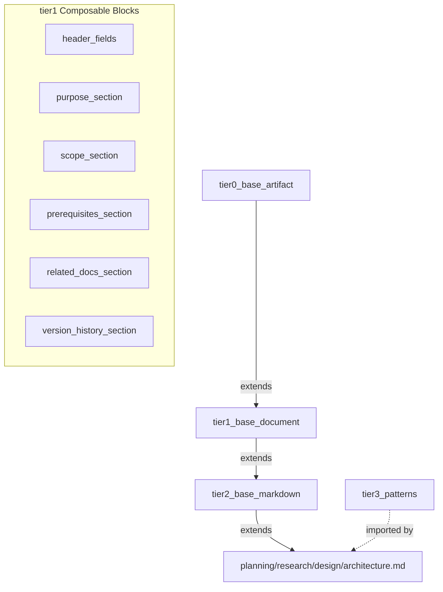
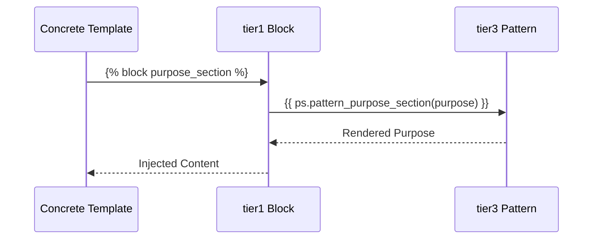
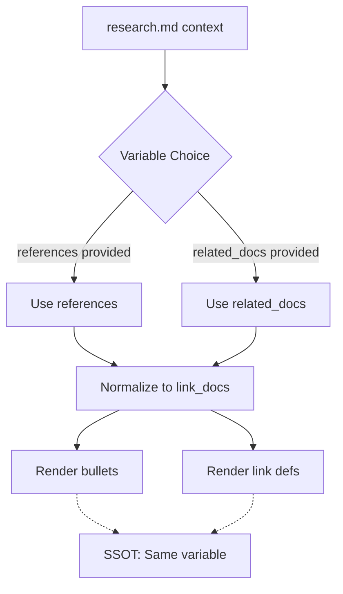

<!-- D:\dev\SimpleTraderV3\test_renders\architecture-template-library-example.md -->
<!-- template=architecture version=8b924f78 created=2026-02-05T22:07Z updated= -->
# template-library-compositie-architecture

**Status:** DEFINITIVE  
**Version:** 1.0  
**Last Updated:** 2026-02-05

---

## Purpose

Document stable architectural concepts for template library compositie system, explaining 4-tier hierarchy, pattern injection discipline, and SSOT principles.

## Scope

**In Scope:**
Architectural concepts for 4-tier template system. Pattern injection compositie discipline. CODE-tak vs DOCUMENT-tak parity principles. Whitespace control architecture. SSOT for context variables.

**Out of Scope:**
Implementation details (see source files). API reference (see reference.md when generated). Performance characteristics (assume negligible). Alternative architectures (committed to 4-tier + pattern injection).

## Prerequisites

Read these first:
1. Jinja2 template inheritance understanding
2. Block override mechanics knowledge
3. Whitespace control rules familiarity
---


## 1. 4-Tier Template Hierarchy



```


### 1.1. 


### 1.2. 


### 1.3. 


### 1.4. 


### 1.5. 


---


## 2. Pattern Injection Compositie



```


### 2.1. 


### 2.2. 


### 2.3. 


### 2.4. 


---


## 3. Whitespace Control Architecture


```mermaid
```mermaid
graph LR
    A[Title] --> B{header_fields block}
    B -->|{%- strip BEFORE| C[Status merged with title]
    B -->|{% no strip| D[Status on new line]
    D --> E[Clean output]
    C --> F[BUG: title**Status:**]
```
```


### 3.1. 


### 3.2. 


### 3.3. 


### 3.4. 


---


## 4. SSOT Context Variables



```


### 4.1. 


### 4.2. 


### 4.3. 


### 4.4. 


---

## Related Documentation
- **[TEMPLATE_LIBRARY_ARCHITECTURE.md][related-1]**
- **[TEMPLATE_COMPOSITION_DESIGN.md][related-2]**

<!-- Link definitions -->

[related-1]: TEMPLATE_LIBRARY_ARCHITECTURE.md
[related-2]: TEMPLATE_COMPOSITION_DESIGN.md

---

## Version History

| Version | Date | Author | Changes |
|---------|------|--------|---------|
| 1.0 | 2026-02-05 | Agent | Initial draft |